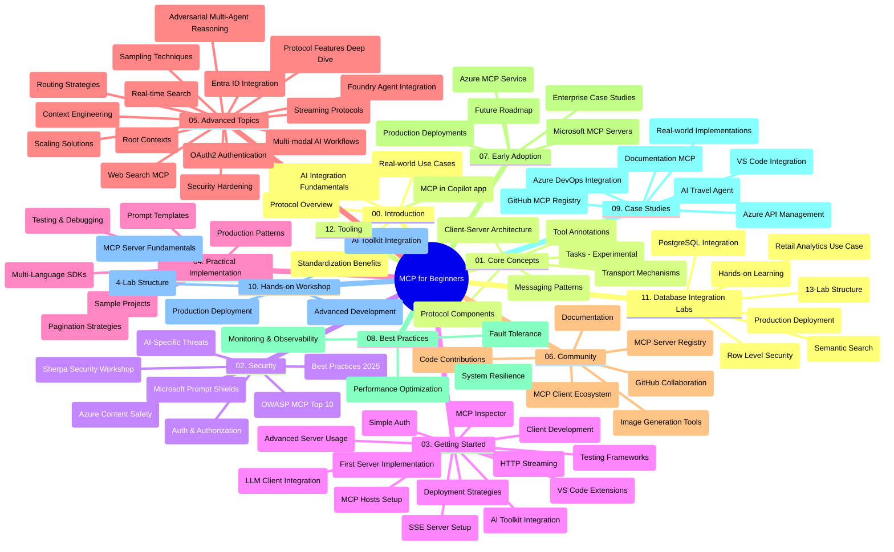

# Model Context Protocol (MCP) para sa mga Baguhan - Gabay sa Pag-aaral

Ang gabay sa pag-aaral na ito ay nagbibigay ng pangkalahatang-ideya ng istraktura at nilalaman ng repository para sa kurikulum na "Model Context Protocol (MCP) para sa mga Baguhan". Gamitin ang gabay na ito upang epektibong mag-navigate sa repository at sulitin ang mga magagamit na mapagkukunan.

## Pangkalahatang-ideya ng Repository

Ang Model Context Protocol (MCP) ay isang standardisadong balangkas para sa mga interaksiyon sa pagitan ng mga AI na modelo at mga client na aplikasyon. Orihinal na nilikha ng Anthropic, ang MCP ay ngayo'y pinamamahalaan ng mas malawak na komunidad ng MCP sa pamamagitan ng opisyal na GitHub na organisasyon. Ang repository na ito ay nagbibigay ng komprehensibong kurikulum na may mga praktikal na halimbawa ng code sa C#, Java, JavaScript, Python, at TypeScript, na dinisenyo para sa mga AI developer, arkitekto ng sistema, at mga software engineer.

## Visual Curriculum Map

## Istraktura ng Repository

Ang repository ay inayos sa labindalawang pangunahing seksyon, bawat isa ay nakatuon sa iba't ibang aspeto ng MCP:

1. **Panimula (00-Introduction/)**
   - Pangkalahatang-ideya ng Model Context Protocol
   - Bakit mahalaga ang standardisasyon sa mga AI pipeline
   - Praktikal na mga kaso ng paggamit at benepisyo

2. **Pangunahing Konsepto (01-CoreConcepts/)**
   - Arkitektura ng client-server
   - Pangunahing mga sangkap ng protocol
   - Mga pattern ng mensaheng ginagamit sa MCP
   - Kasalukuyang espesipikasyon: [Ano ang Nagbago sa MCP: Ang 2026-07-28 na Espesipikasyon](./01-CoreConcepts/mcp-2026-07-28.md) — ang stateless na core ng protocol, Extensions framework, at pagpapaubaya sa Roots/Sampling/Logging

3. **Seguridad (02-Security/)**
   - Mga banta sa seguridad sa mga sistemang MCP-based
   - Mga pinakamahusay na kasanayan para sa pag-secure ng mga implementasyon
   - Mga estratehiya sa pagpapatunay at awtorisasyon
   - Hands-on na [CIMD at DCR na sample ng awtorisasyon](./02-Security/samples/cimd-dcr-auth/README.md)
   - **Komprehensibong Dokumentasyon ng Seguridad**:
     - MCP Security Best Practices
     - Gabay sa Implementasyon ng Azure Content Safety
     - MCP Security Controls and Techniques
     - MCP Best Practices Quick Reference
   - **Mga Pangunahing Paksa sa Seguridad**:
     - Prompt injection at tool poisoning attacks
     - Session hijacking at confused deputy problems
     - Mga kahinaan sa token passthrough
     - Labis na mga permiso at kontrol sa pag-access
     - Seguridad ng supply chain para sa mga AI na sangkap
     - Integrasyon ng Microsoft Prompt Shields

4. **Pagsisimula (03-GettingStarted/)**
   - Pagsasaayos ng kapaligiran at configuration
   - Paggawa ng mga pangunahing MCP server at client
   - Integrasyon sa mga umiiral na aplikasyon
   - Kabilang ang mga seksyon para sa:
     - Unang implementasyon ng server
     - Pagbuo ng client
     - Integrasyon ng LLM client
     - Integrasyon ng VS Code
     - Server-Sent Events (SSE) server
     - Advanced na paggamit ng server
     - HTTP streaming
     - Integrasyon ng AI Toolkit
     - Mga estratehiya sa testing
     - Mga gabay sa deployment

5. **Praktikal na Implementasyon (04-PracticalImplementation/)**
   - Paggamit ng SDK sa iba't ibang programming language
   - Mga teknik sa debugging, testing, at pagpapatotoo
   - Pagbuo ng mga reusable na prompt template at workflow
   - Mga halimbawa ng proyekto na may mga example ng implementasyon

6. **Mga Advanced na Paksa (05-AdvancedTopics/)**
   - Mga teknik sa context engineering
   - Integrasyon ng Foundry agent
   - Multi-modal na AI workflows
   - Mga demo ng OAuth2 authentication
   - Mga kakayahan sa real-time na paghahanap
   - Real-time streaming
   - Implementasyon ng root contexts
   - Mga estratehiya sa routing
   - Mga teknik sa sampling
   - Mga pamamaraan sa scaling
   - Mga pagsasaalang-alang sa seguridad
   - Integrasyon ng Entra ID security
   - Integrasyon ng web search
   - Adversarial multi-agent reasoning (mga pattern ng debate)

7. **Kontribusyon ng Komunidad (06-CommunityContributions/)**
   - Paano mag-ambag ng code at dokumentasyon
   - Pakikipagtulungan sa pamamagitan ng GitHub
   - Mga pagpapahusay at feedback mula sa komunidad
   - Paggamit ng iba't ibang MCP client (Claude Desktop, Cline, VSCode)
   - Paggamit ng mga popular na MCP server kabilang ang pagbuo ng mga imahe

8. **Mga Aral mula sa Maagang Paggamit (07-LessonsfromEarlyAdoption/)**
   - Mga totoong implementasyon at kwento ng tagumpay
   - Pagbuo at pag-deploy ng mga solusyong MCP-based
   - Mga uso at roadmap sa hinaharap
   - **Microsoft MCP Servers Guide**: Komprehensibong gabay sa 10 production-ready na Microsoft MCP servers kabilang ang:
     - Microsoft Learn Docs MCP Server
     - Azure MCP Server (15+ na espesyalisadong connector)
     - GitHub MCP Server
     - Azure DevOps MCP Server
     - MarkItDown MCP Server
     - SQL Server MCP Server
     - Playwright MCP Server
     - Dev Box MCP Server
     - Microsoft Foundry MCP Server
     - Microsoft 365 Agents Toolkit MCP Server

9. **Pinakamahusay na Kasanayan (08-BestPractices/)**
   - Pag-tune ng performance at optimisasyon
   - Pagdidisenyo ng fault-tolerant na mga sistema ng MCP
   - Mga estratehiya sa testing at resilience

10. **Mga Case Study (09-CaseStudy/)**
    - **Pito na komprehensibong case study** na nagpapakita ng versatility ng MCP sa iba't ibang sitwasyon:
    - **Azure AI Travel Agents**: Multi-agent na orchestration gamit ang Azure OpenAI at AI Search
    - **Azure DevOps Integration**: Pag-automate ng mga workflow gamit ang mga update mula sa YouTube data
    - **Real-Time Documentation Retrieval**: Python console client na may streaming HTTP
    - **Interactive Study Plan Generator**: Chainlit web app na may conversational AI
    - **In-Editor Documentation**: Integrasyon sa VS Code gamit ang GitHub Copilot workflows
    - **Azure API Management**: Integrasyon ng enterprise API sa paglikha ng MCP server
    - **GitHub MCP Registry**: Ecosystem development at plataporma ng agentic integration
    - Mga example ng implementasyon na sumasaklaw sa enterprise integration, produktibidad ng developer, at pagbuo ng ekosistema

11. **Hands-on Workshop (10-StreamliningAIWorkflowsBuildingAnMCPServerWithAIToolkit/)**
    - Komprehensibong hands-on workshop na pinagsasama ang MCP sa AI Toolkit
    - Pagbuo ng mga matatalinong aplikasyon na nag-uugnay sa AI models at mga totoong gamit
    - Mga praktikal na module na sumasaklaw sa mga pundasyon, pagbuo ng custom server, at mga estratehiya sa production deployment
    - **Istraktura ng Lab**:
      - Lab 1: Mga Pundasyon ng MCP Server
      - Lab 2: Advanced na Pagbuo ng MCP Server
      - Lab 3: Integrasyon ng AI Toolkit
      - Lab 4: Production Deployment at Scaling
    - Paraan ng pagkatuto na nakabase sa lab na may step-by-step na mga tagubilin

12. **MCP Server Database Integration Labs (11-MCPServerHandsOnLabs/)**
    - **Komprehensibong 13-lab na learning path** para sa pagbuo ng production-ready na MCP servers na may PostgreSQL integration
    - **Totoong implementasyon ng retail analytics** gamit ang Zava Retail use case
    - **Pattern na pang-enterprise grade** kabilang ang Row Level Security (RLS), semantic search, at multi-tenant data access
    - **Kumpletong Istraktura ng Lab**:
      - **Mga Lab 00-03: Mga Pundasyon** - Panimula, Arkitektura, Seguridad, Setup ng Kapaligiran
      - **Mga Lab 04-06: Pagbuo ng MCP Server** - Disenyo ng Database, Implementasyon ng MCP Server, Pagbuo ng mga Tool
      - **Mga Lab 07-09: Mga Advanced na Katangian** - Semantic Search, Testing & Debugging, Integrasyon ng VS Code
      - **Mga Lab 10-12: Produksyon at Pinakamahusay na Kasayahan** - Deployment, Monitoring, Optimisasyon
    - **Mga Teknolohiyang Saklaw**: FastMCP framework, PostgreSQL, Azure OpenAI, Azure Container Apps, Application Insights
    - **Mga Kinalabasan sa Pagkatuto**: Production-ready MCP servers, mga pattern ng database integration, AI-powered analytics, seguridad pang-enterprise

13. **Tooling (12-tooling/)**
    - Alamin kung paano gamitin ang MCP sa Copilot app at iba pang mga tools

## Karagdagang Mga Mapagkukunan

Ang repository ay may kasama ring mga sumusuportang mapagkukunan:

- **Folder ng mga Imahe**: Nagtataglay ng mga diagram at ilustrasyon na ginamit sa buong kurikulum
- **Mga Pagsasalin**: Multi-language na suporta gamit ang automated na pagsasalin ng dokumentasyon
- **Opisyal na Mga Mapagkukunan ng MCP**:
  - [MCP Documentation](https://modelcontextprotocol.io/)
  - [MCP Specification](https://modelcontextprotocol.io/specification/2026-07-28/)
  - [MCP GitHub Repository](https://github.com/modelcontextprotocol)

## Paano Gamitin ang Repository na Ito

1. **Sunod-sunod na Pag-aaral**: Sundin ang mga kabanata nang sunud-sunod (00 hanggang 11) para sa isang estrukturadong karanasan ng pagkatuto.
2. **Nakatuon sa Tiyak na Wika**: Kung interesado ka sa isang partikular na programming language, tuklasin ang mga sample na direktoryo para sa mga implementasyon sa iyong nais na wika.
3. **Praktikal na Implementasyon**: Magsimula sa seksyong "Pagsisimula" para i-setup ang iyong kapaligiran at gumawa ng iyong unang MCP server at client.
4. **Advanced na Paggalugad**: Kapag komportable ka na sa mga pangunahing kaalaman, sumisid sa mga advanced na paksa upang palawakin ang iyong kaalaman.
5. **Pakikipag-ugnayan sa Komunidad**: Sumali sa MCP community sa pamamagitan ng mga diskusyon sa GitHub at Discord channels upang kumonekta sa mga eksperto at kapwa developer.

## MCP Clients at Mga Tools

Sakop ng kurikulum ang iba't ibang MCP clients at tools:

1. **Opisyal na mga Client**:
   - Visual Studio Code 
   - MCP sa Visual Studio Code
   - Claude Desktop
   - Claude sa VSCode 
   - Claude API

2. **Mga Client ng Komunidad**:
   - Cline (terminal-based)
   - Cursor (code editor)
   - ChatMCP
   - Windsurf

3. **Mga Tool sa Pamamahala ng MCP**:
   - MCP CLI
   - MCP Manager
   - MCP Linker
   - MCP Router

## Mga Popular na MCP Server

Ipinapakilala ng repository ang iba't ibang MCP servers, kabilang ang:

1. **Opisyal na Microsoft MCP Servers**:
   - Microsoft Learn Docs MCP Server
   - Azure MCP Server (15+ na espesyal na connector)
   - GitHub MCP Server
   - Azure DevOps MCP Server
   - MarkItDown MCP Server
   - SQL Server MCP Server
   - Playwright MCP Server
   - Dev Box MCP Server
   - Microsoft Foundry MCP Server
   - Microsoft 365 Agents Toolkit MCP Server

2. **Opisyal na Reference Servers**:
   - Filesystem
   - Fetch
   - Memory
   - Sequential Thinking

3. **Pagbuo ng Imahe**:
   - Azure OpenAI DALL-E 3
   - Stable Diffusion WebUI
   - Replicate

4. **Mga Tool sa Pag-develop**:
   - Git MCP
   - Terminal Control
   - Code Assistant

5. **Mga Espesyal na Server**:
   - Salesforce
   - Microsoft Teams
   - Jira & Confluence

## Pagbibigay Kontribusyon

Tinatanggap ng repository na ito ang mga kontribusyon mula sa komunidad. Tingnan ang seksyong Community Contributions para sa gabay kung paano epektibong makapag-ambag sa MCP ecosystem.

----

*Ang gabay sa pag-aaral na ito ay huling na-update noong Setyembre 9, 2026. Ipinapakita nito ang MCP
Espesipikasyon `2026-07-28`, ang kasalukuyang rebisyon ng protocol. Ang ilang hands-on
na mga halimbawa ay nananatiling may espesipikong bersyon sa `2025-11-25` habang ang kanilang mga SDK at mga tool
ay gumagamit ng stateless protocol APIs.*

---

<!-- CO-OP TRANSLATOR DISCLAIMER START -->
**Pagtatanggi**:
Ang dokumentong ito ay isinalin gamit ang serbisyo ng AI translation na [Co-op Translator](https://github.com/Azure/co-op-translator). Bagama't nagsusumikap kami para sa katumpakan, pakatandaan na ang awtomatikong pagsasalin ay maaaring maglaman ng mga pagkakamali o hindi pagkakatugma. Ang orihinal na dokumento sa orihinal nitong wika ang dapat ituring na pangunahing sanggunian. Para sa mahahalagang impormasyon, inirerekomenda ang propesyonal na pagsasalin ng tao. Hindi kami mananagot sa anumang maling pagkakaintindi o maling interpretasyon na nagmula sa paggamit ng pagsasaling ito.
<!-- CO-OP TRANSLATOR DISCLAIMER END -->