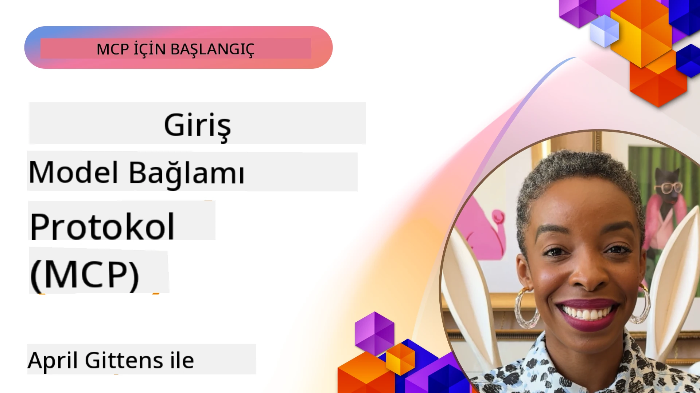
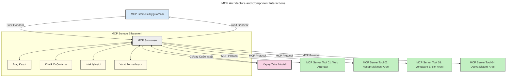
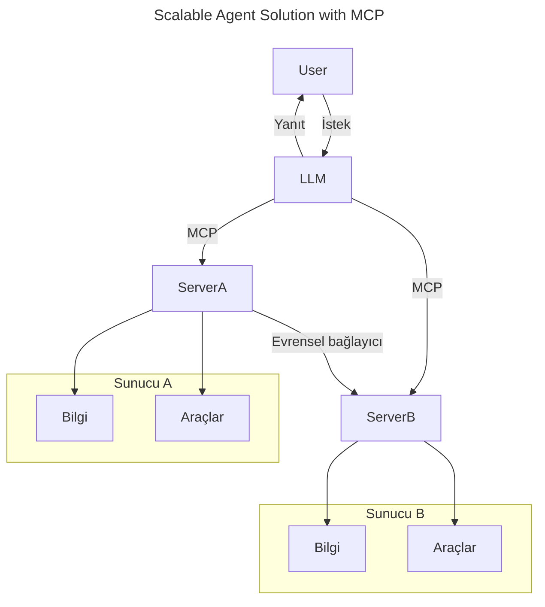
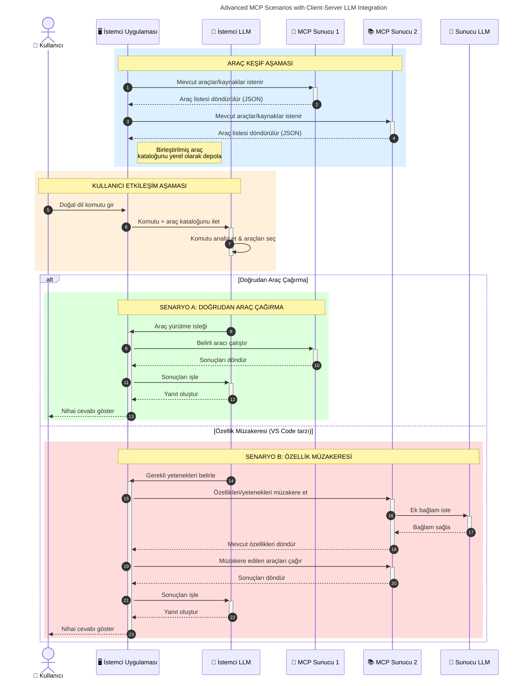

# Model Context Protocol (MCP) Tanıtımı: Ölçeklenebilir AI Uygulamaları İçin Neden Önemlidir?

_(Bu dersin videosunu izlemek için yukarıdaki resme tıklayın)_

Üretken AI uygulamaları, kullanıcıların doğal dil komutlarıyla uygulama ile etkileşime girmesine sıklıkla olanak sağladığından büyük bir ilerlemedir. Ancak bu tür uygulamalara daha fazla zaman ve kaynak yatırıldıkça, işlevsellikleri ve kaynakları kolayca entegre edebildiğinizden, birden fazla modelin kullanılmasına hizmet edebildiğinizden ve çeşitli model inceliklerini yönetebildiğinizden emin olmak istersiniz. Kısacası, Üretken AI uygulamaları oluşturmak başlangıçta kolaydır ancak büyüdükçe ve daha karmaşık hale geldikçe bir mimari tanımlamaya başlamanız gerekir ve uygulamalarınızın tutarlı şekilde inşa edilmesini sağlamak için muhtemelen bir standarda dayanmanız gerekecektir. İşte MCP burada devreye girerek işleri düzenler ve bir standart sağlar.

---

## **🔍 Model Context Protocol (MCP) Nedir?**

**Model Context Protocol (MCP)**, Büyük Dil Modellerinin (LLM'ler) dış araçlar, API'ler ve veri kaynakları ile sorunsuz şekilde etkileşim kurmasını sağlayan **açık, standartlaştırılmış bir arayüzdür**. AI model işlevselliğini eğitim verilerinin ötesinde artırmak için tutarlı bir mimari sağlar ve daha akıllı, ölçeklenebilir ve daha tepki veren AI sistemleri oluşturulmasına imkan tanır.

---

## **🎯 AI’da Standardizasyon Neden Önemlidir**

Üretken AI uygulamaları daha karmaşık hale geldikçe, **ölçeklenebilirlik, genişletilebilirlik, sürdürülebilirlik** ve **satıcı bağımlılığından kaçınma** sağlayan standartların benimsenmesi esastır. MCP bu ihtiyaçları şu yollarla karşılar:

- Model-aracı entegrasyonlarını birleştirir
- Kırılgan, tek seferlik özel çözümleri azaltır
- Bir ekosistem içinde birden fazla farklı satıcıdan modelin birlikte var olmasına izin verir

**Not:** MCP kendisini açık standart olarak tanımlasa da, IEEE, IETF, W3C, ISO veya başka bir standart kuruluşu tarafından standartlaştırılması için bir plan yoktur.

---

## **📚 Öğrenme Hedefleri**

Bu makalenin sonunda şunları öğrenmiş olacaksınız:

- **Model Context Protocol (MCP)**’yi ve kullanım durumlarını tanımlamak
- MCP’nin modelden araca iletişimi nasıl standartlaştırdığını anlamak
- MCP mimarisinin temel bileşenlerini belirlemek
- MCP’nin kurumsal ve geliştirme bağlamlarında gerçek dünya uygulamalarını keşfetmek

---

## **💡 Model Context Protocol (MCP) Neden Oyun Değiştiricidir?**

### **🔗 MCP AI Etkileşimlerindeki Parçalanmayı Çözüyor**

MCP öncesinde, modelleri araçlarla entegre etmek için:

- Araç-model çiftleri için özel kod yazmak
- Her satıcı için standart dışı API’ler kullanmak
- Güncellemeler nedeniyle sık kesintiler yaşamak
- Daha fazla araçla kötü ölçeklenebilirlik

### **✅ MCP Standardizasyonunun Faydaları**

| **Fayda**                   | **Açıklama**                                                                 |
|-----------------------------|-------------------------------------------------------------------------------|
| Birlikte Çalışabilirlik     | LLM'ler farklı satıcıların araçlarıyla sorunsuz çalışır                      |
| Tutarlılık                  | Platformlar ve araçlar arasında tek tip davranış                            |
| Yeniden Kullanılabilirlik   | Bir kez oluşturulan araçlar projeler ve sistemler arasında kullanılabilir    |
| Hızlandırılmış Geliştirme   | Standart, tak-çalıştır arayüzler sayesinde geliştirme süresini azaltır      |

---

## **🧱 Yüksek Seviyeli MCP Mimari Genel Bakışı**

MCP, **istemci-sunucu modeli** izler, burada:

- **MCP Host’ları** AI modellerini çalıştırır
- **MCP İstemcileri** istekleri başlatır
- **MCP Sunucuları** bağlam, araçlar ve yetenekler sağlar

### **Temel Bileşenler:**

- **Kaynaklar** – Model için statik veya dinamik veriler  
- **Komutlar** – Yönlendirilmiş üretim için önceden tanımlanmış iş akışları  
- **Araçlar** – Arama, hesaplama gibi çalıştırılabilir fonksiyonlar  
- **Örneklem** – Yinelemeli etkileşimlerle ajan davranışı (MCP `2026-07-28`'de kullanımdan kaldırıldı; yeni uygulamalar doğrudan bir LLM sağlayıcı ile entegre olmalıdır)

- **Dışavurum** – Kullanıcı girdisi için sunucu tarafından başlatılan isteklere olanak tanır
- **Kökler** – Sunucu ile ilgili bilgilendirici dosya sistem yerleri (MCP `2026-07-28`'de kullanımdan kaldırıldı; araç parametreleri, kaynak URI’leri veya sunucu yapılandırması tercih edilir)

### **Protokol Mimarisi:**

MCP, iki katmanlı bir mimari kullanır:
- **Veri Katmanı**: JSON-RPC 2.0 mesajları, istek başına meta veriler, keşif ve protokol değişkenleri

- **Taşıma Katmanı**: Yerel alt süreçler için stdio ve uzak sunucular için Streamable HTTP. Streamable HTTP, akışlı cevaplar için SSE çerçevesini kullanabilir, ancak önceki HTTP+SSE taşıması kullanımdan kaldırılmıştır.

---

## MCP Sunucuları Nasıl Çalışır

MCP sunucuları şu şekilde çalışır:

- **İstek Akışı**:
    1. Bir istek, son kullanıcı veya onların adına hareket eden yazılım tarafından başlatılır.
    2. **MCP İstemcisi** isteği, AI Model çalışma zamanı yöneten bir **MCP Host**'a gönderir.
    3. **AI Modeli**, kullanıcı komutunu alır ve bir veya daha fazla araç çağrısıyla dış araçlara veya verilere erişim isteyebilir.
    4. **MCP Host**, model doğrudan değil, standartlaştırılmış protokolü kullanarak ilgili **MCP Sunucularıyla** iletişim kurar.
- **MCP Host İşlevleri**:
    - **Araç Kaydı**: Mevcut araçların ve yeteneklerinin kataloğunu tutar.
    - **Doğrulama**: Araç erişim izinlerini doğrular.
    - **İstek Yöneticisi**: Modelden gelen araç isteklerini işler.
    - **Yanıt Formatlayıcı**: Araç çıktılarını modelin anlayabileceği biçime dönüştürür.
- **MCP Sunucu Yürütmesi**:
    - **MCP Host**, araç çağrılarını bir veya daha fazla özel işlevler sunan **MCP Sunucularına** yönlendirir (örneğin, arama, hesaplamalar, veri tabanı sorguları).
    - **MCP Sunucuları**, ilgili işlemleri yapar ve sonuçları tutarlı bir formatta **MCP Host**'a geri döner.
    - **MCP Host**, bu sonuçları biçimlendirir ve **AI Modeline** iletir.
- **Yanıtın Tamamlanması**:
    - **AI Modeli**, araç çıkışlarını son yanıta dahil eder.
    - **MCP Host**, bu yanıtı **MCP İstemcisine** gönderir; istemci de bunu son kullanıcıya veya çağrı yapan yazılıma iletir.
    

## 👨‍💻 MCP Sunucusu Nasıl Kurulur (Örneklerle)

MCP sunucuları, LLM yeteneklerini veri ve fonksiyonlar sunarak genişletmenizi sağlar.

Denemeye hazır mısınız? İşte farklı dillerde/stack’lerde basit MCP sunucuları oluşturmak için örneklerle dil ve/veya stack’e özgü SDK’lar:

- **Python SDK**: https://github.com/modelcontextprotocol/python-sdk

- **TypeScript SDK**: https://github.com/modelcontextprotocol/typescript-sdk

- **Java SDK**: https://github.com/modelcontextprotocol/java-sdk

- **C#/.NET SDK**: https://github.com/modelcontextprotocol/csharp-sdk

## 🌍 MCP’nin Gerçek Dünya Kullanım Alanları

MCP, AI yeteneklerini genişleterek çok çeşitli uygulamalara olanak tanır:

| **Uygulama**                     | **Açıklama**                                                                  |
|--------------------------------|-------------------------------------------------------------------------------|
| Kurumsal Veri Entegrasyonu      | LLM’leri veri tabanlarına, CRM’lere veya dahili araçlara bağlama             |
| Ajanik AI Sistemleri            | Araç erişimi ve karar alma iş akışları olan otonom ajanlara izin verme       |
| Çok-Modlu Uygulamalar           | Metin, resim ve ses araçlarını tek bir birleşik AI uygulaması içinde birleştirme |
| Gerçek Zamanlı Veri Entegrasyonu| Canlı verileri AI etkileşimlerine getirerek daha doğru, güncel çıktılar alma  |

### 🧠 MCP = AI Etkileşimleri İçin Evrensel Standart

Model Context Protocol (MCP), tıpkı USB-C’nin cihazlar için fiziksel bağlantıları standartlaştırması gibi AI etkileşimleri için evrensel bir standart görevi görür. AI dünyasında MCP, modellerin (istemciler) dış araçlar ve veri sağlayıcıları (sunucular) ile sorunsuz entegrasyon sağlamasına olanak tanıyan tutarlı bir arayüz sağlar. Bu, her API veya veri kaynağı için farklı özel protokollere ihtiyaç duyulmasını ortadan kaldırır.

MCP altında, MCP uyumlu bir araç (MCP sunucusu olarak adlandırılır), birleşik bir standartı izler. Bu sunucular sundukları araçları veya eylemleri listeleyebilir ve bir AI ajanı tarafından talep edildiğinde bu eylemleri gerçekleştirebilir. MCP destekleyen AI ajan platformları, sunuculardan mevcut araçları keşfedebilir ve bunları bu standart protokol aracılığıyla çağırabilir.

### 💡 Bilgiye Erişimi Kolaylaştırır

Araçlar sunmanın yanında, MCP ayrıca bilgiye erişimi kolaylaştırır. Uygulamaların büyük dil modellerine (LLM'lere) bağlam sağlayabilmesi için onları çeşitli veri kaynaklarına bağlamasına olanak tanır. Örneğin, bir MCP sunucusu bir şirketin belge deposunu temsil edebilir ve böylece ajanlar talep üzerine ilgili bilgileri alabilir. Başka bir sunucu, e-posta gönderme veya kayıt güncelleme gibi belirli eylemleri gerçekleştirebilir. Ajan bakış açısında bunlar sadece kullanabileceği araçlardır — bazı araçlar veri (bilgi bağlamı) dönerken, diğerleri eylem yapar. MCP her ikisini de verimli şekilde yönetir.

Bir ajan MCP sunucusuna bağlandığında, sunucunun mevcut yeteneklerini ve erişilebilir verileri standart bir format aracılığıyla otomatik olarak öğrenir. Bu standartizasyon dinamik araç kullanılabilirliğini mümkün kılar. Örneğin, bir ajanın sistemine yeni bir MCP sunucusu eklemek, onun fonksiyonlarının hemen kullanılabilir olmasını sağlar; ajanın talimatlarında ek özelleştirme gerekmez.

Bu düzenlenmiş entegrasyon, sunucuların hem araçları hem de bilgileri sağladığı ve sistemler arası sorunsuz işbirliğini garantilediği aşağıdaki diyagramda gösterilen akışla uyumludur.

### 👉 Örnek: Ölçeklenebilir Ajan Çözümü

Evrensel Bağlayıcı, MCP sunucularının birbirleriyle iletişim kurmasını ve yeteneklerini paylaşmasını sağlar; böylece ServerA görevleri ServerB’ye devredebilir veya onun araçlarına ve bilgisine erişebilir. Bu, araçların ve verilerin sunucular arasında federasyonuna izin vererek ölçeklenebilir ve modüler ajan mimarilerini destekler. MCP araç sunumunu standartlaştırdığından, ajanlar sabit kodlu entegrasyonlara gerek kalmadan sunucular arasında dinamik olarak araçları keşfedebilir ve istekleri yönlendirebilir.

Araç ve bilgi federasyonu: Araçlar ve verilere sunucular arasında erişim sağlanabilir, bu da daha ölçeklenebilir ve modüler ajan mimarilerini mümkün kılar.

### 🔄 İstemci Tarafı LLM Entegrasyonuyla İleri MCP Senaryoları

Temel MCP mimarisinin ötesinde, hem istemci hem sunucu tarafında LLM’lerin bulunduğu daha karmaşık etkileşimleri mümkün kılan ileri senaryolar vardır. Aşağıdaki diyagramda, **İstemci Uygulaması** kullanıcının LLM tarafından kullanılabilecek bir dizi MCP aracı bulunan bir IDE olabilir:

## 🔐 MCP’nin Pratik Faydaları

MCP kullanmanın pratik faydaları şunlardır:

- **Güncellik**: Modeller, eğitim verilerinin ötesinde en güncel bilgilere erişebilir
- **Yetenek Genişletme**: Modeller, eğitilmedikleri görevler için özel araçlardan yararlanabilir
- **Azaltılmış Halüsinasyonlar**: Dış veri kaynakları gerçekçi temel sağlar
- **Gizlilik**: Hassas veriler komutlara gömülmek yerine güvenli ortamlarda kalabilir

## 📌 Ana Noktalar

MCP kullanımı için ana noktalar şunlardır:

- **MCP**, AI modellerinin araçlar ve verilerle nasıl etkileşime girdiğini standartlaştırır
- **Genişletilebilirlik, tutarlılık ve birlikte çalışabilirliği** teşvik eder
- MCP, **geliştirme süresini azaltmaya, güvenilirliği artırmaya ve model yeteneklerini genişletmeye** yardımcı olur
- İstemci-sunucu mimarisi **esnek, genişletilebilir AI uygulamalarını** etkinleştirir

## 🧠 Egzersiz

İnşa etmek istediğiniz bir AI uygulamasını düşünün.

- Hangi **dış araçlar veya veriler** yeteneklerini artırabilir?
- MCP entegrasyonu **nasıl daha basit ve daha güvenilir hale getirebilir?**

## Ek Kaynaklar

- [MCP GitHub Deposu](https://github.com/modelcontextprotocol)

## Sırada Ne Var

Sonraki: [Bölüm 1: Temel Kavramlar](../01-CoreConcepts/README.md)

---

<!-- CO-OP TRANSLATOR DISCLAIMER START -->
**Feragatname**:
Bu belge, AI çeviri hizmeti [Co-op Translator](https://github.com/Azure/co-op-translator) kullanılarak çevrilmiştir. Doğruluk için çaba sarf etsek de, otomatik çevirilerin hata veya yanlışlık içerebileceğini lütfen unutmayınız. Orijinal belge, kendi dilinde yetkili kaynak olarak kabul edilmelidir. Kritik bilgiler için profesyonel insan çevirisi önerilir. Bu çevirinin kullanımı sonucu ortaya çıkabilecek yanlış anlamalardan veya yanlış yorumlamalardan sorumlu değiliz.
<!-- CO-OP TRANSLATOR DISCLAIMER END -->