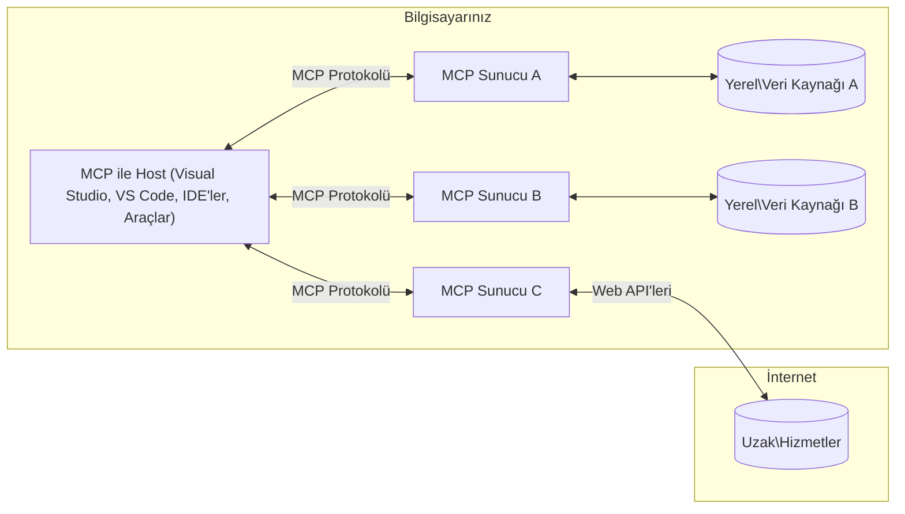

# MCP Temel Kavramları: Yapay Zeka Entegrasyonu için Model Bağlam Protokolünde Ustalaşma

[](https://youtu.be/earDzWGtE84)

_(Bu dersin videosunu izlemek için yukarıdaki resme tıklayın)_

[Model Bağlam Protokolü (MCP)](https://github.com/modelcontextprotocol), Büyük Dil Modelleri (LLM'ler) ile dış araçlar, uygulamalar ve veri kaynakları arasındaki iletişimi optimize eden güçlü, standartlaştırılmış bir çerçevedir.  
Bu rehber, MCP'nin temel kavramlarını size adım adım anlatacaktır. İstemci-sunucu mimarisi, temel bileşenler, iletişim mekanikleri ve uygulama en iyi uygulamaları hakkında bilgi edineceksiniz.

- **Açık Kullanıcı Onayı**: Tüm veri erişimi ve işlemler, yürütülmeden önce açık kullanıcı onayı gerektirir. Kullanıcılar, hangi verilere erişileceğini ve hangi işlemlerin yapılacağını net bir şekilde anlamalı, izinler ve yetkilendirmeler üzerinde ayrıntılı kontrol sahibi olmalıdır.

- **Veri Gizliliği Koruması**: Kullanıcı verileri yalnızca açık onay ile paylaşılır ve tüm etkileşim süresi boyunca güçlü erişim kontrolleri ile korunmalıdır. Uygulamalar yetkisiz veri iletimini engellemeli ve sıkı gizlilik sınırlarını korumalıdır.

- **Araç Çalıştırma Güvenliği**: Her araç çağrısı, aracın işlevselliği, parametreleri ve olası etkileri hakkında net anlayışla açık kullanıcı onayı gerektirir. Güçlü güvenlik sınırları, istenmeyen, güvensiz veya kötü niyetli araç çalıştırmalarını engellemelidir.

- **Taşıma Katmanı Güvenliği**: Tüm iletişim kanalları uygun şifreleme ve kimlik doğrulama mekanizmaları kullanmalıdır. Uzaktan bağlantılar güvenli taşıma protokolleri ve uygun kimlik bilgisi yönetimi ile sağlanmalıdır.

#### Uygulama Kılavuzları:

- **İzin Yönetimi**: Kullanıcıların hangi sunuculara, araçlara ve kaynaklara erişebileceğini kontrol etmelerini sağlayan ince taneli izin sistemleri uygulayın  
- **Kimlik Doğrulama & Yetkilendirme**: Güvenli kimlik doğrulama yöntemleri (OAuth, API anahtarları) kullanın, uygun token yönetimi ve süresi dolma mekanizmaları ile  
- **Girdi Doğrulama**: Tüm parametreleri ve veri girişlerini tanımlı şemalara göre doğrulayarak enjeksiyon saldırılarını önleyin  
- **Denetim Kaydı**: Güvenlik izleme ve uyumluluk için tüm işlemlerin kapsamlı kayıtlarını tutun  

## Genel Bakış

Bu ders, Model Bağlam Protokolü (MCP) ekosistemini oluşturan temel mimari ve bileşenleri keşfeder. MCP etkileşimlerini güçlendiren istemci-sunucu mimarisi, ana bileşenler ve iletişim mekanizmaları hakkında bilgi edineceksiniz.

## Temel Öğrenme Hedefleri

Bu dersin sonunda:

- MCP istemci-sunucu mimarisini anlayacaksınız.  
- Host, İstemci ve Sunucu rollerini ve sorumluluklarını tanımlayacaksınız.  
- MCP'yi esnek bir entegrasyon katmanı yapan temel özellikleri analiz edeceksiniz.  
- MCP ekosisteminde bilgi akışını öğreneceksiniz.  
- .NET, Java, Python ve JavaScript ile kod örnekleri üzerinden pratik bilgiler edineceksiniz.  

## MCP Mimarisi: Daha Derin Bir Bakış

MCP ekosistemi, istemci-sunucu modeli üzerine kuruludur. Bu modüler yapı, yapay zeka uygulamalarının araçlar, veritabanları, API'ler ve bağlamsal kaynaklarla verimli şekilde etkileşim kurmasını sağlar. Bu mimariyi temel bileşenlerine ayıralım.

MCP temelde, bir host uygulamanın birden fazla sunucuya bağlanabildiği istemci-sunucu mimarisini takip eder:


- **MCP Hostları**: VSCode, Claude Desktop, IDE'ler veya MCP üzerinden veri erişmek isteyen yapay zeka araçları gibi programlar  
- **MCP İstemcileri**: Sunucularla 1:1 bağlantılar kuran protokol istemcileri  
- **MCP Sunucuları**: Standart Model Bağlam Protokolü aracılığıyla belirli yetenekleri sunan hafif programlar  
- **Yerel Veri Kaynakları**: MCP sunucularının güvenli şekilde erişebildiği bilgisayarınızdaki dosyalar, veritabanları ve servisler  
- **Uzak Servisler**: MCP sunucularının API'ler aracılığıyla bağlanabildiği internet üzerindeki dış sistemler  

MCP Protokolü, tarih tabanlı sürümleme (YYYY-AA-GG formatı) kullanan gelişmekte olan bir standarttır. Mevcut protokol sürümü **2025-11-25**'tir. En son güncellemeleri [protokol spesifikasyonunda](https://modelcontextprotocol.io/specification/2025-11-25/) görebilirsiniz.

### 1. Hostlar

Model Bağlam Protokolü'nde (MCP), **Hostlar** kullanıcıların protokolle etkileşim kurduğu birincil arayüz olarak hizmet veren yapay zeka uygulamalarıdır. Hostlar, her sunucu bağlantısı için özel MCP istemcileri oluşturarak birden fazla MCP sunucusuna bağlantıları koordine ve yönetir. Hostlara örnekler:

- **Yapay Zeka Uygulamaları**: Claude Desktop, Visual Studio Code, Claude Code  
- **Geliştirme Ortamları**: MCP entegrasyonlu IDE'ler ve kod editörleri  
- **Özel Uygulamalar**: Amaç odaklı yapay zeka ajanları ve araçlar  

**Hostlar**, yapay zeka model etkileşimlerini koordine eden uygulamalardır. Onlar:

- **Yapay Zeka Modellerini Yönlendirir**: Yanıt üretmek ve yapay zeka iş akışlarını koordine etmek için LLM'leri çalıştırır veya onlarla etkileşir  
- **İstemci Bağlantılarını Yönetir**: Her MCP sunucu bağlantısı için bir MCP istemcisi oluşturur ve sürdürür  
- **Kullanıcı Arayüzünü Kontrol Eder**: Konuşma akışını, kullanıcı etkileşimlerini ve yanıt sunumunu yönetir  
- **Güvenliği Uygular**: İzinleri, güvenlik kısıtlamalarını ve kimlik doğrulamayı kontrol eder  
- **Kullanıcı Onayını Yönetir**: Veri paylaşımı ve araç çalıştırma için kullanıcı onayını yönetir  

### 2. İstemciler

**İstemciler**, Hostlar ile MCP sunucuları arasında özel bire bir bağlantılar kuran temel bileşenlerdir. Her MCP istemcisi, belirli bir MCP sunucusuna bağlanmak için Host tarafından başlatılır ve organize, güvenli iletişim kanalları sağlar. Birden fazla istemci, Hostların aynı anda birden fazla sunucuya bağlanmasını mümkün kılar.

**İstemciler**, host uygulama içindeki bağlantı bileşenleridir. Onlar:

- **Protokol İletişimi**: Sunuculara JSON-RPC 2.0 istekleri gönderir, istem ve talimatları iletir  
- **Yetenek Müzakeresi**: Başlatma sırasında sunucularla desteklenen özellikler ve protokol sürümleri üzerinde anlaşır  
- **Araç Çalıştırma**: Modellerden gelen araç çalıştırma isteklerini yönetir ve yanıtları işler  
- **Gerçek Zamanlı Güncellemeler**: Sunuculardan gelen bildirimleri ve gerçek zamanlı güncellemeleri ele alır  
- **Yanıt İşleme**: Sunucu yanıtlarını işler ve kullanıcıya gösterim için biçimlendirir  

### 3. Sunucular

**Sunucular**, MCP istemcilerine bağlam, araçlar ve yetenekler sağlayan programlardır. Yerel (Host ile aynı makinede) veya uzak (dış platformlarda) çalışabilirler ve istemci isteklerini işleyip yapılandırılmış yanıtlar sunmaktan sorumludurlar. Sunucular, standart Model Bağlam Protokolü aracılığıyla belirli işlevsellikleri açığa çıkarır.

**Sunucular**, bağlam ve yetenek sağlayan servislerdir. Onlar:

- **Özellik Kaydı**: İstemcilere mevcut ilkel (kaynaklar, istemler, araçlar) öğeleri kaydeder ve sunar  
- **İstek İşleme**: İstemcilerden gelen araç çağrıları, kaynak istekleri ve istem isteklerini alır ve yürütür  
- **Bağlam Sağlama**: Model yanıtlarını geliştirmek için bağlamsal bilgi ve veri sağlar  
- **Durum Yönetimi**: Oturum durumunu korur ve gerektiğinde durumlu etkileşimleri yönetir  
- **Gerçek Zamanlı Bildirimler**: Bağlı istemcilere yetenek değişiklikleri ve güncellemeler hakkında bildirim gönderir  

Sunucular, model yeteneklerini özel işlevsellikle genişletmek için herkes tarafından geliştirilebilir ve hem yerel hem de uzak dağıtım senaryolarını destekler.

### 4. Sunucu İlkeleri

Model Bağlam Protokolü (MCP) sunucuları, istemciler, hostlar ve dil modelleri arasında zengin etkileşimlerin temel yapı taşlarını tanımlayan üç temel **ilkeyi** sağlar. Bu ilkeler, protokol aracılığıyla sunulan bağlamsal bilgi ve eylem türlerini belirtir.

MCP sunucuları aşağıdaki üç temel ilkenin herhangi bir kombinasyonunu açığa çıkarabilir:

#### Kaynaklar

**Kaynaklar**, yapay zeka uygulamalarına bağlamsal bilgi sağlayan veri kaynaklarıdır. Model anlayışını ve karar vermeyi geliştirebilecek statik veya dinamik içeriği temsil ederler:

- **Bağlamsal Veri**: Yapay zeka modeli tüketimi için yapılandırılmış bilgi ve bağlam  
- **Bilgi Tabanları**: Doküman depoları, makaleler, kılavuzlar ve araştırma makaleleri  
- **Yerel Veri Kaynakları**: Dosyalar, veritabanları ve yerel sistem bilgileri  
- **Dış Veri**: API yanıtları, web servisleri ve uzak sistem verileri  
- **Dinamik İçerik**: Dış koşullara bağlı olarak güncellenen gerçek zamanlı veriler  

Kaynaklar URI ile tanımlanır ve `resources/list` ile keşfedilip `resources/read` ile alınabilir:

```text
file://documents/project-spec.md
database://production/users/schema
api://weather/current
```

#### İstemler

**İstemler**, dil modelleriyle etkileşimleri yapılandırmaya yardımcı olan yeniden kullanılabilir şablonlardır. Standartlaştırılmış etkileşim kalıpları ve şablonlu iş akışları sağlarlar:

- **Şablon Tabanlı Etkileşimler**: Önceden yapılandırılmış mesajlar ve konuşma başlatıcıları  
- **İş Akışı Şablonları**: Yaygın görevler ve etkileşimler için standart diziler  
- **Az Örnekli Örnekler**: Model talimatı için örnek tabanlı şablonlar  
- **Sistem İstemleri**: Model davranışını ve bağlamını tanımlayan temel istemler  
- **Dinamik Şablonlar**: Belirli bağlamlara uyum sağlayan parametreli istemler  

İstemler değişken yer değiştirmeyi destekler ve `prompts/list` ile keşfedilip `prompts/get` ile alınabilir:

```markdown
Generate a {{task_type}} for {{product}} targeting {{audience}} with the following requirements: {{requirements}}
```

#### Araçlar

**Araçlar**, yapay zeka modellerinin belirli eylemleri gerçekleştirmek için çağırabileceği çalıştırılabilir fonksiyonlardır. MCP ekosisteminin "fiilleri" olarak işlev görür, modellerin dış sistemlerle etkileşim kurmasını sağlar:

- **Çalıştırılabilir Fonksiyonlar**: Modellerin belirli parametrelerle çağırabileceği ayrık işlemler  
- **Dış Sistem Entegrasyonu**: API çağrıları, veritabanı sorguları, dosya işlemleri, hesaplamalar  
- **Benzersiz Kimlik**: Her aracın kendine özgü adı, açıklaması ve parametre şeması vardır  
- **Yapılandırılmış Girdi/Çıktı**: Araçlar doğrulanmış parametreleri kabul eder ve yapılandırılmış, tipli yanıtlar döner  
- **Eylem Yetkinlikleri**: Modellerin gerçek dünya eylemleri gerçekleştirmesini ve canlı veri almasını sağlar  

Araçlar, parametre doğrulaması için JSON Şeması ile tanımlanır, `tools/list` ile keşfedilir ve `tools/call` ile çalıştırılır:

```typescript
server.tool(
  "search_products", 
  {
    query: z.string().describe("Search query for products"),
    category: z.string().optional().describe("Product category filter"),
    max_results: z.number().default(10).describe("Maximum results to return")
  }, 
  async (params) => {
    // Arama yap ve yapılandırılmış sonuçları döndür
    return await productService.search(params);
  }
);
```

## İstemci İlkeleri

Model Bağlam Protokolü'nde (MCP), **istemciler**, sunucuların host uygulamadan ek yetenekler talep etmesini sağlayan ilkelere sahip olabilir. Bu istemci tarafı ilkeler, AI model yeteneklerine ve kullanıcı etkileşimlerine erişebilen daha zengin, etkileşimli sunucu uygulamalarına olanak tanır.

### Örnekleme

**Örnekleme**, sunucuların istemcinin yapay zeka uygulamasından dil modeli tamamlama istekleri yapmasını sağlar. Bu ilke, sunucuların kendi model bağımlılıklarını gömmeden LLM yeteneklerine erişmesini mümkün kılar:

- **Model Bağımsız Erişim**: Sunucular, LLM SDK'ları dahil etmeden veya model erişimini yönetmeden tamamlama isteyebilir  
- **Sunucu Başlatmalı Yapay Zeka**: Sunucuların istemcinin yapay zeka modeliyle otonom içerik üretmesini sağlar  
- **Özyinelemeli LLM Etkileşimleri**: Sunucuların işlem için yapay zeka yardımı gerektiği karmaşık senaryoları destekler  
- **Dinamik İçerik Üretimi**: Sunucuların hostun modeliyle bağlamsal yanıtlar oluşturmasına olanak tanır  

Örnekleme, sunucuların istemcilere tamamlama istekleri gönderdiği `sampling/complete` yöntemiyle başlatılır.

### Bilgi Toplama

**Bilgi Toplama**, sunucuların istemci arayüzü üzerinden kullanıcılardan ek bilgi veya onay istemesini sağlar:

- **Kullanıcı Girdi Talepleri**: Sunucular, araç çalıştırma için gereken ek bilgileri isteyebilir  
- **Onay Diyalogları**: Hassas veya etkili işlemler için kullanıcı onayı talep eder  
- **Etkileşimli İş Akışları**: Sunucuların adım adım kullanıcı etkileşimleri oluşturmasını sağlar  
- **Dinamik Parametre Toplama**: Araç çalıştırma sırasında eksik veya isteğe bağlı parametreleri toplar  

Bilgi toplama istekleri, istemcinin arayüzü üzerinden kullanıcı girdisi toplamak için `elicitation/request` yöntemiyle yapılır.

### Kayıt Tutma

**Kayıt Tutma**, sunucuların hata ayıklama, izleme ve operasyonel görünürlük için istemcilere yapılandırılmış günlük mesajları göndermesini sağlar:

- **Hata Ayıklama Desteği**: Sunucuların sorun giderme için ayrıntılı yürütme günlükleri sağlamasını mümkün kılar  
- **Operasyonel İzleme**: Durum güncellemeleri ve performans metriklerini istemcilere gönderir  
- **Hata Raporlama**: Ayrıntılı hata bağlamı ve tanısal bilgileri sağlar  
- **Denetim İzleri**: Sunucu işlemleri ve kararlarının kapsamlı kayıtlarını oluşturur  

Kayıt mesajları, sunucu işlemlerine şeffaflık sağlamak ve hata ayıklamayı kolaylaştırmak için istemcilere gönderilir.

## MCP'de Bilgi Akışı

Model Bağlam Protokolü (MCP), hostlar, istemciler, sunucular ve modeller arasında yapılandırılmış bir bilgi akışı tanımlar. Bu akışı anlamak, kullanıcı isteklerinin nasıl işlendiğini ve dış araçlar ile veri kaynaklarının model yanıtlarına nasıl entegre edildiğini açıklığa kavuşturur.

- **Host Bağlantıyı Başlatır**  
  Host uygulama (örneğin bir IDE veya sohbet arayüzü), genellikle STDIO, WebSocket veya desteklenen başka bir taşıma üzerinden MCP sunucusuna bağlantı kurar.

- **Yetenek Müzakeresi**  
  İstemci (host içinde gömülü) ve sunucu, destekledikleri özellikler, araçlar, kaynaklar ve protokol sürümleri hakkında bilgi alışverişi yapar. Bu, her iki tarafın oturum için hangi yeteneklerin mevcut olduğunu anlamasını sağlar.

- **Kullanıcı İsteği**  
  Kullanıcı host ile etkileşime girer (örneğin bir istem veya komut girer). Host bu girdiyi toplar ve işleme için istemciye iletir.

- **Kaynak veya Araç Kullanımı**  
  - İstemci, modelin anlayışını zenginleştirmek için sunucudan ek bağlam veya kaynaklar (dosyalar, veritabanı girdileri veya bilgi tabanı makaleleri gibi) talep edebilir.  
  - Model bir araca ihtiyaç duyduğunda (örneğin veri almak, hesaplama yapmak veya API çağrısı yapmak için), istemci araç adı ve parametreleri belirterek sunucuya araç çağrısı isteği gönderir.

- **Sunucu Yürütme**  
  Sunucu kaynak veya araç isteğini alır, gerekli işlemleri (fonksiyon çalıştırma, veritabanı sorgulama veya dosya alma gibi) yapar ve sonuçları yapılandırılmış biçimde istemciye döner.

- **Yanıt Üretimi**  
  İstemci, sunucunun yanıtlarını (kaynak verileri, araç çıktıları vb.) devam eden model etkileşimine entegre eder. Model bu bilgileri kullanarak kapsamlı ve bağlamsal olarak uygun bir yanıt üretir.

- **Sonucun Sunumu**  
  Host, istemciden gelen nihai çıktıyı alır ve kullanıcıya sunar; genellikle modelin oluşturduğu metin ile araç çalıştırma veya kaynak sorgulama sonuçlarını birlikte içerir.

Bu akış, MCP'nin modelleri dış araçlar ve veri kaynaklarıyla sorunsuz bağlayarak gelişmiş, etkileşimli ve bağlam farkındalığı yüksek yapay zeka uygulamalarını desteklemesini sağlar.

## Protokol Mimarisi ve Katmanları

MCP, eksiksiz bir iletişim çerçevesi sağlamak için birlikte çalışan iki ayrı mimari katmandan oluşur:

### Veri Katmanı

**Veri Katmanı**, temel MCP protokolünü **JSON-RPC 2.0** kullanarak uygular. Bu katman, mesaj yapısını, anlambilimini ve etkileşim kalıplarını tanımlar:

#### Temel Bileşenler:

- **JSON-RPC 2.0 Protokolü**: Tüm iletişim, yöntem çağrıları, yanıtlar ve bildirimler için standart JSON-RPC 2.0 mesaj formatını kullanır
- **Yaşam Döngüsü Yönetimi**: İstemciler ve sunucular arasında bağlantı başlatma, yetenek müzakeresi ve oturum sonlandırmayı yönetir
- **Sunucu Primitifleri**: Sunucuların araçlar, kaynaklar ve istemler aracılığıyla temel işlevsellik sağlamasına olanak tanır
- **İstemci Primitifleri**: Sunucuların LLM'lerden örnekleme istemesine, kullanıcı girdisi almasına ve günlük mesajları göndermesine olanak tanır
- **Gerçek Zamanlı Bildirimler**: Anket yapmadan dinamik güncellemeler için eşzamansız bildirimleri destekler

#### Temel Özellikler:

- **Protokol Sürüm Müzakeresi**: Uyumluluğu sağlamak için tarih tabanlı sürümleme (YYYY-AA-GG) kullanır
- **Yetenek Keşfi**: İstemciler ve sunucular başlatma sırasında desteklenen özellik bilgilerini değiş tokuş eder
- **Durumlu Oturumlar**: Bağlantı durumunu birden çok etkileşim boyunca koruyarak bağlam sürekliliği sağlar

### Taşıma Katmanı

**Taşıma Katmanı**, MCP katılımcıları arasında iletişim kanallarını, mesaj çerçevelemesini ve kimlik doğrulamayı yönetir:

#### Desteklenen Taşıma Mekanizmaları:

1. **STDIO Taşımacılığı**:
   - Doğrudan süreç iletişimi için standart giriş/çıkış akışlarını kullanır
   - Aynı makinedeki yerel süreçler için ağ yükü olmadan optimaldir
   - Yerel MCP sunucu uygulamaları için yaygın olarak kullanılır

2. **Akış Destekli HTTP Taşımacılığı**:
   - İstemciden sunucuya mesajlar için HTTP POST kullanır  
   - Sunucudan istemciye akış için isteğe bağlı Sunucu Gönderilen Olaylar (SSE)  
   - Ağlar üzerinden uzak sunucu iletişimine olanak tanır  
   - Standart HTTP kimlik doğrulamasını destekler (taşıyıcı jetonlar, API anahtarları, özel başlıklar)  
   - MCP, güvenli jeton tabanlı kimlik doğrulama için OAuth'u önerir

#### Taşıma Soyutlaması:

Taşıma katmanı, iletişim ayrıntılarını veri katmanından soyutlar ve tüm taşıma mekanizmalarında aynı JSON-RPC 2.0 mesaj formatının kullanılmasını sağlar. Bu soyutlama, uygulamaların yerel ve uzak sunucular arasında sorunsuz geçiş yapmasına olanak tanır.

### Güvenlik Hususları

MCP uygulamaları, tüm protokol işlemleri boyunca güvenli, güvenilir ve emniyetli etkileşimleri sağlamak için birkaç kritik güvenlik ilkesine uymalıdır:

- **Kullanıcı Onayı ve Kontrolü**: Herhangi bir veri erişimi veya işlem gerçekleştirilmeden önce kullanıcıların açık onayı alınmalıdır. Paylaşılan veriler ve yetkilendirilen işlemler üzerinde net kontrol sağlanmalı, kullanıcıların faaliyetleri gözden geçirmesi ve onaylaması için sezgisel kullanıcı arayüzleri desteklenmelidir.

- **Veri Gizliliği**: Kullanıcı verileri yalnızca açık onay ile paylaşılmalı ve uygun erişim kontrolleri ile korunmalıdır. MCP uygulamaları, yetkisiz veri iletimine karşı koruma sağlamalı ve tüm etkileşimlerde gizliliğin korunmasını temin etmelidir.

- **Araç Güvenliği**: Herhangi bir araç çağrılmadan önce açık kullanıcı onayı gereklidir. Kullanıcılar her aracın işlevselliğini net bir şekilde anlamalı ve istenmeyen veya güvensiz araç çalıştırmalarını önlemek için sağlam güvenlik sınırları uygulanmalıdır.

Bu güvenlik ilkeleri takip edilerek, MCP tüm protokol etkileşimlerinde kullanıcı güveni, gizliliği ve güvenliği sağlarken güçlü yapay zeka entegrasyonlarına olanak tanır.

## Kod Örnekleri: Temel Bileşenler

Aşağıda, temel MCP sunucu bileşenleri ve araçlarının nasıl uygulanacağını gösteren birkaç popüler programlama dilinde kod örnekleri bulunmaktadır.

### .NET Örneği: Araçlarla Basit Bir MCP Sunucusu Oluşturma

İşte özel araçlarla basit bir MCP sunucusunun nasıl uygulanacağını gösteren pratik bir .NET kod örneği. Bu örnek, araçların nasıl tanımlanıp kaydedileceğini, isteklerin nasıl işleneceğini ve Model Context Protocol kullanılarak sunucunun nasıl bağlanacağını gösterir.

```csharp
using System;
using System.Threading.Tasks;
using ModelContextProtocol.Server;
using ModelContextProtocol.Server.Transport;
using ModelContextProtocol.Server.Tools;

public class WeatherServer
{
    public static async Task Main(string[] args)
    {
        // Create an MCP server
        var server = new McpServer(
            name: "Weather MCP Server",
            version: "1.0.0"
        );
        
        // Register our custom weather tool
        server.AddTool<string, WeatherData>("weatherTool", 
            description: "Gets current weather for a location",
            execute: async (location) => {
                // Call weather API (simplified)
                var weatherData = await GetWeatherDataAsync(location);
                return weatherData;
            });
        
        // Connect the server using stdio transport
        var transport = new StdioServerTransport();
        await server.ConnectAsync(transport);
        
        Console.WriteLine("Weather MCP Server started");
        
        // Keep the server running until process is terminated
        await Task.Delay(-1);
    }
    
    private static async Task<WeatherData> GetWeatherDataAsync(string location)
    {
        // This would normally call a weather API
        // Simplified for demonstration
        await Task.Delay(100); // Simulate API call
        return new WeatherData { 
            Temperature = 72.5,
            Conditions = "Sunny",
            Location = location
        };
    }
}

public class WeatherData
{
    public double Temperature { get; set; }
    public string Conditions { get; set; }
    public string Location { get; set; }
}
```

### Java Örneği: MCP Sunucu Bileşenleri

Bu örnek, yukarıdaki .NET örneğiyle aynı MCP sunucu ve araç kaydını Java dilinde uygular.

```java
import io.modelcontextprotocol.server.McpServer;
import io.modelcontextprotocol.server.McpToolDefinition;
import io.modelcontextprotocol.server.transport.StdioServerTransport;
import io.modelcontextprotocol.server.tool.ToolExecutionContext;
import io.modelcontextprotocol.server.tool.ToolResponse;

public class WeatherMcpServer {
    public static void main(String[] args) throws Exception {
        // Bir MCP sunucusu oluştur
        McpServer server = McpServer.builder()
            .name("Weather MCP Server")
            .version("1.0.0")
            .build();
            
        // Bir hava durumu aracı kaydet
        server.registerTool(McpToolDefinition.builder("weatherTool")
            .description("Gets current weather for a location")
            .parameter("location", String.class)
            .execute((ToolExecutionContext ctx) -> {
                String location = ctx.getParameter("location", String.class);
                
                // Hava durumu verilerini al (basitleştirilmiş)
                WeatherData data = getWeatherData(location);
                
                // Biçimlendirilmiş yanıtı döndür
                return ToolResponse.content(
                    String.format("Temperature: %.1f°F, Conditions: %s, Location: %s", 
                    data.getTemperature(), 
                    data.getConditions(), 
                    data.getLocation())
                );
            })
            .build());
        
        // Sunucuyu stdio taşıma ile bağla
        try (StdioServerTransport transport = new StdioServerTransport()) {
            server.connect(transport);
            System.out.println("Weather MCP Server started");
            // İşlem sonlandırılana kadar sunucuyu çalışır tut
            Thread.currentThread().join();
        }
    }
    
    private static WeatherData getWeatherData(String location) {
        // Uygulama bir hava durumu API'sini çağırırdı
        // Örnek amaçlı basitleştirilmiştir
        return new WeatherData(72.5, "Sunny", location);
    }
}

class WeatherData {
    private double temperature;
    private String conditions;
    private String location;
    
    public WeatherData(double temperature, String conditions, String location) {
        this.temperature = temperature;
        this.conditions = conditions;
        this.location = location;
    }
    
    public double getTemperature() {
        return temperature;
    }
    
    public String getConditions() {
        return conditions;
    }
    
    public String getLocation() {
        return location;
    }
}
```

### Python Örneği: MCP Sunucusu Oluşturma

Bu örnek fastmcp kullanır, lütfen önce kurduğunuzdan emin olun:

```python
pip install fastmcp
```
Kod Örneği:

```python
#!/usr/bin/env python3
import asyncio
from fastmcp import FastMCP
from fastmcp.transports.stdio import serve_stdio

# Bir FastMCP sunucusu oluştur
mcp = FastMCP(
    name="Weather MCP Server",
    version="1.0.0"
)

@mcp.tool()
def get_weather(location: str) -> dict:
    """Gets current weather for a location."""
    return {
        "temperature": 72.5,
        "conditions": "Sunny",
        "location": location
    }

# Sınıf kullanarak alternatif yaklaşım
class WeatherTools:
    @mcp.tool()
    def forecast(self, location: str, days: int = 1) -> dict:
        """Gets weather forecast for a location for the specified number of days."""
        return {
            "location": location,
            "forecast": [
                {"day": i+1, "temperature": 70 + i, "conditions": "Partly Cloudy"}
                for i in range(days)
            ]
        }

# Sınıf araçlarını kaydet
weather_tools = WeatherTools()

# Sunucuyu başlat
if __name__ == "__main__":
    asyncio.run(serve_stdio(mcp))
```

### JavaScript Örneği: MCP Sunucusu Oluşturma

Bu örnek, JavaScript'te MCP sunucusu oluşturmayı ve hava durumu ile ilgili iki aracı kaydetmeyi gösterir.

```javascript
// Resmi Model Context Protocol SDK'sını kullanma
import { McpServer } from "@modelcontextprotocol/sdk/server/mcp.js";
import { StdioServerTransport } from "@modelcontextprotocol/sdk/server/stdio.js";
import { z } from "zod"; // Parametre doğrulama için

// Bir MCP sunucusu oluştur
const server = new McpServer({
  name: "Weather MCP Server",
  version: "1.0.0"
});

// Bir hava durumu aracı tanımla
server.tool(
  "weatherTool",
  {
    location: z.string().describe("The location to get weather for")
  },
  async ({ location }) => {
    // Bu normalde bir hava durumu API'sini çağırırdı
    // Gösterim için basitleştirildi
    const weatherData = await getWeatherData(location);
    
    return {
      content: [
        { 
          type: "text", 
          text: `Temperature: ${weatherData.temperature}°F, Conditions: ${weatherData.conditions}, Location: ${weatherData.location}` 
        }
      ]
    };
  }
);

// Bir tahmin aracı tanımla
server.tool(
  "forecastTool",
  {
    location: z.string(),
    days: z.number().default(3).describe("Number of days for forecast")
  },
  async ({ location, days }) => {
    // Bu normalde bir hava durumu API'sini çağırırdı
    // Gösterim için basitleştirildi
    const forecast = await getForecastData(location, days);
    
    return {
      content: [
        { 
          type: "text", 
          text: `${days}-day forecast for ${location}: ${JSON.stringify(forecast)}` 
        }
      ]
    };
  }
);

// Yardımcı fonksiyonlar
async function getWeatherData(location) {
  // API çağrısını simüle et
  return {
    temperature: 72.5,
    conditions: "Sunny",
    location: location
  };
}

async function getForecastData(location, days) {
  // API çağrısını simüle et
  return Array.from({ length: days }, (_, i) => ({
    day: i + 1,
    temperature: 70 + Math.floor(Math.random() * 10),
    conditions: i % 2 === 0 ? "Sunny" : "Partly Cloudy"
  }));
}

// Sunucuyu stdio taşıma ile bağla
const transport = new StdioServerTransport();
server.connect(transport).catch(console.error);

console.log("Weather MCP Server started");
```

Bu JavaScript örneği, bir sunucuya bağlanan, istem gönderip yanıtı işleyen ve yapılan araç çağrılarını içeren bir MCP istemcisinin nasıl oluşturulacağını gösterir.

## Güvenlik ve Yetkilendirme

MCP, protokol boyunca güvenlik ve yetkilendirmeyi yönetmek için birkaç yerleşik kavram ve mekanizma içerir:

1. **Araç İzin Kontrolü**:  
   İstemciler, bir modelin oturum sırasında hangi araçları kullanabileceğini belirtebilir. Bu, yalnızca açıkça yetkilendirilmiş araçların erişilebilir olmasını sağlar ve istenmeyen veya güvensiz işlemlerin riskini azaltır. İzinler, kullanıcı tercihleri, organizasyon politikaları veya etkileşim bağlamına göre dinamik olarak yapılandırılabilir.

2. **Kimlik Doğrulama**:  
   Sunucular, araçlara, kaynaklara veya hassas işlemlere erişim öncesinde kimlik doğrulama talep edebilir. Bu API anahtarları, OAuth jetonları veya diğer kimlik doğrulama şemalarını içerebilir. Doğru kimlik doğrulama, yalnızca güvenilir istemcilerin ve kullanıcıların sunucu tarafı yetenekleri çağırmasını sağlar.

3. **Doğrulama**:  
   Tüm araç çağrıları için parametre doğrulaması zorunludur. Her araç, parametreleri için beklenen türleri, formatları ve kısıtlamaları tanımlar ve sunucu gelen istekleri buna göre doğrular. Bu, hatalı veya kötü niyetli girdilerin araç uygulamalarına ulaşmasını engeller ve işlemlerin bütünlüğünü korur.

4. **Oran Sınırlaması**:  
   Kötüye kullanımı önlemek ve sunucu kaynaklarının adil kullanımını sağlamak için MCP sunucuları, araç çağrıları ve kaynak erişimi için oran sınırlaması uygulayabilir. Oran limitleri kullanıcı başına, oturum başına veya genel olarak uygulanabilir ve hizmet engelleme saldırılarına veya aşırı kaynak tüketimine karşı koruma sağlar.

Bu mekanizmaların birleşimiyle MCP, dil modellerini dış araçlar ve veri kaynaklarıyla entegre etmek için güvenli bir temel sağlar ve kullanıcılar ile geliştiricilere erişim ve kullanım üzerinde ince ayar kontrolü sunar.

## Protokol Mesajları ve İletişim Akışı

MCP iletişimi, ev sahipleri, istemciler ve sunucular arasında net ve güvenilir etkileşimleri kolaylaştırmak için yapılandırılmış **JSON-RPC 2.0** mesajları kullanır. Protokol, farklı işlem türleri için belirli mesaj kalıpları tanımlar:

### Temel Mesaj Türleri:

#### **Başlatma Mesajları**
- **`initialize` İsteği**: Bağlantıyı kurar ve protokol sürümü ile yetenekleri müzakere eder
- **`initialize` Yanıtı**: Desteklenen özellikleri ve sunucu bilgilerini onaylar  
- **`notifications/initialized`**: Başlatmanın tamamlandığını ve oturumun hazır olduğunu bildirir

#### **Keşif Mesajları**
- **`tools/list` İsteği**: Sunucudan mevcut araçları keşfeder
- **`resources/list` İsteği**: Mevcut kaynakları (veri kaynakları) listeler
- **`prompts/list` İsteği**: Mevcut istem şablonlarını getirir

#### **Yürütme Mesajları**  
- **`tools/call` İsteği**: Belirli bir aracı verilen parametrelerle çalıştırır
- **`resources/read` İsteği**: Belirli bir kaynaktan içerik alır
- **`prompts/get` İsteği**: İsteğe bağlı parametrelerle bir istem şablonu getirir

#### **İstemci Tarafı Mesajları**
- **`sampling/complete` İsteği**: Sunucu, istemciden LLM tamamlama ister
- **`elicitation/request`**: Sunucu, istemci arayüzü üzerinden kullanıcı girdisi ister
- **Günlük Mesajları**: Sunucu, istemciye yapılandırılmış günlük mesajları gönderir

#### **Bildirim Mesajları**
- **`notifications/tools/list_changed`**: Sunucu, araç değişikliklerini istemciye bildirir
- **`notifications/resources/list_changed`**: Sunucu, kaynak değişikliklerini istemciye bildirir  
- **`notifications/prompts/list_changed`**: Sunucu, istem değişikliklerini istemciye bildirir

### Mesaj Yapısı:

Tüm MCP mesajları JSON-RPC 2.0 formatını takip eder:
- **İstek Mesajları**: `id`, `method` ve isteğe bağlı `params` içerir
- **Yanıt Mesajları**: `id` ve ya `result` ya da `error` içerir  
- **Bildirim Mesajları**: `method` ve isteğe bağlı `params` içerir (id veya yanıt beklenmez)

Bu yapılandırılmış iletişim, gerçek zamanlı güncellemeler, araç zincirleme ve sağlam hata yönetimi gibi gelişmiş senaryoları destekleyen güvenilir, izlenebilir ve genişletilebilir etkileşimler sağlar.

## Temel Çıkarımlar

- **Mimari**: MCP, ev sahiplerinin sunuculara birden çok istemci bağlantısını yönettiği istemci-sunucu mimarisi kullanır
- **Katılımcılar**: Ekosistem ev sahipleri (Yapay Zeka uygulamaları), istemciler (protokol bağlayıcıları) ve sunucuları (yetenek sağlayıcıları) içerir
- **Taşıma Mekanizmaları**: İletişim STDIO (yerel) ve isteğe bağlı SSE ile Akış Destekli HTTP (uzak) destekler
- **Temel Primitifler**: Sunucular araçlar (çalıştırılabilir fonksiyonlar), kaynaklar (veri kaynakları) ve istemler (şablonlar) sunar
- **İstemci Primitifleri**: Sunucular, istemciden örnekleme (LLM tamamlama), sorgulama (kullanıcı girdisi) ve günlükleme isteyebilir
- **Protokol Temeli**: JSON-RPC 2.0 üzerine kuruludur ve tarih tabanlı sürümleme kullanır (güncel: 2025-11-25)
- **Gerçek Zamanlı Yetkinlikler**: Dinamik güncellemeler ve gerçek zamanlı senkronizasyon için bildirimleri destekler
- **Güvenlik Önceliği**: Açık kullanıcı onayı, veri gizliliği koruması ve güvenli taşıma temel gereksinimlerdir

## Alıştırma

Alanınızda faydalı olacak basit bir MCP aracı tasarlayın. Tanımlayın:
1. Araç ne adlandırılacak
2. Hangi parametreleri kabul edecek
3. Hangi çıktıyı döndürecek
4. Bir modelin bu aracı kullanıcı sorunlarını çözmek için nasıl kullanabileceği


---

## Sonraki Adım

Sonraki: [Bölüm 2: Güvenlik](../02-Security/README.md)

---

<!-- CO-OP TRANSLATOR DISCLAIMER START -->
**Feragatname**:  
Bu belge, AI çeviri servisi [Co-op Translator](https://github.com/Azure/co-op-translator) kullanılarak çevrilmiştir. Doğruluk için çaba göstersek de, otomatik çevirilerin hatalar veya yanlışlıklar içerebileceğini lütfen unutmayınız. Orijinal belge, kendi dilinde yetkili kaynak olarak kabul edilmelidir. Kritik bilgiler için profesyonel insan çevirisi önerilir. Bu çevirinin kullanımı sonucu oluşabilecek yanlış anlamalar veya yorum hatalarından sorumlu değiliz.
<!-- CO-OP TRANSLATOR DISCLAIMER END -->