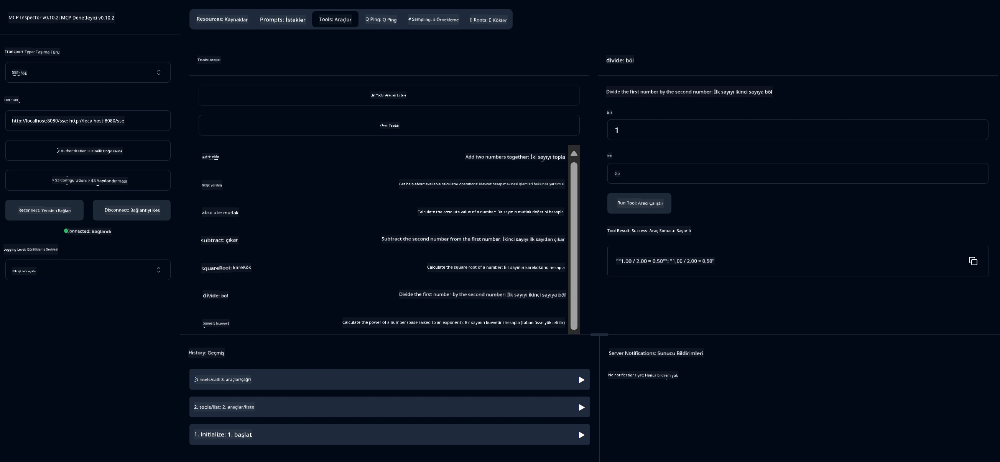

# Temel Hesap Makinesi MCP Servisi

> [!NOTE]
> Bu Java çözümü, eski HTTP+SSE taşıma yöntemini kullanır ve MCP `2025-11-25` ile uyumlu bir SDK hedefler.
> Ders kodu uyumluluğu için tutulmaktadır;
> yeni uzak sunucular `2026-07-28` Tarihli Akış Destekli HTTP'yi kullanmalıdır.

Bu servis, Model Context Protocol (MCP) üzerinden temel hesap makinesi işlemleri sunar ve Spring Boot ile WebFlux taşıması kullanır. MCP uygulamalarını öğrenen yeni başlayanlar için basit bir örnek olarak tasarlanmıştır.

Daha fazla bilgi için [MCP Server Boot Starter](https://docs.spring.io/spring-ai/reference/api/mcp/mcp-server-boot-starter-docs.html) referans belgelerine bakınız.


## Servisin Kullanımı

Servis, MCP protokolü üzerinden aşağıdaki API uç noktalarını sunar:

- `add(a, b)`: İki sayıyı toplar
- `subtract(a, b)`: İkinci sayıdan birinciyi çıkarır
- `multiply(a, b)`: İki sayıyı çarpar
- `divide(a, b)`: Birinci sayıyı ikinciye böler (sıfır kontrolü ile)
- `power(base, exponent)`: Bir sayının kuvvetini hesaplar
- `squareRoot(number)`: Karekök hesaplar (negatif sayı kontrolü ile)
- `modulus(a, b)`: Bölme işleminde kalanı hesaplar
- `absolute(number)`: Mutlak değerini hesaplar

## Bağımlılıklar

Proje aşağıdaki ana bağımlılıkları gerektirir:

```xml
<dependency>
    <groupId>org.springframework.ai</groupId>
    <artifactId>spring-ai-starter-mcp-server-webflux</artifactId>
</dependency>
```

## Projenin Derlenmesi

Maven kullanarak projeyi derleyin:
```bash
./mvnw clean install -DskipTests
```

## Sunucunun Çalıştırılması

### Java Kullanarak

```bash
java -jar target/calculator-server-0.0.1-SNAPSHOT.jar
```

### MCP Inspector Kullanarak

MCP Inspector, MCP servisleri ile etkileşim için faydalı bir araçtır. Bu hesap makinesi servisi ile kullanmak için:

1. **MCP Inspector'ı yükleyin ve yeni bir terminal penceresinde çalıştırın:**
   ```bash
   npx @modelcontextprotocol/inspector
   ```

2. **Uygulamanın gösterdiği URL'yi (genellikle http://localhost:6274) tıklayarak web UI'a erişin**

3. **Bağlantıyı yapılandırın:**
   - Taşıma türünü "SSE" olarak ayarlayın
   - URL'yi çalışan sunucunuzun SSE uç noktası olarak ayarlayın: `http://localhost:8080/sse`
   - "Bağlan" butonuna tıklayın

4. **Araçları kullanın:**
   - Mevcut hesap makinesi işlemlerini görmek için "List Tools"a tıklayın
   - Bir aracı seçin ve işlemi yürütmek için "Run Tool"a tıklayın



---

<!-- CO-OP TRANSLATOR DISCLAIMER START -->
**Feragatname**:
Bu belge, AI çeviri hizmeti [Co-op Translator](https://github.com/Azure/co-op-translator) kullanılarak çevrilmiştir. Doğruluk için çaba sarf etsek de, otomatik çevirilerin hata veya yanlışlık içerebileceğini lütfen unutmayınız. Orijinal belge, kendi dilinde yetkili kaynak olarak kabul edilmelidir. Kritik bilgiler için profesyonel insan çevirisi önerilir. Bu çevirinin kullanımı sonucu ortaya çıkabilecek yanlış anlamalardan veya yanlış yorumlamalardan sorumlu değiliz.
<!-- CO-OP TRANSLATOR DISCLAIMER END -->