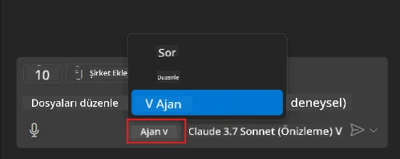
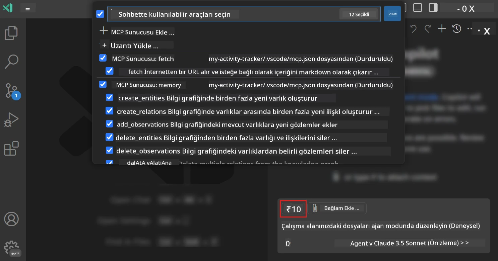
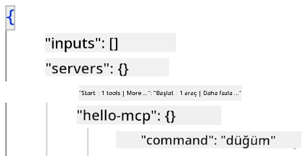
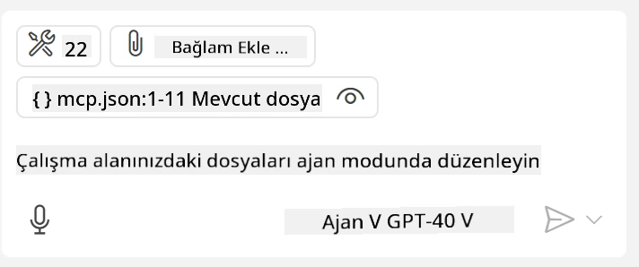
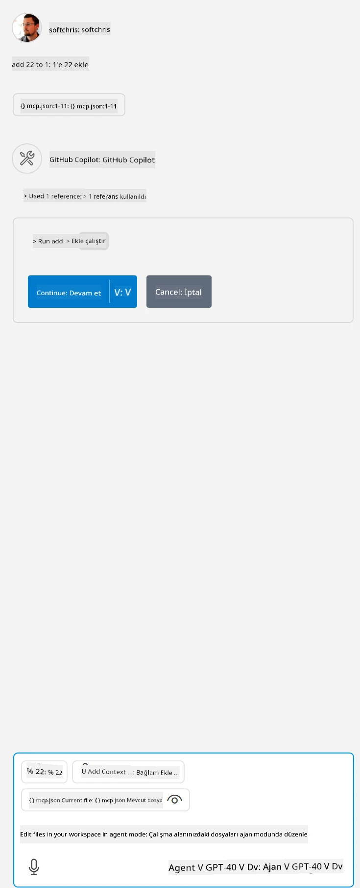

# GitHub Copilot Agent modundan bir sunucu kullanmak

Visual Studio Code ve GitHub Copilot, bir MCP Sunucusunu istemci olarak kullanabilirler. Neden bunu yapmak isteyelim diye sorabilirsiniz? Çünkü bu, MCP Sunucusunun sahip olduğu özelliklerin artık IDE'nizden kullanılabileceği anlamına gelir. Örneğin GitHub'ın MCP sunucusunu eklediğinizi hayal edin, bu terminalde belirli komutları yazmak yerine istemlerle GitHub'ı kontrol etmeyi sağlar. Ya da geliştirici deneyiminizi doğal dil ile kontrol edilen herhangi bir şey genel olarak iyileştirebilir. Artık kazancı görmeye başlıyorsunuz değil mi?

## Genel Bakış

Bu ders, Visual Studio Code ve GitHub Copilot'un Agent modunu MCP Sunucunuz için bir istemci olarak nasıl kullanacağınızı kapsar.

## Öğrenme Hedefleri

Bu dersin sonunda yapabilecekleriniz:

- Visual Studio Code üzerinden bir MCP Sunucusunu kullanmak.
- GitHub Copilot aracılığıyla araçları çalıştırmak.
- MCP Sunucunuzu bulup yönetmek için Visual Studio Code'u yapılandırmak.

## Kullanım

MCP sunucunuzu iki farklı şekilde kontrol edebilirsiniz:

- Kullanıcı arayüzü, bunun nasıl yapıldığını bu bölümün ilerleyen kısımlarında göreceksiniz.
- Terminal, `code` yürütülebilir dosyasını kullanarak terminalden kontrol etmek mümkündür:

  Kullanıcı profilinize bir MCP sunucusu eklemek için --add-mcp komut satırı seçeneğini kullanın ve JSON sunucu yapılandırmasını {\"name\":\"server-name\",\"command\":...} şeklinde sağlayın.

  ```
  code --add-mcp "{\"name\":\"my-server\",\"command\": \"uvx\",\"args\": [\"mcp-server-fetch\"]}"
  ```

### Ekran Görüntüleri





Şimdi görsel arayüzü nasıl kullandığımızı sonraki bölümlerde daha detaylı konuşalım.

## Yaklaşım

İşte bu konuya nasıl yaklaşmamız gerektiği yüksek seviyede:

- MCP Sunucumuzu bulmak için bir dosya yapılandır.
- Söz konusu sunucuyu başlat/bağlan ve yeteneklerini listele.
- Bu yetenekleri GitHub Copilot Chat arayüzü üzerinden kullan.

Harika, akışı anladığımıza göre şimdi bir egzersiz aracılığıyla Visual Studio Code üzerinden bir MCP Sunucusu kullanmaya çalışalım.

## Egzersiz: Bir sunucuyu kullanmak

Bu egzersizde, GitHub Copilot Chat arayüzünden kullanılabilmesi için MCP sunucunuzu bulacak şekilde Visual Studio Code'u yapılandıracağız.

### -0- Ön adım, MCP Sunucu keşfini etkinleştir

MCP Sunucularının keşfi için etkinleştirme yapmanız gerekebilir.

1. Visual Studio Code'da `Dosya -> Tercihler -> Ayarlar`a gidin.

1. "MCP" araması yapın ve settings.json dosyasındaki `chat.mcp.discovery.enabled` özelliğini etkinleştirin.

### -1- Yapılandırma dosyası oluştur

Proje kök dizininizde .vscode adlı bir klasörde MCP.json adında bir dosya oluşturarak başlayın. Aşağıdaki gibi olmalı:

```text
.vscode
|-- mcp.json
```

Şimdi bir sunucu girdisi nasıl eklenir ona bakalım.

### -2- Bir sunucu yapılandır

*mcp.json* dosyasına aşağıdaki içeriği ekleyin:

```json
{
    "inputs": [],
    "servers": {
       "hello-mcp": {
           "command": "node",
           "args": [
               "build/index.js"
           ]
       }
    }
}
```

Yukarıdaki basit örnek, Node.js ile yazılmış bir sunucuyu nasıl başlatacağınızı gösteriyor, diğer çalışma ortamları için `command` ve `args` kullanarak uygun sunucu başlatma komutunu belirtin.

### -3- Sunucuyu başlat

Artık bir giriş eklediğinize göre sunucuyu başlatalım:

1. *mcp.json* dosyanızdaki girişinizi bulun ve "oynat" simgesini görebildiğinizden emin olun:

    

1. "Oynat" simgesine tıklayın, GitHub Copilot Chat içindeki araçlar simgesindeki mevcut araç sayısının arttığını görmelisiniz. Bu araç simgesine tıkladığınızda kayıtlı araçların listesini görürsünüz. GitHub Copilot'un onları bağlam olarak kullanmasını isteyip istemediğinize bağlı olarak her aracı işaretleyip kaldırabilirsiniz:

  

1. Bir aracı çalıştırmak için, araçlarınızdan birinin açıklamasıyla eşleşeceğini bildiğiniz bir istem yazın, örneğin "1'e 22 ekle" gibi bir istem:

  

  23 diyen bir yanıt görmelisiniz.

## Ödev

*mcp.json* dosyanıza bir sunucu girişi eklemeyi deneyin ve sunucuyu başlatıp durdurabildiğinizden emin olun. Ayrıca GitHub Copilot Chat arayüzü üzerinden sunucunuzdaki araçlarla iletişim kurabildiğinizden emin olun.

## Çözüm

[Çözüm](./solution/README.md)

## Anahtar Noktalar

Bu bölümün anahtar çıkarımları şunlardır:

- Visual Studio Code, birden fazla MCP Sunucusu ve araçlarını kullanmanızı sağlayan harika bir istemcidir.
- GitHub Copilot Chat arayüzü, sunucularla etkileşim kurmanın yoludur.
- *mcp.json* dosyasındaki sunucu girişini yapılandırırken MCP Sunucusuna iletilmek üzere API anahtarları gibi girdiler için kullanıcıya istemde bulunabilirsiniz.

## Örnekler

- [Java Hesap Makinesi](../samples/java/calculator/README.md)
- [.Net Hesap Makinesi](../../../../03-GettingStarted/samples/csharp)
- [JavaScript Hesap Makinesi](../samples/javascript/README.md)
- [TypeScript Hesap Makinesi](../samples/typescript/README.md)
- [Python Hesap Makinesi](../../../../03-GettingStarted/samples/python)

## Ek Kaynaklar

- [Visual Studio dökümantasyonu](https://code.visualstudio.com/docs/copilot/chat/mcp-servers)

## Sonraki Adım

- Sonraki: [stdio Sunucusu Oluşturma](../05-stdio-server/README.md)

---

<!-- CO-OP TRANSLATOR DISCLAIMER START -->
**Feragatname**:
Bu belge, AI çeviri hizmeti [Co-op Translator](https://github.com/Azure/co-op-translator) kullanılarak çevrilmiştir. Doğruluk için çaba sarf etsek de, otomatik çevirilerin hata veya yanlışlık içerebileceğini lütfen unutmayınız. Orijinal belge, kendi dilinde yetkili kaynak olarak kabul edilmelidir. Kritik bilgiler için profesyonel insan çevirisi önerilir. Bu çevirinin kullanımı sonucu ortaya çıkabilecek yanlış anlamalardan veya yanlış yorumlamalardan sorumlu değiliz.
<!-- CO-OP TRANSLATOR DISCLAIMER END -->