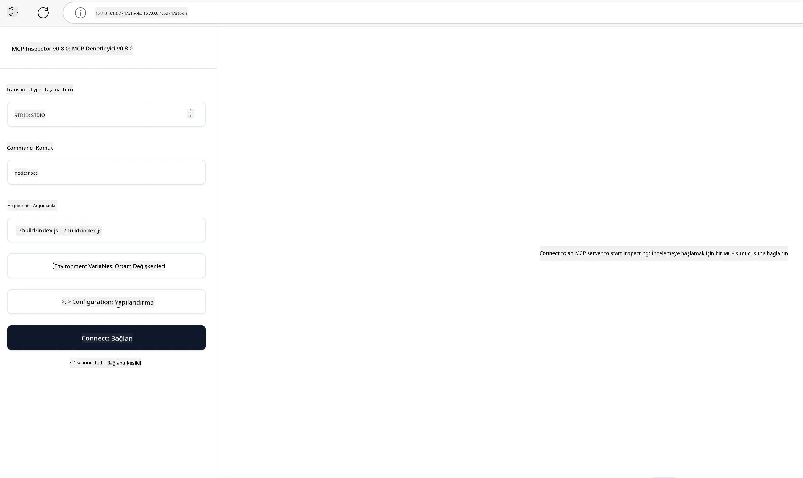

## Test Etme ve Hata Ayıklama

MCP sunucunuzu test etmeye başlamadan önce, mevcut araçları ve hata ayıklama için en iyi uygulamaları anlamak önemlidir. Etkili test, sunucunuzun beklenen şekilde çalışmasını sağlar ve sorunları hızlı bir şekilde tanımlayıp çözmenize yardımcı olur. Aşağıdaki bölüm, MCP uygulamanızı doğrulamak için önerilen yaklaşımları özetlemektedir.

## Genel Bakış

Bu ders, doğru test yaklaşımının nasıl seçileceğini ve en etkili test aracını kapsar.

## Öğrenme Hedefleri

Bu dersin sonunda şunları yapabileceksiniz:

- Test için çeşitli yaklaşımları tanımlamak.
- Kodunuzu etkili şekilde test etmek için farklı araçlar kullanmak.

## MCP Sunucularını Test Etme

MCP, sunucularınızı test etmenize ve hata ayıklamanıza yardımcı olacak araçlar sağlar:

- **MCP Inspector**: Hem CLI aracı olarak hem de görsel araç olarak çalıştırılabilen bir komut satırı aracı.
- **Manuel test**: curl gibi bir araç kullanarak web istekleri çalıştırabilirsiniz, ancak HTTP çalıştırabilen herhangi bir araç da yeterli olacaktır.
- **Birim testi**: Hem sunucu hem de istemci özelliklerini test etmek için tercih ettiğiniz test çerçevesini kullanmak mümkündür.

### MCP Inspector Kullanımı

Bu aracın kullanımını önceki derslerde anlattık ancak yüksek seviyede biraz bahsedelim. Node.js ile yazılmış bir araçtır ve `npx` çalıştırılabilirini çağırarak kullanabilirsiniz; bu, aracı geçici olarak indirir ve yükler, çalıştırma tamamlandıktan sonra kendini temizler.

[MCP Inspector](https://github.com/modelcontextprotocol/inspector) size şunlarda yardımcı olur:

- **Sunucu Yeteneklerini Keşfetme**: Mevcut kaynakları, araçları ve istemleri otomatik olarak algılar
- **Araç Çalıştırmayı Test Etme**: Farklı parametreleri deneyebilir ve yanıtları gerçek zamanlı görebilirsiniz
- **Sunucu Meta Verilerini Görüntüleme**: Sunucu bilgileri, şemalar ve yapılandırmaları inceleyin

Araç tipik bir çalıştırması aşağıdaki gibidir:

```bash
npx @modelcontextprotocol/inspector node build/index.js
```

Yukarıdaki komut, bir MCP ve görsel arayüzü başlatır ve tarayıcınızda yerel bir web arayüzü açar. Kayıtlı MCP sunucularınızı, mevcut araçlarını, kaynakları ve istemleri gösteren bir kontrol paneli görmeyi bekleyebilirsiniz. Arayüz, araç çalıştırma testini etkileşimli yapmanızı, sunucu meta verilerini incelemenizi ve gerçek zamanlı yanıtları görmenizi sağlar; böylece MCP sunucu uygulamalarınızı doğrulamak ve hata ayıklamak kolaylaşır.

Böyle görünebilir: 

Bu aracı CLI modunda da çalıştırabilirsiniz; bu durumda `--cli` özniteliğini eklersiniz. İşte araçları sunucuda listeleyen "CLI" modunda çalıştırmaya bir örnek:

```sh
npx @modelcontextprotocol/inspector --cli node build/index.js --method tools/list
```

### Manuel Test

Sunucu yeteneklerini test etmek için inspector aracını çalıştırmanın yanı sıra, HTTP kullanabilen bir istemciyi çalıştırmak benzer bir yaklaşımdır. Örneğin curl.

curl ile MCP sunucularını HTTP istekleri kullanarak doğrudan test edebilirsiniz:

```bash
# Örnek: Test sunucu meta verileri
curl http://localhost:3000/v1/metadata

# Örnek: Bir aracı çalıştır
curl -X POST http://localhost:3000/v1/tools/execute \
  -H "Content-Type: application/json" \
  -d '{"name": "calculator", "parameters": {"expression": "2+2"}}'
```

Yukarıdaki curl kullanımından da görebileceğiniz gibi, bir POST isteği kullanarak aracın adını ve parametrelerini içeren bir yük ile bir aracı çağırırsınız. Size en uygun yaklaşımı kullanın. Komut satırı araçları genellikle daha hızlıdır ve betik yazmaya uygundur; bu da CI/CD ortamlarında faydalı olabilir.

### Birim Testi

Araçlarınızın ve kaynaklarınızın beklendiği gibi çalıştığından emin olmak için birim testleri oluşturun. İşte bazı örnek test kodları.

```python
import pytest

from mcp.server.fastmcp import FastMCP
from mcp.shared.memory import (
    create_connected_server_and_client_session as create_session,
)

# Tüm modülü asenkron testler için işaretle
pytestmark = pytest.mark.anyio


async def test_list_tools_cursor_parameter():
    """Test that the cursor parameter is accepted for list_tools.

    Note: FastMCP doesn't currently implement pagination, so this test
    only verifies that the cursor parameter is accepted by the client.
    """

 server = FastMCP("test")

    # Birkaç test aracı oluştur
    @server.tool(name="test_tool_1")
    async def test_tool_1() -> str:
        """First test tool"""
        return "Result 1"

    @server.tool(name="test_tool_2")
    async def test_tool_2() -> str:
        """Second test tool"""
        return "Result 2"

    async with create_session(server._mcp_server) as client_session:
        # İmleç parametresi olmadan test et (atlandı)
        result1 = await client_session.list_tools()
        assert len(result1.tools) == 2

        # cursor=None ile test et
        result2 = await client_session.list_tools(cursor=None)
        assert len(result2.tools) == 2

        # İmleç string olarak test et
        result3 = await client_session.list_tools(cursor="some_cursor_value")
        assert len(result3.tools) == 2

        # Boş string imleç ile test et
        result4 = await client_session.list_tools(cursor="")
        assert len(result4.tools) == 2
    
```

Yukarıdaki kod şunları yapar:

- assert ifadeleri ve fonksiyon olarak test yaratmanızı sağlayan pytest çerçevesini kullanır.
- İki farklı araca sahip bir MCP Sunucusu oluşturur.
- Bazı koşulların sağlandığını doğrulamak için `assert` ifadesini kullanır.

[Tam dosyaya buradan bakabilirsiniz](https://github.com/modelcontextprotocol/python-sdk/blob/main/tests/client/test_list_methods_cursor.py)

Yukarıdaki dosya ile, kendi sunucunuzu test ederek yeteneklerin gerektiği gibi oluşturulduğundan emin olabilirsiniz.

Tüm ana SDK'lar benzer test bölümlerine sahiptir, bu yüzden seçtiğiniz çalışma ortamına uyarlayabilirsiniz.

## Örnekler

- [Java Hesap Makinesi](../samples/java/calculator/README.md)
- [.Net Hesap Makinesi](../../../../03-GettingStarted/samples/csharp)
- [JavaScript Hesap Makinesi](../samples/javascript/README.md)
- [TypeScript Hesap Makinesi](../samples/typescript/README.md)
- [Python Hesap Makinesi](../../../../03-GettingStarted/samples/python)

## Ek Kaynaklar

- [Python SDK](https://github.com/modelcontextprotocol/python-sdk)

## Sonraki Adım

- Sonraki: [Dağıtım](../09-deployment/README.md)

---

<!-- CO-OP TRANSLATOR DISCLAIMER START -->
**Feragatname**:
Bu belge, AI çeviri hizmeti [Co-op Translator](https://github.com/Azure/co-op-translator) kullanılarak çevrilmiştir. Doğruluk için çaba sarf etmekle birlikte, otomatik çevirilerin hata veya yanlışlık içerebileceğinin farkında olunuz. Orijinal belge, kendi dilindeki versiyonu yetkili kaynak olarak kabul edilmelidir. Kritik bilgiler için profesyonel insan çevirisi önerilir. Bu çevirinin kullanılmasıyla ortaya çıkan yanlış anlamalar veya hatalı yorumlamalardan sorumlu değiliz.
<!-- CO-OP TRANSLATOR DISCLAIMER END -->