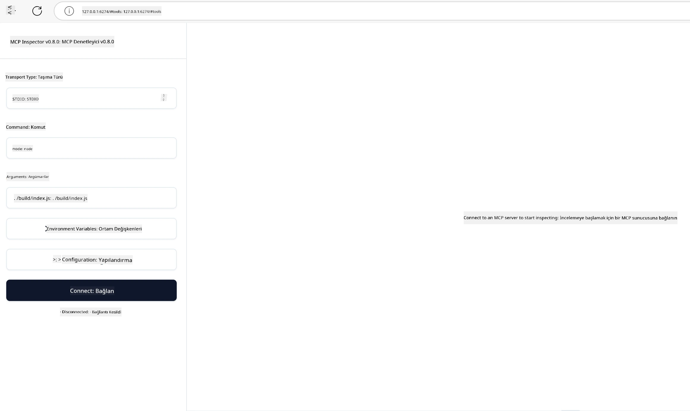

## Test Etme ve Hata Ayıklama

MCP sunucunuzu test etmeye başlamadan önce, mevcut araçları ve hata ayıklama için en iyi uygulamaları anlamanız önemlidir. Etkili test, sunucunuzun beklenildiği gibi davrandığını garanti eder ve sorunları hızlıca tanımlayıp çözmenize yardımcı olur. Aşağıdaki bölüm, MCP uygulamanızı doğrulamak için önerilen yaklaşımları özetlemektedir.

## Genel Bakış

Bu derste doğru test yaklaşımının nasıl seçileceği ve en etkili test aracının hangisi olduğu anlatılmaktadır.

## Öğrenme Hedefleri

Bu dersi tamamladıktan sonra:

- Farklı test yaklaşımlarını tanımlayabileceksiniz.
- Kodunuzu etkili bir şekilde test etmek için farklı araçlar kullanabileceksiniz.


## MCP Sunucularını Test Etme

MCP, sunucularınızı test edip hata ayıklamanıza yardımcı olacak araçlar sağlar:

- **MCP Inspector**: Hem komut satırı aracı hem de görsel araç olarak çalıştırılabilen bir komut satırı aracıdır.
- **Manuel test**: curl gibi web istekleri yapabilen bir araç kullanabilirsiniz, ancak HTTP çalıştırabilen herhangi bir araç iş görür.
- **Birim testi**: Hem sunucu hem istemcinin özelliklerini test etmek için tercih ettiğiniz test çerçevesini kullanabilirsiniz.

### MCP Inspector Kullanımı

Bu aracın kullanımı önceki derslerde anlatıldı ama yüksek seviyede biraz daha bahsedelim. Node.js ile geliştirilmiş bir araçtır ve `npx` yürütülebilir dosyasıyla çağırarak kullanabilirsiniz; bu, aracı geçici olarak indirip kurar ve isteğiniz tamamlandıktan sonra kendini temizler.

[MCP Inspector](https://github.com/modelcontextprotocol/inspector) size şu konularda yardımcı olur:

- **Sunucu Yeteneklerini Keşfetme**: Kullanılabilir kaynakları, araçları ve istemleri otomatik olarak tespit eder
- **Araç Çalıştırmayı Test Etme**: Farklı parametreler deneyip gerçek zamanlı yanıtları görme
- **Sunucu Meta Verilerini Görüntüleme**: Sunucu bilgilerini, şemalarını ve yapılandırmalarını inceleme

Aracın tipik çalıştırılması şöyle görünür:

```bash
npx @modelcontextprotocol/inspector node build/index.js
```

Yukarıdaki komut, bir MCP ve görsel arayüzünü başlatır ve tarayıcınızda yerel bir web arayüzü açar. Kayıtlı MCP sunucularınızı, mevcut araçlarını, kaynaklarını ve istemlerini gösteren bir kontrol paneli görürsünüz. Arayüz, araç çalıştırmasını etkileşimli test etmenize, sunucu meta verilerini incelemenize ve gerçek zamanlı yanıtları görüntülemenize izin verir; bu da MCP sunucu uygulamalarınızı doğrulamanızı ve hata ayıklamanızı kolaylaştırır.

İşte böyle görünebilir: 

Bu aracı CLI modunda da çalıştırabilirsiniz, bu durumda `--cli` özniteliğini eklersiniz. İşte araçları sunucuda listeleyen "CLI" modunda çalıştırmaya bir örnek:

```sh
npx @modelcontextprotocol/inspector --cli node build/index.js --method tools/list
```

### Manuel Test

Sunucu yeteneklerini test etmek için inspector aracını çalıştırmanın yanı sıra, HTTP kullanabilen bir istemciyi de çalıştırabilirsiniz; örneğin curl gibi.

Curl ile MCP sunucularını doğrudan HTTP istekleriyle test edebilirsiniz:

```bash
# Örnek: Test sunucu meta verisi
curl http://localhost:3000/v1/metadata

# Örnek: Bir araç çalıştır
curl -X POST http://localhost:3000/v1/tools/execute \
  -H "Content-Type: application/json" \
  -d '{"name": "calculator", "parameters": {"expression": "2+2"}}'
```

Yukarıdaki curl kullanımından da görebileceğiniz gibi, bir aracı çağırmak için araç adı ve parametrelerini içeren bir yükle POST isteği yaparsınız. Size en uygun yaklaşımı kullanın. CLI araçları genel olarak daha hızlıdır ve script yazmaya uygundur, bu da CI/CD ortamlarında faydalı olabilir.

### Birim Testi

Araçlarınız ve kaynaklarınız için beklediğiniz gibi çalıştığını garanti etmek üzere birim testleri oluşturun. İşte bazı örnek test kodları.

```python
import pytest

from mcp.server.fastmcp import FastMCP
from mcp.shared.memory import (
    create_connected_server_and_client_session as create_session,
)

# Modülün tamamını asenkron testler için işaretle
pytestmark = pytest.mark.anyio


async def test_list_tools_cursor_parameter():
    """Test that the cursor parameter is accepted for list_tools.

    Note: FastMCP doesn't currently implement pagination, so this test
    only verifies that the cursor parameter is accepted by the client.
    """

 server = FastMCP("test")

    # Birkaç test aracı oluştur
    @server.tool(name="test_tool_1")
    async def test_tool_1() -> str:
        """First test tool"""
        return "Result 1"

    @server.tool(name="test_tool_2")
    async def test_tool_2() -> str:
        """Second test tool"""
        return "Result 2"

    async with create_session(server._mcp_server) as client_session:
        # İmleç parametresi olmadan test et (atlandı)
        result1 = await client_session.list_tools()
        assert len(result1.tools) == 2

        # İmleç=None ile test et
        result2 = await client_session.list_tools(cursor=None)
        assert len(result2.tools) == 2

        # İmleci string olarak kullanarak test et
        result3 = await client_session.list_tools(cursor="some_cursor_value")
        assert len(result3.tools) == 2

        # Boş string imleç ile test et
        result4 = await client_session.list_tools(cursor="")
        assert len(result4.tools) == 2
    
```

Yukarıdaki kod şunları yapar:

- pytest çerçevesini kullanır; böylece testlerinizi fonksiyonlar şeklinde oluşturabilir ve assert ifadeleri kullanabilirsiniz.
- İki farklı araç ile bir MCP Sunucusu oluşturur.
- Bazı koşulların sağlanıp sağlanmadığını kontrol etmek için `assert` ifadesini kullanır.

[Tam dosyaya buradan göz atabilirsiniz](https://github.com/modelcontextprotocol/python-sdk/blob/main/tests/client/test_list_methods_cursor.py)

Yukarıdaki dosyaya bakarak, kendi sunucunuzu test edip yeteneklerin doğru oluşturulduğundan emin olabilirsiniz.

Tüm önemli SDK'lar benzer test bölümlerine sahiptir; böylece seçtiğiniz çalışma ortamına göre uyarlama yapabilirsiniz.

## Örnekler 

- [Java Hesap Makinesi](../samples/java/calculator/README.md)
- [.Net Hesap Makinesi](../../../../03-GettingStarted/samples/csharp)
- [JavaScript Hesap Makinesi](../samples/javascript/README.md)
- [TypeScript Hesap Makinesi](../samples/typescript/README.md)
- [Python Hesap Makinesi](../../../../03-GettingStarted/samples/python) 

## Ek Kaynaklar

- [Python SDK](https://github.com/modelcontextprotocol/python-sdk)

## Sırada Ne Var

- Sonraki: [Dağıtım](../09-deployment/README.md)

---

<!-- CO-OP TRANSLATOR DISCLAIMER START -->
**Feragatname**:
Bu belge, AI çeviri hizmeti [Co-op Translator](https://github.com/Azure/co-op-translator) kullanılarak çevrilmiştir. Doğruluk için çaba sarf etsek de, otomatik çevirilerin hata veya yanlışlık içerebileceğini lütfen unutmayınız. Orijinal belge, kendi dilinde yetkili kaynak olarak kabul edilmelidir. Kritik bilgiler için profesyonel insan çevirisi önerilir. Bu çevirinin kullanımı sonucu ortaya çıkabilecek yanlış anlamalardan veya yanlış yorumlamalardan sorumlu değiliz.
<!-- CO-OP TRANSLATOR DISCLAIMER END -->