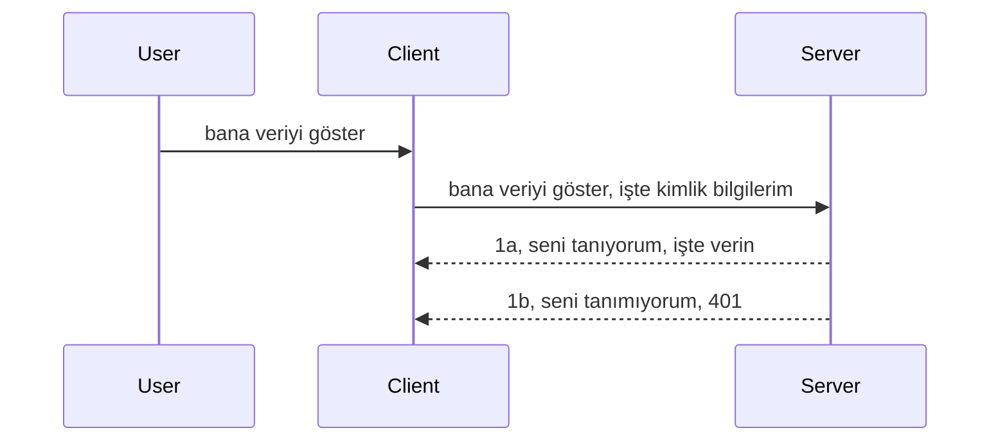

# Basit kimlik doğrulama

MCP SDK'ları, OAuth 2.1 kullanımını destekler ki bu, dürüst olmak gerekirse, auth sunucusu, kaynak sunucusu, kimlik bilgilerini gönderme, kod alma, kodu bir taşıyıcı token ile değiştirme gibi kavramları içeren oldukça kapsamlı bir süreçtir ve sonunda kaynak verilerinize erişebilirsiniz. Eğer OAuth'a alışık değilseniz ki uygulaması harika bir şeydir, temel seviyede kimlik doğrulama ile başlamanız ve daha iyi güvenlik için üzerine inşa etmeniz iyi bir fikirdir. Bu yüzden bu bölüm var, sizi daha gelişmiş kimlik doğrulamaya hazırlamak için.

## Kimlik doğrulama, ne demek istiyoruz?

Auth, authentication (kimlik doğrulama) ve authorization (yetkilendirme) kelimelerinin kısaltmasıdır. Buradaki fikir, iki şeyi yapmamız gerekmesi:

- **Kimlik doğrulama**, yani bir kişinin evimize girip girmeyeceğini, "burada" bulunma hakkının olup olmadığını anlamak – yani kaynak sunucumuza erişim sağlama hakkı olup olmadığını belirlemek.
- **Yetkilendirme**, kullanıcının talep ettiği belirli kaynaklara erişim hakkı olup olmadığını bulma sürecidir, örneğin bu siparişler veya ürünler, veya diğer bir örnek olarak içeriği okuyabilme ama silememe gibi izinler.

## Kimlik bilgileri: Sisteme kendimizi nasıl tanıtıyoruz

Pek çok web geliştiricisi genellikle sunucuya bir kimlik bilgisi sağlamayı düşünür, genellikle burada bulunmaya izin verilip verilmediğini belirten gizli bir anahtar (Authentication). Bu kimlik bilgisi genellikle kullanıcı adı ve parolanın base64 ile kodlanmış versiyonu veya belirli bir kullanıcıyı benzersiz şekilde tanımlayan bir API anahtarıdır.

Bu, "Authorization" adlı bir başlık üzerinden şöyle gönderilir:

```json
{ "Authorization": "secret123" }
```

Genellikle buna temel kimlik doğrulama (basic authentication) denir. Genel akışın nasıl çalıştığı ise şu şekildedir:


Artık akış açısından nasıl çalıştığını anlattığımıza göre, bunu nasıl uygularız? Çoğu web sunucusunda middleware (ara katman yazılımı) kavramı vardır; bu, istek sürecinde çalışan ve kimlik bilgilerini doğrulayabilen, kimlik bilgileri geçerliyse isteğin devam etmesine izin veren bir kod parçasıdır. Eğer geçerli kimlik bilgisi yoksa auth hatası alırsınız. Şimdi bunun nasıl uygulanabileceğine bakalım:

**Python**

```python
class AuthMiddleware(BaseHTTPMiddleware):
    async def dispatch(self, request, call_next):

        has_header = request.headers.get("Authorization")
        if not has_header:
            print("-> Missing Authorization header!")
            return Response(status_code=401, content="Unauthorized")

        if not valid_token(has_header):
            print("-> Invalid token!")
            return Response(status_code=403, content="Forbidden")

        print("Valid token, proceeding...")
       
        response = await call_next(request)
        # herhangi bir müşteri başlığı ekleyin veya yanıtı bir şekilde değiştirin
        return response


starlette_app.add_middleware(CustomHeaderMiddleware)
```

Şurada şunlar var:

- `AuthMiddleware` adında bir middleware oluşturduk ve `dispatch` metodu web sunucusu tarafından çağrılıyor.
- Middleware'i web sunucusuna ekledik:

    ```python
    starlette_app.add_middleware(AuthMiddleware)
    ```

- `Authorization` başlığının varlığını ve gönderilen gizlinin geçerliliğini denetleyen doğrulama mantığı yazdık:

    ```python
    has_header = request.headers.get("Authorization")
    if not has_header:
        print("-> Missing Authorization header!")
        return Response(status_code=401, content="Unauthorized")

    if not valid_token(has_header):
        print("-> Invalid token!")
        return Response(status_code=403, content="Forbidden")
    ```

    gizli anahtar mevcutsa ve geçerliyse, `call_next` fonksiyonunu çağırarak isteğin devam etmesine izin veriyoruz ve cevabı döndürüyoruz.

    ```python
    response = await call_next(request)
    # yanıt içinde herhangi bir özel başlık ekle veya değişiklik yap
    return response
    ```

Çalışma şekli şöyle: Sunucuya gelen web isteği middleware tarafından ele alınır ve uygulamaya göre istek ya geçmeye izin verir ya da istemcinin devam etmesine izin verilmediğini belirten bir hata döner.

**TypeScript**

Burada popüler framework Express ile bir middleware oluşturuyoruz ve isteği MCP Server'a ulaşmadan önce yakalıyoruz. İşte bunun kodu:

```typescript
function isValid(secret) {
    return secret === "secret123";
}

app.use((req, res, next) => {
    // 1. Yetkilendirme başlığı mevcut mu?
    if(!req.headers["Authorization"]) {
        res.status(401).send('Unauthorized');
    }
    
    let token = req.headers["Authorization"];

    // 2. Geçerliliği kontrol et.
    if(!isValid(token)) {
        res.status(403).send('Forbidden');
    }

   
    console.log('Middleware executed');
    // 3. İsteği, istek hattındaki sonraki adıma iletir.
    next();
});
```

Bu kodda:

1. İlk olarak `Authorization` başlığının var olup olmadığını kontrol ediyoruz, yoksa 401 hatası gönderiyoruz.
2. Kimlik bilgisi/token geçerliyse devam etmesine izin veriyoruz, değilse 403 hatası gönderiyoruz.
3. Son olarak istek işlem hattında ilerletiliyor ve talep edilen kaynak döndürülüyor.

## Alıştırma: Kimlik doğrulama uygulama

Şimdi bilgimizi alıp uygulamayı deneyelim. İşte plan:

Sunucu

- Bir web sunucu ve MCP örneği oluştur.
- Sunucu için bir middleware uygula.

İstemci 

- Başlık aracılığıyla kimlik bilgisi içeren web isteği gönder.

### -1- Web sunucusu ve MCP örneği oluşturma

İlk adım olarak web sunucusu ve MCP sunucu örneği oluşturmamız gerekiyor.

**Python**

Burada bir MCP sunucu örneği oluşturuyor, starlette web uygulaması yapıyoruz ve uvicorn ile barındırıyoruz.

```python
# MCP Sunucusu oluşturuluyor

app = FastMCP(
    name="MCP Resource Server",
    instructions="Resource Server that validates tokens via Authorization Server introspection",
    host=settings["host"],
    port=settings["port"],
    debug=True
)

# starlette web uygulaması oluşturuluyor
starlette_app = app.streamable_http_app()

# uygulama uvicorn ile sunuluyor
async def run(starlette_app):
    import uvicorn
    config = uvicorn.Config(
            starlette_app,
            host=app.settings.host,
            port=app.settings.port,
            log_level=app.settings.log_level.lower(),
        )
    server = uvicorn.Server(config)
    await server.serve()

run(starlette_app)
```

Bu koddaki işlemler:

- MCP Sunucusu oluşturuldu.
- MCP sunucusundan starlette web uygulaması oluşturuldu: `app.streamable_http_app()`.
- Uvicorn kullanılarak web uygulaması barındırıldı: `server.serve()`.

**TypeScript**

Burada bir MCP Server örneği oluşturuyoruz.

```typescript
const server = new McpServer({
      name: "example-server",
      version: "1.0.0"
    });

    // ... sunucu kaynaklarını, araçları ve istemleri ayarlayın ...
```

Bu MCP Sunucu oluşturma işlemi POST /mcp rotası içinde yapılmalıdır, yukarıdaki kodu şöyle taşıyalım:

```typescript
import express from "express";
import { randomUUID } from "node:crypto";
import { McpServer } from "@modelcontextprotocol/sdk/server/mcp.js";
import { StreamableHTTPServerTransport } from "@modelcontextprotocol/sdk/server/streamableHttp.js";
import { isInitializeRequest } from "@modelcontextprotocol/sdk/types.js"

const app = express();
app.use(express.json());

// Oturum kimliğine göre taşıyıcıları saklamak için harita
const transports: { [sessionId: string]: StreamableHTTPServerTransport } = {};

// İstemci-den-server iletişimi için POST isteklerini işleyin
app.post('/mcp', async (req, res) => {
  // Mevcut oturum kimliğini kontrol et
  const sessionId = req.headers['mcp-session-id'] as string | undefined;
  let transport: StreamableHTTPServerTransport;

  if (sessionId && transports[sessionId]) {
    // Mevcut taşıyıcıyı yeniden kullan
    transport = transports[sessionId];
  } else if (!sessionId && isInitializeRequest(req.body)) {
    // Yeni başlatma isteği
    transport = new StreamableHTTPServerTransport({
      sessionIdGenerator: () => randomUUID(),
      onsessioninitialized: (sessionId) => {
        // Taşıyıcıyı oturum kimliğine göre sakla
        transports[sessionId] = transport;
      },
      // DNS yeniden bağlama koruması varsayılan olarak geriye dönük uyumluluk için devre dışı bırakılmıştır. Bu sunucuyu
      // yerel olarak çalıştırıyorsanız, şunu ayarladığınızdan emin olun:
      // enableDnsRebindingProtection: true,
      // allowedHosts: ['127.0.0.1'],
    });

    // Kapatıldığında taşıyıcıyı temizle
    transport.onclose = () => {
      if (transport.sessionId) {
        delete transports[transport.sessionId];
      }
    };
    const server = new McpServer({
      name: "example-server",
      version: "1.0.0"
    });

    // ... sunucu kaynaklarını, araçlarını ve istemlerini ayarla ...

    // MCP sunucusuna bağlan
    await server.connect(transport);
  } else {
    // Geçersiz istek
    res.status(400).json({
      jsonrpc: '2.0',
      error: {
        code: -32000,
        message: 'Bad Request: No valid session ID provided',
      },
      id: null,
    });
    return;
  }

  // İsteği işle
  await transport.handleRequest(req, res, req.body);
});

// GET ve DELETE istekleri için yeniden kullanılabilir işleyici
const handleSessionRequest = async (req: express.Request, res: express.Response) => {
  const sessionId = req.headers['mcp-session-id'] as string | undefined;
  if (!sessionId || !transports[sessionId]) {
    res.status(400).send('Invalid or missing session ID');
    return;
  }
  
  const transport = transports[sessionId];
  await transport.handleRequest(req, res);
};

// SSE aracılığıyla sunucudan-istekliye bildirimler için GET isteklerini işle
app.get('/mcp', handleSessionRequest);

// Oturum sonlandırma için DELETE isteklerini işle
app.delete('/mcp', handleSessionRequest);

app.listen(3000);
```

Şimdi MCP Server oluşturmanın `app.post("/mcp")` içine taşındığını görüyorsunuz.

Gelen kimlik bilgisini doğrulamak için middleware oluşturmaya geçelim.

### -2- Sunucu için middleware uygulama

Sıradaki middleware kısmı. Burada `Authorization` başlığında bir kimlik bilgisi arayan ve geçerliliğini kontrol eden bir middleware oluşturacağız. Kabul edilebilir ise istek gerekli işlemleri (örneğin araçları listeleme, kaynak okuma veya MCP istemcisinin talep ettiği MCP işlevleri) yapacak.

**Python**

Middleware oluşturmak için `BaseHTTPMiddleware` sınıfından türeyen bir sınıf yaratmalıyız. İlginç iki parça var:

- Başlığı okumak için `request` parametresi,
- `call_next` callback fonksiyonu, geçerli kimlik bilgisi varsa çağrılır.

İlk önce, eğer `Authorization` başlığı yoksa:

```python
has_header = request.headers.get("Authorization")

# başlık yok, 401 ile başarısız ol, aksi takdirde devam et.
if not has_header:
    print("-> Missing Authorization header!")
    return Response(status_code=401, content="Unauthorized")
```

Burada istemci kimlik doğrulamasını geçemediği için 401 Unauthorized mesajı gönderiyoruz.

Sonra, bir kimlik bilgisi gönderildiyse, geçerliliği kontrol edilir:

```python
 if not valid_token(has_header):
    print("-> Invalid token!")
    return Response(status_code=403, content="Forbidden")
```

Yukarıda 403 Forbidden mesajı gönderdiğimizi not edin. İşte aşağıda tüm middleware:

```python
class AuthMiddleware(BaseHTTPMiddleware):
    async def dispatch(self, request, call_next):

        has_header = request.headers.get("Authorization")
        if not has_header:
            print("-> Missing Authorization header!")
            return Response(status_code=401, content="Unauthorized")

        if not valid_token(has_header):
            print("-> Invalid token!")
            return Response(status_code=403, content="Forbidden")

        print("Valid token, proceeding...")
        print(f"-> Received {request.method} {request.url}")
        response = await call_next(request)
        response.headers['Custom'] = 'Example'
        return response

```

Güzel, peki `valid_token` fonksiyonu ne? İşte aşağıda:
:

```python
# Üretimde kullanmayın - geliştirin !!
def valid_token(token: str) -> bool:
    # "Bearer " önekini kaldırın
    if token.startswith("Bearer "):
        token = token[7:]
        return token == "secret-token"
    return False
```

Bu tabi geliştirilmeli.

ÖNEMLİ: Bu tür gizlilik bilgilerini kodda ASLA tutmamalısınız. İdeal olarak karşılaştırma yapacağınız değeri bir veri kaynağından veya bir kimlik sağlayıcıdan (IDP) almalısınız veya daha iyisi, doğrulamayı doğrudan IDP'nin yapmasına izin vermelisiniz.

**TypeScript**

Express ile bunu uygulamak için `use` metodunu çağırarak middleware fonksiyonları eklememiz gerekir.

Yapmamız gerekenler:

- İstek değişkeninden `Authorization` başlığındaki kimlik bilgisi/token kontrol edilir.
- Kimlik bilgisi doğrulanırsa istek devam eder ve istemcinin MCP isteği gerçekleştirilir.

İlk olarak `Authorization` başlığının olup olmadığını kontrol ediyoruz, yoksa istek bloke edilir:

```typescript
if(!req.headers["authorization"]) {
    res.status(401).send('Unauthorized');
    return;
}
```

Başlık yoksa, istemci 401 alır.

Sonra, kimlik bilgisi geçerli mi diye kontrol edilir, değilse istek durdurulur ama farklı mesajla:

```typescript
if(!isValid(token)) {
    res.status(403).send('Forbidden');
    return;
} 
```

Burada 403 hatası alırsınız.

Tam kod burada:

```typescript
app.use((req, res, next) => {
    console.log('Request received:', req.method, req.url, req.headers);
    console.log('Headers:', req.headers["authorization"]);
    if(!req.headers["authorization"]) {
        res.status(401).send('Unauthorized');
        return;
    }
    
    let token = req.headers["authorization"];

    if(!isValid(token)) {
        res.status(403).send('Forbidden');
        return;
    }  

    console.log('Middleware executed');
    next();
});
```

Web sunucusunu, istemcinin gönderdiği kimlik bilgisini doğrulamak için middleware kabul edecek şekilde ayarladık. Peki istemci?

### -3- Kimlik bilgisi içeren başlık ile web isteği gönderme

İstemcinin başlık aracılığıyla kimlik bilgisini gönderdiğinden emin olmalıyız. MCP istemcisi kullanacağımız için bunu nasıl yapacağımızı görelim.

**Python**

İstemci için, kimlik bilgisi içeren bir başlık şöyle iletilir:

```python
# DEĞERİ sert kodlama, en azından bir ortam değişkeninde veya daha güvenli bir depolama alanında bulundur
token = "secret-token"

async with streamablehttp_client(
        url = f"http://localhost:{port}/mcp",
        headers = {"Authorization": f"Bearer {token}"}
    ) as (
        read_stream,
        write_stream,
        session_callback,
    ):
        async with ClientSession(
            read_stream,
            write_stream
        ) as session:
            await session.initialize()
      
            # YAPILACAK, istemcide ne yapılmasını istediğin, örn. araçları listele, araçları çağır vb.
```

Burada `headers` özelliğini `headers = {"Authorization": f"Bearer {token}"}` şeklinde doldurduğumuz görülüyor.

**TypeScript**

Bunu iki adımda yapabiliriz:

1. Bir konfigürasyon nesnesini kimlik bilgisiyle doldur.
2. Konfigürasyon nesnesini transport'a geçir.

```typescript

// Burada gösterildiği gibi değeri sert kodlama yapmayın. En azından bunu bir ortam değişkeni olarak tutun ve geliştirme modunda dotenv gibi bir şey kullanın.
let token = "secret123"

// bir istemci taşıma seçenekleri nesnesi tanımlayın
let options: StreamableHTTPClientTransportOptions = {
  sessionId: sessionId,
  requestInit: {
    headers: {
      "Authorization": "secret123"
    }
  }
};

// seçenekler nesnesini taşıyıcıya iletin
async function main() {
   const transport = new StreamableHTTPClientTransport(
      new URL(serverUrl),
      options
   );
```

Yukarıda `options` nesnesi oluşturup başlıklarımızı `requestInit` içinde yerleştirdiğimizi görüyorsunuz.

ÖNEMLİ: Buradan nasıl geliştiririz? Şu anki uygulamanın bazı sorunları var. İlk olarak, böyle bir kimlik bilgisi geçmek, HTTPS olmadan çok riskli. Olsa bile, kimlik bilgisi çalınabilir, bu nedenle token iptal edilebilmeli, token nereden geliyor, istek çok sık mı geldi (bot davranışı mı), gibi ilave kontroller yapılamalı. Kısacası, birçok endişe var.

Ancak, herhangi bir kimlik doğrulama istemediğiniz çok basit API'ler için ve burada sunduğumuz başlangıç iyi bir temel.

Bununla birlikte, güvenliği biraz artırmak için JSON Web Token (JWT) gibi standart bir format kullanalım.

## JSON Web Tokenlar, JWT

Yani, çok basit kimlik bilgilerinden iyileştirmeye çalışıyoruz. JWT kullanmanın bize sağladığı en önemli avantajlar:

- **Güvenlik iyileştirmeleri**. Basic auth'da kullanıcı adı ve parola base64 ile tekrar tekrar gönderilir (veya API anahtarı gönderilir), bu risk yaratır. JWT'de kullanıcı adı ve parola alınır, buna karşılık zaman sınırı olan bir token verilir. JWT, roller, kapsamlar ve izinler kullanarak ince taneli erişim kontrolü sağlar.
- **Durumsuzluk ve ölçeklenebilirlik**. JWT, kendi içinde kullanıcı bilgisi taşır ve sunucu tarafı oturum depolama ihtiyacını ortadan kaldırır. Token ayrıca yerel olarak doğrulanabilir.
- **Birlikte çalışabilirlik ve federasyon**. JWT, Open ID Connect'in merkezinde yer alır ve Entra ID, Google Identity, Auth0 gibi bilinen kimlik sağlayıcılarıyla kullanılır. Ayrıca tek oturum açma (single sign-on) gibi gelişmiş senaryolara imkân verir ve kurumsal düzeyde kullanım sağlar.
- **Modülerlik ve esneklik**. JWT, Azure API Yönetimi, NGINX gibi API ağ geçitleriyle de kullanılabilir. Kimlik doğrulama senaryolarını, sunucu-hizmet iletişimini, taklit ve delege (impersonation & delegation) durumlarını destekler.
- **Performans ve önbellekleme**. JWT decode edildikten sonra önbelleğe alınabilir, bu da ayrıştırma ihtiyacını azaltır. Bu özellikle yüksek trafikli uygulamalarda işlem hızını artırır ve altyapı yükünü azaltır.
- **Gelişmiş özellikler**. İntrospeksiyon (geçerliliğin sunucuda kontrolü) ve iptal etme (token geçersiz kılma) özelliklerini destekler.

Tüm bu avantajlar ile uygulamamızı nasıl geliştirebileceğimize bakalım.

## Basit kimlik doğrulamayı JWT’ye dönüştürmek

Yapmamız gereken değişiklikler genel hatlarıyla:

- **JWT tokenı oluşturmayı öğrenmek** ve istemciden sunucuya gönderilmeye hazır hale getirmek.
- **JWT token doğrulamak**, geçerliyse istemcinin kaynaklarımıza erişmesini sağlamak.
- **Token güvenli saklama**. Bu token’ı nasıl saklayacağımız.
- **Rotaları korumak**. Örneğin MCP özelliklerine erişen yolları korumak.
- **Yenileme tokenları eklemek**. Kısa ömürlü tokenlar oluşturmak, ancak uzun ömürlü yenileme tokenları ile tokenların yenilenmesini sağlamak. Ayrıca yenileme uç noktası ve token döndürme stratejisinin olması.

### -1- JWT token oluşturma

Öncelikle, JWT token şu parçalardan oluşur:

- **header**: kullanılan algoritma ve token tipi.
- **payload**: iddia (claim) bilgileri; örneğin sub (tokenın temsil ettiği kullanıcı veya nesne, genelde kullanıcı ID’si), exp (sona erme zamanı), role (rol)
- **signature**: gizli anahtar veya özel anahtarla imzalanır.

Başlık, payload oluşturup tokenı kodlamamız gerekir.

**Python**

```python

import jwt
import jwt
from jwt.exceptions import ExpiredSignatureError, InvalidTokenError
import datetime

# JWT'yi imzalamak için kullanılan gizli anahtar
secret_key = 'your-secret-key'

header = {
    "alg": "HS256",
    "typ": "JWT"
}

# kullanıcı bilgisi ve onun iddiaları ve sona erme zamanı
payload = {
    "sub": "1234567890",               # Konu (kullanıcı ID'si)
    "name": "User Userson",                # Özel iddia
    "admin": True,                     # Özel iddia
    "iat": datetime.datetime.utcnow(),# Veriliş zamanı
    "exp": datetime.datetime.utcnow() + datetime.timedelta(hours=1)  # Sona erme
}

# kodla
encoded_jwt = jwt.encode(payload, secret_key, algorithm="HS256", headers=header)
```

Yukarıdaki kodda:

- HS256 algoritması ve JWT tipinde bir header tanımlandı.
- Payload içinde kullanıcı kimliği, kullanıcı adı, rol, veriliş zamanı ve sona erme zamanı yer aldı; böylece zaman sınırı olan bir token modeli uygulandı.

**TypeScript**

JWT token oluşturmak için gerekli bazı bağımlılıklar var.

Bağımlılıklar

```sh

npm install jsonwebtoken
npm install --save-dev @types/jsonwebtoken
```

Şimdi header, payload oluşturup token oluşturma aşamasına geçelim.

```typescript
import jwt from 'jsonwebtoken';

const secretKey = 'your-secret-key'; // Üretimde ortam değişkenlerini kullan

// Yükü tanımla
const payload = {
  sub: '1234567890',
  name: 'User usersson',
  admin: true,
  iat: Math.floor(Date.now() / 1000), // Verilme zamanı
  exp: Math.floor(Date.now() / 1000) + 60 * 60 // 1 saat içinde sona erer
};

// Başlığı tanımla (isteğe bağlı, jsonwebtoken varsayılanları belirler)
const header = {
  alg: 'HS256',
  typ: 'JWT'
};

// Token oluştur
const token = jwt.sign(payload, secretKey, {
  algorithm: 'HS256',
  header: header
});

console.log('JWT:', token);
```

Bu token:

HS256 ile imzalanmış
1 saat geçerli
sub, name, admin, iat ve exp gibi iddialar içeriyor.

### -2- Token doğrulama

Sunucuda istemcinin gönderdiği tokenın geçerli olup olmadığını kontrol etmeliyiz. Yapısının doğru olup olmadığını ve geçerliliğini test etmek çok önemlidir. Ayrıca sisteminizde kullanıcı var mı, gibi ek kontroller yapmanız önerilir.

Token doğrulamak için tokenı decode edip okunabilir hale getirerek geçerliliğini kontrol ederiz:

**Python**

```python

# JWT'yi çöz ve doğrula
try:
    decoded = jwt.decode(token, secret_key, algorithms=["HS256"])
    print("✅ Token is valid.")
    print("Decoded claims:")
    for key, value in decoded.items():
        print(f"  {key}: {value}")
except ExpiredSignatureError:
    print("❌ Token has expired.")
except InvalidTokenError as e:
    print(f"❌ Invalid token: {e}")

```

Burada, `jwt.decode` fonksiyonunu token, gizli anahtar ve algoritmayı kullanarak çağırıyoruz. Başarısız doğrulamada hata oluşabileceği için try-catch yapısı kullanılır.

**TypeScript**

Burada doğrulama için `jwt.verify` çağrısı yapılır. Başarısız olursa token yapısı hatalıdır veya geçerli değildir.

```typescript

try {
  const decoded = jwt.verify(token, secretKey);
  console.log('Decoded Payload:', decoded);
} catch (err) {
  console.error('Token verification failed:', err);
}
```

NOT: Daha önce bahsedildiği gibi, tokenın sisteminizdeki bir kullanıcıyı işaret ettiğinden ve kullanıcının iddia ettiği yetkilere sahip olduğundan emin olmak için ek kontroller yapmalıyız.

Sonraki adımda rol tabanlı erişim kontrolü (RBAC) konusuna bakalım.
## Rol bazlı erişim kontrolü ekleme

Fikir, farklı rollerin farklı izinlere sahip olduğunu ifade etmek istiyoruz. Örneğin, bir yöneticinin her şeyi yapabileceğini, normal kullanıcıların okuma/yazma yapabileceğini ve misafirlerin sadece okuyabileceğini varsayıyoruz. Bu nedenle, işte bazı olası izin seviyeleri:

- Admin.Write
- User.Read
- Guest.Read

Böyle bir kontrolü ara katman yazılımı ile nasıl uygulayabileceğimize bakalım. Ara katmanlar rota başına veya tüm rotalar için eklenebilir.

**Python**

```python
from starlette.middleware.base import BaseHTTPMiddleware
from starlette.responses import JSONResponse
import jwt

# GİZLİ BİLGİYİ bu şekilde koda koymayın, bu sadece gösterim amaçlıdır. Güvenli bir yerden okuyun.
SECRET_KEY = "your-secret-key" # bunu ortam değişkenine koyun
REQUIRED_PERMISSION = "User.Read"

class JWTPermissionMiddleware(BaseHTTPMiddleware):
    async def dispatch(self, request, call_next):
        auth_header = request.headers.get("Authorization")
        if not auth_header or not auth_header.startswith("Bearer "):
            return JSONResponse({"error": "Missing or invalid Authorization header"}, status_code=401)

        token = auth_header.split(" ")[1]
        try:
            decoded = jwt.decode(token, SECRET_KEY, algorithms=["HS256"])
        except jwt.ExpiredSignatureError:
            return JSONResponse({"error": "Token expired"}, status_code=401)
        except jwt.InvalidTokenError:
            return JSONResponse({"error": "Invalid token"}, status_code=401)

        permissions = decoded.get("permissions", [])
        if REQUIRED_PERMISSION not in permissions:
            return JSONResponse({"error": "Permission denied"}, status_code=403)

        request.state.user = decoded
        return await call_next(request)


```

Aşağıdaki gibi ara katman eklemenin birkaç farklı yolu vardır:

```python

# Alt 1: starlette uygulaması inşa edilirken ara katman ekle
middleware = [
    Middleware(JWTPermissionMiddleware)
]

app = Starlette(routes=routes, middleware=middleware)

# Alt 2: starlette uygulaması zaten inşa edildikten sonra ara katman ekle
starlette_app.add_middleware(JWTPermissionMiddleware)

# Alt 3: rota başına ara katman ekle
routes = [
    Route(
        "/mcp",
        endpoint=..., # işleyici
        middleware=[Middleware(JWTPermissionMiddleware)]
    )
]
```

**TypeScript**

Tüm istekler için çalışacak bir ara katman ve `app.use` kullanabiliriz.

```typescript
app.use((req, res, next) => {
    console.log('Request received:', req.method, req.url, req.headers);
    console.log('Headers:', req.headers["authorization"]);

    // 1. Yetkilendirme başlığının gönderilip gönderilmediğini kontrol edin

    if(!req.headers["authorization"]) {
        res.status(401).send('Unauthorized');
        return;
    }
    
    let token = req.headers["authorization"];

    // 2. Token'ın geçerli olup olmadığını kontrol edin
    if(!isValid(token)) {
        res.status(403).send('Forbidden');
        return;
    }  

    // 3. Token kullanıcısının sistemimizde var olup olmadığını kontrol edin
    if(!isExistingUser(token)) {
        res.status(403).send('Forbidden');
        console.log("User does not exist");
        return;
    }
    console.log("User exists");

    // 4. Token'ın doğru izinlere sahip olduğunu doğrulayın
    if(!hasScopes(token, ["User.Read"])){
        res.status(403).send('Forbidden - insufficient scopes');
    }

    console.log("User has required scopes");

    console.log('Middleware executed');
    next();
});

```

Ara katmanımıza izin verebileceğimiz ve ara katmanımızın YAPMASI GEREKEN birkaç şey var, bunlar:

1. Yetkilendirme başlığının var olup olmadığını kontrol etmek
2. Token'ın geçerli olup olmadığını kontrol etmek, JWT token bütünlüğünü ve geçerliliğini kontrol eden yazdığımız `isValid` metodunu çağırıyoruz.
3. Kullanıcının sistemimizde var olup olmadığını doğrulamak, bunu kontrol etmeliyiz.

   ```typescript
    // veritabanındaki kullanıcılar
   const users = [
     "user1",
     "User usersson",
   ]

   function isExistingUser(token) {
     let decodedToken = verifyToken(token);

     // YAPILACAK, kullanıcının veritabanında var olup olmadığını kontrol et
     return users.includes(decodedToken?.name || "");
   }
   ```

Yukarıda, veritabanında olması gereken çok basit bir `users` listesi oluşturduk.

4. Ayrıca, token'ın doğru izinlere sahip olup olmadığını da kontrol etmeliyiz.

   ```typescript
   if(!hasScopes(token, ["User.Read"])){
        res.status(403).send('Forbidden - insufficient scopes');
   }
   ```

Yukarıdaki ara katman kodunda, token'da User.Read izninin olup olmadığını kontrol ediyoruz, yoksa 403 hatası gönderiyoruz. Aşağıda `hasScopes` yardımcı metod yer alıyor.

   ```typescript
   function hasScopes(scope: string, requiredScopes: string[]) {
     let decodedToken = verifyToken(scope);
    return requiredScopes.every(scope => decodedToken?.scopes.includes(scope));
  }
   ```

Have a think which additional checks you should be doing, but these are the absolute minimum of checks you should be doing.

Using Express as a web framework is a common choice. There are helpers library when you use JWT so you can write less code.

- `express-jwt`, helper library that provides a middleware that helps decode your token.
- `express-jwt-permissions`, this provides a middleware `guard` that helps check if a certain permission is on the token.

Here's what these libraries can look like when used:

```typescript
const express = require('express');
const jwt = require('express-jwt');
const guard = require('express-jwt-permissions')();

const app = express();
const secretKey = 'your-secret-key'; // put this in env variable

// Decode JWT and attach to req.user
app.use(jwt({ secret: secretKey, algorithms: ['HS256'] }));

// Check for User.Read permission
app.use(guard.check('User.Read'));

// multiple permissions
// app.use(guard.check(['User.Read', 'Admin.Access']));

app.get('/protected', (req, res) => {
  res.json({ message: `Welcome ${req.user.name}` });
});

// Error handler
app.use((err, req, res, next) => {
  if (err.code === 'permission_denied') {
    return res.status(403).send('Forbidden');
  }
  next(err);
});

```

Artık ara katmanın hem kimlik doğrulama hem de yetkilendirme için nasıl kullanılabileceğini gördünüz, peki ya MCP? Auth yapma şeklimizi değiştiriyor mu? Bir sonraki bölümde öğrenelim.

### -3- MCP'ye RBAC ekleme

Şimdiye kadar ara katmanla RBAC ekleyebileceğinizi gördünüz, ancak MCP için özellik başına RBAC kolay bir yol yok, peki ne yapıyoruz? Belirli bir aracı çağırma haklarının olup olmadığını kontrol eden aşağıdaki gibi kod eklememiz gerekiyor:

Özellik başına RBAC gerçekleştirmek için birkaç farklı seçeneğiniz var, işte bazıları:

- İzin seviyesini kontrol etmeniz gereken her araç, kaynak, komut için kontrol ekleyin.

   **python**

   ```python
   @tool()
   def delete_product(id: int):
      try:
          check_permissions(role="Admin.Write", request)
      catch:
        pass # istemci yetkilendirmede başarısız oldu, yetkilendirme hatası verildi
   ```

   **typescript**

   ```typescript
   server.registerTool(
    "delete-product",
    {
      title: Delete a product",
      description: "Deletes a product",
      inputSchema: { id: z.number() }
    },
    async ({ id }) => {
      
      try {
        checkPermissions("Admin.Write", request);
        // yapılacak, id'yi productService ve uzak girişe gönder
      } catch(Exception e) {
        console.log("Authorization error, you're not allowed");  
      }

      return {
        content: [{ type: "text", text: `Deletected product with id ${id}` }]
      };
    }
   );
   ```


- İleri seviye sunucu yaklaşımı ve istek işleyicileri kullanarak kaç yerde kontrol yapmanız gerektiğini en aza indirin.

   **Python**

   ```python
   
   tool_permission = {
      "create_product": ["User.Write", "Admin.Write"],
      "delete_product": ["Admin.Write"]
   }

   def has_permission(user_permissions, required_permissions) -> bool:
      # user_permissions: kullanıcının sahip olduğu izinlerin listesi
      # required_permissions: aracın ihtiyaç duyduğu izinlerin listesi
      return any(perm in user_permissions for perm in required_permissions)

   @server.call_tool()
   async def handle_call_tool(
     name: str, arguments: dict[str, str] | None
   ) -> list[types.TextContent]:
    # request.user.permissions'in kullanıcının izinlerinin bir listesi olduğunu varsayın
     user_permissions = request.user.permissions
     required_permissions = tool_permission.get(name, [])
     if not has_permission(user_permissions, required_permissions):
        # "Araç {name}'i çağırma izniniz yok" hatasını yükselt
        raise Exception(f"You don't have permission to call tool {name}")
     # devam et ve aracı çağır
     # ...
   ```   
   

   **TypeScript**

   ```typescript
   function hasPermission(userPermissions: string[], requiredPermissions: string[]): boolean {
       if (!Array.isArray(userPermissions) || !Array.isArray(requiredPermissions)) return false;
       // Kullanıcının en az bir gerekli izni varsa true döndür
       
       return requiredPermissions.some(perm => userPermissions.includes(perm));
   }
  
   server.setRequestHandler(CallToolRequestSchema, async (request) => {
      const { params: { name } } = request;
  
      let permissions = request.user.permissions;
  
      if (!hasPermission(permissions, toolPermissions[name])) {
         return new Error(`You don't have permission to call ${name}`);
      }
  
      // devam et..
   });
   ```

Not: Yukarıdaki kodun basit olması için ara katmanınızın çözümlenmiş token'ı isteğin user özelliğine atadığından emin olmanız gerekir.

### Özet

Şimdi genel olarak RBAC ve özellikle MCP için RBAC desteği eklemeyi ele aldık, kavramları anladığınızdan emin olmak için güvenliği kendiniz uygulamaya çalışmanın zamanı geldi.

## Ödev 1: Temel kimlik doğrulama kullanarak bir mcp sunucusu ve mcp istemcisi oluşturun

Burada, kimlik bilgilerini başlıklar aracılığıyla gönderme konusunda öğrendiklerinizi uygulayacaksınız.

## Çözüm 1

[Çözüm 1](./code/basic/README.md)

## Ödev 2: Ödev 1 kapsamındaki çözümü JWT kullanacak şekilde güncelleyin

İlk çözümü alın fakat bu sefer geliştirelim.

Basic Auth yerine JWT kullanalım.

## Çözüm 2

[Çözüm 2](./solution/jwt-solution/README.md)

## Meydan Okuma

"Bölümde MCP'ye RBAC ekleyin" başlığında tarif ettiğimiz araç başına RBAC'yi ekleyin.

## Özet

Umarım bu bölümde hiç güvenlik olmamasından temel güvenliğe, JWT'ye ve MCP'ye nasıl ekleneceğine kadar pek çok şey öğrenmişsinizdir.

Özel JWT'lerle sağlam bir temel oluşturduk, ancak ölçeklendikçe standartlara dayalı bir kimlik modeli yönüne ilerliyoruz. Entra veya Keycloak gibi bir IdP benimsemek token verme, doğrulama ve yaşam döngüsü yönetimini güvenilir bir platforma devretmemize olanak sağlar — böylece uygulama mantığı ve kullanıcı deneyimine odaklanabiliriz.

Bunun için daha [ileri düzeyde bir Entra bölümü](../../05-AdvancedTopics/mcp-security-entra/README.md) mevcut.

## Sonraki Adım

- Sonraki: [MCP Sunucularını Kurma](../12-mcp-hosts/README.md)

---

<!-- CO-OP TRANSLATOR DISCLAIMER START -->
**Feragatname**:
Bu doküman, AI çeviri servisi [Co-op Translator](https://github.com/Azure/co-op-translator) kullanılarak çevrilmiştir. Doğruluk için çaba göstersek de, otomatik çevirilerin hatalar veya yanlışlıklar içerebileceğini lütfen unutmayın. Orijinal doküman, ana dilinde yetkili kaynak olarak kabul edilmelidir. Kritik bilgiler için profesyonel insan çevirisi önerilir. Bu çevirinin kullanılması sonucu ortaya çıkabilecek yanlış anlamalar veya yanlış yorumlamalardan sorumlu değiliz.
<!-- CO-OP TRANSLATOR DISCLAIMER END -->