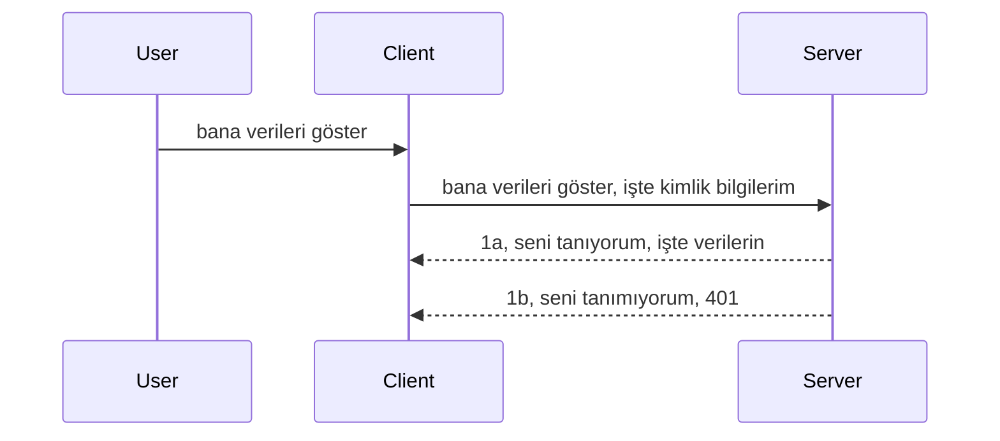

# Basit kimlik doğrulama

MCP SDK'ları OAuth 2.1 kullanımını destekler, ki bu adil olmak gerekirse kimlik sunucusu, kaynak sunucusu, kimlik bilgilerini gönderme, bir kod alma, kodu bir taşıyıcı token ile değiştirme gibi kavramları içeren oldukça karmaşık bir süreçtir ve sonunda kaynak verilerinizi alabilirsiniz. OAuth'a alışık değilseniz, ki bu harika bir uygulamadır, temel bir kimlik doğrulama seviyesinden başlamanız ve giderek daha iyi güvenlik seviyelerine doğru ilerlemeniz iyi bir fikirdir. Bu yüzden bu bölüm var; sizi daha gelişmiş kimlik doğrulamaya hazırlamak için.

## Kimlik doğrulama, ne demek istiyoruz?

Kimlik doğrulama ve yetkilendirme (auth) kelimelerinin kısaltmasıdır. Amaç iki şeyi yapmaktır:

- **Kimlik doğrulama**, bir kişinin evimize girip girmesine izin verip vermeyeceğimizi anlamak, yani MCP Sunucumuzun özelliklerinin bulunduğu kaynak sunucuya erişim hakkının olup olmadığını tespit etme sürecidir.
- **Yetkilendirme**, kullanıcının istediği belirli kaynaklara erişip erişmemesi gerektiğini anlamak, örneğin bu siparişlere ya da ürünlere erişimi olup olmadığını ya da içeriği okuyup okuyamayacağı, ancak silme yetkisinin olmayabileceğini anlamaktır.

## Kimlik Bilgileri: Sisteme kim olduğumuzu nasıl söyleriz

Çoğu web geliştiricisi genellikle sunucuya, orada olup olmamalarına izin veren bir gizli bilgi gibi bir kimlik bilgisi sağlamayı düşünür, yani "Kimlik Doğrulama". Bu kimlik bilgisi genelde kullanıcı adı ve şifrenin base64 kodlu hali ya da belirli bir kullanıcıyı benzersiz tanımlayan bir API anahtarıdır.

Bu, genellikle şöyle bir "Authorization" adındaki başlıktan gönderilir:

```json
{ "Authorization": "secret123" }
```

Buna genellikle temel kimlik doğrulama denir. Genel işleyiş şöyle olur:


```mermaid
sequenceDiagram
   participant User
   participant Client
   participant Server

   User->>Client: bana verileri göster
   Client->>Server: bana verileri göster, işte kimlik bilgilerim
   Server-->>Client: 1a, seni tanıyorum, işte verilerin
   Server-->>Client: 1b, seni tanımıyorum, 401 
```

Akış perspektifinden nasıl çalıştığını anladığımıza göre, bunu nasıl uygularız? Çoğu web sunucusunda middleware denilen, istek sırasında çalışan ve kimlik bilgilerini doğrulayabilen ve eğer kimlik bilgileri geçerliyse isteğin geçmesine izin veren bir kod parçası vardır. Eğer istek geçerli kimlik bilgisine sahip değilse, kimlik doğrulama hatası alırsınız. İsterseniz, bunu nasıl uygulayabileceğimize bakalım:

**Python**

```python
class AuthMiddleware(BaseHTTPMiddleware):
    async def dispatch(self, request, call_next):

        has_header = request.headers.get("Authorization")
        if not has_header:
            print("-> Missing Authorization header!")
            return Response(status_code=401, content="Unauthorized")

        if not valid_token(has_header):
            print("-> Invalid token!")
            return Response(status_code=403, content="Forbidden")

        print("Valid token, proceeding...")
       
        response = await call_next(request)
        # yanıt üzerinde herhangi bir müşteri başlığı ekleyin veya değişiklik yapın
        return response


starlette_app.add_middleware(CustomHeaderMiddleware)
```

Burada şunlar var: 

- `AuthMiddleware` adlı bir middleware oluşturdum ve web sunucusu `dispatch` metodu ile bunu çağırıyor.
- Middleware'i web sunucusuna ekledim:

    ```python
    starlette_app.add_middleware(AuthMiddleware)
    ```

- Authorization başlığının varlığını ve gönderilen gizlinin geçerliliğini kontrol eden doğrulama mantığı yazıldı:

    ```python
    has_header = request.headers.get("Authorization")
    if not has_header:
        print("-> Missing Authorization header!")
        return Response(status_code=401, content="Unauthorized")

    if not valid_token(has_header):
        print("-> Invalid token!")
        return Response(status_code=403, content="Forbidden")
    ```

    Eğer gizli bilgi varsa ve geçerliyse, `call_next` çağrılarak istek içeri geçer ve yanıt döndürülür.

    ```python
    response = await call_next(request)
    # herhangi bir müşteri başlığı ekle veya yanıt üzerinde bir şekilde değişiklik yap
    return response
    ```

İşleyişi şöyledir: Bir web isteği sunucuya geldiğinde middleware çalışır ve onun uygulamasına göre ya isteğin geçmesine izin verir ya da istemcinin ilerlemesine izin verilmediğine dair hata döner.

**TypeScript**

Burada popüler Express framework ile bir middleware oluşturuyoruz ve isteği MCP Sunucusuna ulaşmadan önce yakalıyoruz. İşte kodu:

```typescript
function isValid(secret) {
    return secret === "secret123";
}

app.use((req, res, next) => {
    // 1. Yetkilendirme başlığı mevcut mu?
    if(!req.headers["Authorization"]) {
        res.status(401).send('Unauthorized');
    }
    
    let token = req.headers["Authorization"];

    // 2. Geçerliliği kontrol et.
    if(!isValid(token)) {
        res.status(403).send('Forbidden');
    }

   
    console.log('Middleware executed');
    // 3. İsteği istek işlem hattındaki sonraki adıma geçir.
    next();
});
```

Bu kodda:

1. İlk olarak Authorization başlığının var olup olmadığını kontrol ediyoruz; yoksa 401 hatası gönderiyoruz.
2. Kimlik bilgisi/token geçerliyse, devam etmesine izin veriyoruz; değilse 403 hatası gönderiyoruz.
3. Son olarak, isteği istek hattında ilerletip istenen kaynağı döndürüyoruz.

## Alıştırma: Kimlik doğrulamayı uygulayın

Şimdi bilgimizi alalım ve uygulamaya çalışalım. Plan:

Sunucu

- Bir web sunucusu ve MCP örneği oluşturun.
- Sunucu için middleware'ı uygulayın.

İstemci

- Web isteğini kimlik bilgisi ile beraber başlık üzerinden gönderin.

### -1- Bir web sunucusu ve MCP örneği oluşturun

> [!WARNING]
> Aşağıdaki TypeScript örneği MCP `2025-11-25` sürümünü hedeflemektedir. Taşıyıcıları
> `mcp-session-id` ile izler ve güncel `2026-07-28` taşıyıcı örneği değildir. MCP
> `2026-07-28` "initialize" el sıkışması ve protokol oturum kimliğini kaldırır; yeni
> uygulamalar kendi kendine yeten istekler kullanır. Bkz.
> [MCP’de Neler Değişti: 2026-07-28 Spesifikasyonu](../../01-CoreConcepts/mcp-2026-07-28.md).

İlk adım olarak, web sunucusu örneğini ve MCP Sunucusunu oluşturmalıyız.

**Python**

Burada bir MCP sunucu örneği oluşturuyoruz, starlette web uygulaması yaratıyor ve uvicorn ile barındırıyoruz.

```python
# MCP Sunucusu oluşturuluyor

app = FastMCP(
    name="MCP Resource Server",
    instructions="Resource Server that validates tokens via Authorization Server introspection",
    host=settings["host"],
    port=settings["port"],
    debug=True
)

# starlette web uygulaması oluşturuluyor
starlette_app = app.streamable_http_app()

# uygulama uvicorn ile servis ediliyor
async def run(starlette_app):
    import uvicorn
    config = uvicorn.Config(
            starlette_app,
            host=app.settings.host,
            port=app.settings.port,
            log_level=app.settings.log_level.lower(),
        )
    server = uvicorn.Server(config)
    await server.serve()

run(starlette_app)
```

Bu kodda:

- MCP Sunucusu oluşturuldu.
- MCP Sunucusundan starlette web uygulaması yapıldı, `app.streamable_http_app()`.
- Uvicorn kullanılarak web uygulaması barındırıldı ve servis edildi `server.serve()`.

**TypeScript**

Burada bir MCP Sunucu örneği yaratıyoruz.

```typescript
const server = new McpServer({
      name: "example-server",
      version: "1.0.0"
    });

    // ... sunucu kaynaklarını, araçları ve istemleri ayarlayın ...
```

Bu MCP Sunucu yaratımı POST /mcp rotası tanımlaması içinde yapılmalıdır, yukarıdaki kodu alıp şöyle taşıyalım:

```typescript
import express from "express";
import { randomUUID } from "node:crypto";
import { McpServer } from "@modelcontextprotocol/sdk/server/mcp.js";
import { StreamableHTTPServerTransport } from "@modelcontextprotocol/sdk/server/streamableHttp.js";
import { isInitializeRequest } from "@modelcontextprotocol/sdk/types.js"

const app = express();
app.use(express.json());

// Oturum ID'sine göre taşıyıcıları saklamak için harita
const transports: { [sessionId: string]: StreamableHTTPServerTransport } = {};

// İstemciden sunucuya iletişim için POST isteklerini işleyin
app.post('/mcp', async (req, res) => {
  // Varolan oturum ID'sini kontrol et
  const sessionId = req.headers['mcp-session-id'] as string | undefined;
  let transport: StreamableHTTPServerTransport;

  if (sessionId && transports[sessionId]) {
    // Varolan taşıyıcıyı yeniden kullan
    transport = transports[sessionId];
  } else if (!sessionId && isInitializeRequest(req.body)) {
    // Yeni başlatma isteği
    transport = new StreamableHTTPServerTransport({
      sessionIdGenerator: () => randomUUID(),
      onsessioninitialized: (sessionId) => {
        // Taşıyıcıyı oturum ID'sine göre sakla
        transports[sessionId] = transport;
      },
      // DNS yeniden bağlama koruması geriye dönük uyumluluk için varsayılan olarak devre dışıdır. Bu sunucuyu
      // yerel olarak çalıştırıyorsanız, şunu ayarladığınızdan emin olun:
      // enableDnsRebindingProtection: true,
      // allowedHosts: ['127.0.0.1'],
    });

    // Taşıyıcı kapandığında temizle
    transport.onclose = () => {
      if (transport.sessionId) {
        delete transports[transport.sessionId];
      }
    };
    const server = new McpServer({
      name: "example-server",
      version: "1.0.0"
    });

    // ... sunucu kaynaklarını, araçlarını ve istemleri kur ...

    // MCP sunucusuna bağlan
    await server.connect(transport);
  } else {
    // Geçersiz istek
    res.status(400).json({
      jsonrpc: '2.0',
      error: {
        code: -32000,
        message: 'Bad Request: No valid session ID provided',
      },
      id: null,
    });
    return;
  }

  // İsteği işle
  await transport.handleRequest(req, res, req.body);
});

// GET ve DELETE istekleri için yeniden kullanılabilir işleyici
const handleSessionRequest = async (req: express.Request, res: express.Response) => {
  const sessionId = req.headers['mcp-session-id'] as string | undefined;
  if (!sessionId || !transports[sessionId]) {
    res.status(400).send('Invalid or missing session ID');
    return;
  }
  
  const transport = transports[sessionId];
  await transport.handleRequest(req, res);
};

// SSE yoluyla sunucudan istemciye bildirimler için GET isteklerini işle
app.get('/mcp', handleSessionRequest);

// Oturum sonlandırma için DELETE isteklerini işle
app.delete('/mcp', handleSessionRequest);

app.listen(3000);
```

Şimdi MCP Sunucu yaratımının `app.post("/mcp")` içine taşındığını görüyorsunuz.

Şimdi gelelim gelen kimlik bilgisini doğrulayacak middleware oluşturma adımına.

### -2- Sunucu için bir middleware uygulayın

Şimdi middleware kısmına geçelim. Burada `Authorization` başlığında bir kimlik bilgisi arayan ve doğrulayan bir middleware oluşturacağız. Eğer kabul edilirse, istek gerekli işlemleri yapmaya devam edecek (ör. araç listesini alma, kaynak okuma ya da istemcinin istediği MCP işlevleri).

**Python**

Middleware oluşturmak için `BaseHTTPMiddleware` sınıfından türeyen bir sınıf yaratmamız gerekiyor. İki önemli parça var:

- Header bilgilerini okuduğumuz isteği temsil eden `request`.
- Eğer kabul edilebilir kimlik bilgisi varsa çağırmamız gereken `call_next` callback'i.

Öncelikle `Authorization` başlığı yoksa durumu ele almamız gerek:

```python
has_header = request.headers.get("Authorization")

# başlık yok, 401 ile başarısız ol, aksi takdirde devam et.
if not has_header:
    print("-> Missing Authorization header!")
    return Response(status_code=401, content="Unauthorized")
```

Burada, istemci kimlik doğrulamada başarısız olduğu için 401 yetkisiz mesajı gönderiyoruz.

Sonra, eğer bir kimlik bilgisi gönderildiyse, aşağıdaki gibi doğruluğunu kontrol etmeliyiz:

```python
 if not valid_token(has_header):
    print("-> Invalid token!")
    return Response(status_code=403, content="Forbidden")
```

Yukarıda 403 yasak mesajı gönderdiğimize dikkat edin. Aşağıda tüm söylediklerimizi uygulayan middleware'i görelim:

```python
class AuthMiddleware(BaseHTTPMiddleware):
    async def dispatch(self, request, call_next):

        has_header = request.headers.get("Authorization")
        if not has_header:
            print("-> Missing Authorization header!")
            return Response(status_code=401, content="Unauthorized")

        if not valid_token(has_header):
            print("-> Invalid token!")
            return Response(status_code=403, content="Forbidden")

        print("Valid token, proceeding...")
        print(f"-> Received {request.method} {request.url}")
        response = await call_next(request)
        response.headers['Custom'] = 'Example'
        return response

```

Güzel, peki `valid_token` fonksiyonu ne alemde? İşte burada:

```python
# Üretimde kullanmayın - geliştirin !!
def valid_token(token: str) -> bool:
    # "Bearer " önekini kaldırın
    if token.startswith("Bearer "):
        token = token[7:]
        return token == "secret-token"
    return False
```

Bu açıkça geliştirilmeli.

ÖNEMLİ: Kod içinde böyle gizli anahtarlar asla bulunmamalıdır. Karşılaştırmak için değeri ideal olarak bir veri kaynağından ya da bir IDP'den (kimlik sağlayıcı) almalısınız ya da daha iyisi, IDP doğrulamayı kendisi yapsın.

**TypeScript**

Bunu Express ile uygulamak için `use` metodunu çağırmalıyız ve middleware fonksiyonlarını vermeliyiz.

Yapmamız gerekenler:

- İstek içinden `Authorization` özelliğinde geçen kimlik bilgisine erişmek.
- Kimlik bilgisi geçerliyse isteğin devam etmesini sağlamak ve böylece istemcinin MCP isteğinin çalışmasını sağlamak (örneğin araçları listeleme, kaynak okuma veya diğer MCP fonksiyonları).

Burada `Authorization` başlığı var mı diye kontrol ediyoruz, yoksa isteğin geçmesini durduruyoruz:

```typescript
if(!req.headers["authorization"]) {
    res.status(401).send('Unauthorized');
    return;
}
```

Eğer başlık hiç gönderilmemişse 401 hatası alırsınız.

Sonra kimlik bilgisinin geçerli olup olmadığını kontrol ediyoruz, değilse isteği biraz farklı bir mesajla yine durduruyoruz:

```typescript
if(!isValid(token)) {
    res.status(403).send('Forbidden');
    return;
} 
```

Artık 403 hatası aldığınıza dikkat edin.

İşte tam kod:

```typescript
app.use((req, res, next) => {
    console.log('Request received:', req.method, req.url, req.headers);
    console.log('Headers:', req.headers["authorization"]);
    if(!req.headers["authorization"]) {
        res.status(401).send('Unauthorized');
        return;
    }
    
    let token = req.headers["authorization"];

    if(!isValid(token)) {
        res.status(403).send('Forbidden');
        return;
    }  

    console.log('Middleware executed');
    next();
});
```

Web sunucusunu, istemciden gelen kimlik bilgisini doğrulayacak middleware kabul edecek şekilde ayarladık. Peki istemcinin kendisi ne yapıyor?

### -3- Kimlik bilgisi ile web isteği gönderin (başlık ile)

İstemcinin kimlik bilgisini başlıkta gönderdiğinden emin olmalıyız. MCP istemcisi kullanacağımız için bunun nasıl yapıldığını çözmemiz lazım.

**Python**

İstemci için kimlik bilgi başlığını şöyle göndeririz:

```python
# DEĞERİ sabit kodlama, en azından bir ortam değişkeninde veya daha güvenli bir depolamada bulundur
token = "secret-token"

async with streamablehttp_client(
        url = f"http://localhost:{port}/mcp",
        headers = {"Authorization": f"Bearer {token}"}
    ) as (
        read_stream,
        write_stream,
        session_callback,
    ):
        async with ClientSession(
            read_stream,
            write_stream
        ) as session:
            await session.initialize()
      
            # TODO, istemcide ne yapılmasını istediğin, örn. araçları listele, araçları çağır vs.
```

`headers = {"Authorization": f"Bearer {token}"}` şeklinde `headers` özelliğini doldurduğumuza dikkat edin.

**TypeScript**

Bunu iki aşamada halledebiliriz:

1. Kimlik bilgisi içeren bir yapılandırma nesnesini dolduralım.
2. Bu yapılandırma nesnesini taşıyıcıya iletelim.

```typescript

// DEĞERİ burada gösterildiği gibi sabit kodlama. En azından bir çevresel değişken olarak tutun ve geliştirme modunda dotenv gibi bir şey kullanın.
let token = "secret123"

// bir istemci taşıma seçeneği nesnesi tanımlayın
let options: StreamableHTTPClientTransportOptions = {
  sessionId: sessionId,
  requestInit: {
    headers: {
      "Authorization": "secret123"
    }
  }
};

// seçenekler nesnesini taşıma işlemine geçirin
async function main() {
   const transport = new StreamableHTTPClientTransport(
      new URL(serverUrl),
      options
   );
```

Yukarıda, konfigürasyon nesnesi `options` oluşturarak `requestInit` altında başlıklarımızı yerleştirdiğimizi gördünüz.

ÖNEMLİ: Peki buradan sonra bunu nasıl geliştirebiliriz? Şimdiki uygulama bazı sorunlara sahip. Öncelikle, bu şekilde kimlik bilgisi göndermek en azından HTTPS yoksa oldukça riskli. Olsa bile, kimlik bilgisi çalınabilir; yani token'ın iptal edilebileceği, nereden geldiği kontrolü gibi ek kontroller yapılabilen bir sistem gerekir. Ayrıca isteğin aşırı sık olup olmadığı (bot hareketi gibi) kontrolü gibi pek çok endişe var.

Ancak şunu söylemek gerekir ki çok basit API'ler için, API'nizi çağıran herkesin kimlik doğrulaması olmadan erişmesini istemiyorsanız, burada iyi bir başlangıç var.

Bununla beraber, güvenliği biraz daha artırmak için JSON Web Token (JWT) gibi standart bir format kullanmaya çalışalım.

## JSON Web Token, JWT

Yani, çok basit kimlik bilgisi göndermekten iyileştirmeye çalışıyoruz. JWT kullanmanın hemen sağladığı iyileştirmeler nelerdir?

- **Güvenlik iyileştirmeleri**. Temel kimlik doğrulamada kullanıcı adı ve şifre base64 kodlu token olarak (veya API anahtarı olarak) tekrar tekrar gönderilir, bu risk oluşturur. JWT ise kullanıcı adı ve parolayı gönderip bir token alır ve bu token zaman sınırına sahiptir; yani sona erer. JWT, rollere, kapsam ve izinlere dayalı ince ayarlı erişim kontrolü sunar.
- **Durumsuzluk ve ölçeklenebilirlik**. JWT self-contained'dır; tüm kullanıcı bilgilerini taşır ve sunucu tarafında oturum depolama ihtiyacını ortadan kaldırır. Token lokal olarak doğrulanabilir.
- **Birlikte çalışabilirlik ve federasyon**. JWT OpenID Connect'in merkezindedir ve Entra ID, Google Identity, Auth0 gibi bilinen kimlik sağlayıcılarla kullanılır. Tek oturum açma ve daha fazlasını mümkün kılar, böylece kurumsal seviyededir.
- **Modülerlik ve esneklik**. JWT API Gateway'lerde de kullanılabilir, örneğin Azure API Management, NGINX ve daha fazlası. Kimlik doğrulama senaryoları, sunucudan servise iletişim, kişinin kimliğini taklit etme ve delege etme senaryolarını destekler.
- **Performans ve önbellekleme**. JWT decode edildikten sonra önbelleğe alınabilir, bu parsing ihtiyacını azaltır. Yüksek trafiğe sahip uygulamalarda performansı artırır ve altyapı üzerindeki yükü azaltır.
- **Gelişmiş özellikler**. Sunucu tarafında geçerlilik kontrolü (introspection) ve token iptali (revocation) desteklenir.

Tüm bu faydalarla, uygulamamızı bir sonraki seviyeye taşıyalım.

## Temel kimlik doğrulamayı JWT'ye dönüştürmek

Yüksek seviyede yapmamız gereken değişiklikler:

- **Bir JWT token oluşturmayı öğrenmek** ve istemciden sunucuya gönderilmeye hazır hale getirmek.
- **JWT token doğrulaması yapmak** ve geçerliyse istemciye kaynakları vermek.
- **Token güvenli saklama**. Bu token nasıl saklanır.
- **Rotaları korumak**. Rotaları, bizim durumumuzda MCP özelliklerini ve rotaları korumamız gerekir.
- **Refresh token eklemek**. Kısa ömürlü tokenlar ve uzun ömürlü refresh tokenlar yaratarak, tokenlar süresi dolduğunda yeni token almayı sağlamak. Ayrıca bir refresh endpoint'i ve bir döndürme stratejisi eklemek.

### -1- Bir JWT token oluşturmak

Öncelikle, JWT token aşağıdaki bölümlerden oluşur:

- **header**, kullanılan algoritma ve token türü.
- **payload**, iddialar, örn. sub (token'in temsil ettiği kullanıcı veya varlık, genelde kullanıcı id'si), exp (sona erme zamanı), role (rol)
- **signature**, bir gizli anahtar ya da özel anahtar ile imzalanır.

Bunun için header, payload ve kodlanmış token oluşturulmalıdır.

**Python**

```python

import jwt
import jwt
from jwt.exceptions import ExpiredSignatureError, InvalidTokenError
import datetime

# JWT'yi imzalamak için kullanılan gizli anahtar
secret_key = 'your-secret-key'

header = {
    "alg": "HS256",
    "typ": "JWT"
}

# kullanıcı bilgileri ve talepleri ile son kullanma süresi
payload = {
    "sub": "1234567890",               # Konu (kullanıcı kimliği)
    "name": "User Userson",                # Özel talep
    "admin": True,                     # Özel talep
    "iat": datetime.datetime.utcnow(),# Veriliş tarihi
    "exp": datetime.datetime.utcnow() + datetime.timedelta(hours=1)  # Son kullanma tarihi
}

# şifrele
encoded_jwt = jwt.encode(payload, secret_key, algorithm="HS256", headers=header)
```

Yukarıdaki kodda:

- Algoritma olarak HS256, tür olarak JWT şeklinde bir header tanımladık.
- Bir payload oluşturduk, içinde bir subject veya kullanıcı id'si, kullanıcı adı, rol, veriliş zamanı ve sona erme zamanı var; böylece daha önce bahsettiğimiz zaman bağımlılığı uygulanmış oldu.

**TypeScript**

Burada JWT token oluşturmanıza yardım edecek bazı bağımlılıklara ihtiyacımız olacak.

Bağımlılıklar

```sh

npm install jsonwebtoken
npm install --save-dev @types/jsonwebtoken
```

Bunu kurduktan sonra, header ve payload'u oluşturup, şifrelenmiş token'u yaratacağız.

```typescript
import jwt from 'jsonwebtoken';

const secretKey = 'your-secret-key'; // Üretimde ortam değişkenlerini kullan

// Yükü tanımla
const payload = {
  sub: '1234567890',
  name: 'User usersson',
  admin: true,
  iat: Math.floor(Date.now() / 1000), // Veriliş zamanı
  exp: Math.floor(Date.now() / 1000) + 60 * 60 // 1 saat içinde geçersiz olur
};

// Başlığı tanımla (opsiyonel, jsonwebtoken varsayılanları ayarlar)
const header = {
  alg: 'HS256',
  typ: 'JWT'
};

// Token oluştur
const token = jwt.sign(payload, secretKey, {
  algorithm: 'HS256',
  header: header
});

console.log('JWT:', token);
```

Bu token:

HS256 ile imzalanmış
1 saat geçerlilik süresi var
sub, name, admin, iat ve exp gibi iddialar içeriyor.

### -2- Bir token doğrulama

Token doğrulamaya da ihtiyacımız var. Bu, istemcinin gönderdiğinin gerçekten geçerli olup olmadığını kontrol etmek için sunucuda yapılmalı. Burada yapısal doğrulamadan geçerliliğe kadar pek çok kontrol yapmalıyız. Ayrıca kullanıcının sisteminizde olup olmadığını görmek gibi başka kontroller eklemeye teşvik edilirsiniz.

Token'u doğrulamak için önce decode ederek okuyacağız ve sonra geçerliliğini kontrol edeceğiz:

**Python**

```python

# JWT'yi çöz ve doğrula
try:
    decoded = jwt.decode(token, secret_key, algorithms=["HS256"])
    print("✅ Token is valid.")
    print("Decoded claims:")
    for key, value in decoded.items():
        print(f"  {key}: {value}")
except ExpiredSignatureError:
    print("❌ Token has expired.")
except InvalidTokenError as e:
    print(f"❌ Invalid token: {e}")

```


Bu kodda, giriş olarak token, gizli anahtar ve seçilen algoritma kullanılarak `jwt.decode` çağrılır. Başarısız bir doğrulamanın hata oluşturmasına neden olacağından, try-catch yapısını kullandığımıza dikkat edin.

**TypeScript**

Burada token'ın çözümlenmiş bir versiyonunu elde etmek için `jwt.verify` çağrısını yapmamız gerekiyor ki bunu daha fazla analiz edebilelim. Bu çağrı başarısız olursa, bu token yapısının yanlış olduğu ya da artık geçerli olmadığı anlamına gelir.

```typescript

try {
  const decoded = jwt.verify(token, secretKey);
  console.log('Decoded Payload:', decoded);
} catch (err) {
  console.error('Token verification failed:', err);
}
```

NOT: Daha önce bahsedildiği gibi, bu tokenın sistemimizde bir kullanıcıyı işaret ettiğinden ve kullanıcının iddia ettiği haklara sahip olduğundan emin olmak için ek kontroller yapmalıyız.

Şimdi ise, rol tabanlı erişim kontrolü veya diğer adıyla RBAC konusuna bakalım.

## Rol tabanlı erişim kontrolü eklemek

Fikir, farklı rollerin farklı izinlere sahip olduğunu ifade etmektir. Örneğin, bir yöneticinin her şeyi yapabileceğini, normal bir kullanıcının okuma/yazma yapabileceğini ve konukların yalnızca okuyabileceğini varsayıyoruz. Bu nedenle, işte bazı olası izin seviyeleri:

- Admin.Write 
- User.Read
- Guest.Read

Böyle bir kontrolü middleware ile nasıl uygulayabileceğimize bakalım. Middleware'ler belirli bir rota için veya tüm rotalar için eklenebilir.

**Python**

```python
from starlette.middleware.base import BaseHTTPMiddleware
from starlette.responses import JSONResponse
import jwt

# GİZLİ ANAHTARI kod içinde bulundurmayın, bu sadece gösterim amaçlıdır. Güvenli bir yerden okuyun.
SECRET_KEY = "your-secret-key" # bunu ortam değişkenine koyun
REQUIRED_PERMISSION = "User.Read"

class JWTPermissionMiddleware(BaseHTTPMiddleware):
    async def dispatch(self, request, call_next):
        auth_header = request.headers.get("Authorization")
        if not auth_header or not auth_header.startswith("Bearer "):
            return JSONResponse({"error": "Missing or invalid Authorization header"}, status_code=401)

        token = auth_header.split(" ")[1]
        try:
            decoded = jwt.decode(token, SECRET_KEY, algorithms=["HS256"])
        except jwt.ExpiredSignatureError:
            return JSONResponse({"error": "Token expired"}, status_code=401)
        except jwt.InvalidTokenError:
            return JSONResponse({"error": "Invalid token"}, status_code=401)

        permissions = decoded.get("permissions", [])
        if REQUIRED_PERMISSION not in permissions:
            return JSONResponse({"error": "Permission denied"}, status_code=403)

        request.state.user = decoded
        return await call_next(request)


```

Middleware'i aşağıdakiler gibi birkaç farklı şekilde ekleyebilirsiniz:

```python

# Alt 1: starlette uygulaması oluşturulurken middleware ekle
middleware = [
    Middleware(JWTPermissionMiddleware)
]

app = Starlette(routes=routes, middleware=middleware)

# Alt 2: starlette uygulaması zaten oluşturulduktan sonra middleware ekle
starlette_app.add_middleware(JWTPermissionMiddleware)

# Alt 3: route başına middleware ekle
routes = [
    Route(
        "/mcp",
        endpoint=..., # işlemci
        middleware=[Middleware(JWTPermissionMiddleware)]
    )
]
```

**TypeScript**

`app.use` ve tüm istekler için çalışacak bir middleware kullanabiliriz.

```typescript
app.use((req, res, next) => {
    console.log('Request received:', req.method, req.url, req.headers);
    console.log('Headers:', req.headers["authorization"]);

    // 1. Yetkilendirme başlığının gönderilip gönderilmediğini kontrol edin

    if(!req.headers["authorization"]) {
        res.status(401).send('Unauthorized');
        return;
    }
    
    let token = req.headers["authorization"];

    // 2. Token geçerli mi kontrol edin
    if(!isValid(token)) {
        res.status(403).send('Forbidden');
        return;
    }  

    // 3. Token kullanıcısının sistemimizde var olup olmadığını kontrol edin
    if(!isExistingUser(token)) {
        res.status(403).send('Forbidden');
        console.log("User does not exist");
        return;
    }
    console.log("User exists");

    // 4. Token'ın doğru izinlere sahip olduğunu doğrulayın
    if(!hasScopes(token, ["User.Read"])){
        res.status(403).send('Forbidden - insufficient scopes');
    }

    console.log("User has required scopes");

    console.log('Middleware executed');
    next();
});

```

Middleware'imizin yapması gereken ve yapması GEREKEN oldukça fazla şey var, yani:

1. Authorization başlığının var olup olmadığını kontrol et
2. Token geçerli mi kontrol et, `isValid` metodunu çağırıyoruz, bu metod JWT tokenının bütünlüğünü ve geçerliliğini kontrol eder.
3. Kullanıcının sistemimizde var olduğunun doğrulanması gerekiyor.

   ```typescript
    // DB'deki kullanıcılar
   const users = [
     "user1",
     "User usersson",
   ]

   function isExistingUser(token) {
     let decodedToken = verifyToken(token);

     // TODO, kullanıcının DB'de var olup olmadığını kontrol et
     return users.includes(decodedToken?.name || "");
   }
   ```

   Yukarıda, basit bir `users` listesi oluşturduk, ki aslında bu veritabanında olmalı.

4. Ayrıca, tokenın doğru izinlere sahip olduğunu da kontrol etmeliyiz.

   ```typescript
   if(!hasScopes(token, ["User.Read"])){
        res.status(403).send('Forbidden - insufficient scopes');
   }
   ```

   Yukarıdaki middleware kodunda, tokenın User.Read izni içerip içermediğini kontrol ediyoruz, yoksa 403 hatası gönderiyoruz. Aşağıda `hasScopes` yardımcı metodu bulunmaktadır.

   ```typescript
   function hasScopes(scope: string, requiredScopes: string[]) {
     let decodedToken = verifyToken(scope);
    return requiredScopes.every(scope => decodedToken?.scopes.includes(scope));
  }
   ```

Have a think which additional checks you should be doing, but these are the absolute minimum of checks you should be doing.

Using Express as a web framework is a common choice. There are helpers library when you use JWT so you can write less code.

- `express-jwt`, helper library that provides a middleware that helps decode your token.
- `express-jwt-permissions`, this provides a middleware `guard` that helps check if a certain permission is on the token.

Here's what these libraries can look like when used:

```typescript
const express = require('express');
const jwt = require('express-jwt');
const guard = require('express-jwt-permissions')();

const app = express();
const secretKey = 'your-secret-key'; // put this in env variable

// Decode JWT and attach to req.user
app.use(jwt({ secret: secretKey, algorithms: ['HS256'] }));

// Check for User.Read permission
app.use(guard.check('User.Read'));

// multiple permissions
// app.use(guard.check(['User.Read', 'Admin.Access']));

app.get('/protected', (req, res) => {
  res.json({ message: `Welcome ${req.user.name}` });
});

// Error handler
app.use((err, req, res, next) => {
  if (err.code === 'permission_denied') {
    return res.status(403).send('Forbidden');
  }
  next(err);
});

```

Artık middleware'in hem kimlik doğrulama hem de yetkilendirme için nasıl kullanılabileceğini gördünüz, peki MCP için durum nasıl, kimlik doğrulama biçimimizi değiştiriyor mu? Bir sonraki bölümde öğrenelim.

### -3- RBAC'yi MCP'ye eklemek

Şimdiye kadar middleware ile RBAC nasıl eklenir gördünüz ancak MCP için özellik başına RBAC eklemek kolay değil, peki ne yapmalıyız? İşte, bu durumda belirli bir aracın çağrılma hakkı olup olmadığını kontrol eden şöyle bir kod eklememiz gerekiyor:

Özellik başına RBAC'yi gerçekleştirmenin birkaç farklı yolu var, işte bazıları:

- İzin seviyesini kontrol etmeniz gereken her araç, kaynak, istek için bir kontrol ekleyin.

   **python**

   ```python
   @tool()
   def delete_product(id: int):
      try:
          check_permissions(role="Admin.Write", request)
      catch:
        pass # istemci yetkilendirme başarısız oldu, yetkilendirme hatası oluştur
   ```

   **typescript**

   ```typescript
   server.registerTool(
    "delete-product",
    {
      title: Delete a product",
      description: "Deletes a product",
      inputSchema: { id: z.number() }
    },
    async ({ id }) => {
      
      try {
        checkPermissions("Admin.Write", request);
        // yapılacak, id'yi productService ve remote entry'ye gönder
      } catch(Exception e) {
        console.log("Authorization error, you're not allowed");  
      }

      return {
        content: [{ type: "text", text: `Deletected product with id ${id}` }]
      };
    }
   );
   ```


- Gelişmiş sunucu yaklaşımı ve istek işleyicileri kullanarak kontrolleri yalnızca gerekli yerde yapacak şekilde minimize edin.

   **Python**

   ```python
   
   tool_permission = {
      "create_product": ["User.Write", "Admin.Write"],
      "delete_product": ["Admin.Write"]
   }

   def has_permission(user_permissions, required_permissions) -> bool:
      # user_permissions: kullanıcının sahip olduğu izinlerin listesi
      # required_permissions: araç için gerekli izinlerin listesi
      return any(perm in user_permissions for perm in required_permissions)

   @server.call_tool()
   async def handle_call_tool(
     name: str, arguments: dict[str, str] | None
   ) -> list[types.TextContent]:
    # request.user.permissions'in kullanıcının izinlerinden oluşan bir liste olduğunu varsayın
     user_permissions = request.user.permissions
     required_permissions = tool_permission.get(name, [])
     if not has_permission(user_permissions, required_permissions):
        # Hata oluştur "Aracı çağırma izniniz yok {name}"
        raise Exception(f"You don't have permission to call tool {name}")
     # devam et ve aracı çağır
     # ...
   ```   
   

   **TypeScript**

   ```typescript
   function hasPermission(userPermissions: string[], requiredPermissions: string[]): boolean {
       if (!Array.isArray(userPermissions) || !Array.isArray(requiredPermissions)) return false;
       // Kullanıcının en az bir gerekli izne sahip olması durumunda true döndürür
       
       return requiredPermissions.some(perm => userPermissions.includes(perm));
   }
  
   server.setRequestHandler(CallToolRequestSchema, async (request) => {
      const { params: { name } } = request;
  
      let permissions = request.user.permissions;
  
      if (!hasPermission(permissions, toolPermissions[name])) {
         return new Error(`You don't have permission to call ${name}`);
      }
  
      // devam et..
   });
   ```

   Dikkat edin, middleware'inizin çözümlenmiş tokenı istek nesnesinin user özelliğine atadığından emin olmalısınız ki yukarıdaki kod basit olsun.

### Özet

Genel olarak ve özellikle MCP için RBAC desteği nasıl eklenir tartıştıktan sonra, sunulan kavramları anladığınızdan emin olmak için güvenliği kendi başınıza uygulamayı denemenin zamanı geldi.

## Ödev 1: Temel kimlik doğrulama kullanarak bir mcp sunucusu ve mcp istemcisi oluşturun

Burada, başlıklar aracılığıyla kimlik bilgilerini göndermeyi öğrendiklerinizi kullanacaksınız.

## Çözüm 1

[Solution 1](./code/basic/README.md)

## Ödev 2: Ödev 1'deki çözümü JWT kullanacak şekilde yükseltin

İlk çözümü alın ama bu sefer üzerine geliştirelim.

Basic Auth yerine JWT kullanalım.

## Çözüm 2

[Solution 2](./solution/jwt-solution/README.md)

## Meydan Okuma

"RBAC'yi MCP'ye ekleme" bölümünde anlattığımız araç başına RBAC'yi ekleyin.

## Özet

Umarız bu bölümde sıfırdan temel güvenliğe, JWT'ye ve bunun MCP'ye nasıl eklenebileceğine kadar çok şey öğrenmişsinizdir.

Özel JWT'lerle sağlam bir temel oluşturduk, ancak ölçeklendikçe standartlara dayalı bir kimlik modeline doğru ilerliyoruz. Entra veya Keycloak gibi bir IdP kullanmak, token verilmesi, doğrulanması ve yaşam döngüsü yönetimini güvenilir bir platforma devretmemizi sağlar — böylece uygulama mantığı ve kullanıcı deneyimine odaklanabiliriz.

Bunun için, daha [ileri düzeyde Entra ile ilgili bir bölümümüz var](../../05-AdvancedTopics/mcp-security-entra/README.md)

## Sırada Ne Var

- Sonraki: [MCP Hostları Kurmak](../12-mcp-hosts/README.md)

---

<!-- CO-OP TRANSLATOR DISCLAIMER START -->
**Feragatname**:
Bu belge, AI çeviri hizmeti [Co-op Translator](https://github.com/Azure/co-op-translator) kullanılarak çevrilmiştir. Doğruluk için çaba sarf etsek de, otomatik çevirilerin hata veya yanlışlık içerebileceğini lütfen unutmayınız. Orijinal belge, kendi dilinde yetkili kaynak olarak kabul edilmelidir. Kritik bilgiler için profesyonel insan çevirisi önerilir. Bu çevirinin kullanımı sonucu ortaya çıkabilecek yanlış anlamalardan veya yanlış yorumlamalardan sorumlu değiliz.
<!-- CO-OP TRANSLATOR DISCLAIMER END -->