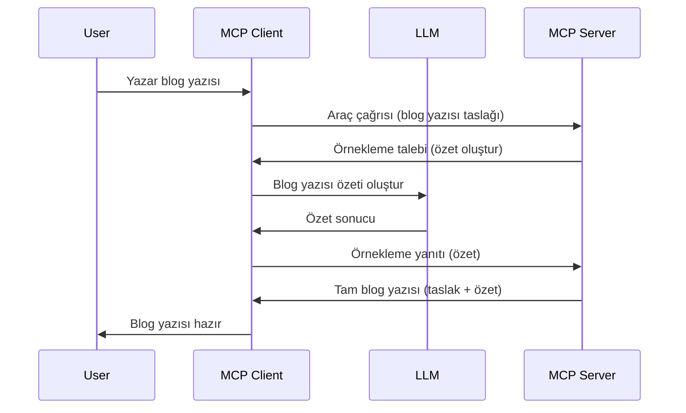

> [!WARNING]
> Örnekleme, MCP `2026-07-28` sürümünde kullanımdan kaldırılmıştır. Bu ders, 
> eski uygulamalar için saklanmaktadır. Yeni sunucular doğrudan bir LLM sağlayıcı 
> API'si ile entegre olmalıdır.

# Örnekleme - özellikleri İstemciye devretme

> Örnekleme, uyumluluk için `2026-07-28` spesifikasyonunda kalmaya devam etmekte olup,
> 28 Temmuz 2027 ya da sonrasında yayımlanacak ilk revizyonda kaldırılabilir. Bu dersteki
> örnekler `2025-11-25` sürümünü uygulayan SDK API'lerini kullanabilir.
> Bakınız: [MCP’de Neler Değişti: 2026-07-28 Spesifikasyonu](../../01-CoreConcepts/mcp-2026-07-28.md).

Eski uygulamalarda, örnekleme MCP sunucusunun istemci tarafından yönetilen bir LLM’den
yardım istemesini sağlar. Yeni uygulamalarda ise doğrudan seçilen LLM sağlayıcıya çağrı yapılmalıdır.


## Genel Bakış

Bu derste örneklemenin ne zaman ve nerede kullanılacağını ve nasıl yapılandırılacağını açıklamaya odaklanacağız.

## Öğrenme Hedefleri

Bu bölümde:

- Örneklemenin ne olduğunu ve ne zaman kullanılacağını açıklayacağız.
- MCP’de örneklemenin nasıl yapılandırılacağını göstereceğiz.
- Örnekleme örneklerini sunacağız.

## Örnekleme nedir ve neden kullanılır?

Örnekleme, aşağıdaki şekilde çalışan gelişmiş bir özelliktir:



### Örnekleme isteği

Tamam, şimdi inandırıcı bir senaryonun geniş bir görünümüne sahibiz, gelin sunucunun istemciye geri gönderdiği örnekleme isteğinden bahsedelim. Böyle bir isteğin JSON-RPC formatında nasıl görünebileceğine bakalım:

```json
{
  "jsonrpc": "2.0",
  "id": 1,
  "method": "sampling/createMessage",
  "params": {
    "messages": [
      {
        "role": "user",
        "content": {
          "type": "text",
          "text": "Create a blog post summary of the following blog post: <BLOG POST>"
        }
      }
    ],
    "modelPreferences": {
      "hints": [
        {
          "name": "claude-3-sonnet"
        }
      ],
      "intelligencePriority": 0.8,
      "speedPriority": 0.5
    },
    "systemPrompt": "You are a helpful assistant.",
    "maxTokens": 100
  }
}
```

Burada dikkat çekilmesi gereken birkaç şey var:

- Prompt, content -> text altında, LLM’ye blog yazısı içeriğini özetlemesi için verilen talimatımızdır.

- **modelPreferences**. Bu bölüm yalnızca bir tercihtir, LLM ile kullanılacak yapılandırma için bir öneridir. Kullanıcı bu önerilere uyabilir veya değiştirebilir. Bu durumda kullanılacak model, hız ve zeka önceliğine dair öneriler var.
- **systemPrompt**, LLM’nize kişilik katan ve rehberlik talimatları içeren normal sistem isteminiz budur.
- **maxTokens**, bu da bu görev için önerilen maksimum token sayısını belirten başka bir özelliktir.

### Örnekleme yanıtı

Bu yanıt, MCP İstemcisinin MCP Sunucusuna gönderdiği ve istemcinin LLM’yi çağırdıktan sonra bu yanıtı bekleyip oluşturduğu mesajdır. JSON-RPC formatında şöyle görünebilir:

```json
{
  "jsonrpc": "2.0",
  "id": 1,
  "result": {
    "role": "assistant",
    "content": {
      "type": "text",
      "text": "Here's your abstract <ABSTRACT>"
    },
    "model": "gpt-5",
    "stopReason": "endTurn"
  }
}
```

Yanıtın blog yazısının özetini içerdiğine dikkat edin, tıpkı istediğimiz gibi. Ayrıca kullanılan `model`’in istediğimiz değil de "gpt-5" olduğunu, "claude-3-sonnet" yerine, not edin. Bu, kullanıcının seçimlerini değiştirebileceğini ve örnekleme isteğinizin bir öneri olduğunu göstermek içindir.

Tamam, artık ana akışı ve "blog yazısı oluşturma + özet" gibi faydalı bir görevi anladığımıza göre, bunu çalıştırmak için neler yapmamız gerektiğine bakalım.

### Mesaj türleri

Örnekleme mesajları sadece metinle sınırlı değildir, aynı zamanda resim ve ses de gönderebilirsiniz. JSON-RPC’nin nasıl farklı göründüğüne bakalım:

**Metin**

```json
{
  "type": "text",
  "text": "The message content"
}
```

**Resim içeriği**


```json
{
  "type": "image",
  "data": "base64-encoded-image-data",
  "mimeType": "image/jpeg"
}
```

**Ses içeriği**

```json
{
  "type": "audio",
  "data": "base64-encoded-audio-data",
  "mimeType": "audio/wav"
}
```

> NOT: Mevcut durumu ve geçiş rehberliğini görmek için
> [kullanımı bırakılan Sampling dokümantasyonuna](https://modelcontextprotocol.io/specification/2026-07-28/client/sampling) bakın.

## İstemcide Sampling Yapılandırması Nasıl Olur

> Not: Sadece bir sunucu inşa ediyorsanız, burada pek bir şey yapmanıza gerek yoktur.

Bir istemcide, aşağıdaki özelliği şu şekilde belirtmeniz gerekir:

```json
{
  "capabilities": {
    "sampling": {}
  }
}
```

Bu, seçtiğiniz istemci sunucu ile başlatıldığında aktif hale gelecektir.

## Sampling Örneği - Bir Blog Yazısı Oluştur

Bir sampling sunucusu birlikte kodlayalım, şunları yapmamız gerekecek:

1. Sunucuda bir araç oluşturun.
1. Bu araç bir sampling isteği oluşturmalı
1. Araç, istemcinin sampling isteğine yanıt verilmesini beklemeli.
1. Sonra aracın sonucu üretilmeli.

Kodu adım adım inceleyelim:

### -1- Aracı oluştur

**python**

```python
@mcp.tool()
async def create_blog(title: str, content: str, ctx: Context[ServerSession, None]) -> str:
    """Create a blog post and generate a summary"""

```

### -2- Sampling isteği oluştur

Aracınızı aşağıdaki kodla genişletin:

**python**

```python
post = BlogPost(
        id=len(posts) + 1,
        title=title,
        content=content,
        abstract=""
    )

prompt = f"Create an abstract of the following blog post: title: {title} and draft: {content} "

result = await ctx.session.create_message(
        messages=[
            SamplingMessage(
                role="user",
                content=TextContent(type="text", text=prompt),
            )
        ],
        max_tokens=100,
)

```

### -3- Yanıt bekle ve yanıtı döndür

**python**

```python
post.abstract = result.content.text

posts.append(post)

# tam ürünü geri döndür
return json.dumps({
    "id": post.title,
    "abstract": post.abstract
})
```

### -4- Tam kod

**python**

```python
from starlette.applications import Starlette
from starlette.routing import Mount, Host

from mcp.server.fastmcp import Context, FastMCP

from mcp.server.session import ServerSession
from mcp.types import SamplingMessage, TextContent

import json


from uuid import uuid4
from typing import List
from pydantic import BaseModel


mcp = FastMCP("Blog post generator")

# app = FastAPI()

posts = []

class BlogPost(BaseModel):
    id: int
    title: str
    content: str
    abstract: str

posts: List[BlogPost] = []

@mcp.tool()
async def create_blog(title: str, content: str, ctx: Context[ServerSession, None]) -> str:
    """Create a blog post and generate a summary"""

    post = BlogPost(
        id=len(posts) + 1,
        title=title,
        content=content,
        abstract=""
    )

    prompt = f"Create an abstract of the following blog post: title: {title} and draft: {content} "

    result = await ctx.session.create_message(
        messages=[
            SamplingMessage(
                role="user",
                content=TextContent(type="text", text=prompt),
            )
        ],
        max_tokens=100,
    )

    post.abstract = result.content.text

    posts.append(post)

    # tam blog gönderisini döndür
    return json.dumps({
        "id": post.title,
        "abstract": post.abstract
    })

if __name__ == "__main__":
    print("Starting server...")
    # mcp.run()
    mcp.run(transport="streamable-http")

# uygulamayı çalıştır: python server.py
```

### -5- Visual Studio Code'da test etme

Bunu Visual Studio Code'da test etmek için şu adımları izleyin:

1. Terminalde sunucuyu başlatın
1. *mcp.json* dosyasına ekleyin (ve başlatıldığından emin olun), örneğin şöyle:

   ```json
   "servers": {
      "blog-server": {
        "type": "http",
        "url": "http://localhost:8000/mcp"
      }
   }
   ```

1. Bir komut girin:

   ```text
   create a blog post named "Where Python comes from", the content is "Python is actually named after Monty Python Flying Circus"
   ```

1. Sampling gerçekleşmesine izin verin. İlk kez test ettiğinizde ek bir diyalog karşınıza çıkacak, onu kabul etmeniz gerekecek, sonra aracın çalıştırılması için normal diyalog görünecek.

1. Sonuçları inceleyin. Sonuçları hem GitHub Copilot Sohbet'te güzelce formatlanmış olarak göreceksiniz hem de ham JSON yanıtını inceleyebilirsiniz.

**Bonus**. Visual Studio Code araçları sampling için harika destek sunar. Yüklü sunucunuzdaki Sampling erişimini şu şekilde yapılandırabilirsiniz:

1. Uzantılar bölümüne gidin.
1. "MCP SUNUCULARI - YÜKLENENLER" bölümünde yüklü sunucunuzun dişli simgesini seçin.
1 "Model Erişimini Yapılandır" seçeneğini seçin, burada Sampling yaparken GitHub Copilot'un hangi Modelleri kullanmasına izin verileceğini seçebilirsiniz. Ayrıca "Sampling isteklerini göster" seçeneğini seçerek son zamanlarda yapılmış tüm sampling isteklerini görebilirsiniz.

## Ödev

Bu ödevde, biraz farklı bir Sampling yani ürün açıklaması oluşturmayı destekleyen bir sampling entegrasyonu inşa edeceksiniz. İşte senaryonuz:

**Senaryo**: Bir e-ticaretin arka ofis çalışanı yardıma ihtiyaç duyuyor, ürün açıklaması oluşturmak çok fazla zaman alıyor. Bu nedenle, "title" ve "keywords" argümanlarıyla "create_product" adlı bir aracı çağırabileceğiniz ve istemci tarafı LLM tarafından doldurulacak "description" alanı da dahil olmak üzere tam bir ürün üretecek bir çözüm inşa ediyorsunuz.

İPUCU: Bu sunucu ve aracını önceden öğrendiklerinizi kullanarak bir sampling isteği ile oluşturun.

## Çözüm

[Çözüm](./solution/README.md)

## Temel Çıkarımlar


Örnekleme, sunucunun büyük dil modelinin (LLM) yardımına ihtiyaç duyduğunda görevleri istemciye devretmesini sağlayan güçlü bir özelliktir.

## Sonraki Adımlar

- [Bölüm 4 - Pratik uygulama](../../04-PracticalImplementation/README.md)

---

<!-- CO-OP TRANSLATOR DISCLAIMER START -->
**Feragatname**:
Bu belge, AI çeviri hizmeti [Co-op Translator](https://github.com/Azure/co-op-translator) kullanılarak çevrilmiştir. Doğruluk için çaba sarf etsek de, otomatik çevirilerin hata veya yanlışlık içerebileceğini lütfen unutmayınız. Orijinal belge, kendi dilinde yetkili kaynak olarak kabul edilmelidir. Kritik bilgiler için profesyonel insan çevirisi önerilir. Bu çevirinin kullanımı sonucu ortaya çıkabilecek yanlış anlamalardan veya yanlış yorumlamalardan sorumlu değiliz.
<!-- CO-OP TRANSLATOR DISCLAIMER END -->