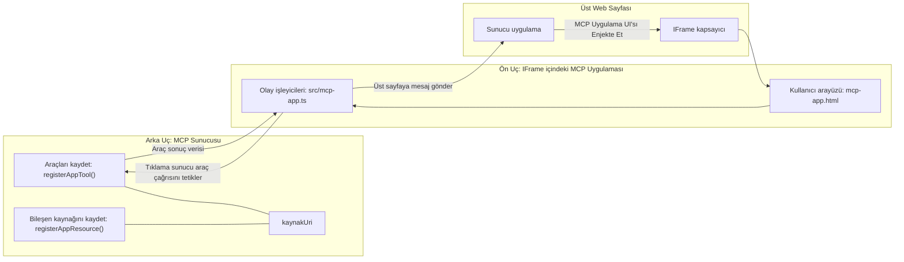
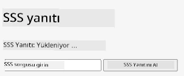
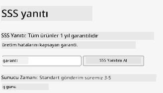
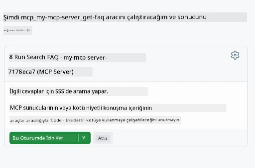
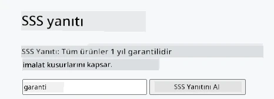

# MCP Uygulamaları

MCP Uygulamaları, MCP'de yeni bir paradigma. Fikir, sadece bir araç çağrısından veri ile yanıt vermek değil, aynı zamanda bu bilgiyle nasıl etkileşim kurulması gerektiği bilgisini sağlamaktır. Bu, araç sonuçlarının artık UI (kullanıcı arayüzü) bilgisi içerebileceği anlamına gelir. Peki neden bunu isteriz? Bugün nasıl yaptığını düşün. Muhtemelen bir MCP Sunucusunun sonuçlarını önüne bir tür frontend koyarak tüketiyorsun, bu yazman ve bakımını yapman gereken bir kod olur. Bazen bu istediğin şeydir, ancak bazen tüm veriden kullanıcı arayüzüne kadar her şeyi içeren, kendi kendine yeten küçük bir bilgi parçasını getirmen harika olurdu.

## Genel Bakış

Bu ders, MCP Uygulamaları hakkında pratik rehberlik sağlar, nasıl başlanacağı ve mevcut Web Uygulamalarına nasıl entegre edileceği anlatılır. MCP Uygulamaları, MCP Standardına çok yeni eklenmiş bir özelliktir.

## Öğrenme Hedefleri

Bu dersin sonunda şunları yapabileceksiniz:

- MCP Uygulamalarının ne olduğunu açıklamak.
- MCP Uygulamalarının ne zaman kullanılacağını.
- Kendi MCP Uygulamalarınızı oluşturmak ve entegre etmek.

## MCP Uygulamaları - nasıl çalışır

MCP Uygulamaları fikri, temelde render edilecek bir bileşen olarak bir yanıt sağlamaktır. Böyle bir bileşenin hem görsel hem de etkileşimli özellikleri olabilir, örneğin buton tıklamaları, kullanıcı girdisi ve daha fazlası. Sunucu tarafı ve MCP Sunucumuzla başlayalım. Bir MCP Uygulama bileşeni yaratmak için hem bir araç hem de uygulama kaynağı oluşturman gerekir. Bu iki parça bir resourceUri ile bağlıdır.

İşte bir örnek. Neler olduğunu ve hangi parçanın ne yaptığını görselleştirelim:

```text
server.ts -- responsible for registering tools and the component as a UI component
src/
  mcp-app.ts -- wiring up event handlers
mcp-app.html -- the user interface
```

Bu görsel, bir bileşen oluşturmanın mimarisini ve mantığını tanımlar.


Ardından sırayla backend ve frontend sorumluluklarını tanımlamaya çalışalım.

### Backend

Burada başarmamız gereken iki şey var:

- Etkileşimde bulunmak istediğimiz araçları kaydetmek.
- Bileşeni tanımlamak.

**Aracı kaydetmek**

```typescript
registerAppTool(
    server,
    "get-time",
    {
      title: "Get Time",
      description: "Returns the current server time.",
      inputSchema: {},
      _meta: { ui: { resourceUri } }, // Bu aracı UI kaynağına bağlar
    },
    async () => {
      const time = new Date().toISOString();
      return { content: [{ type: "text", text: time }] };
    },
  );

```

Yukarıdaki kod, `get-time` adında bir araç sunduğu davranışı tanımlar. Girdi almaz ama güncel zamanı üretir. Kullanıcı girdisi alabilmek için araçlar için bir `inputSchema` tanımlama yeteneğimiz var.

**Bileşeni kaydetmek**

Aynı dosyada, bileşeni de kaydetmemiz gerekir:

```typescript
const resourceUri = "ui://get-time/mcp-app.html";

// UI için paketlenmiş HTML/JavaScript'i döndüren kaynağı kaydedin.
registerAppResource(
  server,
  resourceUri,
  resourceUri,
  { mimeType: RESOURCE_MIME_TYPE },
  async () => {
    const html = await fs.readFile(path.join(DIST_DIR, "mcp-app.html"), "utf-8");

    return {
    contents: [
        { uri: resourceUri, mimeType: RESOURCE_MIME_TYPE, text: html },
    ],
    };
  },
);
```

Bileşeni araçlara bağlamak için nasıl `resourceUri` belirttiğimize dikkat edin. İlgi çekici bir diğer nokta da UI dosyasını yükleyip bileşeni döndüren callback'dir.

### Bileşen frontend

Backend gibi, burada da iki parça var:

- Saf HTML ile yazılmış bir frontend.
- Olayları ve yapılacakları yöneten kod, örneğin araç çağırma veya ebeveyn pencereye mesaj gönderme.

**Kullanıcı arayüzü**

Kullanıcı arayüzüne bir bakalım.

```html
<!-- mcp-app.html -->
<!DOCTYPE html>
<html lang="en">
  <head>
    <meta charset="UTF-8" />
    <title>Get Time App</title>
  </head>
  <body>
    <p>
      <strong>Server Time:</strong> <code id="server-time">Loading...</code>
    </p>
    <button id="get-time-btn">Get Server Time</button>
    <script type="module" src="/src/mcp-app.ts"></script>
  </body>
</html>
```

**Olay bağlama**

Son parça olay bağlama. Bu, UI'daki hangi bölümün olay işleyicilere ihtiyaç duyduğunu belirlemek ve olaylar tetiklenirse ne yapılacağını tanımlamak demektir:

```typescript
// mcp-app.ts

import { App } from "@modelcontextprotocol/ext-apps";

// Eleman referanslarını al
const serverTimeEl = document.getElementById("server-time")!;
const getTimeBtn = document.getElementById("get-time-btn")!;

// Uygulama örneği oluştur
const app = new App({ name: "Get Time App", version: "1.0.0" });

// Sunucudan araç sonuçlarını işle. İlk araç sonucunu kaçırmamak için `app.connect()` öncesinde ayarla
// ilk araç sonucunun kaçırılmaması.
app.ontoolresult = (result) => {
  const time = result.content?.find((c) => c.type === "text")?.text;
  serverTimeEl.textContent = time ?? "[ERROR]";
};

// Buton tıklamasını bağla
getTimeBtn.addEventListener("click", async () => {
  // `app.callServerTool()` UI'ın sunucudan güncel veri talep etmesini sağlar
  const result = await app.callServerTool({ name: "get-time", arguments: {} });
  const time = result.content?.find((c) => c.type === "text")?.text;
  serverTimeEl.textContent = time ?? "[ERROR]";
});

// Host'a bağlan
app.connect();
```

Yukarıdan gördüğünüz gibi, bu DOM elemanlarına olay bağlamak için normal koddur. Dikkat çekmeye değer olan kısım, backend tarafında bir aracı çağıran `callServerTool` çağrısıdır.

## Kullanıcı girdisi ile çalışma

Şimdiye kadar, tıklandığında bir aracı çağıran bir buton içeren bir bileşen gördük. Şimdi bir giriş alanı gibi daha fazla UI öğesi ekleyip argümanları araca gönderebilir miyiz bakalım. Bir SSS işlevselliği (Sıkça Sorulan Sorular) uygulayalım. İşleyiş şöyle olmalı:

- Bir buton ve kullanıcı aramak için "Shipping" gibi bir anahtar kelime yazdığı bir giriş elemanı olmalı. Bu, backend'de SSS verisinde arama yapan bir aracı çağırmalı.
- Bahsedilen SSS aramasını destekleyen bir araç.

İlk olarak backend'e gerekli desteği ekleyelim:

```typescript
const faq: { [key: string]: string } = {
    "shipping": "Our standard shipping time is 3-5 business days.",
    "return policy": "You can return any item within 30 days of purchase.",
    "warranty": "All products come with a 1-year warranty covering manufacturing defects.",
  }

registerAppTool(
    server,
    "get-faq",
    {
      title: "Search FAQ",
      description: "Searches the FAQ for relevant answers.",
      inputSchema: zod.object({
        query: zod.string().default("shipping"),
      }),
      _meta: { ui: { resourceUri: faqResourceUri } }, // Bu aracı UI kaynağına bağlar
    },
    async ({ query }) => {
      const answer: string = faq[query.toLowerCase()] || "Sorry, I don't have an answer for that.";
      return { content: [{ type: "text", text: answer }] };
    },
  );
```

Burada gördüğümüz, `inputSchema` nasıl dolduruyoruz ve `zod` şeması veriyoruz:

```typescript
inputSchema: zod.object({
  query: zod.string().default("shipping"),
})
```

Yukarıdaki şemada, `query` adlı bir giriş parametresi olduğumuzu ve bunun "shipping" varsayılan değerli isteğe bağlı olduğunu beyan ediyoruz.

Tamam, şimdi *mcp-app.html* dosyasına geçelim ve oluşturacağımız UI'ye bakalım:

```html
<div class="faq">
    <h1>FAQ response</h1>
    <p>FAQ Response: <code id="faq-response">Loading...</code></p>
    <input type="text" id="faq-query" placeholder="Enter FAQ query" />
    <button id="get-faq-btn">Get FAQ Response</button>
  </div>
```

Harika, şimdi bir giriş elemanı ve buton var. Sonra bu olayları bağlamak için *mcp-app.ts* dosyasına geçelim:

```typescript
const getFaqBtn = document.getElementById("get-faq-btn")!;
const faqQueryInput = document.getElementById("faq-query") as HTMLInputElement;

getFaqBtn.addEventListener("click", async () => {
  const query = faqQueryInput.value;
  const result = await app.callServerTool({ name: "get-faq", arguments: { query } });
  const faq = result.content?.find((c) => c.type === "text")?.text;
  faqResponseEl.textContent = faq ?? "[ERROR]";
});
```

Yukarıdaki kodda:

- İlginç UI elemanları için referanslar yaratıyoruz.
- Bir buton tıklamasını ele alıyor, giriş elemanı değerini ayrıştırıyoruz ve ayrıca `app.callServerTool()` u `name` ve `arguments` ile çağırıyoruz. Burada `arguments` içinde `query` değeri gönderiliyor.

Aslında `callServerTool` çağrıldığında, parent pencereye mesaj gönderiyor ve o pencere MCP Sunucusunu çağırıyor.

### Deneyin

Bunu denediğimizde şu sonucu görmeliyiz:



ve işte "warranty" gibi bir girişle denediğimizde:



Bu kodu çalıştırmak için, [Kod bölümü](./code/README.md) sayfasına gidin.

## Visual Studio Code'da Test Etme

Visual Studio Code, MVP Uygulamaları için harika destek sağlar ve MCP Uygulamalarınızı test etmenin muhtemelen en kolay yollarından biridir. Visual Studio Code’u kullanmak için, *mcp.json* dosyasına şu şekilde bir sunucu girişi ekleyin:

```json
"my-mcp-server-7178eca7": {
    "url": "http://localhost:3001/mcp",
    "type": "http"
  }
```

Sonra sunucuyu başlatın, GitHub Copilot yüklü olduğu sürece Chat Penceresi üzerinden MVP Uygulamanızla iletişim kurabilmelisiniz.

örneğin "#get-faq" gibi bir prompt ile tetikleyerek:



ve web tarayıcısından çalıştırdığınızda olduğu gibi, aynı şekilde render edilir:



## Ödev

Bir taş-kağıt-makas oyunu oluşturun. Şu parçalardan oluşmalı:

UI:

- seçeneklerin olduğu bir açılır liste
- seçim yapmak için buton
- kim ne seçti ve kimin kazandığını gösteren bir etiket

Sunucu:

- "choice" (seçim) giriş parametresi alan bir taş-kağıt-makas aracı olmalı. Ayrıca bilgisayarın seçimini render etmeli ve kazananı belirlemeli.

## Çözüm

[Çözüm](./assignment/README.md)

## Özet

Bu yeni paradigma MCP Uygulamaları hakkında bilgi edindik. MCP Sunucularının sadece veriye değil, bu verinin nasıl sunulacağına da dair görüş sahibi olmasına imkan veren yeni bir paradigmadır.

Ayrıca, bu MCP Uygulamaların bir IFrame içinde barındırıldığını ve MCP Sunucularıyla iletişim kurmak için parent web uygulamaya mesaj göndermeleri gerektiğini öğrendik. Bu iletişimi kolaylaştıran hem saf JavaScript hem de React ve daha fazlası için pek çok kütüphane bulunmaktadır.

## Temel Çıkarımlar

Şunları öğrendiniz:

- MCP Uygulamaları, hem veri hem de UI özelliklerini göndermek istediğinizde faydalı olabilecek yeni bir standarttır.
- Bu tür uygulamalar güvenlik için bir IFrame içinde çalıştırılır.

## Sonraki Adım

- [Bölüm 4](../../04-PracticalImplementation/README.md)

---

<!-- CO-OP TRANSLATOR DISCLAIMER START -->
**Feragatname**:  
Bu belge, AI çeviri hizmeti [Co-op Translator](https://github.com/Azure/co-op-translator) kullanılarak çevrilmiştir. Doğruluk için çaba göstersek de, otomatik çevirilerin hatalar veya yanlışlıklar içerebileceğini lütfen unutmayın. Orijinal belge, bulunduğu dildeki haliyle yetkili kaynak olarak kabul edilmelidir. Kritik bilgiler için profesyonel insan çevirisi önerilir. Bu çevirinin kullanımı sonucu ortaya çıkabilecek yanlış anlamalar veya yorumlar nedeniyle sorumluluk kabul edilmemektedir.
<!-- CO-OP TRANSLATOR DISCLAIMER END -->