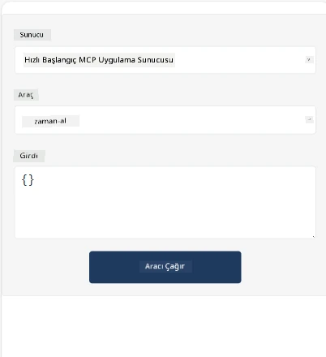
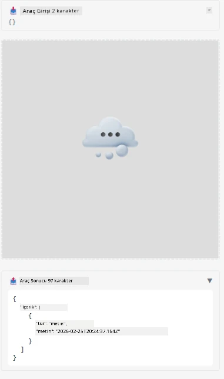

İşte MCP Uygulamasını gösteren bir örnek

## Kurulum 

1. *mcp-app* klasörüne gidin
1. `npm install` çalıştırın, bu ön uç ve arka uç bağımlılıklarını yüklemelidir

Arka ucun derlendiğini doğrulamak için:

```sh
npx tsc --noEmit
```

Her şey yolundaysa herhangi bir çıktı olmamalıdır.

## Arka ucu çalıştırma

> MCP Uygulamaları çözümü `concurrently` kütüphanesini kullanarak çalıştırdığı için ve bunun yerine bir alternatif bulmanız gerektiğinden, Windows makinesindeyseniz bu biraz ekstra iş gerektirir. İşte MCP Uygulamasındaki *package.json* içindeki sorunlu satır:

    ```json
    "start": "concurrently \"cross-env NODE_ENV=development INPUT=mcp-app.html vite build --watch\" \"tsx watch main.ts\""
    ```

Bu uygulamanın iki kısmı vardır, bir arka uç kısmı ve bir ana bilgisayar (host) kısmı.

Arka ucu başlatmak için:

```sh
npm start
```

Bu, arka ucu `http://localhost:3001/mcp` adresinde başlatmalıdır.

> Not, Codespace kullanıyorsanız, port görünürlüğünü herkese açık olarak ayarlamanız gerekebilir. Tarayıcıda https://<Codespace adı>.app.github.dev/mcp adresinden uç noktaya erişebildiğinizi kontrol edin.

## Seçenek -1: Uygulamayı Visual Studio Code içinde test edin

Çözümü Visual Studio Code içinde test etmek için aşağıdakileri yapın:

- `mcp.json` dosyasına şu şekilde bir sunucu girişi ekleyin:

    ```json
    {
        "servers": {
            "my-mcp-server-7178eca7": {
                "url": "http://localhost:3001/mcp",
                "type": "http"
            }
        },
        "inputs": []
    }
    ```

1. *mcp.json* dosyasındaki "start" düğmesine tıklayın
1. Bir sohbet penceresinin açık olduğundan emin olun ve `get-faq` yazın, aşağıdaki gibi bir sonuç görmelisiniz:

    

## Seçenek -2: Uygulamayı bir host ile test edin

<https://github.com/modelcontextprotocol/ext-apps> deposunda MVP Uygulamalarınızı test etmek için kullanabileceğiniz birkaç farklı host bulunmaktadır.

Burada size iki farklı seçenek sunacağız:

### Yerel makine

- Depoyu klonladıktan sonra *ext-apps* klasörüne gidin.

- Bağımlılıkları yükleyin

   ```sh
   npm install
   ```

- Ayrı bir terminal penceresinde, *ext-apps/examples/basic-host* klasörüne gidin

    > Codespace kullanıyorsanız, serve.ts dosyasının 27. satırına gidip http://localhost:3001/mcp adresini backend için kendi Codespace URL'nizle değiştirmelisiniz. Örneğin https://psychic-xylophone-657rpjgvxpc5g64-3001.app.github.dev/mcp

- Host'u başlatın:

    ```sh
    npm start
    ```

    Bu, host'u backend ile bağlamalıdır ve uygulamanın aşağıdaki gibi çalıştığını görmelisiniz:

    

### Codespace

Bir Codespace ortamının çalışması için biraz daha fazla çalışmak gerekir. Codespace üzerinden bir host kullanmak için:

- *ext-apps* dizinine gidin ve *examples/basic-host* klasörüne geçin.
- Bağımlılıkları yüklemek için `npm install` çalıştırın
- Hostu başlatmak için `npm start` komutunu çalıştırın.

## Uygulamayı test edin

Uygulamayı şu şekilde deneyin:

- "Call Tool" düğmesini seçin ve aşağıdaki gibi sonuçları görmelisiniz:

    

Harika, her şey çalışıyor.

---

<!-- CO-OP TRANSLATOR DISCLAIMER START -->
**Feragatname**:  
Bu belge, AI çeviri hizmeti [Co-op Translator](https://github.com/Azure/co-op-translator) kullanılarak çevrilmiştir. Doğruluk için çaba göstermemize rağmen, otomatik çevirilerin hatalar veya yanlışlıklar içerebileceğini lütfen unutmayın. Orijinal belge, kendi ana dilinde yetkili kaynak olarak kabul edilmelidir. Önemli bilgiler için profesyonel insan çevirisi önerilir. Bu çevirinin kullanımıyla ortaya çıkan herhangi bir yanlış anlama veya yanlış yorumdan sorumlu değiliz.
<!-- CO-OP TRANSLATOR DISCLAIMER END -->