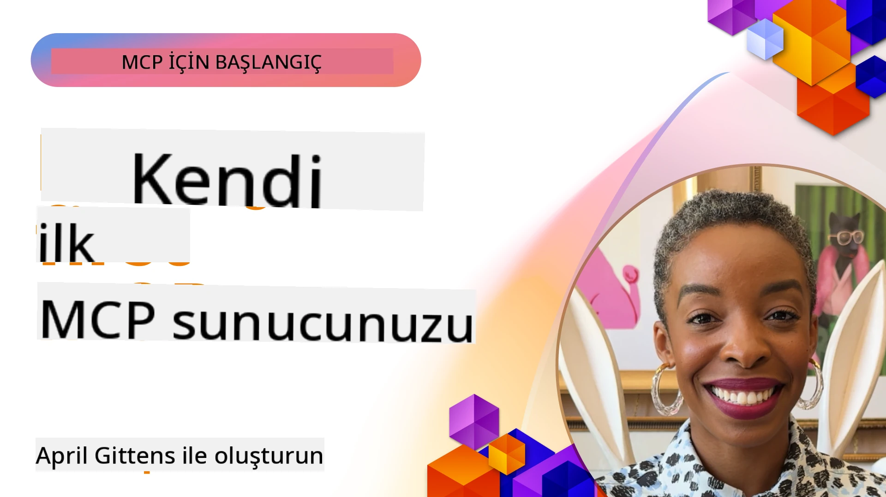

## Başlarken  

_(Bu dersin videosunu izlemek için yukarıdaki resme tıklayın)_

Bu bölüm birkaç dersten oluşmaktadır:

- **1 İlk sunucunuz**, bu ilk derste ilk sunucunuzu nasıl oluşturacağınızı ve sunucunuzu test edip hata ayıklamak için değerli bir araç olan inspector ile nasıl inceleyeceğinizi öğreneceksiniz, [derse git](01-first-server/README.md)

- **2 İstemci**, bu derste sunucunuza bağlanabilen bir istemci yazmayı öğreneceksiniz, [derse git](02-client/README.md)

- **3 LLM ile İstemci**, istemci yazmanın daha iyi bir yolu, ona bir LLM ekleyerek sunucunuzla ne yapılacağı konusunda "müzakere" yapabilmesini sağlamaktır, [derse git](03-llm-client/README.md)

- **4 Visual Studio Code'da Sunucu GitHub Copilot Agent modunu kullanma**. Burada MCP Sunucumuzu Visual Studio Code içinden çalıştırmaya bakıyoruz, [derse git](04-vscode/README.md)

- **5 stdio Transport Server** stdio transport, yerel MCP sunucu-istemci iletişimi için tavsiye edilen standarttır, süreç izolasyonu ile güvenli, alt süreç tabanlı iletişim sağlar [derse git](05-stdio-server/README.md)

- **6 MCP ile HTTP Streaming (Streamable HTTP)**. Modern HTTP streaming taşıma yöntemini (uzaktan MCP sunucular için önerilen yöntem [MCP Specification 2025-11-25](https://spec.modelcontextprotocol.io/specification/2025-11-25/basic/transports/#streamable-http)), ilerleme bildirimlerini ve Streamable HTTP kullanarak ölçeklenebilir, gerçek zamanlı MCP sunucuları ve istemcileri nasıl uygulayacağınızı öğrenin. [derse git](06-http-streaming/README.md)

- **7 VSCode için AI Toolkit kullanımı** MCP istemcilerinizi ve sunucularınızı tüketip test etmek için [derse git](07-aitk/README.md)

- **8 Test Etme**. Burada özellikle sunucumuzu ve istemcimizi farklı şekillerde nasıl test edebileceğimize odaklanacağız, [derse git](08-testing/README.md)

- **9 Dağıtım**. Bu bölüm MCP çözümlerinizi dağıtmanın farklı yollarına bakacak, [derse git](09-deployment/README.md)

- **10 İleri düzey sunucu kullanımı**. Bu bölüm ileri düzey sunucu kullanımını kapsamaktadır, [derse git](./10-advanced/README.md)

- **11 Kimlik Doğrulama**. Bu bölüm Basit Kimlik Doğrulama'dan JWT ve RBAC kullanımına kadar basit kimlik doğrulama eklemeyi kapsar. Burada başlamanız ve ardından Bölüm 5'teki İleri Konulara bakmanız ve Bölüm 2'deki önerilerle ek güvenlik sertleştirme yapmanız önerilir, [derse git](./11-simple-auth/README.md)

- **12 MCP Hostları**. Claude Desktop, Cursor, Cline ve Windsurf gibi popüler MCP host istemcilerini yapılandırma ve kullanma. Taşıma türlerini ve sorun giderme öğrenme, [derse git](./12-mcp-hosts/README.md)

- **13 MCP Inspector**. MCP Inspector aracı kullanarak MCP sunucularınızı etkileşimli olarak hata ayıklayın ve test edin. Araçları, kaynakları ve protokol mesajlarını sorun giderme öğrenin, [derse git](./13-mcp-inspector/README.md)

- **14 Örnekleme**. MCP müşterileri ile LLM ile ilgili görevlerde iş birliği yapan MCP Sunucuları oluşturun. [derse git](./14-sampling/README.md)

- **15 MCP Uygulamaları**. Aynı zamanda UI talimatlarıyla yanıt veren MCP Sunucuları oluşturun, [derse git](./15-mcp-apps/README.md)

Model Context Protocol (MCP), uygulamaların LLM'lere bağlam sağlamasını standartlaştıran açık bir protokoldür. MCP'yi AI uygulamaları için bir USB-C portu gibi düşünün — AI modellerini farklı veri kaynakları ve araçlara bağlamak için standart bir yol sağlar.

## Öğrenme Hedefleri

Bu dersi tamamladığınızda şunları yapabileceksiniz:

- MCP için C#, Java, Python, TypeScript ve JavaScript geliştirme ortamlarını kurmak
- Özelleştirilmiş özelliklerle (kaynaklar, istemler ve araçlar) temel MCP sunucuları oluşturup dağıtmak
- MCP sunucularına bağlanan host uygulamalar oluşturmak
- MCP uygulamalarını test etmek ve hata ayıklamak
- Yaygın kurulum sorunlarını ve çözümlerini anlamak
- MCP uygulamalarınızı popüler LLM hizmetlerine bağlamak

## MCP Ortamınızı Kurma

MCP ile çalışmaya başlamadan önce geliştirme ortamınızı hazırlamak ve temel iş akışını anlamak önemlidir. Bu bölüm, MCP ile sorunsuz başlangıç için ilk kurulum adımlarında size rehberlik edecektir.

### Ön Koşullar

MCP geliştirmeye başlamadan önce şunlara sahip olduğunuzdan emin olun:

- **Geliştirme Ortamı**: Seçtiğiniz dil için (C#, Java, Python, TypeScript veya JavaScript)
- **IDE/Düzenleyici**: Visual Studio, Visual Studio Code, IntelliJ, Eclipse, PyCharm veya herhangi modern bir kod editörü
- **Paket Yöneticileri**: NuGet, Maven/Gradle, pip veya npm/yarn
- **API Anahtarları**: Host uygulamalarınızda kullanmayı planladığınız herhangi bir AI servisi için

### Resmi SDK'lar

Sonraki bölümlerde Python, TypeScript, Java ve .NET kullanılarak oluşturulmuş çözümler göreceksiniz. İşte resmi desteklenen tüm SDK’lar.

MCP, birden fazla dil için resmi SDK’lar sağlar ([MCP Specification 2025-11-25](https://spec.modelcontextprotocol.io/specification/2025-11-25/) ile uyumlu):
- [C# SDK](https://github.com/modelcontextprotocol/csharp-sdk) - Microsoft iş birliği ile bakımı yapılmaktadır
- [Java SDK](https://github.com/modelcontextprotocol/java-sdk) - Spring AI iş birliği ile bakımı yapılmaktadır
- [TypeScript SDK](https://github.com/modelcontextprotocol/typescript-sdk) - Resmi TypeScript uygulaması
- [Python SDK](https://github.com/modelcontextprotocol/python-sdk) - Resmi Python uygulaması (FastMCP)
- [Kotlin SDK](https://github.com/modelcontextprotocol/kotlin-sdk) - Resmi Kotlin uygulaması
- [Swift SDK](https://github.com/modelcontextprotocol/swift-sdk) - Loopwork AI iş birliği ile bakımı yapılmaktadır
- [Rust SDK](https://github.com/modelcontextprotocol/rust-sdk) - Resmi Rust uygulaması
- [Go SDK](https://github.com/modelcontextprotocol/go-sdk) - Resmi Go uygulaması

## Önemli Noktalar

- MCP geliştirme ortamı, dil spesifik SDK’lar ile kurulumu kolaydır
- MCP sunucuları, açık şemalara sahip araçlar oluşturup kaydetmeyi gerektirir
- MCP istemcileri genişletilmiş yeteneklerden yararlanmak için sunuculara ve modellere bağlanır
- Test ve hata ayıklama, güvenilir MCP uygulamaları için gereklidir
- Dağıtım seçenekleri yerel geliştirmeden bulut tabanlı çözümlere kadar çeşitlenir

## Uygulama

Bu bölümdeki tüm bölümlerde göreceğiniz egzersizleri tamamlayacak örneklerin bir seti mevcuttur. Ayrıca her bölümün kendi egzersizleri ve ödevleri bulunmaktadır.

- [Java Hesap Makinesi](./samples/java/calculator/README.md)
- [.Net Hesap Makinesi](../../../03-GettingStarted/samples/csharp)
- [JavaScript Hesap Makinesi](./samples/javascript/README.md)
- [TypeScript Hesap Makinesi](./samples/typescript/README.md)
- [Python Hesap Makinesi](../../../03-GettingStarted/samples/python)

## Ek Kaynaklar

- [Azure üzerinde Model Context Protocol kullanarak Ajanlar oluşturma](https://learn.microsoft.com/azure/developer/ai/intro-agents-mcp)
- [Azure Container Apps ile Uzak MCP (Node.js/TypeScript/JavaScript)](https://learn.microsoft.com/samples/azure-samples/mcp-container-ts/mcp-container-ts/)
- [.NET OpenAI MCP Agent](https://learn.microsoft.com/samples/azure-samples/openai-mcp-agent-dotnet/openai-mcp-agent-dotnet/)

## Sonraki Adım

İlk derse başlayın: [İlk MCP Sunucunuzu Oluşturma](01-first-server/README.md)

Bu modülü tamamladıktan sonra devam edin: [Modül 4: Pratik Uygulama](../04-PracticalImplementation/README.md)

---

<!-- CO-OP TRANSLATOR DISCLAIMER START -->
**Feragatname**:
Bu belge, AI çeviri hizmeti [Co-op Translator](https://github.com/Azure/co-op-translator) kullanılarak çevrilmiştir. Doğruluğa özen göstersek de, otomatik çevirilerin hatalar veya yanlışlıklar içerebileceğini lütfen unutmayınız. Orijinal belge, ait olduğu dildeki kaynak metin olarak dikkate alınmalıdır. Kritik bilgiler için profesyonel insan çevirisi önerilir. Bu çevirinin kullanımıyla ortaya çıkabilecek yanlış anlamalar veya yanlış yorumlamalardan dolayı sorumluluk kabul edilmemektedir.
<!-- CO-OP TRANSLATOR DISCLAIMER END -->