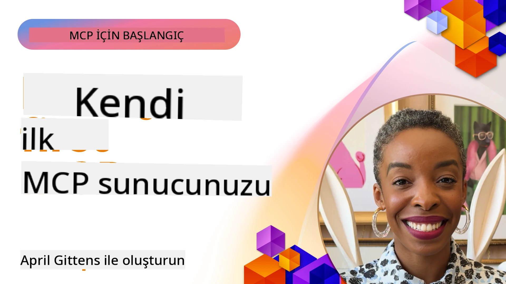

## Başlarken  

_(Bu dersin videosunu izlemek için yukarıdaki resme tıklayın)_

Bu bölüm birkaç dersten oluşmaktadır:

- **1 İlk sunucunuz**, bu ilk derste, ilk sunucunuzu nasıl oluşturacağınızı ve sunucunuzu test etmek ve hata ayıklamak için değerli bir yol olan denetleyici aracıyla nasıl inceleyeceğinizi öğreneceksiniz, [derse git](01-first-server/README.md)

- **2 İstemci**, bu derste, sunucunuza bağlanabilen bir istemci nasıl yazılır öğreneceksiniz, [derse git](02-client/README.md)

- **3 LLM ile İstemci**, bir istemci yazmanın çok daha iyi bir yolu, sunucunuza ne yapılacağı konusunda "müzakere" edebilmesi için ona bir LLM eklemektir, [derse git](03-llm-client/README.md)

- **4 Visual Studio Code'da bir sunucu GitHub Copilot Agent modunun kullanımı**. Burada, MCP Sunucumuzu Visual Studio Code içinden çalıştırmaya bakıyoruz, [derse git](04-vscode/README.md)

- **5 stdio Taşıma Sunucusu** stdio taşıma, yerel MCP sunucu-istemci iletişimi için önerilen standarttır, yerleşik işlem izolasyonu ile güvenli alt süreç tabanlı iletişim sağlar [derse git](05-stdio-server/README.md)

- **6 MCP ile HTTP Akışı (Akış Destekli HTTP)**. Standart hakkında bilgi edinin
	uzaktan taşıma ile [MCP Spesifikasyonu 2026-07-28](https://modelcontextprotocol.io/specification/2026-07-28/basic/transports/streamable-http),
	ve ders içinde tutulan eski oturum tabanlı uygulama.
	[derse git](06-http-streaming/README.md)

- **7 VSCode için AI Araç Setinin Kullanımı** MCP İstemcilerinizi ve Sunucularınızı kullanmak ve test etmek için [derse git](07-aitk/README.md)

- **8 Test Etme**. Burada özellikle sunucumuzu ve istemcimizi farklı yollarla nasıl test edebileceğimize odaklanacağız, [derse git](08-testing/README.md)

- **9 Dağıtım**. Bu bölüm MCP çözümlerinizi dağıtmanın çeşitli yollarını ele alacaktır, [derse git](09-deployment/README.md)

- **10 Gelişmiş sunucu kullanımı**. Bu bölüm gelişmiş sunucu kullanımını kapsar, [derse git](./10-advanced/README.md)

- **11 Kimlik Doğrulama**. Bu bölüm Basit Kimlik Doğrulama’dan JWT ve RBAC kullanmaya kadar nasıl kimlik doğrulama ekleyeceğinizi kapsar. Buradan başlamanız ve ardından Bölüm 5’teki Gelişmiş Konulara bakmanız ve Bölüm 2'deki önerilerle ek güvenlik sertleştirmeleri yapmanız önerilir, [derse git](./11-simple-auth/README.md)

- **12 MCP Sunucuları**. Claude Desktop, Cursor, Cline ve Windsurf dahil popüler MCP sunucu istemcilerini yapılandırın ve kullanın. Taşıma türlerini ve sorun giderme bilgilerini öğrenin, [derse git](./12-mcp-hosts/README.md)

- **13 MCP Denetleyicisi**. MCP Denetleyici aracı ile MCP sunucularınızı etkileşimli olarak hata ayıklayın ve test edin. Araçları, kaynakları ve protokol mesajlarını nasıl sorun gidereceğinizi öğrenin, [derse git](./13-mcp-inspector/README.md)

- **14 Örnekleme**. `2025-11-25` için eski Örnekleme ilkelini öğrenin ve
	yeni tasarımları doğrudan LLM sağlayıcı entegrasyonuna nasıl taşıyacağınızı öğrenin. Örnekleme
	MCP `2026-07-28` sürümünde kullanımdan kalkmıştır. [derse git](./14-sampling/README.md)

- **15 MCP Uygulamaları**. UI talimatları ile yanıt veren MCP Sunucuları oluşturun, [derse git](./15-mcp-apps/README.md)

Model Context Protocol (MCP), uygulamaların LLM'lere bağlam sağlamasını standartlaştıran açık bir protokoldür. MCP'yi AI uygulamaları için bir USB-C portu gibi düşünebilirsiniz - farklı veri kaynaklarına ve araçlara standart bir şekilde AI modellerini bağlamanın yolunu sağlar.

## Öğrenme Hedefleri

Bu dersin sonunda yapabilecekleriniz:

- C#, Java, Python, TypeScript ve JavaScript dillerinde MCP geliştirme ortamlarını kurmak
- Özel özelliklerle (kaynaklar, uyarılar ve araçlar) temel MCP sunucuları oluşturup dağıtmak
- MCP sunucularına bağlanan ev sahibi uygulamalar oluşturmak
- MCP uygulamalarını test etmek ve hata ayıklamak
- Yaygın kurulum zorluklarını ve çözümlerini anlamak
- MCP uygulamalarınızı popüler LLM servislerine bağlamak

## MCP Ortamınızı Kurma

MCP ile çalışmaya başlamadan önce, geliştirme ortamınızı hazırlamanız ve temel iş akışını anlamanız önemlidir. Bu bölüm, MCP ile sorunsuz bir başlangıç için ilk kurulum adımlarında size rehberlik edecektir.

### Ön Koşullar

MCP geliştirmeye başlamadan önce, aşağıdaki koşullara sahip olun:

- **Geliştirme Ortamı**: Seçtiğiniz dil için (C#, Java, Python, TypeScript veya JavaScript)
- **IDE/Düzenleyici**: Visual Studio, Visual Studio Code, IntelliJ, Eclipse, PyCharm veya herhangi modern bir kod düzenleyicisi
- **Paket Yöneticileri**: NuGet, Maven/Gradle, pip veya npm/yarn
- **API Anahtarları**: Ev sahibi uygulamalarınızda kullanmayı planladığınız herhangi bir AI servisi için

### Resmi SDK’lar

Önümüzdeki bölümlerde Python, TypeScript,
Java ve .NET kullanılarak oluşturulan çözümler göreceksiniz. İşte resmi SDK’lar.

MCP `2026-07-28` için SDK desteği dil bazında bağımsız olarak yayınlanmaktadır.
Bir örneği çalıştırmadan önce, paket sürümünü ve SDK'nın desteklenen protokol revizyonları için sürüm notlarını kontrol edin.
Bakınız
[resmi SDK listesi](https://modelcontextprotocol.io/docs/sdk):
- [C# SDK](https://github.com/modelcontextprotocol/csharp-sdk) - Microsoft ile işbirliği içinde bakımı yapılmaktadır
- [Java SDK](https://github.com/modelcontextprotocol/java-sdk) - Spring AI ile işbirliği içinde bakımı yapılmaktadır
- [TypeScript SDK](https://github.com/modelcontextprotocol/typescript-sdk) - Resmi TypeScript uygulaması
- [Python SDK](https://github.com/modelcontextprotocol/python-sdk) - Resmi Python uygulaması (FastMCP)
- [Kotlin SDK](https://github.com/modelcontextprotocol/kotlin-sdk) - Resmi Kotlin uygulaması
- [Swift SDK](https://github.com/modelcontextprotocol/swift-sdk) - Loopwork AI ile işbirliği içinde bakımı yapılmaktadır
- [Rust SDK](https://github.com/modelcontextprotocol/rust-sdk) - Resmi Rust uygulaması
- [Go SDK](https://github.com/modelcontextprotocol/go-sdk) - Resmi Go uygulaması

## Temel Çıkarımlar

- MCP geliştirme ortamı, dil bazlı SDK'lar ile kurulum açısından basittir
- MCP sunucuları, net şemalar ile araçların oluşturulması ve kaydedilmesini içerir
- MCP istemcileri, genişletilmiş yeteneklerden yararlanmak için sunuculara ve modellere bağlanır
- Test etmek ve hata ayıklamak, güvenilir MCP uygulamaları için esastır
- Dağıtım seçenekleri yerel geliştirmeden bulut tabanlı çözümlere kadar çeşitlidir

## Uygulama

Bu bölümdeki tüm bölümlerde göreceğiniz egzersizleri tamamlayan bir örnek setimiz var. Ek olarak her bölümün kendi egzersizleri ve görevleri de vardır.

- [Java Hesap Makinesi](./samples/java/calculator/README.md)
- [.NET Hesap Makinesi](../../../03-GettingStarted/samples/csharp)
- [JavaScript Hesap Makinesi](./samples/javascript/README.md)
- [TypeScript Hesap Makinesi](./samples/typescript/README.md)
- [Python Hesap Makinesi](../../../03-GettingStarted/samples/python)

## Ek Kaynaklar

- [Azure üzerinde Model Context Protocol kullanarak Ajanlar Oluşturma](https://learn.microsoft.com/azure/developer/ai/intro-agents-mcp)
- [Azure Container Apps ile Uzaktan MCP (Node.js/TypeScript/JavaScript)](https://learn.microsoft.com/samples/azure-samples/mcp-container-ts/mcp-container-ts/)
- [.NET OpenAI MCP Ajanı](https://learn.microsoft.com/samples/azure-samples/openai-mcp-agent-dotnet/openai-mcp-agent-dotnet/)

## Sonraki Adımlar

İlk ders ile başlayın: [İlk MCP Sunucunuzu Oluşturma](01-first-server/README.md)

Bu modülü tamamladıktan sonra devam edin: [Modül 4: Pratik Uygulama](../04-PracticalImplementation/README.md)

---

<!-- CO-OP TRANSLATOR DISCLAIMER START -->
**Feragatname**:
Bu belge, AI çeviri hizmeti [Co-op Translator](https://github.com/Azure/co-op-translator) kullanılarak çevrilmiştir. Doğruluk için çaba sarf etsek de, otomatik çevirilerin hata veya yanlışlık içerebileceğini lütfen unutmayınız. Orijinal belge, kendi dilinde yetkili kaynak olarak kabul edilmelidir. Kritik bilgiler için profesyonel insan çevirisi önerilir. Bu çevirinin kullanımı sonucu ortaya çıkabilecek yanlış anlamalardan veya yanlış yorumlamalardan sorumlu değiliz.
<!-- CO-OP TRANSLATOR DISCLAIMER END -->