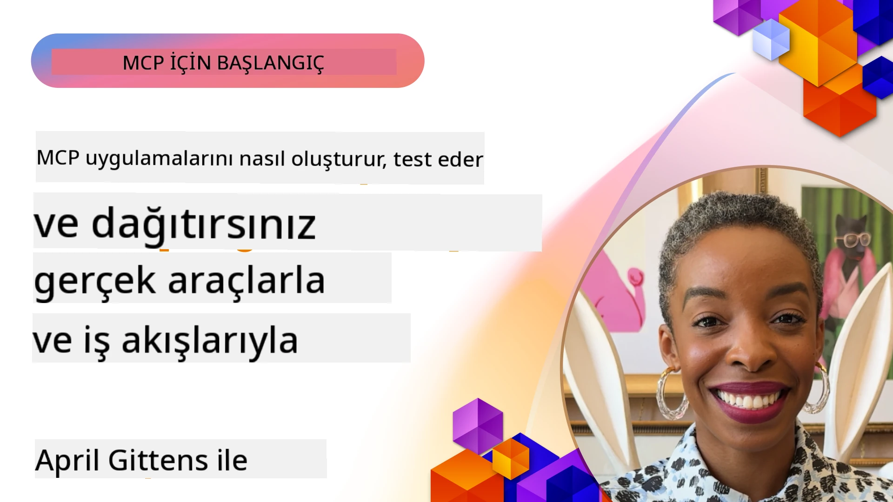

# Pratik Uygulama

[](https://youtu.be/vCN9-mKBDfQ)

_(Bu dersin videosunu izlemek için yukarıdaki resme tıklayın)_

Pratik uygulama, Model Context Protocol'ün (MCP) gücünün somutlaştığı yerdir. MCP'nin teorisini ve mimarisini anlamak önemli olsa da, gerçek değer bu kavramları gerçek dünya problemlerini çözen çözümler oluşturmak, test etmek ve dağıtmak için uyguladığınızda ortaya çıkar. Bu bölüm, kavramsal bilgiler ile uygulamalı geliştirme arasındaki boşluğu kapatarak MCP tabanlı uygulamaları hayata geçirme sürecinde size rehberlik eder.

İster akıllı asistanlar geliştiriyor olun, ister AI'yı iş akışlarına entegre edin ya da veri işleme için özel araçlar oluşturun, MCP esnek bir temel sunar. Dil bağımsız tasarımı ve popüler programlama dilleri için resmi SDK'ları sayesinde geniş bir geliştirici kitlesi için erişilebilir durumdadır. Bu SDK'ları kullanarak çözümlerinizi çeşitli platformlarda ve ortamlarda hızla prototipleyebilir, yineleyebilir ve ölçeklendirebilirsiniz.

Aşağıdaki bölümlerde, MCP'yi C#, Java with Spring, TypeScript, JavaScript ve Python'da nasıl uygulayacağınıza dair pratik örnekler, örnek kodlar ve dağıtım stratejileri bulacaksınız. Ayrıca MCP sunucularınızı nasıl hata ayıklayıp test edeceğinizi, API'leri nasıl yöneteceğinizi ve Azure kullanarak çözümleri buluta nasıl dağıtacağınızı öğreneceksiniz. Bu uygulamalı kaynaklar, öğrenmenizi hızlandırmak ve güvenle sağlam, üretime hazır MCP uygulamaları geliştirmenize yardımcı olmak için tasarlanmıştır.

## Genel Bakış

Bu ders, MCP uygulamasının birden çok programlama dili üzerinde pratik yönlerine odaklanmaktadır. C#, Java with Spring, TypeScript, JavaScript ve Python MCP SDK'larını kullanarak sağlam uygulamalar oluşturmayı, MCP sunucularını hata ayıklamayı ve test etmeyi ve yeniden kullanılabilir kaynaklar, promptlar ve araçlar yaratmayı keşfedeceğiz.

## Öğrenme Hedefleri

Bu dersin sonunda şunları yapabileceksiniz:

- Resmi SDK'ları kullanarak çeşitli programlama dillerinde MCP çözümleri uygulamak
- MCP sunucularını sistematik olarak hata ayıklamak ve test etmek
- Sunucu özellikleri (Kaynaklar, Prompts, Araçlar) oluşturmak ve kullanmak
- Karmaşık görevler için etkili MCP iş akışları tasarlamak
- MCP uygulamalarını performans ve güvenilirlik açısından optimize etmek

## Resmi SDK Kaynakları

Model Context Protocol, birden çok dil için resmi SDK'lar sunar ([MCP Specification 2025-11-25](https://spec.modelcontextprotocol.io/specification/2025-11-25/) ile uyumlu):

- [C# SDK](https://github.com/modelcontextprotocol/csharp-sdk)
- [Java with Spring SDK](https://github.com/modelcontextprotocol/java-sdk) **Not:** [Project Reactor](https://projectreactor.io) bağımlılığı gerektirir. (Bkz. [tartışma konusu 246](https://github.com/orgs/modelcontextprotocol/discussions/246).)
- [TypeScript SDK](https://github.com/modelcontextprotocol/typescript-sdk)
- [Python SDK](https://github.com/modelcontextprotocol/python-sdk)
- [Kotlin SDK](https://github.com/modelcontextprotocol/kotlin-sdk)
- [Go SDK](https://github.com/modelcontextprotocol/go-sdk)

## MCP SDK'ları ile Çalışmak

Bu bölüm, birden fazla programlama dilinde MCP uygulamasına dair pratik örnekler sunar. Örnek kodları `samples` dizininde, dile göre organize edilmiş olarak bulabilirsiniz.

### Mevcut Örnekler

Depoda, aşağıdaki dillerde [örnek uygulamalar](../../../04-PracticalImplementation/samples) bulunmaktadır:

- [C#](./samples/csharp/README.md)
- [Java with Spring](./samples/java/containerapp/README.md)
- [TypeScript](./samples/typescript/README.md)
- [JavaScript](./samples/javascript/README.md)
- [Python](./samples/python/README.md)

Her örnek, o dile ve ekosisteme özgü temel MCP kavramlarını ve uygulama örüntülerini gösterir.

### Pratik Kılavuzlar

Pratik MCP uygulamalarına yönelik ek kılavuzlar:

- [Sayfalandırma ve Büyük Sonuç Kümeleri](./pagination/README.md) - Araçlar, kaynaklar ve büyük veri kümeleri için imleç tabanlı sayfalandırma işlemlerini ele alın

## Temel Sunucu Özellikleri

MCP sunucuları, aşağıdaki özelliklerin herhangi bir kombinasyonunu uygulayabilir:

### Kaynaklar

Kaynaklar, kullanıcı veya AI modelinin kullanması için bağlam ve veri sağlar:

- Belge depoları
- Bilgi tabanları
- Yapılandırılmış veri kaynakları
- Dosya sistemleri

### Promptlar

Promptlar, kullanıcılar için şablonlanmış mesajlar ve iş akışlarıdır:

- Önceden tanımlanmış konuşma şablonları
- Yönlendirilmiş etkileşim desenleri
- Özelleşmiş diyalog yapıları

### Araçlar

Araçlar, AI modelinin çalıştıracağı fonksiyonlardır:

- Veri işleme araçları
- Harici API entegrasyonları
- Hesaplama kabiliyetleri
- Arama işlevselliği

## Örnek Uygulamalar: C# Uygulaması

Resmi C# SDK deposu, MCP'nin farklı yönlerini gösteren çeşitli örnek uygulamalar içerir:

- **Temel MCP İstemcisi**: MCP istemcisi oluşturmayı ve araçları çağırmayı gösteren basit örnek
- **Temel MCP Sunucusu**: Basit araç kaydı ile minimal sunucu uygulaması
- **Gelişmiş MCP Sunucusu**: Araç kaydı, kimlik doğrulama ve hata işlemesi olan tam özellikli sunucu
- **ASP.NET Entegrasyonu**: ASP.NET Core ile entegrasyonu gösteren örnekler
- **Araç Uygulama Desenleri**: Farklı karmaşıklık seviyelerinde araçların uygulanmasına dair çeşitli desenler

MCP C# SDK'sı önizleme aşamasındadır ve API'lerde değişiklik olabilir. SDK geliştikçe bu blogu sürekli güncelleyeceğiz.

### Temel Özellikler

- [C# MCP Nuget ModelContextProtocol](https://www.nuget.org/packages/ModelContextProtocol)
- [İlk MCP Sunucunuzu oluşturma](https://devblogs.microsoft.com/dotnet/build-a-model-context-protocol-mcp-server-in-csharp/).

Tam C# uygulama örnekleri için [resmi C# SDK örnek deposunu](https://github.com/modelcontextprotocol/csharp-sdk) ziyaret edin

## Örnek Uygulama: Java with Spring Uygulaması

Java with Spring SDK, kurumsal seviyede özelliklerle sağlam MCP uygulama seçenekleri sunar.

### Temel Özellikler

- Spring Framework entegrasyonu
- Güçlü tip güvenliği
- Reaktif programlama desteği
- Kapsamlı hata yönetimi

Tam Java with Spring uygulama örneği için örnekler dizinindeki [Java with Spring örneğine](samples/java/containerapp/README.md) bakabilirsiniz.

## Örnek Uygulama: JavaScript Uygulaması

JavaScript SDK, MCP uygulaması için hafif ve esnek bir yaklaşım sağlar.

### Temel Özellikler

- Node.js ve tarayıcı desteği
- Promise tabanlı API
- Express ve diğer frameworklerle kolay entegrasyon
- Akış için WebSocket desteği

Tam JavaScript uygulama örneği için örnekler dizinindeki [JavaScript örneğine](samples/javascript/README.md) göz atın.

## Örnek Uygulama: Python Uygulaması

Python SDK, MCP uygulamasına Pythonik bir yaklaşım sunar ve mükemmel ML framework entegrasyonlarına sahiptir.

### Temel Özellikler

- asyncio ile async/await desteği
- FastAPI entegrasyonu
- Basit araç kaydı
- Popüler ML kütüphaneleri ile yerel entegrasyon

Tam Python uygulama örneği için örnekler dizinindeki [Python örneğine](samples/python/README.md) bakabilirsiniz.

## API Yönetimi

Azure API Yönetimi, MCP Sunucularını nasıl güvence altına alabileceğimize dair harika bir çözümdür. Fikir, MCP Sunucunuzun önünde bir Azure API Yönetimi örneği koymak ve muhtemelen isteyeceğiniz özellikleri yönetmesine izin vermektir:

- oran sınırlaması
- token yönetimi
- izleme
- yük dengeleme
- güvenlik

### Azure Örneği

İşte tam da bunu yapan bir Azure Örneği, yani [bir MCP Sunucusu oluşturup Azure API Yönetimi ile güvenceye alma](https://github.com/Azure-Samples/remote-mcp-apim-functions-python).

Yetkilendirme akışının nasıl gerçekleştiğini aşağıdaki resimde görün:


Yukarıdaki resimde şu işlemler gerçekleşmektedir:

- Kimlik Doğrulama/Yetkilendirme Microsoft Entra kullanılarak yapılır.
- Azure API Yönetimi bir ağ geçidi görevi görür ve politikalar kullanarak trafiği yönlendirir ve yönetir.
- Azure Monitor tüm talepleri analiz için kaydeder.

#### Yetkilendirme akışı

Yetkilendirme akışına daha yakından bakalım:


#### MCP yetkilendirme spesifikasyonu

[MCP Yetkilendirme spesifikasyonu](https://spec.modelcontextprotocol.io/specification/2025-11-25/basic/authorization/) hakkında daha fazla bilgi edinin

## Uzak MCP Sunucusunu Azure'a Dağıtma

Daha önce bahsettiğimiz örneği dağıtıp dağıtamayacağımıza bakalım:

1. Depoyu klonlayın

    ```bash
    git clone https://github.com/Azure-Samples/remote-mcp-apim-functions-python.git
    cd remote-mcp-apim-functions-python
    ```

1. `Microsoft.App` kaynak sağlayıcısını kaydedin.

   - Azure CLI kullanıyorsanız, `az provider register --namespace Microsoft.App --wait` komutunu çalıştırın.
   - Azure PowerShell kullanıyorsanız, `Register-AzResourceProvider -ProviderNamespace Microsoft.App` komutunu çalıştırın. Ardından kaydın tamamlandığını kontrol etmek için bir süre sonra `(Get-AzResourceProvider -ProviderNamespace Microsoft.App).RegistrationState` çalıştırın.

1. Bu [azd](https://aka.ms/azd) komutunu, API yönetim hizmeti, işlev uygulaması(kod ile) ve diğer gerekli Azure kaynaklarını oluşturmak için çalıştırın

    ```shell
    azd up
    ```

    Bu komutlar Azure üzerinde tüm bulut kaynaklarını dağıtmalıdır

### MCP Inspector ile sunucunuzu test etme

1. **Yeni bir terminal penceresinde**, MCP Inspector'ı yükleyip çalıştırın

    ```shell
    npx @modelcontextprotocol/inspector
    ```

    Aşağıdaki gibi bir arayüz görmelisiniz:

    

1. MCP Inspector web uygulamasını uygulamanın gösterdiği URL'den CTRL tıklayarak açın (ör. [http://127.0.0.1:6274/#resources](http://127.0.0.1:6274/#resources))
1. Taşıma türünü `SSE` olarak ayarlayın
1. `azd up` sonrası görüntülenen API Yönetimi SSE uç noktasının URL'sini ayarlayın ve **Bağlan**:

    ```shell
    https://<apim-servicename-from-azd-output>.azure-api.net/mcp/sse
    ```

1. **Araçları Listele**. Bir araca tıklayın ve **Aracı Çalıştır**.

Tüm adımlar başarılıysa, artık MCP sunucusuna bağlısınız ve bir aracı çağırabilmişsinizdir.

## Azure için MCP sunucuları

[Remote-mcp-functions](https://github.com/Azure-Samples/remote-mcp-functions-dotnet): Bu depo seti, Python, C# .NET veya Node/TypeScript ile Azure Functions kullanarak özel uzak MCP (Model Context Protocol) sunucuları oluşturmak ve dağıtmak için hızlı başlangıç şablonlarıdır.

Örnekler, geliştiricilerin:

- Yerelde oluşturma ve çalıştırma: Yerel makinede MCP sunucusu geliştirme ve hata ayıklama
- Azure'a dağıtma: Basit bir azd up komutuyla buluta kolay dağıtım
- İstemcilerden bağlanma: VS Code'un Copilot ajan modu ve MCP Inspector aracı dahil çeşitli istemcilerden MCP sunucusuna bağlanma

yapabilmelerini sağlayan eksiksiz bir çözüm sunar.

### Temel Özellikler

- Tasarımdan güvenlik: MCP sunucusu anahtarlar ve HTTPS ile güvence altına alınmıştır
- Kimlik doğrulama seçenekleri: Dahili auth ve/veya API Yönetimi kullanarak OAuth desteği
- Ağ izolasyonu: Azure Virtual Networks (VNET) kullanarak ağ izolasyonu sağlar
- Sunucusuz mimari: Ölçeklenebilir, olay odaklı çalıştırma için Azure Functions kullanır
- Yerel geliştirme: Kapsamlı yerel geliştirme ve hata ayıklama desteği
- Basit dağıtım: Azure'a kolaylaştırılmış dağıtım süreci

Bu depo, üretime hazır bir MCP sunucu uygulamasıyla hızlı başlamanız için gerekli yapılandırma dosyalarını, kaynak kodunu ve altyapı tanımlarını içerir.

- [Azure Remote MCP Functions Python](https://github.com/Azure-Samples/remote-mcp-functions-python) - Python ile Azure Functions kullanarak MCP'nin örnek uygulaması

- [Azure Remote MCP Functions .NET](https://github.com/Azure-Samples/remote-mcp-functions-dotnet) - C# .NET ile Azure Functions kullanarak MCP'nin örnek uygulaması

- [Azure Remote MCP Functions Node/Typescript](https://github.com/Azure-Samples/remote-mcp-functions-typescript) - Node/TypeScript ile Azure Functions kullanarak MCP'nin örnek uygulaması.

## Temel Çıkarımlar

- MCP SDK'ları, sağlam MCP çözümleri uygulamak için dile özgü araçlar sağlar
- Hata ayıklama ve test süreci, güvenilir MCP uygulamaları için kritiktir
- Yeniden kullanılabilir prompt şablonları, tutarlı AI etkileşimleri sağlar
- İyi tasarlanmış iş akışları, birden çok aracı kullanarak karmaşık görevleri koordine edebilir
- MCP çözümleri uygularken güvenlik, performans ve hata yönetimi dikkate alınmalıdır

## Alıştırma

Alanınızdaki gerçek bir problemi adresleyen pratik bir MCP iş akışı tasarlayın:

1. Bu problemi çözmek için faydalı olabilecek 3-4 araç belirleyin
2. Bu araçların nasıl etkileşime girdiğini gösteren bir iş akışı diyagramı oluşturun
3. Tercih ettiğiniz dilde araçlardan birinin temel bir versiyonunu uygulayın
4. Modelin aracınızı etkili kullanmasına yardımcı olacak bir prompt şablonu oluşturun

## Ek Kaynaklar

---

## Sonraki Adım

Sonraki: [Gelişmiş Konular](../05-AdvancedTopics/README.md)

---

<!-- CO-OP TRANSLATOR DISCLAIMER START -->
**Feragatname**:
Bu belge, AI çeviri servisi [Co-op Translator](https://github.com/Azure/co-op-translator) kullanılarak çevrilmiştir. Doğruluk için çaba sarf etsek de, otomatik çevirilerin hatalar veya yanlışlıklar içerebileceğini lütfen unutmayın. Orijinal belge, kendi dilinde yetkili kaynak olarak kabul edilmelidir. Kritik bilgiler için profesyonel insan çevirisi önerilir. Bu çevirinin kullanımıyla doğabilecek herhangi bir yanlış anlama veya yanlış yorumdan sorumlu değiliz.
<!-- CO-OP TRANSLATOR DISCLAIMER END -->