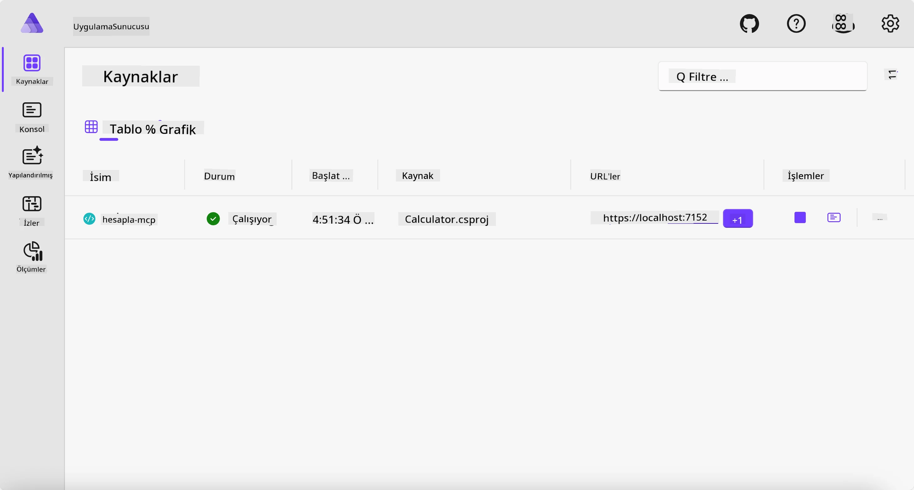
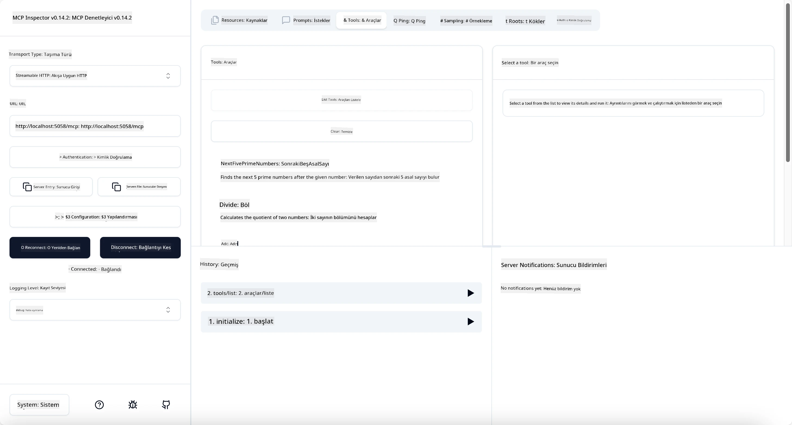
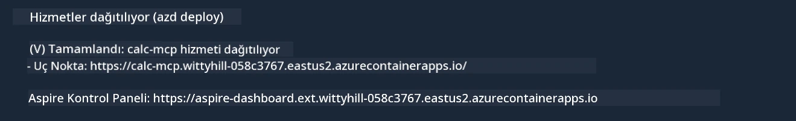

# Örnek

Önceki örnek, `stdio` türü ile yerel bir .NET projesinin nasıl kullanılacağını ve sunucunun yerel bir konteynerde nasıl çalıştırılacağını gösteriyor. Bu birçok durumda iyi bir çözümdür. Ancak, sunucunun bulut ortamı gibi uzaktan çalışıyor olması yararlı olabilir. İşte bu noktada `http` türü devreye girer.

`04-PracticalImplementation` klasöründeki çözüme baktığınızda, önceki çözümden çok daha karmaşık görünebilir. Ama aslında öyle değil. Eğer `src/Calculator` projesine dikkatle bakarsanız, bunun çoğunlukla önceki örnekle aynı kod olduğunu göreceksiniz. Tek fark, HTTP isteklerini işlemek için farklı bir kütüphane olan `ModelContextProtocol.AspNetCore` kullanmamızdır. Ayrıca `IsPrime` metodunu özel yapmak için değiştirdik, böylece kodunuzda özel metotlar olabileceğini göstermek için. Kodun geri kalanı öncekilerle aynı.

Diğer projeler [Aspire](https://aspire.dev/get-started/what-is-aspire/) kaynaklıdır. Çözümde Aspire bulunması, geliştirici deneyimini geliştirecek, geliştirme ve test sırasında yardımcı olacak ve gözlemlenebilirliği artıracaktır. Sunucuyu çalıştırmak için zorunlu değildir ama çözümde bulunması iyi bir pratiktir.

## Sunucuyu yerel olarak başlat

1. VS Code'dan (C# DevKit eklentisi ile) `04-PracticalImplementation/samples/csharp` dizinine gidin.
1. Sunucuyu başlatmak için aşağıdaki komutu çalıştırın:

   ```bash
    dotnet watch run --project ./src/AppHost
   ```

1. Bir web tarayıcı Aspire panosunu açtığında, `http` URL'sine dikkat edin. Yaklaşık olarak `http://localhost:5058/` gibi olmalıdır.

   

## MCP Inspector ile Streamable HTTP’yi Test Etme

Node.js 22.7.5 ve daha üstü varsa, MCP Inspector'u sunucunuzu test etmek için kullanabilirsiniz.

Sunucuyu başlatın ve terminalde aşağıdaki komutu çalıştırın:

```bash
npx @modelcontextprotocol/inspector http://localhost:5058
```



- Transport türü olarak `Streamable HTTP` seçin.
- Url alanına daha önce not ettiğiniz sunucu URL'sini girin ve sonuna `/mcp` ekleyin. `http` olmalıdır (`https` değil), örneğin `http://localhost:5058/mcp`.
- Bağlan butonuna tıklayın.

Inspector'un güzel tarafı, neler olup bittiğini iyi bir şekilde görünür kılmasıdır.

- Mevcut araçları listelemeyi deneyin
- Bazılarını deneyin, önceki gibi çalışmalıdır.

## GitHub Copilot Chat ile MCP Sunucusunu VS Code’da Test Etme

Streamable HTTP taşımasını GitHub Copilot Chat ile kullanmak için, önceden oluşturulmuş `calc-mcp` sunucusunun yapılandırmasını aşağıdaki gibi değiştirin:

```jsonc
// .vscode/mcp.json
{
  "servers": {
    "calc-mcp": {
      "type": "http",
      "url": "http://localhost:5058/mcp"
    }
  }
}
```

Bazı testler yapın:

- "6780'den sonraki 3 asal sayı" isteyin. Copilot'un yeni araçlar `NextFivePrimeNumbers`'ı kullandığını ve sadece ilk 3 asal sayıyı döndürdüğünü gözlemleyin.
- "111'den sonraki 7 asal sayı" isteyin, ne olduğunu görün.
- "John 24 şekerlemeye sahip ve hepsini 3 çocuğuna dağıtmak istiyor. Her çocuk kaç şekerlemeye sahip olur?" isteyin, ne olduğunu görün.

## Sunucuyu Azure’a Dağıtma

Sunucuyu Azure’a dağıtalım ki daha fazla kişi kullanabilsin.

Terminalden `04-PracticalImplementation/samples/csharp` klasörüne gidin ve aşağıdaki komutu çalıştırın:

```bash
azd up
```

Dağıtım tamamlandıktan sonra aşağıdaki gibi bir mesaj görmelisiniz:



URL'yi alın ve MCP Inspector ile GitHub Copilot Chat'te kullanın.

```jsonc
// .vscode/mcp.json
{
  "servers": {
    "calc-mcp": {
      "type": "http",
      "url": "https://calc-mcp.gentleriver-3977fbcf.australiaeast.azurecontainerapps.io/mcp"
    }
  }
}
```

## Sırada ne var?

Farklı taşıma türleri ve test araçları denedik. Ayrıca MCP sunucunuzu Azure’a dağıttık. Peki ya sunucumuzun özel kaynaklara erişmesi gerekirse? Örneğin bir veritabanı veya özel bir API? Sonraki bölümde, sunucumuzun güvenliğini nasıl geliştirebileceğimizi göreceğiz.

---

<!-- CO-OP TRANSLATOR DISCLAIMER START -->
**Feragatname**:
Bu belge, AI çeviri hizmeti [Co-op Translator](https://github.com/Azure/co-op-translator) kullanılarak çevrilmiştir. Doğruluk için çaba sarf etsek de, otomatik çevirilerin hata veya yanlışlık içerebileceğini lütfen unutmayınız. Orijinal belge, kendi dilinde yetkili kaynak olarak kabul edilmelidir. Kritik bilgiler için profesyonel insan çevirisi önerilir. Bu çevirinin kullanımı sonucu ortaya çıkabilecek yanlış anlamalardan veya yanlış yorumlamalardan sorumlu değiliz.
<!-- CO-OP TRANSLATOR DISCLAIMER END -->