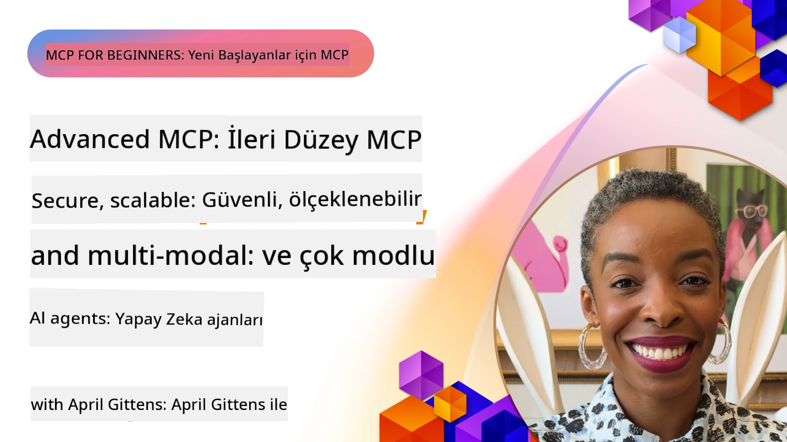

# MCP'de İleri Konular

_(Bu dersin videosunu görüntülemek için yukarıdaki resme tıklayın)_

Bu bölüm, Model Context Protocol (MCP) uygulamasında çok modlu entegrasyon, ölçeklenebilirlik, güvenlik en iyi uygulamaları ve kurumsal entegrasyon gibi ileri konuları kapsar. Bu konular, modern yapay zeka sistemlerinin taleplerini karşılayabilen sağlam ve üretim hazır MCP uygulamaları oluşturmak için kritik öneme sahiptir.

## Genel Bakış

Bu ders, Model Context Protocol uygulamasında çok modlu entegrasyon, ölçeklenebilirlik, güvenlik en iyi uygulamaları ve kurumsal entegrasyon konularına odaklanarak ileri kavramları keşfeder. Bu konular, kurumsal ortamlarda karmaşık gereksinimleri karşılayabilen üretim düzeyinde MCP uygulamaları oluşturmak için gereklidir.

> **Mevcut spesifikasyon notu:** MCP `2026-07-28` sürümü, Ders 5.4 ve 5.6'da ele alınan Roots ve
> Sampling ilkel işlemlerini kullanımdan kaldırmaktadır. Ayrıca
> Protokol Özellikleri (5.16) bölümünde belirtilen deneysel Görevler özelliğini
> özel bir Görevler uzantısına taşımaktadır. Bu dersler, miras kalan
> `2025-11-25` sürümleri için saklanmıştır ve geçiş rehberliği içerir. Detaylar için
> [MCP’de Neler Değişti: 2026-07-28 Spesifikasyonu](../01-CoreConcepts/mcp-2026-07-28.md) sayfasına bakınız.

## Öğrenim Hedefleri

Bu dersi tamamladıktan sonra:

- MCP çerçevelerinde çok modlu yetenekler uygulayabileceksiniz
- Yüksek talep senaryoları için ölçeklenebilir MCP mimarileri tasarlayabileceksiniz
- MCP’nin güvenlik ilkeleriyle uyumlu güvenlik en iyi uygulamalarını uygulayabileceksiniz
- MCP'yi kurumsal yapay zeka sistemleri ve çerçeveleri ile entegre edebileceksiniz
- Üretim ortamlarında performans ve güvenilirlik optimizasyonu yapabileceksiniz

## Dersler ve Örnek Projeler

| Bağlantı | Başlık | Açıklama |
|------|-------|-------------|
| [5.1 Azure ile Entegrasyon](./mcp-integration/README.md) | Azure ile Entegrasyon | MCP Sunucunuzu Azure üzerinde nasıl entegre edeceğinizi öğrenin |
| [5.2 Çok modlu örnek](./mcp-multi-modality/README.md) | MCP Çok modlu örnekler | Ses, görüntü ve çok modlu yanıtlar için örnekler |
| [5.3 MCP OAuth2 örneği](../../../05-AdvancedTopics/mcp-oauth2-demo) | MCP OAuth2 Demo | MCP ile hem Yetkilendirme hem de Kaynak Sunucu olarak OAuth2 gösteren minimal Spring Boot uygulaması. Güvenli token verilmesi, korumalı uç noktalar, Azure Container Apps dağıtımı ve API Yönetimi entegrasyonunu gösterir. |
| [5.4 Kök Bağlamları](./mcp-root-contexts/README.md) | Kök bağlamlar | Miras kalan `2025-11-25` Roots ilkelini ve güncel geçiş seçeneklerini öğrenin (`2026-07-28` sürümünde kullanımdan kaldırılmıştır) |
| [5.5 Yönlendirme](./mcp-routing/README.md) | Yönlendirme | Farklı yönlendirme türlerini öğrenin |
| [5.6 Örnekleme](./mcp-sampling/README.md) | Örnekleme | Miras kalan `2025-11-25` Sampling ilkelini ve geçerli geçiş seçeneklerini öğrenin (`2026-07-28` sürümünde kullanımdan kaldırılmıştır) |
| [5.7 Ölçeklendirme](./mcp-scaling/README.md) | Ölçeklendirme | Ölçeklendirme hakkında bilgi edinin |
| [5.8 Güvenlik](./mcp-security/README.md) | Güvenlik | MCP Sunucunuzu güvenli hale getirin |
| [5.9 Web Arama örneği](./web-search-mcp/README.md) | Web Arama MCP | Python MCP sunucusu ve istemcisi, gerçek zamanlı web, haber, ürün arama ve Soru-Cevap için SerpAPI ile entegrasyon sağlar. Çoklu araç orkestrası, dış API entegrasyonu ve sağlam hata yönetimini gösterir. |
| [5.10 Gerçek Zamanlı Yayın](./mcp-realtimestreaming/README.md) | Yayın | Gerçek zamanlı veri akışı, işlerin ve uygulamaların anlık bilgiye erişmesi gereken günümüz veri odaklı dünyasında çok önemli hale gelmiştir.|
| [5.11 Gerçek Zamanlı Web Arama](./mcp-realtimesearch/README.md) | Web Arama | MCP’nin, yapay zeka modelleri, arama motorları ve uygulamalar arasında bağlam yönetimini standartlaştırarak gerçek zamanlı web aramasını nasıl dönüştürdüğünü öğrenin.|
| [5.12 Model Context Protocol Sunucuları için Entra ID Kimlik Doğrulama](./mcp-security-entra/README.md) | Entra ID Kimlik Doğrulama | Microsoft Entra ID, sadece yetkili kullanıcılar ve uygulamaların MCP sunucunuzla etkileşim kurmasını sağlayan güçlü bir bulut tabanlı kimlik ve erişim yönetimi çözümü sunar.|
| [5.13 Microsoft Foundry Ajan Entegrasyonu](./mcp-foundry-agent-integration/README.md) | Microsoft Foundry Entegrasyonu | Model Context Protocol sunucularını Microsoft Foundry ajanları ile nasıl entegre edeceğinizi öğrenin; bu, standartlaştırılmış dış veri kaynağı bağlantılarıyla güçlü araç orkestrasyonu ve kurumsal yapay zeka yetenekleri sağlar.|
| [5.14 Bağlam Mühendisliği](./mcp-contextengineering/README.md) | Bağlam Mühendisliği | MCP sunucuları için bağlam mühendisliği tekniklerinin gelecekteki fırsatları; bağlam optimizasyonu, dinamik bağlam yönetimi ve MCP çerçevelerinde etkili prompt mühendisliği stratejileri dahil.|
| [5.15 MCP Özel Taşıma](./mcp-transport/README.md) | Özel Taşıma | Özel MCP iletişim senaryoları için özel taşıma mekanizmalarının nasıl uygulanacağını öğrenin.|
| [5.16 Protokol Özelliklerine Derin Dalış](./mcp-protocol-features/README.md) | Protokol Özellikleri | İlerleme bildirimleri, istek iptali, kaynak şablonları ve hata yönetimi kalıpları dahil gelişmiş protokol özelliklerinde uzmanlaşın.|
| [5.17 Rekabetçi Çoklu Ajan Muhakemesi](./mcp-adversarial-agents/README.md) | Rekabetçi Ajanlar | Karşıt pozisyonları olan iki ajan kullanarak, tek bir MCP araç setini paylaşarak halüsinasyonları yakalayın, uç durumları görünür kılın ve yapılandırılmış tartışma yoluyla daha iyi kalibre edilmiş çıktılar üretin.|

> **Tarihi `2025-11-25` notu:** Bu revizyon deneysel
> Görevler özelliğini eklemiş ve birkaç protokol özelliğini genişletmiştir. `2026-07-28` sürümünde, Görevler
> resmi bir uzantıya taşınmış ve Roots kullanımdan kaldırılmıştır. Lütfen
> güncel rehberlik için `2025-11-25` özellik durumunu kullanmayın; detaylar için
> [2026-07-28 değişiklik günlüğüne](https://modelcontextprotocol.io/specification/2026-07-28/changelog) bakınız.

## Ek Referanslar

İleri MCP konuları hakkındaki en güncel bilgiler için aşağıdaki kaynaklara başvurun:
- [MCP Dokümantasyonu](https://modelcontextprotocol.io/)
- [MCP Spesifikasyonu (2026-07-28)](https://modelcontextprotocol.io/specification/2026-07-28/)
- [GitHub Deposu](https://github.com/modelcontextprotocol)
- [OWASP MCP Top 10](https://microsoft.github.io/mcp-azure-security-guide/mcp/) - Güvenlik riskleri ve önlemler
- [MCP Güvenlik Zirvesi Atölyesi (Sherpa)](https://azure-samples.github.io/sherpa/) - Uygulamalı güvenlik eğitimi

## Temel Çıkarımlar

- Çok modlu MCP uygulamaları, yapay zekanın yeteneklerini metin işlemeyi aşacak şekilde genişletir
- Ölçeklenebilirlik, kurumsal dağıtımlar için esastır ve yatay ve dikey ölçeklendirme ile ele alınabilir
- Kapsamlı güvenlik önlemleri verileri korur ve uygun erişim kontrolünü sağlar
- Azure OpenAI ve Microsoft AI Foundry gibi platformlarla kurumsal entegrasyon, MCP yeteneklerini artırır
- İleri MCP uygulamaları, optimize edilmiş mimariler ve dikkatli kaynak yönetiminden faydalanır

## Alıştırma

Belirli bir kullanım durumu için kurumsal düzeyde bir MCP uygulaması tasarlayın:

1. Kullanım durumunuz için çok modlu gereksinimleri belirleyin
2. Hassas verileri korumak için gerekli güvenlik kontrollerini tasarlayın
3. Değişken yükleri karşılayabilecek ölçeklenebilir bir mimari tasarlayın
4. Kurumsal yapay zeka sistemleri ile entegrasyon noktalarını planlayın
5. Potansiyel performans darboğazlarını ve azaltma stratejilerini belgeleyin

## Ek Kaynaklar

- [Azure OpenAI Dokümantasyonu](https://learn.microsoft.com/en-us/azure/ai-services/openai/)
- [Microsoft AI Foundry Dokümantasyonu](https://learn.microsoft.com/en-us/ai-services/)

---

## Sonraki Adımlar

Bu modüldeki derslere şu bağlantıdan başlayın: [5.1 MCP Entegrasyonu](./mcp-integration/README.md)

Bu modülü tamamladıktan sonra devam edin: [Modül 6: Topluluk Katkıları](../06-CommunityContributions/README.md)

---

<!-- CO-OP TRANSLATOR DISCLAIMER START -->
**Feragatname**:
Bu belge, AI çeviri hizmeti [Co-op Translator](https://github.com/Azure/co-op-translator) kullanılarak çevrilmiştir. Doğruluk için çaba sarf etsek de, otomatik çevirilerin hata veya yanlışlık içerebileceğini lütfen unutmayınız. Orijinal belge, kendi dilinde yetkili kaynak olarak kabul edilmelidir. Kritik bilgiler için profesyonel insan çevirisi önerilir. Bu çevirinin kullanımı sonucu ortaya çıkabilecek yanlış anlamalardan veya yanlış yorumlamalardan sorumlu değiliz.
<!-- CO-OP TRANSLATOR DISCLAIMER END -->