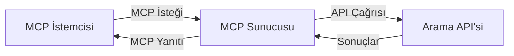
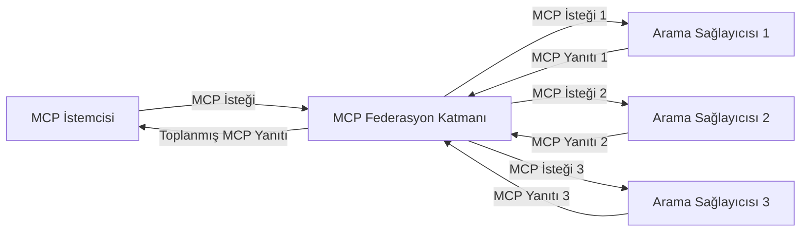
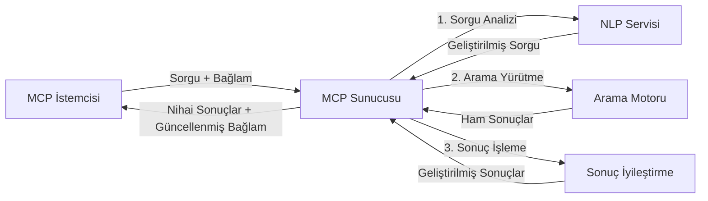

# Gerçek Zamanlı Web Araması İçin Model Bağlam Protokolü

## Genel Bakış

Gerçek zamanlı web araması, uygulamaların ilgili ve zamanında yanıtlar sağlayabilmesi için internette güncel bilgilere anında erişim ihtiyacının arttığı günümüz bilgi odaklı ortamında vazgeçilmez hale gelmiştir. Model Bağlam Protokolü (MCP), bu gerçek zamanlı arama süreçlerini optimize etmede önemli bir ilerleme temsil eder; arama verimliliğini artırır, bağlamsal bütünlüğü korur ve genel sistem performansını iyileştirir.

Bu modül, MCP'nin AI modelleri, arama motorları ve uygulamalar arasında bağlam yönetimine standart bir yaklaşım sunarak gerçek zamanlı web aramasını nasıl dönüştürdüğünü inceler.

### Öğrenecekleriniz

Bu kapsamlı rehberde şunları keşfedeceksiniz:

- MCP'nin AI modelleri ile gerçek zamanlı web arama yetenekleri arasında nasıl kesintisiz bir köprü kurduğunu
- MCP ile verimli ve ölçeklenebilir arama çözümlerinin uygulanmasına yönelik mimari desenleri
- Birden çok sorgu ve etkileşimde arama bağlamını koruma tekniklerini
- Çeşitli arama senaryoları için Python ve JavaScript'te pratik kod uygulamalarını
- MCP destekli arama sistemlerinde alaka, güncellik ve performans arasında denge kurma yöntemlerini

## Gerçek Zamanlı Web Aramaya Giriş

Gerçek zamanlı web araması, web tabanlı bilgilerin yayımlandığı veya güncellendiği anda sürekli sorgulanmasını, işlenmesini ve analiz edilmesini sağlayan teknolojik bir yaklaşımdır; böylece sistemler en az gecikmeyle taze ve ilgili bilgiler sunabilir. Saatler veya günler öncesine ait indekslenmiş verilerle çalışan geleneksel arama sistemlerinden farklı olarak, gerçek zamanlı arama webden canlı verileri işler ve çevrimiçi içeriğin mevcut durumunu yansıtan bilgiler sağlar.

### Gerçek Zamanlı Web Aramanın Temel Kavramları:

- **Sürekli Sorgu İşleme**: Arama sorguları sürekli güncellenen veri kaynakları üzerinde işlenir
- **Güncellik Önceliği**: Sistemler taze bilgiyi önceliklendirir
- **Alaka Dengeleme**: Alaka ve güncellik arasında denge sağlanması
- **Ölçeklenebilir Mimari**: Sistemler değişken sorgu yükleri ve veri hacimlerini yönetmelidir
- **Bağlamsal Anlayış**: Arama yinelemeleri arasında kullanıcı bağlamının korunması anlamlı sonuçlar için kritik
- **Dinamik Sorgu Yeniden Formülasyonu**: Bağlam ve önceki sonuçlara dayanarak sorguların uyarlanması
- **Çok Kaynaklı Entegrasyon**: Birden fazla arama sağlayıcı ve web kaynağından gelen sonuçların birleştirilmesi
- **Anlamsal Anlayış**: Anahtar kelimelerin ötesinde anlam temelinde sorgu ve içerik işleme
- **Gerçek Zamanlı Sıralama**: Yeni bilgiler geldikçe sonuç sıralamalarının sürekli ayarlanması

### Model Bağlam Protokolü ve Gerçek Zamanlı Web Araması

Model Bağlam Protokolü (MCP), gerçek zamanlı web arama ortamlarındaki birkaç kritik zorluğu ele alır:

1. **Arama Bağlamının Korunması**: MCP, bağlamın dağıtık arama bileşenleri arasında nasıl korunduğunu standartlaştırır; böylece AI modelleri ve işlem düğümleri ilgili sorgu geçmişi ve kullanıcı tercihlerine erişebilir.

2. **Verimli Sorgu Yönetimi**: MCP, bağlam iletimine yapılandırılmış mekanizmalar sağlayarak her arama yinelemesinde bağlamın tekrarlanmasının getirdiği yükü azaltır.

3. **Birlikte Çalışabilirlik**: MCP, çeşitli arama teknolojileri ve AI modelleri arasında bağlam paylaşımı için ortak bir dil oluşturur; böylece daha esnek ve genişletilebilir mimariler mümkün olur.

4. **Aramaya Özel Bağlam**: MCP uygulamaları, etkili arama için en alakalı bağlam öğelerinin önceliklendirilmesini sağlayarak performans ve doğruluk açısından optimizasyon yapabilir.

5. **Uyarlanabilir Arama İşleme**: MCP vasıtasıyla doğru bağlam yönetimi ile, arama sistemleri gelişen kullanıcı ihtiyaçları ve bilgi ortamlarına göre işleme süreçlerini dinamik şekilde ayarlayabilir.

Haber toplanmasından araştırma asistanlarına kadar modern uygulamalarda, MCP'nin web arama teknolojileriyle entegrasyonu, kullanıcı etkileşimleri devam ettikçe giderek daha ilgili sonuçlar verebilen, daha akıllı ve bağlam farkındalığı olan arama sağlar.

## Öğrenme Hedefleri

Bu dersin sonunda şunları başarabileceksiniz:

- Gerçek zamanlı web aramanın temellerini ve modern uygulamalardaki zorluklarını anlamak
- Model Bağlam Protokolü'nün (MCP) gerçek zamanlı web arama yeteneklerini nasıl geliştirdiğini açıklamak
- Popüler frameworkler ve API'lerle MCP tabanlı arama çözümleri uygulamak
- MCP ile ölçeklenebilir, yüksek performanslı arama mimarileri tasarlamak ve dağıtmak
- Semantik arama, araştırma yardımı ve AI destekli gezinme gibi çeşitli kullanım durumlarına MCP kavramlarını uygulamak
- MCP tabanlı arama teknolojilerindeki ortaya çıkan trendleri ve gelecekteki yenilikleri değerlendirmek
- Kullanıcı etkileşimlerinden öğrenen bağlam farkındalığına sahip arama sistemleri geliştirmek
- Standartlaştırılmış MCP protokolleri kullanarak web arama yeteneklerini AI asistanlarına entegre etmek
- Bağlama dayalı olarak aşamalı şekilde sonuçları iyileştiren çok aşamalı arama boru hatları oluşturmak
- Kapsamlı bağlam farkındalığını koruyarak arama performansını optimize etmek

### Tanım ve Önemi

Gerçek zamanlı web arama, web tabanlı bilgilerin minimum gecikmeyle sürekli sorgulanması, alınması ve sunulmasını içerir. Periyodik olarak web'i tarayan ve indeksleyen geleneksel arama motorlarının aksine, gerçek zamanlı arama bilgi mevcut oldukça onu kullanıcıya sunmayı hedefler; böylece en güncel içeriğe anında erişim sağlanır.

Gerçek zamanlı web aramanın temel özellikleri şunlardır:

- **Tazelik**: Yeni içerik ve güncellemelerin önceliklendirilmesi
- **Sürekli İşleme**: Yeni bilgilerin sürekli izlenmesi
- **Sorgu Uyarlaması**: Bağlam ve geribildirim temelinde arama sorgularının iyileştirilmesi
- **Anında Sunum**: Arama sonuçlarının minimum gecikmeyle sağlanması
- **Bağlam Koruma**: Geliştirilmiş alaka için önceki sorgulara dayalı inşa edilmesi

### Geleneksel Web Aramasındaki Zorluklar

Geleneksel web arama yöntemleri, gerçek zamanlı senaryolarda çeşitli sınırlamalarla karşılaşır:

1. **Bağlam Parçalanması**: Birden çok sorgu arasında arama bağlamını korumak zordur
2. **Bilgi Tazeliği**: En güncel bilgilere erişim ve önceliklendirmede zorluklar
3. **Entegrasyon Karmaşıklığı**: Arama sistemleri ve uygulamalar arasındaki birlikte çalışabilirlik sorunları
4. **Gecikme Sorunları**: Kapsamlı arama ile yanıt süresi gereksinimleri arasında denge kurulması
5. **Alaka Ayarı**: Güncelliği önceliklendirirken doğruluk ve alakanın sağlanması

## Arama İçin Model Bağlam Protokolü (MCP) Anlayışı

### MCP, Arama Bağlamlarında Nedir?

Model Bağlam Protokolü (MCP), AI modelleri ve uygulamalar arasında verimli etkileşim sağlamak için tasarlanmış standartlaştırılmış bir iletişim protokolüdür. Gerçek zamanlı web araması bağlamında MCP, şunları sağlar:

- Sorgu dizileri boyunca arama bağlamının korunmasını
- Arama sorgusu ve sonuç formatlarının standartlaştırılmasını
- Arama parametreleri ve sonuçlarının iletimini optimize etmeyi
- Model ile arama motoru arasında iletişimin iyileştirilmesini

### Temel Bileşenler ve Mimari

Gerçek zamanlı web araması için MCP mimarisi birkaç önemli bileşenden oluşur:

1. **Sorgu Bağlam Yöneticileri**: Birden çok sorgu arasında arama bağlamını yönetir ve korur
2. **Arama İşleyicileri**: Bağlam farkındalığı ile gelen arama taleplerini işler
3. **Protokol Adaptörleri**: Farklı arama API’leri arasında bağlamı koruyarak dönüşüm yapar
4. **Bağlam Deposu**: Arama geçmişi ve tercihlerini verimli şekilde depolar ve geri çağırır
5. **Arama Bağlayıcıları**: Çeşitli arama motorları ve web API’lerine bağlanır


### MCP Gerçek Zamanlı Web Aramasını Nasıl Geliştirir

MCP, geleneksel web arama zorluklarını şu şekillerde ele alır:

- **Bağlamsal Süreklilik**: Tüm arama oturumu boyunca sorgular arası ilişkilerin korunması
- **Optimize İletim**: Akıllı bağlam yönetimi ile arama parametrelerindeki tekrarların azaltılması
- **Standartlaştırılmış Arayüzler**: Arama bileşenleri için tutarlı API’ler sağlanması
- **Azaltılmış Gecikme**: Verimli bağlam işleme ile işlem yükünün minimize edilmesi
- **Gelişmiş Alaka**: Birden çok sorguda kullanıcı niyetinin korunması ile arama alakasının artırılması

## Entegrasyon ve Uygulama

Gerçek zamanlı web arama sistemleri, hem performansı hem de bağlamsal bütünlüğü korumak için dikkatli mimari tasarım ve uygulama gerektirir. Model Bağlam Protokolü, AI modelleri ve arama teknolojilerinin entegrasyonunda standart bir yaklaşım sunar; böylece daha sofistike ve bağlam farkındalığına sahip arama boru hatları mümkündür.

### MCP Entegrasyonunun Arama Mimarilerindeki Genel Görünümü

Gerçek zamanlı web arama ortamlarında MCP uygulaması birkaç ana noktayı içerir:

1. **Arama Bağlamının Serileştirilmesi**: MCP, bağlamsal bilgilerin arama istekleri içine verimli biçimde kodlanması için mekanizmalar sağlar; böylece temel bağlam sorgu boyunca işleme hattını takip eder. Standartlaştırılmış serileştirme formatları arama ile ilgili meta veriler için optimize edilmiştir.

2. **Durumlu Arama İşlemleri**: MCP, arama yinelemeleri arasında tutarlı bağlam temsili sağlayarak daha akıllı durum takibi yapılmasına olanak tanır. Bu, bağlam iyileştirmesinin sonuçları geliştirdiği çok aşamalı arama boru hatlarında özellikle değerlidir.

3. **Sorgu Genişletme ve İyileştirme**: MCP uygulamaları, biriken bağlama dayanarak gelişmiş sorgu genişletme ve iyileştirme imkanı sunarak arama oturumu ilerledikçe daha ilgili sonuçlar oluşturur.

4. **Sonuç Önbellekleme ve Önceliklendirme**: MCP, bağlam işleme standardizasyonu ile sonuç önbellekleme ve önceliklendirmeyi yönetmede yardımcı olur; bileşenlerin gelişen arama bağlamına göre uyum sağlamasına izin verir.

5. **Arama Federasyonu ve Birleştirme**: MCP, arama bağlamının yapılandırılmış temsillerini sağlayarak farklı backendlerdeki aramaların daha sofistike federasyonuna olanak tanır ve çeşitli kaynaklardan gelen sonuçların anlamlı şekilde birleştirilmesini mümkün kılar.

MCP'nin çeşitli arama teknolojileri genelinde uygulanması, bağlam yönetimi için birleşik bir yaklaşım yaratır; böylece özel entegrasyon kodu ihtiyacını azaltırken arama sorguları geliştikçe anlamlı bağlamın korunma yeteneğini artırır.

### MCP'nin Farklı Web Arama Uygulamalarındaki Yeri

Bu örnekler, JSON-RPC tabanlı ve ayrı taşıma mekanizmalarına sahip mevcut MCP spesifikasyonunu takip eder. Kod, tam MCP protokolü uyumluluğunu korurken özelleştirilmiş arama entegrasyonlarının nasıl yapılabileceğini gösterir.


<details>
<summary>Genel Arama API'si ile Python Uygulaması</summary>

```python
import asyncio
import json
import aiohttp
from typing import Dict, Any, Optional, List
from contextlib import asynccontextmanager
from collections.abc import AsyncIterator

# Standart MCP kütüphanelerini içe aktar
from mcp.client.session import ClientSession
from mcp.client.streamable_http import streamablehttp_client
from mcp.types import TextContent, CreateMessageRequestParams, CreateMessageResult
from mcp.server.fastmcp import FastMCP

# Web araması için FastMCP sunucusu oluştur
search_server = FastMCP("WebSearch")

# Web arama işlemlerini yönetmek için sınıf
class WebSearchHandler:
    def __init__(self, api_endpoint: str, api_key: str):
        self.api_endpoint = api_endpoint
        self.api_key = api_key
        self.session = None
        
    async def initialize(self):
        """Initialize the HTTP session"""
        self.session = aiohttp.ClientSession(
            headers={"Authorization": f"Bearer {self.api_key}"}
        )
    
    async def close(self):
        """Close the HTTP session"""
        if self.session:
            await self.session.close()
            
    async def perform_search(self, query: str, max_results: int = 5, 
                           include_domains: List[str] = None, 
                           exclude_domains: List[str] = None,
                           time_period: str = "any") -> Dict[str, Any]:
        """Perform web search using the search API"""
        # Arama parametrelerini oluştur
        search_params = {
            "q": query,
            "limit": max_results,
            "time": time_period
        }
        
        if include_domains:
            search_params["site"] = ",".join(include_domains)
            
        if exclude_domains:
            search_params["exclude_site"] = ",".join(exclude_domains)
        
        # Arama isteğini gerçekleştir
        try:
            async with self.session.get(
                self.api_endpoint,
                params=search_params
            ) as response:
                if response.status != 200:
                    error_text = await response.text()
                    raise Exception(f"Search API error: {response.status} - {error_text}")
                
                search_data = await response.json()
                
                # API'ye özgü yanıtı standart bir formata dönüştür
                results = []
                for item in search_data.get("results", []):
                    results.append({
                        "title": item.get("title", ""),
                        "url": item.get("url", ""),
                        "snippet": item.get("snippet", ""),
                        "date": item.get("published_date", ""),
                        "source": item.get("source", "")
                    })
                
                return {
                    "query": query,
                    "totalResults": len(results),
                    "results": results
                }
        except Exception as e:
            print(f"Search API request error: {e}")
            raise

# Arama yöneticisini başlat
search_handler = WebSearchHandler(
    api_endpoint="https://api.search-service.example/search",
    api_key="your-api-key-here"
)

# Arama yöneticisini yönetmek için yaşam süresi ayarla
@asyncio.asynccontextmanager
async def app_lifespan(server: FastMCP):
    """Manage application lifecycle"""
    await search_handler.initialize()
    try:
        yield {"search_handler": search_handler}
    finally:
        await search_handler.close()

# Sunucu için yaşam süresini ayarla
search_server = FastMCP("WebSearch", lifespan=app_lifespan)

# Bir web arama aracı kaydet
@search_server.tool()
async def web_search(query: str, max_results: int = 5, 
                   include_domains: List[str] = None,
                   exclude_domains: List[str] = None,
                   time_period: str = "any") -> Dict[str, Any]:
    """
    Search the web for information
    
    Args:
        query: The search query
        max_results: Maximum number of results to return (default: 5)
        include_domains: List of domains to include in search results
        exclude_domains: List of domains to exclude from search results
        time_period: Time period for results ("day", "week", "month", "any")
        
    Returns:
        Dictionary containing search results
    """
    ctx = search_server.get_context()
    search_handler = ctx.request_context.lifespan_context["search_handler"]
    
    results = await search_handler.perform_search(
        query=query,
        max_results=max_results,
        include_domains=include_domains,
        exclude_domains=exclude_domains,
        time_period=time_period
    )
    
    return results

# Örnek istemci kullanımı
async def client_example():
    # Streamable HTTP taşımayı kullanarak arama sunucusuna bağlan
    async with streamablehttp_client("http://localhost:8000/mcp") as (read, write, _):
        async with ClientSession(read, write) as session:
            # Bağlantıyı başlat
            await session.initialize()
            
            # web_search aracını çağır
            search_results = await session.call_tool(
                "web_search", 
                {
                    "query": "latest developments in AI and Model Context Protocol",
                    "max_results": 5,
                    "time_period": "day",
                    "include_domains": ["github.com", "microsoft.com"]
                }
            )
            
            print(f"Search results: {search_results}")

# Sunucu çalıştırma örneği
if __name__ == "__main__":
    # Streamable HTTP taşımayla sunucuyu çalıştır
    search_server.run(transport="streamable-http")
```
</details> 

<details>
<summary>Tarayıcı Tabanlı Arama ile JavaScript Uygulaması</summary>


```javascript
// Web araması için MCP sunucu uygulaması
import { McpServer, ResourceTemplate } from '@modelcontextprotocol/sdk/server/mcp.js';
import { StreamableHTTPServerTransport } from '@modelcontextprotocol/sdk/server/streamableHttp.js';
import { z } from 'zod';

// Web araması için bir MCP sunucusu oluştur
const searchServer = new McpServer({
    name: "BrowserSearch",
    description: "A server that provides web search capabilities"
});

// Arama servis sınıfı
class SearchService {
    constructor(searchApiUrl, apiKey) {
        this.searchApiUrl = searchApiUrl;
        this.apiKey = apiKey;
    }

    async performSearch(parameters) {
        const {
            query = '',
            maxResults = 5,
            includeDomains = [],
            excludeDomains = [],
            timePeriod = 'any'
        } = parameters;
        
        // Parametrelerle arama URL'si oluştur
        const url = new URL(this.searchApiUrl);
        url.searchParams.append('q', query);
        url.searchParams.append('limit', maxResults);
        url.searchParams.append('time', timePeriod);
        
        if (includeDomains.length > 0) {
            url.searchParams.append('site', includeDomains.join(','));
        }
        
        if (excludeDomains.length > 0) {
            url.searchParams.append('exclude_site', excludeDomains.join(','));
        }
        
        try {
            const response = await fetch(url.toString(), {
                method: 'GET',
                headers: {
                    'Authorization': `Bearer ${this.apiKey}`,
                    'Content-Type': 'application/json'
                }
            });
            
            if (!response.ok) {
                const errorText = await response.text();
                throw new Error(`Search API error: ${response.status} - ${errorText}`);
            }
            
            const searchData = await response.json();
            
            // API'ye özgü yanıtı standart formata dönüştür
            const results = searchData.results?.map(item => ({
                title: item.title || '',
                url: item.url || '',
                snippet: item.snippet || '',
                date: item.published_date || '',
                source: item.source || ''
            })) || [];
            
            return {
                query,
                totalResults: results.length,
                results
            };
        } catch (error) {
            console.error('Search API request error:', error);
            throw error;
        }
    }
}

// Arama servisini başlat
const searchService = new SearchService(
    'https://api.search-service.example/search',
    'your-api-key-here'
);

// Sunucu için bağlam sağlayıcısını ayarla
searchServer.setContextProvider(() => {
    return {
        searchService
    };
});

// Web arama aracını kaydet
searchServer.tool({
    name: 'web_search',
    description: 'Search the web for information',
    parameters: {
        type: 'object',
        properties: {
            query: {
                type: 'string',
                description: 'The search query'
            },
            maxResults: {
                type: 'integer',
                description: 'Maximum number of results to return',
                default: 5
            },
            includeDomains: {
                type: 'array',
                items: { type: 'string' },
                description: 'List of domains to include in search results'
            },
            excludeDomains: {
                type: 'array',
                items: { type: 'string' },
                description: 'List of domains to exclude from search results'
            },
            timePeriod: {
                type: 'string',
                description: 'Time period for results',
                enum: ['day', 'week', 'month', 'any'],
                default: 'any'
            }
        },
        required: ['query']
    },
    handler: async (params, context) => {
        const { searchService } = context;
        return await searchService.performSearch(params);
    }
});

// Arama sunucusuna bağlanmak için örnek istemci kodu
import { Client } from '@modelcontextprotocol/sdk/client/index.js';
import { StreamableHTTPClientTransport } from '@modelcontextprotocol/sdk/client/streamableHttp.js';

async function connectToSearchServer() {
    // Arama sunucusuna bağlan
    const transport = new StreamableHTTPClientTransport(
        new URL('http://localhost:8000/mcp')
    );
    
    const client = new Client({
        name: 'search-client',
        version: '1.0.0'
    });
    
    await client.connect(transport);
    
    // Arama aracını çalıştır
    const searchResults = await client.callTool({
        name: 'web_search',
        arguments: {
            query: 'Model Context Protocol implementation examples',
            maxResults: 10,
            timePeriod: 'week',
            includeDomains: ['github.com', 'docs.microsoft.com']
        }
    });
    
    console.log('Search results:', searchResults);
    
    // Temizlik işlemi
    await client.disconnect();
}

// Sunucuyu başlat
const transport = new StreamableHTTPServerTransport();
await searchServer.connect(transport);
console.log('Search server running at http://localhost:8000/mcp');

// Ayrı bir işlemde veya sunucu başlatıldıktan sonra
// connectToSearchServer().catch(console.error);
```
</details> 


## Kod Örnekleri Uyarısı

> **Önemli Not**: Aşağıdaki kod örnekleri Model Bağlam Protokolü (MCP) ile web arama işlevselliğinin entegrasyonunu göstermektedir. Resmi MCP SDK'larının desen ve yapısını takip etmekle birlikte, eğitim amaçlı sadeleştirilmiştir.
> 
> Bu örnekler şunları içermektedir:
> 
> 1. **Python Uygulaması**: Dış bir arama API'sine bağlanan web arama aracı sağlayan bir FastMCP sunucu uygulaması. Bu örnek, [resmi MCP Python SDK](https://github.com/modelcontextprotocol/python-sdk) desenlerini takip ederek doğru yaşam döngüsü yönetimi, bağlam işleme ve araç uygulaması içerir. Sunucu, eski SSE taşımanın yerini alan önerilen Streamable HTTP taşımasını kullanır.
> 
> 2. **JavaScript Uygulaması**: [resmi MCP TypeScript SDK](https://github.com/modelcontextprotocol/typescript-sdk) içindeki FastMCP desenini kullanarak düzgün araç tanımları ve istemci bağlantılarına sahip bir arama sunucusu oluşturan TypeScript/JavaScript uygulaması. En güncel oturum yönetimi ve bağlam koruma desenlerini takip eder.
> 
> Bu örnekler, üretim kullanımı için ek hata yönetimi, kimlik doğrulama ve özel API entegrasyon kodları gerektirir. Gösterilen arama API uç noktaları (`https://api.search-service.example/search`) yer tutucudur ve gerçek arama hizmeti uç noktaları ile değiştirilmelidir.
> 
> Tam uygulama detayları ve en güncel yaklaşımlar için lütfen [resmi MCP spesifikasyonuna](https://spec.modelcontextprotocol.io/) ve SDK belgelerine bakınız.

## Temel Kavramlar

### Model Bağlam Protokolü (MCP) Çerçevesi

Temelde, Model Bağlam Protokolü AI modelleri, uygulamalar ve servisler arasında bağlam alışverişi için standart bir yol sağlar. Gerçek zamanlı web aramasında, bu çerçeve tutarlı, çok aşamalı arama deneyimleri yaratmak için gereklidir. Ana bileşenler şunlardır:

1. **İstemci-Sunucu Mimarisi**: MCP, arama istemcileri (talep edenler) ile arama sunucuları (sağlayıcılar) arasında net bir ayrım kurar; esnek dağıtım modellerine izin verir.

2. **JSON-RPC İletişimi**: Protokol, mesaj alışverişi için JSON-RPC kullanır; bu sayede web teknolojileriyle uyumludur ve farklı platformlarda kolay uygulanabilir.

3. **Bağlam Yönetimi**: MCP, çoklu etkileşimler boyunca arama bağlamını koruma, güncelleme ve kullanma için yapılandırılmış yöntemler tanımlar.

4. **Araç Tanımları**: Arama yetenekleri, iyi tanımlanmış parametreler ve dönüş değerleri ile standart araçlar olarak sunulur.

5. **Akış Desteği**: Protokol, sonuçların ilerleyici biçimde gelmesi gereken gerçek zamanlı arama için akış desteği sağlar.

### Web Arama Entegrasyon Desenleri

MCP web araması ile entegre edilirken çeşitli desenler ortaya çıkar:

#### 1. Doğrudan Arama Sağlayıcı Entegrasyonu



Bu desen MCP sunucusunun doğrudan bir veya daha fazla arama API'si ile arayüz kurmasını sağlar; MCP isteklerini API özgü çağrılara çevirir ve sonuçları MCP yanıtları olarak biçimlendirir.

#### 2. Bağlam Koruma ile Federatif Arama



Bu desen, arama sorgularını birden fazla MCP uyumlu arama sağlayıcısına dağıtır; her biri farklı içerik türleri veya arama yeteneklerinde uzmanlaşabilir ve birleşik bir bağlamı korur.

#### 3. Bağlam Geliştirmeli Arama Zinciri



Bu desen, arama sürecini birden çok aşamaya böler; her aşamada bağlam zenginleştirilir ve giderek daha ilgili sonuçlar elde edilir.

### Arama Bağlamı Bileşenleri

MCP tabanlı web aramada, bağlam tipik olarak şunları içerir:

- **Sorgu Geçmişi**: Oturumdaki önceki arama sorguları
- **Kullanıcı Tercihleri**: Dil, bölge, güvenli arama ayarları
- **Etkileşim Geçmişi**: Hangi sonuçlara tıklandığı, sonuçlarda geçirilen süre
- **Arama Parametreleri**: Filtreler, sıralama düzenleri ve diğer arama değiştiricileri
- **Alan Bilgisi**: Arama ile ilgili konuya özel bağlam
- **Zamansal Bağlam**: Zaman temelli alaka faktörleri
- **Kaynak Tercihleri**: Güvenilir veya tercih edilen bilgi kaynakları

## Kullanım Alanları ve Uygulamalar

### Araştırma ve Bilgi Toplama

MCP, araştırma iş akışlarını şu şekilde geliştirir:

- Arama oturumları boyunca araştırma bağlamını koruyarak
- Daha sofistike ve bağlamsal olarak ilgili sorguların yapılmasını sağlayarak
- Çok kaynaklı arama federasyonunu destekleyerek
- Arama sonuçlarından bilgi çıkarımını kolaylaştırarak

### Gerçek Zamanlı Haber ve Trend İzleme

MCP destekli arama, haber izleme için avantajlar sunar:

- Ortaya çıkan haberlerin neredeyse gerçek zamanlı keşfi
- İlgili bilgilerin bağlamsal filtrelenmesi
- Birden fazla kaynakta konu ve varlık takibi
- Kullanıcı bağlamına göre kişiselleştirilmiş haber uyarıları

### AI Destekli Gezinme ve Araştırma

MCP, AI destekli gezinme için yeni olanaklar yaratır:

- Mevcut tarayıcı etkinliğine dayalı bağlamsal arama önerileri
- LLM destekli asistanlarla web aramasının sorunsuz entegrasyonu
- Korunan bağlam ile çok aşamalı arama iyileştirmesi
- Gelişmiş gerçek kontrol ve bilgi doğrulama

## Gelecekteki Trendler ve Yenilikler

### MCP'nin Web Aramasındaki Gelişimi

Geleceğe bakarken, MCP'nin aşağıdaki konuları ele alacak şekilde gelişmesini bekliyoruz:


- **Multimodal Arama**: Metin, görüntü, ses ve video aramalarını korunan bağlam ile entegre etme
- **Merkeziyetsiz Arama**: Dağıtık ve federatif arama ekosistemlerini destekleme
- **Arama Gizliliği**: Bağlamdan haberdar gizliliği koruyan arama mekanizmaları
- **Sorgu Anlama**: Doğal dil arama sorgularının derin anlamsal ayrıştırması

### Teknolojide Potansiyel İlerlemler

MCP aramasının geleceğini şekillendirecek gelişmekte olan teknolojiler:

1. **Sinirsel Arama Mimarileri**: MCP için optimize edilmiş gömme tabanlı arama sistemleri
2. **Kişiselleştirilmiş Arama Bağlamı**: Bireysel kullanıcı arama desenlerini zaman içinde öğrenme
3. **Bilgi Grafiği Entegrasyonu**: Alan özelinde bilgi grafiklerinin sağladığı bağlamsal arama geliştirmeleri
4. **Çok Modlu Bağlam**: Farklı arama modları arasında bağlamı koruma

## Uygulamalı Egzersizler

### Egzersiz 1: Temel Bir MCP Arama Hattı Kurmak

Bu egzersizde öğrenecekleriniz:
- Temel bir MCP arama ortamı yapılandırmak
- Web araması için bağlam işleyicileri uygulamak
- Arama yinelemeleri boyunca bağlam korumasını test etmek ve doğrulamak

### Egzersiz 2: MCP Araması ile Araştırma Asistanı Oluşturmak

Tam uygulama oluşturun:
- Doğal dilde araştırma sorularını işlemek
- Bağlamdan haberdar web aramaları yapmak
- Birden fazla kaynaktan bilgileri sentezlemek
- Düzenlenmiş araştırma bulgularını sunmak

### Egzersiz 3: MCP ile Çok Kaynaklı Arama Federasyonu Gerçekleştirmek

İleri seviye egzersiz şunları kapsar:
- Bağlamdan haberdar sorgu yönlendirmesini birden fazla arama motoruna yapmak
- Sonuç sıralaması ve birleştirmesi
- Arama sonuçlarının bağlamsal çoğaltma önleme
- Kaynağa özel meta verilerin işlenmesi

## Ek Kaynaklar

- [Model Context Protocol Spesifikasyonu](https://spec.modelcontextprotocol.io/) - Resmi MCP spesifikasyonu ve detaylı protokol dokümantasyonu
- [Model Context Protocol Dokümantasyonu](https://modelcontextprotocol.io/) - Detaylı eğitimler ve uygulama rehberleri
- [MCP Python SDK](https://github.com/modelcontextprotocol/python-sdk) - MCP protokolünün resmi Python uygulaması
- [MCP TypeScript SDK](https://github.com/modelcontextprotocol/typescript-sdk) - MCP protokolünün resmi TypeScript uygulaması
- [MCP Referans Sunucuları](https://github.com/modelcontextprotocol/servers) - MCP sunucularının referans uygulamaları
- [Bing Web Arama API Dokümantasyonu](https://learn.microsoft.com/en-us/bing/search-apis/bing-web-search/overview) - Microsoft’un web arama API'si
- [Google Özel Arama JSON API](https://developers.google.com/custom-search/v1/overview) - Google'ın programlanabilir arama motoru
- [SerpAPI Dokümantasyonu](https://serpapi.com/search-api) - Arama motoru sonuç sayfası API'si
- [Meilisearch Dokümantasyonu](https://www.meilisearch.com/docs) - Açık kaynak arama motoru
- [Elasticsearch Dokümantasyonu](https://www.elastic.co/guide/index.html) - Dağıtık arama ve analiz motoru
- [LangChain Dokümantasyonu](https://python.langchain.com/docs/get_started/introduction) - LLM'lerle uygulama geliştirme

## Öğrenme Çıktıları

Bu modülü tamamlayarak aşağıdakileri yapabileceksiniz:

- Gerçek zamanlı web aramasının temellerini ve zorluklarını anlamak
- Model Context Protocol (MCP) ile gerçek zamanlı web arama yeteneklerinin nasıl geliştirdiğini açıklamak
- Popüler çerçeveler ve API’ler kullanarak MCP tabanlı arama çözümleri uygulamak
- MCP ile ölçeklenebilir, yüksek performanslı arama mimarileri tasarlamak ve uygulamak
- MCP kavramlarını anlamsal arama, araştırma asistanlığı ve yapay zeka destekli gezinme gibi çeşitli kullanım alanlarına uygulamak
- MCP tabanlı arama teknolojilerindeki yeni trendleri ve gelecekteki yenilikleri değerlendirmek


### Güven ve Güvenlik Hususları

MCP tabanlı web arama çözümleri uygularken, MCP spesifikasyonundan şu önemli ilkeleri unutmayın:

1. **Kullanıcı Onayı ve Kontrolü**: Kullanıcılar tüm veri erişimi ve işlemlerine açıkça onay vermeli ve anlamalıdır. Bu, harici veri kaynaklarına erişebilen web arama uygulamaları için özellikle önemlidir.

2. **Veri Gizliliği**: Arama sorguları ve sonuçlarının uygun şekilde işlenmesini sağlayın, özellikle hassas bilgiler içerebilecek durumlarda. Kullanıcı verilerini korumak için uygun erişim kontrollerini uygulayın.

3. **Araç Güvenliği**: Arama araçları için uygun yetkilendirme ve doğrulama uygulayın, çünkü bu araçlar keyfi kod yürütme yoluyla potansiyel güvenlik riskleri oluşturabilir. Araç davranış açıklamaları, güvenilir bir sunucudan alınmadıkça güvensiz kabul edilmelidir.

4. **Açık Dokümantasyon**: MCP tabanlı arama uygulamanızın yetenekleri, sınırlamaları ve güvenlik hususları hakkında açık dokümantasyon sağlayın, MCP spesifikasyonundaki uygulama kılavuzlarını takip edin.

5. **Dayanıklı Onay Akışları**: Özellikle harici web kaynaklarıyla etkileşimde bulunan araçlar için kullanımı yetkilendirmeden önce her aracın ne yaptığını açıkça açıklayan dayanıklı onay ve yetkilendirme akışları oluşturun.

MCP güvenlik ve güven esaslarıyla ilgili tam detaylar için [resmi dokümantasyona](https://modelcontextprotocol.io/specification/2025-11-25/basic/security_best_practices) bakabilirsiniz.

## Sırada Ne Var

- [5.12 Model Context Protocol Sunucuları için Entra ID Kimlik Doğrulaması](../mcp-security-entra/README.md)

---

<!-- CO-OP TRANSLATOR DISCLAIMER START -->
**Feragatname**:
Bu belge, AI çeviri hizmeti [Co-op Translator](https://github.com/Azure/co-op-translator) kullanılarak çevrilmiştir. Doğruluk için çaba sarf etsek de, otomatik çevirilerin hata veya yanlışlık içerebileceğini lütfen unutmayınız. Orijinal belge, kendi dilinde yetkili kaynak olarak kabul edilmelidir. Kritik bilgiler için profesyonel insan çevirisi önerilir. Bu çevirinin kullanımı sonucu ortaya çıkabilecek yanlış anlamalardan veya yanlış yorumlamalardan sorumlu değiliz.
<!-- CO-OP TRANSLATOR DISCLAIMER END -->