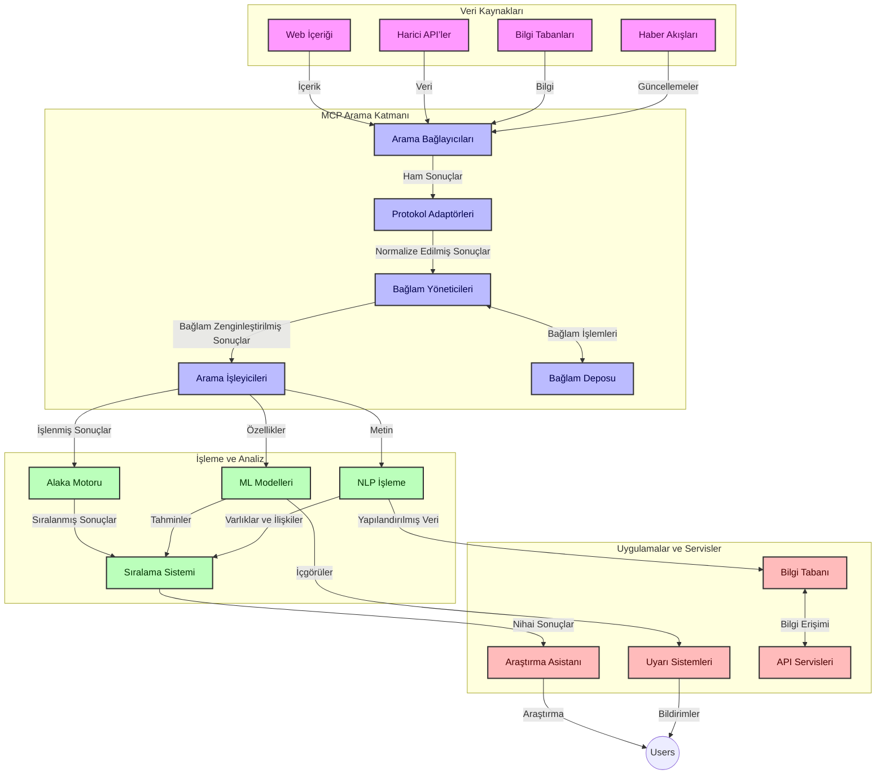
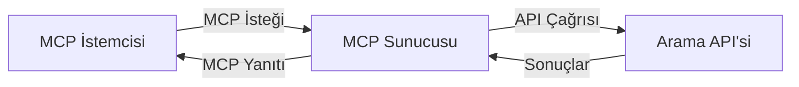
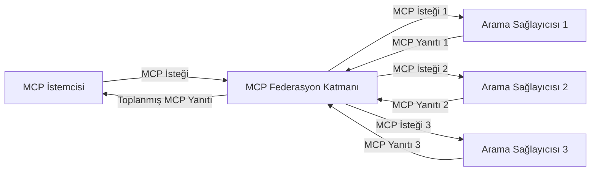
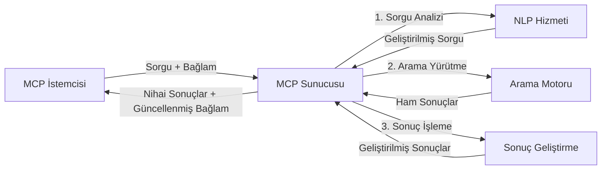

# Gerçek Zamanlı Web Araması için Model Bağlam Protokolü

## Genel Bakış

Gerçek zamanlı web araması, uygulamaların alakalı ve zamanında yanıtlar sağlamak için internetteki en güncel bilgilere anında erişim gerektirdiği günümüz bilgi odaklı ortamında temel hale gelmiştir. Model Bağlam Protokolü (MCP), bu gerçek zamanlı arama süreçlerini optimize etmede önemli bir ilerlemeyi temsil eder; arama verimliliğini artırır, bağlamsal bütünlüğü korur ve genel sistem performansını iyileştirir.

Bu modül, MCP'nin AI modelleri, arama motorları ve uygulamalar arasında bağlam yönetimine standart bir yaklaşım sağlayarak gerçek zamanlı web aramasını nasıl dönüştürdüğünü keşfeder.

### Öğrenecekleriniz

Bu kapsamlı kılavuzda, şunları keşfedeceksiniz:

- MCP'nin AI modelleri ile gerçek zamanlı web arama yetenekleri arasında nasıl sorunsuz bir köprü oluşturduğu
- MCP ile verimli ve ölçeklenebilir arama çözümleri uygulamak için mimari kalıplar
- Birden çok sorgu ve etkileşim boyunca arama bağlamını koruma teknikleri
- Farklı arama senaryoları için Python ve JavaScript'te pratik kod uygulamaları
- MCP destekli arama sistemlerinde alaka, güncellik ve performans arasında denge kurma yöntemleri

## Gerçek Zamanlı Web Aramasına Giriş

Gerçek zamanlı web araması, yayınlandıkça veya güncellendikçe web tabanlı bilgilerin sürekli olarak sorgulanmasını, işlenmesini ve analiz edilmesini sağlayan teknolojik bir yaklaşımdır; böylece sistemler minimal gecikmeyle taze ve alakalı bilgi sunabilir. Saatler veya günler öncesine ait indekslenmiş veriler üzerinde çalışan geleneksel arama sistemlerinin aksine, gerçek zamanlı arama webdeki canlı verileri işler ve çevrimiçi içeriğin mevcut durumunu yansıtan bilgiler ve içgörüler sunar.

### Gerçek Zamanlı Web Aramasının Temel Kavramları:

- **Sürekli Sorgu İşleme**: Arama sorguları, sürekli güncellenen veri kaynaklarına karşı işlenir
- **Güncellik Önceliği**: Sistemler taze bilgiyi önceliklendirecek şekilde tasarlanır
- **Alaka Dengesi**: Alaka ve güncellik arasında denge sağlanması
- **Ölçeklenebilir Mimari**: Sistemler değişken sorgu yükleri ve veri hacimlerini kaldırabilmelidir
- **Bağlamsal Anlayış**: Kullanıcı bağlamının arama iterasyonları boyunca korunması anlamlı sonuçlar için kritik önemdedir
- **Dinamik Sorgu Yeniden Formülasyonu**: Bağlam ve önceki sonuçlara göre sorguları uyarlamalı olarak değiştirme
- **Çoklu Kaynak Entegrasyonu**: Birden çok arama sağlayıcısı ve web kaynağından sonuçları birleştirme
- **Anlamsal Anlayış**: Sadece anahtar kelimelere değil, anlam temelinde sorgu ve içerik işleme
- **Gerçek Zamanlı Sıralama**: Yeni bilgiler geldikçe sonuç sıralamalarını sürekli ayarlama

### Model Bağlam Protokolü ve Gerçek Zamanlı Web Araması

Model Bağlam Protokolü (MCP), gerçek zamanlı web araması ortamlarında birkaç kritik sorunu ele alır:

1. **Arama Bağlamı Korunması**: MCP, bağlamın dağıtılmış arama bileşenleri arasında nasıl korunduğunu standardize eder ve AI modelleri ile işlem düğümlerinin ilgili sorgu geçmişi ve kullanıcı tercihleri erişimini sağlar.

2. **Verimli Sorgu Yönetimi**: Yapılandırılmış bağlam iletimi mekanizmaları sağlayarak, MCP her arama iterasyonunda bağlamın tekrarını azaltır.

3. **Birlikte Çalışabilirlik**: MCP, farklı arama teknolojileri ve AI modelleri arasında bağlam paylaşımı için ortak bir dil oluşturur, daha esnek ve genişletilebilir mimariler sağlar.

4. **Arama-Optimizasyonlu Bağlam**: MCP uygulamaları, etkili arama için en alakalı bağlam öğelerini önceliklendirebilir; performans ve doğruluk için optimize eder.

5. **Uyarlanabilir Arama İşleme**: MCP aracılığıyla uygun bağlam yönetimi ile, arama sistemleri değişen kullanıcı ihtiyaçları ve bilgi ortamlarına göre dinamik olarak işlem ayarlayabilir.

Haber toplayıcılarından araştırma asistanlarına kadar modern uygulamalarda, MCP'nin web arama teknolojileriyle entegrasyonu, kullanıcı etkileşimleri devam ettikçe giderek daha alakalı sonuçlar sağlayabilen daha akıllı, bağlam farkında aramalar sunar.

## Öğrenme Hedefleri

Bu dersin sonunda şunları yapabileceksiniz:

- Gerçek zamanlı web aramasının temellerini ve modern uygulamalardaki zorluklarını anlamak
- Model Bağlam Protokolü'nün (MCP) gerçek zamanlı web araması yeteneklerini nasıl geliştirdiğini açıklamak
- Popüler çerçeveler ve API'lerle MCP tabanlı arama çözümleri uygulamak
- MCP ile ölçeklenebilir, yüksek performanslı arama mimarileri tasarlamak ve dağıtmak
- MCP kavramlarını anlamsal arama, araştırma yardımı ve AI destekli tarama dahil çeşitli kullanım senaryolarına uygulamak
- MCP tabanlı arama teknolojilerindeki yükselen trendleri ve gelecekteki yenilikleri değerlendirmek
- Kullanıcı etkileşimlerinden öğrenen bağlam farkında arama sistemleri geliştirmek
- Standartlaştırılmış MCP protokolleri kullanarak AI asistanlarına web arama yetenekleri entegre etmek
- Bağlam temelinde sonuçları kademeli olarak iyileştiren çok aşamalı arama hatları oluşturmak
- Kapsamlı bağlam farkındalığını korurken arama performansını optimize etmek

### Tanım ve Önemi

Gerçek zamanlı web araması, web tabanlı bilgilerin minimal gecikmeyle sürekli olarak sorgulanması, alınması ve sunulmasını içerir. Web'i periyodik olarak tarayıp indeksleyen geleneksel arama motorlarının aksine, gerçek zamanlı arama bilgi mevcut oldukça onu ön plana çıkararak en güncel içeriğe anında erişim sağlar.

Gerçek zamanlı web aramasının temel özellikleri şunlardır:

- **Tazelik**: Güncel içerik ve güncellemelerin önceliklendirilmesi
- **Sürekli İşleme**: Yeni bilgileri sürekli izleme
- **Sorgu Uyarlaması**: Bağlam ve geri bildirim temelinde arama sorgularını iyileştirme
- **Anında Sunum**: Arama sonuçlarını minimal gecikmeyle sağlama
- **Bağlam Tutma**: Önceki sorgulara dayanarak alaka artırma

### Geleneksel Web Aramasındaki Zorluklar

Geleneksel web arama yaklaşımları, gerçek zamanlı senaryolarda uygulanırken birkaç sınırlamayla karşılaşır:

1. **Bağlam Parçalanması**: Birden çok sorgu arasında arama bağlamını korumada zorluk
2. **Bilgi Tazeliği**: En güncel bilgiyi erişmede ve önceliklendirmede zorluklar
3. **Entegrasyon Karmaşıklığı**: Arama sistemleri ve uygulamalar arasında birlikte çalışabilirlik sorunları
4. **Gecikme Sorunları**: Kapsamlı arama ile yanıt süresi gereksinimlerinin dengelenmesi
5. **Alaka Ayarı**: Güncelliği önceliklendirirken doğruluk ve alaka sağlama

## Arama için Model Bağlam Protokolünü (MCP) Anlama

### Arama Bağlamında MCP Nedir?

Model Bağlam Protokolü (MCP), AI modelleri ile uygulamalar arasında verimli etkileşimi kolaylaştırmak için tasarlanmış standart bir iletişim protokolüdür. Gerçek zamanlı web araması bağlamında MCP şunları sağlar:

- Sorgu dizileri boyunca arama bağlamını koruma
- Arama sorgusu ve sonuç formatlarını standardize etme
- Arama parametrelerinin ve sonuçların iletimini optimize etme
- Model ile arama motoru arasındaki iletişimi geliştirme

### Temel Bileşenler ve Mimari

Gerçek zamanlı web araması için MCP mimarisi birkaç temel bileşenden oluşur:

1. **Sorgu Bağlam Yöneticileri**: Birden çok sorgu boyunca arama bağlamını yönetir ve korur
2. **Arama İşleyicileri**: Bağlam farkındalıklı tekniklerle gelen arama taleplerini işler
3. **Protokol Adaptörleri**: Bağlamı koruyarak farklı arama API'leri arasında dönüşüm yapar
4. **Bağlam Deposu**: Arama geçmişi ve tercihlerini verimli şekilde depolar ve alır
5. **Arama Bağlayıcıları**: Çeşitli arama motorları ve web API'lerine bağlanır



### MCP Gerçek Zamanlı Web Aramasını Nasıl İyileştirir

MCP, geleneksel web arama zorluklarını şu yollarla ele alır:

- **Bağlamsal Süreklilik**: Tüm arama oturumu boyunca sorgular arasındaki ilişkileri korur
- **Optimizasyonlu İletim**: Akıllı bağlam yönetimiyle arama parametrelerinde tekrarları azaltır
- **Standardize Arayüzler**: Arama bileşenleri için tutarlı API'ler sağlar
- **Azaltılmış Gecikme**: Verimli bağlam işlemesiyle işlem yükünü minimize eder
- **Geliştirilmiş Alaka**: Birden çok sorguda kullanıcı niyetini koruyarak arama alakasını artırır

## Entegrasyon ve Uygulama

Gerçek zamanlı web arama sistemleri, hem performans hem de bağlamsal bütünlüğü korumak için dikkatli mimari tasarım ve uygulama gerektirir. Model Bağlam Protokolü, AI modelleri ile arama teknolojilerinin entegrasyonuna standart bir yaklaşım sunar ve daha sofistike, bağlam farkında arama hatları oluşturulmasına olanak tanır.

### Arama Mimarilerinde MCP Entegrasyonunun Genel Görünümü

Gerçek zamanlı web arama ortamlarında MCP uygulamak birkaç önemli hususu içerir:

1. **Arama Bağlamı Serileştirme**: MCP, arama taleplerine bağlamsal bilgilerin kodlanması için verimli mekanizmalar sağlar; böylece işlem hattı boyunca gerekli bağlam sorguya eşlik eder. Bu, arama ile ilgili meta veriler için optimize edilmiş standart serileştirme formatlarını içerir.

2. **Durumlu Arama İşleme**: MCP, bağlamın tutarlı şekilde temsil edilmesini koruyarak daha zeki durumlu işleme olanak tanır. Bu, bağlam iyileştirmenin sonuçları artırdığı çok aşamalı arama hatlarında özellikle değerlidir.

3. **Sorgu Genişletme ve İyileştirme**: MCP uygulamaları, biriken bağlama dayanarak gelişmiş sorgu genişletme ve iyileştirme sağlayabilir; böylece arama oturumu ilerledikçe sonuçlar daha alakalı hale gelir.

4. **Sonuç Önbelleğe Alma ve Önceliklendirme**: Bağlam işlemi standardize edilerek, MCP bileşenlerin değişen arama bağlamına göre sonucu önbelleğe alma ve önceliklendirme yapmasına yardım eder.

5. **Arama Federasyonu ve Toplama**: MCP, arama bağlamının yapılandırılmış temsillerini sağlayarak birden fazla arka uçta daha gelişmiş arama federasyonu ve çeşitli kaynaklardan anlamlı sonuç toplama yapılmasına olanak tanır.

MCP'nin çeşitli arama teknolojilerinde uygulanması, bağlam yönetimi için birleşik bir yaklaşım yaratır; özel entegrasyon kodu ihtiyacını azaltırken arama sorguları geliştikçe anlamlı bağlamın korunmasını artırır.

### MCP'nin Çeşitli Web Arama Uygulamalarındaki Yeri

Bu örnekler, belirgin taşıma mekanizmalarına sahip JSON-RPC tabanlı güncel MCP spesifikasyonunu takip eder. Kod, MCP protokolüyle tam uyumluluğu korurken özel arama entegrasyonlarının nasıl uygulanabileceğini gösterir.


<details>
<summary>Genel Arama API'si ile Python Uygulaması</summary>

```python
import asyncio
import json
import aiohttp
from typing import Dict, Any, Optional, List
from contextlib import asynccontextmanager
from collections.abc import AsyncIterator

# Standart MCP kütüphanelerini içe aktar
from mcp.client.session import ClientSession
from mcp.client.streamable_http import streamablehttp_client
from mcp.types import TextContent, CreateMessageRequestParams, CreateMessageResult
from mcp.server.fastmcp import FastMCP

# Web araması için FastMCP sunucusu oluştur
search_server = FastMCP("WebSearch")

# Web arama işlemlerini yönetmek için sınıf
class WebSearchHandler:
    def __init__(self, api_endpoint: str, api_key: str):
        self.api_endpoint = api_endpoint
        self.api_key = api_key
        self.session = None
        
    async def initialize(self):
        """Initialize the HTTP session"""
        self.session = aiohttp.ClientSession(
            headers={"Authorization": f"Bearer {self.api_key}"}
        )
    
    async def close(self):
        """Close the HTTP session"""
        if self.session:
            await self.session.close()
            
    async def perform_search(self, query: str, max_results: int = 5, 
                           include_domains: List[str] = None, 
                           exclude_domains: List[str] = None,
                           time_period: str = "any") -> Dict[str, Any]:
        """Perform web search using the search API"""
        # Arama parametrelerini oluştur
        search_params = {
            "q": query,
            "limit": max_results,
            "time": time_period
        }
        
        if include_domains:
            search_params["site"] = ",".join(include_domains)
            
        if exclude_domains:
            search_params["exclude_site"] = ",".join(exclude_domains)
        
        # Arama isteğini gerçekleştir
        try:
            async with self.session.get(
                self.api_endpoint,
                params=search_params
            ) as response:
                if response.status != 200:
                    error_text = await response.text()
                    raise Exception(f"Search API error: {response.status} - {error_text}")
                
                search_data = await response.json()
                
                # API'ye özgü yanıtı standart bir formata dönüştür
                results = []
                for item in search_data.get("results", []):
                    results.append({
                        "title": item.get("title", ""),
                        "url": item.get("url", ""),
                        "snippet": item.get("snippet", ""),
                        "date": item.get("published_date", ""),
                        "source": item.get("source", "")
                    })
                
                return {
                    "query": query,
                    "totalResults": len(results),
                    "results": results
                }
        except Exception as e:
            print(f"Search API request error: {e}")
            raise

# Arama yöneticisini başlat
search_handler = WebSearchHandler(
    api_endpoint="https://api.search-service.example/search",
    api_key="your-api-key-here"
)

# Arama yöneticisini yönetmek için yaşam süresini ayarla
@asyncio.asynccontextmanager
async def app_lifespan(server: FastMCP):
    """Manage application lifecycle"""
    await search_handler.initialize()
    try:
        yield {"search_handler": search_handler}
    finally:
        await search_handler.close()

# Sunucu için yaşam süresini ayarla
search_server = FastMCP("WebSearch", lifespan=app_lifespan)

# Bir web arama aracı kaydet
@search_server.tool()
async def web_search(query: str, max_results: int = 5, 
                   include_domains: List[str] = None,
                   exclude_domains: List[str] = None,
                   time_period: str = "any") -> Dict[str, Any]:
    """
    Search the web for information
    
    Args:
        query: The search query
        max_results: Maximum number of results to return (default: 5)
        include_domains: List of domains to include in search results
        exclude_domains: List of domains to exclude from search results
        time_period: Time period for results ("day", "week", "month", "any")
        
    Returns:
        Dictionary containing search results
    """
    ctx = search_server.get_context()
    search_handler = ctx.request_context.lifespan_context["search_handler"]
    
    results = await search_handler.perform_search(
        query=query,
        max_results=max_results,
        include_domains=include_domains,
        exclude_domains=exclude_domains,
        time_period=time_period
    )
    
    return results

# Örnek istemci kullanımı
async def client_example():
    # Streamable HTTP taşıma kullanarak arama sunucusuna bağlan
    async with streamablehttp_client("http://localhost:8000/mcp") as (read, write, _):
        async with ClientSession(read, write) as session:
            # Bağlantıyı başlat
            await session.initialize()
            
            # web_search aracını çağır
            search_results = await session.call_tool(
                "web_search", 
                {
                    "query": "latest developments in AI and Model Context Protocol",
                    "max_results": 5,
                    "time_period": "day",
                    "include_domains": ["github.com", "microsoft.com"]
                }
            )
            
            print(f"Search results: {search_results}")

# Sunucu çalışma örneği
if __name__ == "__main__":
    # Sunucuyu Streamable HTTP taşıma ile çalıştır
    search_server.run(transport="streamable-http")
```
</details> 

<details>
<summary>Tarayıcı Tabanlı Arama ile JavaScript Uygulaması</summary>


```javascript
// Web araması için MCP sunucu uygulaması
import { McpServer, ResourceTemplate } from '@modelcontextprotocol/sdk/server/mcp.js';
import { StreamableHTTPServerTransport } from '@modelcontextprotocol/sdk/server/streamableHttp.js';
import { z } from 'zod';

// Web araması için bir MCP sunucusu oluştur
const searchServer = new McpServer({
    name: "BrowserSearch",
    description: "A server that provides web search capabilities"
});

// Arama servis sınıfı
class SearchService {
    constructor(searchApiUrl, apiKey) {
        this.searchApiUrl = searchApiUrl;
        this.apiKey = apiKey;
    }

    async performSearch(parameters) {
        const {
            query = '',
            maxResults = 5,
            includeDomains = [],
            excludeDomains = [],
            timePeriod = 'any'
        } = parameters;
        
        // Parametrelerle arama URL'si oluştur
        const url = new URL(this.searchApiUrl);
        url.searchParams.append('q', query);
        url.searchParams.append('limit', maxResults);
        url.searchParams.append('time', timePeriod);
        
        if (includeDomains.length > 0) {
            url.searchParams.append('site', includeDomains.join(','));
        }
        
        if (excludeDomains.length > 0) {
            url.searchParams.append('exclude_site', excludeDomains.join(','));
        }
        
        try {
            const response = await fetch(url.toString(), {
                method: 'GET',
                headers: {
                    'Authorization': `Bearer ${this.apiKey}`,
                    'Content-Type': 'application/json'
                }
            });
            
            if (!response.ok) {
                const errorText = await response.text();
                throw new Error(`Search API error: ${response.status} - ${errorText}`);
            }
            
            const searchData = await response.json();
            
            // API'ye özgü yanıtı standart bir formata dönüştür
            const results = searchData.results?.map(item => ({
                title: item.title || '',
                url: item.url || '',
                snippet: item.snippet || '',
                date: item.published_date || '',
                source: item.source || ''
            })) || [];
            
            return {
                query,
                totalResults: results.length,
                results
            };
        } catch (error) {
            console.error('Search API request error:', error);
            throw error;
        }
    }
}

// Arama servisini başlat
const searchService = new SearchService(
    'https://api.search-service.example/search',
    'your-api-key-here'
);

// Sunucu için bağlam sağlayıcıyı ayarla
searchServer.setContextProvider(() => {
    return {
        searchService
    };
});

// Web arama aracını kaydet
searchServer.tool({
    name: 'web_search',
    description: 'Search the web for information',
    parameters: {
        type: 'object',
        properties: {
            query: {
                type: 'string',
                description: 'The search query'
            },
            maxResults: {
                type: 'integer',
                description: 'Maximum number of results to return',
                default: 5
            },
            includeDomains: {
                type: 'array',
                items: { type: 'string' },
                description: 'List of domains to include in search results'
            },
            excludeDomains: {
                type: 'array',
                items: { type: 'string' },
                description: 'List of domains to exclude from search results'
            },
            timePeriod: {
                type: 'string',
                description: 'Time period for results',
                enum: ['day', 'week', 'month', 'any'],
                default: 'any'
            }
        },
        required: ['query']
    },
    handler: async (params, context) => {
        const { searchService } = context;
        return await searchService.performSearch(params);
    }
});

// Arama sunucusuna bağlanmak için örnek istemci kodu
import { Client } from '@modelcontextprotocol/sdk/client/index.js';
import { StreamableHTTPClientTransport } from '@modelcontextprotocol/sdk/client/streamableHttp.js';

async function connectToSearchServer() {
    // Arama sunucusuna bağlan
    const transport = new StreamableHTTPClientTransport(
        new URL('http://localhost:8000/mcp')
    );
    
    const client = new Client({
        name: 'search-client',
        version: '1.0.0'
    });
    
    await client.connect(transport);
    
    // Arama aracını çalıştır
    const searchResults = await client.callTool({
        name: 'web_search',
        arguments: {
            query: 'Model Context Protocol implementation examples',
            maxResults: 10,
            timePeriod: 'week',
            includeDomains: ['github.com', 'docs.microsoft.com']
        }
    });
    
    console.log('Search results:', searchResults);
    
    // Temizlik
    await client.disconnect();
}

// Sunucuyu başlat
const transport = new StreamableHTTPServerTransport();
await searchServer.connect(transport);
console.log('Search server running at http://localhost:8000/mcp');

// Ayrı bir süreçte veya sunucu başlatıldıktan sonra
// connectToSearchServer().catch(console.error);
```
</details> 


## Kod Örnekleri Feragatnamesi

> **Önemli Not**: Aşağıdaki kod örnekleri, Model Bağlam Protokolü (MCP) ile web arama işlevselliğinin entegrasyonunu göstermektedir. Resmi MCP SDK'larının kalıpları ve yapıları takip edilse de, eğitim amaçlı olarak basitleştirilmiştir.
> 
> Bu örnekler şunları sergiler:
> 
> 1. **Python Uygulaması**: Dış bir arama API'sine bağlanan bir web arama aracı sağlayan FastMCP sunucu uygulaması. Bu örnek, [resmi MCP Python SDK'sı](https://github.com/modelcontextprotocol/python-sdk) kalıplarını izleyerek uygun yaşam süresi yönetimi, bağlam işleme ve araç uygulaması yapar. Sunucu, üretim dağıtımları için eski SSE taşımasını aşan önerilen Streamable HTTP taşımasını kullanır.
> 
> 2. **JavaScript Uygulaması**: [resmi MCP TypeScript SDK'sından](https://github.com/modelcontextprotocol/typescript-sdk) FastMCP kalıbını kullanan bir TypeScript/JavaScript uygulaması olup, uygun araç tanımları ve istemci bağlantıları ile bir arama sunucusu oluşturur. En son önerilen oturum yönetimi ve bağlam koruma kalıplarını takip eder.
> 
> Bu örnekler, üretim kullanımı için ek hata yönetimi, kimlik doğrulama ve özel API entegrasyon kodu gerektirir. Gösterilen arama API uç noktaları (`https://api.search-service.example/search`) yer tutucudur ve gerçek arama hizmeti uç noktaları ile değiştirilmelidir.
> 
> Tam uygulama ayrıntıları ve en güncel yaklaşımlar için,
> [resmi MCP spesifikasyonuna](https://modelcontextprotocol.io/specification/2026-07-28/)
> ve SDK belgelerine başvurun.

## Temel Kavramlar

### Model Bağlam Protokolü (MCP) Çerçevesi

Temelde, Model Bağlam Protokolü AI modelleri, uygulamalar ve servisler arasında bağlam değişimini standartlaştırır. Gerçek zamanlı web aramasında, bu çerçeve tutarlı, çok aşamalı arama deneyimleri yaratmak için zorunludur. Ana bileşenler şunlardır:

1. **İstemci-Sunucu Mimarisi**: MCP, arama istemcileri (istekte bulunanlar) ve arama sunucuları (sağlayıcılar) arasında net ayrım kurar ve esnek dağıtım modelleri sağlar.

2. **JSON-RPC İletişimi**: Protokol mesaj alışverişi için JSON-RPC kullanır, böylece web teknolojileriyle uyumludur ve farklı platformlarda uygulanması kolaydır.

3. **Bağlam Yönetimi**: MCP, birden çok etkileşim boyunca arama bağlamının korunması, güncellenmesi ve kullanılmasına ilişkin yapılandırılmış yöntemler tanımlar.

4. **Araç Tanımları**: Arama yetenekleri, iyi tanımlanmış parametreler ve dönüş değerleri içeren standart araçlar olarak sunulur.

5. **Akış Desteği**: Protokol, sonuçların kademeli olarak gelebileceği gerçek zamanlı arama için gerekli olan akış desteğini sağlar.

### Web Arama Entegrasyon Kalıpları

MCP web arama ile entegre edilirken birkaç kalıp ortaya çıkar:

#### 1. Doğrudan Arama Sağlayıcı Entegrasyonu



Bu kalıpta, MCP sunucusu bir veya daha fazla arama API'si ile doğrudan arayüz oluşturur, MCP taleplerini API özel çağrılara çevirir ve sonuçları MCP yanıtları olarak biçimlendirir.

#### 2. Bağlam Korumalı Federasyonlu Arama



Bu kalıp, birden fazla MCP uyumlu arama sağlayıcısına arama sorgularını dağıtır; bunlar içerik türleri veya arama yeteneklerinde farklılaşabilir ancak birleşik bağlamı korur.

#### 3. Bağlam Zenginleştirmeli Arama Zinciri



Bu kalıpta, arama işlemi birden çok aşamaya bölünür; bağlam her adımda zenginleştirilir ve bu da giderek daha alakalı sonuçlarla sonuçlanır.

### Arama Bağlamı Bileşenleri

MCP tabanlı web aramasında bağlam tipik olarak şunları içerir:

- **Sorgu Geçmişi**: Oturumdaki önceki arama sorguları
- **Kullanıcı Tercihleri**: Dil, bölge, güvenli arama ayarları
- **Etkileşim Geçmişi**: Hangi sonuçların tıklandığı, sonuçlarda geçirilen süre
- **Arama Parametreleri**: Filtreler, sıralama düzenleri ve diğer arama değiştiricileri
- **Alan Bilgisi**: Aramayla ilgili konuya özgü bağlam
- **Zamansal Bağlam**: Zamana dayalı uygunluk faktörleri
- **Kaynak Tercihleri**: Güvenilir veya tercih edilen bilgi kaynakları

## Kullanım Senaryoları ve Uygulamalar

### Araştırma ve Bilgi Toplama

MCP, araştırma iş akışlarını şu şekillerde geliştirir:

- Arama oturumları boyunca araştırma bağlamını koruyarak
- Daha gelişmiş ve bağlamsal olarak ilgili sorgulara olanak tanıyarak
- Çok kaynaklı arama federasyonunu destekleyerek
- Arama sonuçlarından bilgi çıkarmayı kolaylaştırarak

### Gerçek Zamanlı Haber ve Trend İzleme

MCP destekli arama, haber izleme için avantajlar sunar:

- Yaklaşık gerçek zamanlı ortaya çıkan haber hikayelerini keşfetme
- Bağlamsal olarak alakalı bilgilerin filtrelenmesi
- Birden çok kaynakta konu ve varlık takibi
- Kullanıcı bağlamına dayalı kişiselleştirilmiş haber uyarıları

### AI Destekli Tarama ve Araştırma

MCP, AI destekli tarama için yeni olanaklar yaratır:

- Mevcut tarayıcı etkinliği temelinde bağlamsal arama önerileri
- Web arama ile LLM destekli asistanların sorunsuz entegrasyonu
- Korunan bağlam ile çok aşamalı arama iyileştirmesi
- Gelişmiş gerçek doğrulama ve bilgi doğrulaması

## Gelecek Trendler ve Yenilikler

### Web Aramada MCP'nin Evrimi

İleriye bakarken, MCP'nin şu konuları ele alarak evrileceğini öngörüyoruz:


- **Multimodal Arama**: Metin, resim, ses ve video aramasını korunmuş bağlamla entegre etme
- **Merkezi Olmayan Arama**: Dağıtık ve federatif arama ekosistemlerini destekleme
- **Arama Gizliliği**: Bağlam farkında gizlilik koruyan arama mekanizmaları
- **Sorgu Anlama**: Doğal dil arama sorgularının derin semantik çözümü

### Teknolojide Olası İlerlemeler

MCP aramasının geleceğini şekillendirecek ortaya çıkan teknolojiler:

1. **Sinirsel Arama Mimarileri**: MCP için optimize edilmiş gömülü tabanlı arama sistemleri
2. **Kişiselleştirilmiş Arama Bağlamı**: Bireysel kullanıcı arama örüntülerini zamanla öğrenme
3. **Bilgi Grafiği Entegrasyonu**: Alan spesifik bilgi grafiklerinin güçlendirdiği bağlamsal arama
4. **Çapraz Modlu Bağlam**: Farklı arama modaliteleri arasında bağlamı koruma

## Uygulamalı Egzersizler

### Egzersiz 1: Temel Bir MCP Arama Boru Hattı Kurma

Bu egzersizde şunları öğreneceksiniz:
- Temel bir MCP arama ortamını yapılandırma
- Web araması için bağlam yöneticileri uygulama
- Arama döngüleri boyunca bağlam korumayı test etme ve doğrulama

### Egzersiz 2: MCP Araması ile Araştırma Asistanı Oluşturma

Tam kapsamlı bir uygulama oluşturun:
- Doğal dil araştırma sorularını işleme
- Bağlam farkında web aramaları gerçekleştirme
- Birden çok kaynaktan bilgiyi sentezleme
- Düzenlenmiş araştırma bulgularını sunma

### Egzersiz 3: MCP ile Çok Kaynaklı Arama Federasyonu Uygulama

İleri düzey egzersiz kapsamı:
- Bağlam farkında sorgu yönlendirmeyi birden fazla arama motoruna yapma
- Sonuç sıralaması ve birleştirme
- Arama sonuçlarının bağlamsal çoğaltma önleme
- Kaynağa özgü meta verilerin yönetimi

## Ek Kaynaklar

- [Model Context Protocol Specification](https://modelcontextprotocol.io/specification/2026-07-28/) - Resmi MCP spesifikasyonu ve detaylı protokol dokümantasyonu
- [Model Context Protocol Documentation](https://modelcontextprotocol.io/) - Detaylı öğreticiler ve uygulama rehberleri
- [MCP Python SDK](https://github.com/modelcontextprotocol/python-sdk) - MCP protokolünün resmi Python uygulaması
- [MCP TypeScript SDK](https://github.com/modelcontextprotocol/typescript-sdk) - MCP protokolünün resmi TypeScript uygulaması
- [MCP Reference Servers](https://github.com/modelcontextprotocol/servers) - MCP sunucularının referans uygulamaları
- [Bing Web Search API Documentation](https://learn.microsoft.com/en-us/bing/search-apis/bing-web-search/overview) - Microsoft’un web arama API’si
- [Google Custom Search JSON API](https://developers.google.com/custom-search/v1/overview) - Google’ın programlanabilir arama motoru
- [SerpAPI Documentation](https://serpapi.com/search-api) - Arama motoru sonuç sayfası API’si
- [Meilisearch Documentation](https://www.meilisearch.com/docs) - Açık kaynak arama motoru
- [Elasticsearch Documentation](https://www.elastic.co/guide/index.html) - Dağıtık arama ve analiz motoru
- [LangChain Documentation](https://python.langchain.com/docs/get_started/introduction) - LLM’lerle uygulama geliştirme

## Öğrenim Hedefleri

Bu modülü tamamlayarak:

- Gerçek zamanlı web aramasının temellerini ve zorluklarını anlayabileceksiniz
- Model Context Protocol (MCP)’nin gerçek zamanlı web arama yeteneklerini nasıl geliştirdiğini açıklayabileceksiniz
- Popüler çerçeveler ve API’lerle MCP tabanlı arama çözümleri uygulayabileceksiniz
- MCP ile ölçeklenebilir, yüksek performanslı arama mimarileri tasarlayıp dağıtabileceksiniz
- MCP kavramlarını anlamsal arama, araştırma yardımı ve yapay zeka destekli gezinme gibi çeşitli kullanım durumlarına uygulayabileceksiniz
- MCP tabanlı arama teknolojilerindeki yeni trendleri ve gelecekteki yenilikleri değerlendirebileceksiniz


### Güven ve Emniyet Hususları

MCP tabanlı web arama çözümleri uygularken, MCP spesifikasyonundaki şu önemli ilkelere dikkat edin:

1. **Kullanıcı Onayı ve Kontrolü**: Kullanıcılar tüm veri erişim ve işlemlere açıkça onay vermeli ve anlamalıdır. Bu, harici veri kaynaklarına erişebilen web arama uygulamaları için özellikle önemlidir.

2. **Veri Gizliliği**: Arama sorguları ve sonuçlarının, özellikle hassas bilgi içerebilecek durumlarda, uygun şekilde ele alındığından emin olun. Kullanıcı verilerini korumak için uygun erişim kontrollerini uygulayın.

3. **Araç Güvenliği**: Arama araçları, keyfi kod yürütme yoluyla potansiyel güvenlik riskleri teşkil ettiğinden uygun yetkilendirme ve doğrulama mekanizmaları uygulanmalıdır. Araç davranışı açıklamaları, güvenirliği güvenilir bir sunucudan alınmadıkça güvenilmez sayılmalıdır.

4. **Açık Dokümantasyon**: MCP spesifikasyonundan uygulama rehberlerini izleyerek, MCP tabanlı arama uygulamanızın yetenekleri, sınırlamaları ve güvenlik hususları hakkında açık dokümantasyon sağlayın.

5. **Sağlam Onay Akışları**: Harici web kaynakları ile etkileşimde bulunan araçlar için özellikle, her aracın ne yaptığını açıkça açıklayan sağlam onay ve yetkilendirme akışları oluşturun.

MCP güvenlik ve güven hususlarının tam detayları için,
[resmi dokümantasyona](https://modelcontextprotocol.io/specification/2026-07-28/basic/security_best_practices) başvurun.

## Sırada ne var 

- [5.12 Model Context Protocol Sunucuları için Entra ID Kimlik Doğrulaması](../mcp-security-entra/README.md)

---

<!-- CO-OP TRANSLATOR DISCLAIMER START -->
**Feragatname**:
Bu belge, AI çeviri hizmeti [Co-op Translator](https://github.com/Azure/co-op-translator) kullanılarak çevrilmiştir. Doğruluk için çaba sarf etsek de, otomatik çevirilerin hata veya yanlışlık içerebileceğini lütfen unutmayınız. Orijinal belge, kendi dilinde yetkili kaynak olarak kabul edilmelidir. Kritik bilgiler için profesyonel insan çevirisi önerilir. Bu çevirinin kullanımı sonucu ortaya çıkabilecek yanlış anlamalardan veya yanlış yorumlamalardan sorumlu değiliz.
<!-- CO-OP TRANSLATOR DISCLAIMER END -->