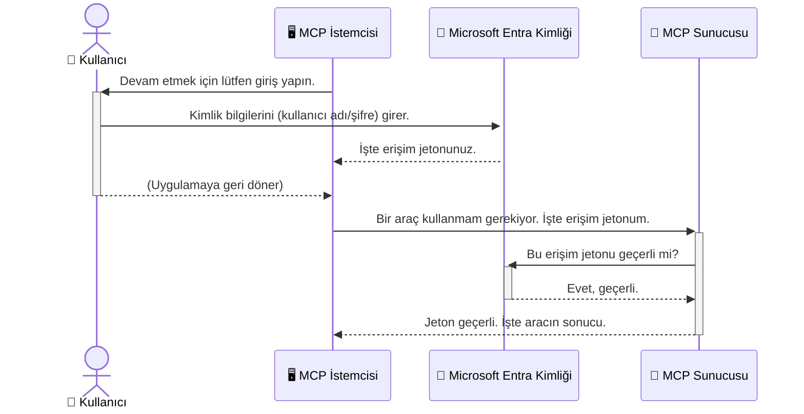

# Yapay Zeka İş Akışlarının Güvenliğini Sağlama: Model Context Protocol Sunucuları için Entra ID Doğrulaması

> [!NOTE]
> Bu derste uzaktaki sunucu kodu, eski `/sse` ve `/message` uç noktalarını korur
> ve MCP `2025-11-25` hedeflemektedir. Kimlik doğrulama ve belirteç doğrulama
> uygulamalarını koruyun, ancak yeni uygulamalar için `2026-07-28` uyumlu Streamable HTTP
> taşımasını kullanın.

## Giriş
Model Context Protocol (MCP) sunucunuzu güvence altına almak, evinizin ön kapısını kilitlemek kadar önemlidir. MCP sunucunuzu açık bırakmak, araçlarınızın ve verilerinizin yetkisiz erişime maruz kalmasına neden olur ve bu da güvenlik ihlallerine yol açabilir. Microsoft Entra ID, yalnızca yetkili kullanıcıların ve uygulamaların MCP sunucunuzla etkileşim kurmasını sağlamak için güçlü bulut tabanlı bir kimlik ve erişim yönetimi çözümü sunar. Bu bölümde, yapay zeka iş akışlarınızı Entra ID doğrulamasıyla nasıl koruyacağınızı öğreneceksiniz.

## Öğrenme Hedefleri
Bu bölümün sonunda şunları yapabileceksiniz:

- MCP sunucularını güvenli hale getirmenin önemini anlayın.
- Microsoft Entra ID ve OAuth 2.0 doğrulamasının temellerini açıklayın.
- Genel ve gizli istemciler arasındaki farkı tanıyın.
- Hem yerel (genel istemci) hem de uzak (gizli istemci) MCP sunucu senaryolarında Entra ID doğrulamasını uygulayın.
- Yapay zeka iş akışları geliştirirken güvenlik en iyi uygulamalarını uygulayın.

## Güvenlik ve MCP

Evinizin ön kapısını kilitlemediğiniz gibi, MCP sunucunuzu da herkesin erişimine açık bırakmamalısınız. Yapay zeka iş akışlarınızı güvence altına almak, sağlam, güvenilir ve güvenli uygulamalar oluşturmak için gereklidir. Bu bölümde, Microsoft Entra ID kullanarak MCP sunucularınızı güvenli hale getirmenize yardım edeceğiz; böylece yalnızca yetkili kullanıcılar ve uygulamalar araçlarınıza ve verilerinize erişebilecek.

## MCP Sunucuları için Güvenliğin Önemi

MCP sunucunuzun e-posta gönderme veya müşteri veritabanına erişim gibi bir aracı olduğunu hayal edin. Güvenli olmayan bir sunucu, herhangi birinin bu aracı kullanabileceği ve yetkisiz veri erişimine, spam’e veya diğer kötü niyetli faaliyetlere yol açabileceği anlamına gelir.

Doğrulama uygulayarak, sunucunuza yapılan her isteğin doğrulandığından emin olursunuz; bu, isteği yapan kullanıcı veya uygulamanın kimliğinin teyit edilmesi demektir. Bu, yapay zeka iş akışlarınızı güvenli hale getirmenin ilk ve en kritik adımıdır.

## Microsoft Entra ID’ye Giriş

[**Microsoft Entra ID**](https://adoption.microsoft.com/microsoft-security/entra/) bulut tabanlı bir kimlik ve erişim yönetimi hizmetidir. Bunu uygulamalarınız için evrensel bir güvenlik görevlisi gibi düşünün. Kullanıcı kimliklerini doğrulama (doğrulama) ve ne yapmalarına izin verileceğini belirleme (yetkilendirme) karmaşık sürecini yönetir.

Entra ID kullanarak aşağıdakileri yapabilirsiniz:

- Kullanıcılar için güvenli giriş sağlar.
- API'leri ve hizmetleri korur.
- Erişim politikalarını merkezi bir yerden yönetir.

MCP sunucuları için, Entra ID, kimlerin sunucunuzun özelliklerine erişebileceğini yönetmek için sağlam ve geniş çapta güvenilen bir çözüm sunar.

---

## Sihri Anlamak: Entra ID Doğrulaması Nasıl Çalışır

Entra ID, doğrulama işlemlerini yönetmek için **OAuth 2.0** gibi açık standartları kullanır. Detaylar karmaşık olabilir, ancak temel kavram basittir ve bir benzetme ile anlaşılabilir.

### OAuth 2.0’a Nazik Bir Giriş: Vale Anahtarı

OAuth 2.0’ı arabanız için bir vale servisi gibi düşünün. Bir restorana geldiğinizde, valeye anahtarınızı vermezsiniz. Bunun yerine, sınırlı izinlere sahip bir **vale anahtarı** verirsiniz; araba çalıştırabilir ve kapıları kilitleyebilir ama bagajı ya da torpido gözünü açamaz.

Bu benzetmede:

- **Siz** **Kullanıcı**'sınız.
- **Arabanız**, değerli araçları ve verileri olan **MCP Sunucusu**dur.
- **Vale** **Microsoft Entra ID**'dir.
- **Park Görevlisi**, sunucuya erişmeye çalışan **MCP İstemcisi** (uygulama)dir.
- **Vale Anahtarı** **Erişim Belirteci**dir.

Erişim belirteci, MCP istemcisinin Entra ID’den oturum açtıktan sonra aldığı güvenli bir metin dizisidir. İstemci bu belirteci her istekte MCP sunucusuna sunar. Sunucu, isteğin geçerli olduğunu ve istemcinin gerekli izinlere sahip olduğunu doğrulamak için belirteci doğrulayabilir; bu süreçte şifreniz gibi gerçek kimlik bilgilerinizi asla işlemesine gerek kalmaz.

### Doğrulama Akışı

İşte süreç uygulamada şöyle işler:



### Microsoft Authentication Library’yi (MSAL) Tanıyalım

Koda girmeden önce, örneklerde göreceğiniz önemli bir bileşeni tanıtmak önemli: **Microsoft Authentication Library (MSAL)**.

MSAL, Microsoft tarafından geliştirilen ve geliştiricilerin doğrulamayı çok daha kolay yönetmesini sağlayan bir kütüphanedir. Güvenlik belirteçlerini işlemek, oturum açmaları yönetmek ve oturum yenilemek için karmaşık kodu kendiniz yazmak yerine, MSAL bu zor işleri üstlenir.

MSAL gibi bir kütüphane kullanmak şiddetle tavsiye edilir çünkü:

- **Güvenlidir:** Endüstri standardı protokolleri ve güvenlik en iyi uygulamalarını uygular, böylece kodunuzdaki güvenlik açıklarını azaltır.
- **Geliştirmeyi Basitleştirir:** OAuth 2.0 ve OpenID Connect protokollerinin karmaşıklığını soyutlayarak uygulamanıza sadece birkaç satırla sağlam doğrulama eklemenizi sağlar.
- **Bakımı Yapılan:** Microsoft, yeni güvenlik tehditlerine ve platform değişikliklerine uyum sağlamak için MSAL’ı sürekli olarak günceller ve bakımını yapar.

MSAL, .NET, JavaScript/TypeScript, Python, Java, Go ve iOS ile Android gibi mobil platformları da destekleyen çeşitli diller ve uygulama çerçeveleri ile uyumludur. Bu, tüm teknoloji yığınınızda tutarlı doğrulama desenleri kullanabileceğiniz anlamına gelir.

MSAL hakkında daha fazla bilgi için, resmi [MSAL genel bakış dokümantasyonuna](https://learn.microsoft.com/entra/identity-platform/msal-overview) göz atabilirsiniz.

---

## MCP Sunucunuzu Entra ID ile Güvenceye Alma: Adım Adım Kılavuz

Şimdi, Entra ID kullanarak yerel bir MCP sunucusunu (`stdio` üzerinden iletişim kuran) nasıl güvenceye alacağımızı inceleyelim. Bu örnek, kullanıcı cihazında çalışan masaüstü uygulaması veya yerel geliştirme sunucusu gibi uygulamalar için uygun olan **genel istemci** kullanır.

### Senaryo 1: Yerel MCP Sunucusunu Güvenceye Alma (Genel İstemci ile)

Bu senaryoda, yerel çalışan, `stdio` üzerinden iletişim kuran ve kullanıcının kimliğini doğrulamak için Entra ID kullanan bir MCP sunucusuna bakacağız. Sunucu, Microsoft Graph API’den kullanıcının profil bilgisini alan tek bir araca sahip olacak.

#### 1. Entra ID’de Uygulamayı Ayarlama

Kod yazmaya başlamadan önce, uygulamanızı Microsoft Entra ID’de kaydetmeniz gerekir. Bu, Entra ID’ye uygulamanızı bildirir ve doğrulama servisini kullanma izni verir.

1. **[Microsoft Entra portalına](https://entra.microsoft.com/)** gidin.
2. **App registrations** bölümüne gidin ve **New registration**'a tıklayın.
3. Uygulamanıza bir ad verin (örn. "My Local MCP Server").
4. **Supported account types** için **Accounts in this organizational directory only** seçin.
5. Bu örnek için **Redirect URI** boş bırakılabilir.
6. **Register** butonuna tıklayın.

Kaydolduktan sonra, **Application (client) ID** ve **Directory (tenant) ID** bilgilerini not edin. Bunlara kodda ihtiyacınız olacak.

#### 2. Kod: Parçaların İncelenmesi

Doğrulamayı yöneten kodun kilit kısımlarına bakalım. Bu örneğin tam kodu, [mcp-auth-servers GitHub deposundaki](https://github.com/Azure-Samples/mcp-auth-servers) [Entra ID - Local - WAM](https://github.com/Azure-Samples/mcp-auth-servers/tree/main/src/entra-id-local-wam) klasöründe mevcuttur.

**`AuthenticationService.cs`**

Bu sınıf Entra ID ile etkileşim kurmaktan sorumludur.

- **`CreateAsync`**: Bu yöntem MSAL (Microsoft Authentication Library) içindeki `PublicClientApplication`'ı başlatır. Uygulamanızın `clientId` ve `tenantId` ile yapılandırılmıştır.
- **`WithBroker`**: Windows Web Account Manager gibi bir broker kullanımını etkinleştirir, bu da daha güvenli ve sorunsuz tek oturum açma deneyimi sağlar.
- **`AcquireTokenAsync`**: Bu temel yöntemdir. Öncelikle sessizce bir belirteç almaya çalışır (kullanıcının geçerli bir oturumu varsa tekrar oturum açması gerekmez). Sessiz belirteç alınamazsa, kullanıcıyı etkileşimli oturum açmaya zorlar.

```csharp
// Simplified for clarity
public static async Task<AuthenticationService> CreateAsync(ILogger<AuthenticationService> logger)
{
    var msalClient = PublicClientApplicationBuilder
        .Create(_clientId) // Your Application (client) ID
        .WithAuthority(AadAuthorityAudience.AzureAdMyOrg)
        .WithTenantId(_tenantId) // Your Directory (tenant) ID
        .WithBroker(new BrokerOptions(BrokerOptions.OperatingSystems.Windows))
        .Build();

    // ... cache registration ...

    return new AuthenticationService(logger, msalClient);
}

public async Task<string> AcquireTokenAsync()
{
    try
    {
        // Try silent authentication first
        var accounts = await _msalClient.GetAccountsAsync();
        var account = accounts.FirstOrDefault();

        AuthenticationResult? result = null;

        if (account != null)
        {
            result = await _msalClient.AcquireTokenSilent(_scopes, account).ExecuteAsync();
        }
        else
        {
            // If no account, or silent fails, go interactive
            result = await _msalClient.AcquireTokenInteractive(_scopes).ExecuteAsync();
        }

        return result.AccessToken;
    }
    catch (Exception ex)
    {
        _logger.LogError(ex, "An error occurred while acquiring the token.");
        throw; // Optionally rethrow the exception for higher-level handling
    }
}
```

**`Program.cs`**

MCP sunucusunun kurulduğu ve doğrulama servisinin entegre edildiği yerdir.

- **`AddSingleton<AuthenticationService>`**: Bu, `AuthenticationService`'i bağımlılık enjeksiyon konteynerine kaydeder, böylece uygulamanın diğer bölümleri (örneğin aracımız) tarafından kullanılabilir.
- **`GetUserDetailsFromGraph` aracı**: Bu araç bir `AuthenticationService` örneği gerektirir. Herhangi bir işlem yapmadan önce `authService.AcquireTokenAsync()` çağırarak geçerli bir erişim belirteci alır. Doğrulama başarılıysa, bu belirteci kullanarak Microsoft Graph API'sini çağırır ve kullanıcının bilgilerini alır.

```csharp
// Simplified for clarity
[McpServerTool(Name = "GetUserDetailsFromGraph")]
public static async Task<string> GetUserDetailsFromGraph(
    AuthenticationService authService)
{
    try
    {
        // This will trigger the authentication flow
        var accessToken = await authService.AcquireTokenAsync();

        // Use the token to create a GraphServiceClient
        var graphClient = new GraphServiceClient(
            new BaseBearerTokenAuthenticationProvider(new TokenProvider(authService)));

        var user = await graphClient.Me.GetAsync();

        return System.Text.Json.JsonSerializer.Serialize(user);
    }
    catch (Exception ex)
    {
        return $"Error: {ex.Message}";
    }
}
```

#### 3. Hepsi Birlikte Nasıl Çalışır

1. MCP istemcisi `GetUserDetailsFromGraph` aracını kullanmaya çalıştığında, araç önce `AcquireTokenAsync`'i çağırır.
2. `AcquireTokenAsync`, geçerli bir belirteç olup olmadığını kontrol etmek için MSAL kütüphanesini tetikler.
3. Belirteç bulunmazsa, MSAL broker aracılığıyla kullanıcıyı Entra ID hesabıyla oturum açmaya yönlendirir.
4. Kullanıcı oturum açtıktan sonra, Entra ID bir erişim belirteci verir.
5. Araç belirteci alır ve Microsoft Graph API'ye güvenli çağrı yapmak için kullanır.
6. Kullanıcı bilgileri MCP istemcisine döner.

Bu süreç, yalnızca doğrulanmış kullanıcıların aracı kullanabilmesini sağlar ve böylece yerel MCP sunucunuzu etkin şekilde güvence altına alır.

### Senaryo 2: Uzak MCP Sunucusunu Güvenceye Alma (Gizli İstemci ile)

MCP sunucunuz uzak bir makinede (örneğin bulut sunucusu) çalışıyorsa ve HTTP Streaming gibi bir protokol üzerinden iletişim kuruyorsa, güvenlik gereksinimleri farklıdır. Bu durumda **gizli istemci** ve **Yetkilendirme Kodu Akışı** kullanmalısınız. Bu daha güvenli bir yöntemdir çünkü uygulamanın gizli bilgileri asla tarayıcıya açığa çıkmaz.

Bu örnek, HTTP isteklerini yönetmek için Express.js kullanan TypeScript tabanlı bir MCP sunucusudur.

#### 1. Entra ID’de Uygulamayı Ayarlama

Entra ID ayarları genel istemciye benzer, ancak önemli bir fark vardır: **istemci gizlisi** oluşturmanız gerekir.

1. **[Microsoft Entra portalına](https://entra.microsoft.com/)** gidin.
2. Uygulama kaydınızda **Certificates & secrets** sekmesine gidin.
3. **New client secret** butonuna tıklayın, açıklama ekleyin ve **Add**'a basın.
4. **Önemli:** Gizli değerini hemen kopyalayın. Daha sonra tekrar göremeyeceksiniz.
5. Ayrıca **Redirect URI**’yi yapılandırmanız gerekir. **Authentication** sekmesine gidin, **Add a platform**a tıklayın, **Web**'i seçin ve uygulamanız için yönlendirme URI’sını girin (örn. `http://localhost:3001/auth/callback`).

> **⚠️ Önemli Güvenlik Notu:** Üretim uygulamaları için Microsoft, istemci gizli bilgileri yerine **Yönetilen Kimlik** veya **İş Yükü Kimlik Federasyonu** gibi **gizlisiz kimlik doğrulama** yöntemlerini kullanmayı şiddetle tavsiye eder. İstemci gizli anahtarları maruz kalabilir veya ele geçirilebilir. Yönetilen kimlikler, kimlik bilgilerinin kodda veya yapılandırmada saklanmasını ortadan kaldırarak daha güvenli bir yaklaşım sağlar.
>
> Yönetilen kimlikler ve bunların nasıl uygulanacağı hakkında daha fazla bilgi için bkz. [Azure kaynakları için yönetilen kimlik genel bakışı](https://learn.microsoft.com/entra/identity/managed-identities-azure-resources/overview).

#### 2. Kod: Parçaların İncelenmesi

Bu örnek oturum tabanlıdır. Kullanıcı doğrulandıktan sonra, sunucu erişim belirtecini ve yenileme belirtecini oturumda saklar ve kullanıcıya bir oturum belirteci verir. Bu oturum belirteci sonraki isteklerde kullanılır. Bu örneğin tam kodu, [mcp-auth-servers GitHub deposunun](https://github.com/Azure-Samples/mcp-auth-servers) [Entra ID - Confidential client](https://github.com/Azure-Samples/mcp-auth-servers/tree/main/src/entra-id-cca-session) klasöründe mevcuttur.

**`Server.ts`**

Bu dosya Express sunucusunu ve MCP taşıma katmanını ayarlar.

- **`requireBearerAuth`**: Bu, `/sse` ve `/message` uç noktalarını koruyan bir ara yazılımdır. İsteklerin `Authorization` başlığındaki geçerli bir bearer belirteci olup olmadığını denetler.
- **`EntraIdServerAuthProvider`**: `McpServerAuthorizationProvider` arayüzünü uygulayan özel bir sınıftır. OAuth 2.0 akışını yönetir.
- **`/auth/callback`**: Kullanıcının doğrulandıktan sonra Entra ID’den yönlendirmesini işleyen uç noktadır. Yetkilendirme kodunu erişim belirteci ve yenileme belirteci ile değiştirir.

```typescript
// Anlaşılırlık için basitleştirildi
const app = express();
const { server } = createServer();
const provider = new EntraIdServerAuthProvider();

// SSE uç noktasını koruyun
app.get("/sse", requireBearerAuth({
  provider,
  requiredScopes: ["User.Read"]
}), async (req, res) => {
  // ... taşıyıcıya bağlan ...
});

// Mesaj uç noktasını koruyun
app.post("/message", requireBearerAuth({
  provider,
  requiredScopes: ["User.Read"]
}), async (req, res) => {
  // ... mesajı işle ...
});

// OAuth 2.0 geri çağırmasını işle
app.get("/auth/callback", (req, res) => {
  provider.handleCallback(req.query.code, req.query.state)
    .then(result => {
      // ... başarı veya hatayı işle ...
    });
});
```

**`Tools.ts`**

Bu dosya MCP sunucusunun sağladığı araçları tanımlar. `getUserDetails` aracı, önceki örnektekine benzer, ancak erişim belirtecini oturumdan alır.

```typescript
// Anlaşılırlık için basitleştirildi
server.setRequestHandler(CallToolRequestSchema, async (request) => {
  const { name } = request.params;
  const context = request.params?.context as { token?: string } | undefined;
  const sessionToken = context?.token;

  if (name === ToolName.GET_USER_DETAILS) {
    if (!sessionToken) {
      throw new AuthenticationError("Authentication token is missing or invalid. Ensure the token is provided in the request context.");
    }

    // Entra ID belirtecini oturum deposundan alın
    const tokenData = tokenStore.getToken(sessionToken);
    const entraIdToken = tokenData.accessToken;

    const graphClient = Client.init({
      authProvider: (done) => {
        done(null, entraIdToken);
      }
    });

    const user = await graphClient.api('/me').get();

    // ... kullanıcı detaylarını döndür ...
  }
});
```

**`auth/EntraIdServerAuthProvider.ts`**

Bu sınıf şu mantığı yönetir:

- Kullanıcıyı Entra ID oturum açma sayfasına yönlendirme.
- Yetkilendirme kodunu erişim belirteci ile değiştirme.
- Belirteçleri `tokenStore` içinde saklama.
- Erişim belirtecinin süresi dolduğunda yenileme.


#### 3. Bunlar Nasıl Bir Arada Çalışır

1. Bir kullanıcı ilk kez MCP sunucusuna bağlanmaya çalıştığında, `requireBearerAuth` ara yazılımı geçerli bir oturumu olmadığını görür ve kullanıcıyı Entra ID giriş sayfasına yönlendirir.
2. Kullanıcı Entra ID hesabı ile giriş yapar.
3. Entra ID kullanıcıyı bir yetkilendirme kodu ile `/auth/callback` uç noktasına geri yönlendirir.
4. Sunucu kodu erişim belirteci ve yenileme belirteci ile değiştirir, bunları depolar ve istemciye gönderilen bir oturum belirteci oluşturur.
5. İstemci artık MCP sunucusuna yapılacak tüm gelecekteki isteklere `Authorization` başlığında bu oturum belirtecini kullanabilir.
6. `getUserDetails` aracı çağrıldığında, oturum belirtecini kullanarak Entra ID erişim belirtecini bulur ve bunu Microsoft Graph API çağrısı için kullanır.

Bu akış genel istemci akışından daha karmaşıktır, ancak internet üzerinden erişilen uç noktalar için gereklidir. Uzaktaki MCP sunucuları genel internet üzerinden erişilebilir olduğundan, yetkisiz erişim ve potansiyel saldırılara karşı koruma için daha güçlü güvenlik önlemleri gerektirir.


## Güvenlik En İyi Uygulamaları

- **Her zaman HTTPS kullanın**: İstemci ile sunucu arasındaki iletişimi şifreleyerek belirteçlerin ele geçirilmesini önleyin.
- **Rol Tabanlı Erişim Kontrolü (RBAC) uygulayın**: Sadece bir kullanıcının kimlik doğrulaması yapılıp yapılmadığını kontrol etmeyin; neye yetkili olduğunu da kontrol edin. Entra ID’de roller tanımlayabilir ve bunları MCP sunucunuzda kontrol edebilirsiniz.
- **İzleme ve denetleme yapın**: Şüpheli etkinliği tespit etmek ve yanıt vermek için tüm kimlik doğrulama etkinliklerini kaydedin.
- **Oran sınırlama ve kısıtlama yönetin**: Microsoft Graph ve diğer API'ler kötüye kullanımı önlemek için oran sınırlaması uygular. MCP sunucunuzda HTTP 429 (Çok Fazla İstek) yanıtlarını nazikçe yönetmek için üstel geri çekilme ve yeniden deneme mantığı uygulayın. Sık erişilen verileri önbelleğe almayı düşünün.
- **Belirteçleri güvenli şekilde depolayın**: Erişim belirteçlerini ve yenileme belirteçlerini güvenli şekilde saklayın. Yerel uygulamalar için sistemin güvenli depolama mekanizmalarını kullanın. Sunucu uygulamaları için şifreli depolama veya Azure Key Vault gibi güvenli anahtar yönetimi hizmetlerini değerlendirin.
- **Belirteç süresinin sonu yönetimi**: Erişim belirteçlerinin sınırlı bir ömrü vardır. Yenileme belirteçlerini kullanarak otomatik belirteç yenileme uygulayarak sorunsuz kullanıcı deneyimi sağlayın ve yeniden kimlik doğrulama gerektirmeyin.
- **Azure API Management kullanmayı düşünün**: Güvenliği doğrudan MCP sunucunuza uygulamak size ayrıntılı kontrol sağlasa da, Azure API Management gibi API Ağ Geçitleri kimlik doğrulama, yetkilendirme, oran sınırlaması ve izleme gibi birçok güvenlik endişesini otomatik olarak yönetebilir. Bu, istemcileriniz ile MCP sunucularınız arasında merkezi bir güvenlik katmanı sağlar. MCP ile API Ağ Geçitlerinin kullanımı hakkında daha detaylı bilgi için bkz. [Azure API Management Your Auth Gateway For MCP Servers](https://techcommunity.microsoft.com/blog/integrationsonazureblog/azure-api-management-your-auth-gateway-for-mcp-servers/4402690).


## Temel Çıkarımlar

- MCP sunucunuzu korumak verilerinizi ve araçlarınızı korumak için çok önemlidir.
- Microsoft Entra ID kimlik doğrulama ve yetkilendirme için güçlü ve ölçeklenebilir bir çözüm sunar.
- Yerel uygulamalar için **genel istemci**, uzak sunucular için ise **gizli istemci** kullanın.
- **Yetkilendirme Kodu Akışı**, web uygulamaları için en güvenli seçenektir.


## Alıştırma

1. İnşa edebileceğiniz bir MCP sunucusunu düşünün. Yerel bir sunucu mu, yoksa uzak bir sunucu mu olur?
2. Cevabınıza göre genel istemci mi gizli istemci mi kullanırsınız?
3. Microsoft Graph’a karşı eylemler gerçekleştirmek için MCP sunucunuz hangi izinleri talep eder?


## Uygulamalı Alıştırmalar

### Alıştırma 1: Entra ID’de Uygulama Kaydı
Microsoft Entra portalına gidin.
MCP sunucunuz için yeni bir uygulama kaydedin.
Uygulama (istemci) Kimliği ve Dizin (kiracı) Kimliğini not edin.

### Alıştırma 2: Yerel MCP Sunucusu Güvenliği (Genel İstemci)
- Kullanıcı kimlik doğrulaması için MSAL (Microsoft Authentication Library) entegrasyonunu kod örneğini takip ederek uygulayın.
- Microsoft Graph'tan kullanıcı ayrıntılarını alan MCP aracını çağırarak kimlik doğrulama akışını test edin.

### Alıştırma 3: Uzaktan MCP Sunucusu Güvenliği (Gizli İstemci)
- Entra ID’de gizli istemci kaydedin ve bir istemci sırrı oluşturun.
- Express.js MCP sunucunuzu Yetkilendirme Kodu Akışını kullanacak şekilde yapılandırın.
- Korunan uç noktaları test edin ve belirteç tabanlı erişimi doğrulayın.

### Alıştırma 4: Güvenlik En İyi Uygulamalarını Uygulayın
- Yerel veya uzak sunucunuz için HTTPS’i etkinleştirin.
- Sunucu mantığınızda rol tabanlı erişim kontrolü (RBAC) uygulayın.
- Belirteç süresinin sonu yönetimi ve güvenli belirteç depolama ekleyin.

## Kaynaklar

1. **MSAL Genel Bakış Dokümantasyonu**  
   Microsoft Authentication Library (MSAL)’ın farklı platformlarda güvenli belirteç edinimini nasıl sağladığını öğrenin:  
   [Microsoft Learn'da MSAL Genel Bakış](https://learn.microsoft.com/en-gb/entra/msal/overview)

2. **Azure-Samples/mcp-auth-servers GitHub Deposu**  
   Kimlik doğrulama akışlarını gösteren MCP sunucu referans uygulamaları:  
   [Azure-Samples/mcp-auth-servers GitHub’da](https://github.com/Azure-Samples/mcp-auth-servers)

3. **Azure Kaynakları için Yönetilen Kimlikler Genel Bakış**  
   Sistem ya da kullanıcıya atanmış yönetilen kimlikleri kullanarak gizli bilgileri ortadan kaldırmayı anlayın:  
   [Microsoft Learn'da Yönetilen Kimlikler Genel Bakış](https://learn.microsoft.com/en-us/entra/identity/managed-identities-azure-resources/)

4. **Azure API Management: MCP Sunucuları için Kimlik Doğrulama Geçidiniz**  
   MCP sunucuları için güvenli OAuth2 geçidi olarak APIM'in kullanımı hakkında derinlemesine bilgi:  
   [Azure API Management Your Auth Gateway For MCP Servers](https://techcommunity.microsoft.com/blog/integrationsonazureblog/azure-api-management-your-auth-gateway-for-mcp-servers/4402690)

5. **Microsoft Graph İzinleri Referansı**  
   Microsoft Graph için temsil edilen ve uygulama izinlerinin kapsamlı listesi:  
   [Microsoft Graph İzinleri Referansı](https://learn.microsoft.com/zh-tw/graph/permissions-reference)


## Öğrenme Çıktıları
Bu bölümü tamamladıktan sonra şunları yapabileceksiniz:

- MCP sunucuları ve AI iş akışları için neden kimlik doğrulamanın kritik olduğunu açıklamak.
- Hem yerel hem uzak MCP sunucu senaryoları için Entra ID kimlik doğrulamasını kurmak ve yapılandırmak.
- Sunucunuzun dağıtımına göre uygun istemci türünü (genel veya gizli) seçmek.
- Belirteç depolama ve rol tabanlı yetkilendirme dahil güvenli kodlama uygulamalarını hayata geçirmek.
- MCP sunucunuzu ve araçlarını yetkisiz erişimden güvenle korumak.

## Sıradakiler 

- [5.13 Model Context Protocol (MCP) Microsoft Foundry ile Entegrasyonu](../mcp-foundry-agent-integration/README.md)

---

<!-- CO-OP TRANSLATOR DISCLAIMER START -->
**Feragatname**:
Bu belge, AI çeviri hizmeti [Co-op Translator](https://github.com/Azure/co-op-translator) kullanılarak çevrilmiştir. Doğruluk için çaba sarf etsek de, otomatik çevirilerin hata veya yanlışlık içerebileceğini lütfen unutmayınız. Orijinal belge, kendi dilinde yetkili kaynak olarak kabul edilmelidir. Kritik bilgiler için profesyonel insan çevirisi önerilir. Bu çevirinin kullanımı sonucu ortaya çıkabilecek yanlış anlamalardan veya yanlış yorumlamalardan sorumlu değiliz.
<!-- CO-OP TRANSLATOR DISCLAIMER END -->