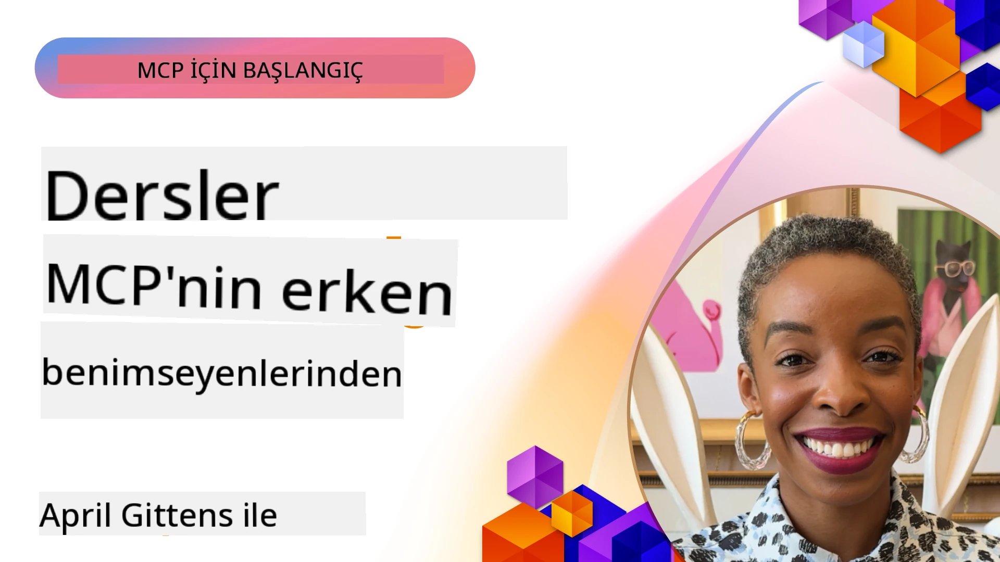

# 🌟 Erken Benimseyenlerden Dersler

[](https://youtu.be/jds7dSmNptE)

_(Bu dersin videosunu görüntülemek için yukarıdaki resme tıklayın)_

## 🎯 Bu Modül Neleri Kapsar

Bu modül, gerçek organizasyonların ve geliştiricilerin Model Context Protocol (MCP)'ü nasıl kullanarak gerçek dünya sorunlarını çözdüklerini ve inovasyonu nasıl desteklediklerini inceler. Detaylı vaka incelemeleri, uygulamalı projeler ve pratik örnekler aracılığıyla, MCP'nin dil modellerini, araçları ve kurumsal verileri güvenli ve ölçeklenebilir şekilde bağlayan AI entegrasyonunu nasıl sağladığını keşfedeceksiniz.

### 📚 MCP'yi Uygulamada Görmek

Bu prensiplerin üretime hazır araçlara nasıl uygulandığını görmek ister misiniz? Bugün kullanabileceğiniz gerçek Microsoft MCP sunucularını gösteren [**Geliştirici Verimliliğini Dönüştüren 10 Microsoft MCP Sunucusu**](microsoft-mcp-servers.md) rehberimize göz atın.

## Genel Bakış

Bu ders, erken benimseyenlerin Model Context Protocol (MCP)'ü nasıl kullanarak sektörler arası gerçek dünya zorluklarını çözdüğünü ve inovasyonu desteklediğini inceler. Detaylı vaka çalışmaları ve uygulamalı projelerle, MCP'nin büyük dil modelleri, araçlar ve kurumsal verileri standart, güvenli ve ölçeklenebilir bir çerçevede nasıl bağladığını göreceksiniz. MCP tabanlı çözümler tasarlama ve inşa etme deneyimi kazanacak, kanıtlanmış uygulama kalıplarından öğrenecek ve üretim ortamlarında MCP'nin dağıtımı için en iyi uygulamaları keşfedeceksiniz. Ders ayrıca ortaya çıkan eğilimleri, gelecekteki yönleri ve MCP teknolojisi ile gelişen ekosisteminde en ileri seviyede kalmanıza yardımcı olacak açık kaynak kaynaklarını vurgular.

## Öğrenme Hedefleri

- Farklı sektörlerdeki gerçek dünya MCP uygulamalarını analiz etmek
- Tamamlanmış MCP tabanlı uygulamalar tasarlamak ve geliştirmek
- MCP teknolojisindeki ortaya çıkan eğilimleri ve gelecekteki yönleri keşfetmek
- Gerçek geliştirme senaryolarında en iyi uygulamaları uygulamak

## Gerçek Dünya MCP Uygulamaları

### Vaka Çalışması 1: Kurumsal Müşteri Destek Otomasyonu

Çok uluslu bir şirket, müşteri destek sistemlerinde AI etkileşimlerini standartlaştırmak için MCP tabanlı bir çözüm uyguladı. Bu sayede:

- Birden fazla LLM sağlayıcısı için birleşik bir arayüz oluşturdu
- Departmanlar arasında tutarlı istem yönetimi sağladı
- Güçlü güvenlik ve uyum kontrolleri uyguladı
- Özel ihtiyaçlara göre farklı AI modelleri arasında kolayca geçiş yapabildi

**Teknik Uygulama:**

```python
# Müşteri desteği için Python MCP sunucu uygulaması
import logging
import asyncio
from modelcontextprotocol import create_server, ServerConfig
from modelcontextprotocol.server import MCPServer
from modelcontextprotocol.transports import create_http_transport
from modelcontextprotocol.resources import ResourceDefinition
from modelcontextprotocol.prompts import PromptDefinition
from modelcontextprotocol.tool import ToolDefinition

# Günlük kaydını yapılandır
logging.basicConfig(level=logging.INFO)

async def main():
    # Sunucu yapılandırması oluştur
    config = ServerConfig(
        name="Enterprise Customer Support Server",
        version="1.0.0",
        description="MCP server for handling customer support inquiries"
    )
    
    # MCP sunucusunu başlat
    server = create_server(config)
    
    # Bilgi tabanı kaynaklarını kaydet
    server.resources.register(
        ResourceDefinition(
            name="customer_kb",
            description="Customer knowledge base documentation"
        ),
        lambda params: get_customer_documentation(params)
    )
    
    # İstem şablonlarını kaydet
    server.prompts.register(
        PromptDefinition(
            name="support_template",
            description="Templates for customer support responses"
        ),
        lambda params: get_support_templates(params)
    )
    
    # Destek araçlarını kaydet
    server.tools.register(
        ToolDefinition(
            name="ticketing",
            description="Create and update support tickets"
        ),
        handle_ticketing_operations
    )
    
    # HTTP taşıma ile sunucuyu başlat
    transport = create_http_transport(port=8080)
    await server.run(transport)

if __name__ == "__main__":
    asyncio.run(main())
```

**Sonuçlar:** Model maliyetlerinde %30 azalma, yanıt tutarlığında %45 iyileşme ve küresel operasyonlarda geliştirilmiş uyum.

### Vaka Çalışması 2: Sağlık Hizmetlerinde Tanısal Asistan

Bir sağlık sağlayıcısı, birden fazla uzmanlaşmış tıbbi AI modelini entegre etmek ve hassas hasta verilerinin korunmasını sağlamak için MCP altyapısı geliştirdi:

- Genel uzman ve özel tıbbi modeller arasında sorunsuz geçiş
- Sıkı gizlilik kontrolleri ve denetim kayıtları
- Mevcut Elektronik Sağlık Kayıtları (EHR) sistemleriyle entegrasyon
- Tıbbi terminoloji için tutarlı istem mühendisliği

**Teknik Uygulama:**

```csharp
// C# MCP host application implementation in healthcare application
using Microsoft.Extensions.DependencyInjection;
using ModelContextProtocol.SDK.Client;
using ModelContextProtocol.SDK.Security;
using ModelContextProtocol.SDK.Resources;

public class DiagnosticAssistant
{
    private readonly MCPHostClient _mcpClient;
    private readonly PatientContext _patientContext;
    
    public DiagnosticAssistant(PatientContext patientContext)
    {
        _patientContext = patientContext;
        
        // Configure MCP client with healthcare-specific settings
        var clientOptions = new ClientOptions
        {
            Name = "Healthcare Diagnostic Assistant",
            Version = "1.0.0",
            Security = new SecurityOptions
            {
                Encryption = EncryptionLevel.Medical,
                AuditEnabled = true
            }
        };
        
        _mcpClient = new MCPHostClientBuilder()
            .WithOptions(clientOptions)
            .WithTransport(new HttpTransport("https://healthcare-mcp.example.org"))
            .WithAuthentication(new HIPAACompliantAuthProvider())
            .Build();
    }
    
    public async Task<DiagnosticSuggestion> GetDiagnosticAssistance(
        string symptoms, string patientHistory)
    {
        // Create request with appropriate resources and tool access
        var resourceRequest = new ResourceRequest
        {
            Name = "patient_records",
            Parameters = new Dictionary<string, object>
            {
                ["patientId"] = _patientContext.PatientId,
                ["requestingProvider"] = _patientContext.ProviderId
            }
        };
        
        // Request diagnostic assistance using appropriate prompt
        var response = await _mcpClient.SendPromptRequestAsync(
            promptName: "diagnostic_assistance",
            parameters: new Dictionary<string, object>
            {
                ["symptoms"] = symptoms,
                patientHistory = patientHistory,
                relevantGuidelines = _patientContext.GetRelevantGuidelines()
            });
            
        return DiagnosticSuggestion.FromMCPResponse(response);
    }
}
```

**Sonuçlar:** Doktorlar için geliştirilmiş tanısal öneriler, tam HIPAA uyumu ve sistemler arası bağlam değişimlerinde önemli azalma.

### Vaka Çalışması 3: Finansal Hizmetlerde Risk Analizi

Bir finans kuruluşu, farklı departmanlarda risk analiz süreçlerini standartlaştırmak için MCP kullandı:

- Kredi riski, dolandırıcılık tespiti ve yatırım riski modelleri için birleşik bir arayüz oluşturdu
- Sıkı erişim kontrolleri ve model versiyonlaması uyguladı
- Tüm AI önerilerinin denetlenebilirliğini sağladı
- Farklı sistemler arasında tutarlı veri formatlaması sağladı

**Teknik Uygulama:**

```java
// Finansal risk değerlendirmesi için Java MCP sunucusu
import org.mcp.server.*;
import org.mcp.security.*;

public class FinancialRiskMCPServer {
    public static void main(String[] args) {
        // Finansal uyumluluk özellikleri ile MCP sunucusu oluşturun
        MCPServer server = new MCPServerBuilder()
            .withModelProviders(
                new ModelProvider("risk-assessment-primary", new AzureOpenAIProvider()),
                new ModelProvider("risk-assessment-audit", new LocalLlamaProvider())
            )
            .withPromptTemplateDirectory("./compliance/templates")
            .withAccessControls(new SOCCompliantAccessControl())
            .withDataEncryption(EncryptionStandard.FINANCIAL_GRADE)
            .withVersionControl(true)
            .withAuditLogging(new DatabaseAuditLogger())
            .build();
            
        server.addRequestValidator(new FinancialDataValidator());
        server.addResponseFilter(new PII_RedactionFilter());
        
        server.start(9000);
        
        System.out.println("Financial Risk MCP Server running on port 9000");
    }
}
```

**Sonuçlar:** Geliştirilmiş düzenleyici uyum, %40 daha hızlı model dağıtım döngüleri ve departmanlar arasında iyileştirilmiş risk değerlendirme tutarlılığı.

### Vaka Çalışması 4: Microsoft Playwright MCP Sunucusu ile Tarayıcı Otomasyonu

Microsoft, Model Context Protocol aracılığıyla güvenli ve standartlaştırılmış tarayıcı otomasyonu sağlamak için [Playwright MCP sunucusunu](https://github.com/microsoft/playwright-mcp) geliştirdi. Bu üretime hazır sunucu, AI ajanlarının ve LLM'lerin web tarayıcıları ile kontrollü, denetlenebilir ve genişletilebilir şekilde etkileşime girmesine olanak tanır; otomatik web testi, veri çıkarımı ve uçtan uca iş akışları gibi kullanım senaryoları için idealdir.

> **🎯 Üretime Hazır Araç**
> 
> Bu vaka çalışması, bugün kullanabileceğiniz gerçek bir MCP sunucusunu gösteriyor! Playwright MCP Sunucusu ve diğer 9 üretime hazır Microsoft MCP sunucusu hakkında daha fazla bilgi için [**Microsoft MCP Sunucuları Rehberi**](microsoft-mcp-servers.md#8--playwright-mcp-server) bölümüne bakabilirsiniz.

**Ana Özellikler:**
- Tarayıcı otomasyonu yeteneklerini (navigasyon, form doldurma, ekran görüntüsü alma vb.) MCP araçları olarak sunar
- Yetkisiz işlemleri önlemek için sıkı erişim kontrolleri ve sandbox uygulaması
- Tüm tarayıcı etkileşimleri için ayrıntılı denetim kayıtları
- Ajan odaklı otomasyon için Azure OpenAI ve diğer LLM sağlayıcılarla entegrasyon desteği
- GitHub Copilot'un Kodlama Ajanına web tarama yetenekleri kazandırır

**Teknik Uygulama:**

```typescript
// TypeScript: MCP sunucusunda Playwright tarayıcı otomasyon araçlarını kaydetme
import { createServer, ToolDefinition } from 'modelcontextprotocol';
import { launch } from 'playwright';

const server = createServer({
  name: 'Playwright MCP Server',
  version: '1.0.0',
  description: 'MCP server for browser automation using Playwright'
});

// Bir URL'ye gezinmek ve ekran görüntüsü yakalamak için bir araç kaydedin
server.tools.register(
  new ToolDefinition({
    name: 'navigate_and_screenshot',
    description: 'Navigate to a URL and capture a screenshot',
    parameters: {
      url: { type: 'string', description: 'The URL to visit' }
    }
  }),
  async ({ url }) => {
    const browser = await launch();
    const page = await browser.newPage();
    await page.goto(url);
    const screenshot = await page.screenshot();
    await browser.close();
    return { screenshot };
  }
);

// MCP sunucusunu başlat
server.listen(8080);
```

**Sonuçlar:**

- AI ajanları ve LLM'ler için güvenli, programlı tarayıcı otomasyonu sağlandı
- Manuel test çabaları azaltıldı ve web uygulamaları için test kapsamı artırıldı
- Kurumsal ortamlarda tarayıcı tabanlı araç entegrasyonu için yeniden kullanılabilir ve genişletilebilir bir çerçeve sağlandı
- GitHub Copilot'un web tarama yeteneklerini güçlendirdi

**Referanslar:**

- [Playwright MCP Sunucu GitHub Deposu](https://github.com/microsoft/playwright-mcp)
- [Microsoft AI ve Otomasyon Çözümleri](https://azure.microsoft.com/en-us/products/ai-services/)

### Vaka Çalışması 5: Azure MCP – Kurumsal Düzeyde Model Context Protocol Hizmeti

Azure MCP Sunucusu ([https://aka.ms/azmcp](https://aka.ms/azmcp)), Model Context Protocol'ün Microsoft tarafından yönetilen, kurumsal düzeyde bir uygulamasıdır. Ölçeklenebilir, güvenli ve uyumlu MCP sunucu yeteneklerini bulut hizmeti olarak sunar. Azure MCP, organizasyonların MCP sunucularını hızlıca dağıtmasını, yönetmesini ve Azure AI, veri ve güvenlik hizmetleri ile entegre etmesini sağlar; operasyonel yükü azaltır ve AI benimsenmesini hızlandırır.

> **🎯 Üretime Hazır Araç**
> 
> Bu, bugün kullanabileceğiniz gerçek bir MCP sunucusudur! Microsoft Foundry MCP Sunucusu hakkında daha fazla bilgi için [**Microsoft MCP Sunucuları Rehberi**](microsoft-mcp-servers.md) bölümüne göz atabilirsiniz.


- Yerleşik ölçekleme, izleme ve güvenlik ile tamamen yönetilen MCP sunucu barındırma
- Azure OpenAI, Azure AI Search ve diğer Azure hizmetleri ile doğal entegrasyon
- Microsoft Entra ID üzerinden kurumsal kimlik doğrulama ve yetkilendirme
- Özel araçlar, istem şablonları ve kaynak bağlayıcılar desteği
- Kurumsal güvenlik ve düzenleyici gereksinimlere uyumluluk

**Teknik Uygulama:**

```yaml
# Example: Azure MCP server deployment configuration (YAML)
apiVersion: mcp.microsoft.com/v1
kind: McpServer
metadata:
  name: enterprise-mcp-server
spec:
  modelProviders:
    - name: azure-openai
      type: AzureOpenAI
      endpoint: https://<your-openai-resource>.openai.azure.com/
      apiKeySecret: <your-azure-keyvault-secret>
  tools:
    - name: document_search
      type: AzureAISearch
      endpoint: https://<your-search-resource>.search.windows.net/
      apiKeySecret: <your-azure-keyvault-secret>
  authentication:
    type: EntraID
    tenantId: <your-tenant-id>
  monitoring:
    enabled: true
    logAnalyticsWorkspace: <your-log-analytics-id>
```

**Sonuçlar:**  
- Kullanıma hazır, uyumlu bir MCP sunucu platformu ile kurumsal AI projelerinde değer elde etme süresi azaltıldı
- LLM'ler, araçlar ve kurumsal veri kaynaklarının entegrasyonu basitleştirildi
- MCP iş yükleri için gelişmiş güvenlik, gözlemlenebilirlik ve operasyonel verimlilik sağlandı
- Azure SDK en iyi uygulamaları ve güncel kimlik doğrulama kalıpları ile geliştirilmiş kod kalitesi

**Referanslar:**  
- [Azure MCP Dokümantasyonu](https://aka.ms/azmcp)
- [Azure MCP Sunucu GitHub Deposu](https://github.com/Azure/azure-mcp)
- [Azure AI Servisleri](https://azure.microsoft.com/en-us/products/ai-services/)
- [Microsoft MCP Merkezi](https://mcp.azure.com)

## Vaka Çalışması 6: NLWeb
MCP (Model Context Protocol), chatbotlar ve AI asistanlarının araçlarla etkileşime girmesi için gelişmekte olan bir protokoldür. Her NLWeb örneği ayrıca bir MCP sunucusudur ve bir web sitesine doğal dilde soru sormak için kullanılan ask adlı bir ana yöntemi destekler. Dönen yanıt, web verilerini tanımlamak için yaygın kullanılan bir sözlük olan schema.org'u kullanır. Kabaca söylemek gerekirse, MCP, NLWeb'in HTML'ye karşı HTTP olduğu gibidir. NLWeb, protokolleri, Schema.org formatlarını ve örnek kodu birleştirerek sitelerin bu uç noktaları hızla oluşturmasına yardımcı olur; hem insanlar için konuşma arayüzleri hem de makineler için doğal ajanlar arası etkileşim sağlar.

NLWeb'in iki ayrı bileşeni vardır.
- Bir site ile doğal dilde arayüz kurmak için çok basit bir protokol ve dönen yanıt için json ve schema.org kullanan bir format. Daha fazla ayrıntı için REST API dokümantasyonuna bakınız.
- Varlık listeleri (ürünler, tarifler, gezilecek yerler, yorumlar vb.) olarak soyutlanabilen siteler için mevcut işaretlemeleri kullanan (1)'in basit bir uygulaması. Bir dizi kullanıcı arayüzü bileşeni ile siteler içeriklerine kolayca konuşma arayüzleri sağlayabilir. İşleyişi hakkında ayrıntılar için Life of a chat query dokümantasyonuna bakınız.
 
**Referanslar:**  
- [Azure MCP Dokümantasyonu](https://aka.ms/azmcp)
- [NLWeb](https://github.com/microsoft/NlWeb)

### Vaka Çalışması 7: Microsoft Foundry MCP Sunucusu – Kurumsal AI Ajan Entegrasyonu

Microsoft Foundry MCP sunucuları, MCP'nin kurumsal ortamlarda AI ajanları ve iş akışları koordine etmek ve yönetmek için nasıl kullanılabileceğini gösterir. MCP'yi Microsoft Foundry ile entegre ederek, organizasyonlar ajan etkileşimlerini standartlaştırabilir, Foundry'nin iş akışı yönetimini kullanabilir ve güvenli, ölçeklenebilir dağıtımları garanti altına alabilir.

> **🎯 Üretime Hazır Araç**
> 
> Bu, bugün kullanabileceğiniz gerçek bir MCP sunucusudur! Microsoft Foundry MCP Sunucusu hakkında daha fazla bilgi için [**Microsoft MCP Sunucuları Rehberi**](microsoft-mcp-servers.md#9--microsoft-foundry-mcp-server) bölümüne bakabilirsiniz.

**Ana Özellikler:**
- Model katalogları ve dağıtım yönetimi dahil Azure AI ekosistemine kapsamlı erişim
- RAG uygulamaları için Azure AI Search ile bilgi indeksleme
- AI model performansı değerlendirme ve kalite güvencesi araçları
- Microsoft Foundry Catalog ve Labs ile keskin araştırma modellerine entegrasyon
- Üretim senaryoları için ajan yönetimi ve değerlendirme yetenekleri

**Sonuçlar:**
- AI ajan iş akışlarının hızlı prototiplenmesi ve sağlam izlenmesi
- Gelişmiş senaryolar için Azure AI hizmetleri ile sorunsuz entegrasyon
- Ajan hatlarını oluşturma, dağıtma ve izleme için birleşik arayüz
- Kurumsal güvenlik, uyum ve operasyonel verimlilikte iyileşme
- Karmaşık ajan tabanlı süreçler üzerinde kontrol sağlayarak AI benimsemesini hızlandırma

**Referanslar:**
- [Microsoft Foundry MCP Sunucu GitHub Deposu](https://github.com/azure-ai-foundry/mcp-foundry)
- [Azure AI Ajanlarının MCP ile Entegrasyonu (Microsoft Foundry Blog)](https://devblogs.microsoft.com/foundry/integrating-azure-ai-agents-mcp/)

### Vaka Çalışması 8: Foundry MCP Playground – Deney ve Prototipleme

Foundry MCP Playground, MCP sunucuları ve Microsoft Foundry entegrasyonları ile deney yapmak için kullanıma hazır bir ortam sunar. Geliştiriciler, Microsoft Foundry Catalog ve Labs'den kaynakları kullanarak AI modelleri ve ajan iş akışları hızlıca prototipleyebilir, test edebilir ve değerlendirebilir. Playground kurulum sürecini kolaylaştırır, örnek projeler sunar ve işbirlikçi geliştirmeyi destekler; en iyi uygulamaları ve yeni senaryoları minimum yük ile keşfetmeyi sağlar. Özellikle fikir doğrulamak, deney paylaşmak ve karmaşık altyapı gerektirmeden öğrenmeyi hızlandırmak isteyen ekipler için kullanışlıdır. Giriş engelini düşürerek, MCP ve Microsoft Foundry ekosisteminde yenilikçiliği ve topluluk katkılarını teşvik eder.

**Referanslar:**

- [Foundry MCP Playground GitHub Deposu](https://github.com/azure-ai-foundry/foundry-mcp-playground)

### Vaka Çalışması 9: Microsoft Learn Docs MCP Sunucusu – AI Destekli Doküman Erişimi

Microsoft Learn Docs MCP Sunucusu, AI asistanlarının Model Context Protocol aracılığıyla resmi Microsoft dokümantasyonuna gerçek zamanlı erişim sağlamasına olanak tanıyan bulut tabanlı bir hizmettir. Bu üretime hazır sunucu, kapsamlı Microsoft Learn ekosistemine bağlanır ve tüm resmi Microsoft kaynakları arasında anlamsal arama yapabilmeyi sağlar.

> **🎯 Üretime Hazır Araç**
> 
> Bu, bugün kullanabileceğiniz gerçek bir MCP sunucusudur! Microsoft Learn Docs MCP Sunucusu hakkında daha fazla bilgi için [**Microsoft MCP Sunucuları Rehberi**](microsoft-mcp-servers.md#1--microsoft-learn-docs-mcp-server) bölümüne göz atabilirsiniz.

**Ana Özellikler:**
- Resmi Microsoft dokümantasyonuna, Azure dökümantasyonuna ve Microsoft 365 dokümantasyonuna gerçek zamanlı erişim
- Bağlamı ve niyeti anlayan gelişmiş anlamsal arama yetenekleri
- Microsoft Learn içeriği yayınlandıkça her zaman güncel bilgiler
- Microsoft Learn, Azure dokümantasyonu ve Microsoft 365 kaynakları arasında kapsamlı kapsama alanı
- Makale başlıkları ve URL'ler ile birlikte 10 yüksek kaliteli içerik bloğuna kadar yanıt döner

**Neden Kritik:**
- Microsoft teknolojileri için "eski AI bilgisi" sorununu çözer
- AI asistanlarının en yeni .NET, C#, Azure ve Microsoft 365 özelliklerine erişimini sağlar
- Doğru kod üretimi için yetkili, birinci parti bilgi sağlar
- Hızla gelişen Microsoft teknolojileri ile çalışan geliştiriciler için vazgeçilmez

**Sonuçlar:**
- Microsoft teknolojileri için AI tarafından üretilen kodun doğruluğu önemli ölçüde arttı
- Güncel dokümantasyon ve en iyi uygulamalar aramak için harcanan zaman azaldı
- Bağlam farkındalığı ile dokümantasyon erişimi sayesinde geliştirici verimliliği artırıldı
- IDE'den çıkmadan geliştirme iş akışlarıyla sorunsuz entegrasyon

**Referanslar:**
- [Microsoft Learn Docs MCP Sunucu GitHub Deposu](https://github.com/MicrosoftDocs/mcp)
- [Microsoft Learn Dokümantasyonu](https://learn.microsoft.com/)

## Uygulamalı Projeler

### Proje 1: Çok Sağlayıcılı MCP Sunucu Oluşturma

**Amaç:** Belirli kriterlere göre talepleri birden fazla AI model sağlayıcısına yönlendirebilen bir MCP sunucusu oluşturmak.

**Gereksinimler:**

- En az üç farklı model sağlayıcını desteklemek (ör. OpenAI, Anthropic, yerel modeller)
- Talep meta verisine dayalı yönlendirme mekanizması uygulamak
- Sağlayıcı kimlik bilgilerini yönetmek için bir yapılandırma sistemi oluşturmak
- Performans ve maliyet optimizasyonu için önbellekleme eklemek
- Kullanımı izlemek için basit bir gösterge paneli oluşturmak

**Uygulama Adımları:**

1. Temel MCP sunucu altyapısını kurun
2. Her AI model hizmeti için sağlayıcı adaptörlerini uygulayın
3. Talep özelliklerine göre yönlendirme mantığını oluşturun
4. Sık talepler için önbellekleme mekanizmaları ekleyin
5. İzleme gösterge panelini geliştirin
6. Çeşitli talep desenleriyle test edin

**Teknolojiler:** Tercihinize göre Python (.NET/Java/Python), önbellekleme için Redis ve gösterge paneli için basit bir web çerçevesi seçin.

### Proje 2: Kurumsal İstem Yönetim Sistemi

**Amaç:** Bir organizasyon genelinde istem şablonlarını yönetmek, sürümlemek ve dağıtmak için MCP tabanlı bir sistem geliştirmek.

**Gereksinimler:**


- İstek şablonları için merkezi bir depo oluşturun
- Sürüm kontrolü ve onay iş akışları uygulayın
- Örnek girdilerle şablon test etme yetenekleri geliştirin
- Rol tabanlı erişim kontrolleri geliştirin
- Şablon alma ve dağıtım için bir API oluşturun

**Uygulama Adımları:**

1. Şablon depolama için veritabanı şemasını tasarlayın
2. Şablon CRUD işlemleri için çekirdek API'yi oluşturun
3. Sürüm kontrol sistemini uygulayın
4. Onay iş akışını oluşturun
5. Test çerçevesini geliştirin
6. Yönetim için basit bir web arayüzü oluşturun
7. Bir MCP sunucusuyla entegre edin

**Teknolojiler:** Yönetim arayüzü için tercih ettiğiniz backend çerçevesi, SQL veya NoSQL veritabanı ve frontend çerçevesi.

### Proje 3: MCP Tabanlı İçerik Üretim Platformu

**Amaç:** MCP'yi kullanarak farklı içerik türlerinde tutarlı sonuçlar sağlayan bir içerik üretim platformu oluşturmak.

**Gereksinimler:**

- Çoklu içerik formatlarını destekleyin (blog yazıları, sosyal medya, pazarlama metni)
- Özelleştirme seçenekleriyle şablon tabanlı üretim uygulayın
- İçerik inceleme ve geri bildirim sistemi oluşturun
- İçerik performans metriklerini takip edin
- İçerik sürüm kontrolü ve yinelemeyi destekleyin

**Uygulama Adımları:**

1. MCP istemci altyapısını kurun
2. Farklı içerik tipleri için şablonlar oluşturun
3. İçerik üretim hattını oluşturun
4. İnceleme sistemini uygulayın
5. Metrik takip sistemini geliştirin
6. Şablon yönetimi ve içerik üretimi için bir kullanıcı arayüzü oluşturun

**Teknolojiler:** Tercih ettiğiniz programlama dili, web çerçevesi ve veritabanı sistemi.

## MCP Teknolojisi İçin Gelecek Yönelimler

### Ortaya Çıkan Trendler

1. **Çok Modlu MCP**
   - MCP'nin görüntü, ses ve video modelleri ile etkileşimleri standartlaştıracak şekilde genişlemesi
   - Modlar arası akıl yürütme yeteneklerinin geliştirilmesi
   - Farklı modlar için standartlaştırılmış istek formatları

2. **Federasyonlu MCP Altyapısı**
   - Organizasyonlar arasında kaynak paylaşımı yapabilen dağıtık MCP ağları
   - Güvenli model paylaşımı için standartlaştırılmış protokoller
   - Gizliliği koruyan hesaplama teknikleri

3. **MCP Pazarları**
   - MCP şablonları ve eklentileri paylaşımı ve para kazanımı için ekosistemler
   - Kalite güvencesi ve sertifikasyon süreçleri
   - Model pazarları ile entegrasyon

4. **Uç Bilişim İçin MCP**
   - Kaynak kısıtlamalı uç cihazlar için MCP standartlarının uyarlanması
   - Düşük bant genişliği ortamları için optimize edilmiş protokoller
   - IoT ekosistemleri için özel MCP uygulamaları

5. **Düzenleyici Çerçeveler**
   - Düzenleyici uyum için MCP uzantılarının geliştirilmesi
   - Standartlaştırılmış denetim kayıtları ve açıklanabilirlik arayüzleri
   - Ortaya çıkan yapay zeka yönetim çerçeveleri ile entegrasyon

### Microsoft'tan MCP Çözümleri

Microsoft ve Azure, geliştiricilerin çeşitli senaryolarda MCP uygulamalarını kolaylaştırmak için birkaç açık kaynak depo geliştirmiştir:

#### Microsoft Organizasyonu

1. [playwright-mcp](https://github.com/microsoft/playwright-mcp) - Tarayıcı otomasyonu ve testleri için Playwright MCP sunucusu
2. [files-mcp-server](https://github.com/microsoft/files-mcp-server) - Yerel testler ve topluluk katkıları için OneDrive MCP sunucu uygulaması
3. [NLWeb](https://github.com/microsoft/NlWeb) - NLWeb, açık protokoller ve ilişkili açık kaynak araçlarının koleksiyonudur. Ana odak noktası AI Web için temel bir katman oluşturmaktır

#### Azure-Samples Organizasyonu

1. [mcp](https://github.com/Azure-Samples/mcp) - Azure'da farklı diller kullanarak MCP sunucuları oluşturma ve entegre etme için örnekler, araçlar ve kaynak bağlantıları
2. [mcp-auth-servers](https://github.com/Azure-Samples/mcp-auth-servers) - Mevcut Model Context Protocol spesifikasyonuyla kimlik doğrulamayı gösteren referans MCP sunucuları
3. [remote-mcp-functions](https://github.com/Azure-Samples/remote-mcp-functions) - Azure Functions'te Uzak MCP Sunucu uygulamaları için açılış sayfası ve dil özel depolarına bağlantılar
4. [remote-mcp-functions-python](https://github.com/Azure-Samples/remote-mcp-functions-python) - Azure Functions ve Python kullanarak özel uzak MCP sunucuları oluşturma ve dağıtma için hızlı başlangıç şablonu
5. [remote-mcp-functions-dotnet](https://github.com/Azure-Samples/remote-mcp-functions-dotnet) - Azure Functions ve .NET/C# kullanarak özel uzak MCP sunucuları oluşturma ve dağıtma için hızlı başlangıç şablonu
6. [remote-mcp-functions-typescript](https://github.com/Azure-Samples/remote-mcp-functions-typescript) - Azure Functions ve TypeScript kullanarak özel uzak MCP sunucuları oluşturma ve dağıtma için hızlı başlangıç şablonu
7. [remote-mcp-apim-functions-python](https://github.com/Azure-Samples/remote-mcp-apim-functions-python) - Python kullanarak Uzak MCP sunucularına Azure API Yönetimi üzerinden AI Geçidi
8. [AI-Gateway](https://github.com/Azure-Samples/AI-Gateway) - APIM ❤️ AI deneyleri, MCP yetenekleri dahil, Azure OpenAI ve AI Foundry ile entegrasyon

Bu depolar, Model Context Protocol ile çalışmak için farklı programlama dilleri ve Azure hizmetleri üzerinde çeşitli uygulamalar, şablonlar ve kaynaklar sağlar. Temel sunucu uygulamalarından kimlik doğrulamaya, bulut dağıtımına ve kurumsal entegrasyon senaryolarına kadar geniş bir kullanım yelpazesini kapsar.

#### MCP Kaynaklar Dizini

Resmi Microsoft MCP deposundaki [MCP Resources dizini](https://github.com/microsoft/mcp/tree/main/Resources), Model Context Protocol sunucuları ile kullanılmak üzere seçilmiş örnek kaynaklar, istek şablonları ve araç tanımlamalarından oluşan bir koleksiyon sunar. Bu dizin, geliştiricilerin MCP ile hızlı başlamasına yardımcı olmak için yeniden kullanılabilir yapı taşları ve en iyi uygulama örnekleri sağlar:

- **İstek Şablonları:** Ortak yapay zeka görevleri ve senaryoları için kullanıma hazır istek şablonları, kendi MCP sunucu uygulamalarınıza uyarlanabilir.
- **Araç Tanımlamaları:** Farklı MCP sunucularında araç entegrasyonu ve çağrısını standartlaştırmak için örnek araç şemaları ve meta veriler.
- **Kaynak Örnekleri:** MCP çerçevesi içinde veri kaynaklarına, API'lere ve dış hizmetlere bağlantı için örnek kaynak tanımları.
- **Referans Uygulamalar:** Kaynakların, isteklerin ve araçların gerçek dünya MCP projelerinde nasıl yapılandırılıp organize edileceğini gösteren pratik örnekler.

Bu kaynaklar geliştirmeyi hızlandırır, standartlaştırmayı teşvik eder ve MCP tabanlı çözümler oluştururken en iyi uygulamaların uygulanmasını sağlar.

#### MCP Kaynaklar Dizini

- [MCP Resources (Örnek İstekler, Araçlar ve Kaynak Tanımlamaları)](https://github.com/microsoft/mcp/tree/main/Resources)

### Araştırma Fırsatları

- MCP çerçevelerinde etkili istek optimizasyon teknikleri
- Çok kiracılı MCP dağıtımları için güvenlik modelleri
- Farklı MCP uygulamaları arasında performans karşılaştırmaları
- MCP sunucuları için resmi doğrulama yöntemleri

## Sonuç

Model Context Protocol (MCP), endüstriler arasında standartlaştırılmış, güvenli ve birlikte çalışabilir yapay zeka entegrasyonunun geleceğini hızla şekillendiriyor. Bu dersteki vaka çalışmaları ve uygulamalı projeler aracılığıyla, Microsoft ve Azure gibi erken benimseyicilerin MCP'yi gerçek dünya sorunlarını çözmek, yapay zeka benimsemesini hızlandırmak ve uyumluluk, güvenlik ve ölçeklenebilirliği sağlamak için nasıl kullandığını gördünüz. MCP'nin modüler yaklaşımı, kuruluşların büyük dil modellerini, araçları ve kurumsal verileri birleşik, denetlenebilir bir çerçevede bağlamasını mümkün kılar. MCP gelişmeye devam ederken, toplulukla etkileşimde kalmak, açık kaynak kaynaklarını keşfetmek ve en iyi uygulamaları uygulamak sağlam, geleceğe hazır yapay zeka çözümleri oluşturmanın anahtarı olacaktır.

## Ek Kaynaklar

- [MCP Foundry GitHub Deposu](https://github.com/azure-ai-foundry/mcp-foundry)
- [Foundry MCP Playground](https://github.com/azure-ai-foundry/foundry-mcp-playground)
- [Azure AI Ajanlarını MCP ile Entegre Etme (Microsoft Foundry Blog)](https://devblogs.microsoft.com/foundry/integrating-azure-ai-agents-mcp/)
- [MCP GitHub Deposu (Microsoft)](https://github.com/microsoft/mcp)
- [MCP Kaynaklar Dizini (Örnek İstekler, Araçlar ve Kaynak Tanımlamaları)](https://github.com/microsoft/mcp/tree/main/Resources)
- [MCP Topluluğu & Dokümantasyon](https://modelcontextprotocol.io/introduction)
- [MCP Spesifikasyonu (2026-07-28)](https://modelcontextprotocol.io/specification/2026-07-28/)
- [Azure MCP Dokümantasyonu](https://aka.ms/azmcp)
- [OWASP MCP En İyi 10](https://microsoft.github.io/mcp-azure-security-guide/mcp/) - Güvenlik en iyi uygulamaları
- [Playwright MCP Sunucu GitHub Deposu](https://github.com/microsoft/playwright-mcp)
- [Files MCP Sunucu (OneDrive)](https://github.com/microsoft/files-mcp-server)
- [Azure-Samples MCP](https://github.com/Azure-Samples/mcp)
- [MCP Auth Sunucuları (Azure-Samples)](https://github.com/Azure-Samples/mcp-auth-servers)
- [Uzak MCP Fonksiyonları (Azure-Samples)](https://github.com/Azure-Samples/remote-mcp-functions)
- [Uzak MCP Fonksiyonları Python (Azure-Samples)](https://github.com/Azure-Samples/remote-mcp-functions-python)
- [Uzak MCP Fonksiyonları .NET (Azure-Samples)](https://github.com/Azure-Samples/remote-mcp-functions-dotnet)
- [Uzak MCP Fonksiyonları TypeScript (Azure-Samples)](https://github.com/Azure-Samples/remote-mcp-functions-typescript)
- [Uzak MCP APIM Fonksiyonları Python (Azure-Samples)](https://github.com/Azure-Samples/remote-mcp-apim-functions-python)
- [AI-Gateway (Azure-Samples)](https://github.com/Azure-Samples/AI-Gateway)
- [Microsoft AI ve Otomasyon Çözümleri](https://azure.microsoft.com/en-us/products/ai-services/)

## Alıştırmalar

1. Vaka çalışmalarından birini analiz edin ve alternatif bir uygulama yaklaşımı önerin.
2. Proje fikirlerinden birini seçin ve detaylı teknik bir spesifikasyon oluşturun.
3. Vaka çalışmalarında yer almayan bir sektörü araştırın ve MCP'nin spesifik zorluklarını nasıl çözeceğini ana hatlarıyla belirtin.
4. Gelecek yönelimlerinden birini keşfedin ve bunu destekleyecek yeni bir MCP uzantısı konsepti oluşturun.

## Sonraki Adımlar

Daha fazlasını keşfedin: [Microsoft MCP Sunucuları](./microsoft-mcp-servers.md)

Devam edin: [Modül 8: En İyi Uygulamalar](../08-BestPractices/README.md)

---

<!-- CO-OP TRANSLATOR DISCLAIMER START -->
**Feragatname**:
Bu belge, AI çeviri hizmeti [Co-op Translator](https://github.com/Azure/co-op-translator) kullanılarak çevrilmiştir. Doğruluk için çaba sarf etsek de, otomatik çevirilerin hata veya yanlışlık içerebileceğini lütfen unutmayınız. Orijinal belge, kendi dilinde yetkili kaynak olarak kabul edilmelidir. Kritik bilgiler için profesyonel insan çevirisi önerilir. Bu çevirinin kullanımı sonucu ortaya çıkabilecek yanlış anlamalardan veya yanlış yorumlamalardan sorumlu değiliz.
<!-- CO-OP TRANSLATOR DISCLAIMER END -->