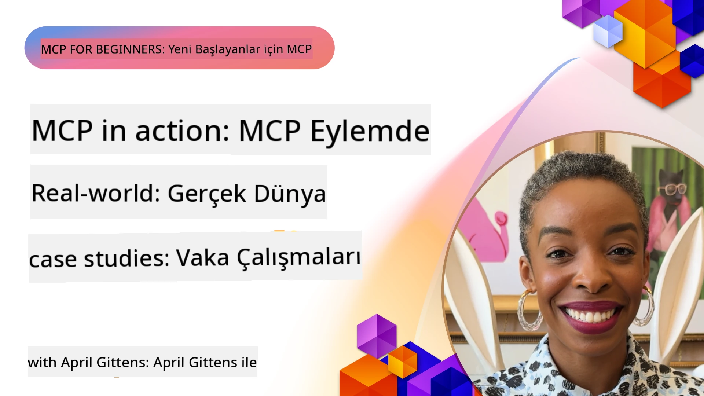

# MCP Uygulamada: Gerçek Dünya Vaka Çalışmaları

_(Bu dersin videosunu izlemek için yukarıdaki görsele tıklayın)_

Model Context Protocol (MCP), yapay zeka uygulamalarının veri, araçlar ve hizmetlerle etkileşim biçimini dönüştürüyor. Bu bölüm, MCP'nin çeşitli kurumsal senaryolardaki pratik uygulamalarını gösteren gerçek dünya vaka çalışmalarını sunmaktadır.

## Genel Bakış

Bu bölüm, MCP uygulamalarına dair somut örnekleri göstererek, kuruluşların bu protokolü karmaşık iş zorluklarını çözmek için nasıl kullandığını vurgular. Bu vaka çalışmalarını inceleyerek, gerçek dünya senaryolarında MCP'nin çok yönlülüğü, ölçeklenebilirliği ve pratik faydaları hakkında fikir edineceksiniz.

## Temel Öğrenme Hedefleri

Bu vaka çalışmalarını keşfederek:

- MCP'nin belirli iş sorunlarını çözmede nasıl uygulanabileceğini anlayacaksınız
- Farklı entegrasyon desenleri ve mimari yaklaşımlar hakkında bilgi sahibi olacaksınız
- Kurumsal ortamlarda MCP uygulamak için en iyi uygulamaları tanıyacaksınız
- Gerçek dünya uygulamalarında karşılaşılan zorluklar ve çözümler hakkında fikir edineceksiniz
- Kendi projelerinizde benzer desenleri uygulama fırsatlarını belirleyeceksiniz

## Öne Çıkan Vaka Çalışmaları

### 1. [Azure AI Seyahat Acenteleri – Referans Uygulaması](./travelagentsample.md)

Bu vaka çalışması, Microsoft'un MCP, Azure OpenAI ve Azure AI Search kullanarak çoklu ajanlı, yapay zeka destekli seyahat planlama uygulaması inşa etmeyi gösteren kapsamlı referans çözümünü incelemektedir. Proje şu özellikleri sunar:

- MCP üzerinden çoklu ajan orkestrasyonu
- Azure AI Search ile kurumsal veri entegrasyonu
- Azure servislerini kullanarak güvenli, ölçeklenebilir mimari
- Yeniden kullanılabilir MCP bileşenleriyle genişletilebilir araçlar
- Azure OpenAI destekli konuşma bazlı kullanıcı deneyimi

Mimari ve gerçekleştirim detayları, MCP'yi koordinasyon katmanı olarak kullanarak karmaşık, çoklu ajan sistemleri kurmaya dair değerli bilgiler sunmaktadır.

### 2. [YouTube Verilerinden Azure DevOps Öğelerini Güncelleme](./UpdateADOItemsFromYT.md)

Bu vaka çalışması, iş akışı süreçlerini otomatikleştirmek için MCP'nin pratik bir uygulamasını göstermektedir. MCP araçlarının nasıl kullanılabileceğini açıklar:

- Çevrimiçi platformlardan veri çekmek (YouTube)
- Azure DevOps sistemlerindeki iş öğelerini güncellemek
- Tekrarlanabilir otomasyon iş akışları oluşturmak
- Farklı sistemler arasında veri entegrasyonu sağlamak

Bu örnek, nispeten basit MCP uygulamalarının rutin görevleri otomatikleştirerek ve sistemler arasında veri tutarlılığını artırarak önemli verimlilik kazançları sağlayabileceğini göstermektedir.

### 3. [MCP ile Gerçek Zamanlı Dokümantasyon Erişimi](./docs-mcp/README.md)

Bu vaka çalışması, Python konsol istemcisini Model Context Protocol (MCP) sunucusuna bağlayarak gerçek zamanlı ve bağlam farkındalıklı Microsoft dokümantasyonunu alma ve kaydetme sürecini anlatır. Öğreneceksiniz ki:

- Resmi MCP SDK kullanarak Python istemcisi ile MCP sunucusuna bağlanmak
- Verimli, gerçek zamanlı veri erişimi için akış tabanlı HTTP istemcileri kullanmak
- Sunucudaki dokümantasyon araçlarını çağırmak ve yanıtları doğrudan konsola kaydetmek
- Güncel Microsoft dokümantasyonunu terminali terk etmeden iş akışınıza entegre etmek

Bölüm, uygulamalı bir görev, minimal çalışan örnek kod ve daha derin öğrenme için ek kaynak bağlantıları sunmaktadır. MCP'nin konsol tabanlı ortamlarda dokümantasyon erişimi ve geliştirici verimliliğini nasıl dönüştürebileceğini anlamak için bağlı bölümü ve kodu inceleyin.

### 4. [MCP ile Etkileşimli Çalışma Planı Üreteci Web Uygulaması](./docs-mcp/README.md)

Bu vaka çalışması, Chainlit ve Model Context Protocol'ü (MCP) kullanarak herhangi bir konu için kişiselleştirilmiş çalışma planları oluşturmak amacıyla etkileşimli bir web uygulamasının nasıl inşa edileceğini gösterir. Kullanıcı bir konu (örneğin "AI-900 sertifikası") ve çalışma süresi (örneğin 8 hafta) belirtebilir ve uygulama haftalık içerik önerileri sunar. Chainlit, deneyimi ilgi çekici ve uyarlanabilir kılan bir konuşma tabanlı sohbet arayüzü sağlar.

- Chainlit destekli konuşma tabanlı web uygulaması
- Konu ve süre için kullanıcı odaklı komutlar
- MCP kullanarak hafta hafta içerik önerileri
- Sohbet arayüzünde gerçek zamanlı, uyarlanabilir yanıtlar

Proje, konuşma tabanlı yapay zeka ve MCP'nin modern web ortamında dinamik, kullanıcı odaklı eğitim araçları oluşturmak için nasıl birleştirilebileceğini gösterir.

### 5. [VS Code'da MCP Sunucusu ile Editör İçi Dokümantasyon](./docs-mcp/README.md)

Bu vaka çalışması, MCP sunucusunu kullanarak Microsoft Learn Dokümanlarını doğrudan VS Code ortamınıza nasıl getirebileceğinizi gösterir—tarayıcı sekmeleri arasında geçiş yapmaya son! Nasıl yapacağınızı göreceksiniz:

- MCP paneli veya komut paleti kullanarak VS Code içinde anında doküman arama ve okuma
- Referans dokümanlara başvurma ve bağlantıları README veya ders markdown dosyalarınıza doğrudan ekleme
- GitHub Copilot ve MCP'yi birleşik, yapay zeka destekli dokümantasyon ve kod iş akışları için kullanma
- Gerçek zamanlı geri bildirim ve Microsoft kaynaklı doğruluk ile dokümantasyonunuzu doğrulama ve geliştirme
- Sürekli dokümantasyon doğrulaması için MCP'yi GitHub iş akışlarıyla entegre etme

Uygulama şunları içerir:

- Kolay kurulum için örnek `.vscode/mcp.json` yapılandırması
- Editör içi deneyimin ekran görüntüsü tabanlı açıklamaları
- Maksimum verimlilik için Copilot ve MCP birleşimi ipuçları

Bu senaryo, dokümanlar, Copilot ve doğrulama araçlarıyla çalışırken editörün içinde kalmak isteyen kurs yazarları, dokümantasyon yazarları ve geliştiriciler için idealdir.

### 6. [APIM MCP Sunucusu Oluşturma](./apimsample.md)

Bu vaka çalışması, Azure API Yönetimi (APIM) kullanarak bir MCP sunucusunun nasıl oluşturulacağına dair adım adım rehber sunar. İçerikleri:

- Azure API Yönetimi'nde MCP sunucusu kurulumu
- API işlemlerinin MCP araçları olarak açığa çıkarılması
- Oran sınırlama ve güvenlik için politikaların yapılandırılması
- MCP sunucusunun Visual Studio Code ve GitHub Copilot kullanılarak test edilmesi

Bu örnek, Azure'un yeteneklerinden faydalanarak çeşitli uygulamalarda kullanılabilecek sağlam bir MCP sunucusu oluşturmanın yolunu gösterir ve yapay zeka sistemlerinin kurumsal API'lerle entegrasyonunu güçlendirir.

### 7. [GitHub MCP Kaydı — Ajan Entegrasyonunu Hızlandırma](https://github.com/mcp)

Bu vaka çalışması, Eylül 2025'te başlatılan GitHub'ın MCP Kaydı'nın, AI ekosistemindeki önemli bir sorunu nasıl çözdüğünü inceler: Model Context Protocol (MCP) sunucularının dağınık keşfi ve dağıtımı.

#### Genel Bakış
**MCP Kaydı**, önceki entegrasyonun yavaş ve hataya açık hale gelmesine yol açan MCP sunucularının depolar ve kayıtlar arasına dağılma sorununu çözer. Bu sunucular, yapay zeka ajanlarının API'lar, veri tabanları ve dokümantasyon kaynakları gibi dış sistemlerle etkileşim kurmasını sağlar.

#### Problem Tanımı
Ajan tabanlı iş akışları geliştirenler çeşitli zorluklarla karşılaştı:
- Farklı platformlarda MCP sunucularının **zayıf keşfedilebilirliği**
- Forumlar ve dokümantasyonda dağınık halde bulunan **tekrar eden kurulum soruları**
- Doğrulanmamış ve güvenilmez kaynaklardan kaynaklanan **güvenlik riskleri**
- Sunucu kalitesi ve uyumluluğunda **standart eksikliği**

#### Çözüm Mimarisi
GitHub MCP Kaydı, güvenilir MCP sunucularını ana merkezde toplar ve şu önemli özellikleri sağlar:
- Kolay kurulum için VS Code üzerinden **tek tıklamayla yükleme** entegrasyonu
- Yıldız, etkinlik ve topluluk doğrulaması ile **sinyal-gürültü sıralaması**
- GitHub Copilot ve diğer MCP uyumlu araçlarla **doğrudan entegrasyon**
- Hem topluluk hem de kurumsal ortakların katkıda bulunmasını sağlayan **açık katkı modeli**

#### İş Etkisi
Kayıt defteri ölçülebilir iyileşmeler sağladı:
- Resmi dokümantasyonu doğrudan ajanlara aktaran Microsoft Learn MCP Sunucusu gibi araçlar kullanarak **geliştiriciler için daha hızlı adapte olma**
- `github-mcp-server` gibi özel sunucular sayesinde **doğal dil ile GitHub otomasyonunda (PR oluşturma, sürekli entegrasyon tekrarları, kod taraması) verimlilik artışı**
- Denetlenmiş listeler ve şeffaf yapılandırma standartları ile **güçlü ekosistem güveni**

#### Stratejik Değer
Ajan yaşam döngüsü yönetimi ve tekrarlanabilir iş akışları geliştiren uygulayıcılar için MCP Kaydı şunları sağlar:
- Standart bileşenlerle **modüler ajan dağıtımı** kabiliyetleri
- Tutarlı test ve doğrulama için **kayıt destekli değerlendirme hatları**
- Farklı AI platformları arasında sorunsuz entegrasyon sağlayan **araçlar arası birlikte çalışabilirlik**

Bu vaka çalışması, MCP Kaydı'nın sadece bir dizin olmadığını, aynı zamanda ölçeklenebilir, gerçek dünya model entegrasyonu ve ajan sistemleri dağıtımı için temel bir platform olduğunu göstermektedir.

### 8. [Bir Ajan ile Sosyal Ağlara Yayınlama](./publora-social-publishing.md)

Bu vaka çalışması, kullanıcının adına geri döndürülemez işlemler yapan araçları olan **yazma yeteneğine sahip uzak MCP sunucusu**nu — sosyal yayınlama üzerinden örnekleyerek — anlatır. Bir ajan bir gönderi taslağı oluşturur, insan onaylar ve sunucu bunu ağlarda planlar.

Yayınlamanın dayattığı tasarım kısıtlamaları ilginçtir ve yalnızca okuyan değil yazan her sunucuya uygulanır:

- **Açık keşif, kimlik doğrulamalı yürütme** — `tools/list` yetkisiz erişimde yanıt verir, böylece kayıtlar ve istemciler içeriği inceleyebilir; buna karşın her `tools/call` belirteç ister ve aksi halde `401` ve `WWW-Authenticate` başlığı döner
- **Harici bir adım olmadan OAuth kaydı** — bugünün dinamik istemci kaydı, `2026-07-28` spesifikasyonunun yönlendirdiği İstemci ID Meta Veri Dokümanları ile
- İstemcilerin onaylama kararlarını vermesi için kullanılan **araç açıklamaları** (`readOnlyHint`, `destructiveHint`, `idempotentHint`) — zorlayıcı değil, ipucu niteliğinde ve artık bağlayıcı dizinlerde beklenen
- **İcat edilemez tanımlayıcılar**, böylece hayal ürünü değer yüksek sesle hata verir, mantıklı gözüken bir değerde işlem yapmaz
- Gönderi oluşturan araçlarda **tekrarlanabilirlik anahtarları**, böylece ajan çalışma zamanı yinelemeleri çoğaltma oluşturmaz
- İnceleyenler ve sürekli entegrasyon için tam yazma yolunun tamamını çalıştıran ve hiçbir şey yayınlamayan, **araç şemasında tanımlanan boş hedef**

Bölüm, inşa ettiğiniz bir sunucuya uygulayabileceğiniz kısa bir kontrol listesini içerir.

## Sonuç

Bu sekiz kapsamlı vaka çalışması, Model Context Protocol'un çeşitli gerçek dünya senaryolarındaki olağanüstü çok yönlülüğünü ve pratik uygulamalarını göstermektedir. Karmaşık çoklu ajan seyahat planlama sistemlerinden kurumsal API yönetimine, düzenli dokümantasyon iş akışlarından devrimci GitHub MCP Kaydı'na kadar bu örnekler, MCP'nin AI sistemlerini araçlar, veri ve hizmetlerle bağlamak için nasıl standartlaştırılmış ve ölçeklenebilir bir yol sunduğunu ortaya koymaktadır.

Vaka çalışmaları MCP uygulamasının birçok boyutunu kapsar:
- **Kurumsal Entegrasyon**: Azure API Yönetimi ve Azure DevOps otomasyonu
- **Çoklu Ajan Orkestrasyonu**: Koordine edilmiş yapay zeka ajanları ile seyahat planlaması
- **Geliştirici Verimliliği**: VS Code entegrasyonu ve gerçek zamanlı dokümantasyon erişimi
- **Ekosistem Gelişimi**: Temel bir platform olarak GitHub MCP Kaydı
- **Eğitim Uygulamaları**: Etkileşimli çalışma planı oluşturucular ve konuşma arayüzleri

Bu uygulamaları inceleyerek kritik içgörüler kazanırsınız:
- Farklı ölçek ve kullanım durumları için **mimari desenler**
- İşlevsellik ve sürdürülebilirliği dengeleyen **uygulama stratejileri**
- Üretim dağıtımları için **güvenlik ve ölçeklenebilirlik** değerlendirmeleri
- MCP sunucu geliştirme ve istemci entegrasyonu için **en iyi uygulamalar**
- Birbirine bağlı AI destekli çözümler inşa etmek için **ekosistem odaklı düşünce**

Bu örnekler topluca gösteriyor ki MCP sadece teorik bir çerçeve değil, karmaşık iş zorluklarına pratik çözümler sunan, olgun ve üretime hazır bir protokoldür. Basit otomasyon araçları veya gelişmiş çoklu ajan sistemleri inşa ediyor olun, burada gösterilen desenler ve yaklaşımlar kendi MCP projeleriniz için sağlam bir temel sağlar.

## Ek Kaynaklar

- [Azure AI Seyahat Acenteleri GitHub Deposu](https://github.com/Azure-Samples/azure-ai-travel-agents)
- [Azure DevOps MCP Aracı](https://github.com/microsoft/azure-devops-mcp)
- [Playwright MCP Aracı](https://github.com/microsoft/playwright-mcp)
- [Microsoft Docs MCP Sunucusu](https://github.com/MicrosoftDocs/mcp)
- [GitHub MCP Kaydı — Ajan Entegrasyonunu Hızlandırma](https://github.com/mcp)
- [MCP Topluluk Örnekleri](https://github.com/microsoft/mcp)

## Sonraki Adımlar

- Önceki: [Modül 8: En İyi Uygulamalar](../08-BestPractices/README.md)
- Sonraki: [Modül 10: AI İş Akışlarını Kolaylaştırma: AI Araç Seti ile MCP Sunucu Oluşturma](../10-StreamliningAIWorkflowsBuildingAnMCPServerWithAIToolkit/README.md)

---

<!-- CO-OP TRANSLATOR DISCLAIMER START -->
**Feragatname**:
Bu belge, AI çeviri hizmeti [Co-op Translator](https://github.com/Azure/co-op-translator) kullanılarak çevrilmiştir. Doğruluk için çaba sarf etsek de, otomatik çevirilerin hata veya yanlışlık içerebileceğini lütfen unutmayınız. Orijinal belge, kendi dilinde yetkili kaynak olarak kabul edilmelidir. Kritik bilgiler için profesyonel insan çevirisi önerilir. Bu çevirinin kullanımı sonucu ortaya çıkabilecek yanlış anlamalardan veya yanlış yorumlamalardan sorumlu değiliz.
<!-- CO-OP TRANSLATOR DISCLAIMER END -->