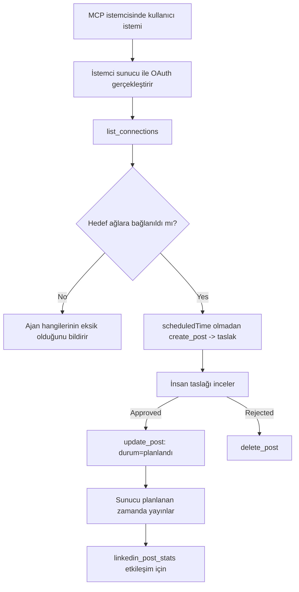

# Vaka Çalışması: Uzaktan MCP Sunucusuna Sahip Bir Ajan ile Sosyal Ağlara Yayın Yapmak

> **Feragatname:** Birçok servis ve açık kaynak proje sosyal ağlara yayın yapabilir ve bir ekip ayrıca her ağın API'sını doğrudan entegre edebilir. Aşağıdaki senaryo, **yazma yeteneğine sahip uzak bir MCP sunucusunun** nasıl tasarlanıp kullanılabileceğine dair bir örnek olarak sunulmuştur. Publora, ücretsiz bir katmana sahip ticari bir servistir; burada açıklanan kalıplar, bir kullanıcının adına geri döndürülemez işlemler yapan herhangi bir MCP sunucusuna uygulanabilir.

## Genel Bakış

Ajanlar içerik taslağı hazırlamada iyidirler ancak yayınlama konusunda kötüdürler. Bir model birkaç saniyede bir basın açıklaması yazabilir, sonra iş durur: yayına almak demek her ağ için bir API, her ağ için bir OAuth uygulaması ve her biri için farklı medya kuralları demektir. Çoğu ekip bu sorunu metni elle tarayıcıya kopyalayarak çözer.

Bu vaka çalışması, son adımın tek bir uzak MCP sunucusu ile nasıl kapandığına ve — daha önemlisi biri bunu inşa eden herkes için — bir **yazma yeteneğine sahip** sunucunun doğru yapması gereken tasarım kararlarına bakar. Veri okumak affedicidir. Yayınlamak değil: yanlış bir araç çağrısı izleyici tarafından görülür ve geri alınamaz.

## Senaryo

Küçük bir geliştirici ilişkileri ekibi, bir ajanın içinde (Claude, VS Code, Cursor — istemci önemli değil) gönderiler taslak olarak oluşturur. Ajanın yapmasını isterler:

- Ekibin bağladığı sosyal hesapları görmek,
- Bir gönderi taslağı hazırlamak ve insan onayı için taslak olarak tutmak,
- Bir resim eklemek,
- Birden çok ağda seçilen zamanda zamanlamak,
- Ve daha sonra nasıl performans gösterdiğini raporlamak.

Çok önemlisi, ajan deney yaparken *yanlışlıkla* yayın yapamamasını isterler.

## Kullanılan Araçlar

- [Publora MCP Sunucusu](https://github.com/publora/mcp-server) — yayınlama, zamanlama, medya ve LinkedIn analiz araçları sunan uzak bir MCP sunucusu (`streamable-http`). Resmi MCP kayıt defterinde `com.publora/mcp-server` olarak kayıtlıdır.

## Adım-Adım İş Akışı

1. **Sunucuya bağlanın.** OAuth konuşan istemciler, sunucunun kendisine ait izin ekranına PKCE kullanarak yetkilendirme kodu akışını tamamlar; başsız CLI’lar gibi OAuth kullanmayan istemciler ise bir başlıkta Publora API anahtarı kullanır. Her iki yol da desteklenir ve hangi yolun seçileceği istemciye bağlıdır, sunucuya değil.
2. **Bağlantıları listeleyin.** Ajan `list_connections` çağrısı yapar ve bağlantılı hesapları kimlikleriyle birlikte alır.
3. **Taslak oluşturun.** Ajan zamanlanmış bir zaman olmadan `create_post` çağrısı yapar. Gönderi taslak olarak saklanır — hiçbir şey yayınlanmaz.
4. **Medya ekleyin.** Genel erişime açık resim URL’leri aynı çağrıda iletilir; sunucu bunları indirir ve doğrular.
5. **Zamanlayın.** İnsan onayladıktan sonra, `update_post` durumu ISO 8601 zamanıyla zamanlanmış olarak ayarlar.
6. **Ölçün.** LinkedIn için, gönderi canlı olduğunda `linkedin_post_stats` etkileşimi döner.

## Örnek İstek

```text
Which social accounts do I have connected?
Draft a post announcing our new changelog page, attach the screenshot at
https://example.com/changelog.png, and keep it as a draft — do not publish it.
Once I approve, schedule it to LinkedIn and Bluesky for tomorrow at 09:00 UTC.
```

## Mermaid Akış Şeması



## Teknik Uygulama

Aşağıdaki dersler bu vaka çalışmasının aktarılabilir kısmıdır.

### Açık keşif, kimlik doğrulamalı yürütme

`tools/list` kimlik bilgisi olmadan sunulur; her `tools/call` token gerektirir, aksi halde korunan kaynak metadata’sına işaret eden `WWW-Authenticate` başlığı ile `401` döner. (Sunucu ayrıca kimlik doğrulamasız `initialize` yanıtlar, bu yalnızca `2026-07-28` öncesi protokol sürümlerindeki istemciler için önemlidir; o revizyon el sıkışmayı tamamen kaldırmıştır.)

Bu ayrım uygulamada önemlidir. Kayıt defterleri, kataloglar ve istemciler araç yüzeyini — isimler, şemalar, açıklamalar — bir sır tutmadan keşfedebilirken, *anonim* hiçbir şey *çalıştırılamaz*. `initialize` için token isteyen bir sunucu araçlar için görünmezdir; anonim `tools/call`a izin veren sunucu sorumluluk oluşturur.

### Kayıt: dinamik istemci kaydı ve onun yerine geçen şey

Sunucu `/.well-known/oauth-protected-resource` ve `/.well-known/oauth-authorization-server` yollarını duyurur, ve PKCE (`S256`), yenileme tokenları ve **dinamik istemci kaydı** ile yetkilendirme kodu akışını destekler.

Dinamik kayıt manuel adımı ortadan kaldırır: olmadan her istemcinin önceden verilen bir `client_id`ye ihtiyacı vardır ki bu da her yeni istemci için satıcıya dışardan bir istek anlamına gelir.

Buna bir uyumluluk davranışı olarak bakın, kopyalanacak tasarım olarak değil. `2026-07-28` tarihli spesifikasyon revizyonu, dinamik istemci kaydını Client ID Metadata Belgeleri lehine kullanımdan kaldırır; burada istemci kararlı HTTPS URL’sinde bir metadata belgesi barındırır ve o URL *client_id* olur. DCR şu an çalışmaya devam eder ancak bugün inşa edilen bir sunucu CIMD’ye göre planlama yapmalı ve DCR’yi sadece eski istemciler için tutmalıdır.

### Araç açıklamaları süsleme değildir

Her araç bir `title` ve uygulanabilir ipuçlarını taşır: `readOnlyHint`, `destructiveHint`, `idempotentHint`, `openWorldHint`.

İki nedenden dolayı onlara yatırım yapın. Birincisi, istemciler ipuçlarını kullanarak kullanıcıdan neyi onaylaması gerektiğine karar verir — bir istemci sadece-okuma sorgusunu otomatik çalıştırabilir ve silme öncesi onay isteyebilir. Spesifikasyon açıklamaları yetkilendirme mekanizması değil, güvensiz ipuçları olarak açıklar: bunlar istemcinin ne yapmayı teklif edeceğini şekillendirir, sunucu üzerinde hiçbir şeyi durdurmaz ve sunucu kendi kurallarını hala uygular. İkinci olarak, önemli bağlantı dizinleri artık *inceleme için* onları *zorunlu* kılar; başlığı ve ipuçları olmayan bir sunucu, ne kadar iyi çalışsa da geri gönderilir.

### Kimlikleri uydurulamaz yapın

Platform kimlikleri, `list_connections` tarafından dönen opak dizelerdir ve şema açıklaması açıkça bunların birebir kopyalanması ve asla tahmin edilmemesi gerektiğini söyler. Sunucu başka hiçbir şeyi kabul etmez.

Modeller özgürce tahmin yapar. Her yazma yeteneğine sahip sunucu, bir kimliğin sonunda uydurulacağı varsayımıyla hareket etmeli ve o yolu yüksek sesle ve erken hatalı yapmalı, makul görünen bir değer üzerine işlem yapmamalıdır.

### Yayınlamadan önce başarısız olun, uygulanabilir bir mesajla

Bazı ağlar sadece metinli gönderileri reddeder ve resim ya da video ister. Bu, gönderi zamanlandığında doğrulanır ve hata, platformu ve eksik gereksinimi belirtir.

Bir ajan "Instagram medya ister — bir resim veya video ekleyin" hatasından başka tur atmaya gerek kalmadan kurtulabilir. Genel bir `400` hatasından kurtulamaz.

### Yeniden denemeleri güvenli yapın

İçerik oluşturan iki araç, `create_post` ve `update_post`, bir idempotency anahtarı kabul eder: aynı isteği anahtarla tekrar kullanmak orijinal cevabı yeniden oynatır, ikinci bir gönderi oluşturmaz. Ajan çalışma zamanları zaman aşımında yeniden dener; idempotency olmadan, yavaş yanıt çoğaltılmış yayın olur. Diğer yazma araçları — silmeler, medya adımları, LinkedIn reaksiyonları ve yorumlar — idempotency anahtarı almaz, bu yüzden orada tekrar denemek otomatik olarak güvenli değildir. Kendi değişikliklerinizden hangilerinin korunduğunu hangilerinin olmadığını bilmek faydalıdır.

### Hiçbir şey yayınlamayan bir test yolu sağlayın

Sunucu, `publora-playground` adında rezerve edilmiş bir hedefi kabul eder; bu gerçek hedef gibi doğrulanır ve onaylanır ama sonra atılır — gerçek bir hesaba hiçbir şey ulaşmaz. Bu, herhangi bir istemcinin kimlik bilgisi olmadan okuyabileceği araç şemasında açıklanmıştır: `create_post` içindeki `platforms` alanı bunu "gerçek bir bağlantı gerektirmeyen bir bağlantı testi hedefi — gönderi onaylanır ve atılır, hiçbir şey yayınlanmaz" olarak belgelendirir. Bunu tek giriş olarak `platforms: ["publora-playground"]` geçerek çağırın.

Bu detay tüm yüzeyin en faydalı ayrıntılarından biri oldu. Bağlayıcı dizinlerin inceleyicileri, katkıda bulunanlar ve CI, gerçek bir izleyiciye risk olmadan tüm yazma yolunu baştan sona kullanabilir. Geri döndürülemez işlemler yapan her MCP sunucusu, belgelendirilmiş bir boş işlem hedefinden faydalanır.

## Sonuçlar ve Etki

- Yayınlama adımı içeriğin yazıldığı aynı sohbet alanına taşındı ve taslağa öncelik veren alışkanlık insanı döngüde tuttu. Kesin olun: bir taslak bir gelenek, sınır değil. Aynı kimlik bilgisi zamanlayabilir veya yayın yapabilir, bu yüzden gerçek bir onay noktası isteyen birisi bunu araç yüzeyinin dışında uygulamak zorundadır — ayrı kimlik bilgileri veya sunucunun önünde bir politika katmanı.
- Ağ başına farklar — medya gereksinimleri, dizinleme, yanıt kontrolleri — her ajan yerine sunucuda bir kez ele alınır.
- Aynı sunucu keşif açık ve kayıt dinamik olduğu için birçok MCP istemcisini ekstra iş olmadan destekler.
- Yukarıdaki tasarım kısıtlamaları, kullanıcılar kadar bağlayıcı dizini incelemeleri tarafından da şekillendirildi: açıklamalar, OAuth ve güvenli test hedefi bunların her biri tarafından talep edildi.

## Kaynaklar

- [Publora MCP Sunucusu (kaynak)](https://github.com/publora/mcp-server)
- [Publora API ve MCP dokümantasyonu](https://docs.publora.com)
- [MCP Kayıt girdisi: `com.publora/mcp-server`](https://registry.modelcontextprotocol.io/v0/servers?search=com.publora/mcp-server)
- [MCP spesifikasyonu — Yetkilendirme](https://modelcontextprotocol.io/specification/draft/basic/authorization)
- [MCP spesifikasyonu — Araç açıklamaları](https://modelcontextprotocol.io/docs/concepts/tools)

## Sonraki Adım

- İnşa etmekte olduğunuz bir MCP sunucusunu alın ve buradaki en ucuz üç kazancı kontrol edin: her araçta açıklamalar, her yazmada bir idempotency anahtarı ve belgelenmiş bir boş işlem hedefi.
- Açık keşif ayrımını deneyin: kimlik bilgisi olmadan genel bir uzak sunucuya `tools/list` çağırın, ardından bir araç çağırın ve `401` isteğini inceleyin.
- Alanınız için "geri alma"nın ne anlama geldiğini düşünün. Yayınlamanın taslakları ve silmesi vardır; eğer işlemlerinizin karşılığı yoksa onay, istemde değil araç tasarımında olmalıdır.

---

<!-- CO-OP TRANSLATOR DISCLAIMER START -->
**Feragatname**:
Bu belge, AI çeviri hizmeti [Co-op Translator](https://github.com/Azure/co-op-translator) kullanılarak çevrilmiştir. Doğruluk için çaba sarf etsek de, otomatik çevirilerin hata veya yanlışlık içerebileceğini lütfen unutmayınız. Orijinal belge, kendi dilinde yetkili kaynak olarak kabul edilmelidir. Kritik bilgiler için profesyonel insan çevirisi önerilir. Bu çevirinin kullanımı sonucu ortaya çıkabilecek yanlış anlamalardan veya yanlış yorumlamalardan sorumlu değiliz.
<!-- CO-OP TRANSLATOR DISCLAIMER END -->