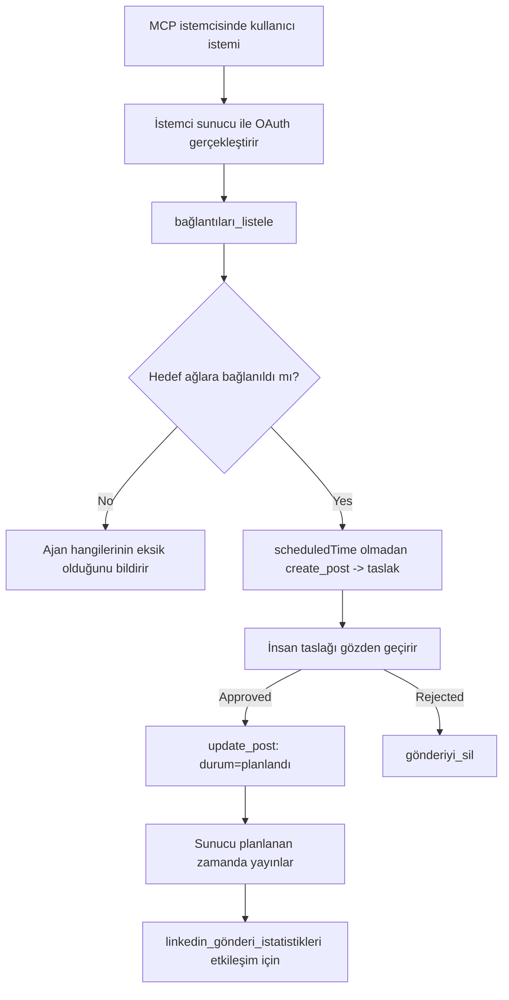

# Vaka İncelemesi: Uzak Bir MCP Sunucusuna Sahip Bir Ajan Üzerinden Sosyal Ağlara Yayınlama

> **Feragatname:** Birkaç hizmet ve açık kaynak projeleri sosyal ağlara yayın yapabilir ve bir ekip ayrıca her ağın API'sini doğrudan entegre edebilir. Aşağıdaki senaryo, **yazma yetenekli uzak bir MCP sunucusunun** nasıl tasarlanabileceğine ve kullanılabileceğine dair çalışılmış bir örnek olarak sunulmaktadır. Publora, ücretsiz bir katmanı olan ticari bir hizmettir; burada tarif edilen kalıplar, bir kullanıcının adına geri alınamaz işlemler yapan herhangi bir MCP sunucusuna uygulanır.

## Genel Bakış

Ajanlar içerik taslağı hazırlamada iyidir, teslimatta kötüdür. Bir model bir duyuru duyurusunu saniyeler içinde yazabilir ve sonra iş durur: yayınlamak, her ağ için bir API, her ağ için bir OAuth uygulaması ve her biri için farklı medya kuralları gerektirir. Çoğu ekip bunu, metni el ile bir tarayıcıya kopyalayarak çözer.

Bu vaka incelemesi, bu son adımın tek bir uzak MCP sunucusu ile nasıl kapandığını ve — bunu kuran herkes için daha faydalı olacak şekilde — **yazma yetenekli** bir sunucunun doğru yapması gereken tasarım kararlarını inceliyor. Veri okumak bağışlayıcıdır. Yayınlama değildir: yanlış bir araç çağrısı bir izleyiciye görünür ve geri alınamaz.

## Senaryo

Küçük bir geliştirici ilişkileri ekibi, ajan içinde yazılar taslağı hazırlar (Claude, VS Code, Cursor — istemci önemli değil). Ajanın şunları yapmasını isterler:

- Ekibin hangi sosyal hesapları bağladığını görmek,
- Bir gönderi taslağı oluşturmak ve onaylanmak üzere taslak olarak tutmak,
- Bir resim eklemek,
- Seçilen zamanda birkaç ağa yayınlamak için zamanlamak,
- Ve sonra nasıl performans gösterdiğini raporlamak.

En önemlisi, ajanın denemeler devam ederken *yanlışlıkla* yayınlama yapamamasını isterler.

## Kullanılan Araçlar

- [Publora MCP Server](https://github.com/publora/mcp-server) — yayınlama, zamanlama, medya ve LinkedIn analiz araçlarını sunan uzak bir MCP sunucusu (`streamable-http`). Resmi MCP kayıt defterinde `com.publora/mcp-server` olarak kayıtlıdır.

## Adım Adım İş Akışı

1. **Sunucuya bağlanın.** OAuth konuşan istemciler sunucunun kendi izin ekranı ile PKCE destekli yetkilendirme kodu akışını tamamlar; bunu yapmayan, örneğin başsız CLI'lar ise bir başlıkta Publora API anahtarı kullanır. İki yol da desteklenir ve hangisini kullanacağınız istemciye bağlıdır, sunucuya değil.
2. **Bağlantıları listeleyin.** Ajan `list_connections` çağrısı yapar ve bağlı hesapları kimlikleriyle birlikte alır.
3. **Taslak oluşturun.** Ajan zamanlanmış bir zaman *olmaksızın* `create_post` çağrısı yapar. Gönderi taslak olarak kaydedilir — hiç yayınlanmaz.
4. **Medya ekleyin.** Genel resim URL’leri aynı çağrıda iletilir; sunucu bunları indirir ve doğrular.
5. **Zamanlama.** Bir insan onayladıktan sonra, `update_post` durumu ISO 8601 zamanıyla zamanlanmış olarak ayarlar.
6. **Ölçüm.** LinkedIn için, gönderi canlı olduğunda `linkedin_post_stats` etkileşimi döner.

## Örnek İstek

```text
Which social accounts do I have connected?
Draft a post announcing our new changelog page, attach the screenshot at
https://example.com/changelog.png, and keep it as a draft — do not publish it.
Once I approve, schedule it to LinkedIn and Bluesky for tomorrow at 09:00 UTC.
```

## Mermaid Akış Diyagramı



## Teknik Uygulama

Aşağıdaki dersler bu vaka çalışmasının aktarılabilir kısmıdır.

### Açık keşif, kimlik doğrulanmış yürütme

`tools/list` kimlik bilgisi olmadan sunulur; her `tools/call` token gerektirir
ve aksi takdirde `WWW-Authenticate` başlığı ile `401` döner,
korumalı kaynak meta verisine işaret eder. Sunucunun eski uç noktası ayrıca
`2026-07-28` öncesi protokol sürümleri için kimliksiz `initialize` yanıtlar;
güncel istemciler bu el sıkışmasını kullanmaz.

Bu sunucuya özgü ayrım, kayıt defterlerinin, katalogların ve istemcilerin gizli olmadan araç
adlarını, şemalarını ve açıklamalarını incelemesine izin verirken, anonim yürütmeyi engeller.
Açık keşif bir dağıtım tercihidir, bir MCP gerekliliği değildir; korumalı bir dağıtım `tools/list` için de yetkilendirme talep edebilir.


her istemcinin satıcıdan önceden verilmiş bir `client_id`'ye ihtiyacı vardı.


dinamik istemci kaydını, istemcinin kararlı bir HTTPS URL'sinde metadata dokümanı barındırdığı ve bu URL *client_id* olduğu Client ID Metadata Dokümanları lehine eski sayar. DCR şimdilik çalışmaya devam ediyor ama bugün inşa edilen bir sunucu CIMD'yi planlamalı ve DCR'yi sadece eski istemciler için tutmalı.

### Araç açıklamaları süsleme değildir

Her araç bir `title` ve uygulanabilir ipuçları taşır: `readOnlyHint`, `destructiveHint`, `idempotentHint`, `openWorldHint`.

Yatırım yapmanız için iki neden. Birincisi, istemciler ipuçlarını kullanarak kullanıcıya neyi onaylatacağını belirler — bir istemci salt-okuma aramasını otomatik yapabilir ve silmeden önce onay için durabilir. Spesifikasyon açıklamaların güvenilmez ipuçları olduğunu açıkça belirtir, yetkilendirme mekanizması değildir: istemcinin ne yapmayı teklif edeceğini şekillendirir, sunucuda hiçbir şeyi durdurmaz ve sunucu hala kendi kurallarını uygulamalıdır. İkincisi, büyük bağlayıcı dizinler artık gözden geçirme için onları *zorunlu* kıldı; araçları başlıklar ve ipuçları içermeyen bir sunucu ne kadar iyi çalışırsa çalışsın geri gönderilir.

### Tanımlayıcıları tahmin edilemez yap

Platform tanımlayıcıları, `list_connections` tarafından dönen şeffaf olmayan dizgilerdir ve şema açıklaması açıkça, onları birebir kopyalamak ve asla tahmin etmemek gerektiğini söyler. Sunucu başka her şeyi reddeder.

Modeller akıcı tahminciler. Her yazma yetenekli sunucu, bir tanımlayıcının eninde sonunda hayal edileceğini varsaymalı ve bu yolu yüksek sesle ve erken başarısız kılmalı, olası görünen bir değere göre hareket etmek yerine.

### Yayınlamadan önce, uygulanabilir bir mesajla başarısız ol

Bazı ağlar sadece metin gönderilerini reddeder ve resim ya da video ister. Bu, gönderi zamanlanırken doğrulanır ve hata platformu ve eksik gerekliliği adlandırır.

Bir ajan "Instagram medya ister — bir resim ya da video ekleyin" uyarısından başka bir yolculuk yapmadan kurtulabilir. Genel bir `400` hatasından kurtulamaz.

### Yeniden denemeleri güvenli yap

İçerik oluşturan iki araç, `create_post` ve `update_post`, bir idempotency anahtarı kabul eder: onu aynı istekle yeniden kullanmak orijinal yanıtı tekrarlar, ikinci bir gönderi oluşturmaz. Ajan çalışma zamanı zaman aşımında yeniden dener; idempotency olmazsa, yavaş yanıt tekrar yayına dönüşür. Diğer yazma araçları — silmeler, medya adımları, LinkedIn tepkileri ve yorumları — bu anahtarı almaz, bu yüzden oradaki bir yeniden deneme otomatik olarak güvenli değildir. Kendi mutasyonlarınızın hangilerinin korunduğunu bilmek iyidir, hangilerinin korunmadığını.

### Hiçbir şey yayınlamayan bir test yolu sağla


Sunucu, gerçek bir hedef gibi doğrulanan ve kabul edilen, ancak ardından atılan `publora-playground` adlı ayrılmış bir hedefi kabul eder — canlı bir hesaba hiçbir şey ulaşmaz. Bu, herhangi bir istemcinin kimlik bilgisi olmadan okuyabileceği araç şemasında, `create_post`'un `platforms` alanında "gerçek bir bağlantı gerektirmeyen bir bağlantı testi hedefi — gönderi kabul edilir ve atılır, hiçbir şey yayımlanmaz" olarak tanımlanmıştır. Bunu tek giriş olarak geçirerek çağırın: `platforms: ["publora-playground"]`.

Bu, tüm yüzeyin en faydalı detaylarından biri olduğu ortaya çıktı. Bağlayıcı dizin inceleyicileri, katılımcılar ve CI, gerçek bir izleyiciye zarar vermeden yazdırma yolunu uçtan uca test edebilir. Geri dönüşü olmayan işlemleri olan herhangi bir MCP sunucusu, belgelenmiş bir no-op hedefinden faydalanır.

## Sonuçlar ve Etki

- Yayınlama adımı içerik yazılan aynı sohbete taşındı ve taslak-öncelikli alışkanlık insanı süreçte tutar. Bunun ne olduğuna kesin olun: taslak bir sınır değil, bir konvansiyondur. Aynı kimlik bilgisi programlama yapabilir veya yayınlayabilir, bu yüzden gerçek bir onay kapısına ihtiyaç duyan herkes bunu araç yüzeyinin dışında — ayrı kimlik bilgileri veya sunucunun önünde bir politika katmanı — uygulamalıdır.
- Ağ başına farklılıklar — medya gereksinimleri, konu takibi, yanıt kontrolleri — her bu sunucuda bir kez işlenir, her ajan tarafından ayrı ayrı değil.
- Aynı sunucu, önceden verilmiş kimlik bilgisi olmadan birçok MCP istemcisini destekler.
    Mevcut istemciler İstemci Kimliği Meta Verisi Belgelerini kullanabilir; DCR eskiler için bir yedektir
    .
- Yukarıdaki tasarım kısıtlamaları, kullanıcılar kadar bağlayıcı dizin incelemeleriyle de şekillendi: açıklamalar, OAuth ve güvenli test hedefi her biri en az bir inceleyici tarafından istendi.

## Kaynaklar

- [Publora MCP Sunucusu (kaynak)](https://github.com/publora/mcp-server)
- [Publora API ve MCP dokümantasyonu](https://docs.publora.com)
- [MCP Kayıt girdisi: `com.publora/mcp-server`](https://registry.modelcontextprotocol.io/v0/servers?search=com.publora/mcp-server)
- [MCP spesifikasyonu — Yetkilendirme](https://modelcontextprotocol.io/specification/2026-07-28/basic/authorization)
- [MCP spesifikasyonu — Araç açıklamaları](https://modelcontextprotocol.io/docs/concepts/tools)

## Sonraki Adımlar

- Kendi inşa ettiğiniz bir MCP sunucusunu alın ve burada üç en ucuz kazanımı kontrol edin: her araçta açıklamalar, her yazmada bir idempotentlik anahtarı ve belgelenmiş bir no-op hedefi.
- Açık-keşif ayrımını deneyin: kimlik bilgisi olmadan herkese açık uzak bir sunucuya `tools/list` çağrısı yapın, sonra bir aracı çağırarak `401` isteğini inceleyin.
- Alanınız için “geri alma”nın ne anlama geldiğini düşünün. Yayınlamanın taslakları ve silinmesi vardır; eğer işlemlerinizin karşılığı yoksa, onay araç tasarımında, istemde değil olmalıdır.

---

<!-- CO-OP TRANSLATOR DISCLAIMER START -->
**Feragatname**:
Bu belge, AI çeviri hizmeti [Co-op Translator](https://github.com/Azure/co-op-translator) kullanılarak çevrilmiştir. Doğruluk için çaba sarf etsek de, otomatik çevirilerin hata veya yanlışlık içerebileceğini lütfen unutmayınız. Orijinal belge, kendi dilinde yetkili kaynak olarak kabul edilmelidir. Kritik bilgiler için profesyonel insan çevirisi önerilir. Bu çevirinin kullanımı sonucu ortaya çıkabilecek yanlış anlamalardan veya yanlış yorumlamalardan sorumlu değiliz.
<!-- CO-OP TRANSLATOR DISCLAIMER END -->