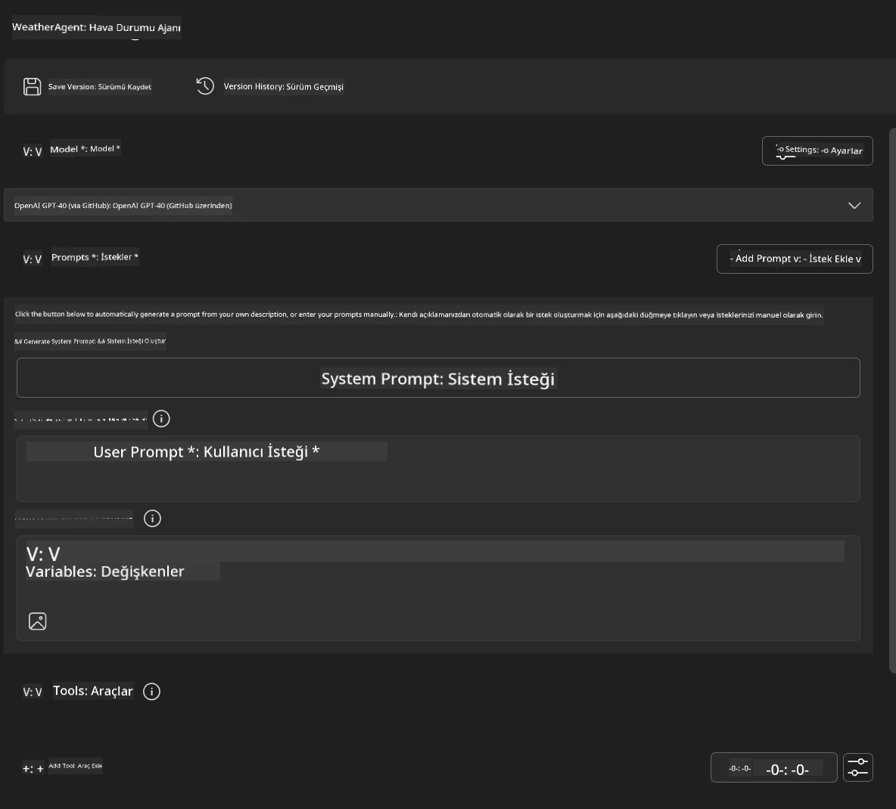
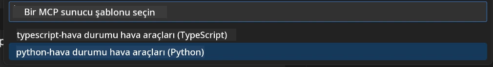
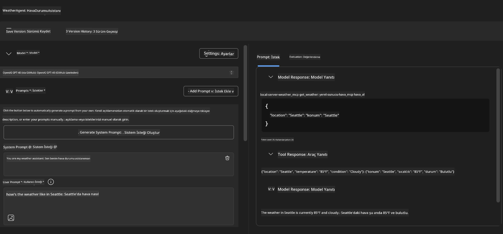
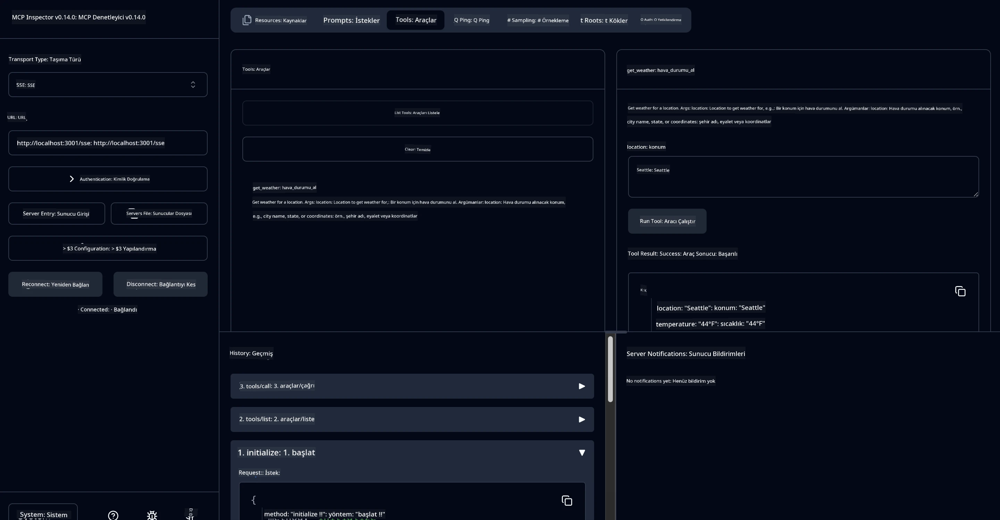

# 🔧 Modül 3: Microsoft Foundry Toolkit ile Gelişmiş MCP Geliştirme

> [!NOTE]
> Bu laboratuvarda kullanılan Inspector URL'leri eski `/sse` uç noktasını kullanır ve
> sabitlenmiş MCP SDK `1.9.3` ve Inspector `0.14.0` bağımlılıklarını hedef alır. Bunlar
> güncel `2026-07-28` Streamable HTTP örnekleri değildir.


## 🎯 Öğrenme Hedefleri

Bu laboratuvarın sonunda şunları yapabileceksiniz:

- ✅ Microsoft Foundry Toolkit kullanarak özel MCP sunucuları oluşturma
- ✅ En son MCP Python SDK'sını (v1.9.3) yapılandırma ve kullanma
- ✅ Hata ayıklama için MCP Inspector kurma ve kullanma
- ✅ Agent Builder ve Inspector ortamlarında MCP sunucularını hata ayıklama
- ✅ Gelişmiş MCP sunucu geliştirme iş akışlarını anlama

## 📋 Önkoşullar

- Laboratuvar 2'nin (MCP Temelleri) tamamlanması
- Microsoft Foundry Toolkit uzantısının yüklü olduğu VS Code
- Python 3.10+ ortamı
- Inspector kurulumu için Node.js ve npm

## 🏗️ Neler İnşa Edeceksiniz

Bu laboratuvarda, aşağıdakileri gösteren bir **Hava Durumu MCP Sunucusu** oluşturacaksınız:
- Özel MCP sunucu uygulaması
- Microsoft Foundry Toolkit Agent Builder ile entegrasyon
- Profesyonel hata ayıklama iş akışları
- Modern MCP SDK kullanım örüntüleri

---

## 🔧 Temel Bileşenlerin Genel Bakışı

### 🐍 MCP Python SDK
Model Context Protocol Python SDK, özel MCP sunucuları oluşturmak için temel sağlar. Gelişmiş hata ayıklama özellikleriyle 1.9.3 sürümünü kullanacaksınız.

### 🔍 MCP Inspector
Güçlü bir hata ayıklama aracı olup şunları sunar:
- Gerçek zamanlı sunucu izleme
- Araç çalıştırma görselleştirmesi
- Ağ istek/yanıt incelemesi
- Etkileşimli test ortamı

---

## 📖 Adım Adım Uygulama

### Adım 1: Agent Builder'da WeatherAgent Oluşturun

1. **Microsoft Foundry Toolkit uzantısı aracılığıyla VS Code'da Agent Builder'ı başlatın**
2. **Aşağıdaki yapılandırmaya sahip yeni bir ajan oluşturun:**
   - Agent Adı: `WeatherAgent`



### Adım 2: MCP Sunucu Projesini Başlatın

1. **Agent Builder'da Araçlar** → **Araç Ekle** menüsüne gidin
2. **Mevcut seçeneklerden "MCP Server"ı seçin**
3. **"Yeni bir MCP Sunucusu Oluştur" seçeneğini seçin**
4. **`python-weather` şablonunu seçin**
5. **Sunucunuzun adını belirleyin:** `weather_mcp`



### Adım 3: Projeyi Açın ve İnceleyin

1. **Oluşturulan projeyi VS Code'da açın**
2. **Proje yapısını gözden geçirin:**
   ```
   weather_mcp/
   ├── src/
   │   ├── __init__.py
   │   └── server.py
   ├── inspector/
   │   ├── package.json
   │   └── package-lock.json
   ├── .vscode/
   │   ├── launch.json
   │   └── tasks.json
   ├── pyproject.toml
   └── README.md
   ```

### Adım 4: MCP SDK'yı En Yeni Sürüme Yükseltin

> **🔍 Neden Yükseltme?** Gelişmiş özellikler ve daha iyi hata ayıklama için en son MCP SDK (v1.9.3) ve Inspector servisini (0.14.0) kullanmak istiyoruz.

#### 4a. Python Bağımlılıklarını Güncelleyin

**`pyproject.toml` dosyasını düzenleyin:** [./code/weather_mcp/pyproject.toml](../../../../10-StreamliningAIWorkflowsBuildingAnMCPServerWithAIToolkit/lab3/code/weather_mcp/pyproject.toml) dosyasını güncelleyin


#### 4b. Inspector Yapılandırmasını Güncelleyin

**`inspector/package.json` dosyasını düzenleyin:** [./code/weather_mcp/inspector/package.json](../../../../10-StreamliningAIWorkflowsBuildingAnMCPServerWithAIToolkit/lab3/code/weather_mcp/inspector/package.json) dosyasını güncelleyin

#### 4c. Inspector Bağımlılıklarını Güncelleyin

**`inspector/package-lock.json` dosyasını düzenleyin:** [./code/weather_mcp/inspector/package-lock.json](../../../../10-StreamliningAIWorkflowsBuildingAnMCPServerWithAIToolkit/lab3/code/weather_mcp/inspector/package-lock.json) dosyasını güncelleyin

> **📝 Not:** Bu dosya kapsamlı bağımlılık tanımları içerir. Aşağıda temel yapı gösterilmiştir - tam içerik doğru bağımlılık çözümlemesini sağlar.


> **⚡ Tam Paket Kilidi:** Tam package-lock.json dosyası yaklaşık 3000 satır bağımlılık tanımı içerir. Yukarıda önemli yapı gösterilmiştir - tam bağımlılık çözümü için verilen dosyayı kullanın.

### Adım 5: VS Code Hata Ayıklamayı Yapılandırın

*Not: Belirtilen yolu kopyalayarak ilgili yerel dosyanın üzerine yazınız*

#### 5a. Başlatma Yapılandırmasını Güncelleyin

**`.vscode/launch.json` dosyasını düzenleyin:**

```json
{
  "version": "0.2.0",
  "configurations": [
    {
      "name": "Attach to Local MCP",
      "type": "debugpy",
      "request": "attach",
      "connect": {
        "host": "localhost",
        "port": 5678
      },
      "presentation": {
        "hidden": true
      },
      "internalConsoleOptions": "neverOpen",
      "postDebugTask": "Terminate All Tasks"
    },
    {
      "name": "Launch Inspector (Edge)",
      "type": "msedge",
      "request": "launch",
      "url": "http://localhost:6274?timeout=60000&serverUrl=http://localhost:3001/sse#tools",
      "cascadeTerminateToConfigurations": [
        "Attach to Local MCP"
      ],
      "presentation": {
        "hidden": true
      },
      "internalConsoleOptions": "neverOpen"
    },
    {
      "name": "Launch Inspector (Chrome)",
      "type": "chrome",
      "request": "launch",
      "url": "http://localhost:6274?timeout=60000&serverUrl=http://localhost:3001/sse#tools",
      "cascadeTerminateToConfigurations": [
        "Attach to Local MCP"
      ],
      "presentation": {
        "hidden": true
      },
      "internalConsoleOptions": "neverOpen"
    }
  ],
  "compounds": [
    {
      "name": "Debug in Agent Builder",
      "configurations": [
        "Attach to Local MCP"
      ],
      "preLaunchTask": "Open Agent Builder",
    },
    {
      "name": "Debug in Inspector (Edge)",
      "configurations": [
        "Launch Inspector (Edge)",
        "Attach to Local MCP"
      ],
      "preLaunchTask": "Start MCP Inspector",
      "stopAll": true
    },
    {
      "name": "Debug in Inspector (Chrome)",
      "configurations": [
        "Launch Inspector (Chrome)",
        "Attach to Local MCP"
      ],
      "preLaunchTask": "Start MCP Inspector",
      "stopAll": true
    }
  ]
}
```

**`.vscode/tasks.json` dosyasını düzenleyin:**

```
{
  "version": "2.0.0",
  "tasks": [
    {
      "label": "Start MCP Server",
      "type": "shell",
      "command": "python -m debugpy --listen 127.0.0.1:5678 src/__init__.py sse",
      "isBackground": true,
      "options": {
        "cwd": "${workspaceFolder}",
        "env": {
          "PORT": "3001"
        }
      },
      "problemMatcher": {
        "pattern": [
          {
            "regexp": "^.*$",
            "file": 0,
            "location": 1,
            "message": 2
          }
        ],
        "background": {
          "activeOnStart": true,
          "beginsPattern": ".*",
          "endsPattern": "Application startup complete|running"
        }
      }
    },
    {
      "label": "Start MCP Inspector",
      "type": "shell",
      "command": "npm run dev:inspector",
      "isBackground": true,
      "options": {
        "cwd": "${workspaceFolder}/inspector",
        "env": {
          "CLIENT_PORT": "6274",
          "SERVER_PORT": "6277",
        }
      },
      "problemMatcher": {
        "pattern": [
          {
            "regexp": "^.*$",
            "file": 0,
            "location": 1,
            "message": 2
          }
        ],
        "background": {
          "activeOnStart": true,
          "beginsPattern": "Starting MCP inspector",
          "endsPattern": "Proxy server listening on port"
        }
      },
      "dependsOn": [
        "Start MCP Server"
      ]
    },
    {
      "label": "Open Agent Builder",
      "type": "shell",
      "command": "echo ${input:openAgentBuilder}",
      "presentation": {
        "reveal": "never"
      },
      "dependsOn": [
        "Start MCP Server"
      ],
    },
    {
      "label": "Terminate All Tasks",
      "command": "echo ${input:terminate}",
      "type": "shell",
      "problemMatcher": []
    }
  ],
  "inputs": [
    {
      "id": "openAgentBuilder",
      "type": "command",
      "command": "ai-mlstudio.agentBuilder",
      "args": {
        "initialMCPs": [ "local-server-weather_mcp" ],
        "triggeredFrom": "vsc-tasks"
      }
    },
    {
      "id": "terminate",
      "type": "command",
      "command": "workbench.action.tasks.terminate",
      "args": "terminateAll"
    }
  ]
}
```


---

## 🚀 MCP Sunucunuzu Çalıştırma ve Test Etme

### Adım 6: Bağımlılıkları Yükleyin

Yapılandırma değişikliklerinden sonra aşağıdaki komutları çalıştırın:

**Python bağımlılıklarını yükleyin:**
```bash
uv sync
```

**Inspector bağımlılıklarını yükleyin:**
```bash
cd inspector
npm install
```

### Adım 7: Agent Builder ile Hata Ayıklama

1. **F5 tuşuna basın** veya **"Agent Builder'da Hata Ayıkla"** yapılandırmasını kullanın
2. **Hata ayıklama panelinden birleşik yapılandırmayı seçin**
3. **Sunucunun başlamasını ve Agent Builder'ın açılmasını bekleyin**
4. **Hava durumu MCP sunucunuzu doğal dil sorguları ile test edin**

Aşağıdaki gibi giriş isteği

SYSTEM_PROMPT

```
You are my weather assistant
```

USER_PROMPT

```
How's the weather like in Seattle
```



### Adım 8: MCP Inspector ile Hata Ayıklama

1. **"Inspector'da Hata Ayıkla" yapılandırmasını kullanın** (Edge veya Chrome)
2. **`http://localhost:6274` adresinde Inspector arayüzünü açın**
3. **Etkileşimli test ortamını keşfedin:**
   - Kullanılabilir araçları görüntüleyin
   - Araç çalıştırmayı test edin
   - Ağ isteklerini izleyin
   - Sunucu yanıtlarını hata ayıklayın



---

## 🎯 Temel Öğrenme Sonuçları

Bu laboratuvarı tamamlayarak şunları başardınız:

- [x] **Microsoft Foundry Toolkit şablonları kullanarak özel bir MCP sunucu oluşturma**
- [x] **Gelişmiş işlevsellik için en son MCP SDK'ya** (v1.9.3) yükseltme
- [x] **Agent Builder ve Inspector için profesyonel hata ayıklama iş akışları yapılandırma**
- [x] **Etkileşimli sunucu testleri için MCP Inspector'u kurma**
- [x] **MCP geliştirme için VS Code hata ayıklama yapılandırmalarında ustalaşma**

## 🔧 Keşfedilen Gelişmiş Özellikler

| Özellik | Açıklama | Kullanım Durumu |
|---------|-------------|----------|
| **MCP Python SDK v1.9.3** | En son protokol uygulaması | Modern sunucu geliştirme |
| **MCP Inspector 0.14.0** | Etkileşimli hata ayıklama aracı | Gerçek zamanlı sunucu testi |
| **VS Code Hata Ayıklama** | Entegre geliştirme ortamı | Profesyonel hata ayıklama iş akışı |
| **Agent Builder Entegrasyonu** | Doğrudan Microsoft Foundry Toolkit bağlantısı | Uçtan uca ajan testi |

## 📚 Ek Kaynaklar

- [MCP Python SDK Belgeleri](https://modelcontextprotocol.io/docs/sdk/python)
- [Microsoft Foundry Toolkit Uzantı Rehberi](https://code.visualstudio.com/docs/ai/ai-toolkit)
- [VS Code Hata Ayıklama Belgeleri](https://code.visualstudio.com/docs/editor/debugging)
- [Model Context Protocol Spesifikasyonu](https://modelcontextprotocol.io/docs/concepts/architecture)

---

**🎉 Tebrikler!** Laboratuvar 3'ü başarıyla tamamladınız ve artık profesyonel geliştirme iş akışları ile özel MCP sunucuları oluşturabilir, hata ayıklayabilir ve dağıtabilirsiniz.

### 🔜 Sonraki Modüle Geçin

MCP becerilerinizi gerçek dünya geliştirme iş akışında uygulamaya hazır mısınız? Şimdi **[Modül 4: Pratik MCP Geliştirme - Özel GitHub Klonlama Sunucusu](../lab4/README.md)**'na devam edin, burada:
- GitHub depo işlemlerini otomatikleştiren üretim hazır bir MCP sunucusu oluşturacaksınız
- MCP aracılığıyla GitHub depo klonlama işlevselliği uygulayacaksınız
- Özel MCP sunucularını VS Code ve GitHub Copilot Agent Modu ile entegre edeceksiniz
- Özel MCP sunucularını üretim ortamlarında test edip dağıtacaksınız
- Geliştiriciler için pratik iş akışı otomasyonunu öğreneceksiniz

---

<!-- CO-OP TRANSLATOR DISCLAIMER START -->
**Feragatname**:
Bu belge, AI çeviri hizmeti [Co-op Translator](https://github.com/Azure/co-op-translator) kullanılarak çevrilmiştir. Doğruluk için çaba sarf etsek de, otomatik çevirilerin hata veya yanlışlık içerebileceğini lütfen unutmayınız. Orijinal belge, kendi dilinde yetkili kaynak olarak kabul edilmelidir. Kritik bilgiler için profesyonel insan çevirisi önerilir. Bu çevirinin kullanımı sonucu ortaya çıkabilecek yanlış anlamalardan veya yanlış yorumlamalardan sorumlu değiliz.
<!-- CO-OP TRANSLATOR DISCLAIMER END -->