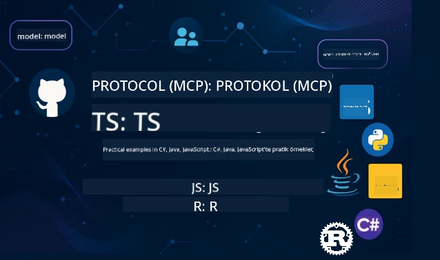

 

[](https://GitHub.com/microsoft/mcp-for-beginners/graphs/contributors)
[](https://GitHub.com/microsoft/mcp-for-beginners/issues)
[](https://GitHub.com/microsoft/mcp-for-beginners/pulls)
[](http://makeapullrequest.com)

[](https://GitHub.com/microsoft/mcp-for-beginners/watchers)
[](https://GitHub.com/microsoft/mcp-for-beginners/fork)
[](https://GitHub.com/microsoft/mcp-for-beginners/stargazers)


[](https://discord.gg/nTYy5BXMWG)

Bu kaynakları kullanmaya başlamak için bu adımları takip edin:
1. **Depoyu Forklayın**: Tıklayın [](https://GitHub.com/microsoft/mcp-for-beginners/fork)
2. **Depoyu Klonlayın**:   `git clone https://github.com/microsoft/mcp-for-beginners.git`
3. **Katılın** [](https://discord.gg/nTYy5BXMWG)


### 🌐 Çok Dilli Destek

#### GitHub Action ile Desteklenir (Otomatik & Her Zaman Güncel)

<!-- CO-OP TRANSLATOR LANGUAGES TABLE START -->
[Arabic](../ar/README.md) | [Bengali](../bn/README.md) | [Bulgarian](../bg/README.md) | [Burmese (Myanmar)](../my/README.md) | [Chinese (Simplified)](../zh-CN/README.md) | [Chinese (Traditional, Hong Kong)](../zh-HK/README.md) | [Chinese (Traditional, Macau)](../zh-MO/README.md) | [Chinese (Traditional, Taiwan)](../zh-TW/README.md) | [Croatian](../hr/README.md) | [Czech](../cs/README.md) | [Danish](../da/README.md) | [Dutch](../nl/README.md) | [Estonian](../et/README.md) | [Finnish](../fi/README.md) | [French](../fr/README.md) | [German](../de/README.md) | [Greek](../el/README.md) | [Hebrew](../he/README.md) | [Hindi](../hi/README.md) | [Hungarian](../hu/README.md) | [Indonesian](../id/README.md) | [Italian](../it/README.md) | [Japanese](../ja/README.md) | [Kannada](../kn/README.md) | [Korean](../ko/README.md) | [Lithuanian](../lt/README.md) | [Malay](../ms/README.md) | [Malayalam](../ml/README.md) | [Marathi](../mr/README.md) | [Nepali](../ne/README.md) | [Nigerian Pidgin](../pcm/README.md) | [Norwegian](../no/README.md) | [Persian (Farsi)](../fa/README.md) | [Polish](../pl/README.md) | [Portuguese (Brazil)](../pt-BR/README.md) | [Portuguese (Portugal)](../pt-PT/README.md) | [Punjabi (Gurmukhi)](../pa/README.md) | [Romanian](../ro/README.md) | [Russian](../ru/README.md) | [Serbian (Cyrillic)](../sr/README.md) | [Slovak](../sk/README.md) | [Slovenian](../sl/README.md) | [Spanish](../es/README.md) | [Swahili](../sw/README.md) | [Swedish](../sv/README.md) | [Tagalog (Filipino)](../tl/README.md) | [Tamil](../ta/README.md) | [Telugu](../te/README.md) | [Thai](../th/README.md) | [Turkish](./README.md) | [Ukrainian](../uk/README.md) | [Urdu](../ur/README.md) | [Vietnamese](../vi/README.md)

> **Yerel Olarak Klonlamayı Tercih Ediyor musunuz?**

> Bu depo 50'den fazla dil çevirisini içerdiğinden indirme boyutu önemli ölçüde artar. Çeviriler olmadan klonlamak için sparse checkout kullanın:
> ```bash
> git clone --filter=blob:none --sparse https://github.com/microsoft/mcp-for-beginners.git
> cd mcp-for-beginners
> git sparse-checkout set --no-cone '/*' '!translations' '!translated_images'
> ```
> Bu, kursu tamamlamak için ihtiyacınız olan her şeyi çok daha hızlı bir indirmenin yanında sağlar.
<!-- CO-OP TRANSLATOR LANGUAGES TABLE END -->

# 🚀 Yeni Başlayanlar İçin Model Context Protocol (MCP) Müfredatı

## **C#, Java, JavaScript, Rust, Python ve TypeScript ile Uygulamalı MCP Öğrenin**

## 🧠 Model Context Protocol Müfredatı Genel Bakış  
Model Context Protocol yolculuğunuza hoş geldiniz! Yapay zeka uygulamalarının farklı araçlar ve hizmetlerle nasıl iletişim kurduğunu merak ettiyseniz, geliştiricilerin akıllı sistemler oluşturma biçimini değiştiren zarif çözümü keşfetmek üzeresiniz.

MCP'yi bir evrensel çevirmen gibi düşünün - USB portlarının bilgisayarınıza herhangi bir cihaz bağlamanızı sağlaması gibi, MCP de yapay zeka modellerinin herhangi bir araç veya hizmete standart bir şekilde bağlanmasına izin verir. İlk sohbet botunuzu oluşturuyor olun ya da karmaşık yapay zeka iş akışları üzerinde çalışın, MCP'yi anlamak daha yetenekli ve esnek uygulamalar yaratma gücü verir.

Bu müfredat öğrenme yolculuğunuz için sabır ve özenle hazırlandı. Zaten anladığınız basit kavramlarla başlayacak ve favori programlama dilinizde uygulamalı pratiklerle uzmanlığınızı adım adım inşa edeceğiz. Her adımda açık açıklamalar, pratik örnekler ve bolca motivasyon bulacaksınız.

Bu yolculuğu tamamladığınızda kendi MCP sunucularınızı oluşturacak, bunları popüler yapay zeka platformlarıyla entegre edecek ve bu teknolojinin yapay zeka gelişiminin geleceğini nasıl şekillendirdiğini anlayacak özgüvene sahip olacaksınız. Haydi bu heyecan verici maceraya birlikte başlayalım!

### Resmi Dokümantasyon ve Spesifikasyonlar

Bu kaynaklar anlayışınız arttıkça daha değerli hale gelir, ancak her şeyi hemen okuma baskısı hissetmeyin. İlginizi en çok çeken alanlardan başlayın!
- 📘 [MCP Dokümantasyonu](https://modelcontextprotocol.io/) – Adım adım öğreticiler ve kullanıcı rehberleri için başvuracağınız temel kaynak. Dokümantasyon yeni başlayanlar için yazıldı, kendi hızınızda takip edebileceğiniz açık örneklerle dolu.
- 📜 [MCP Spesifikasyonu](https://modelcontextprotocol.io/docs/) – Kapsamlı referans el kitabınız olarak düşünün. Müfredatı ilerledikçe spesifik detaylara bakmak ve ileri seviye özellikleri keşfetmek için buraya sıkça döneceksiniz.
- 📜 [Orijinal MCP Spesifikasyonu](https://modelcontextprotocol.io/specification/versioning) – İleri düzey uygulamalar için yararlı olabilecek ek teknik ayrıntılar içeriyor. İhtiyacınız olduğunda orada, ama başlangıçta endişelenmeyin.
- 🧑‍💻 [MCP GitHub Deposu](https://github.com/modelcontextprotocol) – Birden çok programlama dili için SDKlar, araçlar ve kod örnekleri sunar. Pratik örnekler ve kullanıma hazır bileşenlerin hazine sandığı gibi.
- 🌐 [MCP Topluluğu](https://github.com/orgs/modelcontextprotocol/discussions) – MCP hakkında tartışmalar için diğer öğrenenler ve deneyimli geliştiricilerle bir araya gelin. Soruların hoş karşılandığı ve bilginin özgürce paylaşıldığı destekleyici bir topluluk.

## Öğrenme Hedefleri

Bu müfredat sonunda kendinize güvenip heyecan duyacaksınız. İşte başaracaklarınız:

• **MCP temellerini anlayın**: Model Context Protocol'ün ne olduğunu ve yapay zeka uygulamalarının birlikte çalışma şeklini neden dönüştürdüğünü anlayacaksınız. Anlaşılır benzetmeler ve örneklerle.

• **İlk MCP sunucunuzu oluşturun**: Tercih ettiğiniz programlama dilinde çalışan bir MCP sunucusu yaratacaksınız. Basit örneklerle başlayıp adım adım becerilerinizi geliştireceksiniz.

• **Yapay zeka modellerini gerçek araçlara bağlayın**: Yapay zeka modelleri ile gerçek servisler arasındaki köprüyü nasıl kuracağınızı öğrenerek uygulamalarınıza güçlü yeni yetenekler kazandıracaksınız.

• **Güvenlik en iyi uygulamalarını uygulayın**: MCP uygulamalarınızı ve kullanıcılarınızı korumak için güvenliği nasıl sağlayacağınızı anlayacaksınız.

• **Güvenle dağıtım yapın**: MCP projelerinizi geliştirmeden üretime taşımanın pratik dağıtım stratejilerini öğreneceksiniz.

• **MCP topluluğuna katılın**: Yapay zeka uygulama geliştirme geleceğini şekillendiren büyüyen geliştirici topluluğunun bir parçası olacaksınız.

## Temel Arka Plan

MCP detaylarına girmeden önce bazı temel kavramlara aşina olduğunuzdan emin olalım. Bu alanlarda uzman olmanız gerekmez – ihtiyacınız olan her şeyi açıklayacağız!

### Protokolleri Anlamak (Temel)

Bir protokolü bir konuşma kuralları gibi düşünün. Arkadaşınızı aradığınızda her ikiniz de “merhaba” dersiniz, sırayla konuşur ve işiniz bittiğinde “hoşça kal” dersiniz. Bilgisayar programlarının da etkili iletişim için benzer kurallara ihtiyacı vardır.

MCP bir protokoldür – yapay zeka modelleri ve uygulamaların araçlar ve servislerle verimli “konuşmalar” yapmasını sağlayan üzerinde anlaşılan kurallar dizisi. İnsan iletişiminin kurallarla daha akıcı olmasıyla aynı şekilde, MCP de yapay zeka uygulaması iletişimini çok daha güvenilir ve güçlü hale getirir.

### İstemci-Sunucu İlişkileri (Programlar Nasıl Birlikte Çalışır)

Her gün istemci-sunucu ilişkilerini kullanıyorsunuz! Bir web tarayıcısı (istemci) ile bir web sitesini ziyaret ettiğinizde, size sayfa içeriğini gönderen web sunucusuna bağlanırsınız. Tarayıcı bilgi sormayı bilir, sunucu yanıt vermeyi.

MCP’de benzer bir ilişki var: Yapay zeka modelleri bilgi ya da işlem isteyen istemciler olarak, MCP sunucuları da bu yetenekleri sağlayan yardımcılar olarak çalışıyor. Yapay zekanın belirli görevleri yapmasını isteyen yardımsever bir asistana sahip olmak gibi.

### Neden Standartlaşma Önemlidir (Birlikte Çalışabilirlik)

Her araba üreticisinin farklı şekillerde benzin pompası kullandığını hayal edin — her araca ayrı adaptör gerektirirdi! Standartlaşma, ortak yöntemlerde anlaşmak ve her şeyin uyum içinde çalışmasını sağlamak demektir.

MCP, yapay zeka uygulamaları için bu standartlaşmayı sağlar. Her yapay zeka modelinin her araçla uyumlu olmasını sağlayacak ayrı kod yazmak yerine, MCP evrensel bir iletişim yolu oluşturur. Böylece geliştiriciler araçlarını bir kere yapar, birçok farklı yapay zeka sistemiyle çalışmasını sağlar.

## 🧭 Öğrenme Yolunuzun Genel Görünümü

MCP yolculuğunuz özgüveninizi ve becerilerinizi kademeli olarak geliştirecek şekilde dikkatle yapılandırılmıştır. Her aşama yeni kavramlar tanıtırken öğrendiklerinizi pekiştirir.

### 🌱 Temel Aşama: Temel Bilgileri Anlamak (Modüller 0-2)

Macera burada başlıyor! Tanıdık benzetmeler ve basit örneklerle MCP kavramlarını tanıtacağız. MCP’nin ne olduğunu, neden var olduğunu ve yapay zeka geliştirme dünyasında nasıl konumlandığını anlayacaksınız.

• **Modül 0 - MCP’ye Giriş**: MCP’nin ne olduğunu ve günümüz yapay zeka uygulamaları için neden bu kadar önemli olduğunu keşfedeceğiz. MCP’nin gerçek dünya örneklerini görecek ve geliştiricilerin karşılaştığı yaygın problemleri nasıl çözdüğünü anlayacaksınız.

• **Modül 1 - Temel Kavramların Açıklaması**: Burada MCP’nin temel yapı taşlarını öğreneceksiniz. Bu kavramların doğal ve anlaşılır olmasını sağlamak için çok sayıda benzetmeler ve görsel örnekler kullanacağız.

• **Modül 2 - MCP’de Güvenlik**: Güvenlik korkutucu görünebilir, ama MCP’nin yerleşik güvenlik özelliklerini göstereceğiz ve uygulamalarınızı baştan koruyan en iyi uygulamaları öğreteceğiz.

### 🔨 Oluşturma Aşaması: İlk Uygulamalarınızı Yazmak (Modül 3)

Artık asıl eğlence başlıyor! Gerçek MCP sunucuları ve istemcileri kurarak uygulamalı deneyim kazanacaksınız. Endişelenmeyin – basit başlayacak ve her adımda sizi yönlendireceğiz.

Bu modülde tercih ettiğiniz programlama dilinde pratik yapmanızı sağlayan çok sayıda uygulamalı rehber var. İlk sunucunuzu oluşturacak, ona bağlanan bir istemci yazacak ve hatta VS Code gibi popüler geliştirme araçlarıyla entegrasyon yapacaksınız.
Her rehber, tam kod örnekleri, sorun giderme ipuçları ve belirli tasarım seçimlerini neden yaptığımızın açıklamalarını içerir. Bu aşamanın sonunda gurur duyabileceğiniz çalışan MCP uygulamalarına sahip olacaksınız!

### 🚀 Büyüme Aşaması: İleri Düzey Kavramlar ve Gerçek Dünya Uygulamaları (Modüller 4-5)

Temelleri öğrendikten sonra daha gelişmiş MCP özelliklerini keşfetmeye hazırsınız. Pratik uygulama stratejileri, hata ayıklama teknikleri ve çok modlu yapay zeka entegrasyonu gibi ileri konuları ele alacağız.

Ayrıca, MCP uygulamalarını üretim kullanımı için nasıl ölçeklendireceğinizi ve Azure gibi bulut platformlarıyla nasıl entegre edeceğinizi öğreneceksiniz. Bu modüller, gerçek dünya gereksinimlerini karşılayabilecek MCP çözümleri oluşturmanız için sizi hazırlar.

### 🌟 Ustalık Aşaması: Topluluk ve Uzmanlaşma (Modüller 6-11)

Son aşama, MCP topluluğuna katılmaya ve sizi en çok ilgilendiren alanlarda uzmanlaşmaya odaklanır. Açık kaynak MCP projelerine nasıl katkıda bulunacağınızı, gelişmiş kimlik doğrulama desenlerini uygulamayı ve kapsamlı veritabanı entegre çözümler geliştirmeyi öğreneceksiniz.

Modül 11 özellikle önemlidir - PostgreSQL entegrasyonu ile üretime hazır MCP sunucuları oluşturmayı öğreten tam 13 laboratuvardan oluşan kapsamlı bir uygulamalı öğrenme yoludur. Öğrendiklerinizin tamamını bir araya getiren bir bitirme projesi gibidir!

### 📚 Tam Müfredat Yapısı

| Modül | Konu | Açıklama | Bağlantı |
|--------|-------|-------------|------|
| **Modül 1-3: Temeller** | | | |
| 00 | MCP'ye Giriş | Model Context Protocol'un genel görünümü ve AI iş akışlarındaki önemi | [Daha fazlasını oku](./00-Introduction/README.md) |
| 01 | Temel Kavramlar Açıklaması | MCP temel kavramlarının derinlemesine incelenmesi | [Daha fazlasını oku](./01-CoreConcepts/README.md) |
| 02 | MCP'de Güvenlik | Güvenlik tehditleri ve en iyi uygulamalar | [Daha fazlasını oku](./02-Security/README.md) |
| 03 | MCP'ye Başlarken | Ortam kurulumu, temel sunucular/istemciler, entegrasyon | [Daha fazlasını oku](./03-GettingStarted/README.md) |
| **Modül 3: İlk Sunucu ve İstemcinizi Oluşturma** | | | |
| 3.1 | İlk Sunucu | İlk MCP sunucunuzu oluşturun | [Rehber](./03-GettingStarted/01-first-server/README.md) |
| 3.2 | İlk İstemci | Temel bir MCP istemcisi geliştirin | [Rehber](./03-GettingStarted/02-client/README.md) |
| 3.3 | LLM ile İstemci | Büyük dil modelleri entegrasyonu | [Rehber](./03-GettingStarted/03-llm-client/README.md) |
| 3.4 | VS Code Entegrasyonu | VS Code’da MCP sunucularını kullanma | [Rehber](./03-GettingStarted/04-vscode/README.md) |
| 3.5 | stdio Sunucu | stdio taşımayı kullanarak sunucular oluşturma | [Rehber](./03-GettingStarted/05-stdio-server/README.md) |
| 3.6 | HTTP Akışı | MCP’de HTTP akışı uygulama | [Rehber](./03-GettingStarted/06-http-streaming/README.md) |
| 3.7 | AI Araç Takımı | AI Toolkit’i MCP ile kullanma | [Rehber](./03-GettingStarted/07-aitk/README.md) |
| 3.8 | Test | MCP sunucu uygulamanızı test edin | [Rehber](./03-GettingStarted/08-testing/README.md) |
| 3.9 | Dağıtım | MCP sunucularını üretime dağıtma | [Rehber](./03-GettingStarted/09-deployment/README.md) |
| 3.10 | İleri Düzey Sunucu Kullanımı | İleri özellik kullanımı ve gelişmiş mimari için ileri düzey sunucular | [Rehber](./03-GettingStarted/10-advanced/README.md) |
| 3.11 | Basit Kimlik Doğrulama | Başlangıçtan RBAC’a kadar kimlik doğrulamayı gösteren bölüm | [Rehber](./03-GettingStarted/11-simple-auth/README.md) |
| **Modül 4-5: Pratik ve İleri** | | | |
| 04 | Pratik Uygulama | SDK’lar, hata ayıklama, test, yeniden kullanılabilir istem şablonları | [Daha fazlasını oku](./04-PracticalImplementation/README.md) |
| 05 | MCP’de İleri Konular | Çok modlu AI, ölçeklendirme, kurumsal kullanım | [Daha fazlasını oku](./05-AdvancedTopics/README.md) |
| 5.1 | Azure Entegrasyonu | MCP’nin Azure ile entegrasyonu | [Rehber](./05-AdvancedTopics/mcp-integration/README.md) |
| 5.2 | Çok Modluluk | Birden fazla mod ile çalışma | [Rehber](./05-AdvancedTopics/mcp-multi-modality/README.md) |
| 5.3 | OAuth2 Demo | OAuth2 kimlik doğrulaması uygulama | [Rehber](./05-AdvancedTopics/mcp-oauth2-demo/README.md) |
| 5.4 | Kök Bağlamlar | Kök bağlamları anlama ve uygulama | [Rehber](./05-AdvancedTopics/mcp-root-contexts/README.md) |
| 5.5 | Yönlendirme | MCP yönlendirme stratejileri | [Rehber](./05-AdvancedTopics/mcp-routing/README.md) |
| 5.6 | Örnekleme | MCP’de örnekleme teknikleri | [Rehber](./05-AdvancedTopics/mcp-sampling/README.md) |
| 5.7 | Ölçeklendirme | MCP uygulamalarını ölçeklendirme | [Rehber](./05-AdvancedTopics/mcp-scaling/README.md) |
| 5.8 | Güvenlik | İleri güvenlik değerlendirmeleri | [Rehber](./05-AdvancedTopics/mcp-security/README.md) |
| 5.9 | Web Arama | Web arama özellikleri uygulama | [Rehber](./05-AdvancedTopics/web-search-mcp/README.md) |
| 5.10 | Gerçek Zamanlı Akış | Gerçek zamanlı akış işlevselliği oluşturma | [Rehber](./05-AdvancedTopics/mcp-realtimestreaming/README.md) |
| 5.11 | Gerçek Zamanlı Arama | Gerçek zamanlı arama uygulama | [Rehber](./05-AdvancedTopics/mcp-realtimesearch/README.md) |
| 5.12 | Entra ID Kimlik Doğrulama | Microsoft Entra ID ile kimlik doğrulama | [Rehber](./05-AdvancedTopics/mcp-security-entra/README.md) |
| 5.13 | Foundry Entegrasyonu | Azure AI Foundry ile entegrasyon | [Rehber](./05-AdvancedTopics/mcp-foundry-agent-integration/README.md) |
| 5.14 | Bağlam Mühendisliği | Etkili bağlam mühendisliği teknikleri | [Rehber](./05-AdvancedTopics/mcp-contextengineering/README.md) |
| 5.15 | MCP Özel Taşıma | Özel Taşıma uygulamaları | [Rehber](./05-AdvancedTopics/mcp-transport/README.md) |
| **Modül 6-10: Topluluk ve En İyi Uygulamalar** | | | |
| 06 | Topluluk Katkıları | MCP ekosistemine nasıl katkıda bulunulur | [Rehber](./06-CommunityContributions/README.md) |
| 07 | Erken Benimsemeden Alınan Dersler | Gerçek dünya uygulama hikayeleri | [Rehber](./07-LessonsFromEarlyAdoption/README.md) |
| 08 | MCP için En İyi Uygulamalar | Performans, hata toleransı, dayanıklılık | [Rehber](./08-BestPractices/README.md) |
| 09 | MCP Vaka Çalışmaları | Pratik uygulama örnekleri | [Rehber](./09-CaseStudy/README.md) |
| 10 | Uygulamalı Atölye | AI Toolkit ile MCP Sunucusu oluşturma | [Laboratuvar](./10-StreamliningAIWorkflowsBuildingAnMCPServerWithAIToolkit/README.md) |
| **Modül 11: MCP Sunucu Uygulamaları Laboratuvarı** | | | |
| 11 | MCP Sunucu Veritabanı Entegrasyonu | PostgreSQL entegrasyonu için kapsamlı 13 laboratuvarlık uygulamalı öğrenme yolu | [Laboratuvarlar](./11-MCPServerHandsOnLabs/README.md) |
| 11.1 | Giriş | Veritabanı entegrasyonlu MCP genel görünümü ve perakende analitik kullanım örneği | [Laboratuvar 00](./11-MCPServerHandsOnLabs/00-Introduction/README.md) |
| 11.2 | Temel Mimari | MCP sunucu mimarisi, veritabanı katmanları ve güvenlik desenleri | [Laboratuvar 01](./11-MCPServerHandsOnLabs/01-Architecture/README.md) |
| 11.3 | Güvenlik ve Çok Kiracılılık | Satır Düzeyinde Güvenlik, kimlik doğrulama, çok kiracılı veri erişimi | [Laboratuvar 02](./11-MCPServerHandsOnLabs/02-Security/README.md) |
| 11.4 | Ortam Kurulumu | Geliştirme ortamı kurulumu, Docker, Azure kaynakları | [Laboratuvar 03](./11-MCPServerHandsOnLabs/03-Setup/README.md) |
| 11.5 | Veritabanı Tasarımı | PostgreSQL kurulumu, perakende şema tasarımı ve örnek veriler | [Laboratuvar 04](./11-MCPServerHandsOnLabs/04-Database/README.md) |
| 11.6 | MCP Sunucu Uygulaması | Veritabanı entegrasyonlu FastMCP sunucusunun oluşturulması | [Laboratuvar 05](./11-MCPServerHandsOnLabs/05-MCP-Server/README.md) |
| 11.7 | Araç Geliştirme | Veritabanı sorgu araçlarının ve şema incelemesinin oluşturulması | [Laboratuvar 06](./11-MCPServerHandsOnLabs/06-Tools/README.md) |
| 11.8 | Anlamsal Arama | Azure OpenAI ve pgvector ile vektör gömme uygulaması | [Laboratuvar 07](./11-MCPServerHandsOnLabs/07-Semantic-Search/README.md) |
| 11.9 | Test ve Hata Ayıklama | Test stratejileri, hata ayıklama araçları ve doğrulama yöntemleri | [Laboratuvar 08](./11-MCPServerHandsOnLabs/08-Testing/README.md) |
| 11.10 | VS Code Entegrasyonu | VS Code MCP entegrasyonu ve AI Sohbet kullanımı yapılandırması | [Laboratuvar 09](./11-MCPServerHandsOnLabs/09-VS-Code/README.md) |
| 11.11 | Dağıtım Stratejileri | Docker dağıtımı, Azure Container Apps ve ölçeklendirme düşünceleri | [Laboratuvar 10](./11-MCPServerHandsOnLabs/10-Deployment/README.md) |
| 11.12 | İzleme | Application Insights, günlükleme, performans izlemesi | [Laboratuvar 11](./11-MCPServerHandsOnLabs/11-Monitoring/README.md) |
| 11.13 | En İyi Uygulamalar | Performans optimizasyonu, güvenlik sertleştirmesi ve üretim ipuçları | [Laboratuvar 12](./11-MCPServerHandsOnLabs/12-Best-Practices/README.md) |

### 💻 Örnek Kod Projeleri

MCP öğrenmenin en heyecan verici kısımlarından biri kod becerilerinizin kademeli olarak gelişmesini görmek. Kod örneklerimizi, anlayışınız derinleştikçe basitten karmaşığa doğru tasarladık. İşte kavramları sunduğumuz biçim - anlaması kolay ama gerçek MCP prensiplerini gösteren kodlarla, bu kodun ne yaptığını değil, neden bu şekilde yapılandırıldığını ve geniş MCP uygulamalarında nasıl yer aldığını anlayacaksınız.

#### Temel MCP Hesaplayıcı Örnekleri

| Dil | Açıklama | Bağlantı |
|----------|-------------|------|
| C# | MCP Sunucu Örneği | [Kodu Görüntüle](./03-GettingStarted/samples/csharp/README.md) |
| Java | MCP Hesaplayıcı | [Kodu Görüntüle](./03-GettingStarted/samples/java/calculator/README.md) |
| JavaScript | MCP Demo | [Kodu Görüntüle](./03-GettingStarted/samples/javascript/README.md) |
| Python | MCP Sunucu | [Kodu Görüntüle](../../03-GettingStarted/samples/python/mcp_calculator_server.py) |
| TypeScript | MCP Örneği | [Kodu Görüntüle](./03-GettingStarted/samples/typescript/README.md) |
| Rust | MCP Örneği | [Kodu Görüntüle](./03-GettingStarted/samples/rust/README.md) |

#### İleri MCP Uygulamaları

| Dil | Açıklama | Bağlantı |
|----------|-------------|------|
| C# | İleri Düzey Örnek | [Kodu Görüntüle](./04-PracticalImplementation/samples/csharp/README.md) |
| Spring ile Java | Container App Örneği | [Kodu Görüntüle](./04-PracticalImplementation/samples/java/containerapp/README.md) |
| JavaScript | İleri Düzey Örnek | [Kodu Görüntüle](./04-PracticalImplementation/samples/javascript/README.md) |
| Python | Karmaşık Uygulama | [Kodu Görüntüle](../../04-PracticalImplementation/samples/python/READMEmd) |
| TypeScript | Container Örneği | [Kodu Görüntüle](./04-PracticalImplementation/samples/typescript/README.md) |


## 🎯 MCP Öğrenim Önkoşulları

Bu müfredattan en iyi şekilde faydalanmak için:

- En az bir programlama dilinde C#, Java, JavaScript, Python veya TypeScript'te temel bilgi sahibi olmak
- İstemci-sunucu modeli ve API kavramlarını anlamak
- REST ve HTTP kavramlarına aşina olmak
- (Opsiyonel) AI/ML kavramları hakkında temel bilgi sahibi olmak

- Destek için topluluk tartışmalarımıza katılmak

## 📚 Çalışma Rehberi ve Kaynaklar

Bu depo, etkili öğrenmenize ve yol almanıza yardımcı olacak çeşitli kaynaklar içerir:

### Çalışma Rehberi

Bu depoyu etkili kullanmanız için kapsamlı bir [Çalışma Rehberi](./study_guide.md) mevcuttur. Bu görsel müfredat haritası tüm konuların nasıl bağlandığını gösterir ve örnek projelerin nasıl etkin kullanılacağına dair rehberlik sunar. Özellikle genel resmi görmekten hoşlanan görsel öğrenenler için faydalıdır.

Rehber şunları içerir:
- Kapsanan tüm konuları gösteren görsel müfredat haritası
- Her depo bölümünün detaylı açıklaması
- Örnek projelerin nasıl kullanılacağına dair rehberlik
- Farklı yetenek seviyeleri için önerilen öğrenme yolları
- Öğrenme yolculuğunuzu destekleyecek ek kaynaklar

### Değişiklik Günlüğü

Müfredat materyallerindeki tüm önemli güncellemeleri takip ettiğimiz detaylı bir [Değişiklik Günlüğü](./changelog.md) tutuyoruz, böylece en son iyileştirmeler ve eklemeler hakkında güncel kalabilirsiniz.
- Yeni içerik eklemeleri
- Yapısal değişiklikler
- Özellik geliştirmeleri
- Dokümantasyon güncellemeleri

## 🛠️ Bu Müfredatı Etkili Kullanma Yolları

Bu rehberdeki her ders şunları içerir:
1. MCP kavramlarının açık açıklamaları  
2. Birden fazla dilde canlı kod örnekleri  
3. Gerçek MCP uygulamaları oluşturmak için alıştırmalar  
4. İleri düzey öğrenenler için ek kaynaklar

## İstek Üzerine İçerik

### [MCP Dev Days Temmuz 2025](https://developer.microsoft.com/en-us/reactor/series/S-1563/)
#### [➡️İstek Üzerine İzle - MCP Dev Days](https://developer.microsoft.com/en-us/reactor/series/S-1563/)
Model Context Protocol (MCP) için ayrılmış sanal bir etkinlik olan MCP Dev Days'te iki gün boyunca derin teknik içgörü, topluluk bağlantısı ve uygulamalı öğrenmeye hazır olun — Yapay zeka modelleri ile onlara bağlı araçlar arasında köprü kuran ortaya çıkan standart.
MCP Dev Days'i etkinlik sayfamızdan kaydolarak izleyebilirsiniz: https://aka.ms/mcpdevdays.

#### [1. Gün: MCP Verimliliği, Geliştirme Araçları ve Topluluk:](https://developer.microsoft.com/en-us/reactor/series/S-1563/)

MCP'yi geliştirici iş akışınızda kullanmanızı güçlendirmeye ve harika MCP topluluğunu kutlamaya odaklanır. Microsoft ile işbirliği içinde MCP ekosistemini şekillendiren Arcade, Block, Okta ve Neon gibi topluluk üyeleri ve ortaklar bizimle olacak. VS Code, Visual Studio, GitHub Copilot ve popüler topluluk araçları üzerinden gerçek dünya demoları  
Pratik, bağlama odaklı geliştirme iş akışları  
Topluluk öncülüğünde oturumlar ve içgörüler  
MCP ile yeni başlıyor veya halihazırda geliştiriyorsanız, 1. Gün size ilham ve uygulanabilir çıkarımlarla başlangıç yapmanızı sağlar.

#### [2. Gün: MCP Sunucularını Güvenle İnşa Etmek](https://developer.microsoft.com/en-us/reactor/series/S-1563/)

MCP geliştiricileri içindir. MCP sunucuları oluşturma ve MCP'yi AI iş akışlarınıza entegre etme konusunda uygulama stratejileri ve en iyi uygulamalar üzerinde derinlemesine duracağız.

#### Konular şunları içerir:

- MCP Sunucularının oluşturulması ve bunların ajan deneyimlerine entegrasyonu  
- İstem odaklı geliştirme  
- Güvenlik en iyi uygulamaları  
- Functions, ACA ve API Yönetimi gibi yapı taşlarının kullanımı  
- Kayıt uyumu ve araçlar (1P + 3P)

Eğer bir geliştirici, araç yapımcısı veya AI ürün stratejistiyseniz, bu gün ölçeklenebilir, güvenli ve geleceğe hazır MCP çözümleri oluşturmak için ihtiyaç duyduğunuz içgörülerle doludur.

### MCP Boot Camp Ağustos 2025  
MCP sunucuları oluşturmayı, VS Code ile entegrasyon yapmayı ve Azure üzerinde profesyonel dağıtımı, MCP for Beginners müfredatındaki içeriklerle yoğun video oturumlarında öğrenin. Büyük şirketlerin zaten kullandığı bir teknoloji ile pratik becerilerle ayrılın.

#### [➡️İstek Üzerine İzle MCP Bootcamp | İngilizce](https://developer.microsoft.com/en-us/reactor/series/s-1568/)  
#### [➡️İstek Üzerine İzle MCP Bootcamp | Brezilya](https://developer.microsoft.com/en-us/reactor/series/S-1566/)  
#### [➡️İstek Üzerine İzle MCP Bootcamp | İspanyolca](https://developer.microsoft.com/en-us/reactor/series/S-1567/)

### MCP'yi C# ile Öğrenelim - Eğitim Serisi  
Yapay zeka modelleri ile istemci uygulamalar arasındaki etkileşimleri standartlaştırmak için tasarlanmış modern bir çerçeve olan Model Context Protocol (MCP) hakkında öğrenelim. Bu başlangıç dostu oturumda MCP'yi tanıtacak ve ilk MCP sunucunuzu oluşturmanızda size rehberlik edeceğiz.  
#### C#: [https://aka.ms/letslearnmcp-csharp](https://aka.ms/letslearnmcp-csharp)  
#### Java: [https://aka.ms/letslearnmcp-java](https://aka.ms/letslearnmcp-java)  
#### JavaScript: [https://aka.ms/letslearnmcp-javascript](https://aka.ms/letslearnmcp-javascript)  
#### Python: [https://aka.ms/letslearnmcp-python](https://aka.ms/letslearnmcp-python)

## 🎓 MCP Yolculuğunuz Başlıyor

Tebrikler! Programlama becerilerinizi geliştirecek ve sizi yapay zeka geliştirmede en son teknoloji ile bağlayacak heyecan verici bir yolculuğun ilk adımını attınız.

### Zaten Başardıklarınız

Bu tanıtımı okuyarak MCP bilgi temelinizi oluşturmaya başladınız. MCP'nin ne olduğunu, neden önemli olduğunu ve bu müfredatın öğrenme yolculuğunuzu nasıl destekleyeceğini anlıyorsunuz. Bu önemli bir başarı ve bu teknoloji alanındaki uzmanlığınızın başlangıcıdır.

### Önünüzdeki Macera

Modüller ilerledikçe, her uzmanın bir zamanlar acemi olduğunu unutmayın. Şu an karmaşık görünen kavramlar, pratik yaptıkça ve uyguladıkça doğal hale gelecektir. Her küçük adım, gelişim kariyeriniz boyunca size hizmet edecek güçlü yetenekler geliştirir.

### Destek Ağınız

MCP'ye tutkuyla bağlı olan ve başkalarının başarılı olması için yardımcı olmaya istekli öğrenenler ve uzmanlardan oluşan topluluğa katılıyorsunuz. Kodlama sorunlarında takılırsanız ya da önemli bir gelişmeyi paylaşmak isterseniz, topluluk yolculuğunuzu desteklemek için burada.

Yapay zeka uygulamaları oluşturma konusunda sıkışırsanız veya herhangi bir sorunuz olursa, MCP hakkında diğer öğrenenler ve deneyimli geliştiricilerle tartışmalara katılın. Soruların memnuniyetle karşılandığı ve bilginin özgürce paylaşıldığı destekleyici bir topluluktur.

[](https://discord.gg/nTYy5BXMWG)

Ürün geri bildirimi veya geliştirme sırasında hatalarınız olursa ziyaret edin:

[](https://aka.ms/foundry/forum)

### Başlamaya Hazır Mısınız?

MCP maceranız şimdi başlıyor! İlk uygulamalı MCP deneyimlerinize dalmak için Modül 0 ile başlayın veya ne inşa edeceğinizi görmek için örnek projeleri keşfedin. Unutmayın – her uzman tıpkı sizin olduğunuz yerde başladı ve sabırla pratik yaparak neler başarabileceğinize şaşıracaksınız.

Model Context Protocol geliştirme dünyasına hoş geldiniz. Haydi birlikte harika bir şeyler inşa edelim!

## 🤝 Öğrenme Topluluğuna Katkıda Bulunma

Bu müfredat, sizin gibi öğrenenlerin katkıları ile güçlenir! İster bir yazım hatasını düzeltmek, ister daha net bir açıklama önermek ya da yeni bir örnek eklemek olsun, katkılarınız diğer acemilerin başarılı olmasına yardımcı olur.

Kod örnekleriyle katkıda bulunan Microsoft Değerli Profesyoneli [Shivam Goyal](https://www.linkedin.com/in/shivam2003/)'a teşekkür ederiz.

Katkı süreci, hoşgeldiniz ve destekleyicidir. Çoğu katkı için Katkı Sağlayıcı Lisans Sözleşmesi (CLA) gereklidir, ancak otomatik araçlar sizi sürece sorunsuz rehberlik eder.

## 📜 Açık Kaynak Öğrenme

Bu müfredatın tamamı MIT [LİSANSI](../../LICENSE) altında sunulmaktadır, yani özgürce kullanabilir, değiştirebilir ve paylaşabilirsiniz. Bu, MCP bilgisini geliştiriciler için erişilebilir kılma misyonumuzu destekler.

## 🤝 Katkı Yönergeleri

Bu proje katkılara ve önerilere açıktır. Çoğu katkı için, katkınızı kullanmak için hakkınızın olduğunu ve gerçekten hakkı verdiğinizi beyan eden bir Katkı Sağlayıcı Lisans Sözleşmesi (CLA) kabul etmeniz gerekir. Detaylar için bkz: <https://cla.opensource.microsoft.com>.

Bir pull request gönderdiğinizde, CLA botu otomatik olarak CLA sağlamanız gerekip gerekmediğini belirler ve PR'yi uygun şekilde işaretler (örneğin, durum kontrolü, yorum). Bot tarafından verilen talimatları izleyin. Tüm CLA kullanan depo boyunca bunu yalnızca bir kez yapmanız yeterlidir.

Bu proje [Microsoft Açık Kaynak Davranış Kuralları](https://opensource.microsoft.com/codeofconduct/)nu benimsemiştir. Daha fazla bilgi için [Davranış Kuralları SSS](https://opensource.microsoft.com/codeofconduct/faq/) sayfasına bakabilir veya ek sorularınız ve yorumlarınız için [opencode@microsoft.com](mailto:opencode@microsoft.com) ile iletişime geçebilirsiniz.

---

*Model Context Protocol yolculuğunuza başlamaya hazır mısınız? [Modül 00 - MCP'ye Giriş](./00-Introduction/README.md) ile başlayın ve Model Context Protocol geliştirme dünyasında ilk adımlarınızı atın!*

## 🎒 Diğer Kurslar  
Ekibimiz diğer kurslar da üretiyor! Göz atın:

<!-- CO-OP TRANSLATOR OTHER COURSES START -->
### LangChain  
[](https://aka.ms/langchain4j-for-beginners)  
[](https://aka.ms/langchainjs-for-beginners?WT.mc_id=m365-94501-dwahlin)

---

### Azure / Edge / MCP / Agents  
[](https://github.com/microsoft/AZD-for-beginners?WT.mc_id=academic-105485-koreyst)  
[](https://github.com/microsoft/edgeai-for-beginners?WT.mc_id=academic-105485-koreyst)  
[](https://github.com/microsoft/mcp-for-beginners?WT.mc_id=academic-105485-koreyst)  
[](https://github.com/microsoft/ai-agents-for-beginners?WT.mc_id=academic-105485-koreyst)

---

### Generative AI Serisi  
[](https://github.com/microsoft/generative-ai-for-beginners?WT.mc_id=academic-105485-koreyst)  
[-9333EA?style=for-the-badge&labelColor=E5E7EB&color=9333EA)](https://github.com/microsoft/Generative-AI-for-beginners-dotnet?WT.mc_id=academic-105485-koreyst)  
[-C084FC?style=for-the-badge&labelColor=E5E7EB&color=C084FC)](https://github.com/microsoft/generative-ai-for-beginners-java?WT.mc_id=academic-105485-koreyst)  
[-E879F9?style=for-the-badge&labelColor=E5E7EB&color=E879F9)](https://github.com/microsoft/generative-ai-with-javascript?WT.mc_id=academic-105485-koreyst)

---

### Temel Öğrenme  
[](https://aka.ms/ml-beginners?WT.mc_id=academic-105485-koreyst)  
[](https://aka.ms/datascience-beginners?WT.mc_id=academic-105485-koreyst)  
[](https://aka.ms/ai-beginners?WT.mc_id=academic-105485-koreyst)  
[](https://github.com/microsoft/Security-101?WT.mc_id=academic-96948-sayoung)
[](https://aka.ms/webdev-beginners?WT.mc_id=academic-105485-koreyst)
[](https://aka.ms/iot-beginners?WT.mc_id=academic-105485-koreyst)
[](https://github.com/microsoft/xr-development-for-beginners?WT.mc_id=academic-105485-koreyst)

---
 
### Copilot Serisi
[](https://aka.ms/GitHubCopilotAI?WT.mc_id=academic-105485-koreyst)
[](https://github.com/microsoft/mastering-github-copilot-for-dotnet-csharp-developers?WT.mc_id=academic-105485-koreyst)
[](https://github.com/microsoft/CopilotAdventures?WT.mc_id=academic-105485-koreyst)
<!-- CO-OP TRANSLATOR OTHER COURSES END -->

---

<!-- CO-OP TRANSLATOR DISCLAIMER START -->
**Feragatname**:
Bu belge, AI çeviri hizmeti [Co-op Translator](https://github.com/Azure/co-op-translator) kullanılarak çevrilmiştir. Doğruluk için çaba göstersek de, otomatik çevirilerin hatalar veya yanlışlıklar içerebileceğini lütfen unutmayınız. Orijinal belge, kendi ana dilindeki haliyle yetkili kaynak olarak kabul edilmelidir. Kritik bilgiler için profesyonel insan çevirisi önerilir. Bu çevirinin kullanımı sonucu oluşabilecek yanlış anlamalar veya yorum farklılıklarından dolayı sorumluluk kabul edilmemektedir.
<!-- CO-OP TRANSLATOR DISCLAIMER END -->