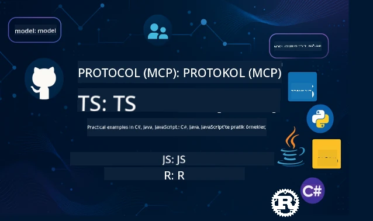

 

[](https://GitHub.com/microsoft/mcp-for-beginners/graphs/contributors)
[](https://GitHub.com/microsoft/mcp-for-beginners/issues)
[](https://GitHub.com/microsoft/mcp-for-beginners/pulls)
[](http://makeapullrequest.com)

[](https://GitHub.com/microsoft/mcp-for-beginners/watchers)
[](https://GitHub.com/microsoft/mcp-for-beginners/fork)
[](https://GitHub.com/microsoft/mcp-for-beginners/stargazers)


[](https://discord.gg/nTYy5BXMWG)

Bu kaynakları kullanmaya başlamak için şu adımları izleyin:
1. **Depoyu Fork’layın**: Tıklayın [](https://GitHub.com/microsoft/mcp-for-beginners/fork)
2. **Depoyu Klonlayın**:   `git clone https://github.com/microsoft/mcp-for-beginners.git`
3. **Katılın** [](https://discord.gg/nTYy5BXMWG)


### 🌐 Çok Dilli Destek

#### GitHub Action ile Desteklenmektedir (Otomatik & Her Zaman Güncel)

<!-- CO-OP TRANSLATOR LANGUAGES TABLE START -->
[Arabic](../ar/README.md) | [Bengali](../bn/README.md) | [Bulgarian](../bg/README.md) | [Burmese (Myanmar)](../my/README.md) | [Chinese (Simplified)](../zh-CN/README.md) | [Chinese (Traditional, Hong Kong)](../zh-HK/README.md) | [Chinese (Traditional, Macau)](../zh-MO/README.md) | [Chinese (Traditional, Taiwan)](../zh-TW/README.md) | [Croatian](../hr/README.md) | [Czech](../cs/README.md) | [Danish](../da/README.md) | [Dutch](../nl/README.md) | [Estonian](../et/README.md) | [Finnish](../fi/README.md) | [French](../fr/README.md) | [German](../de/README.md) | [Greek](../el/README.md) | [Hebrew](../he/README.md) | [Hindi](../hi/README.md) | [Hungarian](../hu/README.md) | [Indonesian](../id/README.md) | [Italian](../it/README.md) | [Japanese](../ja/README.md) | [Kannada](../kn/README.md) | [Korean](../ko/README.md) | [Lithuanian](../lt/README.md) | [Malay](../ms/README.md) | [Malayalam](../ml/README.md) | [Marathi](../mr/README.md) | [Nepali](../ne/README.md) | [Nigerian Pidgin](../pcm/README.md) | [Norwegian](../no/README.md) | [Persian (Farsi)](../fa/README.md) | [Polish](../pl/README.md) | [Portuguese (Brazil)](../pt-BR/README.md) | [Portuguese (Portugal)](../pt-PT/README.md) | [Punjabi (Gurmukhi)](../pa/README.md) | [Romanian](../ro/README.md) | [Russian](../ru/README.md) | [Serbian (Cyrillic)](../sr/README.md) | [Slovak](../sk/README.md) | [Slovenian](../sl/README.md) | [Spanish](../es/README.md) | [Swahili](../sw/README.md) | [Swedish](../sv/README.md) | [Tagalog (Filipino)](../tl/README.md) | [Tamil](../ta/README.md) | [Telugu](../te/README.md) | [Thai](../th/README.md) | [Turkish](./README.md) | [Ukrainian](../uk/README.md) | [Urdu](../ur/README.md) | [Vietnamese](../vi/README.md)

> **Yerelde Klonlamayı mı Tercih Edersiniz?**
>
> Bu depo, 50’den fazla dil çevirisi içerir ve bu da indirme boyutunu önemli ölçüde artırır. Çeviriler olmadan klonlamak için sparse checkout kullanabilirsiniz:
>
> **Bash / macOS / Linux:**
> ```bash
> git clone --filter=blob:none --sparse https://github.com/microsoft/mcp-for-beginners.git
> cd mcp-for-beginners
> git sparse-checkout set --no-cone '/*' '!translations' '!translated_images'
> ```
>
> **CMD (Windows):**
> ```cmd
> git clone --filter=blob:none --sparse https://github.com/microsoft/mcp-for-beginners.git
> cd mcp-for-beginners
> git sparse-checkout set --no-cone "/*" "!translations" "!translated_images"
> ```
>
> Böylece kursu tamamlamak için ihtiyacınız olan her şeye çok daha hızlı erişirsiniz.
<!-- CO-OP TRANSLATOR LANGUAGES TABLE END -->

# 🚀 Başlangıç Seviyesi Model Context Protocol (MCP) Müfredatı

## **MCP’yi C#, Java, JavaScript, Rust, Python ve TypeScript ile Uygulamalı Kod Örnekleriyle Öğrenin**

## 🧠 Model Context Protocol Müfredatına Genel Bakış
Model Context Protocol yolculuğunuza hoş geldiniz! AI uygulamalarının farklı araçlar ve servislerle nasıl iletişim kurduğunu hiç merak ettiyseniz, geliştiricilerin akıllı sistemler oluşturma şekillerini dönüştüren zarif çözümü keşfetmek üzeresiniz.

MCP’yi AI uygulamaları için evrensel bir çevirmen olarak düşünebilirsiniz — tıpkı USB portlarının herhangi bir cihazı bilgisayarınıza bağlamanızı sağlaması gibi, MCP de AI modellerinin herhangi bir araç veya servisle standart bir şekilde bağlantı kurmasını sağlar. İlk sohbet botunuzu inşa etseniz de karmaşık AI iş akışları üzerinde çalışıyor olsanız da, MCP’yi anlamak size daha yetenekli ve esnek uygulamalar geliştirme gücü verecektir.

Bu müfredat, öğrenme yolculuğunuz için sabır ve özenle tasarlanmıştır. Halihazırda anladığınız basit kavramlarla başlayacağız ve favori programlama dilinizde uygulamalı pratikle uzmanlığınızı kademeli olarak artıracağız. Her adımda net açıklamalar, pratik örnekler ve bolca teşvik yer alır.

Bu yolculuğu tamamladığınızda, kendi MCP sunucularınızı oluşturma, bunları popüler AI platformlarıyla entegre etme ve bu teknolojinin AI geliştirme geleceğini nasıl şekillendirdiğini anlama konusunda güven sahibi olacaksınız. Haydi bu heyecan verici maceraya birlikte başlayalım!

### Resmi Belgeler ve Spesifikasyonlar

Bu müfredat, **MCP Spesifikasyonu 2025-11-25** (en güncel stabil sürüm) ile uyumludur. MCP spesifikasyonu, protokol sürüm takibini net yapmak için tarih tabanlı sürümler (YYYY-MM-DD formatı) kullanır.

Bu kaynaklar, anlayışınız arttıkça daha değerli hale gelir, ancak her şeyi hemen okumak için kendinizi zorlamayın. İlginizi çeken bölümlerle başlayın!
- 📘 [MCP Dokümantasyonu](https://modelcontextprotocol.io/) – Adım adım eğitimler ve kullanıcı kılavuzları için başvuracağınız ana kaynaktır. Dokümantasyon, yeni başlayanlar düşünülerek yazılmıştır ve kendi hızınızda takip edebileceğiniz net örnekler sunar.
- 📜 [MCP Spesifikasyonu](https://modelcontextprotocol.io/specification/2025-11-25) – Bu, kapsamlı referans kılavuzunuz gibidir. Müfredatı ilerledikçe, burada belirli detayları kontrol etmek ve gelişmiş özellikleri keşfetmek için geri döneceksiniz.
- 📜 [MCP Spesifikasyon Sürümleme](https://modelcontextprotocol.io/specification/versioning) – Protokol sürüm geçmişi ve MCP’nin tarih tabanlı sürümlemeyi (YYYY-MM-DD formatı) nasıl kullandığı hakkında bilgi içerir.
- 🧑‍💻 [MCP GitHub Deposu](https://github.com/modelcontextprotocol) – Burada birden fazla programlama dilinde SDK’lar, araçlar ve kod örnekleri bulabilirsiniz. Pratik örnekler ve kullanıma hazır bileşenlerin bir hazinesi gibidir.
- 🌐 [MCP Topluluğu](https://github.com/orgs/modelcontextprotocol/discussions) – MCP hakkında diğer öğrenenler ve deneyimli geliştiricilerle tartışmalara katılın. Soruların hoş karşılandığı ve bilginin özgürce paylaşıldığı destekleyici bir topluluktur.
  
## Öğrenme Hedefleri

Bu müfredatın sonunda, yeni becerilerinizden emin ve heyecanlı hissedeceksiniz. İşte kazanacaklarınız:

• **MCP temelini anlayın**: Model Context Protocol’ün ne olduğunu ve AI uygulamalarının birlikte çalışma biçimini nasıl devrimleştirdiğini, anlamlı benzetmeler ve örneklerle kavrayacaksınız.

• **İlk MCP sunucunuzu oluşturun**: Tercih ettiğiniz programlama dilinde çalışan bir MCP sunucusu geliştireceksiniz; basit örneklerle başlayıp adım adım becerilerinizi geliştireceksiniz.

• **AI modellerini gerçek araçlara bağlayın**: AI modelleri ile gerçek servisler arasındaki boşluğu nasıl köprüleyeceğinizi öğrenecek, uygulamalarınıza güçlü yeni yetenekler katacaksınız.

• **Güvenlik en iyi uygulamalarını uygulayın**: MCP uygulamalarınızı ve kullanıcılarınızı koruyacak güvenlik önlemlerini nasıl hayata geçireceğinizi anlayacaksınız.

• **Güvenle dağıtım yapın**: MCP projelerinizi geliştirmeden üretime taşıyacak, gerçek dünyada çalışan pratik dağıtım stratejilerini bileceksiniz.

• **MCP topluluğuna katılın**: AI uygulama geliştirme geleceğini şekillendiren büyüyen bir geliştirici topluluğunun parçası olacaksınız.

## Temel Arka Plan

MCP ayrıntılarına geçmeden önce, bazı temel kavramlarla rahat olmanızı sağlayalım. Bu alanlarda uzman olmasanız da endişelenmeyin — ihtiyacınız olan her şeyi size adım adım açıklayacağız!

### Protokolleri Anlamak (Temel)

Bir protokolü, bir konuşmanın kuralları gibi düşünün. Bir arkadaşınızı aradığınızda, cevap verirken "merhaba" dediğinizi, sırasıyla konuştuğunuzu ve işiniz bittiğinde "hoşça kal" dediğinizi bilirsiniz. Bilgisayar programlarının da etkili iletişim için benzer kurallara ihtiyacı vardır.

MCP bir protokoldür — AI modelleri ve uygulamaların araçlar ve servislerle üretken "konuşmalar" yapmasını sağlayan üzerinde anlaşılmış kurallar dizisi. İnsan iletişimini daha akıcı yapan konuşma kuralları gibi, MCP de AI uygulamalarının iletişimini çok daha güvenilir ve güçlü yapar.

### İstemci-Sunucu İlişkileri (Programların Birlikte Çalışması)

Günde kullandığınız istemci-sunucu ilişkileri var! Bir web tarayıcısı (istemci) kullanarak bir web sitesini ziyaret ettiğinizde, size sayfa içeriğini gönderen bir web sunucusuna bağlanırsınız. Tarayıcı bilgi istemeyi bilir, sunucu da nasıl cevap vereceğini bilir.

MCP’de benzer bir ilişki vardır: AI modelleri bilgi veya işlem talep eden istemciler gibi davranırken, MCP sunucuları bu yetenekleri sağlar. AI’nın belirli görevleri yapması için yardımcı bir asistan (sunucu) varmış gibi düşünebilirsiniz.

### Standardizasyon Neden Önemlidir (Birlikte Çalışabilirliği Sağlamak)

Her araba üreticisi farklı şekillerde yakıt pompası kullansa — her araca farklı bir adaptör gerekirdi! Standardizasyon, her şeyin uyumlu çalışması için ortak yaklaşımlarda anlaşmak demektir.

MCP, AI uygulamaları için bu standardı sağlar. Her AI modelinin her araçla özel kod yazması yerine, MCP evrensel ve ortak bir iletişim yolu yaratır. Böylece geliştiriciler bir kez araç yapabilir ve çok sayıda farklı AI sistemiyle çalışmasını sağlar.

## 🧭 Öğrenme Yolculuğunuzun Genel Görünümü

MCP yolculuğunuz, güveninizi ve becerilerinizi aşama aşama geliştirecek şekilde dikkatlice yapılandırılmıştır. Her aşama yeni kavramlar tanıtırken, öğrendiklerinizi pekiştirir.

### 🌱 Temel Aşaması: Temelleri Anlamak (Modüller 0-2)

Macera burada başlıyor! MCP kavramlarını tanıtan, tanıdık benzetmeler ve basit örnekler kullanacağız. MCP’nin ne olduğunu, neden var olduğunu ve AI geliştirme dünyasında nasıl yer aldığını anlayacaksınız.

• **Modül 0 - MCP’ye Giriş**: MCP’nin ne olduğunu ve modern AI uygulamaları için neden bu kadar önemli olduğunu keşfedeceğiz. MCP’nin gerçek dünyada nasıl kullanıldığına dair örnekler görecek ve geliştiricilerin karşılaştığı yaygın problemleri nasıl çözdüğünü anlayacaksınız.

• **Modül 1 - Temel Kavramların Açıklaması**: MCP’nin temel yapı taşlarını öğreneceksiniz. Bu kavramların doğal ve anlaşılır olması için bolca benzetme ve görsel örnek kullanacağız.

• **Modül 2 - MCP’de Güvenlik**: Güvenlik göz korkutucu gelebilir, ancak MCP’nin dahili güvenlik özelliklerini nasıl içerdiğini ve uygulamalarınızı baştan itibaren korumak için en iyi uygulamaları nasıl öğreneceğinizi göstereceğiz.

### 🔨 İnşa Aşaması: İlk Uygulamalarınızı Yaratmak (Modül 3)

İşte gerçek eğlence başlıyor! Gerçek MCP sunucuları ve istemcileri oluşturma konusunda uygulamalı deneyim kazanacaksınız. Endişelenmeyin — basit başlayacak ve sizi her adımda yönlendireceğiz.
Bu modül, tercih ettiğiniz programlama dilinde pratik yapmanızı sağlayan birden çok uygulamalı rehber içerir. İlk sunucunuzu oluşturacak, ona bağlanmak için bir istemci geliştirecek ve hatta VS Code gibi popüler geliştirme araçlarıyla entegrasyon yapacaksınız.

Her rehber, eksiksiz kod örnekleri, sorun giderme ipuçları ve belirli tasarım seçimlerini neden yaptığımıza dair açıklamalar içerir. Bu aşamanın sonunda gurur duyabileceğiniz çalışan MCP uygulamalarına sahip olacaksınız!

### 🚀 Gelişim Aşaması: İleri Düzey Kavramlar ve Gerçek Dünya Uygulamaları (Modüller 4-5)

Temelleri öğrendikten sonra, daha sofistike MCP özelliklerini keşfetmeye hazırsınız. Pratik uygulama stratejileri, hata ayıklama teknikleri ve çok modlu yapay zeka entegrasyonu gibi ileri konuları ele alacağız.

Ayrıca MCP uygulamalarınızı üretim kullanımı için ölçeklendirmeyi ve Azure gibi bulut platformlarıyla entegrasyon yapmayı öğreneceksiniz. Bu modüller, gerçek dünya gereksinimlerini karşılayabilecek MCP çözümleri oluşturmanıza hazırlık sağlar.

### 🌟 Ustalık Aşaması: Topluluk ve Uzmanlaşma (Modüller 6-11)

Son aşama, MCP topluluğuna katılmaya ve sizi en çok ilgilendiren alanlarda uzmanlaşmaya odaklanır. Açık kaynak MCP projelerine nasıl katkıda bulunacağınızı, ileri düzey kimlik doğrulama desenlerini uygulamayı ve kapsamlı veritabanı entegre çözümler oluşturmayı öğreneceksiniz.

Modül 11 özel bir öneme sahiptir - PostgreSQL entegrasyonu ile üretime hazır MCP sunucuları oluşturmayı öğreten 13 laboratuvardan oluşan tam bir uygulamalı öğrenme yoludur. Öğrendiklerinizin hepsini biraraya getiren bir kapanış projesi gibidir!

### 📚 Tam Müfredat Yapısı

| Modül | Konu | Açıklama | Bağlantı |
|--------|-------|-------------|------|
| **Modül 0-3: Temeller** | | | |
| 00 | MCP'ye Giriş | Model Bağlam Protokolünün genel bakışı ve AI boru hatlarındaki önemi | [Devamını oku](./00-Introduction/README.md) |
| 01 | Temel Kavramlar Açıklaması | MCP temel kavramlarının derinlemesine açıklaması | [Devamını oku](./01-CoreConcepts/README.md) |
| 02 | MCP'de Güvenlik | Güvenlik tehditleri ve en iyi uygulamalar | [Devamını oku](./02-Security/README.md) |
| 03 | MCP ile Başlangıç | Ortam kurulumu, temel sunucular/istemciler, entegrasyon | [Devamını oku](./03-GettingStarted/README.md) |
| **Modül 3: İlk Sunucunuzu ve İstemcinizi Oluşturma** | | | |
| 3.1 | İlk Sunucu | İlk MCP sunucunuzu oluşturun | [Rehber](./03-GettingStarted/01-first-server/README.md) |
| 3.2 | İlk İstemci | Temel bir MCP istemcisi geliştirin | [Rehber](./03-GettingStarted/02-client/README.md) |
| 3.3 | LLM ile İstemci | Büyük dil modelleri entegrasyonu | [Rehber](./03-GettingStarted/03-llm-client/README.md) |
| 3.4 | VS Code Entegrasyonu | VS Code'da MCP sunucularını kullanma | [Rehber](./03-GettingStarted/04-vscode/README.md) |
| 3.5 | stdio Sunucu | stdio taşıma kullanarak sunucu oluşturma | [Rehber](./03-GettingStarted/05-stdio-server/README.md) |
| 3.6 | HTTP Akışı | MCP'de HTTP akışı uygulaması | [Rehber](./03-GettingStarted/06-http-streaming/README.md) |
| 3.7 | AI Araç Kiti | MCP ile AI Araç Kitini kullanma | [Rehber](./03-GettingStarted/07-aitk/README.md) |
| 3.8 | Test Etme | MCP sunucu uygulamanızı test edin | [Rehber](./03-GettingStarted/08-testing/README.md) |
| 3.9 | Yayınlama | MCP sunucularını üretime dağıtma | [Rehber](./03-GettingStarted/09-deployment/README.md) |
| 3.10 | Gelişmiş sunucu kullanımı | Gelişmiş özellik kullanımı ve gelişmiş mimari için gelişmiş sunucular | [Rehber](./03-GettingStarted/10-advanced/README.md) |
| 3.11 | Basit kimlik doğrulama | Başlangıçtan itibaren kimlik doğrulamayı ve RBAC'yi gösteren bir bölüm | [Rehber](./03-GettingStarted/11-simple-auth/README.md) |
| 3.12 | MCP Hosts | Claude Desktop, Cursor, Cline ve diğer MCP hostlarını yapılandırma | [Rehber](./03-GettingStarted/12-mcp-hosts/README.md) |
| 3.13 | MCP Inspector | Inspector aracı ile MCP sunucularını hata ayıklama ve test etme | [Rehber](./03-GettingStarted/13-mcp-inspector/README.md) |
| 3.14 | Sampling | İstemci ile işbirliği için örnekleme kullanımı | [Rehber](./03-GettingStarted/14-sampling/README.md) |
| 3.15 | MCP Uygulamaları | MCP Uygulamaları oluşturma | [Rehber](./03-GettingStarted/15-mcp-apps/README.md) |
| **Modül 4-5: Pratik & İleri Düzey** | | | |
| 04 | Pratik Uygulama | SDK’lar, hata ayıklama, test, yeniden kullanılabilir prompt şablonları | [Devamını oku](./04-PracticalImplementation/README.md) |
| 4.1 | Sayfalama | İmleç tabanlı sayfalama ile büyük sonuç kümelerini işleme | [Rehber](./04-PracticalImplementation/pagination/README.md) |
| 05 | MCP'de İleri Konular | Çok modlu AI, ölçeklendirme, kurumsal kullanım | [Devamını oku](./05-AdvancedTopics/README.md) |
| 5.1 | Azure Entegrasyonu | MCP'nin Azure ile entegrasyonu | [Rehber](./05-AdvancedTopics/mcp-integration/README.md) |
| 5.2 | Çok modluluk | Birden çok modalite ile çalışma | [Rehber](./05-AdvancedTopics/mcp-multi-modality/README.md) |
| 5.3 | OAuth2 Demo | OAuth2 kimlik doğrulama uygulaması | [Rehber](./05-AdvancedTopics/mcp-oauth2-demo/README.md) |
| 5.4 | Kök Bağlamlar | Kök bağlamların anlaşılması ve uygulanması | [Rehber](./05-AdvancedTopics/mcp-root-contexts/README.md) |
| 5.5 | Yönlendirme | MCP yönlendirme stratejileri | [Rehber](./05-AdvancedTopics/mcp-routing/README.md) |
| 5.6 | Örnekleme | MCP'de örnekleme teknikleri | [Rehber](./05-AdvancedTopics/mcp-sampling/README.md) |
| 5.7 | Ölçeklendirme | MCP uygulamalarını ölçeklendirme | [Rehber](./05-AdvancedTopics/mcp-scaling/README.md) |
| 5.8 | Güvenlik | İleri güvenlik hususları | [Rehber](./05-AdvancedTopics/mcp-security/README.md) |
| 5.9 | Web Araması | Web arama yetenekleri uygulama | [Rehber](./05-AdvancedTopics/web-search-mcp/README.md) |
| 5.10 | Gerçek Zamanlı Akış | Gerçek zamanlı akış işlevselliği oluşturma | [Rehber](./05-AdvancedTopics/mcp-realtimestreaming/README.md) |
| 5.11 | Gerçek Zamanlı Arama | Gerçek zamanlı arama uygulama | [Rehber](./05-AdvancedTopics/mcp-realtimesearch/README.md) |
| 5.12 | Entra ID Kimlik Doğrulama | Microsoft Entra ID ile kimlik doğrulama | [Rehber](./05-AdvancedTopics/mcp-security-entra/README.md) |
| 5.13 | Foundry Entegrasyonu | Azure AI Foundry ile entegrasyon | [Rehber](./05-AdvancedTopics/mcp-foundry-agent-integration/README.md) |
| 5.14 | Bağlam Mühendisliği | Etkili bağlam mühendisliği teknikleri | [Rehber](./05-AdvancedTopics/mcp-contextengineering/README.md) |
| 5.15 | MCP Özel Taşıma | Özel taşıma uygulamaları | [Rehber](./05-AdvancedTopics/mcp-transport/README.md) |
| 5.16 | Protokol Özellikleri | İlerleme bildirimleri, iptal, kaynak şablonları | [Rehber](./05-AdvancedTopics/mcp-protocol-features/README.md) |
| **Modül 6-10: Topluluk & En İyi Uygulamalar** | | | |
| 06 | Topluluk Katkıları | MCP ekosistemine nasıl katkıda bulunulur | [Rehber](./06-CommunityContributions/README.md) |
| 07 | Erken Benimsemeden Alınan Dersler | Gerçek dünya uygulama hikayeleri | [Rehber](./07-LessonsfromEarlyAdoption/README.md) |
| 08 | MCP İçin En İyi Uygulamalar | Performans, hata toleransı, dayanıklılık | [Rehber](./08-BestPractices/README.md) |
| 09 | MCP Vaka Çalışmaları | Pratik uygulama örnekleri | [Rehber](./09-CaseStudy/README.md) |
| 10 | Uygulamalı Atölye | AI Araç Kiti ile MCP Sunucu Oluşturma | [Laboratuvar](./10-StreamliningAIWorkflowsBuildingAnMCPServerWithAIToolkit/README.md) |
| **Modül 11: MCP Sunucu Uygulamalı Laboratuvar** | | | |
| 11 | MCP Sunucu Veritabanı Entegrasyonu | PostgreSQL entegrasyonu için kapsamlı 13 laboratuvarlık uygulamalı öğrenme yolu | [Laboratuvarlar](./11-MCPServerHandsOnLabs/README.md) |
| 11.1 | Giriş | Veritabanı entegrasyonu ve perakende analiz kullanım senaryosuna genel bakış | [Laboratuvar 00](./11-MCPServerHandsOnLabs/00-Introduction/README.md) |
| 11.2 | Temel Mimari | MCP sunucu mimarisi, veritabanı katmanları ve güvenlik desenleri | [Laboratuvar 01](./11-MCPServerHandsOnLabs/01-Architecture/README.md) |
| 11.3 | Güvenlik & Çok Kiracılık | Satır Düzeyi Güvenlik, kimlik doğrulama ve çok kiracılı veri erişimi | [Laboratuvar 02](./11-MCPServerHandsOnLabs/02-Security/README.md) |
| 11.4 | Ortam Kurulumu | Geliştirme ortamı kurulumu, Docker, Azure kaynakları | [Laboratuvar 03](./11-MCPServerHandsOnLabs/03-Setup/README.md) |
| 11.5 | Veritabanı Tasarımı | PostgreSQL kurulumu, perakende şema tasarımı ve örnek veriler | [Laboratuvar 04](./11-MCPServerHandsOnLabs/04-Database/README.md) |
| 11.6 | MCP Sunucu Uygulaması | Veritabanı entegrasyonlu FastMCP sunucusunun oluşturulması | [Laboratuvar 05](./11-MCPServerHandsOnLabs/05-MCP-Server/README.md) |
| 11.7 | Araç Geliştirme | Veritabanı sorgu araçları ve şema incelemesi oluşturma | [Laboratuvar 06](./11-MCPServerHandsOnLabs/06-Tools/README.md) |
| 11.8 | Semantik Arama | Azure OpenAI ve pgvector ile vektör gömme uygulama | [Laboratuvar 07](./11-MCPServerHandsOnLabs/07-Semantic-Search/README.md) |
| 11.9 | Test & Hata Ayıklama | Test stratejileri, hata ayıklama araçları ve doğrulama yöntemleri | [Laboratuvar 08](./11-MCPServerHandsOnLabs/08-Testing/README.md) |
| 11.10 | VS Code Entegrasyonu | VS Code MCP entegrasyonu ve AI Sohbet kullanımının yapılandırılması | [Laboratuvar 09](./11-MCPServerHandsOnLabs/09-VS-Code/README.md) |
| 11.11 | Yayınlama Stratejileri | Docker dağıtımı, Azure Container Apps ve ölçeklendirme hususları | [Laboratuvar 10](./11-MCPServerHandsOnLabs/10-Deployment/README.md) |
| 11.12 | İzleme | Application Insights, günlük kaydı, performans izleme | [Laboratuvar 11](./11-MCPServerHandsOnLabs/11-Monitoring/README.md) |
| 11.13 | En İyi Uygulamalar | Performans optimizasyonu, güvenlik sertleştirmesi ve üretim ipuçları | [Laboratuvar 12](./11-MCPServerHandsOnLabs/12-Best-Practices/README.md) |

### 💻 Örnek Kod Projeleri

MCP öğrenmenin en heyecan verici kısımlarından biri, kod becerilerinizin aşamalı olarak gelişimini görmek. Kod örneklerimizi, basitten başlayıp anlayışınız derinleştikçe daha sofistike hale gelecek şekilde tasarladık. İşte kavramları tanıtma şeklimiz - anlaması kolay ancak gerçek MCP prensiplerini gösteren kodlarla bu kodların ne yaptığını değil, neden böyle yapılandırıldığını ve daha büyük MCP uygulamalarına nasıl uyduğunu anlayacaksınız.

#### Temel MCP Hesaplayıcı Örnekleri

| Dil | Açıklama | Bağlantı |
|----------|-------------|------|
| C# | MCP Sunucu Örneği | [Koda Bak](./03-GettingStarted/samples/csharp/README.md) |
| Java | MCP Hesaplayıcı | [Koda Bak](./03-GettingStarted/samples/java/calculator/README.md) |
| JavaScript | MCP Demo | [Koda Bak](./03-GettingStarted/samples/javascript/README.md) |
| Python | MCP Sunucu | [Koda Bak](../../03-GettingStarted/samples/python/mcp_calculator_server.py) |
| TypeScript | MCP Örneği | [Koda Bak](./03-GettingStarted/samples/typescript/README.md) |
| Rust | MCP Örneği | [Koda Bak](./03-GettingStarted/samples/rust/README.md) |

#### İleri MCP Uygulamaları

| Dil | Açıklama | Bağlantı |
|----------|-------------|------|
| C# | İleri Düzey Örnek | [Koda Bak](./04-PracticalImplementation/samples/csharp/README.md) |
| Spring ile Java | Container Uygulama Örneği | [Koda Bak](./04-PracticalImplementation/samples/java/containerapp/README.md) |
| JavaScript | İleri Düzey Örnek | [Koda Bak](./04-PracticalImplementation/samples/javascript/README.md) |
| Python | Karmaşık Uygulama | [Koda Bak](./04-PracticalImplementation/samples/python/README.md) |
| TypeScript | Container Örneği | [Koda Bak](./04-PracticalImplementation/samples/typescript/README.md) |


## 🎯 MCP Öğrenme İçin Ön Gereksinimler

Bu müfredattan en iyi şekilde faydalanmak için:
- En az bir programlama dilinde temel bilgi: C#, Java, JavaScript, Python veya TypeScript
- İstemci-sunucu modeli ve API'lerin anlaşılması
- REST ve HTTP kavramlarına aşinalık
- (İsteğe bağlı) Yapay Zeka/Makine Öğrenimi kavramlarında temel bilgi

- Destek için topluluk tartışmalarımıza katılmak

## 📚 Çalışma Rehberi ve Kaynaklar

Bu depo, etkili bir şekilde gezinmenize ve öğrenmenize yardımcı olacak çeşitli kaynaklar içerir:

### Çalışma Rehberi

Bu depoda gezinmenize yardımcı olacak kapsamlı bir [Çalışma Rehberi](./study_guide.md) mevcuttur. Bu görsel müfredat haritası, tüm konuların nasıl bağlandığını gösterir ve örnek projeleri nasıl etkili kullanacağınız konusunda rehberlik sağlar. Görsel öğrenmeyi sevenler için, büyük resmi görmek açısından özellikle faydalıdır.

Rehber şunları içerir:
- Kapsanan tüm konuları gösteren görsel müfredat haritası
- Her depo bölümünün detaylı açıklaması
- Örnek projelerin nasıl kullanılacağına dair rehberlik
- Farklı beceri seviyeleri için önerilen öğrenme yolları
- Öğrenme yolculuğunuzu tamamlayıcı ek kaynaklar

### Değişiklik Günlüğü

Müfredat materyallerindeki tüm önemli güncellemeleri takip eden detaylı bir [Değişiklik Günlüğü](./changelog.md) tutuyoruz, böylece en son iyileştirmeler ve eklemelerden haberdar olabilirsiniz.
- Yeni içerik eklemeleri
- Yapısal değişiklikler
- Özellik iyileştirmeleri
- Dokümantasyon güncellemeleri

## 🛠️ Bu Müfredatı Etkili Kullanma

Bu rehberdeki her ders şunları içerir:

1. MCP kavramlarının net açıklamaları  
2. Birden fazla dilde canlı kod örnekleri  
3. Gerçek MCP uygulamaları oluşturmak için egzersizler  
4. İleri düzey öğrenenler için ek kaynaklar

### C# ile MCP Öğrenelim - Eğitim Serisi
Model Context Protocol (MCP) hakkında öğrenelim; AI modelleri ile istemci uygulamalar arasındaki etkileşimleri standartlaştırmak için tasarlanmış öncü bir çerçevedir. Bu başlangıç dostu oturumda, MCP'yi tanıtacak ve ilk MCP sunucunuzu oluşturmanızda size rehberlik edeceğiz.
#### C#: [https://aka.ms/letslearnmcp-csharp](https://aka.ms/letslearnmcp-csharp)
#### Java: [https://aka.ms/letslearnmcp-java](https://aka.ms/letslearnmcp-java)
#### JavaScript: [https://aka.ms/letslearnmcp-javascript](https://aka.ms/letslearnmcp-javascript)
#### Python: [https://aka.ms/letslearnmcp-python](https://aka.ms/letslearnmcp-python)

## 🎓 MCP Yolculuğunuz Başlıyor

Tebrikler! Programlama yeteneklerinizi genişletecek ve sizi yapay zeka geliştirme alanının ön saflarına bağlayacak heyecan verici bir yolculuğun ilk adımını attınız.

### Zaten Başardıklarınız

Bu tanıtımı okuyarak, MCP bilgi temelini oluşturmaya başladınız. MCP'nin ne olduğunu, neden önemli olduğunu ve bu müfredatın öğrenme yolculuğunuzu nasıl destekleyeceğini anlıyorsunuz. Bu büyük bir başarı ve bu önemli teknoloji alanındaki uzmanlığınızın başlangıcıdır.

### Öndeki Macera

Modülleri ilerledikçe, her uzmanın bir zamanlar acemi olduğunu unutmayın. İlk başta karmaşık görünen kavramlar, pratik yaptıkça ve uyguladıkça doğal hale gelecektir. Her küçük adım, geliştirme kariyeriniz boyunca size hizmet edecek güçlü yeteneklere doğru ilerler.

### Destek Ağınız

MCP'ye tutkuyla bağlı ve başkalarının başarılı olmasına yardımcı olmaya hevesli öğrenenler ve uzmanlardan oluşan bir topluluğa katılıyorsunuz. Kodlama zorluğunda takılırsanız ya da bir gelişmeyi paylaşmak isterseniz, topluluk yolculuğunuzu desteklemek için burada.

AI uygulamaları oluştururken takılırsanız veya sorularınız olursa, MCP hakkında tartışmalara katılın. Soruların memnuniyetle karşılandığı ve bilginin özgürce paylaşıldığı destekleyici bir topluluktur.

[](https://discord.gg/nTYy5BXMWG)

Ürün geri bildirimi veya hata bildirimi için:

[](https://aka.ms/foundry/forum)

### Başlamaya Hazır mısınız?

MCP maceranız şimdi başlıyor! İlk pratik MCP deneyiminiz için Modül 0 ile başlayın veya neler inşa edeceğinizi görmek için örnek projeleri keşfedin. Unutmayın - her uzman sizin şu an bulunduğunuz yerden başladı ve sabırla pratik yaparak ne kadar ilerleyebileceğinize şaşıracaksınız.

Model Context Protocol geliştirme dünyasına hoş geldiniz. Birlikte harika bir şeyler inşa edelim!

## 🤝 Öğrenme Topluluğuna Katkıda Bulunmak

Bu müfredat, sizin gibi öğrenenlerin katkılarıyla güçlenir! İster yazım hatasını düzeltin, ister daha net bir açıklama önerin ya da yeni bir örnek ekleyin, katkılarınız diğer acemilerin başarılı olmasına yardımcı olur.

Kod örnekleriyle katkıda bulunan Microsoft Değerli Profesyonel [Shivam Goyal](https://www.linkedin.com/in/shivam2003/)'a teşekkür ederiz.

Katkı süreci misafirperver ve destekleyicidir. Çoğu katkı için Katkı Sağlayıcı Lisans Anlaşması (CLA) gereklidir, ancak otomatik araçlar sizi bu süreçte kolayca yönlendirecektir.

## 📜 Açık Kaynak Öğrenme

Bu müfredatın tamamı MIT [LİSANSI](../../LICENSE) altında sunulmaktadır; yani özgürce kullanabilir, değiştirebilir ve paylaşabilirsiniz. Bu, MCP bilgisini her yerdeki geliştiricilere erişilebilir kılma misyonumuzu destekler.  
## 🤝 Katkı Yönergeleri

Bu proje katkı ve önerilere açıktır. Çoğu katkı, katkınızın kullanım haklarını size ait olduğunuzu ve bu hakları bize verdiğinizi beyan eden bir  
Katkı Sağlayıcı Lisans Anlaşması (CLA) kabul etmenizi gerektirir. Detaylar için <https://cla.opensource.microsoft.com>'ı ziyaret edin.

Bir çekme talebi gönderdiğinizde, bir CLA botu CLA sağlamanız gerekip gerekmediğini otomatik olarak belirleyecek  
ve PR'yi uygun şekilde işaretleyecektir (örneğin, durum kontrolü, yorum). Botun sağladığı talimatları izleyin. Bunu CLA kullanan tüm depolarda yalnızca bir kez yapmanız gerekir.

Bu proje [Microsoft Açık Kaynak Davranış Kuralları](https://opensource.microsoft.com/codeofconduct/)’nu benimsemiştir.  
Daha fazla bilgi için [Davranış Kuralları SSS](https://opensource.microsoft.com/codeofconduct/faq/) sayfasına bakabilir veya  
herhangi bir soru ya da yorum için [opencode@microsoft.com](mailto:opencode@microsoft.com) adresine yazabilirsiniz.

---

*MCP yolculuğunuza başlamaya hazır mısınız? [Modül 00 - MCP’ye Giriş](./00-Introduction/README.md) ile başlayın ve Model Context Protocol geliştirme dünyasında ilk adımlarınızı atın!*


## 🎒 Diğer Kurslar
Ekibimiz başka kurslar da üretiyor! Göz atın:

<!-- CO-OP TRANSLATOR OTHER COURSES START -->
### LangChain
[](https://aka.ms/langchain4j-for-beginners)
[](https://aka.ms/langchainjs-for-beginners?WT.mc_id=m365-94501-dwahlin)
[](https://github.com/microsoft/langchain-for-beginners?WT.mc_id=m365-94501-dwahlin)
---

### Azure / Edge / MCP / Agents
[](https://github.com/microsoft/AZD-for-beginners?WT.mc_id=academic-105485-koreyst)
[](https://github.com/microsoft/edgeai-for-beginners?WT.mc_id=academic-105485-koreyst)
[](https://github.com/microsoft/mcp-for-beginners?WT.mc_id=academic-105485-koreyst)
[](https://github.com/microsoft/ai-agents-for-beginners?WT.mc_id=academic-105485-koreyst)

---
 
### Üretken AI Serisi
[](https://github.com/microsoft/generative-ai-for-beginners?WT.mc_id=academic-105485-koreyst)
[-9333EA?style=for-the-badge&labelColor=E5E7EB&color=9333EA)](https://github.com/microsoft/Generative-AI-for-beginners-dotnet?WT.mc_id=academic-105485-koreyst)
[-C084FC?style=for-the-badge&labelColor=E5E7EB&color=C084FC)](https://github.com/microsoft/generative-ai-for-beginners-java?WT.mc_id=academic-105485-koreyst)
[-E879F9?style=for-the-badge&labelColor=E5E7EB&color=E879F9)](https://github.com/microsoft/generative-ai-with-javascript?WT.mc_id=academic-105485-koreyst)

---
 
### Temel Öğrenim
[](https://aka.ms/ml-beginners?WT.mc_id=academic-105485-koreyst)
[](https://aka.ms/datascience-beginners?WT.mc_id=academic-105485-koreyst)
[](https://aka.ms/ai-beginners?WT.mc_id=academic-105485-koreyst)
[](https://github.com/microsoft/Security-101?WT.mc_id=academic-96948-sayoung)
[](https://aka.ms/webdev-beginners?WT.mc_id=academic-105485-koreyst)
[](https://aka.ms/iot-beginners?WT.mc_id=academic-105485-koreyst)
[](https://github.com/microsoft/xr-development-for-beginners?WT.mc_id=academic-105485-koreyst)

---
 
### Copilot Serisi
[](https://aka.ms/GitHubCopilotAI?WT.mc_id=academic-105485-koreyst)
[](https://github.com/microsoft/mastering-github-copilot-for-dotnet-csharp-developers?WT.mc_id=academic-105485-koreyst)
[](https://github.com/microsoft/CopilotAdventures?WT.mc_id=academic-105485-koreyst)
<!-- CO-OP TRANSLATOR OTHER COURSES END -->

---

<!-- CO-OP TRANSLATOR DISCLAIMER START -->
**Feragatname**:
Bu belge, AI çeviri hizmeti [Co-op Translator](https://github.com/Azure/co-op-translator) kullanılarak çevrilmiştir. Doğruluk için çaba göstersek de, otomatik çevirilerin hatalar veya yanlışlıklar içerebileceğini lütfen unutmayınız. Orijinal belge, kendi dilinde yetkili kaynak olarak kabul edilmelidir. Kritik bilgiler için profesyonel insan çevirisi önerilir. Bu çevirinin kullanımından kaynaklanan yanlış anlamalardan veya yorum hatalarından sorumlu değiliz.
<!-- CO-OP TRANSLATOR DISCLAIMER END -->