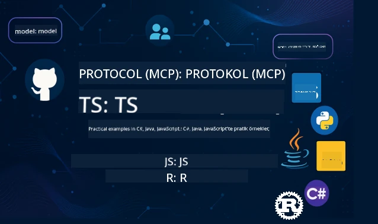

 

[](https://GitHub.com/microsoft/mcp-for-beginners/graphs/contributors)
[](https://GitHub.com/microsoft/mcp-for-beginners/issues)
[](https://GitHub.com/microsoft/mcp-for-beginners/pulls)
[](http://makeapullrequest.com)
[](https://mcptoplist.com/server/mcp.so%2Fmcp-for-beginners%2Fmicrosoft)

[](https://GitHub.com/microsoft/mcp-for-beginners/watchers)
[](https://GitHub.com/microsoft/mcp-for-beginners/fork)
[](https://GitHub.com/microsoft/mcp-for-beginners/stargazers)


[](https://discord.gg/nTYy5BXMWG)

Bu kaynakları kullanmaya başlamak için şu adımları izleyin:
1. **Depoyu Forklayın**: Tıklayın [](https://GitHub.com/microsoft/mcp-for-beginners/fork)
2. **Depoyu Klonlayın**:   `git clone https://github.com/microsoft/mcp-for-beginners.git`
3. **Katılın** [](https://discord.gg/nTYy5BXMWG)


### 🌐 Çok Dilli Destek

#### GitHub Action ile Desteklenir (Otomatik & Her Zaman Güncel)

<!-- CO-OP TRANSLATOR LANGUAGES TABLE START -->
[Arabic](../ar/README.md) | [Bengali](../bn/README.md) | [Bulgarian](../bg/README.md) | [Burmese (Myanmar)](../my/README.md) | [Chinese (Simplified)](../zh-CN/README.md) | [Chinese (Traditional, Hong Kong)](../zh-HK/README.md) | [Chinese (Traditional, Macau)](../zh-MO/README.md) | [Chinese (Traditional, Taiwan)](../zh-TW/README.md) | [Croatian](../hr/README.md) | [Czech](../cs/README.md) | [Danish](../da/README.md) | [Dutch](../nl/README.md) | [Estonian](../et/README.md) | [Finnish](../fi/README.md) | [French](../fr/README.md) | [German](../de/README.md) | [Greek](../el/README.md) | [Hebrew](../he/README.md) | [Hindi](../hi/README.md) | [Hungarian](../hu/README.md) | [Indonesian](../id/README.md) | [Italian](../it/README.md) | [Japanese](../ja/README.md) | [Kannada](../kn/README.md) | [Khmer](../km/README.md) | [Korean](../ko/README.md) | [Lithuanian](../lt/README.md) | [Malay](../ms/README.md) | [Malayalam](../ml/README.md) | [Marathi](../mr/README.md) | [Nepali](../ne/README.md) | [Nigerian Pidgin](../pcm/README.md) | [Norwegian](../no/README.md) | [Persian (Farsi)](../fa/README.md) | [Polish](../pl/README.md) | [Portuguese (Brazil)](../pt-BR/README.md) | [Portuguese (Portugal)](../pt-PT/README.md) | [Punjabi (Gurmukhi)](../pa/README.md) | [Romanian](../ro/README.md) | [Russian](../ru/README.md) | [Serbian (Cyrillic)](../sr/README.md) | [Slovak](../sk/README.md) | [Slovenian](../sl/README.md) | [Spanish](../es/README.md) | [Swahili](../sw/README.md) | [Swedish](../sv/README.md) | [Tagalog (Filipino)](../tl/README.md) | [Tamil](../ta/README.md) | [Telugu](../te/README.md) | [Thai](../th/README.md) | [Turkish](./README.md) | [Ukrainian](../uk/README.md) | [Urdu](../ur/README.md) | [Vietnamese](../vi/README.md)

> **Yerel Olarak Klonlamayı Tercih Ediyor musunuz?**
>
> Bu depo 50'den fazla dil çevirisi içerir ve bu da indirme boyutunu önemli ölçüde artırır. Çeviriler olmadan klonlamak için, seyrek checkout kullanın:
>
> **Bash / macOS / Linux:**
> ```bash
> git clone --filter=blob:none --sparse https://github.com/microsoft/mcp-for-beginners.git
> cd mcp-for-beginners
> git sparse-checkout set --no-cone '/*' '!translations' '!translated_images'
> ```
>
> **CMD (Windows):**
> ```cmd
> git clone --filter=blob:none --sparse https://github.com/microsoft/mcp-for-beginners.git
> cd mcp-for-beginners
> git sparse-checkout set --no-cone "/*" "!translations" "!translated_images"
> ```
>
> Bu, kursu tamamlamak için ihtiyacınız olan her şeyi çok daha hızlı bir indirme ile sağlar.
<!-- CO-OP TRANSLATOR LANGUAGES TABLE END -->

# 🚀 Yeni Başlayanlar için Model Context Protocol (MCP) Müfredatı

## **C#, Java, JavaScript, Rust, Python ve TypeScript ile Uygulamalı MCP Öğrenin**

## 🧠 Model Context Protocol Müfredatı Genel Bakış
Model Context Protocol yolculuğunuza hoş geldiniz! Yapay zeka uygulamalarının farklı araçlar ve servislerle nasıl iletişim kurduğunu hiç merak ettiyseniz, geliştiricilerin akıllı sistemler kurma biçimini değiştiren zarif çözümü keşfetmek üzeresiniz.

MCP'yi AI uygulamaları için evrensel bir çevirmen olarak düşünün - USB portlarının bilgisayarınıza her cihazı bağlamanıza izin verdiği gibi, MCP de AI modellerinin herhangi bir araç veya servise standart bir şekilde bağlanmasını sağlar. İlk sohbet botunuzu oluşturuyor olun ya da karmaşık AI iş akışları üzerinde çalışıyor olun, MCP'yi anlamak size daha yetenekli ve esnek uygulamalar yaratma gücü verir.

Bu müfredat, öğrenme yolculuğunuz için sabır ve özenle hazırlandı. Zaten anladığınız basit kavramlarla başlayacak ve favori programlama dilinizde pratik yaparak uzmanlığınızı kademeli olarak geliştireceksiniz. Her adımda net açıklamalar, pratik örnekler ve bolca teşvik olacak.

Bu yolculuğu tamamladığınızda, kendi MCP sunucularınızı oluşturma, bunları popüler AI platformlarıyla entegre etme ve bu teknolojinin AI geliştirme geleceğini nasıl yeniden şekillendirdiğini anlama konusunda kendinize güveneceksiniz. Haydi bu heyecan verici maceraya birlikte başlayalım!

### Resmi Dokümantasyon ve Spesifikasyonlar

Bu müfredat, **MCP Spesifikasyonu 2025-11-25** (en son kararlı sürüm) ile uyumludur. MCP spesifikasyonu, net protokol sürüm takibi için tarih bazlı versiyonlama (YYYY-AA-GG formatı) kullanır.

> **İleriye bakış:** bir sonraki spesifikasyon versiyonu için, **2026-07-28** sürüm adayı 28 Temmuz 2026'da yayınlanması planlanmıştır. Bu, taşıma katmanında protokolü durumsuz yapar, Uzantılar çerçevesini (MCP Uygulamaları, Görevleri) resmiyet kazandırır, yetkilendirmeyi güçlendirir ve Kökler, Örnekleme ve Günlüğü kullanımdan kaldırır. Ayrıntılı bilgi için [MCP'de Neler Değişiyor: 2026-07-28 Sürüm Adayı](./01-CoreConcepts/mcp-2026-07-28-release-candidate.md) sayfasına bakabilirsiniz.

Bu kaynaklar, anlayışınız arttıkça daha değerli hale gelir ancak hemen her şeyi okuma baskısı hissetmeyin. İlginizi çeken alanlardan başlayın!
- 📘 [MCP Dokümantasyonu](https://modelcontextprotocol.io/) – Adım adım öğreticiler ve kullanıcı kılavuzları için gitmeniz gereken kaynak. Dokümantasyon, yeni başlayanlar düşünülerek yazılmış ve kendi hızınızda takip edebileceğiniz net örnekler sunar.
- 📜 [MCP Spesifikasyonu](https://modelcontextprotocol.io/specification/2025-11-25) – Bunu kapsamlı referans kılavuzunuz olarak düşünün. Müfredatı işlerken, belirli ayrıntıları öğrenmek ve gelişmiş özellikleri keşfetmek için buraya sıkça döneceksiniz.
- 📜 [MCP Spesifikasyon Versiyonlama](https://modelcontextprotocol.io/specification/versioning) – Protokol sürüm geçmişi ve MCP'nin tarih bazlı versiyonlama (YYYY-AA-GG formatı) hakkında bilgiler içerir.
- 🧑‍💻 [MCP GitHub Deposu](https://github.com/modelcontextprotocol) – Burada çoklu programlama dillerinde SDK'lar, araçlar ve kod örnekleri bulabilirsiniz. Pratik örnekler ve kullanıma hazır bileşenler bakımından gerçek bir hazine.
- 🌐 [MCP Topluluğu](https://github.com/orgs/modelcontextprotocol/discussions) – Öğrenenler ve deneyimli geliştiricilerle MCP hakkında tartışmalara katılın. Soruların hoş karşılandığı ve bilginin serbestçe paylaşıldığı destekleyici bir topluluk.
  
## Öğrenme Hedefleri

Bu müfredatı tamamladığınızda, yeni yetenekleriniz konusunda kendinizi emin ve heyecanlı hissedeceksiniz. Başaracaklarınız şunlar:

• **MCP temelini anlayın**: Model Context Protocol'ün ne olduğunu ve yapay zeka uygulamalarının birlikte çalışma şekillerini nasıl devrimleştirdiğini, mantıklı ve anlaşılır benzetmelerle kavrayacaksınız.

• **İlk MCP sunucunuzu oluşturun**: Tercih ettiğiniz programlama dilinde çalışan bir MCP sunucusu oluşturacaksınız, basit örneklerle başlayıp adım adım becerilerinizi geliştireceksiniz.

• **AI modellerini gerçek araçlara bağlayın**: AI modelleri ile gerçek servisler arasında köprü kurmayı öğreneceksiniz ve uygulamalarınıza güçlü yeni yetenekler kazandıracaksınız.

• **Güvenlik en iyi uygulamalarını uygulayın**: MCP uygulamalarınızı nasıl güvenli ve emniyetli tutacağınızı, hem uygulamalarınızı hem kullanıcılarınızı korumayı anlayacaksınız.

• **Kendinizden emin şekilde dağıtım yapın**: MCP projelerinizi geliştirmeden üretime nasıl geçireceğinizi pratik dağıtım stratejileri ile öğreneceksiniz.

• **MCP topluluğuna katılın**: Yapay zeka uygulama geliştirme geleceğini şekillendiren büyüyen geliştirici topluluğunun parçası olacaksınız.

## Temel Arka Plan

MCP ayrıntılarına dalmadan önce, bazı temel kavramlarda rahat hissettiğinizden emin olalım. Bu alanlarda uzman olmasanız da endişelenmeyin - ihtiyacınız olan her şeyi yol boyunca açıklayacağız!

### Protokolleri Anlama (Temel)

Bir protokolü, bir konuşmanın kuralları olarak düşünün. Bir arkadaşınızı aradığınızda, her ikiniz de cevap verirken "merhaba" dersiniz, sırayla konuşursunuz ve işiniz bittiğinde "güle güle" dersiniz. Bilgisayar programlarının da etkili iletişim için benzer kurallara ihtiyacı vardır.

MCP bir protokoldür - AI modelleri ve uygulamaların araçlar ve servislerle üretken "konuşmalar" yapmasına yardımcı olan üzerinde anlaşılmış kurallar bütünü. İnsan iletişimini kolaylaştıran konuşma kuralları gibi, MCP de yapay zeka uygulama iletişimini çok daha güvenilir ve güçlü hale getirir.

### İstemci-Sunucu İlişkileri (Programların Birlikte Çalışma Şekli)

Her gün istemci-sunucu ilişkilerini kullanıyorsunuz! Bir web tarayıcısı (istemci) ile bir web sitesini ziyaret ettiğinizde, size sayfa içeriğini gönderen web sunucusuna bağlanıyorsunuz. Tarayıcı nasıl bilgi isteyeceğini ve sunucu nasıl yanıt vereceğini bilir.

MCP'de benzer bir ilişki var: AI modelleri bilgi ya da eylem talep eden istemci gibi davranırken, MCP sunucuları bu yetenekleri sağlar. AI'nın belirli görevleri yapmasını isteyen yardımsever bir asistan (sunucu) gibi düşünebilirsiniz.

### Standardizasyonun Önemi (Birlikte Çalışabilirliği Sağlamak)

Her otomobil üreticisinin farklı şekillerde yakıt pompası kullandığını düşünün - her araba için farklı bir adaptör gerekirdi! Standardizasyon, şeylerin sorunsuz birlikte çalışması için ortak yaklaşımlarda anlaşmak demektir.

MCP, AI uygulamaları için bu standardizasyonu sağlar. Her AI modelinin her araçla çalışabilmesi için özel kod yazmak yerine, MCP onlara iletişim kurmaları için evrensel bir yol yaratır. Bu, geliştiricilerin bir kez araç oluşturup birçok farklı AI sistemiyle çalışmasını mümkün kılar.

## 🧭 Öğrenme Yolculuğunuzun Genel Görünümü

MCP yolculuğunuz, güven ve becerilerinizi ilerleyerek oluşturacak şekilde dikkatlice yapılandırılmıştır. Her aşama yeni kavramlar tanıtırken zaten öğrenmiş olduklarınızı pekiştirir.

### 🌱 Temel Aşama: Temelleri Anlamak (Modüller 0-2)

Maceranız burada başlıyor! Size MCP kavramlarını tanıtırken tanıdık benzetmeler ve basit örnekler kullanacağız. MCP'nin ne olduğunu, neden var olduğunu ve AI geliştirme dünyasının geneline nasıl uyduğunu anlayacaksınız.


• **Modül 0 - MCP'ye Giriş**: MCP'nin ne olduğunu ve neden modern yapay zeka uygulamaları için bu kadar önemli olduğunu keşfederek başlayacağız. MCP'nin gerçek dünyadaki örneklerini görecek ve geliştiricilerin karşılaştığı yaygın sorunları nasıl çözdüğünü anlayacaksınız.

• **Modül 1 - Temel Kavramlar Açıklandı**: Burada MCP'nin temel yapı taşlarını öğreneceksiniz. Bu kavramların doğal ve anlaşılır hissetmesi için çok sayıda benzetme ve görsel örnek kullanacağız.

• **Modül 2 - MCP'de Güvenlik**: Güvenlik göz korkutucu gelebilir, ancak MCP'nin yerleşik güvenlik özelliklerini nasıl içerdiğini göstereceğiz ve uygulamalarınızı baştan koruyan en iyi uygulamaları öğreteceğiz.

### 🔨 İnşa Aşaması: İlk Uygulamalarınızı Oluşturma (Modül 3)

Artık gerçek eğlence başlıyor! Gerçek MCP sunucuları ve istemciler oluşturma konusunda pratik yapacaksınız. Endişelenmeyin - basitten başlayacak ve her adımda size rehberlik edeceğiz.

Bu modülde tercih ettiğiniz programlama dilinde pratik yapmanızı sağlayan birden fazla uygulamalı rehber bulunuyor. İlk sunucunuzu oluşturacak, ona bağlanmak için bir istemci geliştirecek ve hatta VS Code gibi popüler geliştirme araçlarıyla entegrasyon yapacaksınız.

Her rehber tam kod örnekleri, sorun giderme ipuçları ve belirli tasarım tercihlerini neden yaptığımızın açıklamalarını içerir. Bu aşamanın sonunda gurur duyabileceğiniz çalışan MCP uygulamalarınız olacak!

### 🚀 Gelişme Aşaması: İleri Düzey Kavramlar ve Gerçek Dünya Uygulamaları (Modüller 4-5)

Temelleri öğrendikten sonra, daha sofistike MCP özelliklerini keşfetmeye hazırsınız. Pratik uygulama stratejileri, hata ayıklama teknikleri ve çok modlu yapay zeka entegrasyonu gibi ileri konuları ele alacağız.

MCP uygulamalarınızı üretim kullanımı için nasıl ölçeklendireceğinizi ve Azure gibi bulut platformlarıyla nasıl entegre edeceğinizi de öğreneceksiniz. Bu modüller, gerçek dünya taleplerini karşılayabilen MCP çözümleri oluşturmanız için sizi hazırlar.

### 🌟 Uzmanlık Aşaması: Topluluk ve Uzmanlık (Modüller 6-11)

Son aşama, MCP topluluğuna katılmaya ve en çok ilgilendiğiniz alanlarda uzmanlaşmaya odaklanır. Açık kaynak MCP projelerine nasıl katkıda bulunacağınızı, ileri düzey kimlik doğrulama desenlerini nasıl uygulayacağınızı ve kapsamlı veritabanı entegre çözümler oluşturmayı öğreneceksiniz.

Modül 11 ayrı bir anmayı hak ediyor - PostgreSQL entegrasyonuyla üretime hazır MCP sunucuları oluşturmayı öğreten tam 13 laboratuvarlık uygulamalı bir öğrenme yolu. Öğrendiklerinizin tamamını bir araya getiren bir bitirme projesi gibi!

### 📚 Tam Müfredat Yapısı

| Modül | Konu | Açıklama | Bağlantı |
|--------|-------|-------------|------|
| **Modül 0-3: Temeller** | | | |
| 00 | MCP'ye Giriş | Model Context Protocol ve yapay zeka boru hatlarındaki önemi hakkında genel bakış | [Daha fazla oku](./00-Introduction/README.md) |
| 01 | Temel Kavramlar Açıklandı | MCP temel kavramlarının derinlemesine incelenmesi | [Daha fazla oku](./01-CoreConcepts/README.md) |
| 1.1 | MCP'de Neler Değişiyor (2026-07-28 RC) | Durumsuz protokol, Uzantılar çerçevesi ve yakında gelecek özellik kaldırmaları | [Rehber](./01-CoreConcepts/mcp-2026-07-28-release-candidate.md) |
| 02 | MCP'de Güvenlik | Güvenlik tehditleri ve en iyi uygulamalar | [Daha fazla oku](./02-Security/README.md) |
| 03 | MCP ile Başlangıç | Ortam kurulumu, temel sunucular/istemciler, entegrasyon | [Daha fazla oku](./03-GettingStarted/README.md) |
| **Modül 3: İlk Sunucu & İstemcinizi Oluşturma** | | | |
| 3.1 | İlk Sunucu | İlk MCP sunucunuzu oluşturun | [Rehber](./03-GettingStarted/01-first-server/README.md) |
| 3.2 | İlk İstemci | Temel bir MCP istemcisi geliştirin | [Rehber](./03-GettingStarted/02-client/README.md) |
| 3.3 | LLM ile İstemci | Büyük dil modelleri ile entegrasyon | [Rehber](./03-GettingStarted/03-llm-client/README.md) |
| 3.4 | VS Code Entegrasyonu | VS Code'da MCP sunucularını kullanın | [Rehber](./03-GettingStarted/04-vscode/README.md) |
| 3.5 | stdio Sunucu | stdio taşıma kullanarak sunucular oluşturun | [Rehber](./03-GettingStarted/05-stdio-server/README.md) |
| 3.6 | HTTP Akışı | MCP'de HTTP akışını uygulayın | [Rehber](./03-GettingStarted/06-http-streaming/README.md) |
| 3.7 | Microsoft Foundry Araç Seti | MCP ile Microsoft Foundry Araç Setini kullanın | [Rehber](./03-GettingStarted/07-aitk/README.md) |
| 3.8 | Test Etme | MCP sunucu uygulamanızı test edin | [Rehber](./03-GettingStarted/08-testing/README.md) |
| 3.9 | Dağıtım | MCP sunucularını üretime dağıtın | [Rehber](./03-GettingStarted/09-deployment/README.md) |
| 3.10 | Gelişmiş sunucu kullanımı | Gelişmiş özellik kullanımı ve geliştirilmiş mimari için gelişmiş sunucular kullanın | [Rehber](./03-GettingStarted/10-advanced/README.md) |
| 3.11 | Basit kimlik doğrulama | Baştan kimlik doğrulamayı ve RBAC'yi gösteren bölüm | [Rehber](./03-GettingStarted/11-simple-auth/README.md) |
| 3.12 | MCP Barındırıcıları | Claude Desktop, Cursor, Cline ve diğer MCP barındırıcılarını yapılandırın | [Rehber](./03-GettingStarted/12-mcp-hosts/README.md) |
| 3.13 | MCP Denetleyici | Denetleyici aracı ile MCP sunucularını hata ayıklayın ve test edin | [Rehber](./03-GettingStarted/13-mcp-inspector/README.md) |
| 3.14 | Örnekleme | İstemci ile işbirliği yapmak için örnekleme kullanın | [Rehber](./03-GettingStarted/14-sampling/README.md) |
| 3.15 | MCP Uygulamaları | MCP Uygulamaları oluşturun | [Rehber](./03-GettingStarted/15-mcp-apps/README.md) |
| **Modül 4-5: Pratik & İleri Düzey** | | | |
| 04 | Pratik Uygulama | SDK'lar, hata ayıklama, test, yeniden kullanılabilir istem şablonları | [Daha fazla oku](./04-PracticalImplementation/README.md) |
| 4.1 | Sayfalama | Büyük sonuç kümelerini imleç tabanlı sayfalama ile yönetin | [Rehber](./04-PracticalImplementation/pagination/README.md) |
| 05 | MCP'de İleri Konular | Çok modlu yapay zeka, ölçeklendirme, kurumsal kullanım | [Daha fazla oku](./05-AdvancedTopics/README.md) |
| 5.1 | Azure Entegrasyonu | MCP'nin Azure ile entegrasyonu | [Rehber](./05-AdvancedTopics/mcp-integration/README.md) |
| 5.2 | Çok Modluluk | Birden çok modalite ile çalışma | [Rehber](./05-AdvancedTopics/mcp-multi-modality/README.md) |
| 5.3 | OAuth2 Demo | OAuth2 kimlik doğrulamasını uygulama | [Rehber](./05-AdvancedTopics/mcp-oauth2-demo/README.md) |
| 5.4 | Kök Bağlamlar | Kök bağlamları anlama ve uygulama | [Rehber](./05-AdvancedTopics/mcp-root-contexts/README.md) |
| 5.5 | Yönlendirme | MCP yönlendirme stratejileri | [Rehber](./05-AdvancedTopics/mcp-routing/README.md) |
| 5.6 | Örnekleme | MCP'de örnekleme teknikleri | [Rehber](./05-AdvancedTopics/mcp-sampling/README.md) |
| 5.7 | Ölçeklendirme | MCP uygulamalarını ölçeklendirin | [Rehber](./05-AdvancedTopics/mcp-scaling/README.md) |
| 5.8 | Güvenlik | İleri düzey güvenlik değerlendirmeleri | [Rehber](./05-AdvancedTopics/mcp-security/README.md) |
| 5.9 | Web Araması | Web arama yeteneklerini uygulayın | [Rehber](./05-AdvancedTopics/web-search-mcp/README.md) |
| 5.10 | Gerçek Zamanlı Akış | Gerçek zamanlı akış işlevselliği oluşturun | [Rehber](./05-AdvancedTopics/mcp-realtimestreaming/README.md) |
| 5.11 | Gerçek Zamanlı Arama | Gerçek zamanlı arama uygulayın | [Rehber](./05-AdvancedTopics/mcp-realtimesearch/README.md) |
| 5.12 | Entra ID Kimlik Doğrulama | Microsoft Entra ID ile kimlik doğrulama | [Rehber](./05-AdvancedTopics/mcp-security-entra/README.md) |
| 5.13 | Foundry Entegrasyonu | Microsoft Foundry ile entegrasyon | [Rehber](./05-AdvancedTopics/mcp-foundry-agent-integration/README.md) |
| 5.14 | Bağlam Mühendisliği | Etkili bağlam mühendisliği teknikleri | [Rehber](./05-AdvancedTopics/mcp-contextengineering/README.md) |
| 5.15 | MCP Özel Taşıma | Özel Taşıma uygulamaları | [Rehber](./05-AdvancedTopics/mcp-transport/README.md) |
| 5.16 | Protokol Özellikleri | İlerleme bildirimleri, iptal, kaynak şablonları | [Rehber](./05-AdvancedTopics/mcp-protocol-features/README.md) |
| 5.17 | Rekabetçi Çoklu Ajan Akıl Yürütme | İki ajanın paylaşılan MCP araçlarını kullanarak karşıt taraflarda tartışması, bir hakem ajanın değerlendirmesi | [Rehber](./05-AdvancedTopics/mcp-adversarial-agents/README.md) |
| **Modül 6-10: Topluluk & En İyi Uygulamalar** | | | |
| 06 | Topluluk Katkıları | MCP ekosistemine nasıl katkıda bulunulur | [Rehber](./06-CommunityContributions/README.md) |
| 07 | Erken Benimsemeden Öğrenilenler | Gerçek dünya uygulama hikayeleri | [Rehber](./07-LessonsfromEarlyAdoption/README.md) |
| 08 | MCP için En İyi Uygulamalar | Performans, hata toleransı, dayanıklılık | [Rehber](./08-BestPractices/README.md) |
| 09 | MCP Vaka Çalışmaları | Pratik uygulama örnekleri | [Rehber](./09-CaseStudy/README.md) |
| 10 | Uygulamalı Atölye | Microsoft Foundry Araç Seti ile MCP sunucu oluşturma | [Laboratuvar](./10-StreamliningAIWorkflowsBuildingAnMCPServerWithAIToolkit/README.md) |
| **Modül 11: MCP Sunucu Uygulamalı Laboratuvar** | | | |
| 11 | MCP Sunucu Veritabanı Entegrasyonu | PostgreSQL entegrasyonu için kapsamlı 13 laboratuvarlık uygulamalı öğrenme yolu | [Laboratuvarlar](./11-MCPServerHandsOnLabs/README.md) |
| 11.1 | Giriş | Veritabanı entegrasyonu ve perakende analitiği kullanım senaryosu ile MCP genel bakışı | [Laboratuvar 00](./11-MCPServerHandsOnLabs/00-Introduction/README.md) |
| 11.2 | Temel Mimari | MCP sunucu mimarisini, veritabanı katmanlarını ve güvenlik desenlerini anlama | [Laboratuvar 01](./11-MCPServerHandsOnLabs/01-Architecture/README.md) |
| 11.3 | Güvenlik & Çok Kiracı | Satır Seviyesi Güvenlik, kimlik doğrulama ve çok kiracılı veri erişimi | [Laboratuvar 02](./11-MCPServerHandsOnLabs/02-Security/README.md) |
| 11.4 | Ortam Kurulumu | Geliştirme ortamının kurulumu, Docker, Azure kaynakları | [Laboratuvar 03](./11-MCPServerHandsOnLabs/03-Setup/README.md) |
| 11.5 | Veritabanı Tasarımı | PostgreSQL kurulumu, perakende şema tasarımı ve örnek veriler | [Laboratuvar 04](./11-MCPServerHandsOnLabs/04-Database/README.md) |
| 11.6 | MCP Sunucu Uygulaması | Veritabanı entegrasyonlu FastMCP sunucusunu oluşturma | [Laboratuvar 05](./11-MCPServerHandsOnLabs/05-MCP-Server/README.md) |
| 11.7 | Araç Geliştirme | Veritabanı sorgu araçları ve şema incelemesi oluşturma | [Laboratuvar 06](./11-MCPServerHandsOnLabs/06-Tools/README.md) |
| 11.8 | Anlamsal Arama | Azure OpenAI ve pgvector ile vektör gömme uygulaması | [Laboratuvar 07](./11-MCPServerHandsOnLabs/07-Semantic-Search/README.md) |
| 11.9 | Test & Hata Ayıklama | Test stratejileri, hata ayıklama araçları ve doğrulama yaklaşımları | [Laboratuvar 08](./11-MCPServerHandsOnLabs/08-Testing/README.md) |
| 11.10 | VS Code Entegrasyonu | VS Code MCP entegrasyonu ve Yapay Zeka Sohbet kullanımının yapılandırılması | [Laboratuvar 09](./11-MCPServerHandsOnLabs/09-VS-Code/README.md) |
| 11.11 | Dağıtım Stratejileri | Docker dağıtımı, Azure Container Apps ve ölçeklendirme değerlendirmeleri | [Laboratuvar 10](./11-MCPServerHandsOnLabs/10-Deployment/README.md) |
| 11.12 | İzleme | Uygulama içgörüleri, kayıt tutma, performans izleme | [Laboratuvar 11](./11-MCPServerHandsOnLabs/11-Monitoring/README.md) |
| 11.13 | En İyi Uygulamalar | Performans optimizasyonu, güvenlik sertleştirmesi ve üretim ipuçları | [Laboratuvar 12](./11-MCPServerHandsOnLabs/12-Best-Practices/README.md) |
| **Modül 12: MCP Araçları** | | | |
| 12.1 | Araçlar | Copilot Uygulamasında MCP kullanımı | [ Rehber ](./12-tooling/README.md) |

### 💻 Örnek Kod Projeleri

MCP öğrenmenin en heyecan verici bölümlerinden biri, kodlama becerilerinizin ilerleyerek gelişmesini görmektir. Kod örneklerimizi basit başlayacak ve anlayışınız derinleştikçe daha karmaşık hale gelecek şekilde tasarladık. İşte kavramları tanıttığımız yöntem - anlaşılması kolay ama gerçek MCP prensiplerini gösteren kodlarla, bu kodun ne yaptığını değil neden bu şekilde yapılandırıldığını ve daha büyük MCP uygulamalarına nasıl uyduğunu anlayacaksınız.

#### Temel MCP Hesaplayıcı Örnekleri

| Dil | Açıklama | Bağlantı |
|----------|-------------|------|

| C# | MCP Sunucu Örneği | [Kodu Görüntüle](./03-GettingStarted/samples/csharp/README.md) |
| Java | MCP Hesaplayıcı | [Kodu Görüntüle](./03-GettingStarted/samples/java/calculator/README.md) |
| JavaScript | MCP Demo | [Kodu Görüntüle](./03-GettingStarted/samples/javascript/README.md) |
| Python | MCP Sunucu | [Kodu Görüntüle](../../03-GettingStarted/samples/python/mcp_calculator_server.py) |
| TypeScript | MCP Örneği | [Kodu Görüntüle](./03-GettingStarted/samples/typescript/README.md) |
| Rust | MCP Örneği | [Kodu Görüntüle](./03-GettingStarted/samples/rust/README.md) |

#### Gelişmiş MCP Uygulamaları

| Dil | Açıklama | Bağlantı |
|----------|-------------|------|
| C# | Gelişmiş Örnek | [Kodu Görüntüle](./04-PracticalImplementation/samples/csharp/README.md) |
| Spring ile Java | Konteyner Uygulama Örneği | [Kodu Görüntüle](./04-PracticalImplementation/samples/java/containerapp/README.md) |
| JavaScript | Gelişmiş Örnek | [Kodu Görüntüle](./04-PracticalImplementation/samples/javascript/README.md) |
| Python | Karmaşık Uygulama | [Kodu Görüntüle](./04-PracticalImplementation/samples/python/README.md) |
| TypeScript | Konteyner Örneği | [Kodu Görüntüle](./04-PracticalImplementation/samples/typescript/README.md) |


## 🎯 MCP Öğrenme Önkoşulları

Bu müfredattan en iyi şekilde yararlanmak için:

- En az birinde temel programlama bilgisi: C#, Java, JavaScript, Python veya TypeScript
- İstemci-sunucu modeli ve API’lar hakkında anlayış
- REST ve HTTP kavramlarına aşinalık
- (İsteğe bağlı) AI/ML kavramlarına temel bilgi

- Destek için topluluk tartışmalarımıza katılım

## 📚 Çalışma Rehberi & Kaynaklar

Bu depoda, öğrenmenizi kolaylaştırmak için çeşitli kaynaklar bulunmaktadır:

### Çalışma Rehberi

Burası için kapsamlı bir [Çalışma Rehberi](./study_guide.md) mevcuttur. Bu görsel müfredat haritası tüm konuların nasıl bağlantılı olduğunu gösterir ve örnek projelerin nasıl etkin kullanılacağını anlatır. Büyük resmi görmek isteyen görsel öğrenenler için özellikle yararlıdır.

Rehber şunları içerir:
- Kaplanan tüm konuları gösteren görsel müfredat haritası
- Her depo bölümünün detaylı açıklaması
- Örnek projelerin nasıl kullanacağına dair rehberlik
- Farklı beceri seviyeleri için önerilen öğrenme yolları
- Öğrenme yolculuğunuzu tamamlayacak ek kaynaklar

### Değişiklik Günlüğü

Müfredat materyallerindeki tüm önemli güncellemeleri takip etmek için ayrıntılı bir [Değişiklik Günlüğü](./changelog.md) tutuyoruz, böylece en son iyileştirmeler ve eklemeler hakkında güncel kalabilirsiniz.
- Yeni içerik eklemeleri
- Yapısal değişiklikler
- Özellik geliştirmeleri
- Belge güncellemeleri

## 🛠️ Bu Müfredatı Etkili Kullanma

Bu rehberdeki her derste şunlar bulunur:

1. MCP kavramlarının net açıklamaları  
2. Birden fazla dilde canlı kod örnekleri  
3. Gerçek MCP uygulamaları oluşturmak için alıştırmalar  
4. İleri düzey öğrenenler için ekstra kaynaklar

### C# ile MCP Öğrenelim - Eğitim Serisi
Yapay zeka modelleri ile istemci uygulamaları arasındaki etkileşimleri standartlaştırmak için tasarlanmış son teknoloji bir çerçeve olan Model Context Protocol (MCP)'yi öğrenelim. Bu başlangıç dostu oturumda MCP'yi tanıtacak ve ilk MCP sunucunuzu oluşturmanızda size rehberlik edeceğiz.
#### C#: [https://aka.ms/letslearnmcp-csharp](https://aka.ms/letslearnmcp-csharp)
#### Java: [https://aka.ms/letslearnmcp-java](https://aka.ms/letslearnmcp-java)
#### JavaScript: [https://aka.ms/letslearnmcp-javascript](https://aka.ms/letslearnmcp-javascript)
#### Python: [https://aka.ms/letslearnmcp-python](https://aka.ms/letslearnmcp-python)

## 🎓 MCP Yolculuğunuz Başlıyor

Tebrikler! Programlama yeteneklerinizi genişletecek ve sizi yapay zeka geliştirmenin ön saflarına bağlayacak heyecan verici bir yolculukta ilk adımı attınız.

### Şimdiye Kadar Başardıklarınız

Bu giriş bölümünü okuyarak MCP bilginizin temelini atmaya başladınız. MCP'nin ne olduğunu, neden önemli olduğunu ve bu müfredatın öğrenme yolculuğunuzu nasıl destekleyeceğini anlıyorsunuz. Bu önemli teknoloji alanında uzmanlığınızın başlangıcı ve büyük bir başarıdır.

### Önünüzdeki Macera

Modüllerde ilerlerken, her uzmanın bir zamanlar acemi olduğunu unutmayın. Şimdi karmaşık görünen kavramlar, pratik yaptıkça ve uyguladıkça alışkanlık haline gelecek. Her küçük adım, geliştirme kariyeriniz boyunca size hizmet edecek güçlü yeteneklere dönüşür.

### Destek Ağınız

MCP'ye tutkuyla bağlı ve başkalarının başarılı olmasına yardımcı olmaya hevesli bir öğrenenler ve uzmanlar topluluğuna katılıyorsunuz. Kodlama zorluğunda takılsanız da bir dönüm noktasını paylaşmaya hevesli olun, topluluk yolculuğunuzda size destek olmak için burada.

Eğer tıkanırsanız ya da yapay zeka uygulamaları oluşturmayla ilgili sorularınız olursa, MCP hakkında tartışmalara katılın. Soruların hoş karşılandığı ve bilginin özgürce paylaşıldığı destekleyici bir topluluktur.

[](https://discord.gg/nTYy5BXMWG)

Ürün geri bildirimi veya hata bildirimi için ziyaret edin:

[](https://aka.ms/foundry/forum)

### Başlamaya Hazır Mısınız?

MCP maceranız şimdi başlıyor! İlk pratik MCP deneyimlerinize dalmak için Modül 0 ile başlayın veya neler inşa edeceğinizi görmek için örnek projeleri keşfedin. Unutmayın – her uzman tam olarak sizin şu an bulunduğunuz noktadan başladı ve sabır ve pratikle neler başarabileceğinize şaşıracaksınız.

Model Context Protocol geliştirme dünyasına hoş geldiniz. Hadi birlikte harika bir şeyler inşa edelim!

## 🤝 Öğrenme Topluluğuna Katkıda Bulunma

Bu müfredat, sizin gibi öğrenenlerin katkılarıyla güçlenir! İster bir yazım hatasını düzeltin, ister daha net bir açıklama önerin ya da yeni bir örnek ekleyin; katkılarınız diğer acemilerin başarılı olması için yardımcı olur.

Kod örnekleri katkısı için Microsoft Değerli Profesyoneli [Shivam Goyal](https://www.linkedin.com/in/shivam2003/)'a teşekkür ederiz.

Katkı süreci ağırlayıcı ve destekleyici olacak şekilde tasarlanmıştır. Çoğu katkı için Katkı Lisans Sözleşmesi (CLA) gereklidir, ancak otomatik araçlar süreci sorunsuz şekilde yönlendirecektir.

## 📜 Açık Kaynak Öğrenme

Bu müfredat tamamı MIT [LİSANSI](../../LICENSE) kapsamında sunulmaktadır; yani özgürce kullanabilir, değiştirebilir ve paylaşabilirsiniz. Bu, MCP bilgisinin her yerdeki geliştiricilere erişilebilir olmasını destekleyen misyonumuzu güçlendirir.
## 🤝 Katkı Kuralları


Bu proje katkılara ve önerilere açıktır. Çoğu katkı için, katkınızı kullanma hakkını size verdiğinizi ve gerçekten verdiğinizi beyan eden bir Katılımcı Lisans Sözleşmesi (CLA) kabul etmeniz gerekmektedir.
Detaylar için <https://cla.opensource.microsoft.com> adresini ziyaret edin.


Bir çekme isteği gönderdiğinizde, bir CLA botu otomatik olarak CLA sağlamanız gerekip gerekmediğini belirler ve PR'yi uygun şekilde (örneğin, durum kontrolü, yorum) işaretler. Bot tarafından verilen talimatları izleyin.
Bu işlemi, CLA kullanan tüm depolarda sadece bir kez yapmanız gerekir.


Bu proje [Microsoft Açık Kaynak Davranış Kuralları](https://opensource.microsoft.com/codeofconduct/)nu benimsemiştir.
Daha fazla bilgi için [Davranış Kuralları SSS](https://opensource.microsoft.com/codeofconduct/faq/) sayfasını ziyaret edin veya
ek sorularınız veya yorumlarınız için [opencode@microsoft.com](mailto:opencode@microsoft.com) ile iletişime geçin.

---

*MCP yolculuğunuza hazır mısınız? [Modül 00 - MCP’ye Giriş](./00-Introduction/README.md) ile başlayın ve Model Context Protocol geliştirme dünyasında ilk adımlarınızı atın!*


## 🎒 Diğer Kurslar
Ekibimiz başka kurslar da üretiyor! Göz atın:

<!-- CO-OP TRANSLATOR OTHER COURSES START -->
### LangChain
[](https://aka.ms/langchain4j-for-beginners)
[](https://aka.ms/langchainjs-for-beginners?WT.mc_id=m365-94501-dwahlin)
[](https://github.com/microsoft/langchain-for-beginners?WT.mc_id=m365-94501-dwahlin)
---

### Azure / Edge / MCP / Ajanlar
[](https://github.com/microsoft/AZD-for-beginners?WT.mc_id=academic-105485-koreyst)
[](https://github.com/microsoft/edgeai-for-beginners?WT.mc_id=academic-105485-koreyst)
[](https://github.com/microsoft/mcp-for-beginners?WT.mc_id=academic-105485-koreyst)
[](https://github.com/microsoft/ai-agents-for-beginners?WT.mc_id=academic-105485-koreyst)

---
 
### Üretken AI Serisi
[](https://github.com/microsoft/generative-ai-for-beginners?WT.mc_id=academic-105485-koreyst)
[-9333EA?style=for-the-badge&labelColor=E5E7EB&color=9333EA)](https://github.com/microsoft/Generative-AI-for-beginners-dotnet?WT.mc_id=academic-105485-koreyst)
[-C084FC?style=for-the-badge&labelColor=E5E7EB&color=C084FC)](https://github.com/microsoft/generative-ai-for-beginners-java?WT.mc_id=academic-105485-koreyst)
[-E879F9?style=for-the-badge&labelColor=E5E7EB&color=E879F9)](https://github.com/microsoft/generative-ai-with-javascript?WT.mc_id=academic-105485-koreyst)

---
 
### Temel Öğrenme
[](https://aka.ms/ml-beginners?WT.mc_id=academic-105485-koreyst)
[](https://aka.ms/datascience-beginners?WT.mc_id=academic-105485-koreyst)
[](https://aka.ms/ai-beginners?WT.mc_id=academic-105485-koreyst)

[](https://github.com/microsoft/Security-101?WT.mc_id=academic-96948-sayoung)
[](https://aka.ms/webdev-beginners?WT.mc_id=academic-105485-koreyst)
[](https://aka.ms/iot-beginners?WT.mc_id=academic-105485-koreyst)
[](https://github.com/microsoft/xr-development-for-beginners?WT.mc_id=academic-105485-koreyst)

---
 
### Copilot Serisi
[](https://aka.ms/GitHubCopilotAI?WT.mc_id=academic-105485-koreyst)
[](https://github.com/microsoft/mastering-github-copilot-for-dotnet-csharp-developers?WT.mc_id=academic-105485-koreyst)
[](https://github.com/microsoft/CopilotAdventures?WT.mc_id=academic-105485-koreyst)
<!-- CO-OP TRANSLATOR OTHER COURSES END -->

---

<!-- CO-OP TRANSLATOR DISCLAIMER START -->
**Feragatname**:
Bu belge, AI çeviri hizmeti [Co-op Translator](https://github.com/Azure/co-op-translator) kullanılarak çevrilmiştir. Doğruluk için çaba sarf etsek de, otomatik çevirilerin hata veya yanlışlık içerebileceğini lütfen unutmayınız. Orijinal belge, kendi dilinde yetkili kaynak olarak kabul edilmelidir. Kritik bilgiler için profesyonel insan çevirisi önerilir. Bu çevirinin kullanımı sonucu ortaya çıkabilecek yanlış anlamalardan veya yanlış yorumlamalardan sorumlu değiliz.
<!-- CO-OP TRANSLATOR DISCLAIMER END -->