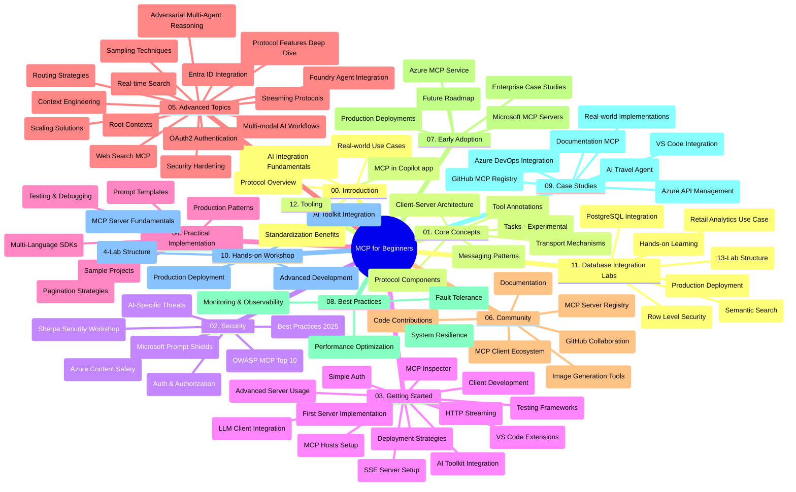

# Yeni Başlayanlar için Model Bağlamı Protokolü (MCP) - Çalışma Rehberi

Bu çalışma rehberi, "Yeni Başlayanlar için Model Bağlamı Protokolü (MCP)" müfredatının depo yapısı ve içeriğine genel bir bakış sunar. Bu rehberi depoyu verimli bir şekilde gezinmek ve mevcut kaynaklardan en iyi şekilde yararlanmak için kullanın.

## Depo Genel Bakışı

Model Bağlamı Protokolü (MCP), yapay zeka modelleri ile istemci uygulamalar arasındaki etkileşimler için standartlaştırılmış bir çerçevedir. Başlangıçta Anthropic tarafından oluşturulan MCP, şimdi resmi GitHub organizasyonu aracılığıyla daha geniş MCP topluluğu tarafından sürdürülmektedir. Bu depo, yapay zeka geliştiricileri, sistem mimarları ve yazılım mühendisleri için C#, Java, JavaScript, Python ve TypeScript dillerinde uygulamalı kod örnekleriyle kapsamlı bir müfredat sunar.

## Görsel Müfredat Haritası

## Depo Yapısı

Depo, MCP'nin farklı yönlerine odaklanan on iki ana bölüme ayrılmıştır:

1. **Giriş (00-Introduction/)**
   - Model Bağlamı Protokolüne genel bakış
   - AI boru hatlarında standartlaştırmanın önemi
   - Pratik kullanım durumları ve faydalar

2. **Temel Kavramlar (01-CoreConcepts/)**
   - İstemci-sunucu mimarisi
   - Temel protokol bileşenleri
   - MCP'deki iletişim modelleri
   - Güncel spesifikasyon: [MCP'de Neler Değişti: 2026-07-28 Spesifikasyonu](./01-CoreConcepts/mcp-2026-07-28.md) — durumsuz protokol çekirdeği, Uzantılar çerçevesi ve Kökler/Örnekleme/Kayıtların kullanımdan kaldırılması

3. **Güvenlik (02-Security/)**
   - MCP tabanlı sistemlerde güvenlik tehditleri
   - Uygulamaların güvenliğini sağlamak için en iyi uygulamalar
   - Kimlik doğrulama ve yetkilendirme stratejileri
   - Uygulamalı [CIMD ve DCR yetkilendirme örneği](./02-Security/samples/cimd-dcr-auth/README.md)
   - **Kapsamlı Güvenlik Dokümantasyonu**:
     - MCP Güvenlik En İyi Uygulamaları
     - Azure İçerik Güvenliği Uygulama Rehberi
     - MCP Güvenlik Kontrolleri ve Teknikleri
     - MCP En İyi Uygulamalar Hızlı Referans
   - **Önemli Güvenlik Konuları**:
     - İstek enjeksiyonu ve araç zehirleme saldırıları
     - Oturum kaçırma ve karışık temsilci sorunları
     - Jeton aktarma zafiyetleri
     - Aşırı izinler ve erişim kontrolü
     - AI bileşenleri için tedarik zinciri güvenliği
     - Microsoft İstek Kalkanları entegrasyonu

4. **Başlarken (03-GettingStarted/)**
   - Ortam kurulumu ve yapılandırması
   - Temel MCP sunucu ve istemci oluşturma
   - Mevcut uygulamalarla entegrasyon
   - İçerdiği bölümler:
     - İlk sunucu uygulaması
     - İstemci geliştirme
     - LLM istemci entegrasyonu
     - VS Code entegrasyonu
     - Sunucu Tarafından Gönderilen Olaylar (SSE) sunucusu
     - Gelişmiş sunucu kullanımı
     - HTTP akışı
     - AI Araç Kiti entegrasyonu
     - Test stratejileri
     - Dağıtım yönergeleri

5. **Pratik Uygulama (04-PracticalImplementation/)**
   - Farklı programlama dillerinde SDK kullanımı
   - Hata ayıklama, test ve doğrulama teknikleri
   - Yeniden kullanılabilir istek şablonları ve iş akışları oluşturma
   - Uygulama örnekleri içeren projeler

6. **İleri Konular (05-AdvancedTopics/)**
   - Bağlam mühendisliği teknikleri
   - Foundry ajan entegrasyonu
   - Çok modlu AI iş akışları
   - OAuth2 kimlik doğrulama demoları
   - Gerçek zamanlı arama özellikleri
   - Gerçek zamanlı akış
   - Kök bağlamların uygulanması
   - Yönlendirme stratejileri
   - Örnekleme teknikleri
   - Ölçeklendirme yaklaşımları
   - Güvenlik hususları
   - Entra ID güvenlik entegrasyonu
   - Web arama entegrasyonu
   - Rekabetçi çok ajanlı düşünme (tartışma desenleri)

7. **Topluluk Katkıları (06-CommunityContributions/)**
   - Kod ve dokümantasyona nasıl katkıda bulunulur
   - GitHub üzerinden işbirliği yapma
   - Topluluk odaklı geliştirmeler ve geri bildirimler
   - Farklı MCP istemcilerinin kullanımı (Claude Desktop, Cline, VSCode)
   - Popüler MCP sunucularıyla çalışma, görüntü oluşturma dahil

8. **Erken Kabul Dersleri (07-LessonsfromEarlyAdoption/)**
   - Gerçek dünya uygulamaları ve başarı hikayeleri
   - MCP tabanlı çözümler oluşturma ve dağıtma
   - Trendler ve gelecek yol haritası
   - **Microsoft MCP Sunucuları Kılavuzu**: 10 üretime hazır Microsoft MCP sunucusunu kapsayan kapsamlı kılavuz:
     - Microsoft Learn Docs MCP Sunucusu
     - Azure MCP Sunucusu (15+ özel bağlantı)
     - GitHub MCP Sunucusu
     - Azure DevOps MCP Sunucusu
     - MarkItDown MCP Sunucusu
     - SQL Server MCP Sunucusu
     - Playwright MCP Sunucusu
     - Dev Box MCP Sunucusu
     - Microsoft Foundry MCP Sunucusu
     - Microsoft 365 Agents Toolkit MCP Sunucusu

9. **En İyi Uygulamalar (08-BestPractices/)**
   - Performans ayarlama ve optimizasyon
   - Hata toleranslı MCP sistemleri tasarlama
   - Test ve dayanıklılık stratejileri

10. **Vaka Çalışmaları (09-CaseStudy/)**
    - MCP esnekliğini farklı senaryolarda gösteren **yedi kapsamlı vaka çalışması**:
    - **Azure AI Seyahat Acenteleri**: Azure OpenAI ve AI Arama ile çok ajanlı düzenleme
    - **Azure DevOps Entegrasyonu**: YouTube veri güncellemeleri ile iş akışı süreçlerini otomatikleştirme
    - **Gerçek Zamanlı Dokümantasyon Alımı**: Streaming HTTP destekli Python konsol istemcisi
    - **Etkileşimli Çalışma Planı Oluşturucu**: Chainlit web uygulaması ve sohbet bazlı AI
    - **Editör İçi Dokümantasyon**: VS Code ve GitHub Copilot iş akış entegrasyonu
    - **Azure API Yönetimi**: MCP sunucu oluşturma ile kurumsal API entegrasyonu
    - **GitHub MCP Kayıt Defteri**: Ekosistem geliştirme ve ajan entegrasyon platformu
    - Kurumsal entegrasyon, geliştirici verimliliği ve ekosistem geliştirmeyi kapsayan uygulama örnekleri

11. **Uygulamalı Atölye (10-StreamliningAIWorkflowsBuildingAnMCPServerWithAIToolkit/)**
    - MCP ve AI Araç Kiti'ni birleştiren kapsamlı uygulamalı atölye
    - AI modellerini gerçek dünya araçlarıyla köprüleyen akıllı uygulamalar geliştirme
    - Temeller, özel sunucu geliştirme ve üretim dağıtım stratejilerini içeren pratik modüller
    - **Lab Yapısı**:
      - Lab 1: MCP Sunucu Temelleri
      - Lab 2: İleri MCP Sunucu Geliştirme
      - Lab 3: AI Araç Kiti Entegrasyonu
      - Lab 4: Üretim Dağıtımı ve Ölçeklendirme
    - Adım adım yönergelerle laboratuvar tabanlı öğrenme yaklaşımı

12. **MCP Sunucu Veritabanı Entegrasyon Laboratuvarları (11-MCPServerHandsOnLabs/)**
    - Üretime hazır MCP sunucuları PostgreSQL entegrasyonuyla oluşturmak için **kapsamlı 13 laboratuvarlık öğrenme yolu**
    - Zava Retail kullanım durumu ile **gerçek dünya perakende analizleri uygulaması**
    - Satır Düzeyinde Güvenlik (RLS), anlamsal arama ve çoklu kiracı veri erişimini içeren **kurumsal düzey desenler**
    - **Tam Laboratuvar Yapısı**:
      - **Lab 00-03: Temeller** - Giriş, Mimari, Güvenlik, Ortam Kurulumu
      - **Lab 04-06: MCP Sunucusu İnşası** - Veritabanı Tasarımı, MCP Sunucu Uygulaması, Araç Geliştirme
      - **Lab 07-09: İleri Özellikler** - Anlamsal Arama, Test ve Hata Ayıklama, VS Code Entegrasyonu
      - **Lab 10-12: Üretim ve En İyi Uygulamalar** - Dağıtım, İzleme, Optimizasyon
    - **Kapsanan Teknolojiler**: FastMCP çerçevesi, PostgreSQL, Azure OpenAI, Azure Container Apps, Application Insights
    - **Öğrenme Çıktıları**: Üretime hazır MCP sunucuları, veritabanı entegrasyon desenleri, yapay zeka destekli analizler, kurumsal güvenlik

13. **Araçlar (12-tooling/)**
    - MCP'nin Copilot uygulaması ve diğer araçlarda nasıl kullanılacağını öğrenin

## Ek Kaynaklar

Depo destekleyici kaynaklar içerir:

- **Görseller klasörü**: Müfredat boyunca kullanılan diyagramlar ve şemalar içerir
- **Çeviriler**: Dokümantasyonun otomatik çevirileriyle çok dilli destek
- **Resmi MCP Kaynakları**:
  - [MCP Dokümantasyonu](https://modelcontextprotocol.io/)
  - [MCP Spesifikasyonu](https://modelcontextprotocol.io/specification/2026-07-28/)
  - [MCP GitHub Deposu](https://github.com/modelcontextprotocol)

## Bu Depo Nasıl Kullanılır

1. **Sıralı Öğrenme**: Yapılandırılmış bir öğrenme deneyimi için bölümleri sırayla takip edin (00'dan 11'e kadar).
2. **Dil Özellikli Odaklanma**: Belirli bir programlama diliyle ilgileniyorsanız, tercih ettiğiniz dildeki uygulamalar için örnekler dizinlerini keşfedin.
3. **Pratik Uygulama**: Ortamınızı kurmak ve ilk MCP sunucu ve istemcinizi oluşturmak için "Başlarken" bölümüne başlayın.
4. **İleri Düzey Keşif**: Temellerde rahatladıktan sonra bilgilerinizi genişletmek için ileri konulara dalış yapın.
5. **Topluluk Katılımı**: Uzmanlar ve diğer geliştiricilerle bağlantı kurmak için GitHub tartışmaları ve Discord kanalları aracılığıyla MCP topluluğuna katılın.

## MCP İstemcileri ve Araçları

Müfredat çeşitli MCP istemcilerini ve araçlarını kapsar:

1. **Resmi İstemciler**:
   - Visual Studio Code
   - Visual Studio Code'da MCP
   - Claude Desktop
   - VSCode'da Claude
   - Claude API

2. **Topluluk İstemcileri**:
   - Cline (terminal tabanlı)
   - Cursor (kod editörü)
   - ChatMCP
   - Windsurf

3. **MCP Yönetim Araçları**:
   - MCP CLI
   - MCP Manager
   - MCP Linker
   - MCP Router

## Popüler MCP Sunucuları

Depo, çeşitli MCP sunucularını tanıtır, bunlar arasında:

1. **Resmi Microsoft MCP Sunucuları**:
   - Microsoft Learn Docs MCP Sunucusu
   - Azure MCP Sunucusu (15+ özel bağlantı)
   - GitHub MCP Sunucusu
   - Azure DevOps MCP Sunucusu
   - MarkItDown MCP Sunucusu
   - SQL Server MCP Sunucusu
   - Playwright MCP Sunucusu
   - Dev Box MCP Sunucusu
   - Microsoft Foundry MCP Sunucusu
   - Microsoft 365 Agents Toolkit MCP Sunucusu

2. **Resmi Referans Sunucuları**:
   - Dosya Sistemi
   - Fetch
   - Bellek
   - Sıralı Düşünme

3. **Görüntü Oluşturma**:
   - Azure OpenAI DALL-E 3
   - Stable Diffusion WebUI
   - Replicate

4. **Geliştirme Araçları**:
   - Git MCP
   - Terminal Kontrol
   - Kod Asistanı

5. **Özel Sunucular**:
   - Salesforce
   - Microsoft Teams
   - Jira & Confluence

## Katkıda Bulunma

Bu depo, topluluk katkılarını memnuniyetle karşılar. MCP ekosistemine etkili katkıda bulunma rehberi için Topluluk Katkıları bölümüne bakınız.

----

*Bu çalışma rehberi son olarak 9 Eylül 2026 tarihinde güncellenmiştir. MCP
Spesifikasyonu `2026-07-28`'i yansıtmaktadır, mevcut protokol revizyonu. Bazı uygulamalı
örnekler açıkça `2025-11-25` sürümüne göre kalmıştır, SDK'ları ve araçları ise
durumsuz protokol API'lerini benimsemektedir.*

---

<!-- CO-OP TRANSLATOR DISCLAIMER START -->
**Feragatname**:
Bu belge, AI çeviri hizmeti [Co-op Translator](https://github.com/Azure/co-op-translator) kullanılarak çevrilmiştir. Doğruluk için çaba sarf etsek de, otomatik çevirilerin hata veya yanlışlık içerebileceğini lütfen unutmayınız. Orijinal belge, kendi dilinde yetkili kaynak olarak kabul edilmelidir. Kritik bilgiler için profesyonel insan çevirisi önerilir. Bu çevirinin kullanımı sonucu ortaya çıkabilecek yanlış anlamalardan veya yanlış yorumlamalardan sorumlu değiliz.
<!-- CO-OP TRANSLATOR DISCLAIMER END -->