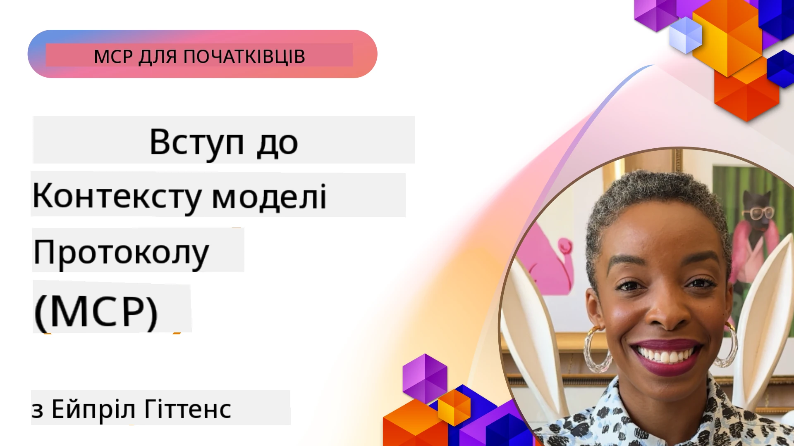
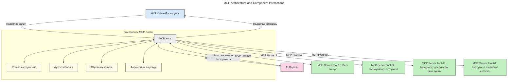
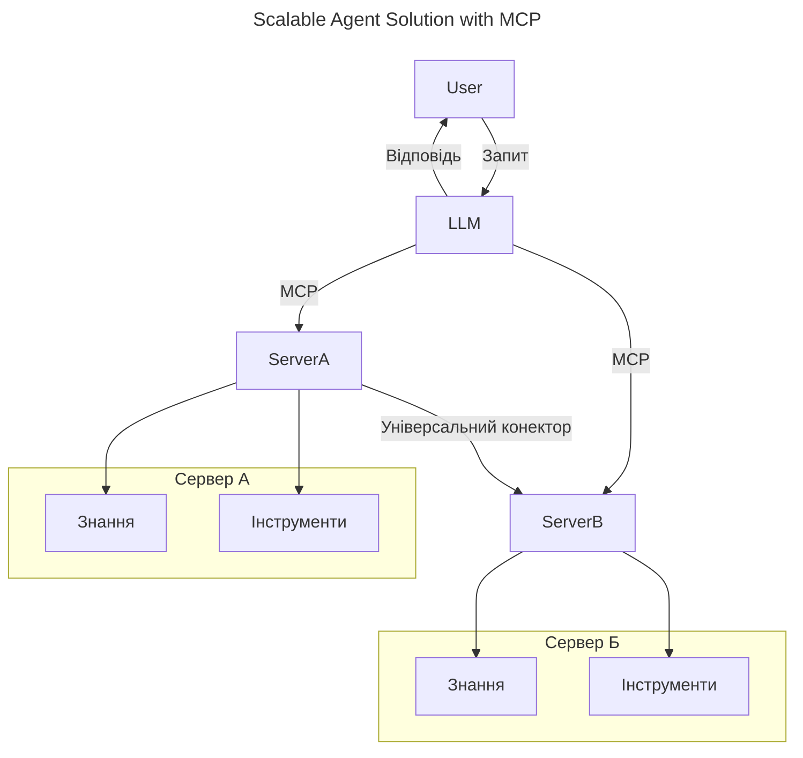
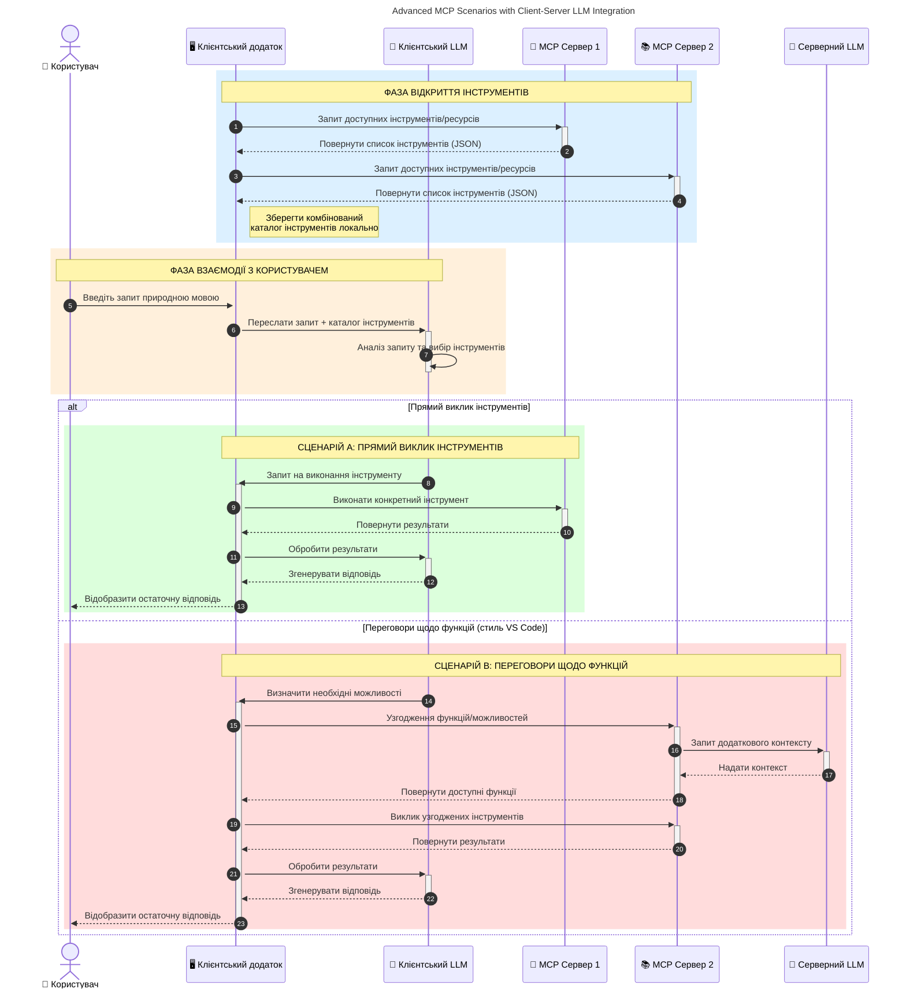

# Вступ до Протоколу Контексту Моделі (MCP): Чому це важливо для масштабованих AI-додатків

_(Натисніть на зображення вище, щоб переглянути відео цього уроку)_

Генеративні AI-застосунки — це великий крок уперед, оскільки вони часто дозволяють користувачу взаємодіяти з додатком, використовуючи природні мовні запити. Однак, коли в такі додатки інвестується більше часу та ресурсів, важливо переконатися, що ви можете легко інтегрувати функціональність і ресурси таким чином, щоб було просто розширювати додаток, щоб він підтримував більше ніж одну модель, і справлявся з різними особливостями моделей. Коротко кажучи, почати будувати генеративні AI-додатки легко, але з часом, коли вони ростуть і стають складнішими, потрібно почати визначати архітектуру і, ймовірно, покладатися на стандарт, щоб гарантувати, що ваші додатки будуються послідовно. Саме тут MCP входить у гру, щоб організувати процес і запропонувати стандарт.

---

## **🔍 Що таке Протокол Контексту Моделі (MCP)?**

**Протокол Контексту Моделі (MCP)** — це **відкритий стандартизований інтерфейс**, який дозволяє великим мовним моделям (LLM) безперешкодно взаємодіяти із зовнішніми інструментами, API та джерелами даних. Він забезпечує послідовну архітектуру для розширення функціональності AI-моделей поза межами їх навчальних даних, що робить AI-системи розумнішими, масштабованими і більш чуйними.

---

## **🎯 Чому стандартизація в AI важлива**

Оскільки генеративні AI-застосунки стають складнішими, необхідно приймати стандарти, які забезпечують **масштабованість, розширюваність, підтримуваність** та **уникнення прив’язки до постачальника**. MCP відповідає на ці потреби шляхом:

- Об’єднання інтеграції моделей з інструментами
- Зменшення ламких одноразових кастомних рішень
- Дозволу кільком моделям від різних постачальників співіснувати в одній екосистемі

**Примітка:** Хоча MCP позиціонується як відкритий стандарт, немає планів стандартизувати MCP через якісь існуючі органи стандартизації, такі як IEEE, IETF, W3C, ISO або будь-які інші органи.

---

## **📚 Цілі навчання**

До кінця цієї статті ви зможете:

- Визначити **Протокол Контексту Моделі (MCP)** та сфери його застосування
- Зрозуміти, як MCP стандартизує комунікацію між моделями і інструментами
- Визначити основні компоненти архітектури MCP
- Ознайомитись з реальними застосуваннями MCP у корпоративному і розробницькому контекстах

---

## **💡 Чому Протокол Контексту Моделі (MCP) є революційним**

### **🔗 MCP вирішує проблему фрагментації у взаємодіях AI**

До MCP інтеграція моделей з інструментами вимагала:

- Кастомного коду для кожної пари інструмент-модель
- Нестандартизованих API для кожного постачальника
- Частих збоїв через оновлення
- Поганої масштабованості з більшою кількістю інструментів

### **✅ Переваги стандартизації MCP**

| **Перевага**              | **Опис**                                                                       |
|--------------------------|--------------------------------------------------------------------------------|
| Взаємодія                 | LLMs безперешкодно працюють з інструментами від різних постачальників           |
| Послідовність             | Однотипна поведінка на різних платформах і інструментах                         |
| Перероблюваність          | Інструменти, створені один раз, можуть використовуватися в різних проєктах і системах |
| Прискорена розробка       | Скорочення часу розробки через уніфіковані, готові інтерфейси                    |

---

## **🧱 Огляд архітектури MCP на високому рівні**

MCP базується на **клієнт-серверній моделі**, де:

- **MCP Хости** запускають AI-моделі
- **MCP Клієнти** ініціюють запити
- **MCP Сервери** надають контекст, інструменти та можливості

### **Ключові компоненти:**

- **Ресурси** – Статичні або динамічні дані для моделей  
- **Підказки** – Попередньо визначені робочі процеси для керованої генерації  
- **Інструменти** – Виконувані функції, такі як пошук, обчислення  
- **Вибірка** – Агентна поведінка через рекурсивні взаємодії (застаріло у
    MCP `2026-07-28`; нові реалізації повинні інтегруватися безпосередньо з провайдером LLM)

- **Виклик** – Запити, ініційовані сервером, для введення користувача
- **Корені** – Інформаційні файлові системи, релевантні для сервера
    (застаріло у MCP `2026-07-28`; краще використовувати параметри інструментів, URI ресурсів
    або конфігурацію сервера)

### **Архітектура протоколу:**

MCP використовує двошарову архітектуру:
- **Шар даних**: повідомлення JSON-RPC 2.0, метадані на запит, виявлення і примітиви протоколу
- **Транспортний шар**: stdio для локальних підпроцесів і Streamable HTTP для віддалених серверів. Streamable HTTP може використовувати SSE-кадрирование для передавання потокових відповідей, але старий транспорт HTTP+SSE застарів.

---

## Як працюють MCP сервери

MCP сервери працюють наступним чином:

- **Потік запитів**:
    1. Запит ініціюється кінцевим користувачем або програмним забезпеченням, що діє від його імені.
    2. **MCP Клієнт** надсилає запит на **MCP Хост**, який керує середовищем виконання AI-моделі.
    3. **AI Модель** отримує запит користувача і може запросити доступ до зовнішніх інструментів або даних через один або декілька викликів інструментів.
    4. **MCP Хост**, а не модель безпосередньо, спілкується з відповідним(и) **MCP Сервером(ами)** за допомогою стандартизованого протоколу.
- **Функціональність MCP Хоста**:
    - **Реєстр інструментів**: веде каталог доступних інструментів і їхніх можливостей.
    - **Аутентифікація**: перевіряє права доступу до інструментів.
    - **Обробник запитів**: обробляє вхідні запити інструментів від моделі.
    - **Форматувальник відповідей**: структурує вивід інструментів у формат, зрозумілий моделі.
- **Виконання MCP Сервером**:
    - **MCP Хост** передає виклики інструментів одному або кільком **MCP Сервер(ам)**, кожен з яких надає спеціалізовані функції (наприклад, пошук, обчислення, запити до бази даних).
    - **MCP Сервери** виконують відповідні операції і повертають результати **MCP Хосту** у послідовному форматі.
    - **MCP Хост** форматує і передає ці результати **AI Моделі**.
- **Завершення відповіді**:
    - **AI Модель** включає вивід інструментів у остаточну відповідь.
    - **MCP Хост** надсилає цю відповідь назад **MCP Клієнту**, який доставляє її кінцевому користувачу або викликаючому ПЗ.
    

## 👨‍💻 Як побудувати MCP сервер (з прикладами)

MCP сервери дозволяють розширити можливості LLM, надаючи дані та функціональність. 

Готові спробувати? Ось специфічні SDK для різних мов і стеків з прикладами створення простих MCP серверів:

- **Python SDK**: https://github.com/modelcontextprotocol/python-sdk

- **TypeScript SDK**: https://github.com/modelcontextprotocol/typescript-sdk

- **Java SDK**: https://github.com/modelcontextprotocol/java-sdk

- **C#/.NET SDK**: https://github.com/modelcontextprotocol/csharp-sdk

## 🌍 Реальні сценарії використання MCP

MCP дозволяє великий спектр застосувань, розширюючи можливості AI:

| **Застосування**                  | **Опис**                                                                   |
|---------------------------------|----------------------------------------------------------------------------|
| Інтеграція корпоративних даних  | Підключення LLM до баз даних, CRM або внутрішніх інструментів               |
| Агентні AI системи              | Надання автономним агентам доступу до інструментів і робочих процесів прийняття рішень |
| Мультимодальні застосунки       | Об’єднання текстових, зображувальних та аудіоінструментів в одному AI-додатку |
| Інтеграція даних у реальному часі | Забезпечення живих даних для AI для більш точних, актуальних результатів     |

### 🧠 MCP = універсальний стандарт для AI-взаємодій

Протокол Контексту Моделі (MCP) виступає універсальним стандартом для AI-взаємодій, подібно до того, як USB-C стандартизував фізичні підключення для пристроїв. У світі AI MCP надає послідовний інтерфейс, що дозволяє моделям (клієнтам) безперешкодно інтегруватися із зовнішніми інструментами і постачальниками даних (серверами). Це усуває потребу у різноманітних, кастомних протоколах для кожного API або джерела даних.

За MCP інструмент, сумісний з MCP (званий MCP сервером), дотримується єдиного стандарту. Ці сервери можуть перелічувати інструменти або дії, які вони пропонують, і виконувати ці дії за запитом AI-агента. Платформи AI-агентів, що підтримують MCP, здатні знаходити доступні інструменти на серверах і викликати їх через цей стандартний протокол.

### 💡 Сприяє доступу до знань

Окрім надання інструментів, MCP також сприяє доступу до знань. Він дозволяє застосункам забезпечувати контекст для великих мовних моделей, з’єднуючи їх з різними джерелами даних. Наприклад, MCP сервер може представляти сховище документів компанії, дозволяючи агентам за запитом отримувати релевантну інформацію. Інший сервер може виконувати конкретні дії, як-от відправка електронних листів або оновлення записів. З перспективи агента це просто інструменти, які можна використовувати — деякі інструменти повертають дані (контекст знань), а інші виконують дії. MCP ефективно управляє обома.

Агент, підключений до MCP сервера, автоматично дізнається про доступні можливості сервера та доступні дані через стандартний формат. Ця стандартизація забезпечує динамічну доступність інструментів. Наприклад, додавання нового MCP сервера до системи агента робить його функції миттєво доступними без потреби додаткових кастомізацій інструкцій агента.

Ця оптимізована інтеграція відповідає потоку, зображеному на наступній схемі, де сервери надають і інструменти, і знання, забезпечуючи безшовну співпрацю між системами.

### 👉 Приклад: масштабоване агентне рішення

Універсальний конектор дозволяє MCP серверам спілкуватися та обмінюватися можливостями, що дає змогу ServerA делегувати завдання ServerB або отримувати доступ до його інструментів і знань. Це федерація інструментів і даних між серверами, що підтримує масштабовані та модульні агентні архітектури. Оскільки MCP стандартизує експозицію інструментів, агенти можуть динамічно знаходити та маршрутизувати запити між серверами без жорстко закодованих інтеграцій.

Федерація інструментів і знань: інструменти та дані можуть бути доступні між серверами, що дозволяє більш масштабовані та модульні агентні архітектури.

### 🔄 Розширені сценарії MCP із інтеграцією LLM на стороні клієнта

Окрім базової архітектури MCP, існують розширені сценарії, де як клієнт, так і сервер мають LLM, що дозволяє більш складні взаємодії. На наступній схемі **Клієнтський додаток** міг би бути IDE з набором MCP інструментів, доступних для LLM:

## 🔐 Практичні переваги MCP

Ось практичні переваги використання MCP:

- **Актуальність**: Моделі можуть отримувати доступ до оновленої інформації поза межами їх навчання
- **Розширення можливостей**: Моделі можуть використовувати спеціалізовані інструменти для завдань, для яких їх не навчали
- **Зменшення галюцинацій**: Зовнішні джерела даних забезпечують фактичне підґрунтя
- **Конфіденційність**: Чутливі дані можуть залишатися в безпечних середовищах, замість вбудовування у підказки

## 📌 Ключові висновки

Ось ключові висновки щодо використання MCP:

- **MCP** стандартизує взаємодію AI-моделей з інструментами і даними
- Сприяє **розширюваності, послідовності та взаємодії**
- MCP допомагає **скорочувати час розробки, підвищувати надійність і розширювати можливості моделей**
- Клієнт-серверна архітектура **забезпечує гнучкі, масштабовані AI-застосунки**

## 🧠 Вправа

Подумайте про AI-застосунок, який ви хочете створити.

- Які **зовнішні інструменти або дані** могли б розширити його можливості?
- Як MCP може зробити інтеграцію **простішою і надійнішою?**

## Додаткові ресурси

- [MCP GitHub Repository](https://github.com/modelcontextprotocol)

## Що далі

Далі: [Chapter 1: Core Concepts](../01-CoreConcepts/README.md)

---

<!-- CO-OP TRANSLATOR DISCLAIMER START -->
**Відмова від відповідальності**:
Цей документ було перекладено за допомогою сервісу штучного інтелекту для перекладу [Co-op Translator](https://github.com/Azure/co-op-translator). Хоча ми прагнемо до точності, будь ласка, майте на увазі, що автоматичні переклади можуть містити помилки або неточності. Оригінальний документ рідною мовою слід вважати авторитетним джерелом. Для критично важливої інформації рекомендується професійний людський переклад. Ми не несемо відповідальності за будь-які непорозуміння або неправильні тлумачення, що виникли внаслідок використання цього перекладу.
<!-- CO-OP TRANSLATOR DISCLAIMER END -->