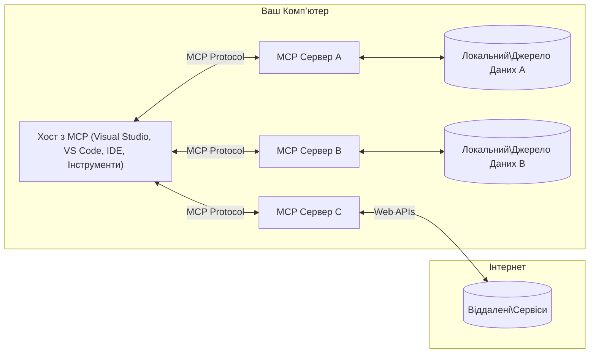

# Основні концепції MCP: Оволодіння протоколом контексту моделі для інтеграції ШІ

[](https://youtu.be/earDzWGtE84)

_(Натисніть на зображення вище, щоб переглянути відео цього уроку)_

[Протокол контексту моделі (MCP)](https://github.com/modelcontextprotocol) — це потужна стандартизована структура, яка оптимізує комунікацію між великими мовними моделями (LLM) та зовнішніми інструментами, додатками та джерелами даних.  
Цей посібник проведе вас через основні концепції MCP. Ви дізнаєтеся про його клієнт-серверну архітектуру, основні компоненти, механіку комунікації та найкращі практики впровадження.

- **Явна згода користувача**: Весь доступ до даних і операції вимагають явного схвалення користувача перед виконанням. Користувачі повинні чітко розуміти, які дані будуть доступні та які дії будуть виконані, з детальним контролем над дозволами та авторизаціями.

- **Захист конфіденційності даних**: Дані користувача відкриваються лише за явною згодою і мають бути захищені надійними механізмами контролю доступу протягом усього життєвого циклу взаємодії. Впровадження повинно запобігати несанкціонованій передачі даних і підтримувати суворі межі конфіденційності.

- **Безпека виконання інструментів**: Кожен виклик інструменту вимагає явної згоди користувача з чітким розумінням функціональності інструменту, параметрів і потенційного впливу. Надійні межі безпеки повинні запобігати ненавмисному, небезпечному або шкідливому виконанню інструментів.

- **Безпека транспортного рівня**: Всі канали зв’язку повинні використовувати відповідні механізми шифрування та автентифікації. Віддалені з’єднання повинні впроваджувати безпечні транспортні протоколи та належне управління обліковими даними.

#### Рекомендації щодо впровадження:

- **Управління дозволами**: Впроваджуйте системи тонкого контролю дозволів, які дозволяють користувачам керувати доступом до серверів, інструментів і ресурсів  
- **Аутентифікація та авторизація**: Використовуйте безпечні методи аутентифікації (OAuth, API-ключі) з належним управлінням токенами та їх терміном дії  
- **Перевірка вхідних даних**: Перевіряйте всі параметри та вхідні дані відповідно до визначених схем, щоб запобігти ін’єкційним атакам  
- **Аудит логів**: Підтримуйте повні журнали всіх операцій для моніторингу безпеки та відповідності

## Огляд

Цей урок досліджує фундаментальну архітектуру та компоненти, що складають екосистему Протоколу контексту моделі (MCP). Ви дізнаєтеся про клієнт-серверну архітектуру, ключові компоненти та механізми комунікації, які забезпечують взаємодію MCP.

## Основні навчальні цілі

До кінця цього уроку ви:

- Зрозумієте клієнт-серверну архітектуру MCP.  
- Визначите ролі та обов’язки хостів, клієнтів і серверів.  
- Проаналізуєте основні функції, які роблять MCP гнучким шаром інтеграції.  
- Дізнаєтеся, як інформація циркулює в екосистемі MCP.  
- Отримаєте практичні знання через приклади коду на .NET, Java, Python і JavaScript.

## Архітектура MCP: детальніше

Екосистема MCP побудована на моделі клієнт-сервер. Ця модульна структура дозволяє AI-додаткам ефективно взаємодіяти з інструментами, базами даних, API та контекстними ресурсами. Розглянемо цю архітектуру за основними компонентами.

В основі MCP лежить клієнт-серверна архітектура, де хост-додаток може підключатися до кількох серверів:


- **MCP Hosts**: Програми, такі як VSCode, Claude Desktop, IDE або AI-інструменти, які хочуть отримати доступ до даних через MCP  
- **MCP Clients**: Клієнти протоколу, які підтримують 1:1 з’єднання з серверами  
- **MCP Servers**: Легковагові програми, які надають конкретні можливості через стандартизований Протокол контексту моделі  
- **Локальні джерела даних**: Файли, бази даних і сервіси вашого комп’ютера, до яких MCP-сервери можуть безпечно отримувати доступ  
- **Віддалені сервіси**: Зовнішні системи, доступні через інтернет, до яких MCP-сервери можуть підключатися через API.

Протокол MCP — це еволюційний стандарт із версіонуванням за датою (формат YYYY-MM-DD). Поточна версія протоколу — **2025-11-25**. Ви можете переглянути останні оновлення в [специфікації протоколу](https://modelcontextprotocol.io/specification/2025-11-25/)

### 1. Хости

У Протоколі контексту моделі (MCP) **хости** — це AI-додатки, які служать основним інтерфейсом, через який користувачі взаємодіють із протоколом. Хости координують і керують підключеннями до кількох MCP-серверів, створюючи для кожного серверного з’єднання спеціалізованих MCP-клієнтів. Прикладами хостів є:

- **AI-додатки**: Claude Desktop, Visual Studio Code, Claude Code  
- **Середовища розробки**: IDE та редактори коду з інтеграцією MCP  
- **Користувацькі додатки**: Спеціалізовані AI-агенти та інструменти

**Хости** — це додатки, які координують взаємодію з AI-моделями. Вони:

- **Оркеструють AI-моделі**: Виконують або взаємодіють з LLM для генерації відповідей і координації AI-робочих процесів  
- **Керують клієнтськими підключеннями**: Створюють і підтримують по одному MCP-клієнту на кожне серверне з’єднання  
- **Керують інтерфейсом користувача**: Обробляють потік розмов, взаємодії користувача та відображення відповідей  
- **Забезпечують безпеку**: Контролюють дозволи, обмеження безпеки та аутентифікацію  
- **Обробляють згоду користувача**: Керують схваленням користувача для обміну даними та виконання інструментів

### 2. Клієнти

**Клієнти** — це ключові компоненти, які підтримують спеціалізовані однонаправлені з’єднання між хостами та MCP-серверами. Кожен MCP-клієнт створюється хостом для підключення до конкретного MCP-сервера, забезпечуючи організовані та безпечні канали комунікації. Кілька клієнтів дозволяють хостам одночасно підключатися до кількох серверів.

**Клієнти** — це компоненти-з’єднувачі всередині хост-додатка. Вони:

- **Комунікація протоколом**: Надсилають запити JSON-RPC 2.0 до серверів із підказками та інструкціями  
- **Переговори можливостей**: Узгоджують підтримувані функції та версії протоколу із серверами під час ініціалізації  
- **Виконання інструментів**: Керують запитами на виконання інструментів від моделей і обробляють відповіді  
- **Оновлення в реальному часі**: Обробляють повідомлення та оновлення від серверів у реальному часі  
- **Обробка відповідей**: Обробляють і форматують відповіді серверів для відображення користувачам

### 3. Сервери

**Сервери** — це програми, які надають контекст, інструменти та можливості MCP-клієнтам. Вони можуть виконуватися локально (на тій же машині, що й хост) або віддалено (на зовнішніх платформах) і відповідають за обробку запитів клієнтів і надання структурованих відповідей. Сервери надають конкретний функціонал через стандартизований Протокол контексту моделі.

**Сервери** — це сервіси, які надають контекст і можливості. Вони:

- **Реєстрація функцій**: Реєструють і надають доступні примітиви (ресурси, підказки, інструменти) клієнтам  
- **Обробка запитів**: Приймають і виконують виклики інструментів, запити ресурсів і підказок від клієнтів  
- **Надання контексту**: Забезпечують контекстну інформацію та дані для покращення відповідей моделей  
- **Управління станом**: Підтримують стан сесії та обробляють станозалежні взаємодії за потреби  
- **Повідомлення в реальному часі**: Надсилають повідомлення про зміни можливостей і оновлення підключеним клієнтам

Сервери можуть розроблятися будь-ким для розширення можливостей моделей спеціалізованим функціоналом і підтримують як локальне, так і віддалене розгортання.

### 4. Примітиви серверів

Сервери в Протоколі контексту моделі (MCP) надають три основні **примітиви**, які визначають фундаментальні будівельні блоки для багатої взаємодії між клієнтами, хостами та мовними моделями. Ці примітиви визначають типи контекстної інформації та дій, доступних через протокол.

MCP-сервери можуть надавати будь-яку комбінацію з наступних трьох основних примітивів:

#### Ресурси

**Ресурси** — це джерела даних, які надають контекстну інформацію AI-додаткам. Вони представляють статичний або динамічний контент, що може покращити розуміння моделі та прийняття рішень:

- **Контекстні дані**: Структурована інформація та контекст для споживання AI-моделлю  
- **Бази знань**: Репозиторії документів, статті, посібники та наукові роботи  
- **Локальні джерела даних**: Файли, бази даних і локальна системна інформація  
- **Зовнішні дані**: Відповіді API, веб-сервіси та дані віддалених систем  
- **Динамічний контент**: Дані в реальному часі, що оновлюються залежно від зовнішніх умов

Ресурси ідентифікуються URI і підтримують пошук через методи `resources/list` та отримання через `resources/read`:

```text
file://documents/project-spec.md
database://production/users/schema
api://weather/current
```

#### Підказки

**Підказки** — це багаторазові шаблони, які допомагають структурувати взаємодію з мовними моделями. Вони забезпечують стандартизовані шаблони взаємодії та шаблонізовані робочі процеси:

- **Взаємодія на основі шаблонів**: Попередньо структуровані повідомлення та початки розмов  
- **Шаблони робочих процесів**: Стандартизовані послідовності для поширених завдань і взаємодій  
- **Приклади з кількома зразками**: Шаблони на основі прикладів для інструкцій моделі  
- **Системні підказки**: Фундаментальні підказки, що визначають поведінку та контекст моделі  
- **Динамічні шаблони**: Параметризовані підказки, які адаптуються до конкретних контекстів

Підказки підтримують заміну змінних і можуть бути знайдені через `prompts/list` та отримані через `prompts/get`:

```markdown
Generate a {{task_type}} for {{product}} targeting {{audience}} with the following requirements: {{requirements}}
```

#### Інструменти

**Інструменти** — це виконувані функції, які мовні моделі можуть викликати для виконання конкретних дій. Вони представляють "дієслова" екосистеми MCP, дозволяючи моделям взаємодіяти із зовнішніми системами:

- **Виконувані функції**: Окремі операції, які моделі можуть викликати з конкретними параметрами  
- **Інтеграція із зовнішніми системами**: Виклики API, запити до баз даних, операції з файлами, обчислення  
- **Унікальна ідентичність**: Кожен інструмент має унікальне ім’я, опис і схему параметрів  
- **Структурований ввід/вивід**: Інструменти приймають перевірені параметри і повертають структуровані, типізовані відповіді  
- **Можливості дій**: Дозволяють моделям виконувати реальні дії та отримувати актуальні дані

Інструменти визначаються за допомогою JSON Schema для валідації параметрів і знаходяться через `tools/list` та виконуються через `tools/call`:

```typescript
server.tool(
  "search_products", 
  {
    query: z.string().describe("Search query for products"),
    category: z.string().optional().describe("Product category filter"),
    max_results: z.number().default(10).describe("Maximum results to return")
  }, 
  async (params) => {
    // Виконати пошук і повернути структуровані результати
    return await productService.search(params);
  }
);
```

## Примітиви клієнтів

У Протоколі контексту моделі (MCP) **клієнти** можуть надавати примітиви, які дозволяють серверам запитувати додаткові можливості від хост-додатка. Ці клієнтські примітиви дозволяють створювати багатші, більш інтерактивні серверні реалізації, які можуть отримувати доступ до можливостей AI-моделі та взаємодії з користувачем.

### Вибірка (Sampling)

**Вибірка** дозволяє серверам запитувати завершення мовної моделі від AI-додатка клієнта. Цей примітив дає змогу серверам отримувати можливості LLM без вбудовування власних залежностей моделей:

- **Незалежний від моделі доступ**: Сервери можуть запитувати завершення без включення SDK LLM або управління доступом до моделі  
- **AI, ініційований сервером**: Дозволяє серверам автономно генерувати контент за допомогою AI-моделі клієнта  
- **Рекурсивна взаємодія з LLM**: Підтримує складні сценарії, де серверам потрібна допомога AI для обробки  
- **Динамічне генерування контенту**: Дозволяє серверам створювати контекстні відповіді за допомогою моделі хоста

Вибірка ініціюється через метод `sampling/complete`, де сервери надсилають запити на завершення клієнтам.

### Запит (Elicitation)

**Запит** дозволяє серверам запитувати додаткову інформацію або підтвердження від користувачів через інтерфейс клієнта:

- **Запити вводу користувача**: Сервери можуть просити додаткову інформацію, необхідну для виконання інструменту  
- **Діалоги підтвердження**: Запитують схвалення користувача для чутливих або важливих операцій  
- **Інтерактивні робочі процеси**: Дозволяють серверам створювати покрокові взаємодії з користувачем  
- **Динамічний збір параметрів**: Збирають відсутні або необов’язкові параметри під час виконання інструменту

Запити здійснюються за допомогою методу `elicitation/request` для збору вводу користувача через інтерфейс клієнта.

### Логування (Logging)

**Логування** дозволяє серверам надсилати структуровані повідомлення журналу клієнтам для налагодження, моніторингу та операційної прозорості:

- **Підтримка налагодження**: Дозволяє серверам надавати детальні журнали виконання для усунення несправностей  
- **Оперативний моніторинг**: Надсилає оновлення статусу та метрики продуктивності клієнтам  
- **Звітність про помилки**: Надає детальний контекст помилок і діагностичну інформацію  
- **Аудитні сліди**: Створює повні журнали операцій і рішень сервера

Повідомлення журналу надсилаються клієнтам для забезпечення прозорості операцій сервера та полегшення налагодження.

## Потік інформації в MCP

Протокол контексту моделі (MCP) визначає структурований потік інформації між хостами, клієнтами, серверами та моделями. Розуміння цього потоку допомагає прояснити, як обробляються запити користувачів і як зовнішні інструменти та дані інтегруються у відповіді моделей.

- **Хост ініціює з’єднання**  
  Хост-додаток (наприклад, IDE або чат-інтерфейс) встановлює з’єднання з MCP-сервером, зазвичай через STDIO, WebSocket або інший підтримуваний транспорт.

- **Переговори можливостей**  
  Клієнт (вбудований у хост) і сервер обмінюються інформацією про підтримувані функції, інструменти, ресурси та версії протоколу. Це гарантує, що обидві сторони розуміють, які можливості доступні для сесії.

- **Запит користувача**  
  Користувач взаємодіє з хостом (наприклад, вводить підказку або команду). Хост збирає цей ввід і передає його клієнту для обробки.

- **Використання ресурсу або інструменту**  
  - Клієнт може запитувати додатковий контекст або ресурси у сервера (наприклад, файли, записи бази даних або статті бази знань) для збагачення розуміння моделі.  
  - Якщо модель визначає, що потрібен інструмент (наприклад, для отримання даних, виконання обчислення або виклику API), клієнт надсилає серверу запит на виклик інструменту з вказанням імені інструменту та параметрів.

- **Виконання сервером**  
  Сервер отримує запит на ресурс або інструмент, виконує необхідні операції (наприклад, виконує функцію, робить запит до бази даних або отримує файл) і повертає результати клієнту у структурованому форматі.

- **Генерація відповіді**  
  Клієнт інтегрує відповіді сервера (дані ресурсів, результати інструментів тощо) у поточну взаємодію з моделлю. Модель використовує цю інформацію для створення комплексної та контекстно релевантної відповіді.

- **Представлення результату**  
  Хост отримує кінцевий результат від клієнта і відображає його користувачу, часто включаючи як згенерований текст моделі, так і результати виконання інструментів або пошуку ресурсів.

Цей потік дозволяє MCP підтримувати просунуті, інтерактивні та контекстно обізнані AI-додатки, безшовно з’єднуючи моделі із зовнішніми інструментами та джерелами даних.

## Архітектура протоколу та шари

MCP складається з двох окремих архітектурних шарів, які працюють разом, щоб забезпечити повний комунікаційний каркас:

### Шар даних

**Шар даних** реалізує основний протокол MCP, використовуючи **JSON-RPC 2.0** як основу. Цей шар визначає структуру повідомлень, семантику та патерни взаємодії:

#### Основні компоненти:

- **Протокол JSON-RPC 2.0**: Вся комунікація використовує стандартизований формат повідомлень JSON-RPC 2.0 для викликів методів, відповідей і повідомлень  

- **Управління життєвим циклом**: Обробляє ініціалізацію з’єднання, узгодження можливостей та завершення сесії між клієнтами та серверами  
- **Примітиви сервера**: Дозволяють серверам надавати основний функціонал через інструменти, ресурси та підказки  
- **Примітиви клієнта**: Дозволяють серверам запитувати вибірку з LLM, отримувати введення користувача та надсилати журнальні повідомлення  
- **Сповіщення в реальному часі**: Підтримує асинхронні сповіщення для динамічних оновлень без опитування  

#### Ключові особливості:

- **Узгодження версії протоколу**: Використовує версіонування за датою (РРРР-ММ-ДД) для забезпечення сумісності  
- **Виявлення можливостей**: Клієнти та сервери обмінюються інформацією про підтримувані функції під час ініціалізації  
- **Сесії зі збереженням стану**: Підтримує стан з’єднання через кілька взаємодій для збереження контексту  

### Транспортний рівень

**Транспортний рівень** керує каналами зв’язку, формуванням повідомлень та автентифікацією між учасниками MCP:

#### Підтримувані транспортні механізми:

1. **Транспорт STDIO**:  
   - Використовує стандартні потоки введення/виведення для прямої комунікації процесів  
   - Оптимальний для локальних процесів на одній машині без мережевих накладних витрат  
   - Зазвичай використовується для локальних реалізацій MCP серверів  

2. **Потоковий HTTP транспорт**:  
   - Використовує HTTP POST для повідомлень від клієнта до сервера  
   - Опціональні події Server-Sent Events (SSE) для потокової передачі від сервера до клієнта  
   - Дозволяє віддалену комунікацію з сервером через мережі  
   - Підтримує стандартну HTTP автентифікацію (токени доступу, API ключі, кастомні заголовки)  
   - MCP рекомендує OAuth для безпечної автентифікації на основі токенів  

#### Абстракція транспорту:

Транспортний рівень абстрагує деталі комунікації від рівня даних, дозволяючи використовувати однаковий формат повідомлень JSON-RPC 2.0 для всіх транспортних механізмів. Ця абстракція дає змогу додаткам безшовно перемикатися між локальними та віддаленими серверами.

### Питання безпеки

Реалізації MCP повинні дотримуватися кількох критичних принципів безпеки для забезпечення безпечних, надійних та захищених взаємодій у всіх операціях протоколу:

- **Згода та контроль користувача**: Користувачі повинні надавати явну згоду перед доступом до будь-яких даних або виконанням операцій. Вони повинні мати чіткий контроль над тим, які дані передаються та які дії авторизовані, підтримуваний інтуїтивними інтерфейсами для перегляду та затвердження дій.

- **Конфіденційність даних**: Дані користувача повинні розкриватися лише за явною згодою та захищатися відповідними механізмами контролю доступу. Реалізації MCP мають запобігати несанкціонованій передачі даних і забезпечувати збереження конфіденційності у всіх взаємодіях.

- **Безпека інструментів**: Перед викликом будь-якого інструменту потрібна явна згода користувача. Користувачі повинні чітко розуміти функціонал кожного інструменту, а також мають бути впроваджені надійні межі безпеки для запобігання небажаному або небезпечному виконанню інструментів.

Дотримуючись цих принципів безпеки, MCP забезпечує довіру користувачів, конфіденційність і безпеку у всіх взаємодіях протоколу, одночасно дозволяючи потужні інтеграції ШІ.

## Приклади коду: ключові компоненти

Нижче наведені приклади коду на кількох популярних мовах програмування, які ілюструють, як реалізувати ключові компоненти MCP сервера та інструменти.

### Приклад .NET: створення простого MCP сервера з інструментами

Ось практичний приклад коду на .NET, що демонструє, як реалізувати простий MCP сервер з користувацькими інструментами. Цей приклад показує, як визначати та реєструвати інструменти, обробляти запити та підключати сервер за допомогою Model Context Protocol.

```csharp
using System;
using System.Threading.Tasks;
using ModelContextProtocol.Server;
using ModelContextProtocol.Server.Transport;
using ModelContextProtocol.Server.Tools;

public class WeatherServer
{
    public static async Task Main(string[] args)
    {
        // Create an MCP server
        var server = new McpServer(
            name: "Weather MCP Server",
            version: "1.0.0"
        );
        
        // Register our custom weather tool
        server.AddTool<string, WeatherData>("weatherTool", 
            description: "Gets current weather for a location",
            execute: async (location) => {
                // Call weather API (simplified)
                var weatherData = await GetWeatherDataAsync(location);
                return weatherData;
            });
        
        // Connect the server using stdio transport
        var transport = new StdioServerTransport();
        await server.ConnectAsync(transport);
        
        Console.WriteLine("Weather MCP Server started");
        
        // Keep the server running until process is terminated
        await Task.Delay(-1);
    }
    
    private static async Task<WeatherData> GetWeatherDataAsync(string location)
    {
        // This would normally call a weather API
        // Simplified for demonstration
        await Task.Delay(100); // Simulate API call
        return new WeatherData { 
            Temperature = 72.5,
            Conditions = "Sunny",
            Location = location
        };
    }
}

public class WeatherData
{
    public double Temperature { get; set; }
    public string Conditions { get; set; }
    public string Location { get; set; }
}
```

### Приклад Java: компоненти MCP сервера

Цей приклад демонструє той самий MCP сервер і реєстрацію інструментів, що й у прикладі .NET вище, але реалізований на Java.

```java
import io.modelcontextprotocol.server.McpServer;
import io.modelcontextprotocol.server.McpToolDefinition;
import io.modelcontextprotocol.server.transport.StdioServerTransport;
import io.modelcontextprotocol.server.tool.ToolExecutionContext;
import io.modelcontextprotocol.server.tool.ToolResponse;

public class WeatherMcpServer {
    public static void main(String[] args) throws Exception {
        // Створити MCP сервер
        McpServer server = McpServer.builder()
            .name("Weather MCP Server")
            .version("1.0.0")
            .build();
            
        // Зареєструвати інструмент погоди
        server.registerTool(McpToolDefinition.builder("weatherTool")
            .description("Gets current weather for a location")
            .parameter("location", String.class)
            .execute((ToolExecutionContext ctx) -> {
                String location = ctx.getParameter("location", String.class);
                
                // Отримати дані про погоду (спрощено)
                WeatherData data = getWeatherData(location);
                
                // Повернути відформатовану відповідь
                return ToolResponse.content(
                    String.format("Temperature: %.1f°F, Conditions: %s, Location: %s", 
                    data.getTemperature(), 
                    data.getConditions(), 
                    data.getLocation())
                );
            })
            .build());
        
        // Підключити сервер, використовуючи stdio транспорт
        try (StdioServerTransport transport = new StdioServerTransport()) {
            server.connect(transport);
            System.out.println("Weather MCP Server started");
            // Підтримувати сервер у роботі, поки процес не буде завершено
            Thread.currentThread().join();
        }
    }
    
    private static WeatherData getWeatherData(String location) {
        // Реалізація викликала б API погоди
        // Спрощено для прикладу
        return new WeatherData(72.5, "Sunny", location);
    }
}

class WeatherData {
    private double temperature;
    private String conditions;
    private String location;
    
    public WeatherData(double temperature, String conditions, String location) {
        this.temperature = temperature;
        this.conditions = conditions;
        this.location = location;
    }
    
    public double getTemperature() {
        return temperature;
    }
    
    public String getConditions() {
        return conditions;
    }
    
    public String getLocation() {
        return location;
    }
}
```

### Приклад Python: створення MCP сервера

Цей приклад використовує fastmcp, тому будь ласка, переконайтеся, що ви його встановили:

```python
pip install fastmcp
```
Приклад коду:

```python
#!/usr/bin/env python3
import asyncio
from fastmcp import FastMCP
from fastmcp.transports.stdio import serve_stdio

# Створити сервер FastMCP
mcp = FastMCP(
    name="Weather MCP Server",
    version="1.0.0"
)

@mcp.tool()
def get_weather(location: str) -> dict:
    """Gets current weather for a location."""
    return {
        "temperature": 72.5,
        "conditions": "Sunny",
        "location": location
    }

# Альтернативний підхід з використанням класу
class WeatherTools:
    @mcp.tool()
    def forecast(self, location: str, days: int = 1) -> dict:
        """Gets weather forecast for a location for the specified number of days."""
        return {
            "location": location,
            "forecast": [
                {"day": i+1, "temperature": 70 + i, "conditions": "Partly Cloudy"}
                for i in range(days)
            ]
        }

# Зареєструвати інструменти класу
weather_tools = WeatherTools()

# Запустити сервер
if __name__ == "__main__":
    asyncio.run(serve_stdio(mcp))
```

### Приклад JavaScript: створення MCP сервера

Цей приклад показує створення MCP сервера на JavaScript і як зареєструвати два інструменти, пов’язані з погодою.

```javascript
// Використання офіційного SDK протоколу Model Context
import { McpServer } from "@modelcontextprotocol/sdk/server/mcp.js";
import { StdioServerTransport } from "@modelcontextprotocol/sdk/server/stdio.js";
import { z } from "zod"; // Для перевірки параметрів

// Створити сервер MCP
const server = new McpServer({
  name: "Weather MCP Server",
  version: "1.0.0"
});

// Визначити інструмент погоди
server.tool(
  "weatherTool",
  {
    location: z.string().describe("The location to get weather for")
  },
  async ({ location }) => {
    // Зазвичай це виклик API погоди
    // Спрощено для демонстрації
    const weatherData = await getWeatherData(location);
    
    return {
      content: [
        { 
          type: "text", 
          text: `Temperature: ${weatherData.temperature}°F, Conditions: ${weatherData.conditions}, Location: ${weatherData.location}` 
        }
      ]
    };
  }
);

// Визначити інструмент прогнозу
server.tool(
  "forecastTool",
  {
    location: z.string(),
    days: z.number().default(3).describe("Number of days for forecast")
  },
  async ({ location, days }) => {
    // Зазвичай це виклик API погоди
    // Спрощено для демонстрації
    const forecast = await getForecastData(location, days);
    
    return {
      content: [
        { 
          type: "text", 
          text: `${days}-day forecast for ${location}: ${JSON.stringify(forecast)}` 
        }
      ]
    };
  }
);

// Допоміжні функції
async function getWeatherData(location) {
  // Імітація виклику API
  return {
    temperature: 72.5,
    conditions: "Sunny",
    location: location
  };
}

async function getForecastData(location, days) {
  // Імітація виклику API
  return Array.from({ length: days }, (_, i) => ({
    day: i + 1,
    temperature: 70 + Math.floor(Math.random() * 10),
    conditions: i % 2 === 0 ? "Sunny" : "Partly Cloudy"
  }));
}

// Підключити сервер за допомогою stdio транспорту
const transport = new StdioServerTransport();
server.connect(transport).catch(console.error);

console.log("Weather MCP Server started");
```

Цей приклад на JavaScript демонструє, як створити MCP клієнта, який підключається до сервера, надсилає підказку та обробляє відповідь, включно з будь-якими викликами інструментів.

## Безпека та авторизація

MCP включає кілька вбудованих концепцій і механізмів для управління безпекою та авторизацією протягом усього протоколу:

1. **Контроль дозволів інструментів**:  
  Клієнти можуть вказувати, які інструменти модель може використовувати під час сесії. Це гарантує, що доступні лише явно авторизовані інструменти, знижуючи ризик небажаних або небезпечних операцій. Дозволи можна налаштовувати динамічно залежно від уподобань користувача, політик організації або контексту взаємодії.

2. **Аутентифікація**:  
  Сервери можуть вимагати аутентифікацію перед наданням доступу до інструментів, ресурсів або чутливих операцій. Це може включати API ключі, OAuth токени або інші схеми аутентифікації. Правильна аутентифікація гарантує, що лише довірені клієнти та користувачі можуть викликати можливості сервера.

3. **Валідація**:  
  Валідація параметрів застосовується для всіх викликів інструментів. Кожен інструмент визначає очікувані типи, формати та обмеження для своїх параметрів, а сервер відповідно перевіряє вхідні запити. Це запобігає надходженню некоректних або шкідливих даних до реалізацій інструментів і допомагає підтримувати цілісність операцій.

4. **Обмеження частоти**:  
  Для запобігання зловживанням і забезпечення справедливого використання ресурсів сервера MCP може впроваджувати обмеження частоти викликів інструментів і доступу до ресурсів. Обмеження можуть застосовуватися на користувача, сесію або глобально, допомагаючи захиститися від атак відмови в обслуговуванні або надмірного споживання ресурсів.

Поєднуючи ці механізми, MCP забезпечує безпечну основу для інтеграції мовних моделей із зовнішніми інструментами та джерелами даних, одночасно надаючи користувачам і розробникам тонкий контроль над доступом і використанням.

## Повідомлення протоколу та потік комунікації

Комунікація MCP використовує структуровані повідомлення **JSON-RPC 2.0** для забезпечення чітких і надійних взаємодій між хостами, клієнтами та серверами. Протокол визначає конкретні шаблони повідомлень для різних типів операцій:

### Основні типи повідомлень:

#### **Повідомлення ініціалізації**
- Запит **`initialize`**: встановлює з’єднання та узгоджує версію протоколу і можливості  
- Відповідь **`initialize`**: підтверджує підтримувані функції та інформацію про сервер  
- **`notifications/initialized`**: сигналізує, що ініціалізація завершена і сесія готова  

#### **Повідомлення виявлення**
- Запит **`tools/list`**: виявляє доступні інструменти на сервері  
- Запит **`resources/list`**: перелік доступних ресурсів (джерел даних)  
- Запит **`prompts/list`**: отримує доступні шаблони підказок  

#### **Повідомлення виконання**  
- Запит **`tools/call`**: виконує конкретний інструмент з наданими параметрами  
- Запит **`resources/read`**: отримує вміст конкретного ресурсу  
- Запит **`prompts/get`**: отримує шаблон підказки з опціональними параметрами  

#### **Повідомлення на стороні клієнта**
- Запит **`sampling/complete`**: сервер запитує завершення LLM від клієнта  
- **`elicitation/request`**: сервер запитує введення користувача через інтерфейс клієнта  
- Журнальні повідомлення: сервер надсилає структуровані журнальні повідомлення клієнту  

#### **Повідомлення сповіщень**
- **`notifications/tools/list_changed`**: сервер повідомляє клієнта про зміни в списку інструментів  
- **`notifications/resources/list_changed`**: сервер повідомляє клієнта про зміни в списку ресурсів  
- **`notifications/prompts/list_changed`**: сервер повідомляє клієнта про зміни в списку підказок  

### Структура повідомлень:

Всі повідомлення MCP відповідають формату JSON-RPC 2.0 з:  
- **Запити**: містять `id`, `method` та опціональні `params`  
- **Відповіді**: містять `id` та або `result`, або `error`  
- **Сповіщення**: містять `method` та опціональні `params` (без `id` і відповіді)  

Ця структурована комунікація забезпечує надійні, відстежувані та розширювані взаємодії, підтримуючи складні сценарії, такі як оновлення в реальному часі, ланцюжки інструментів і надійне оброблення помилок.

## Основні висновки

- **Архітектура**: MCP використовує клієнт-серверну архітектуру, де хости керують кількома клієнтськими з’єднаннями з серверами  
- **Учасники**: екосистема включає хости (ШІ-додатки), клієнти (протокольні конектори) та сервери (постачальники можливостей)  
- **Транспортні механізми**: комунікація підтримує STDIO (локальний) та потоковий HTTP з опціональним SSE (віддалений)  
- **Основні примітиви**: сервери надають інструменти (виконувані функції), ресурси (джерела даних) та підказки (шаблони)  
- **Примітиви клієнта**: сервери можуть запитувати вибірку (LLM завершення), отримання введення (elicitation) та логування від клієнтів  
- **Основа протоколу**: побудований на JSON-RPC 2.0 з версіонуванням за датою (поточна: 2025-11-25)  
- **Можливості в реальному часі**: підтримує сповіщення для динамічних оновлень і синхронізації в реальному часі  
- **Безпека на першому місці**: явна згода користувача, захист конфіденційності даних і безпечний транспорт — основні вимоги  

## Завдання

Спроєктуйте простий інструмент MCP, який був би корисним у вашій сфері. Визначте:  
1. Як називатиметься інструмент  
2. Які параметри він прийматиме  
3. Який результат він повертатиме  
4. Як модель може використовувати цей інструмент для розв’язання проблем користувача  

---

## Що далі

Далі: [Розділ 2: Безпека](../02-Security/README.md)

---

<!-- CO-OP TRANSLATOR DISCLAIMER START -->
**Відмова від відповідальності**:  
Цей документ було перекладено за допомогою сервісу автоматичного перекладу [Co-op Translator](https://github.com/Azure/co-op-translator). Хоча ми прагнемо до точності, будь ласка, майте на увазі, що автоматичні переклади можуть містити помилки або неточності. Оригінальний документ рідною мовою слід вважати авторитетним джерелом. Для критично важливої інформації рекомендується звертатися до професійного людського перекладу. Ми не несемо відповідальності за будь-які непорозуміння або неправильні тлумачення, що виникли внаслідок використання цього перекладу.
<!-- CO-OP TRANSLATOR DISCLAIMER END -->