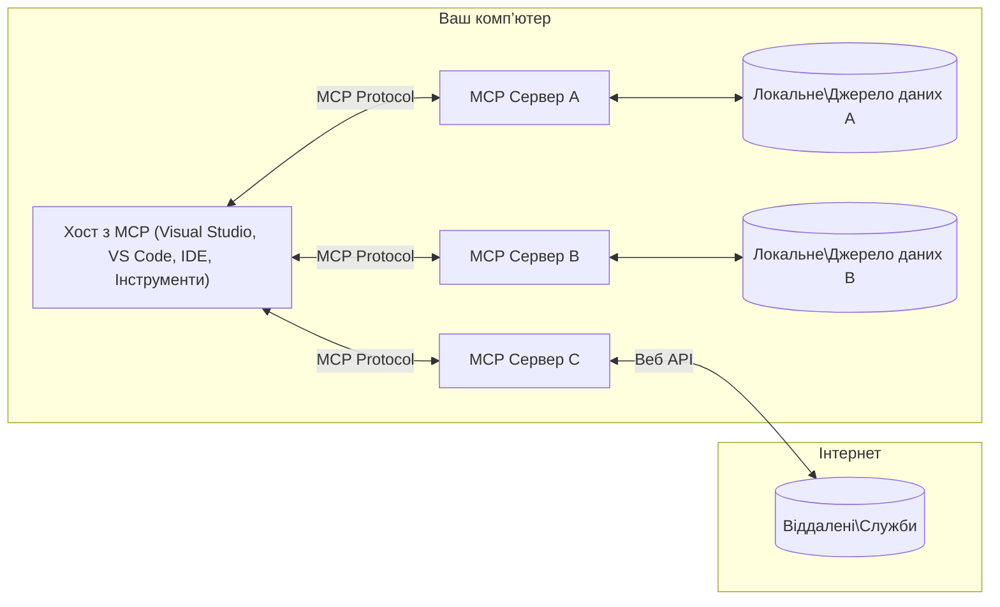

# Основні концепції MCP: освоєння протоколу контексту моделі для інтеграції штучного інтелекту

[](https://youtu.be/earDzWGtE84)

_(Натисніть на зображення вище, щоб переглянути відео цього уроку)_

[Протокол контексту моделі (MCP)](https://github.com/modelcontextprotocol) — це потужна стандартизована рамкова система, що оптимізує комунікацію між великими мовними моделями (LLM) та зовнішніми інструментами, застосунками й джерелами даних.
Цей посібник проведе вас через основні концепції MCP. Ви дізнаєтесь про його клієнт-серверну архітектуру, основні компоненти, механіку комунікації та найкращі практики імплементації.

- **Явна згода користувача**: Весь доступ до даних і операції потребують явного схвалення користувачем перед виконанням. Користувачі повинні чітко розуміти, до яких даних буде здійснено доступ і які дії будуть виконані, з детальним контролем над дозволами та авторизацією.

- **Захист конфіденційності даних**: Дані користувача доступні лише за явної згоди і мають захищатися надійними обмеженнями доступу протягом усього циклу взаємодії. Імплементації повинні запобігати несанкціонованій передачі даних і підтримувати суворі межі приватності.

- **Безпека виконання інструментів**: Кожен виклик інструменту вимагає явної згоди користувача з чітким розумінням функціональності інструменту, параметрів та потенційного впливу. Надійні межі безпеки повинні запобігати ненавмисному, небезпечному або шкідливому запуску інструментів.

- **Безпека транспортного рівня**: Всі канали зв’язку повинні використовувати відповідні механізми шифрування та автентифікації. Віддалені з’єднання мають застосовувати безпечні транспортні протоколи та належне керування обліковими даними.

#### Керівництво з імплементації:

- **Керування дозволами**: Впровадьте детальні системи керування дозволами, які дозволяють користувачам контролювати, які сервери, інструменти та ресурси є доступними
- **Автентифікація та авторизація**: Використовуйте безпечні методи автентифікації (OAuth, API ключі) з належним управлінням токенами та термінами дії
- **Валідація вхідних даних**: Перевіряйте всі параметри та вхідні дані відповідно до визначених схем, щоб запобігти ін’єкційним атакам
- **Аудит логів**: Підтримуйте комплексні журнали всіх операцій для моніторингу безпеки та відповідності

## Огляд

У цьому уроці розглядається фундаментальна архітектура та компоненти, які складають екосистему протоколу контексту моделі (MCP). Ви дізнаєтесь про клієнт-серверну архітектуру, ключові компоненти та механізми комунікації, які забезпечують взаємодію за MCP.

## Основні навчальні цілі

До кінця цього уроку ви зможете:

- Розуміти клієнт-серверну архітектуру MCP.
- Визначати ролі та обов’язки Хостів, Клієнтів та Серверів.
- Аналізувати основні функції, що роблять MCP гнучким шаром інтеграції.
- Дізнатись, як інформація циркулює в екосистемі MCP.
- Отримати практичні знання через приклади коду на .NET, Java, Python і JavaScript.

## Архітектура MCP: глибший погляд

Екосистема MCP побудована на клієнт-серверній моделі. Ця модульна структура дозволяє AI-застосункам ефективно взаємодіяти з інструментами, базами даних, API та контекстними ресурсами. Розглянемо цю архітектуру за основними компонентами.

В основі MCP лежить клієнт-серверна архітектура, де хост-застосунок може під’єднуватися до кількох серверів:


```mermaid
flowchart LR
    subgraph "Ваш комп’ютер"
        Host["Хост з MCP (Visual Studio, VS Code, IDE, Інструменти)"]
        S1["MCP Сервер A"]
        S2["MCP Сервер B"]
        S3["MCP Сервер C"]
        Host <-->|"MCP Protocol"| S1
        Host <-->|"MCP Protocol"| S2
        Host <-->|"MCP Protocol"| S3
        S1 <--> D1[("Локальне\Джерело даних A")]
        S2 <--> D2[("Локальне\Джерело даних B")]
    end
    subgraph "Інтернет"
        S3 <-->|"Веб API"| D3[("Віддалені\Служби")]
    end
```
- **MCP Hosts (Хости)**: Програми, такі як VSCode, Claude Desktop, IDE або AI-інструменти, що хочуть отримати доступ до даних через MCP
- **MCP Clients (Клієнти)**: Клієнти протоколу, які підтримують 1:1 з’єднання з серверами
- **MCP Servers (Сервери)**: Легкі програми, які надають конкретні можливості через стандартизований Протокол Контексту Моделі
- **Локальні джерела даних**: Файли, бази даних і сервіси вашого комп’ютера, до яких можуть безпечно звертатися MCP сервери
- **Віддалені сервіси**: Зовнішні системи в інтернеті, з якими MCP сервери можуть з’єднуватися через API.

Протокол MCP є стандартом, що розвивається, з версіями у форматі дати (YYYY-MM-DD). Поточна версія протоколу — **2025-11-25**. Ви можете ознайомитись з останніми оновленнями [специфікації протоколу](https://modelcontextprotocol.io/specification/2025-11-25/)

### 1. Хости

У протоколі контексту моделі (MCP) **Хости** — це AI-застосунки, які виступають основним інтерфейсом для користувачів для взаємодії з протоколом. Хости координують та керують підключеннями до кількох MCP серверів, створюючи спеціалізованих MCP клієнтів для кожного серверного з’єднання. Приклади хостів:

- **AI-застосунки**: Claude Desktop, Visual Studio Code, Claude Code
- **Середовища розробки**: IDE та редактори коду з інтеграцією MCP
- **Користувацькі застосунки**: Спеціалізовані AI-агенти та інструменти

**Хости** — це застосунки, які координують взаємодію з AI-моделями. Вони:

- **Оркеструють AI-моделі**: Виконують або взаємодіють з LLM для генерації відповідей та координації AI-процесів
- **Керують клієнтськими з’єднаннями**: Створюють і підтримують по одному MCP клієнту для кожного серверного з’єднання
- **Керують інтерфейсом користувача**: Керують потоком розмов, взаємодією користувача та відображенням відповідей
- **Забезпечують безпеку**: Контролюють дозволи, обмеження безпеки та автентифікацію
- **Опрацьовують згоду користувача**: Керують підтвердженням користувача для спільного доступу до даних і запуску інструментів

### 2. Клієнти

**Клієнти** — це важливі компоненти, які підтримують спеціалізовані один-до-одного з’єднання між Хостами та MCP серверами. Кожен MCP клієнт створюється Хостом для з’єднання з конкретним MCP сервером, забезпечуючи організовані й захищені канали зв’язку. Множинні клієнти дозволяють Хостам одночасно підключатися до кількох серверів.

**Клієнти** — це конекторні компоненти у хост-застосунку. Вони:

- **Обмін по протоколу**: Відправляють JSON-RPC 2.0 запити до серверів із підказками та інструкціями
- **Узгодження можливостей**: Узгоджують підтримувані функції й версії протоколу під час ініціалізації з серверами
- **Виконання інструментів**: Керують запитами на запуск інструментів від моделей і обробляють відповіді
- **Оновлення в реальному часі**: Керують повідомленнями та оновленнями від серверів
- **Обробка відповідей**: Обробляють і форматують відповіді сервера для відображення користувачам

### 3. Сервери

**Сервери** — це програми, які надають контекст, інструменти та функції клієнтам MCP. Вони можуть запускатися локально (на тій же машині, що й Хост) або віддалено (на зовнішніх платформах), і відповідають за обробку запитів клієнтів та надання структурованих відповідей. Сервери надають специфічний функціонал через стандартизований протокол MCP.

**Сервери** — це сервіси, які надають контекст і можливості. Вони:

- **Реєстрація функцій**: Реєструють і надають доступні примітиви (ресурси, підказки, інструменти) клієнтам
- **Обробка запитів**: Приймають і виконують виклики інструментів, запити до ресурсів і підказок від клієнтів
- **Постачання контексту**: Забезпечують контекстну інформацію й дані для покращення відповідей моделей
- **Керування станом**: Підтримують стан сесії і керують станом у разі потреби
- **Повідомлення в реальному часі**: Надсилають сповіщення про зміни функціональності та оновлення підключеним клієнтам

Сервери можуть розробляти будь-хто для розширення можливостей моделей спеціалізованим функціоналом і підтримують як локальне, так і віддалене розгортання.

### 4. Примітиви сервера

Сервери в протоколі MCP надають три основні **примітиви**, які визначають базові будівельні блоки для насичених взаємодій між клієнтами, хостами та мовними моделями. Ці примітиви вказують типи контекстної інформації та дій, доступних через протокол.

MCP сервери можуть надавати будь-яке поєднання наступних трьох основних примітивів:

#### Ресурси

**Ресурси** — це джерела даних, які постачають контекстну інформацію AI-застосункам. Вони репрезентують статичний або динамічний контент, що підвищує розуміння моделі та прийняття рішень:

- **Контекстні дані**: Структурована інформація й контекст для споживання AI-моделлю
- **Бази знань**: Репозиторії документів, статті, посібники та наукові роботи
- **Локальні джерела даних**: Файли, бази даних і локальна системна інформація
- **Зовнішні дані**: Відповіді API, веб-сервіси і віддалені дані систем
- **Динамічний контент**: Дані в реальному часі, що оновлюються залежно від зовнішніх умов

Ресурси ідентифікуються URI і підтримують пошук через метод `resources/list` та отримання через метод `resources/read`:

```text
file://documents/project-spec.md
database://production/users/schema
api://weather/current
```

#### Підказки

**Підказки** — це багаторазові шаблони, що допомагають структурувати взаємодії з мовними моделями. Вони забезпечують стандартизовані шаблони взаємодії і типові робочі процеси:

- **Інтерактивність на основі шаблонів**: Попередньо структуровані повідомлення та початкові фрази для розмови
- **Шаблони робочих процесів**: Стандартизовані послідовності для поширених задач і взаємодій
- **Приклади з кількома варіантами**: Шаблони на основі прикладів для інструкції моделей
- **Системні підказки**: Базові підказки, що визначають поведінку і контекст моделі
- **Динамічні шаблони**: Параметризовані підказки, які адаптуються до конкретного контексту

Підказки підтримують заміну змінних і можуть бути знайдені через `prompts/list` і отримані через `prompts/get`:

```markdown
Generate a {{task_type}} for {{product}} targeting {{audience}} with the following requirements: {{requirements}}
```

#### Інструменти

**Інструменти** — це виконувані функції, які AI-моделі можуть викликати для виконання конкретних дій. Вони є "дієсловами" екосистеми MCP, дозволяючи моделям взаємодіяти з зовнішніми системами:

- **Виконувані функції**: Дискретні операції, які моделі можуть викликати з певними параметрами
- **Інтеграція із зовнішніми системами**: Виклики API, запити до баз даних, операції з файлами, обчислення
- **Унікальна ідентифікація**: Кожен інструмент має унікальне ім’я, опис та схему параметрів
- **Структурований ввід/вивід**: Інструменти приймають перевірені параметри й повертають структуровані, типізовані відповіді
- **Можливість дій**: Дозволяють моделям виконувати дії у реальному світі та отримувати живі дані

Інструменти визначаються за допомогою JSON Schema для валідації параметрів і знаходяться через `tools/list`, виконуются через `tools/call`. Інструменти можуть також містити **іконки** як додаткові метадані для кращого UI-представлення.

**Анотації інструментів**: Інструменти підтримують поведінкові анотації (наприклад, `readOnlyHint`, `destructiveHint`), які описують, чи є інструмент призначеним лише для читання або деструктивним, допомагаючи клієнтам приймати обґрунтовані рішення щодо виконання інструменту.

Приклад визначення інструменту:

```typescript
server.tool(
  "search_products", 
  {
    query: z.string().describe("Search query for products"),
    category: z.string().optional().describe("Product category filter"),
    max_results: z.number().default(10).describe("Maximum results to return")
  }, 
  async (params) => {
    // Виконати пошук і повернути структуровані результати
    return await productService.search(params);
  }
);
```

## Примітиви клієнтів

У протоколі MCP **клієнти** можуть надавати примітиви, що дозволяють серверам запитувати додаткові можливості від хост-застосунку. Ці клієнтські примітиви забезпечують багатші, більш інтерактивні реалізації серверів, які можуть отримувати доступ до можливостей AI-моделей і взаємодій користувачів.

### Семплювання

**Семплювання** дозволяє серверам запитувати доповнення мовної моделі з AI-застосунку клієнта. Цей примітив надає серверам доступ до можливостей LLM без необхідності вбудовувати власні залежності моделей:

- **Незалежний доступ до моделі**: Сервери можуть запитувати доповнення без включення SDK LLM або керування доступом до моделей
- **Ініційований сервером AI**: Дозволяє серверам автономно генерувати контент із використанням AI-моделі клієнта
- **Рекурсивна взаємодія з LLM**: Підтримує складні сценарії, де сервери потребують допомоги AI для обробки
- **Динамічне генерування контенту**: Дозволяє серверам створювати контекстні відповіді з використанням моделі хоста
- **Підтримка виклику інструментів**: Сервери можуть включати параметри `tools` та `toolChoice`, щоб дати змогу моделі клієнта викликати інструменти під час семплювання

Семплювання ініціюється через метод `sampling/complete`, де сервери відправляють запити доповнень клієнтам.

### Корені

**Корені** надають стандартизований спосіб для клієнтів оголошувати межі файлової системи серверам, допомагаючи серверам розуміти, до яких директорій та файлів вони мають доступ:

- **Межі файлової системи**: Визначають межі, в межах яких сервери можуть працювати в файловій системі
- **Контроль доступу**: Допомагають серверам розуміти, до яких директорій та файлів у них є право доступу
- **Динамічні оновлення**: Клієнти можуть повідомляти сервери про зміни у списку коренів
- **Ідентифікація на основі URI**: Корені використовують URI з префіксом `file://` для позначення доступних директорій і файлів

Корені знаходяться через метод `roots/list`, з клієнтськими повідомленнями `notifications/roots/list_changed` у разі змін.

### Запити на уточнення (elicitation)

**Запити на уточнення** дозволяють серверам запитувати додаткову інформацію або підтвердження від користувачів через інтерфейс клієнта:

- **Запити вводу користувача**: Сервери можуть просити додаткову інформацію, необхідну для виконання інструментів
- **Діалоги підтвердження**: Запрошують схвалення користувача для чутливих або важливих операцій
- **Інтерактивні робочі процеси**: Дають змогу серверам створювати покрокові взаємодії з користувачем
- **Динамічний збір параметрів**: Збирають відсутні чи необов’язкові параметри під час виконання інструментів

Запити на уточнення надсилаються через метод `elicitation/request` для збору вводу користувача через інтерфейс клієнта.

**У режимі URL-запитів**: Сервери також можуть запитувати взаємодію користувача через URL, направляючи їх на зовнішні веб-сторінки для автентифікації, підтвердження чи введення даних.

### Логування

**Логування** дозволяє серверам надсилати структуровані повідомлення журналу клієнтам для налагодження, моніторингу та операційної прозорості:

- **Підтримка налагодження**: Дає змогу серверам надавати детальні журнали виконання для усунення неполадок
- **Оперативний моніторинг**: Надсилає клієнтам оновлення стану та показники продуктивності
- **Повідомлення про помилки**: Надає детальний контекст помилок та діагностичну інформацію
- **Аудит журналів**: Створює комплексні журнали операцій і рішень серверів

Повідомлення журналу надсилаються клієнтам для прозорості серверних операцій і полегшення налагодження.

## Потік інформації у MCP

Протокол контексту моделі (MCP) визначає структурований потік інформації між хостами, клієнтами, серверами та моделями. Розуміння цього потоку допомагає зрозуміти, як обробляються запити користувачів і як зовнішні інструменти та дані інтегруються в відповіді моделей.
- **Хост ініціює з'єднання**  
  Хост-додаток (наприклад, IDE чи чат-інтерфейс) встановлює з'єднання з MCP сервером, зазвичай через STDIO, WebSocket або інший підтримуваний транспорт.

- **Узгодження можливостей**  
  Клієнт (вбудований у хост) і сервер обмінюються інформацією про свої підтримувані функції, інструменти, ресурси та версії протоколу. Це гарантує, що обидві сторони розуміють, які можливості доступні для сесії.

- **Користувацький запит**  
  Користувач взаємодіє з хостом (наприклад, вводить запит або команду). Хост збирає цей вхід і передає його клієнту для обробки.

- **Використання ресурсу або інструменту**  
  - Клієнт може запитувати додатковий контекст або ресурси у сервера (наприклад, файли, записи в базі даних або статті з бази знань) для розширення розуміння моделі.
  - Якщо модель визначає, що потрібен інструмент (наприклад, для отримання даних, виконання обчислень чи виклику API), клієнт відправляє запит на виклик інструменту серверу із зазначенням назви інструменту та параметрів.

- **Виконання на сервері**  
  Сервер отримує запит на ресурс або інструмент, виконує необхідні операції (наприклад, виклик функції, запит у базу даних або отримання файлу) і повертає результати клієнту у структурованому форматі.

- **Формування відповіді**  
  Клієнт інтегрує відповіді сервера (дані ресурсів, результати інструментів тощо) у поточну взаємодію з моделлю. Модель використовує цю інформацію для генерації комплексної та контекстно релевантної відповіді.

- **Представлення результату**  
  Хост отримує кінцевий результат від клієнта і демонструє його користувачу, часто включаючи як текст, згенерований моделлю, так і результати виконання інструментів або пошуку ресурсів.

Цей процес дозволяє MCP підтримувати розвинені, інтерактивні та контекстуально-залежні AI-застосунки, безшовно поєднуючи моделі з зовнішніми інструментами та джерелами даних.

## Архітектура та шари протоколу

MCP складається з двох окремих архітектурних шарів, які працюють разом, щоб забезпечити повноцінний комунікаційний каркас:

### Шар даних

**Шар даних** реалізує основний протокол MCP, використовуючи за основу **JSON-RPC 2.0**. Цей шар визначає структуру повідомлень, семантику та шаблони взаємодії:

#### Основні компоненти:

- **Протокол JSON-RPC 2.0**: Вся комунікація використовує стандартизований формат повідомлень JSON-RPC 2.0 для викликів методів, відповідей і сповіщень
- **Управління життєвим циклом**: Обробляє ініціалізацію з'єднання, узгодження можливостей і завершення сесії між клієнтами та серверами
- **Примітиви сервера**: Дозволяють серверам надавати основні функції через інструменти, ресурси та підказки
- **Примітиви клієнта**: Дозволяють серверам запитувати вибірку від LLM, отримувати користувацький ввід і надсилати логові повідомлення
- **Оповіщення в реальному часі**: Підтримує асинхронні повідомлення для динамічних оновлень без потреби у постійному опитуванні

#### Ключові особливості:

- **Узгодження версії протоколу**: Використовує версію на основі дати (РРРР-ММ-ДД) для забезпечення сумісності
- **Виявлення можливостей**: Клієнти та сервери обмінюються інформацією про підтримувані функції під час ініціалізації
- **Сесії зі збереженням стану**: Підтримує стан з'єднання через кілька взаємодій для збереження контексту

### Транспортний шар

**Транспортний шар** керує каналами зв’язку, кадруванням повідомлень та автентифікацією між учасниками MCP:

#### Підтримувані транспортні механізми:

1. **Транспорт STDIO**:
   - Використовує стандартні потоки вводу/виводу для прямої комунікації між процесами
   - Оптимальний для локальних процесів на одній машині без мережевих накладних витрат
   - Часто використовується для локальних реалізацій MCP-серверів

2. **Потоковий HTTP транспорт**:
   - Використовує HTTP POST для повідомлень від клієнта до сервера  
   - Опційні Server-Sent Events (SSE) для потокової передачі від сервера до клієнта
   - Дозволяє віддалену комунікацію по мережі
   - Підтримує стандартну HTTP автентифікацію (токени типу bearer, API ключі, кастомні заголовки)
   - MCP рекомендує OAuth для безпечної автентифікації на основі токенів

#### Абстракція транспорту:

Транспортний шар абстрагує деталі комунікації від шару даних, дозволяючи використовувати однаковий формат повідомлень JSON-RPC 2.0 для всіх транспортних механізмів. Ця абстракція дозволяє додаткам безшовно перемикатися між локальними та віддаленими серверами.

### Питання безпеки

Реалізації MCP мають дотримуватися кількох критичних принципів безпеки для забезпечення безпечної, надійної та захищеної взаємодії у межах всіх операцій протоколу:

- **Згода та контроль користувача**: Користувачі повинні давати явну згоду перед доступом до будь-яких даних або виконанням операцій. Вони мають мати чіткий контроль над тим, які дані передаються та які дії дозволені, підтримуваний інтуїтивними інтерфейсами для перегляду та схвалення дій.

- **Конфіденційність даних**: Дані користувача повинні передаватися лише з явної згоди та бути захищені належним контролем доступу. Реалізації MCP зобов’язані запобігати несанкціонованій передачі даних і забезпечувати збереження конфіденційності протягом усієї взаємодії.

- **Безпечність інструментів**: Перш ніж викликати будь-який інструмент, необхідна явна згода користувача. Користувачі повинні чітко розуміти функціонал кожного інструменту, а також мати жорсткі обмеження безпеки для запобігання неправомірному або небезпечному виконанню.

Дотримуючись цих принципів безпеки, MCP забезпечує довіру, конфіденційність і захист користувачів у всіх взаємодіях протоколу, при цьому надаючи потужні можливості інтеграції AI.

## Приклади коду: ключові компоненти

Нижче наведені приклади коду на кількох популярних мовах програмування, які демонструють, як реалізувати основні компоненти та інструменти MCP серверу.

### Приклад .NET: створення простого MCP серверу з інструментами

Ось практичний приклад на .NET, що демонструє, як реалізувати простий MCP сервер із власними інструментами. Приклад ілюструє, як визначити та зареєструвати інструменти, обробляти запити і підключати сервер за допомогою Model Context Protocol.

```csharp
using System;
using System.Threading.Tasks;
using ModelContextProtocol.Server;
using ModelContextProtocol.Server.Transport;
using ModelContextProtocol.Server.Tools;

public class WeatherServer
{
    public static async Task Main(string[] args)
    {
        // Create an MCP server
        var server = new McpServer(
            name: "Weather MCP Server",
            version: "1.0.0"
        );
        
        // Register our custom weather tool
        server.AddTool<string, WeatherData>("weatherTool", 
            description: "Gets current weather for a location",
            execute: async (location) => {
                // Call weather API (simplified)
                var weatherData = await GetWeatherDataAsync(location);
                return weatherData;
            });
        
        // Connect the server using stdio transport
        var transport = new StdioServerTransport();
        await server.ConnectAsync(transport);
        
        Console.WriteLine("Weather MCP Server started");
        
        // Keep the server running until process is terminated
        await Task.Delay(-1);
    }
    
    private static async Task<WeatherData> GetWeatherDataAsync(string location)
    {
        // This would normally call a weather API
        // Simplified for demonstration
        await Task.Delay(100); // Simulate API call
        return new WeatherData { 
            Temperature = 72.5,
            Conditions = "Sunny",
            Location = location
        };
    }
}

public class WeatherData
{
    public double Temperature { get; set; }
    public string Conditions { get; set; }
    public string Location { get; set; }
}
```

### Приклад Java: компоненти MCP серверу

Цей приклад демонструє той самий MCP сервер і реєстрацію інструментів, що й приклад .NET вище, але реалізований на Java.

```java
import io.modelcontextprotocol.server.McpServer;
import io.modelcontextprotocol.server.McpToolDefinition;
import io.modelcontextprotocol.server.transport.StdioServerTransport;
import io.modelcontextprotocol.server.tool.ToolExecutionContext;
import io.modelcontextprotocol.server.tool.ToolResponse;

public class WeatherMcpServer {
    public static void main(String[] args) throws Exception {
        // Створити сервер MCP
        McpServer server = McpServer.builder()
            .name("Weather MCP Server")
            .version("1.0.0")
            .build();
            
        // Зареєструвати інструмент для погоди
        server.registerTool(McpToolDefinition.builder("weatherTool")
            .description("Gets current weather for a location")
            .parameter("location", String.class)
            .execute((ToolExecutionContext ctx) -> {
                String location = ctx.getParameter("location", String.class);
                
                // Отримати дані про погоду (спрощено)
                WeatherData data = getWeatherData(location);
                
                // Повернути форматовану відповідь
                return ToolResponse.content(
                    String.format("Temperature: %.1f°F, Conditions: %s, Location: %s", 
                    data.getTemperature(), 
                    data.getConditions(), 
                    data.getLocation())
                );
            })
            .build());
        
        // Підключити сервер за допомогою stdio транспорту
        try (StdioServerTransport transport = new StdioServerTransport()) {
            server.connect(transport);
            System.out.println("Weather MCP Server started");
            // Тримати сервер працюючим, доки процес не буде завершено
            Thread.currentThread().join();
        }
    }
    
    private static WeatherData getWeatherData(String location) {
        // Реалізація викликала б API погоди
        // Спрощено для прикладу
        return new WeatherData(72.5, "Sunny", location);
    }
}

class WeatherData {
    private double temperature;
    private String conditions;
    private String location;
    
    public WeatherData(double temperature, String conditions, String location) {
        this.temperature = temperature;
        this.conditions = conditions;
        this.location = location;
    }
    
    public double getTemperature() {
        return temperature;
    }
    
    public String getConditions() {
        return conditions;
    }
    
    public String getLocation() {
        return location;
    }
}
```

### Приклад Python: створення MCP серверу

Цей приклад використовує fastmcp, тому спершу переконайтеся, що він встановлений:

```python
pip install fastmcp
```
Код прикладу:

```python
#!/usr/bin/env python3
import asyncio
from fastmcp import FastMCP
from fastmcp.transports.stdio import serve_stdio

# Створити сервер FastMCP
mcp = FastMCP(
    name="Weather MCP Server",
    version="1.0.0"
)

@mcp.tool()
def get_weather(location: str) -> dict:
    """Gets current weather for a location."""
    return {
        "temperature": 72.5,
        "conditions": "Sunny",
        "location": location
    }

# Альтернативний підхід з використанням класу
class WeatherTools:
    @mcp.tool()
    def forecast(self, location: str, days: int = 1) -> dict:
        """Gets weather forecast for a location for the specified number of days."""
        return {
            "location": location,
            "forecast": [
                {"day": i+1, "temperature": 70 + i, "conditions": "Partly Cloudy"}
                for i in range(days)
            ]
        }

# Зареєструвати інструменти класу
weather_tools = WeatherTools()

# Запустити сервер
if __name__ == "__main__":
    asyncio.run(serve_stdio(mcp))
```

### Приклад JavaScript: створення MCP серверу

Цей приклад показує створення MCP серверу на JavaScript та реєстрацію двох інструментів, пов’язаних із погодою.

```javascript
// Використання офіційного SDK протоколу Model Context
import { McpServer } from "@modelcontextprotocol/sdk/server/mcp.js";
import { StdioServerTransport } from "@modelcontextprotocol/sdk/server/stdio.js";
import { z } from "zod"; // Для перевірки параметрів

// Створення MCP сервера
const server = new McpServer({
  name: "Weather MCP Server",
  version: "1.0.0"
});

// Визначення інструменту погоди
server.tool(
  "weatherTool",
  {
    location: z.string().describe("The location to get weather for")
  },
  async ({ location }) => {
    // Зазвичай це виклик погодного API
    // Спрощено для демонстрації
    const weatherData = await getWeatherData(location);
    
    return {
      content: [
        { 
          type: "text", 
          text: `Temperature: ${weatherData.temperature}°F, Conditions: ${weatherData.conditions}, Location: ${weatherData.location}` 
        }
      ]
    };
  }
);

// Визначення інструменту прогнозу
server.tool(
  "forecastTool",
  {
    location: z.string(),
    days: z.number().default(3).describe("Number of days for forecast")
  },
  async ({ location, days }) => {
    // Зазвичай це виклик погодного API
    // Спрощено для демонстрації
    const forecast = await getForecastData(location, days);
    
    return {
      content: [
        { 
          type: "text", 
          text: `${days}-day forecast for ${location}: ${JSON.stringify(forecast)}` 
        }
      ]
    };
  }
);

// Допоміжні функції
async function getWeatherData(location) {
  // Імітація виклику API
  return {
    temperature: 72.5,
    conditions: "Sunny",
    location: location
  };
}

async function getForecastData(location, days) {
  // Імітація виклику API
  return Array.from({ length: days }, (_, i) => ({
    day: i + 1,
    temperature: 70 + Math.floor(Math.random() * 10),
    conditions: i % 2 === 0 ? "Sunny" : "Partly Cloudy"
  }));
}

// Підключення сервера за допомогою stdio транспорту
const transport = new StdioServerTransport();
server.connect(transport).catch(console.error);

console.log("Weather MCP Server started");
```

Цей JavaScript-приклад демонструє, як створити MCP сервер, що реєструє погодні інструменти та підключається через stdio транспорт для обробки вхідних запитів клієнтів.

## Безпека та авторизація

MCP включає кілька вбудованих концепцій і механізмів керування безпекою та авторизацією в межах протоколу:

1. **Контроль дозволів на інструменти**  
  Клієнти можуть визначати, які інструменти модель може використовувати під час сесії. Це гарантує, що доступні лише явним чином авторизовані інструменти, знижуючи ризик небажаних або небезпечних операцій. Дозволи можуть налаштовуватися динамічно залежно від уподобань користувача, політик організації чи контексту взаємодії.

2. **Аутентифікація**  
  Сервери можуть вимагати автентифікацію перед наданням доступу до інструментів, ресурсів або конфіденційних операцій. Це може передбачати API ключі, OAuth токени або інші схеми. Правильна аутентифікація забезпечує, що лише довірені клієнти і користувачі можуть викликати серверні можливості.

3. **Валідація**  
  Виконання валідації параметрів для всіх викликів інструментів є обов’язковим. Кожен інструмент визначає очікувані типи, формати і обмеження параметрів, а сервер перевіряє вхідні запити відповідно. Це запобігає передачі некоректних або шкідливих даних до реалізацій інструментів і підтримує цілісність операцій.

4. **Лімітування швидкості**  
  Для запобігання зловживанням і забезпечення справедливого використання ресурсів серверів MCP можуть реалізовувати обмеження швидкості викликів інструментів і доступу до ресурсів. Ліміти можуть застосовуватися на користувача, сесію або глобально, допомагаючи уникнути атак типу відмови в обслуговуванні чи надмірного використання ресурсів.

Поєднуючи ці механізми, MCP створює безпечну основу для інтеграції мовних моделей із зовнішніми інструментами і джерелами даних, забезпечуючи тонкий контроль доступу і використання як для користувачів, так і для розробників.

## Повідомлення протоколу і потік комунікації

Комунікація MCP використовує структуровані повідомлення **JSON-RPC 2.0** для чітких і надійних взаємодій між хостами, клієнтами і серверами. Протокол визначає конкретні шаблони повідомлень для різних типів операцій:

### Основні типи повідомлень:

#### **Повідомлення ініціалізації**
- Запит **`initialize`**: встановлює з'єднання та узгоджує версію протоколу і можливості
- Відповідь **`initialize`**: підтверджує підтримувані функції та інформацію про сервер  
- **`notifications/initialized`**: сигналізує, що ініціалізація завершена і сесія готова

#### **Повідомлення виявлення**
- Запит **`tools/list`**: отримує список доступних інструментів від сервера
- Запит **`resources/list`**: отримує список доступних ресурсів (джерел даних)
- Запит **`prompts/list`**: отримує доступні шаблони підказок

#### **Повідомлення виконання**  
- Запит **`tools/call`**: виконує конкретний інструмент з наданими параметрами
- Запит **`resources/read`**: отримує вміст конкретного ресурсу
- Запит **`prompts/get`**: отримує шаблон підказки з опціональними параметрами

#### **Повідомлення від клієнта**
- Запит **`sampling/complete`**: сервер запитує завершення генерації від LLM через клієнта
- Запит **`elicitation/request`**: сервер запитує користувацький ввід через інтерфейс клієнта
- Повідомлення журналювання: сервер надсилає структуровані лог-повідомлення клієнту

#### **Повідомлення сповіщення**
- **`notifications/tools/list_changed`**: сервер повідомляє клієнта про зміни у списку інструментів
- **`notifications/resources/list_changed`**: сервер повідомляє клієнта про зміни у списку ресурсів  
- **`notifications/prompts/list_changed`**: сервер повідомляє клієнта про зміни у списку підказок

### Структура повідомлень:

Усі повідомлення MCP дотримуються формату JSON-RPC 2.0 з:  
- **Запитами**: що містять `id`, `method` і необов’язкові `params`  
- **Відповідями**: що містять `id` та або `result`, або `error`  
- **Сповіщеннями**: що містять `method` і необов’язкові `params` (без `id`, відповіді не очікуються)

Ця структурована комунікація забезпечує надійні, відстежувані та розширювані взаємодії, що підтримують складні сценарії, такі як оновлення в реальному часі, ланцюжки інструментів і надійне оброблення помилок.

### Завдання (експериментальні)

**Завдання** — це експериментальна функція, яка надає довготривалі обгортки виконання, що дозволяють відкладене отримання результатів і відстеження статусу запитів MCP:

- **Довготривалі операції**: відстеження дорогих обчислень, автоматизації робочих потоків та пакетної обробки
- **Відкладені результати**: опитування статусу завдання і отримання результатів після завершення
- **Відстеження статусу**: моніторинг прогресу через визначені стани життєвого циклу
- **Багатокрокові операції**: підтримка складних робочих процесів, які охоплюють кілька взаємодій

Завдання обгортають стандартні запити MCP, щоб підтримувати асинхронні патерни виконання для операцій, які не можуть бути виконані негайно.

## Основні висновки

- **Архітектура**: MCP використовує клієнт-серверну архітектуру, в якій хости керують кількома клієнтськими з'єднаннями з серверами
- **Учасники**: екосистема включає хости (AI-застосунки), клієнти (протокольні конектори) та сервери (постачальники можливостей)
- **Транспортні механізми**: підтримує STDIO (локальний) і Потоковий HTTP з опційним SSE (віддалений)
- **Основні примітиви**: сервери надають інструменти (виконувані функції), ресурси (джерела даних) та підказки (шаблони)
- **Примітиви клієнта**: сервер може запитувати вибірку (завершення LLM з підтримкою виклику інструментів), отримувати ввід користувача (включно з режимом URL), отримувати корені (межі файлової системи) і вести журнал від клієнтів
- **Експериментальні функції**: завдання надають довготривалі обгортки виконання для довготривалих операцій
- **Основа протоколу**: базується на JSON-RPC 2.0 з версією на основі дати (поточна: 2025-11-25)
- **Можливості в реальному часі**: підтримує сповіщення для динамічних оновлень та синхронізації в реальному часі
- **Безпека на першому місці**: явна згода користувача, захист конфіденційності даних і безпечний транспорт — основні вимоги

## Вправа

Розробіть простий інструмент MCP, який міг би бути корисним у вашій сфері. Визначте:  
1. Як інструмент буде називатися  
2. Які параметри він прийматиме  
3. Який результат він повертатиме  
4. Як модель може використовувати цей інструмент для розв’язання завдань користувача

---

## Що далі

Далі: [Розділ 2: Безпека](../02-Security/README.md)

---

<!-- CO-OP TRANSLATOR DISCLAIMER START -->
**Відмова від відповідальності**:  
Цей документ було перекладено за допомогою сервісу автоматичного перекладу [Co-op Translator](https://github.com/Azure/co-op-translator). Хоч ми і прагнемо до точності, просимо враховувати, що автоматичні переклади можуть містити помилки чи неточності. Оригінальний документ його рідною мовою слід вважати авторитетним джерелом. Для критично важливої інформації рекомендується звертатися до професійного людського перекладу. Ми не несемо відповідальності за будь-які непорозуміння або неправильні тлумачення, що можуть виникнути внаслідок використання цього перекладу.
<!-- CO-OP TRANSLATOR DISCLAIMER END -->