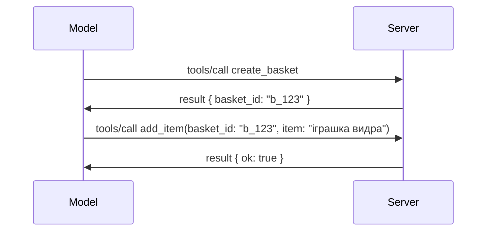

# Що змінилося в MCP: специфікація 2026-07-28

> **Статус:** Остаточний. Специфікація MCP `2026-07-28` випущена 28 липня 2026 року
> і є чинною ревізією протоколу. Цей урок описує фінальну
> специфікацію. Деякі приклади навчальної програми залишаються явно версійними до
> `2025-11-25`, оскільки їхні SDK ще не перейшли на новий безстанний API;
> вважайте ці приклади вказівками для зворотної сумісності.

## Огляд

`2026-07-28` — найбільша ревізія MCP з моменту запуску. Шість
пропозицій покращень специфікації (SEP) видаляють сесії на рівні протоколу та
роблять MCP безстанним на транспортному рівні, розширення стають першокласним,
версійованим механізмом, а кілька функцій, описаних раніше в цій навчальній програмі
(Roots, Sampling, Logging), застарівають за новою політикою життєвого циклу. Цей
урок узагальнює, що змінилося, чому це важливо і що це означає для коду,
написаного під `2025-11-25`.

Джерело: [Кандидат у реліз специфікації MCP 2026-07-28](https://blog.modelcontextprotocol.io/posts/2026-07-28-release-candidate/) (блог Model Context Protocol, Девід Сорія Парра й Ден Делімарскі).

## Навчальні завдання

Наприкінці цього уроку ви зможете:

- Пояснити, чому MCP переходить на безстанне ядро протоколу і яку проблему це вирішує для горизонтально масштабованих розгортань.
- Описати, як замінюються `initialize`/`initialized` рукопотискання та заголовок `Mcp-Session-Id`.
- Визначити нові заголовки `Mcp-Method` і `Mcp-Name` та метадані кешування `ttlMs`/`cacheScope`.
- Визнати рамки Extensions і два розширення, що поставляються з цим релізом: MCP Apps і Tasks.
- Узагальнити посилення авторизації та
  застарівання Dynamic Client Registration.
- Визначити, які основні функції (Roots, Sampling, Logging) тепер застарілі, і що це означає на практиці.
- Пояснити зміни у Full JSON Schema 2020-12 для вхідної/вихідної схеми інструментів.

## Безстанний протокол

Основна зміна: MCP стає безстанним на рівні протоколу.

### Раніше (2025-11-25): сесії прив’язують вас до одного серверного екземпляру

Виклик інструмента через Streamable HTTP починається з рукопотискання `initialize`. Сервер відповідає заголовком `Mcp-Session-Id`, який повинен містити кожен наступний запит:

```http
POST /mcp HTTP/1.1
Mcp-Session-Id: 1868a90c-3a3f-4f5b
Content-Type: application/json

{"jsonrpc":"2.0","id":2,"method":"tools/call",
 "params":{"name":"search","arguments":{"q":"otters"}}}
```

Оскільки сесія пов’язана з тим серверним екземпляром, що її видав, горизонтально масштабовані розгортання потребують **липкого маршрутизування** на балансувальнику навантаження та **спільного сховища сесій** між екземплярами.

### Після (2026-07-28): кожен запит самодостатній

```http
POST /mcp HTTP/1.1
MCP-Protocol-Version: 2026-07-28
Mcp-Method: tools/call
Mcp-Name: search
Content-Type: application/json

{"jsonrpc":"2.0","id":1,"method":"tools/call",
 "params":{"name":"search","arguments":{"q":"otters"},
           "_meta":{"io.modelcontextprotocol/protocolVersion":"2026-07-28",
                    "io.modelcontextprotocol/clientInfo":{"name":"my-app","version":"1.0"},
                    "io.modelcontextprotocol/clientCapabilities":{}}}}
```

Будь-який серверний екземпляр може обробити цей запит. Ключові зміни:

- **Рукопотискання `initialize`/`initialized` видалене** ([SEP-2575](https://github.com/modelcontextprotocol/modelcontextprotocol/pull/2575)). Версія протоколу, інформація про клієнта та можливості клієнта переміщені у `_meta` кожного запиту. Новий метод `server/discover` дозволяє клієнту заздалегідь отримати можливості сервера, коли це потрібно.
- **Заголовок `Mcp-Session-Id` і сесія на рівні протоколу видалені** ([SEP-2567](https://github.com/modelcontextprotocol/modelcontextprotocol/pull/2567)). Липке маршрутизування та спільні сховища сесій більше не потрібні на рівні протоколу.

### Безстанний протокол, станкові додатки

Видалення сесії на рівні протоколу не означає, що ваш сервер не може бути станковим. Рекомендований шаблон такий самий, як давно використовують HTTP API: створити явний дескриптор (наприклад, `basket_id`, `browser_id`) в одному виклику інструмента, і модель передає цей дескриптор як звичайний аргумент у подальших викликах.



Це робить стан видимим і зрозумілим для моделі замість того, щоб ховати його в метаданих транспорту, і дозволяє будь-якому серверному екземпляру обробляти будь-який виклик.

### Запити від сервера до клієнта, перебудовані

Безстанний протокол все ще потребує механізму, щоб сервер міг просити щось у клієнта під час виклику (наприклад, запит для отримання уточнень):

- **Запити, ініційовані сервером, можна надсилати лише під час активної обробки запиту клієнта** ([SEP-2260](https://github.com/modelcontextprotocol/modelcontextprotocol/pull/2260)) — раніше це була рекомендація, тепер обов’язок. Користувача ніколи не просять раптово.
- **Запити з кількома раундами** ([SEP-2322](https://github.com/modelcontextprotocol/modelcontextprotocol/pull/2322)) замінюють утримання відкритого SSE-потоку. Натомість сервер повертає `InputRequiredResult`:

  ```json
  {
    "resultType": "input_required",
    "inputRequests": {
      "confirm": {
        "type": "elicitation",
        "message": "Delete 3 files?",
        "schema": { "type": "boolean" }
      }
    },
    "requestState": "eyJzdGVwIjoxLCJmaWxlcyI6WyJhIiwiYiIsImMiXX0="
  }
  ```

  Клієнт збирає відповіді і повторно виконує початковий виклик з `inputResponses` та відображеним `requestState`. Будь-який серверний екземпляр може опрацювати повторний виклик, бо все необхідне є в корисному навантаженні.

### Маршрутизований, кешований, трасований

Три незначні зміни полегшують роботу з безстанним трафіком:

- **Заголовки `Mcp-Method` і `Mcp-Name` обов’язкові на Streamable HTTP** ([SEP-2243](https://github.com/modelcontextprotocol/modelcontextprotocol/pull/2243)), щоб балансувальники, шлюзи й лімітери могли маршрутизувати за операцією без аналізу JSON-тіла. Сервери відхиляють запити, де заголовки та тіло суперечать.
- **Результати `tools/list` і читання ресурсів мають `ttlMs` і `cacheScope`** ([SEP-2549](https://github.com/modelcontextprotocol/modelcontextprotocol/pull/2549)), змодельовані за HTTP `Cache-Control`. Клієнти знають, як довго результат списку є свіжим і чи безпечно його ділити між користувачами без необхідності тривалого SSE-потоку для відстеження змін.
- **Документовано поширення W3C Trace Context у `_meta`** ([SEP-414](https://github.com/modelcontextprotocol/modelcontextprotocol/pull/414)), виправлено імена ключів `traceparent`, `tracestate` і `baggage`, щоб розподілене трасування могло слідувати виклику між SDK клієнта, MCP сервером та іншими системами в бекенді, сумісному з [OpenTelemetry](https://opentelemetry.io/).

## Розширення стають першокласними

Розширення існували неофіційно в `2025-11-25`. [SEP-2133](https://github.com/modelcontextprotocol/modelcontextprotocol/pull/2133) формалізує їх:

- Розширення ідентифікуються за ID у форматі зворотного DNS.
- Вони домовляються через карту `extensions` у можливостях клієнта і сервера.
- Живуть у власних репозиторіях `ext-*` з делегованими підтримувачами і версіюються незалежно від основної специфікації.
- Новий трек Extensions у процесі SEP дає їм шлях від експериментальних до офіційних.

У цьому релізі поставляються два офіційні розширення.

### MCP Apps: серверно відрендерені інтерфейси користувача

[MCP Apps](https://blog.modelcontextprotocol.io/posts/2026-01-26-mcp-apps/) ([SEP-1865](https://github.com/modelcontextprotocol/modelcontextprotocol/pull/1865)) дозволяє серверам постачати інтерактивні HTML-інтерфейси, які хости відображають у пісочниці iframe. Інструменти заздалегідь оголошують шаблони UI, щоб хости могли їх попередньо завантажити, кешувати і провести огляд безпеки до запуску. Ви вже ознайомилися з основами в [Уроці 15: MCP Apps](../03-GettingStarted/15-mcp-apps/README.md) — у рамках Extensions, MCP Apps тепер офіційно є розширенням, а не експериментальною основною функцією.

### Tasks переходить до розширення

Tasks постачалися як експериментальна основна функція у `2025-11-25`. Використання в продакшені показало значний ребрендинг, і правильним місцем для неї є розширення: [Tasks extension](https://github.com/modelcontextprotocol/modelcontextprotocol/pull/2663) трансформує життєвий цикл навколо безстанної моделі — сервер може відповісти на `tools/call` дескриптором завдання, а клієнт керує ним через `tasks/get`, `tasks/update` і `tasks/cancel`. Створення завдань керує сервер: клієнт рекламує розширення, а сервер вирішує, коли викликати як завдання. `tasks/list` повністю видалено, бо він не може бути безпечно обмежений без сесій.

> **Примітка міграції:** якщо ви реалізували експериментальний API Tasks `2025-11-25`, вам потрібно мігрувати на новий життєвий цикл розширення — він не сумісний назад.

## Посилення авторизації

Кілька SEP посилюють
[специфікацію авторизації](https://modelcontextprotocol.io/specification/2026-07-28/basic/authorization)
для більшої відповідності реальним розгортанням OAuth 2.0 / OpenID Connect:

| SEP | Зміна |
|---|---|
| [SEP-2468](https://github.com/modelcontextprotocol/modelcontextprotocol/pull/2468) | Клієнти повинні перевіряти параметр `iss` в відповіді авторизації згідно з [RFC 9207](https://www.rfc-editor.org/rfc/rfc9207), що зменшує атаки змішування, поширені в схемі MCP з одним клієнтом і багатьма серверами. Майбутня версія вимагатиме відхиляти відповіді без `iss`. |
| [SEP-837](https://github.com/modelcontextprotocol/modelcontextprotocol/pull/837) | Клієнти Dynamic Client Registration тільки для сумісності вказують OpenID Connect `application_type`, уникаючи неправильних значень за замовчуванням `"web"` для десктопних і CLI клієнтів. |
| [SEP-2352](https://github.com/modelcontextprotocol/modelcontextprotocol/pull/2352) | Зареєстровані лише для сумісності облікові дані пов’язані з сервером авторизації, що їх видав (`issuer`); клієнти реєструються знову, якщо ресурс мігрує. |
| [SEP-2207](https://github.com/modelcontextprotocol/modelcontextprotocol/pull/2207) | Документовано, як отримувати токени оновлення від серверів авторизації в стилі OpenID Connect. |
| [SEP-2350](https://github.com/modelcontextprotocol/modelcontextprotocol/pull/2350) | Уточнено накопичення обсягів доступу під час підвищеної авторизації. |
| [SEP-2351](https://github.com/modelcontextprotocol/modelcontextprotocol/pull/2351) | Уточнено суфікс `.well-known` для виявлення. |

Якщо ви створюєте сервер авторизації для MCP, вказуйте `iss` у
відповідях авторизації та дотримуйтеся фінальної специфікації авторизації. Дивіться
[02-Security](../02-Security/README.md) для консультацій по реалізації.

Dynamic Client Registration залишають для сумісності, але він також
застаріває в `2026-07-28`. Нові реалізації повинні використовувати Client ID Metadata
Документи.

## Застарілі функції

Згідно з новою
[політикою життєвого циклу функцій](https://github.com/modelcontextprotocol/modelcontextprotocol/pull/2577),
Roots, Sampling, Logging і Dynamic Client Registration є **застарілими**:

| Функція | Рекомендована заміна |
|---|---|
| Roots | Параметри інструмента, URI ресурсів або конфігурація сервера |
| Sampling | Пряме інтегрування з API провайдерів LLM |
| Logging | `stderr` для stdio транспортів; OpenTelemetry для структурованої спостережливості |
| Dynamic Client Registration | Client ID Metadata Документи |

Ці функції залишаються в `2026-07-28` для сумісності. Вони можуть бути
вилучені у першій ревізії специфікації, випущеній не раніше 28 липня 2027 року;
фактичне вилучення може відбутися пізніше. Нові реалізації повинні використовувати наведені вище
шаблони заміни.

## Повний JSON Schema 2020-12 для інструментів

Вхідна `inputSchema` і вихідна `outputSchema` інструментів підняті до повного [JSON Schema 2020-12](https://json-schema.org/draft/2020-12) ([SEP-2106](https://github.com/modelcontextprotocol/modelcontextprotocol/pull/2106)):

- Вхідні схеми зберігають кореневе обмеження `type: "object"`, але тепер дозволяють композицію (`oneOf`, `anyOf`, `allOf`), умовні вирази та посилання (`$ref`, `$defs`).
- Вихідні схеми не обмежені, і `structuredContent` тепер може бути будь-яким JSON-значенням, а не тільки об’єктом.
- Реалізації не повинні автоматично розпакувати зовнішні URI `$ref` і повинні обмежувати глибину схеми та час валідації (питання відмови в обслуговуванні, якщо валідація відбувається серверно).

Окремо, код помилки для відсутнього ресурсу змінюється з власного MCP `-32002` на стандарт JSON-RPC `-32602` (Invalid Params) ([SEP-2164](https://github.com/modelcontextprotocol/modelcontextprotocol/pull/2164)). Якщо ваш клієнт розпізнає саме значення `-32002`, його потрібно оновити.

## Як далі розвивається протокол

Цей реліз містить порушливі зміни, які утримувачі MCP не планують робити нормою надалі. Три організаційні SEP прагнуть запобігти повторенню:

- **Політика життєвого циклу функцій** задає кожній функції шлях Активна → Застаріла → Вилучена, з не менш ніж дванадцятьма місяцями між застаріванням і можливим вилученням.
- **Рамки Extensions** дозволяють новим можливостям постачатися як опційні розширення та стабілізуватися там перед (якщо взагалі) переходом у ядро специфікації.
- SEP стандартного треку більше не може отримати статус Final, допоки відповідний сценарій не з’явиться у [пакеті відповідності](https://github.com/modelcontextprotocol/conformance) ([SEP-2484](https://github.com/modelcontextprotocol/modelcontextprotocol/pull/2484)) — тому самому пакеті, за яким оцінюються офіційні SDK у системі рівнів SDK ([SDK tier system](https://github.com/modelcontextprotocol/modelcontextprotocol/pull/1777)).

## Таймлайн релізу та валідація

- Кандидат у реліз було зафіксовано 21 травня 2026 року.
- Остаточна специфікація випущена 28 липня 2026 року.

- Підтримка SDK може відставати від специфікації. Перевірте
  [документацію SDK](https://modelcontextprotocol.io/docs/sdk) та
  примітки до випуску SDK перед міграцією прикладу.
- Відстежуйте остаточні зміни у
  [специфікації 2026-07-28](https://modelcontextprotocol.io/specification/2026-07-28/)
  та її
  [журналі змін](https://modelcontextprotocol.io/specification/2026-07-28/changelog).

## Що це означає для цього курсу

Курс переходить від прикладів `2025-11-25` до поточної
специфікації `2026-07-28`. Конкретно:

- **Сесії та рукопотискання `initialize`** у прикладах, що явно орієнтовані
  на `2025-11-25`, є застарілою поведінкою. Протокол `2026-07-28` замінює їх
  на безстанову модель запитів, описану вище.
- **Вибірка (Sampling) та корені (Roots)** залишаються доступними для сумісності, але застарівають.
  У нових проєктах слід використовувати патерни-замінники, наведені вище.
- **Експериментальна функція Tasks**, якщо ви її використовували, потребує міграції до нового життєвого циклу розширення Tasks.
- **Додатки MCP** ([Урок 15](../03-GettingStarted/15-mcp-apps/README.md)) на практиці не змінюються; вони просто переміщуються у формальну структуру розширень.

## Додаткові ресурси

- [Специфікація MCP 2026-07-28](https://modelcontextprotocol.io/specification/2026-07-28/)
- [Журнал змін 2026-07-28](https://modelcontextprotocol.io/specification/2026-07-28/changelog)
- [Кандидат на випуск специфікації MCP 2026-07-28 (історичний блог)](https://blog.modelcontextprotocol.io/posts/2026-07-28-release-candidate/)
- [Майбутнє транспортів MCP](https://blog.modelcontextprotocol.io/posts/2025-12-19-mcp-transport-future/)
- [Керівництво SEP](https://modelcontextprotocol.io/community/sep-guidelines)
- [Система рівнів MCP SDK](https://modelcontextprotocol.io/docs/sdk)

## Наступні кроки

Поверніться до [Основних понять](./README.md) або продовжуйте
до [Безпеки](../02-Security/README.md), щоб застосувати поточні рекомендації `2026-07-28`.

---

<!-- CO-OP TRANSLATOR DISCLAIMER START -->
**Відмова від відповідальності**:
Цей документ було перекладено за допомогою сервісу штучного інтелекту для перекладу [Co-op Translator](https://github.com/Azure/co-op-translator). Хоча ми прагнемо до точності, будь ласка, майте на увазі, що автоматичні переклади можуть містити помилки або неточності. Оригінальний документ рідною мовою слід вважати авторитетним джерелом. Для критично важливої інформації рекомендується професійний людський переклад. Ми не несемо відповідальності за будь-які непорозуміння або неправильні тлумачення, що виникли внаслідок використання цього перекладу.
<!-- CO-OP TRANSLATOR DISCLAIMER END -->