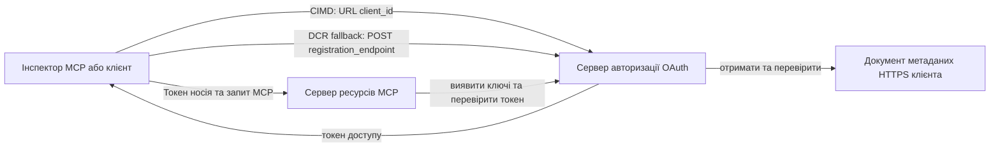

# Приклад авторизації CIMD і DCR

Цей приклад на TypeScript порівнює два способи, якими OAuth клієнт може отримати ідентичність
перед доступом до захищеного MCP сервера:

- **Client ID Metadata Documents (CIMD)** використовують стабільну HTTPS URL як
  `client_id`. Це рекомендований механізм для клієнтів і серверів авторизації,
  які не мають попередніх відносин.
- **Dynamic Client Registration (DCR)** запитує у сервера авторизації створити
  непрозорий client ID під час виконання. MCP `2026-07-28` залишає DCR
  лише для зворотної сумісності.

Приклад використовує стабільний MCP TypeScript SDK v2 та безстанкову
модель запитів MCP `2026-07-28`. Він працює з зовнішнім сервером
авторизації OAuth 2.1/OpenID Connect, наприклад Auth0. MCP сервер є сервером ресурсів:
  він перевіряє access tokens, але не автентифікує користувачів і не видає
  токени.

## Цілі навчання

Завдяки завершенню цього прикладу ви зможете:

- Пояснити, чому CIMD переважає над DCR для нових MCP клієнтів.
- Опублікувати дійсний CIMD документ для публічного нативного клієнта.
- Налаштувати MCP сервер ресурсів для OAuth дискавері та перевірки JWT.
- Використовувати CIMD і DCR з одним і тим самим MCP сервером та сервером авторизації.
- Забезпечити примусове застосування OAuth scope у MCP інструменті.
- Визначити, які обов’язки належать клієнту, серверу ресурсів і
  серверу авторизації.

## Архітектура



Сервер авторизації вибирає і перевіряє механізм реєстрації.
MCP сервер бачить тільки перевірене твердження `client_id`. HTTPS URL
з шляхом ідентифікує CIMD. Непрозорий ID недостатній, щоб довести DCR,
оскільки попередньо зареєстрований клієнт також може використовувати непроникний ID;
необов’язковий параметр `DCR_CLIENT_ID_PREFIX` надає специфічний для провайдера демонстративний натяк.

## Пріоритет реєстрації

MCP клієнти, які підтримують усі механізми, повинні використовувати цей порядок:

1. Використовувати попередньо зареєстровану інформацію про клієнта, якщо вона вже доступна.
2. Використовувати CIMD, коли сервер авторизації рекламує
   `client_id_metadata_document_supported: true`.
3. Використовувати DCR лише як запасний варіант, коли сервер рекламує
   `registration_endpoint`.
4. Запитувати користувача про попередньо зареєстровану інформацію клієнта, якщо нічого з вище наведенного
   недоступне.

## Структура проекту

```text
src/
  config.ts          Environment validation
  dcr.ts             DCR compatibility request
  mcp.ts             MCP tools and scope checks
  oauth.ts           Authorization metadata and JWT verification
  register-dcr.ts    DCR command-line helper
  registration.ts    CIMD document and mechanism classification
  server.ts          Express, OAuth discovery, and MCP endpoint
test/
  dcr.test.ts
  oauth.test.ts
  registration.test.ts
  server.test.ts
```

## Вимоги

- Node.js 20.6 або новіша версія. Скрипти використовують `--env-file` та `--import`.
- Сервер авторизації OAuth 2.1/OpenID Connect, що підтримує:
  - потік коду авторизації з S256 PKCE.
  - OAuth Protected Resource Metadata та Resource Indicators.
  - JWT access tokens та JWKS endpoint.
  - CIMD, а також DCR, якщо ви хочете порівняти застарілий запасний варіант.
- MCP Inspector або інший MCP клієнт `2026-07-28`.
- Публічний HTTPS URL для CIMD документа. Для лабораторії підходить тунель розробника;
  у продакшні використовуйте стабільний домен.

## Встановлення та тестування

```bash
npm install
npm run build
npm test
```

Дванадцять тестів використовують локальні ключі та імітовані HTTP кінцеві точки. Вони не потребують
облікового запису сервера авторизації. Вони перевіряють:

- форму документа CIMD і обмеження URL.
- Чесну класифікацію URL та непрозорих клієнтських ID.
- Обробку запитів та відповідей DCR.
- Відмову у прийомі небезпечних не loopback DCR кінцевих точок.
- Перевірку підпису JWT, видавця, аудиторії, терміну дії, client ID та scope.
- Виклик MCP `2026-07-28` в процесі для `registration-info`.

## Налаштування сервера авторизації

Точні назви параметрів керування залежать від провайдера. Налаштуйте ці можливості:

1. Створіть API або сервер ресурсів, ідентифікатор якого точно співпадає з вашим MCP
   URL, включно з `/mcp`, наприклад `http://127.0.0.1:3001/mcp`.
2. Використовуйте RS256 для access tokens і включайте `client_id` або `azp` твердження.
3. Додайте дозвіл або scope `tool:greet`.
4. Увімкніть потік коду авторизації з S256 PKCE для публічних нативних клієнтів.
5. Увімкніть Client ID Metadata Documents.
6. Для порівняння увімкніть тільки Dynamic Client Registration.
7. Переконайтеся, що метадані сервера авторизації включають:
   - `issuer`
   - `authorization_endpoint`
   - `token_endpoint`
   - `jwks_uri`
   - `client_id_metadata_document_supported: true`
   - `registration_endpoint`, коли увімкнено DCR

### Приклад Auth0

Для Auth0 увімкніть Реєстрацію Client ID Metadata Document, OIDC Dynamic
Реєстрацію додатків і сумісність з параметром Resource. Створіть API,
ідентифікатор якого є точним MCP URL, і додайте дозвіл `tool:greet`.
Дозвольте тестовому користувачу та стороннім клієнтам запитувати цей дозвіл.

Панелі провайдерів та доступність функцій змінюються з часом. Перед використанням цих налаштувань поза лабораторією
перевірте документацію провайдера.

## Налаштування прикладу

Створіть `.env` із прикладу:

```powershell
Copy-Item .env.example .env
```

В bash-сумісних оболонках:

```bash
cp .env.example .env
```

Встановіть ці значення:

```dotenv
MCP_SERVER_URL=http://127.0.0.1:3001/mcp
AUTHORIZATION_SERVER_ISSUER=https://your-tenant.example.com/
AUTHORIZATION_SERVER_METADATA_URL=https://your-tenant.example.com/.well-known/openid-configuration
CLIENT_METADATA_URL=https://your-public-host.example.com/client-metadata.json
OAUTH_REDIRECT_URIS=http://127.0.0.1:6274/oauth/callback
DCR_CLIENT_ID_PREFIX=tpc_
```

Важливі деталі:

- `AUTHORIZATION_SERVER_ISSUER` має точно збігатися з `issuer` у виявлених
  метаданих сервера авторизації, включно з будь-яким завершуємим слешем.
- `MCP_SERVER_URL` має збігатися з аудиторією access token.
- `CLIENT_METADATA_URL` має використовувати HTTPS, містити не кореневий шлях і бути
  публічним URL, що обслуговує маршрут метаданих. Параметри запиту і фрагменти
  відхиляються, щоб маршрут та `client_id` залишалися ідентичними.
- `OAUTH_REDIRECT_URIS` — це список дозволених, розділений комами. За замовчуванням це loopback callback MCP
  Inspector.
- `DCR_CLIENT_ID_PREFIX` є необов’язковим і специфічним для провайдера. Залиште порожнім, коли
  ваш провайдер не має надійного префікса DCR.

## Публікація CIMD документа

Запустіть тунель, який форвардить свій публічний HTTPS origin на `127.0.0.1:3001`.
Встановіть `CLIENT_METADATA_URL` на цей origin плюс `/client-metadata.json`, потім виконайте:

```bash
npm run build
npm start
```

Перевірте обидва документи дискавері:

```bash
curl http://127.0.0.1:3001/health
curl http://127.0.0.1:3001/client-metadata.json
curl http://127.0.0.1:3001/.well-known/oauth-protected-resource/mcp
```

`client_id`, повернений публічним HTTPS URL метаданих, має бути байт у байт
ідентичним цьому URL. Сервер авторизації повинен перевірити документ і
його redirect URI перед видачею токена.

> [!NOTE]
> Приклад хостить документ клієнта і MCP сервер ресурсів в одному процесі,
> щоб зберегти лабораторію компактною. У продакшені MCP клієнт володіє і хостить свій CIMD
> документ незалежно від сервера ресурсів.

## Порівняння CIMD і DCR

Запустіть MCP Inspector:

```bash
npx @modelcontextprotocol/inspector
```

Використовуйте Streamable HTTP та підключіться до `http://127.0.0.1:3001/mcp`.

### CIMD (Рекомендовано)


1. Введіть публічний `CLIENT_METADATA_URL` як OAuth Client ID.
2. Запитайте `tool:greet` та будь-які ідентифікаційні області, необхідні вашим провайдером.
3. Завершіть вхід та підтвердження згоди.
4. Викличте `registration-info`. Він повідомляє `mechanism: "cimd"`.
5. Викличте `greet`, щоб перевірити застосування області.

### DCR (Фолбек сумісності)

1. Очистіть збережений стан OAuth у Inspector.
2. Залиште поле OAuth Client ID порожнім, щоб Inspector міг використати заявлений
   `registration_endpoint`.
3. Завершіть вхід та підтвердження згоди.
4. Викличте `registration-info`.
5. Якщо `DCR_CLIENT_ID_PREFIX` збігається з згенерованими провайдером ID, інструмент
   повідомляє `mechanism: "dcr"`; інакше він коректно повідомляє
   `opaque-client-id`.

Ви також можете продемонструвати безпосередній запит реєстрації:

```bash
npm run build
npm run register:dcr
```

Допоміжна програма виводить отриманий client ID, але ніколи не виводить client secret.
Трактуйте будь-який отриманий секрет як конфіденційний і зберігайте його в належному сховищі секретів.

## Інструменти

| Інструмент | Необхідна область | Призначення |
| --- | --- | --- |
| `registration-info` | Перевірений клієнт | Повідомити тип client ID |
| `greet` | `tool:greet` | Демонструвати авторизацію для інструменту |

## Примітки з безпеки

- Перевіряйте підписи JWT через JWKS endpoint сервера авторизації.
- Вимагайте точного співпадіння issuer та audience.
- Вимагайте наявності claims про строк дії та client ID.
- Ніколи не приймайте токен, виданий для іншого ресурсу.
- Ніколи не передавайте MCP токен на наступний API рівень.
- Зберігайте DCR облікові дані прив’язаними до issuer, що їх створив.
- Перевіряйте CIMD redirect URI з точним співпадінням.
- Застосовуйте контролі SSRF, коли сервер авторизації отримує CIMD URL.
- Використовуйте HTTPS для endpoint авторизації та метаданих поза development loopback.
  середовищем розробки.
- Не робіть висновки про DCR на основі непрозорого client ID, якщо провайдер не задокументував
  надійну конвенцію ідентифікаторів.

## Посилання

- [Специфікація MCP авторизації](https://modelcontextprotocol.io/specification/2026-07-28/basic/authorization)
- [Реєстрація клієнта MCP](https://modelcontextprotocol.io/specification/2026-07-28/basic/authorization/client-registration)
- [Кращі практики безпеки MCP](https://modelcontextprotocol.io/specification/2026-07-28/basic/security_best_practices)
- [Керівництво авторизації SDK MCP TypeScript v2](https://ts.sdk.modelcontextprotocol.io/v2/serving/authorization)
- [Dynamic Client Registration OAuth (RFC 7591)](https://datatracker.ietf.org/doc/html/rfc7591)
- [Документ Metadata Client ID OAuth чернетка](https://datatracker.ietf.org/doc/html/draft-ietf-oauth-client-id-metadata-document-00)

## Подяка

Підхід навчання поруч один з одним було натхненний
[Sambego/auth0-xmcp-cimd](https://github.com/Sambego/auth0-xmcp-cimd). Цей
приклад є оригінальною, нейтральною реалізацією з використанням офіційного
MCP TypeScript SDK v2 для цього курсу.

---

<!-- CO-OP TRANSLATOR DISCLAIMER START -->
**Відмова від відповідальності**:
Цей документ було перекладено за допомогою сервісу штучного інтелекту для перекладу [Co-op Translator](https://github.com/Azure/co-op-translator). Хоча ми прагнемо до точності, будь ласка, майте на увазі, що автоматичні переклади можуть містити помилки або неточності. Оригінальний документ рідною мовою слід вважати авторитетним джерелом. Для критично важливої інформації рекомендується професійний людський переклад. Ми не несемо відповідальності за будь-які непорозуміння або неправильні тлумачення, що виникли внаслідок використання цього перекладу.
<!-- CO-OP TRANSLATOR DISCLAIMER END -->