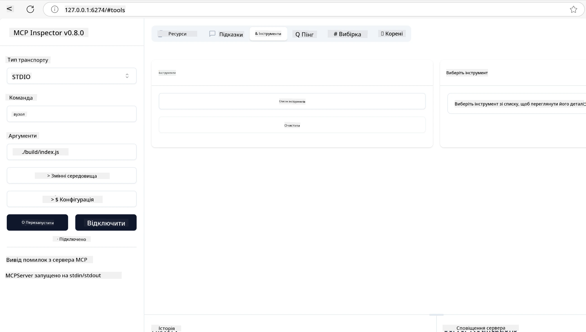
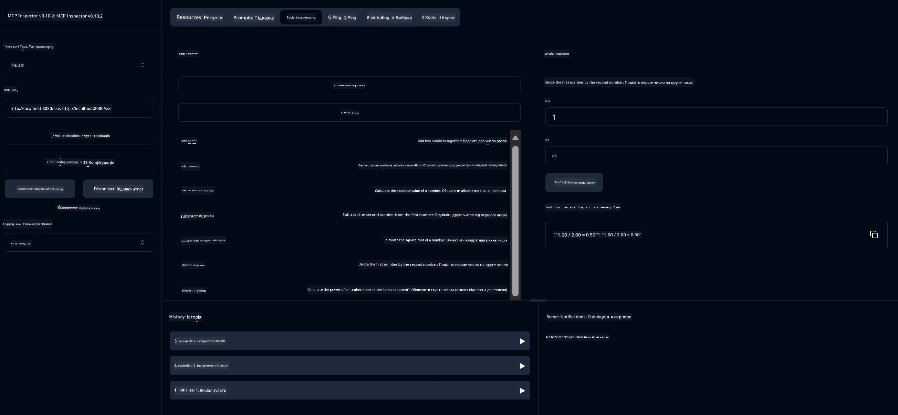
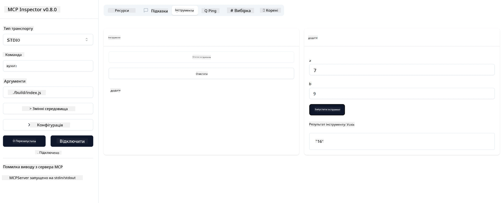

# Початок роботи з MCP

> [!NOTE]
> Приклад Java HTTP у цьому уроці використовує застарілий транспорт HTTP+SSE і
> орієнтований на SDK, сумісний з MCP `2025-11-25`. Для нових віддалених серверів використовуйте
> транспорт Streamable HTTP `2026-07-28` і перевірте підтримку у вашому SDK.

Ласкаво просимо до ваших перших кроків з Model Context Protocol (MCP)! Незалежно від того, чи ви новачок у MCP або хочете поглибити свої знання, цей посібник проведе вас через необхідні налаштування та процес розробки. Ви дізнаєтесь, як MCP забезпечує безперебійну інтеграцію між AI-моделями та додатками, а також навчитесь швидко підготувати своє середовище для створення та тестування рішень на основі MCP.

> Коротко; Якщо ви створюєте AI-додатки, ви знаєте, що можна додати інструменти та інші ресурси до вашої LLM (великої мовної моделі), щоб зробити її більш обізнаною. Однак якщо розмістити ці інструменти та ресурси на сервері, можливості програми та сервера можуть використовувати будь-які клієнти з LLM або без нього.

## Огляд

Цей урок надає практичні поради щодо налаштування середовищ MCP і створення перших MCP-додатків. Ви навчитесь налаштовувати необхідні інструменти та фреймворки, будувати базові MCP-сервери, створювати хост-додатки та тестувати ваші реалізації.

Model Context Protocol (MCP) — це відкритий протокол, що стандартизує, як додатки надають контекст для LLM. Уявіть MCP як порт USB-C для AI-додатків — він забезпечує стандартизований спосіб підключення AI-моделей до різних джерел даних і інструментів.

## Цілі навчання

До кінця цього уроку ви зможете:

- Налаштувати середовища розробки для MCP на C#, Java, Python, TypeScript та Rust
- Створювати та розгортати базові MCP-сервери з користувацькими функціями (ресурси, підказки та інструменти)
- Створювати хост-додатки, що підключаються до MCP-серверів
- Тестувати та налагоджувати реалізації MCP

## Налаштування середовища MCP

Перед початком роботи з MCP важливо підготувати середовище розробки та зрозуміти базовий робочий процес. Цей розділ проведе вас через початкові кроки налаштування для плавного старту з MCP.

### Вимоги

Перед початком розробки MCP переконайтесь, що у вас є:

- **Середовище розробки**: для обраної мови (C#, Java, Python, TypeScript або Rust)
- **IDE/редактор**: Visual Studio, Visual Studio Code, IntelliJ, Eclipse, PyCharm або будь-який сучасний редактор коду
- **Менеджери пакетів**: NuGet, Maven/Gradle, pip, npm/yarn або Cargo
- **API-ключі**: для будь-яких AI-сервісів, які ви плануєте використовувати у своїх хост-додатках

## Базова структура MCP сервера

MCP-сервер зазвичай включає:

- **Конфігурація сервера**: налаштування порту, автентифікації та інші параметри
- **Ресурси**: дані та контекст, що надаються LLM
- **Інструменти**: функціональність, яку моделі можуть викликати
- **Підказки**: шаблони для генерації або структурування тексту

Ось спрощений приклад на TypeScript:

```typescript
import { McpServer, ResourceTemplate } from "@modelcontextprotocol/sdk/server/mcp.js";
import { StdioServerTransport } from "@modelcontextprotocol/sdk/server/stdio.js";
import { z } from "zod";

// Створити сервер MCP
const server = new McpServer({
  name: "Demo",
  version: "1.0.0"
});

// Додати інструмент додавання
server.tool("add",
  { a: z.number(), b: z.number() },
  async ({ a, b }) => ({
    content: [{ type: "text", text: String(a + b) }]
  })
);

// Додати динамічний ресурс привітання
server.resource(
  "file",
  // Параметр 'list' керує тим, як ресурс перераховує доступні файли. Встановлення його в undefined вимикає перелік для цього ресурсу.
  new ResourceTemplate("file://{path}", { list: undefined }),
  async (uri, { path }) => ({
    contents: [{
      uri: uri.href,
      text: `File, ${path}!`
    }]
  })
);

// Додати файловий ресурс, який читає вміст файлу
server.resource(
  "file",
  new ResourceTemplate("file://{path}", { list: undefined }),
  async (uri, { path }) => {
    let text;
    try {
      text = await fs.readFile(path, "utf8");
    } catch (err) {
      text = `Error reading file: ${err.message}`;
    }
    return {
      contents: [{
        uri: uri.href,
        text
      }]
    };
  }
);

server.prompt(
  "review-code",
  { code: z.string() },
  ({ code }) => ({
    messages: [{
      role: "user",
      content: {
        type: "text",
        text: `Please review this code:\n\n${code}`
      }
    }]
  })
);

// Почати отримувати повідомлення на stdin і надсилати повідомлення на stdout
const transport = new StdioServerTransport();
await server.connect(transport);
```

У наведеному коді ми:

- Імпортували необхідні класи з MCP TypeScript SDK.
- Створили і налаштували новий екземпляр MCP-сервера.
- Зареєстрували користувацький інструмент (`calculator`) з функцією обробника.
- Запустили сервер для прослуховування вхідних MCP-запитів.

## Тестування та налагодження

Перед початком тестування вашого MCP-сервера важливо зрозуміти доступні інструменти та найкращі практики налагодження. Ефективне тестування гарантує, що ваш сервер працює належним чином, і допомагає швидко знаходити та усувати проблеми. Наступний розділ описує рекомендовані підходи для перевірки вашої реалізації MCP.

MCP надає інструменти для тестування та налагодження ваших серверів:

- **Інспектор (Inspector tool)** — графічний інтерфейс, що дозволяє підключатись до сервера і тестувати інструменти, підказки та ресурси.
- **curl** — також можна підключатись до сервера через консольні інструменти, такі як curl або інші клієнти, які можуть створювати і виконувати HTTP-команди.

### Використання MCP Inspector

[MCP Inspector](https://github.com/modelcontextprotocol/inspector) — це візуальний інструмент тестування, який допомагає вам:

1. **Виявляти можливості сервера**: автоматично виявляти доступні ресурси, інструменти та підказки
2. **Тестувати виконання інструментів**: експериментувати з параметрами та бачити відповіді в реальному часі
3. **Переглядати метадані сервера**: вивчати інформацію про сервер, схеми та конфігурації

```bash
# ex TypeScript, встановлення та запуск MCP Inspector
npx @modelcontextprotocol/inspector node build/index.js
```

Коли ви виконуєте наведенні команди, MCP Inspector запускає локальний веб-інтерфейс у вашому браузері. Ви побачите панель з зареєстрованими MCP-серверами, доступними інструментами, ресурсами та підказками. Інтерфейс дозволяє інтерактивно тестувати виконання інструментів, переглядати метадані сервера і бачити відповіді в режимі реального часу, що спрощує перевірку та налагодження реалізацій вашого MCP-сервера.

Ось скріншот того, як він може виглядати:



## Типові проблеми налаштування та їх вирішення

| Проблема | Можливе вирішення |
|-------|-------------------|
| Відмова в підключенні | Перевірте, чи сервер запущений і порт вказаний правильно |
| Помилки виконання інструментів | Перегляньте валідацію параметрів та обробку помилок |
| Помилки автентифікації | Перевірте API-ключі та права доступу |
| Помилки валідації схеми | Переконайтеся, що параметри відповідають визначеній схемі |
| Сервер не запускається | Перевірте конфлікти портів або відсутність залежностей |
| Помилки CORS | Налаштуйте правильні заголовки CORS для запитів з інших джерел |
| Проблеми автентифікації | Перевірте дійсність токенів та права доступу |

## Локальна розробка

Для локальної розробки та тестування ви можете запускати MCP-сервери безпосередньо на вашому комп’ютері:

1. **Запустіть процес сервера**: Запустіть ваш MCP-додаток сервера
2. **Налаштуйте мережу**: Переконайтеся, що сервер доступний на потрібному порту
3. **Підключіть клієнтів**: Використовуйте локальні URL, наприклад, `http://localhost:3000`

```bash
# Приклад: Запуск TypeScript MCP сервера локально
npm run start
# Сервер працює за адресою http://localhost:3000
```

## Створення вашого першого MCP-сервера

Ми вже розглянули [основні концепції](../../01-CoreConcepts/README.md) у попередньому уроці, тепер настав час застосувати ці знання.

### Що може робити сервер

Перед тим, як почати писати код, нагадаємо, що може робити сервер:

MCP-сервер, наприклад, може:

- Отримувати доступ до локальних файлів і баз даних
- Під’єднуватись до віддалених API
- Виконувати обчислення
- Інтегруватись з іншими інструментами та сервісами
- Надавати користувацький інтерфейс для взаємодії

Чудово, тепер, коли ми знаємо, що можемо від нього, почнемо кодувати.

## Вправа: Створення сервера

Щоб створити сервер, потрібно виконати такі кроки:

- Встановити MCP SDK.
- Створити проект і налаштувати його структуру.
- Написати код сервера.
- Протестувати сервер.

### -1- Створення проекту

#### TypeScript

```sh
# Створіть каталог проекту та ініціалізуйте npm проект
mkdir calculator-server
cd calculator-server
npm init -y
```

#### Python

```sh
# Створіть каталог проекту
mkdir calculator-server
cd calculator-server
# Відкрийте папку у Visual Studio Code - Пропустіть це, якщо ви використовуєте інше IDE
code .
```

#### .NET

```sh
dotnet new console -n McpCalculatorServer
cd McpCalculatorServer
```

#### Java

Для Java створіть проект Spring Boot:

```bash
curl https://start.spring.io/starter.zip \
  -d dependencies=web \
  -d javaVersion=21 \
  -d type=maven-project \
  -d groupId=com.example \
  -d artifactId=calculator-server \
  -d name=McpServer \
  -d packageName=com.microsoft.mcp.sample.server \
  -o calculator-server.zip
```

Розпакуйте zip-файл:

```bash
unzip calculator-server.zip -d calculator-server
cd calculator-server
# необов’язково видалити невикористаний тест
rm -rf src/test/java
```

Додайте наступну повну конфігурацію у ваш файл *pom.xml*:

```xml
<?xml version="1.0" encoding="UTF-8"?>
<project xmlns="http://maven.apache.org/POM/4.0.0"
    xmlns:xsi="http://www.w3.org/2001/XMLSchema-instance"
    xsi:schemaLocation="http://maven.apache.org/POM/4.0.0 http://maven.apache.org/xsd/maven-4.0.0.xsd">
    <modelVersion>4.0.0</modelVersion>
    
    <!-- Spring Boot parent for dependency management -->
    <parent>
        <groupId>org.springframework.boot</groupId>
        <artifactId>spring-boot-starter-parent</artifactId>
        <version>3.5.0</version>
        <relativePath />
    </parent>

    <!-- Project coordinates -->
    <groupId>com.example</groupId>
    <artifactId>calculator-server</artifactId>
    <version>0.0.1-SNAPSHOT</version>
    <name>Calculator Server</name>
    <description>Basic calculator MCP service for beginners</description>

    <!-- Properties -->
    <properties>
        <java.version>21</java.version>
        <maven.compiler.source>21</maven.compiler.source>
        <maven.compiler.target>21</maven.compiler.target>
    </properties>

    <!-- Spring AI BOM for version management -->
    <dependencyManagement>
        <dependencies>
            <dependency>
                <groupId>org.springframework.ai</groupId>
                <artifactId>spring-ai-bom</artifactId>
                <version>1.0.0-SNAPSHOT</version>
                <type>pom</type>
                <scope>import</scope>
            </dependency>
        </dependencies>
    </dependencyManagement>

    <!-- Dependencies -->
    <dependencies>
        <dependency>
            <groupId>org.springframework.ai</groupId>
            <artifactId>spring-ai-starter-mcp-server-webflux</artifactId>
        </dependency>
        <dependency>
            <groupId>org.springframework.boot</groupId>
            <artifactId>spring-boot-starter-actuator</artifactId>
        </dependency>
        <dependency>
         <groupId>org.springframework.boot</groupId>
         <artifactId>spring-boot-starter-test</artifactId>
         <scope>test</scope>
      </dependency>
    </dependencies>

    <!-- Build configuration -->
    <build>
        <plugins>
            <plugin>
                <groupId>org.springframework.boot</groupId>
                <artifactId>spring-boot-maven-plugin</artifactId>
            </plugin>
            <plugin>
                <groupId>org.apache.maven.plugins</groupId>
                <artifactId>maven-compiler-plugin</artifactId>
                <configuration>
                    <release>21</release>
                </configuration>
            </plugin>
        </plugins>
    </build>

    <!-- Repositories for Spring AI snapshots -->
    <repositories>
        <repository>
            <id>spring-milestones</id>
            <name>Spring Milestones</name>
            <url>https://repo.spring.io/milestone</url>
            <snapshots>
                <enabled>false</enabled>
            </snapshots>
        </repository>
        <repository>
            <id>spring-snapshots</id>
            <name>Spring Snapshots</name>
            <url>https://repo.spring.io/snapshot</url>
            <releases>
                <enabled>false</enabled>
            </releases>
        </repository>
    </repositories>
</project>
```

#### Rust

```sh
mkdir calculator-server
cd calculator-server
cargo init
```

### -2- Додайте залежності

Тепер, коли проект створений, додамо залежності:

#### TypeScript

```sh
# Якщо ще не встановлено, встановіть TypeScript глобально
npm install typescript -g

# Встановіть MCP SDK та Zod для валідації схеми
npm install @modelcontextprotocol/sdk zod
npm install -D @types/node typescript
```

#### Python

```sh
# Створіть віртуальне середовище та встановіть залежності
python -m venv venv
venv\Scripts\activate
pip install "mcp[cli]"
```

#### Java

```bash
cd calculator-server
./mvnw clean install -DskipTests
```

#### Rust

```sh
cargo add rmcp --features server,transport-io
cargo add serde
cargo add tokio --features rt-multi-thread
```

### -3- Створення файлів проекту

#### TypeScript

Відкрийте файл *package.json* і замініть вміст наступним, щоб забезпечити збірку та запуск сервера:

```json
{
  "name": "calculator-server",
  "version": "1.0.0",
  "main": "index.js",
  "type": "module",
  "scripts": {
    "build": "tsc",
    "start": "npm run build && node ./build/index.js",
  },
  "keywords": [],
  "author": "",
  "license": "ISC",
  "description": "A simple calculator server using Model Context Protocol",
  "dependencies": {
    "@modelcontextprotocol/sdk": "^1.16.0",
    "zod": "^3.25.76"
  },
  "devDependencies": {
    "@types/node": "^24.0.14",
    "typescript": "^5.8.3"
  }
}
```

Створіть файл *tsconfig.json* з наступним вмістом:

```json
{
  "compilerOptions": {
    "target": "ES2022",
    "module": "Node16",
    "moduleResolution": "Node16",
    "outDir": "./build",
    "rootDir": "./src",
    "strict": true,
    "esModuleInterop": true,
    "skipLibCheck": true,
    "forceConsistentCasingInFileNames": true
  },
  "include": ["src/**/*"],
  "exclude": ["node_modules"]
}
```

Створіть каталог для вихідного коду:

```sh
mkdir src
touch src/index.ts
```

#### Python

Створіть файл *server.py*

```sh
touch server.py
```

#### .NET

Встановіть необхідні пакети NuGet:

```sh
dotnet add package ModelContextProtocol --prerelease
dotnet add package Microsoft.Extensions.Hosting
```

#### Java

Для Java Spring Boot проекти структура створюється автоматично.

#### Rust

Для Rust файл *src/main.rs* створюється за замовчуванням при виконанні `cargo init`. Відкрийте файл і видаліть стандартний код.

### -4- Створення коду сервера

#### TypeScript

Створіть файл *index.ts* і додайте наступний код:

```typescript
import { McpServer, ResourceTemplate } from "@modelcontextprotocol/sdk/server/mcp.js";
import { StdioServerTransport } from "@modelcontextprotocol/sdk/server/stdio.js";
import { z } from "zod";
 
// Створіть MCP сервер
const server = new McpServer({
  name: "Calculator MCP Server",
  version: "1.0.0"
});
```

Тепер у вас є сервер, але він ще мало що робить, давайте це виправимо.

#### Python

```python
# server.py
from mcp.server.fastmcp import FastMCP

# Створити MCP сервер
mcp = FastMCP("Demo")
```

#### .NET

```csharp
using Microsoft.Extensions.DependencyInjection;
using Microsoft.Extensions.Hosting;
using Microsoft.Extensions.Logging;
using ModelContextProtocol.Server;
using System.ComponentModel;

var builder = Host.CreateApplicationBuilder(args);
builder.Logging.AddConsole(consoleLogOptions =>
{
    // Configure all logs to go to stderr
    consoleLogOptions.LogToStandardErrorThreshold = LogLevel.Trace;
});

builder.Services
    .AddMcpServer()
    .WithStdioServerTransport()
    .WithToolsFromAssembly();
await builder.Build().RunAsync();

// add features
```

#### Java

Для Java створіть основні компоненти сервера. Спочатку змініть головний клас додатка:

*src/main/java/com/microsoft/mcp/sample/server/McpServerApplication.java*:

```java
package com.microsoft.mcp.sample.server;

import org.springframework.ai.tool.ToolCallbackProvider;
import org.springframework.ai.tool.method.MethodToolCallbackProvider;
import org.springframework.boot.SpringApplication;
import org.springframework.boot.autoconfigure.SpringBootApplication;
import org.springframework.context.annotation.Bean;
import com.microsoft.mcp.sample.server.service.CalculatorService;

@SpringBootApplication
public class McpServerApplication {

    public static void main(String[] args) {
        SpringApplication.run(McpServerApplication.class, args);
    }
    
    @Bean
    public ToolCallbackProvider calculatorTools(CalculatorService calculator) {
        return MethodToolCallbackProvider.builder().toolObjects(calculator).build();
    }
}
```

Створіть сервіс калькулятора *src/main/java/com/microsoft/mcp/sample/server/service/CalculatorService.java*:

```java
package com.microsoft.mcp.sample.server.service;

import org.springframework.ai.tool.annotation.Tool;
import org.springframework.stereotype.Service;

/**
 * Service for basic calculator operations.
 * This service provides simple calculator functionality through MCP.
 */
@Service
public class CalculatorService {

    /**
     * Add two numbers
     * @param a The first number
     * @param b The second number
     * @return The sum of the two numbers
     */
    @Tool(description = "Add two numbers together")
    public String add(double a, double b) {
        double result = a + b;
        return formatResult(a, "+", b, result);
    }

    /**
     * Subtract one number from another
     * @param a The number to subtract from
     * @param b The number to subtract
     * @return The result of the subtraction
     */
    @Tool(description = "Subtract the second number from the first number")
    public String subtract(double a, double b) {
        double result = a - b;
        return formatResult(a, "-", b, result);
    }

    /**
     * Multiply two numbers
     * @param a The first number
     * @param b The second number
     * @return The product of the two numbers
     */
    @Tool(description = "Multiply two numbers together")
    public String multiply(double a, double b) {
        double result = a * b;
        return formatResult(a, "*", b, result);
    }

    /**
     * Divide one number by another
     * @param a The numerator
     * @param b The denominator
     * @return The result of the division
     */
    @Tool(description = "Divide the first number by the second number")
    public String divide(double a, double b) {
        if (b == 0) {
            return "Error: Cannot divide by zero";
        }
        double result = a / b;
        return formatResult(a, "/", b, result);
    }

    /**
     * Calculate the power of a number
     * @param base The base number
     * @param exponent The exponent
     * @return The result of raising the base to the exponent
     */
    @Tool(description = "Calculate the power of a number (base raised to an exponent)")
    public String power(double base, double exponent) {
        double result = Math.pow(base, exponent);
        return formatResult(base, "^", exponent, result);
    }

    /**
     * Calculate the square root of a number
     * @param number The number to find the square root of
     * @return The square root of the number
     */
    @Tool(description = "Calculate the square root of a number")
    public String squareRoot(double number) {
        if (number < 0) {
            return "Error: Cannot calculate square root of a negative number";
        }
        double result = Math.sqrt(number);
        return String.format("√%.2f = %.2f", number, result);
    }

    /**
     * Calculate the modulus (remainder) of division
     * @param a The dividend
     * @param b The divisor
     * @return The remainder of the division
     */
    @Tool(description = "Calculate the remainder when one number is divided by another")
    public String modulus(double a, double b) {
        if (b == 0) {
            return "Error: Cannot divide by zero";
        }
        double result = a % b;
        return formatResult(a, "%", b, result);
    }

    /**
     * Calculate the absolute value of a number
     * @param number The number to find the absolute value of
     * @return The absolute value of the number
     */
    @Tool(description = "Calculate the absolute value of a number")
    public String absolute(double number) {
        double result = Math.abs(number);
        return String.format("|%.2f| = %.2f", number, result);
    }

    /**
     * Get help about available calculator operations
     * @return Information about available operations
     */
    @Tool(description = "Get help about available calculator operations")
    public String help() {
        return "Basic Calculator MCP Service\n\n" +
               "Available operations:\n" +
               "1. add(a, b) - Adds two numbers\n" +
               "2. subtract(a, b) - Subtracts the second number from the first\n" +
               "3. multiply(a, b) - Multiplies two numbers\n" +
               "4. divide(a, b) - Divides the first number by the second\n" +
               "5. power(base, exponent) - Raises a number to a power\n" +
               "6. squareRoot(number) - Calculates the square root\n" + 
               "7. modulus(a, b) - Calculates the remainder of division\n" +
               "8. absolute(number) - Calculates the absolute value\n\n" +
               "Example usage: add(5, 3) will return 5 + 3 = 8";
    }

    /**
     * Format the result of a calculation
     */
    private String formatResult(double a, String operator, double b, double result) {
        return String.format("%.2f %s %.2f = %.2f", a, operator, b, result);
    }
}
```

**Додаткові компоненти для сервісу, готового до продакшену:**

Створіть конфігурацію запуску *src/main/java/com/microsoft/mcp/sample/server/config/StartupConfig.java*:

```java
package com.microsoft.mcp.sample.server.config;

import org.springframework.boot.CommandLineRunner;
import org.springframework.context.annotation.Bean;
import org.springframework.context.annotation.Configuration;

@Configuration
public class StartupConfig {
    
    @Bean
    public CommandLineRunner startupInfo() {
        return args -> {
            System.out.println("\n" + "=".repeat(60));
            System.out.println("Calculator MCP Server is starting...");
            System.out.println("SSE endpoint: http://localhost:8080/sse");
            System.out.println("Health check: http://localhost:8080/actuator/health");
            System.out.println("=".repeat(60) + "\n");
        };
    }
}
```

Створіть контролер здоров’я *src/main/java/com/microsoft/mcp/sample/server/controller/HealthController.java*:

```java
package com.microsoft.mcp.sample.server.controller;

import org.springframework.http.ResponseEntity;
import org.springframework.web.bind.annotation.GetMapping;
import org.springframework.web.bind.annotation.RestController;
import java.time.LocalDateTime;
import java.util.HashMap;
import java.util.Map;

@RestController
public class HealthController {
    
    @GetMapping("/health")
    public ResponseEntity<Map<String, Object>> healthCheck() {
        Map<String, Object> response = new HashMap<>();
        response.put("status", "UP");
        response.put("timestamp", LocalDateTime.now().toString());
        response.put("service", "Calculator MCP Server");
        return ResponseEntity.ok(response);
    }
}
```

Створіть обробник виключень *src/main/java/com/microsoft/mcp/sample/server/exception/GlobalExceptionHandler.java*:

```java
package com.microsoft.mcp.sample.server.exception;

import org.springframework.http.HttpStatus;
import org.springframework.http.ResponseEntity;
import org.springframework.web.bind.annotation.ExceptionHandler;
import org.springframework.web.bind.annotation.RestControllerAdvice;

@RestControllerAdvice
public class GlobalExceptionHandler {

    @ExceptionHandler(IllegalArgumentException.class)
    public ResponseEntity<ErrorResponse> handleIllegalArgumentException(IllegalArgumentException ex) {
        ErrorResponse error = new ErrorResponse(
            "Invalid_Input", 
            "Invalid input parameter: " + ex.getMessage());
        return new ResponseEntity<>(error, HttpStatus.BAD_REQUEST);
    }

    public static class ErrorResponse {
        private String code;
        private String message;

        public ErrorResponse(String code, String message) {
            this.code = code;
            this.message = message;
        }

        // Гетери
        public String getCode() { return code; }
        public String getMessage() { return message; }
    }
}
```

Створіть кастомний банер *src/main/resources/banner.txt*:

```text
_____      _            _       _             
 / ____|    | |          | |     | |            
| |     __ _| | ___ _   _| | __ _| |_ ___  _ __ 
| |    / _` | |/ __| | | | |/ _` | __/ _ \| '__|
| |___| (_| | | (__| |_| | | (_| | || (_) | |   
 \_____\__,_|_|\___|\__,_|_|\__,_|\__\___/|_|   
                                                
Calculator MCP Server v1.0
Spring Boot MCP Application
```

</details>

#### Rust

Додайте наступний код на початок файлу *src/main.rs*. Це імпортує необхідні бібліотеки і модулі для вашого MCP-сервера.

```rust
use rmcp::{
    handler::server::{router::tool::ToolRouter, tool::Parameters},
    model::{ServerCapabilities, ServerInfo},
    schemars, tool, tool_handler, tool_router,
    transport::stdio,
    ServerHandler, ServiceExt,
};
use std::error::Error;
```

Сервер калькулятора буде простим і зможе додавати два числа. Створимо структуру для представлення запиту калькулятора.

```rust
#[derive(Debug, serde::Deserialize, schemars::JsonSchema)]
pub struct CalculatorRequest {
    pub a: f64,
    pub b: f64,
}
```

Далі створіть структуру, що представляє сервер калькулятора. Ця структура міститиме роутер інструментів, який використовується для реєстрації інструментів.

```rust
#[derive(Debug, Clone)]
pub struct Calculator {
    tool_router: ToolRouter<Self>,
}
```

Тепер ми можемо реалізувати структуру `Calculator`, створити новий екземпляр сервера та реалізувати обробник сервера для надання інформації про сервер.

```rust
#[tool_router]
impl Calculator {
    pub fn new() -> Self {
        Self {
            tool_router: Self::tool_router(),
        }
    }
}

#[tool_handler]
impl ServerHandler for Calculator {
    fn get_info(&self) -> ServerInfo {
        ServerInfo {
            instructions: Some("A simple calculator tool".into()),
            capabilities: ServerCapabilities::builder().enable_tools().build(),
            ..Default::default()
        }
    }
}
```

Нарешті, реалізуємо головну функцію для запуску сервера. Ця функція створить екземпляр структури `Calculator` і запустить сервер через стандартний ввід/вивід.

```rust
#[tokio::main]
async fn main() -> Result<(), Box<dyn Error>> {
    let service = Calculator::new().serve(stdio()).await?;
    service.waiting().await?;
    Ok(())
}
```

Сервер тепер налаштований для надання базової інформації про себе. Далі додамо інструмент для виконання додавання.

### -5- Додавання інструменту та ресурсу

Додайте інструмент і ресурс, додавши наступний код:

#### TypeScript

```typescript
server.tool(
  "add",
  { a: z.number(), b: z.number() },
  async ({ a, b }) => ({
    content: [{ type: "text", text: String(a + b) }]
  })
);

server.resource(
  "greeting",
  new ResourceTemplate("greeting://{name}", { list: undefined }),
  async (uri, { name }) => ({
    contents: [{
      uri: uri.href,
      text: `Hello, ${name}!`
    }]
  })
);
```

Ваш інструмент приймає параметри `a` і `b` і виконує функцію, яка повертає відповідь у форматі:

```typescript
{
  contents: [{
    type: "text", content: "some content"
  }]
}
```

Ваш ресурс доступний за рядком "greeting", приймає параметр `name` і формує подібну відповідь, як інструмент:

```typescript
{
  uri: "<href>",
  text: "a text"
}
```

#### Python

```python
# Додати інструмент додавання
@mcp.tool()
def add(a: int, b: int) -> int:
    """Add two numbers"""
    return a + b


# Додати динамічний ресурс привітання
@mcp.resource("greeting://{name}")
def get_greeting(name: str) -> str:
    """Get a personalized greeting"""
    return f"Hello, {name}!"
```

У наведеному коді ми:

- Визначили інструмент `add`, що приймає параметри `a` і `b`, обидва цілі числа.
- Створили ресурс `greeting`, що приймає параметр `name`.

#### .NET

Додайте це у ваш файл Program.cs:

```csharp
[McpServerToolType]
public static class CalculatorTool
{
    [McpServerTool, Description("Adds two numbers")]
    public static string Add(int a, int b) => $"Sum {a + b}";
}
```

#### Java

Інструменти вже створені на попередньому кроці.

#### Rust

Додайте новий інструмент у блок `impl Calculator`:

```rust
#[tool(description = "Adds a and b")]
async fn add(
    &self,
    Parameters(CalculatorRequest { a, b }): Parameters<CalculatorRequest>,
) -> String {
    (a + b).to_string()
}
```

### -6- Остаточний код

Додамо останній код, щоб сервер міг запускатися:

#### TypeScript

```typescript
// Почати отримання повідомлень на stdin і надсилання повідомлень на stdout
const transport = new StdioServerTransport();
await server.connect(transport);
```

Ось повний код:

```typescript
// index.ts
import { McpServer, ResourceTemplate } from "@modelcontextprotocol/sdk/server/mcp.js";
import { StdioServerTransport } from "@modelcontextprotocol/sdk/server/stdio.js";
import { z } from "zod";

// Створити MCP сервер
const server = new McpServer({
  name: "Calculator MCP Server",
  version: "1.0.0"
});

// Додати інструмент додавання
server.tool(
  "add",
  { a: z.number(), b: z.number() },
  async ({ a, b }) => ({
    content: [{ type: "text", text: String(a + b) }]
  })
);

// Додати ресурс динамічного привітання
server.resource(
  "greeting",
  new ResourceTemplate("greeting://{name}", { list: undefined }),
  async (uri, { name }) => ({
    contents: [{
      uri: uri.href,
      text: `Hello, ${name}!`
    }]
  })
);

// Почати отримувати повідомлення на stdin та відправляти повідомлення на stdout
const transport = new StdioServerTransport();
server.connect(transport);
```

#### Python

```python
# server.py
from mcp.server.fastmcp import FastMCP

# Створити MCP сервер
mcp = FastMCP("Demo")


# Додати інструмент додавання
@mcp.tool()
def add(a: int, b: int) -> int:
    """Add two numbers"""
    return a + b


# Додати динамічний ресурс привітання
@mcp.resource("greeting://{name}")
def get_greeting(name: str) -> str:
    """Get a personalized greeting"""
    return f"Hello, {name}!"

# Основний блок виконання - це потрібно для запуску сервера
if __name__ == "__main__":
    mcp.run()
```

#### .NET

Створіть файл Program.cs з таким вмістом:

```csharp
using Microsoft.Extensions.DependencyInjection;
using Microsoft.Extensions.Hosting;
using Microsoft.Extensions.Logging;
using ModelContextProtocol.Server;
using System.ComponentModel;

var builder = Host.CreateApplicationBuilder(args);
builder.Logging.AddConsole(consoleLogOptions =>
{
    // Configure all logs to go to stderr
    consoleLogOptions.LogToStandardErrorThreshold = LogLevel.Trace;
});

builder.Services
    .AddMcpServer()
    .WithStdioServerTransport()
    .WithToolsFromAssembly();
await builder.Build().RunAsync();

[McpServerToolType]
public static class CalculatorTool
{
    [McpServerTool, Description("Adds two numbers")]
    public static string Add(int a, int b) => $"Sum {a + b}";
}
```

#### Java

Ваш повний головний клас додатка має виглядати так:

```java
// McpServerApplication.java
package com.microsoft.mcp.sample.server;

import org.springframework.ai.tool.ToolCallbackProvider;
import org.springframework.ai.tool.method.MethodToolCallbackProvider;
import org.springframework.boot.SpringApplication;
import org.springframework.boot.autoconfigure.SpringBootApplication;
import org.springframework.context.annotation.Bean;
import com.microsoft.mcp.sample.server.service.CalculatorService;

@SpringBootApplication
public class McpServerApplication {

    public static void main(String[] args) {
        SpringApplication.run(McpServerApplication.class, args);
    }
    
    @Bean
    public ToolCallbackProvider calculatorTools(CalculatorService calculator) {
        return MethodToolCallbackProvider.builder().toolObjects(calculator).build();
    }
}
```

#### Rust

Остаточний код сервера Rust має виглядати так:

```rust
use rmcp::{
    ServerHandler, ServiceExt,
    handler::server::{router::tool::ToolRouter, tool::Parameters},
    model::{ServerCapabilities, ServerInfo},
    schemars, tool, tool_handler, tool_router,
    transport::stdio,
};
use std::error::Error;

#[derive(Debug, serde::Deserialize, schemars::JsonSchema)]
pub struct CalculatorRequest {
    pub a: f64,
    pub b: f64,
}

#[derive(Debug, Clone)]
pub struct Calculator {
    tool_router: ToolRouter<Self>,
}

#[tool_router]
impl Calculator {
    pub fn new() -> Self {
        Self {
            tool_router: Self::tool_router(),
        }
    }
    
    #[tool(description = "Adds a and b")]
    async fn add(
        &self,
        Parameters(CalculatorRequest { a, b }): Parameters<CalculatorRequest>,
    ) -> String {
        (a + b).to_string()
    }
}

#[tool_handler]
impl ServerHandler for Calculator {
    fn get_info(&self) -> ServerInfo {
        ServerInfo {
            instructions: Some("A simple calculator tool".into()),
            capabilities: ServerCapabilities::builder().enable_tools().build(),
            ..Default::default()
        }
    }
}

#[tokio::main]
async fn main() -> Result<(), Box<dyn Error>> {
    let service = Calculator::new().serve(stdio()).await?;
    service.waiting().await?;
    Ok(())
}
```

### -7- Тестування сервера

Запустіть сервер за допомогою такої команди:

#### TypeScript

```sh
npm run build
```

#### Python

```sh
mcp run server.py
```

> Щоб використовувати MCP Inspector, скористайтесь `mcp dev server.py`, який автоматично запускає Inspector і надає необхідний токен сесії проксі. Якщо використовуєте `mcp run server.py`, потрібно вручну запустити Inspector і налаштувати підключення.

#### .NET

Переконайтеся, що ви у директорії вашого проекту:

```sh
cd McpCalculatorServer
dotnet run
```

#### Java

```bash
./mvnw clean install -DskipTests
java -jar target/calculator-server-0.0.1-SNAPSHOT.jar
```

#### Rust

Виконайте наступні команди для форматування та запуску сервера:

```sh
cargo fmt
cargo run
```

### -8- Запуск через inspector

Inspector — це чудовий інструмент, який може запускати ваш сервер і дозволяє вам взаємодіяти з ним, щоб перевірити його роботу. Запустимо його:

> [!NOTE]
> він може виглядати по-іншому в полі "command", оскільки там команда для запуску сервера з вашим конкретним середовищем виконання/

#### TypeScript

```sh
npx @modelcontextprotocol/inspector node build/index.js
```

або додайте це у ваш *package.json* так: `"inspector": "npx @modelcontextprotocol/inspector node build/index.js"`, а тоді виконайте `npm run inspector`

#### Python

Python обгортає інструмент Node.js під назвою inspector. Можна викликати цей інструмент так:

```sh
mcp dev server.py
```


Проте він не реалізує всі методи, доступні на інструменті, тому рекомендується запускати інструмент Node.js безпосередньо, як показано нижче:

```sh
npx @modelcontextprotocol/inspector mcp run server.py
```

Якщо ви користуєтесь інструментом або IDE, що дозволяє налаштовувати команди та аргументи для запуску скриптів,
переконайтеся, що в полі `Command` встановлено `python`, а в `Arguments` — `server.py`. Це гарантує правильне виконання скрипта.

#### .NET

Переконайтеся, що ви перебуваєте у каталозі вашого проєкту:

```sh
cd McpCalculatorServer
npx @modelcontextprotocol/inspector dotnet run
```

#### Java

Переконайтеся, що сервер калькулятора запущений
Запустіть інспектор:

```cmd
npx @modelcontextprotocol/inspector
```

У веб-інтерфейсі інспектора:

1. Виберіть тип транспорту «SSE»
2. Встановіть URL: `http://localhost:8080/sse`
3. Натисніть «Connect»



**Ви тепер підключені до сервера**
**Секція тестування Java-серверу завершена**

Наступна частина стосується взаємодії з сервером.

Ви маєте побачити наступний інтерфейс користувача:


1. Підключіться до сервера, натиснувши кнопку Connect
  Після підключення до сервера ви маєте побачити таке:

  

1. Оберіть "Tools" і "listTools", має з’явитись "Add", оберіть "Add" і заповніть параметри.

  Ви побачите такий результат, тобто результат роботи інструменту "add":

  

Вітаємо, ви створили і запустили свій перший сервер!

#### Rust

Щоб запустити сервер Rust з MCP Inspector CLI, скористайтесь такою командою:

```sh
npx @modelcontextprotocol/inspector cargo run --cli --method tools/call --tool-name add --tool-arg a=1 b=2
```

### Офіційні SDK

MCP надає офіційні SDK для декількох мов:

- [C# SDK](https://github.com/modelcontextprotocol/csharp-sdk) - Підтримується у співпраці з Microsoft
- [Java SDK](https://github.com/modelcontextprotocol/java-sdk) - Підтримується у співпраці з Spring AI
- [TypeScript SDK](https://github.com/modelcontextprotocol/typescript-sdk) - Офіційна реалізація на TypeScript
- [Python SDK](https://github.com/modelcontextprotocol/python-sdk) - Офіційна реалізація на Python
- [Kotlin SDK](https://github.com/modelcontextprotocol/kotlin-sdk) - Офіційна реалізація на Kotlin
- [Swift SDK](https://github.com/modelcontextprotocol/swift-sdk) - Підтримується у співпраці з Loopwork AI
- [Rust SDK](https://github.com/modelcontextprotocol/rust-sdk) - Офіційна реалізація на Rust

## Основні висновки

- Налаштування середовища розробки MCP просте за допомогою мовних SDK
- Створення серверів MCP вимагає створення і реєстрації інструментів з чіткими схемами
- Тестування та відладка важливі для надійних реалізацій MCP

## Приклади

- [Java Calculator](../samples/java/calculator/README.md)
- [.NET Calculator](../../../../03-GettingStarted/samples/csharp)
- [JavaScript Calculator](../samples/javascript/README.md)
- [TypeScript Calculator](../samples/typescript/README.md)
- [Python Calculator](../../../../03-GettingStarted/samples/python)
- [Rust Calculator](../../../../03-GettingStarted/samples/rust)

## Завдання

Створіть простий MCP сервер з інструментом на ваш вибір:

1. Реалізуйте інструмент обраною мовою (.NET, Java, Python, TypeScript або Rust).
2. Визначте вхідні параметри та значення повернення.
3. Запустіть інспектор, щоб переконатися, що сервер працює правильно.
4. Протестуйте реалізацію з різними вхідними даними.

## Рішення

[Рішення](./solution/README.md)

## Додаткові ресурси

- [Побудова агентів за допомогою Model Context Protocol в Azure](https://learn.microsoft.com/azure/developer/ai/intro-agents-mcp)
- [Віддалений MCP з Azure Container Apps (Node.js/TypeScript/JavaScript)](https://learn.microsoft.com/samples/azure-samples/mcp-container-ts/mcp-container-ts/)
- [.NET OpenAI MCP Agent](https://learn.microsoft.com/samples/azure-samples/openai-mcp-agent-dotnet/openai-mcp-agent-dotnet/)

## Що далі

Наступне: [Початок роботи з MCP клієнтами](../02-client/README.md)

---

<!-- CO-OP TRANSLATOR DISCLAIMER START -->
**Відмова від відповідальності**:
Цей документ було перекладено за допомогою сервісу штучного інтелекту для перекладу [Co-op Translator](https://github.com/Azure/co-op-translator). Хоча ми прагнемо до точності, будь ласка, майте на увазі, що автоматичні переклади можуть містити помилки або неточності. Оригінальний документ рідною мовою слід вважати авторитетним джерелом. Для критично важливої інформації рекомендується професійний людський переклад. Ми не несемо відповідальності за будь-які непорозуміння або неправильні тлумачення, що виникли внаслідок використання цього перекладу.
<!-- CO-OP TRANSLATOR DISCLAIMER END -->