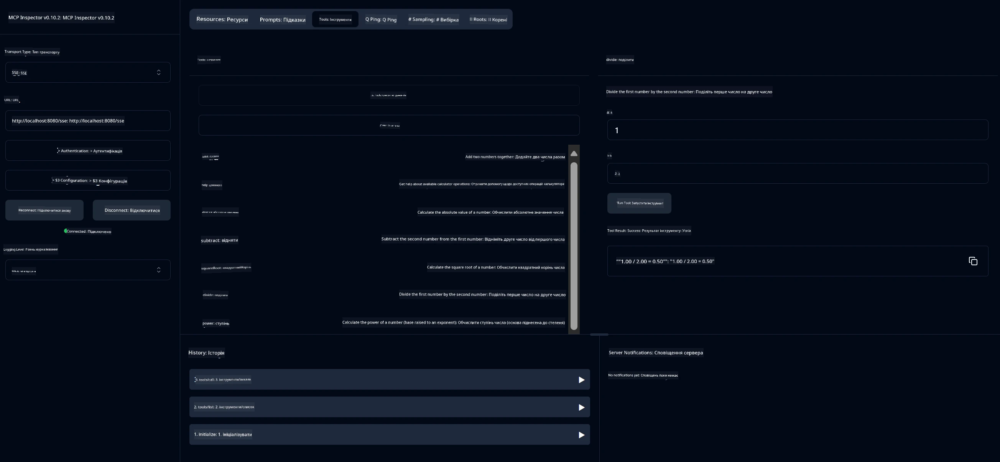

# Базовий калькулятор MCP сервіс

> [!NOTE]
> Це Java-рішення використовує застарілий транспорт HTTP+SSE та орієнтоване на SDK,
> сумісне з MCP `2025-11-25`. Воно збережене для сумісності з кодом курсу;
> нові віддалені сервери повинні використовувати підтримку Streamable HTTP `2026-07-28`.

Цей сервіс надає базові операції калькулятора через Протокол Контексту Моделі (MCP) за допомогою Spring Boot з транспортом WebFlux. Він створений як простий приклад для початківців, які вивчають реалізації MCP.

Для отримання додаткової інформації дивіться [MCP Server Boot Starter](https://docs.spring.io/spring-ai/reference/api/mcp/mcp-server-boot-starter-docs.html) в документації.


## Використання сервісу

Сервіс надає такі API-ендпоінти через протокол MCP:

- `add(a, b)`: Додавання двох чисел
- `subtract(a, b)`: Віднімання другого числа від першого
- `multiply(a, b)`: Множення двох чисел
- `divide(a, b)`: Ділення першого числа на друге (з перевіркою на нуль)
- `power(base, exponent)`: Піднесення числа до степеня
- `squareRoot(number)`: Обчислення квадратного кореня (з перевіркою на від’ємне число)
- `modulus(a, b)`: Обчислення остачі від ділення
- `absolute(number)`: Обчислення абсолютного значення

## Залежності

Проєкт потребує таких основних залежностей:

```xml
<dependency>
    <groupId>org.springframework.ai</groupId>
    <artifactId>spring-ai-starter-mcp-server-webflux</artifactId>
</dependency>
```

## Збірка проєкту

Зберіть проєкт за допомогою Maven:
```bash
./mvnw clean install -DskipTests
```

## Запуск сервера

### Використання Java

```bash
java -jar target/calculator-server-0.0.1-SNAPSHOT.jar
```

### Використання MCP Inspector

MCP Inspector — корисний інструмент для взаємодії з MCP сервісами. Щоб використати його з цим калькуляторним сервісом:

1. **Встановіть і запустіть MCP Inspector** у новому вікні терміналу:
   ```bash
   npx @modelcontextprotocol/inspector
   ```

2. **Відкрийте веб-інтерфейс**, натиснувши на URL, який показує додаток (зазвичай http://localhost:6274)

3. **Налаштуйте з’єднання**:
   - Встановіть тип транспорту "SSE"
   - Встановіть URL на SSE-ендпоінт вашого запущеного сервера: `http://localhost:8080/sse`
   - Натисніть "Connect"

4. **Використовуйте інструменти**:
   - Натисніть "List Tools", щоб побачити доступні операції калькулятора
   - Виберіть інструмент і натисніть "Run Tool" для виконання операції



---

<!-- CO-OP TRANSLATOR DISCLAIMER START -->
**Відмова від відповідальності**:
Цей документ було перекладено за допомогою сервісу штучного інтелекту для перекладу [Co-op Translator](https://github.com/Azure/co-op-translator). Хоча ми прагнемо до точності, будь ласка, майте на увазі, що автоматичні переклади можуть містити помилки або неточності. Оригінальний документ рідною мовою слід вважати авторитетним джерелом. Для критично важливої інформації рекомендується професійний людський переклад. Ми не несемо відповідальності за будь-які непорозуміння або неправильні тлумачення, що виникли внаслідок використання цього перекладу.
<!-- CO-OP TRANSLATOR DISCLAIMER END -->