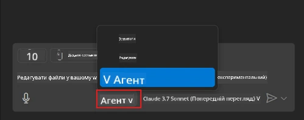
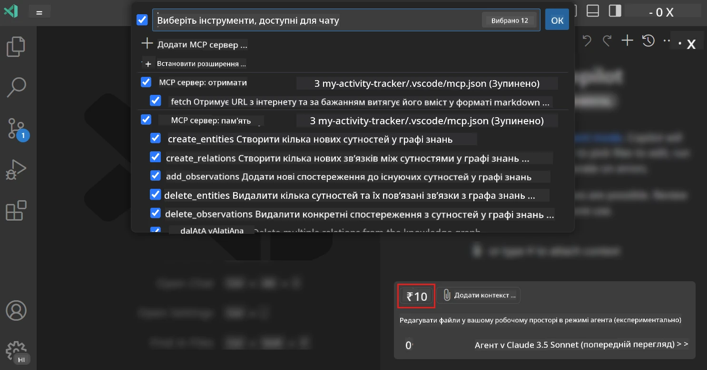
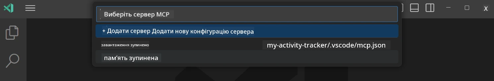
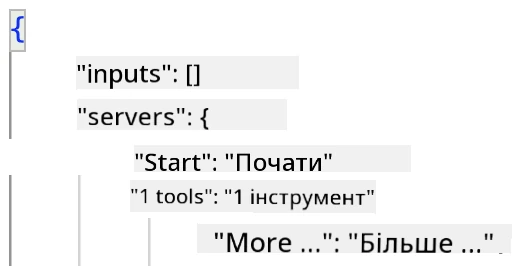
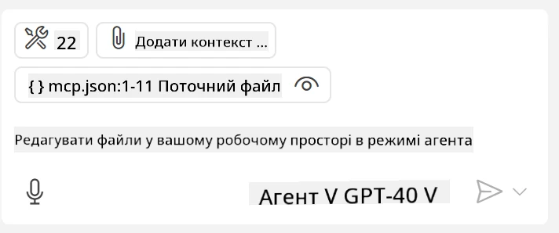
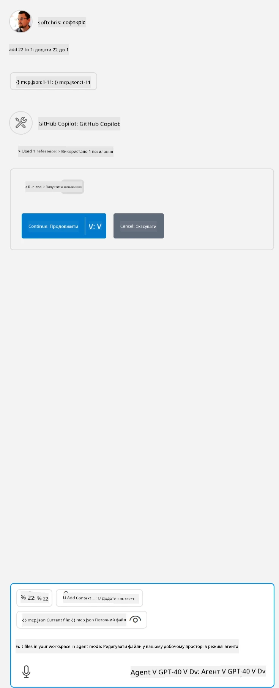

# Використання сервера в режимі агента GitHub Copilot

Visual Studio Code і GitHub Copilot можуть діяти як клієнти і використовувати MCP Server. Чому б ми хотіли це зробити, ви можете запитати? Це означає, що будь-які функції MCP Server тепер можна використовувати всередині вашого IDE. Уявіть, наприклад, що ви додаєте MCP сервер GitHub, це дозволить керувати GitHub за допомогою підказок замість введення конкретних команд у терміналі. Або уявіть щось загалом, що може покращити ваш досвід розробника, все це керується природною мовою. Тепер ви починаєте бачити перевагу, правда?

## Огляд

У цьому уроці розглядається, як використовувати Visual Studio Code та режим агента GitHub Copilot як клієнта для вашого MCP Server.

## Цілі навчання

Наприкінці цього уроку ви зможете:

- Використовувати MCP Server через Visual Studio Code.
- Запускати функції, як інструменти, через GitHub Copilot.
- Налаштовувати Visual Studio Code для знаходження та управління вашим MCP Server.

## Використання

Ви можете керувати своїм MCP сервером двома способами:

- Через користувацький інтерфейс, як це зробити, ви побачите пізніше в цьому розділі.
- Через термінал, можна керувати через термінал, використовуючи виконуваний файл `code`:

  Щоб додати MCP сервер до свого користувацького профілю, використайте опцію командного рядка --add-mcp та надайте конфігурацію сервера у форматі JSON у вигляді {\"name\":\"server-name\",\"command\":...}.

  ```
  code --add-mcp "{\"name\":\"my-server\",\"command\": \"uvx\",\"args\": [\"mcp-server-fetch\"]}"
  ```

### Знімки екрана





Далі поговоримо більше про те, як ми використовуємо візуальний інтерфейс у наступних розділах.

## Підхід

Ось як ми повинні підходити до цього на вищому рівні:

- Налаштувати файл для знаходження нашого MCP Server.
- Запустити/Під’єднатися до цього сервера, щоб він міг показати свої можливості.
- Використовувати ці можливості через інтерфейс GitHub Copilot Chat.

Чудово, тепер, коли ми розуміємо процес, давайте спробуємо використовувати MCP Server через Visual Studio Code у вправі.

## Вправа: Використання сервера

У цій вправі ми налаштуємо Visual Studio Code для знаходження вашого MCP сервера, щоб його можна було використовувати через інтерфейс GitHub Copilot Chat.

### -0- Попередній крок, увімкнення виявлення MCP Server

Можливо, вам потрібно буде увімкнути виявлення MCP Server.

1. Перейдіть у `File -> Preferences -> Settings` у Visual Studio Code.

1. Знайдіть "MCP" і увімкніть `chat.mcp.discovery.enabled` у файлі settings.json.

### -1- Створіть конфігураційний файл

Почніть зі створення конфігураційного файлу у корені вашого проєкту, потрібен файл MCP.json, який потрібно помістити в папку .vscode. Він має виглядати так:

```text
.vscode
|-- mcp.json
```

Далі давайте подивимося, як додати запис сервера.

### -2- Налаштуйте сервер

Додайте до *mcp.json* наступний вміст:

```json
{
    "inputs": [],
    "servers": {
       "hello-mcp": {
           "command": "node",
           "args": [
               "build/index.js"
           ]
       }
    }
}
```

Ось простий приклад вище, як запустити сервер, написаний на Node.js, для інших середовищ виконання вкажіть правильну команду для запуску сервера, використовуючи `command` та `args`.

### -3- Запуск сервера

Тепер, коли ви додали запис, давайте запустимо сервер:

1. Знайдіть свій запис у *mcp.json* і переконайтеся, що бачите іконку «play»:

    

1. Натисніть іконку «play», ви повинні побачити, що іконка інструментів у GitHub Copilot Chat збільшить кількість доступних інструментів. Якщо натиснути цю іконку інструментів, ви побачите список зареєстрованих інструментів. Ви можете позначати/знімати позначки з кожного інструмента, залежно від того, чи хочете, щоб GitHub Copilot використовував їх як контекст:

  

1. Щоб запустити інструмент, наберіть підказку, яку ви знаєте, що вона відповідатиме опису одного з ваших інструментів, наприклад, підказка «add 22 to 1»:

  

  Ви повинні побачити відповідь 23.

## Завдання

Спробуйте додати запис сервера до вашого файлу *mcp.json* і переконайтеся, що ви можете запускати та зупиняти сервер. Також переконайтеся, що ви можете спілкуватися з інструментами вашого сервера через інтерфейс GitHub Copilot Chat.

## Рішення

[Рішення](./solution/README.md)

## Важливі висновки

Висновки з цього розділу такі:

- Visual Studio Code — це чудовий клієнт, що дозволяє вам використовувати кілька MCP Server та їх інструменти.
- Інтерфейс GitHub Copilot Chat — це спосіб взаємодії із серверами.
- Ви можете запитувати користувача про введення, як-от API ключі, які можна передати MCP Server під час налаштування запису сервера у файлі *mcp.json*.

## Приклади

- [Калькулятор на Java](../samples/java/calculator/README.md)
- [Калькулятор на .Net](../../../../03-GettingStarted/samples/csharp)
- [Калькулятор на JavaScript](../samples/javascript/README.md)
- [Калькулятор на TypeScript](../samples/typescript/README.md)
- [Калькулятор на Python](../../../../03-GettingStarted/samples/python)

## Додаткові ресурси

- [Документація Visual Studio](https://code.visualstudio.com/docs/copilot/chat/mcp-servers)

## Що далі

- Далі: [Створення stdio Server](../05-stdio-server/README.md)

---

<!-- CO-OP TRANSLATOR DISCLAIMER START -->
**Відмова від відповідальності**:
Цей документ було перекладено за допомогою сервісу штучного інтелекту для перекладу [Co-op Translator](https://github.com/Azure/co-op-translator). Хоча ми прагнемо до точності, будь ласка, майте на увазі, що автоматичні переклади можуть містити помилки або неточності. Оригінальний документ рідною мовою слід вважати авторитетним джерелом. Для критично важливої інформації рекомендується професійний людський переклад. Ми не несемо відповідальності за будь-які непорозуміння або неправильні тлумачення, що виникли внаслідок використання цього перекладу.
<!-- CO-OP TRANSLATOR DISCLAIMER END -->