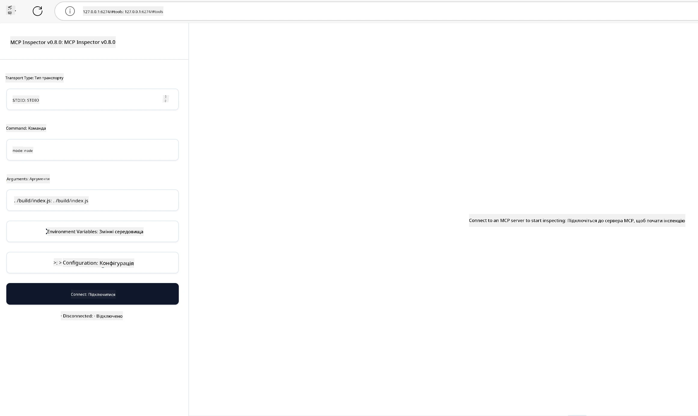

## Тестування та відлагодження

Перед тим, як починати тестування вашого MCP-сервера, важливо розуміти доступні інструменти та кращі практики відлагодження. Ефективне тестування гарантує, що ваш сервер працює як очікується, і допомагає швидко виявляти та усувати проблеми. У наступному розділі наведено рекомендовані підходи до перевірки вашої реалізації MCP.

## Огляд

Цей урок охоплює, як обрати правильний підхід до тестування та найбільш ефективний інструмент для тестування.

## Цілі навчання

До кінця цього уроку ви зможете:

- Описувати різні підходи до тестування.
- Використовувати різні інструменти для ефективного тестування коду.


## Тестування MCP серверів

MCP надає інструменти для допомоги у тестуванні та відлагодженні ваших серверів:

- **MCP Inspector**: Інструмент командного рядка, який можна запускати як CLI-інструмент або як візуальний інструмент.
- **Ручне тестування**: Ви можете використовувати інструмент, наприклад curl, для виконання веб-запитів, але підходить будь-який інструмент, що підтримує HTTP.
- **Юніт-тестування**: Можна використовувати улюблений фреймворк тестування для перевірки функцій як сервера, так і клієнта.

### Використання MCP Inspector

Ми описували використання цього інструменту в попередніх уроках, але давайте трохи поговоримо про нього на високому рівні. Це інструмент, створений на Node.js, який можна використовувати, викликаючи виконуваний файл `npx`, що тимчасово завантажує та встановлює інструмент, а після завершення вашого запиту видаляє себе.

[MCP Inspector](https://github.com/modelcontextprotocol/inspector) допомагає вам:

- **Виявлення можливостей сервера**: Автоматично визначає доступні ресурси, інструменти та запити
- **Тестування запуску інструментів**: Пробуйте різні параметри і дивіться відповіді в реальному часі
- **Перегляд метаданих сервера**: Перевіряйте інформацію про сервер, схеми та конфігурації

Зазвичай запуск інструменту виглядає так:

```bash
npx @modelcontextprotocol/inspector node build/index.js
```

Вищенаведена команда запускає MCP та його візуальний інтерфейс, а також відкриває локальний веб-інтерфейс у вашому браузері. Ви побачите інформаційну панель із зареєстрованими MCP-серверами, їх доступними інструментами, ресурсами та запитами. Інтерфейс дозволяє інтерактивно тестувати запуск інструментів, перевіряти метадані сервера та переглядати відповіді в режимі реального часу — це полегшує перевірку та відлагодження ваших реалізацій MCP-сервера.

Ось як це може виглядати: 

Ви також можете запускати цей інструмент у CLI-режимі, додаючи атрибут `--cli`. Ось приклад запуску інструменту в режимі "CLI", який виводить усі інструменти на сервері:

```sh
npx @modelcontextprotocol/inspector --cli node build/index.js --method tools/list
```

### Ручне тестування

Крім запуску інструменту inspector для тестування можливостей сервера, іншим схожим підходом є запускавати клієнт, здатний працювати з HTTP, наприклад curl.

За допомогою curl ви можете тестувати MCP сервери безпосередньо, використовуючи HTTP запити:

```bash
# Приклад: метадані тестового сервера
curl http://localhost:3000/v1/metadata

# Приклад: виконати інструмент
curl -X POST http://localhost:3000/v1/tools/execute \
  -H "Content-Type: application/json" \
  -d '{"name": "calculator", "parameters": {"expression": "2+2"}}'
```

Як видно з наведеного прикладу використання curl, ви використовуєте POST-запит для виклику інструменту, надсилаючи вміст із іменем інструменту та його параметрами. Використовуйте підхід, який вам найбільше підходить. CLI-інструменти загалом швидші у використанні і їх легко скриптувати, що може бути корисним у середовищі CI/CD.

### Юніт-тестування

Створіть юніт-тести для ваших інструментів і ресурсів, щоб упевнитися, що вони працюють як очікується. Ось приклад тестового коду.

```python
import pytest

from mcp.server.fastmcp import FastMCP
from mcp.shared.memory import (
    create_connected_server_and_client_session as create_session,
)

# Позначити весь модуль для асинхронних тестів
pytestmark = pytest.mark.anyio


async def test_list_tools_cursor_parameter():
    """Test that the cursor parameter is accepted for list_tools.

    Note: FastMCP doesn't currently implement pagination, so this test
    only verifies that the cursor parameter is accepted by the client.
    """

 server = FastMCP("test")

    # Створити кілька тестових інструментів
    @server.tool(name="test_tool_1")
    async def test_tool_1() -> str:
        """First test tool"""
        return "Result 1"

    @server.tool(name="test_tool_2")
    async def test_tool_2() -> str:
        """Second test tool"""
        return "Result 2"

    async with create_session(server._mcp_server) as client_session:
        # Тест без параметра курсора (опущено)
        result1 = await client_session.list_tools()
        assert len(result1.tools) == 2

        # Тест з cursor=None
        result2 = await client_session.list_tools(cursor=None)
        assert len(result2.tools) == 2

        # Тест з курсором як рядком
        result3 = await client_session.list_tools(cursor="some_cursor_value")
        assert len(result3.tools) == 2

        # Тест з пустим рядком як курсором
        result4 = await client_session.list_tools(cursor="")
        assert len(result4.tools) == 2
    
```

Наведений код виконує наступне:

- Використовує фреймворк pytest, який дозволяє створювати тести у вигляді функцій і використовувати оператори assert.
- Створює MCP сервер із двома різними інструментами.
- Використовує оператор `assert` для перевірки виконання певних умов.

Ознайомтеся з [повним файлом тут](https://github.com/modelcontextprotocol/python-sdk/blob/main/tests/client/test_list_methods_cursor.py)

З огляду на наведений файл, ви можете протестувати власний сервер, щоб упевнитися, що можливості створюються належним чином.

Усі основні SDK мають подібні розділи тестування, тож ви можете адаптувати їх до вашого обраного середовища виконання.

## Приклади

- [Калькулятор Java](../samples/java/calculator/README.md)
- [Калькулятор .Net](../../../../03-GettingStarted/samples/csharp)
- [Калькулятор JavaScript](../samples/javascript/README.md)
- [Калькулятор TypeScript](../samples/typescript/README.md)
- [Калькулятор Python](../../../../03-GettingStarted/samples/python) 

## Додаткові ресурси

- [Python SDK](https://github.com/modelcontextprotocol/python-sdk)

## Що далі

- Далі: [Розгортання](../09-deployment/README.md)

---

<!-- CO-OP TRANSLATOR DISCLAIMER START -->
**Відмова від відповідальності**:
Цей документ було перекладено за допомогою сервісу штучного інтелекту для перекладу [Co-op Translator](https://github.com/Azure/co-op-translator). Хоча ми прагнемо до точності, будь ласка, майте на увазі, що автоматичні переклади можуть містити помилки або неточності. Оригінальний документ рідною мовою слід вважати авторитетним джерелом. Для критично важливої інформації рекомендується професійний людський переклад. Ми не несемо відповідальності за будь-які непорозуміння або неправильні тлумачення, що виникли внаслідок використання цього перекладу.
<!-- CO-OP TRANSLATOR DISCLAIMER END -->