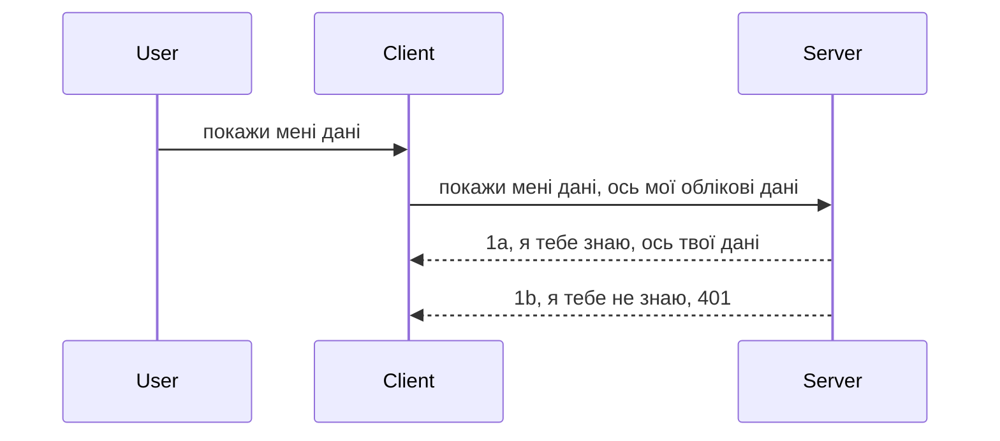

# Проста автентифікація

MCP SDK підтримують використання OAuth 2.1, що, чесно кажучи, є досить складним процесом, що включає поняття таких як сервер аутентифікації, сервер ресурсів, відправлення облікових даних, отримання коду, обмін коду на маркер доступу, поки нарешті не отримаєте доступ до ресурсних даних. Якщо ви не знайомі з OAuth, а це чудова технологія для впровадження, то хорошою ідеєю буде почати з базового рівня автентифікації, поступово переходячи до кращої та більшої безпеки. Саме для цього існує цей розділ — щоб покроково розвинути вас до більш просунутої аутентифікації.

## Аутентифікація, що ми маємо на увазі?

Аутентифікація — це скорочення від аутентифікації та авторизації. Ідея полягає у тому, що нам потрібно зробити дві речі:

- **Аутентифікація** – це процес визначення, чи дозволити людині увійти у наш дім, чи має вона право бути "тут", тобто отримати доступ до нашого серверу ресурсів, де працюють функції MCP Server.
- **Авторизація** – це процес визначення, чи повинен користувач мати доступ до конкретних ресурсів, які він запитує, наприклад, ці замовлення чи ці продукти, або чи дозволено йому читати вміст, але не видаляти, як інший приклад.

## Облікові дані: як ми повідомляємо систему, хто ми такі

Більшість веб-розробників спочатку думають у термінах надання серверу облікових даних, зазвичай секретного коду, що підтверджує, чи дозволено їм бути тут — "Аутентифікація". Ці облікові дані зазвичай є base64-кодованою версією імені користувача та пароля або ключем API, що унікально ідентифікує користувача.

Це передається через заголовок "Authorization" ось так:

```json
{ "Authorization": "secret123" }
```

Це зазвичай називають базовою аутентифікацією. Загальний потік роботи виглядає наступним чином:


Тепер, коли ми розуміємо, як це працює на рівні потоку, як ми це реалізуємо? Більшість веб-серверів мають концепцію, яка називається middleware — це частина коду, що виконується у складі запиту і може перевіряти облікові дані; якщо вони дійсні, запит проходить. Якщо облікові дані недійсні, ви отримуєте помилку автентифікації. Давайте подивимось, як це можна реалізувати:

**Python**

```python
class AuthMiddleware(BaseHTTPMiddleware):
    async def dispatch(self, request, call_next):

        has_header = request.headers.get("Authorization")
        if not has_header:
            print("-> Missing Authorization header!")
            return Response(status_code=401, content="Unauthorized")

        if not valid_token(has_header):
            print("-> Invalid token!")
            return Response(status_code=403, content="Forbidden")

        print("Valid token, proceeding...")
       
        response = await call_next(request)
        # додати будь-які заголовки клієнта або змінити відповідь якимось чином
        return response


starlette_app.add_middleware(CustomHeaderMiddleware)
```

Тут ми:

- Створили middleware `AuthMiddleware`, метод `dispatch` якого викликається веб-сервером.
- Додали middleware до веб-серверу:

    ```python
    starlette_app.add_middleware(AuthMiddleware)
    ```

- Написали логіку перевірки, яка перевіряє, чи присутній заголовок Authorization і чи дійсний наданий секрет:

    ```python
    has_header = request.headers.get("Authorization")
    if not has_header:
        print("-> Missing Authorization header!")
        return Response(status_code=401, content="Unauthorized")

    if not valid_token(has_header):
        print("-> Invalid token!")
        return Response(status_code=403, content="Forbidden")
    ```

    якщо секрет є і він дійсний, ми пропускаємо запит, викликаючи `call_next`, і повертаємо відповідь.

    ```python
    response = await call_next(request)
    # додати будь-які заголовки користувача або змінити відповідь якимось чином
    return response
    ```

Як це працює: якщо до сервера надходить веб-запит, middleware буде викликаний, і залежно від реалізації він або пропустить запит, або поверне помилку про відсутність дозволу.

**TypeScript**

Тут ми створюємо middleware за допомогою популярного фреймворку Express і перехоплюємо запит ще до надходження його до MCP Server. Ось код:

```typescript
function isValid(secret) {
    return secret === "secret123";
}

app.use((req, res, next) => {
    // 1. Заголовок авторизації присутній?
    if(!req.headers["Authorization"]) {
        res.status(401).send('Unauthorized');
    }
    
    let token = req.headers["Authorization"];

    // 2. Перевірте дійсність.
    if(!isValid(token)) {
        res.status(403).send('Forbidden');
    }

   
    console.log('Middleware executed');
    // 3. Передає запит до наступного кроку в обробці запиту.
    next();
});
```

У цьому коді ми:

1. Перевіряємо, чи заголовок Authorization присутній, якщо ні — відправляємо помилку 401.
2. Перевіряємо, чи дійсний токен/облікові дані, якщо ні — відправляємо 403.
3. Успішно передаємо запит далі в pipeline і повертаємо запитуваний ресурс.

## Вправа: реалізувати аутентифікацію

Візьмемо наші знання і спробуємо реалізувати це. План такий:

Сервер

- Створити веб-сервер і екземпляр MCP.
- Реалізувати middleware для сервера.

Клієнт 

- Надсилати веб-запити з обліковими даними у заголовку.

### -1- Створити веб-сервер і екземпляр MCP

На першому кроці нам потрібно створити екземпляр веб-сервера та MCP Server.

**Python**

Тут ми створюємо екземпляр MCP Server, створюємо starlette web додаток і розгортаємо його через uvicorn.

```python
# створення MCP сервера

app = FastMCP(
    name="MCP Resource Server",
    instructions="Resource Server that validates tokens via Authorization Server introspection",
    host=settings["host"],
    port=settings["port"],
    debug=True
)

# створення веб-додатка starlette
starlette_app = app.streamable_http_app()

# сервінг додатка через uvicorn
async def run(starlette_app):
    import uvicorn
    config = uvicorn.Config(
            starlette_app,
            host=app.settings.host,
            port=app.settings.port,
            log_level=app.settings.log_level.lower(),
        )
    server = uvicorn.Server(config)
    await server.serve()

run(starlette_app)
```

У цьому коді ми:

- Створюємо MCP Server.
- Конструюємо starlette web додаток з MCP Server, `app.streamable_http_app()`.
- Запускаємо і обслуговуємо веб-додаток за допомогою uvicorn `server.serve()`.

**TypeScript**

Тут ми створюємо екземпляр MCP Server.

```typescript
const server = new McpServer({
      name: "example-server",
      version: "1.0.0"
    });

    // ... налаштувати ресурси сервера, інструменти та підказки ...
```

Цей код створення MCP Server повинен виконуватися у межах визначення маршруту POST /mcp, тож давайте перенесемо наведений вище код ось так:

```typescript
import express from "express";
import { randomUUID } from "node:crypto";
import { McpServer } from "@modelcontextprotocol/sdk/server/mcp.js";
import { StreamableHTTPServerTransport } from "@modelcontextprotocol/sdk/server/streamableHttp.js";
import { isInitializeRequest } from "@modelcontextprotocol/sdk/types.js"

const app = express();
app.use(express.json());

// Мапа для зберігання транспортів за ідентифікатором сесії
const transports: { [sessionId: string]: StreamableHTTPServerTransport } = {};

// Обробка POST-запитів для клієнт-серверної комунікації
app.post('/mcp', async (req, res) => {
  // Перевірка наявності існуючого ідентифікатора сесії
  const sessionId = req.headers['mcp-session-id'] as string | undefined;
  let transport: StreamableHTTPServerTransport;

  if (sessionId && transports[sessionId]) {
    // Повторне використання існуючого транспорту
    transport = transports[sessionId];
  } else if (!sessionId && isInitializeRequest(req.body)) {
    // Запит на нову ініціалізацію
    transport = new StreamableHTTPServerTransport({
      sessionIdGenerator: () => randomUUID(),
      onsessioninitialized: (sessionId) => {
        // Зберегти транспорт за ідентифікатором сесії
        transports[sessionId] = transport;
      },
      // Захист від DNS rebinding за замовчуванням вимкнено для зворотної сумісності. Якщо ви запускаєте цей сервер
      // локально, переконайтеся, що встановили:
      // enableDnsRebindingProtection: true,
      // allowedHosts: ['127.0.0.1'],
    });

    // Очистити транспорт при закритті
    transport.onclose = () => {
      if (transport.sessionId) {
        delete transports[transport.sessionId];
      }
    };
    const server = new McpServer({
      name: "example-server",
      version: "1.0.0"
    });

    // ... налаштувати ресурси сервера, інструменти та підказки ...

    // Підключитися до MCP сервера
    await server.connect(transport);
  } else {
    // Невірний запит
    res.status(400).json({
      jsonrpc: '2.0',
      error: {
        code: -32000,
        message: 'Bad Request: No valid session ID provided',
      },
      id: null,
    });
    return;
  }

  // Обробити запит
  await transport.handleRequest(req, res, req.body);
});

// Повторно використовуваний обробник для GET та DELETE запитів
const handleSessionRequest = async (req: express.Request, res: express.Response) => {
  const sessionId = req.headers['mcp-session-id'] as string | undefined;
  if (!sessionId || !transports[sessionId]) {
    res.status(400).send('Invalid or missing session ID');
    return;
  }
  
  const transport = transports[sessionId];
  await transport.handleRequest(req, res);
};

// Обробка GET-запитів для повідомлень сервера до клієнта через SSE
app.get('/mcp', handleSessionRequest);

// Обробка DELETE-запитів для завершення сесії
app.delete('/mcp', handleSessionRequest);

app.listen(3000);
```

Тепер ви бачите, як створення MCP Server було перенесено у `app.post("/mcp")`.

Переходимо до наступного кроку створення middleware для валідації облікових даних.

### -2- Реалізувати middleware для сервера

Тепер перейдемо до частини про middleware. Тут ми створимо middleware, який шукає облікові дані в заголовку `Authorization` і перевіряє їх. Якщо облікові дані прийнятні, запит буде оброблено далі (наприклад, перерахувати інструменти, прочитати ресурс або виконати інші функції MCP, які запросив клієнт).

**Python**

Для створення middleware потрібно створити клас, що наслідує `BaseHTTPMiddleware`. Є два важливих елементи:

- Запит `request`, з якого ми читаємо заголовки.
- `call_next` — колбек, який ми викликаємо, якщо клієнт надав прийнятні облікові дані.

Спочатку опрацюємо випадок відсутності заголовка `Authorization`:

```python
has_header = request.headers.get("Authorization")

# заголовок відсутній, повернути помилку 401, інакше продовжити.
if not has_header:
    print("-> Missing Authorization header!")
    return Response(status_code=401, content="Unauthorized")
```

Тут ми відправляємо повідомлення 401 unauthorized, оскільки клієнт не пройшов аутентифікацію.

Далі, якщо облікові дані надіслані, перевіряємо їхню дійсність так:

```python
 if not valid_token(has_header):
    print("-> Invalid token!")
    return Response(status_code=403, content="Forbidden")
```

Зверніть увагу, що тут ми відправляємо повідомлення 403 forbidden. Ось повний middleware, який реалізує описане вище:

```python
class AuthMiddleware(BaseHTTPMiddleware):
    async def dispatch(self, request, call_next):

        has_header = request.headers.get("Authorization")
        if not has_header:
            print("-> Missing Authorization header!")
            return Response(status_code=401, content="Unauthorized")

        if not valid_token(has_header):
            print("-> Invalid token!")
            return Response(status_code=403, content="Forbidden")

        print("Valid token, proceeding...")
        print(f"-> Received {request.method} {request.url}")
        response = await call_next(request)
        response.headers['Custom'] = 'Example'
        return response

```

Чудово, а що ж таке функція `valid_token`? Ось вона нижче:
:

```python
# НЕ використовуйте для продакшену - покращте це !!
def valid_token(token: str) -> bool:
    # видаліть префікс "Bearer "
    if token.startswith("Bearer "):
        token = token[7:]
        return token == "secret-token"
    return False
```

Це, звичайно, потрібно покращувати.

ВАЖЛИВО: Ніколи не слід зберігати секрети безпосередньо в коді. Ідеально отримувати значення для порівняння з бази даних, у сервісі ідентифікації (IDP) або ще краще — дозволити IDP виконувати валідацію.

**TypeScript**

Для цього в Express потрібно викликати метод `use`, який приймає функції middleware.

Нам потрібно:

- Перевірити запит, щоб отримати облікові дані з властивості `Authorization`.
- Перевірити облікові дані; якщо вони валідні — пропустити запит далі, щоб MCP міг виконати потрібні дії (наприклад, перерахувати інструменти, прочитати ресурс чи інші операції з MCP).

Тут ми перевіряємо, чи присутній `Authorization`; якщо ні, блокувати запит:

```typescript
if(!req.headers["authorization"]) {
    res.status(401).send('Unauthorized');
    return;
}
```

Якщо заголовок відсутній, отримуємо помилку 401.

Далі перевіряємо дійсність облікових даних; якщо вони неправильні, знову блокуючи з іншим повідомленням:

```typescript
if(!isValid(token)) {
    res.status(403).send('Forbidden');
    return;
} 
```

Зверніть увагу, ви отримаєте помилку 403.

Повний код:

```typescript
app.use((req, res, next) => {
    console.log('Request received:', req.method, req.url, req.headers);
    console.log('Headers:', req.headers["authorization"]);
    if(!req.headers["authorization"]) {
        res.status(401).send('Unauthorized');
        return;
    }
    
    let token = req.headers["authorization"];

    if(!isValid(token)) {
        res.status(403).send('Forbidden');
        return;
    }  

    console.log('Middleware executed');
    next();
});
```

Ми налаштували веб-сервер, щоб приймати middleware, який перевіряє облікові дані, які, сподіваємося, клієнт надсилає. А що з самим клієнтом?

### -3- Надіслати веб-запит з обліковими даними через заголовок

Потрібно переконатися, що клієнт передає облікові дані у заголовку. Оскільки ми будемо використовувати MCP клієнт, треба дізнатися, як це зробити.

**Python**

Для клієнта треба передати заголовок з обліковими даними ось так:

```python
# НЕ захардкоджуйте значення, зберігайте його принаймні у змінній середовища або у більш захищеному сховищі
token = "secret-token"

async with streamablehttp_client(
        url = f"http://localhost:{port}/mcp",
        headers = {"Authorization": f"Bearer {token}"}
    ) as (
        read_stream,
        write_stream,
        session_callback,
    ):
        async with ClientSession(
            read_stream,
            write_stream
        ) as session:
            await session.initialize()
      
            # TODO, що ви хочете зробити на боці клієнта, наприклад списати інструменти, викликати інструменти тощо.
```

Зверніть увагу, як ми заповнюємо властивість `headers` так: `headers = {"Authorization": f"Bearer {token}"}`.

**TypeScript**

Розв’язуємо це у два кроки:

1. Створити об’єкт конфігурації з обліковими даними.
2. Передати конфігурацію у транспорт.

```typescript

// НЕ жорстко кодуйте значення, як показано тут. Принаймні, зберігайте його як змінну середовища та використовуйте щось на кшталт dotenv (у режимі розробки).
let token = "secret123"

// визначити об’єкт параметрів транспорту клієнта
let options: StreamableHTTPClientTransportOptions = {
  sessionId: sessionId,
  requestInit: {
    headers: {
      "Authorization": "secret123"
    }
  }
};

// передати об’єкт параметрів до транспорту
async function main() {
   const transport = new StreamableHTTPClientTransport(
      new URL(serverUrl),
      options
   );
```

Тут ви бачите, як ми створили об’єкт `options` і розмістили заголовки у властивості `requestInit`.

ВАЖЛИВО: Як покращити це далі? Поточна реалізація має деякі проблеми. По-перше, передача облікових даних у такий спосіб досить ризикована, якщо у вас немає, як мінімум, HTTPS. Навіть із HTTPS облікові дані можуть бути викрадені, тому потрібна система, де можна легко відкликати токен і додати додаткові перевірки: звідки запит, чи він не надто частий (ботоподібна поведінка), одним словом — багато питань безпеки.

Однак, для дуже простих API, де ви не хочете, щоб хтось звертався без автентифікації, те, що ми маємо, — хороший старт.

А тепер спробуємо підвищити безпеку, використовуючи стандартизований формат JSON Web Token, також відомий як JWT або "JOT" токени.

## JSON Web Tokens, JWT

Отже, ми прагнемо покращити просту аутентифікацію. Які безпосередні переваги після впровадження JWT?

- **Покращення безпеки**. У базовій аутентифікації ви надсилаєте імя користувача та пароль у вигляді base64 токена (або ключ API) з кожним запитом, що підвищує ризик. JWT надсилає імя користувача і пароль один раз і отримує токен у відповідь, цей токен є часозалежним — він має термін дії. JWT дозволяє використовувати гнучке управління доступом із ролями, обсягами і правами.
- **Безстанність і масштабованість**. JWT є самодостатніми, містять усю інформацію про користувача і усувають необхідність зберігати сесію на сервері. Маркери також можна перевіряти локально.
- **Інтероперабельність і федерація**. JWT — центральна складова OpenID Connect, використовується з відомими провайдерами ідентичності, такими як Entra ID, Google Identity і Auth0, що дозволяє використовувати єдиний вхід (SSO) і багато іншого, забезпечуючи підприємницький рівень.
- **Модульність і гнучкість**. JWT також можна використовувати з API-шлюзами, такими як Azure API Management, NGINX тощо. Він підтримує сценарії аутентифікації та сервер-серверного спілкування, включаючи імперсонацію та делегацію.
- **Продуктивність і кешування**. JWT можна кешувати після розкодування, що знижує необхідність повторного розпарсингу. Це допомагає особливо при високому навантаженні, покращуючи пропускну спроможність і знижуючи навантаження на інфраструктуру.
- **Розширені функції**. Підтримує інспекцію (перевірку дійсності на сервері) і відкликання (робить токен недійсним).

З урахуванням усіх цих переваг, давайте подивимось, як підняти нашу реалізацію на новий рівень.

## Перетворення базової автентифікації у JWT

Найзагальніші зміни, які нам потрібно виконати:

- **Навчитись формувати JWT токен** і підготувати його до відправки від клієнта до сервера.
- **Перевіряти JWT токен**, і якщо він валідний, надати клієнту доступ до ресурсів.
- **Безпека зберігання токенів**. Як ми зберігаємо цей токен.
- **Захист маршрутів**. Потрібно захистити маршрути, а у нашому випадку — маршрути та конкретні функції MCP.
- **Додати refresh токени**. Створювати короткоживучі токени та довгоживучі refresh токени, які використовуються для отримання нових токенів при їхньому закінченні. Забезпечити наявність refresh endpoint і стратегії ротації.

### -1- Конструкція JWT токена

JWT токен має такі частини:

- **Header (заголовок)** — алгоритм і тип токена.
- **Payload (корисні дані)** — твердження (claims), наприклад, sub (користувач або сутність, яку представляє токен, зазвичай це userId), exp (дата закінчення дії), роль (role).
- **Signature (підпис)** — підписаний секретом або приватним ключем.

Потрібно сформувати заголовок, payload та закодований токен.

**Python**

```python

import jwt
import jwt
from jwt.exceptions import ExpiredSignatureError, InvalidTokenError
import datetime

# Секретний ключ, що використовується для підпису JWT
secret_key = 'your-secret-key'

header = {
    "alg": "HS256",
    "typ": "JWT"
}

# інформація про користувача та його твердження і час закінчення дії
payload = {
    "sub": "1234567890",               # Тема (ID користувача)
    "name": "User Userson",                # Користувацьке твердження
    "admin": True,                     # Користувацьке твердження
    "iat": datetime.datetime.utcnow(),# Час видачі
    "exp": datetime.datetime.utcnow() + datetime.timedelta(hours=1)  # Термін дії
}

# закодувати це
encoded_jwt = jwt.encode(payload, secret_key, algorithm="HS256", headers=header)
```

У наведеному коді ми:

- Визначили заголовок, використовуючи алгоритм HS256 і тип JWT.
- Сконструювали payload, що містить суб’єкта (user id), ім’я користувача, роль, час видачі і час закінчення дії, реалізуючи вказаний часовий обмежувач.

**TypeScript**

Тут нам знадобляться додаткові бібліотеки для створення JWT токенів.

Залежності

```sh

npm install jsonwebtoken
npm install --save-dev @types/jsonwebtoken
```

Тепер, коли все налаштовано, створимо заголовок, payload і сформуємо закодований токен.

```typescript
import jwt from 'jsonwebtoken';

const secretKey = 'your-secret-key'; // Використовуйте змінні середовища у продакшені

// Визначте навантаження
const payload = {
  sub: '1234567890',
  name: 'User usersson',
  admin: true,
  iat: Math.floor(Date.now() / 1000), // Час видачі
  exp: Math.floor(Date.now() / 1000) + 60 * 60 // Термін дії 1 година
};

// Визначте заголовок (опційно, jsonwebtoken встановлює значення за замовчуванням)
const header = {
  alg: 'HS256',
  typ: 'JWT'
};

// Створіть токен
const token = jwt.sign(payload, secretKey, {
  algorithm: 'HS256',
  header: header
});

console.log('JWT:', token);
```

Цей токен:

Підписаний за алгоритмом HS256
Діє 1 годину
Включає твердження sub, name, admin, iat, exp

### -2- Валідація токена

Також потрібно валідувати токен — це має відбуватися на сервері, щоб переконатися, що те, що надсилає клієнт, є дійсним. Треба перевірити структуру, дійсність і бажано додаткові перевірки користувача у системі.

Валідація означає розкодування, щоб прочитати токен та почати перевірку:

**Python**

```python

# Розкодуйте та перевірте JWT
try:
    decoded = jwt.decode(token, secret_key, algorithms=["HS256"])
    print("✅ Token is valid.")
    print("Decoded claims:")
    for key, value in decoded.items():
        print(f"  {key}: {value}")
except ExpiredSignatureError:
    print("❌ Token has expired.")
except InvalidTokenError as e:
    print(f"❌ Invalid token: {e}")

```

У цьому коді викликаємо `jwt.decode`, передаючи токен, секретний ключ і обраний алгоритм. Зверніть увагу, що використано try-except, оскільки у разі невдалої валідації виникає помилка.

**TypeScript**

Тут викликаємо `jwt.verify`, щоб отримати декодований токен для подальшого аналізу. Якщо виклик не вдається, це означає, що токен має неправильну структуру або не дійсний.

```typescript

try {
  const decoded = jwt.verify(token, secretKey);
  console.log('Decoded Payload:', decoded);
} catch (err) {
  console.error('Token verification failed:', err);
}
```

ПРИМІТКА: як зазначалось раніше, слід додати додаткові перевірки, щоб переконатися, що цей токен належить користувачу у системі і що користувач має необхідні права.

Далі розглянемо контроль доступу на основі ролей, відомий як RBAC.
## Додавання контролю доступу на основі ролей

Ідея полягає в тому, що ми хочемо виразити, що різні ролі мають різні права доступу. Наприклад, ми вважаємо, що адміністратор може робити все, а звичайні користувачі можуть читати/записувати, а гість може лише читати. Отже, ось деякі можливої рівні дозволів:

- Admin.Write 
- User.Read
- Guest.Read

Давайте подивимось, як ми можемо реалізувати такий контроль за допомогою проміжного програмного забезпечення. Middleware можна додавати для окремих маршрутів, а також для всіх маршрутів.

**Python**

```python
from starlette.middleware.base import BaseHTTPMiddleware
from starlette.responses import JSONResponse
import jwt

# НЕ зберігайте секрет прямо в коді, це лише для демонстрації. Зчитуйте його з безпечного місця.
SECRET_KEY = "your-secret-key" # помістіть це у змінну оточення
REQUIRED_PERMISSION = "User.Read"

class JWTPermissionMiddleware(BaseHTTPMiddleware):
    async def dispatch(self, request, call_next):
        auth_header = request.headers.get("Authorization")
        if not auth_header or not auth_header.startswith("Bearer "):
            return JSONResponse({"error": "Missing or invalid Authorization header"}, status_code=401)

        token = auth_header.split(" ")[1]
        try:
            decoded = jwt.decode(token, SECRET_KEY, algorithms=["HS256"])
        except jwt.ExpiredSignatureError:
            return JSONResponse({"error": "Token expired"}, status_code=401)
        except jwt.InvalidTokenError:
            return JSONResponse({"error": "Invalid token"}, status_code=401)

        permissions = decoded.get("permissions", [])
        if REQUIRED_PERMISSION not in permissions:
            return JSONResponse({"error": "Permission denied"}, status_code=403)

        request.state.user = decoded
        return await call_next(request)


```

Існує кілька різних способів додати middleware, як показано нижче:

```python

# Варіант 1: додати middleware під час створення додатку starlette
middleware = [
    Middleware(JWTPermissionMiddleware)
]

app = Starlette(routes=routes, middleware=middleware)

# Варіант 2: додати middleware після того, як додаток starlette вже створено
starlette_app.add_middleware(JWTPermissionMiddleware)

# Варіант 3: додати middleware для кожного маршруту
routes = [
    Route(
        "/mcp",
        endpoint=..., # обробник
        middleware=[Middleware(JWTPermissionMiddleware)]
    )
]
```

**TypeScript**

Ми можемо використовувати `app.use` та middleware, який буде виконуватися для всіх запитів. 

```typescript
app.use((req, res, next) => {
    console.log('Request received:', req.method, req.url, req.headers);
    console.log('Headers:', req.headers["authorization"]);

    // 1. Перевірте, чи було надіслано заголовок авторизації

    if(!req.headers["authorization"]) {
        res.status(401).send('Unauthorized');
        return;
    }
    
    let token = req.headers["authorization"];

    // 2. Перевірте, чи є токен дійсним
    if(!isValid(token)) {
        res.status(403).send('Forbidden');
        return;
    }  

    // 3. Перевірте, чи існує користувач токена в нашій системі
    if(!isExistingUser(token)) {
        res.status(403).send('Forbidden');
        console.log("User does not exist");
        return;
    }
    console.log("User exists");

    // 4. Перевірте, чи має токен правильні дозволи
    if(!hasScopes(token, ["User.Read"])){
        res.status(403).send('Forbidden - insufficient scopes');
    }

    console.log("User has required scopes");

    console.log('Middleware executed');
    next();
});

```

Існує кілька речей, які ми можемо дозволити нашому middleware і які наш middleware ПОВИНЕН робити, а саме:

1. Перевірити, чи присутній заголовок авторизації
2. Перевірити, чи токен є дійсним, ми викликаємо `isValid` — метод, який ми написали, що перевіряє цілісність і дійсність JWT токена.
3. Перевірити, чи користувач існує в нашій системі, це потрібно перевірити.

   ```typescript
    // користувачі в БД
   const users = [
     "user1",
     "User usersson",
   ]

   function isExistingUser(token) {
     let decodedToken = verifyToken(token);

     // TODO, перевірити, чи існує користувач у БД
     return users.includes(decodedToken?.name || "");
   }
   ```

  Вище ми створили дуже простий список `users`, який, звичайно, має бути в базі даних.

4. Крім того, ми повинні також перевірити, що токен має потрібні права доступу.

   ```typescript
   if(!hasScopes(token, ["User.Read"])){
        res.status(403).send('Forbidden - insufficient scopes');
   }
   ```

  У цьому коді в middleware ми перевіряємо, що токен містить дозвіл User.Read, якщо ні — відправляємо помилку 403. Нижче допоміжний метод `hasScopes`.

   ```typescript
   function hasScopes(scope: string, requiredScopes: string[]) {
     let decodedToken = verifyToken(scope);
    return requiredScopes.every(scope => decodedToken?.scopes.includes(scope));
  }
   ```

Have a think which additional checks you should be doing, but these are the absolute minimum of checks you should be doing.

Using Express as a web framework is a common choice. There are helpers library when you use JWT so you can write less code.

- `express-jwt`, helper library that provides a middleware that helps decode your token.
- `express-jwt-permissions`, this provides a middleware `guard` that helps check if a certain permission is on the token.

Here's what these libraries can look like when used:

```typescript
const express = require('express');
const jwt = require('express-jwt');
const guard = require('express-jwt-permissions')();

const app = express();
const secretKey = 'your-secret-key'; // put this in env variable

// Decode JWT and attach to req.user
app.use(jwt({ secret: secretKey, algorithms: ['HS256'] }));

// Check for User.Read permission
app.use(guard.check('User.Read'));

// multiple permissions
// app.use(guard.check(['User.Read', 'Admin.Access']));

app.get('/protected', (req, res) => {
  res.json({ message: `Welcome ${req.user.name}` });
});

// Error handler
app.use((err, req, res, next) => {
  if (err.code === 'permission_denied') {
    return res.status(403).send('Forbidden');
  }
  next(err);
});

```

Тепер ви побачили, як middleware може використовуватись як для автентифікації, так і для авторизації, а як щодо MCP? Чи змінює MCP спосіб автентифікації? Давайте дізнаємося у наступному розділі.

### -3- Додавання RBAC до MCP

Ви вже бачили, як можна додати RBAC через middleware, однак для MCP немає простого способу додати RBAC на рівні кожної MCP функції, тож що ми робимо? Просто додаємо код, який перевіряє, чи має клієнт права викликати конкретний інструмент:

У вас є кілька варіантів, як реалізувати RBAC на рівні функції, ось деякі з них:

- Додати перевірку для кожного інструмента, ресурсу, prompt, де потрібно перевірити рівень дозволів.

   **python**

   ```python
   @tool()
   def delete_product(id: int):
      try:
          check_permissions(role="Admin.Write", request)
      catch:
        pass # клієнт не пройшов авторизацію, викликати помилку авторизації
   ```

   **typescript**

   ```typescript
   server.registerTool(
    "delete-product",
    {
      title: Delete a product",
      description: "Deletes a product",
      inputSchema: { id: z.number() }
    },
    async ({ id }) => {
      
      try {
        checkPermissions("Admin.Write", request);
        // зробити, надіслати id до productService та віддаленого entry
      } catch(Exception e) {
        console.log("Authorization error, you're not allowed");  
      }

      return {
        content: [{ type: "text", text: `Deletected product with id ${id}` }]
      };
    }
   );
   ```


- Використовувати просунутий серверний підхід і обробники запитів, щоб мінімізувати кількість місць, де потрібно робити перевірку.

   **Python**

   ```python
   
   tool_permission = {
      "create_product": ["User.Write", "Admin.Write"],
      "delete_product": ["Admin.Write"]
   }

   def has_permission(user_permissions, required_permissions) -> bool:
      # user_permissions: список дозволів, які має користувач
      # required_permissions: список дозволів, необхідних для інструменту
      return any(perm in user_permissions for perm in required_permissions)

   @server.call_tool()
   async def handle_call_tool(
     name: str, arguments: dict[str, str] | None
   ) -> list[types.TextContent]:
    # Припустимо, request.user.permissions є списком дозволів користувача
     user_permissions = request.user.permissions
     required_permissions = tool_permission.get(name, [])
     if not has_permission(user_permissions, required_permissions):
        # Викликати помилку "У вас немає дозволу викликати інструмент {name}"
        raise Exception(f"You don't have permission to call tool {name}")
     # продовжити і викликати інструмент
     # ...
   ```   
   

   **TypeScript**

   ```typescript
   function hasPermission(userPermissions: string[], requiredPermissions: string[]): boolean {
       if (!Array.isArray(userPermissions) || !Array.isArray(requiredPermissions)) return false;
       // Повертає true, якщо користувач має принаймні один необхідний дозвіл
       
       return requiredPermissions.some(perm => userPermissions.includes(perm));
   }
  
   server.setRequestHandler(CallToolRequestSchema, async (request) => {
      const { params: { name } } = request;
  
      let permissions = request.user.permissions;
  
      if (!hasPermission(permissions, toolPermissions[name])) {
         return new Error(`You don't have permission to call ${name}`);
      }
  
      // продовжуй..
   });
   ```

   Зауважте, що вам потрібно переконатися, що ваше middleware призначає розкодований токен властивості user запиту, щоб код вище був простим.

### Підсумок

Тепер, коли ми обговорили, як додати підтримку RBAC загалом і для MCP зокрема, час спробувати реалізувати безпеку самостійно, щоб переконатися, що ви зрозуміли представлені концепції.

## Завдання 1: Побудуйте MCP сервер і MCP клієнт, використовуючи базову автентифікацію

Тут ви застосуєте те, чого навчилися про передачу облікових даних через заголовки.

## Рішення 1

[Solution 1](./code/basic/README.md)

## Завдання 2: Оновіть рішення з Завдання 1 для використання JWT

Візьміть перше рішення, але цього разу покращимо його.

Замість використання Basic Auth, використаємо JWT.

## Рішення 2

[Solution 2](./solution/jwt-solution/README.md)

## Виклик

Додайте RBAC на рівні інструменту, як описано у розділі "Додавання RBAC до MCP".

## Резюме

Сподіваюсь, ви багато чого дізналися в цьому розділі: від відсутності безпеки взагалі, до базової безпеки, до JWT і як його додати до MCP.

Ми побудували міцну основу з користувацькими JWT, але у міру масштабування ми рухаємося до моделі ідентичності, заснованої на стандартах. Використання Identity Provider (IdP), як-от Entra чи Keycloak, дозволяє нам делегувати видачу токенів, валідацію та управління життєвим циклом довіреній платформі — зосереджуючись на логіці додатку та досвіді користувача.

Для цього у нас є більш [просунутий розділ про Entra](../../05-AdvancedTopics/mcp-security-entra/README.md).

## Що далі

- Наступне: [Налаштування MCP хостів](../12-mcp-hosts/README.md)

---

<!-- CO-OP TRANSLATOR DISCLAIMER START -->
**Відмова від відповідальності**:
Цей документ було перекладено за допомогою сервісу автоматичного перекладу [Co-op Translator](https://github.com/Azure/co-op-translator). Хоча ми докладаємо зусиль для забезпечення точності, будь ласка, майте на увазі, що автоматичні переклади можуть містити помилки або неточності. Оригінальний документ рідною мовою слід вважати авторитетним джерелом. Для важливої інформації рекомендується скористатися послугами професійного перекладача. Ми не несемо відповідальності за будь-які непорозуміння або неправильні тлумачення, що виникли внаслідок використання цього перекладу.
<!-- CO-OP TRANSLATOR DISCLAIMER END -->