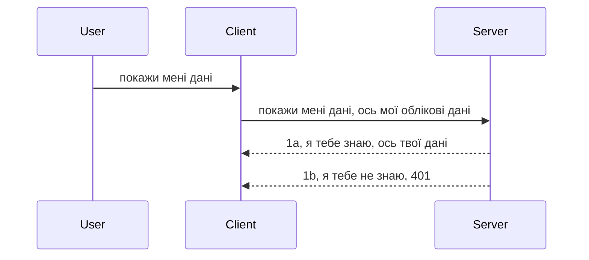

# Проста автентифікація

MCP SDK підтримують використання OAuth 2.1, що, чесно кажучи, є досить складним процесом, який включає такі концепції, як сервер автентифікації, сервер ресурсів, відправлення облікових даних, отримання коду, обмін коду на токен доступу, доки ви нарешті не отримаєте свої дані ресурсу. Якщо ви не звикли до OAuth, що є чудовою системою для впровадження, корисно почати з базового рівня автентифікації і поступово розвивати її до кращої безпеки. Саме для цього існує цей розділ — щоб поступово вивести вас до більш просунутої автентифікації.

## Автентифікація, що ми маємо на увазі?

Автентифікація — це скорочено від аутентифікації та авторизації. Ідея в тому, що нам потрібно зробити дві речі:

- **Аутентифікація**, що є процесом визначення, чи дозволяємо ми людині увійти до нашого будинку, чи має вона право бути "тут", тобто мати доступ до нашого серверу ресурсів, де розміщено функції сервера MCP.
- **Авторизація**, це процес визначення, чи користувач повинен мати доступ до конкретних ресурсів, які він запитує, наприклад, ці замовлення чи ці продукти, чи має право лише читати контент, але не видаляти, як інший приклад.

## Облікові дані: як ми повідомляємо системі, хто ми

Більшість веб-розробників звикли думати у термінах надання облікових даних серверу, зазвичай секрету, який підтверджує, що вони мають право тут бути ("Автентифікація"). Цей обліковий запис зазвичай представляє собою base64-кодовану версію імені користувача та пароля або API-ключ, що унікально ідентифікує конкретного користувача.

Це передається через заголовок "Authorization" ось так:

```json
{ "Authorization": "secret123" }
```

Зазвичай це називають базовою автентифікацією. Як працює загальний процес:


```mermaid
sequenceDiagram
   participant User
   participant Client
   participant Server

   User->>Client: покажи мені дані
   Client->>Server: покажи мені дані, ось мої облікові дані
   Server-->>Client: 1a, я тебе знаю, ось твої дані
   Server-->>Client: 1b, я тебе не знаю, 401 
```

Тепер, коли ми розуміємо, як це працює з точки зору процесу, як його реалізувати? Більшість веб-серверів мають поняття middleware — частину коду, яка виконується у запиті і може перевірити облікові дані, і якщо вони валідні — пропускає запит далі. Якщо облікові дані не валідні — виникає помилка автентифікації. Давайте подивимось, як це можна реалізувати:

**Python**

```python
class AuthMiddleware(BaseHTTPMiddleware):
    async def dispatch(self, request, call_next):

        has_header = request.headers.get("Authorization")
        if not has_header:
            print("-> Missing Authorization header!")
            return Response(status_code=401, content="Unauthorized")

        if not valid_token(has_header):
            print("-> Invalid token!")
            return Response(status_code=403, content="Forbidden")

        print("Valid token, proceeding...")
       
        response = await call_next(request)
        # додайте будь-які користувацькі заголовки або змініть відповідь якимось чином
        return response


starlette_app.add_middleware(CustomHeaderMiddleware)
```

Тут ми маємо:

- Створений middleware під назвою `AuthMiddleware`, у якого метод `dispatch` викликається веб-сервером.
- Middleware доданий до веб-сервера:

    ```python
    starlette_app.add_middleware(AuthMiddleware)
    ```

- Написана логіка перевірки, чи присутній заголовок Authorization та чи є секрет дійсним:

    ```python
    has_header = request.headers.get("Authorization")
    if not has_header:
        print("-> Missing Authorization header!")
        return Response(status_code=401, content="Unauthorized")

    if not valid_token(has_header):
        print("-> Invalid token!")
        return Response(status_code=403, content="Forbidden")
    ```

    якщо секрет присутній і валідний — ми пропускаємо запит, викликаючи `call_next` і повертаємо відповідь.

    ```python
    response = await call_next(request)
    # додати будь-які користувацькі заголовки або змінити відповідь якимось чином
    return response
    ```

Як працює: коли робиться веб-запит до сервера, викликається middleware і залежно від реалізації воно або пропускає запит, або повертає помилку, що клієнту не дозволено продовжувати.

**TypeScript**

Тут ми створюємо middleware у відомому фреймворку Express і перехоплюємо запит перед тим, як він потрапить до MCP Server. Ось код:

```typescript
function isValid(secret) {
    return secret === "secret123";
}

app.use((req, res, next) => {
    // 1. Заголовок авторизації присутній?
    if(!req.headers["Authorization"]) {
        res.status(401).send('Unauthorized');
    }
    
    let token = req.headers["Authorization"];

    // 2. Перевірте дійсність.
    if(!isValid(token)) {
        res.status(403).send('Forbidden');
    }

   
    console.log('Middleware executed');
    // 3. Передає запит до наступного етапу у конвеєрі запитів.
    next();
});
```

У цьому коді ми:

1. Перевіряємо, чи присутній заголовок Authorization, якщо ні — відправляємо помилку 401.
2. Перевіряємо, чи валідний токен/облікові дані, якщо ні — відправляємо помилку 403.
3. Нарешті пропускаємо запит у конвеєр запитів та повертаємо запитуваний ресурс.

## Вправа: реалізуйте автентифікацію

Візьмемо наші знання і спробуємо реалізувати. План такий:

Сервер

- Створити веб-сервер та екземпляр MCP.
- Реалізувати middleware для сервера.

Клієнт

- Надіслати веб-запит із обліковими даними у заголовку.

### -1- Створити веб-сервер та екземпляр MCP

> [!WARNING]
> Приклад TypeScript нижче орієнтований на MCP `2025-11-25`. Він відстежує транспорти
> за `mcp-session-id` і не є актуальним прикладом для `2026-07-28`. MCP
> `2026-07-28` прибирає handshake initialize і protocol session ID; нові
> імплементації використовують автономні запити. Докладніше можна прочитати в
> [What’s Changed in MCP: The 2026-07-28 Specification](../../01-CoreConcepts/mcp-2026-07-28.md).

На першому кроці потрібно створити екземпляр веб-сервера і MCP Server.

**Python**

Тут ми створюємо екземпляр MCP сервера, створюємо starlette веб-додаток і хостимо його за допомогою uvicorn.

```python
# створення MCP-сервера

app = FastMCP(
    name="MCP Resource Server",
    instructions="Resource Server that validates tokens via Authorization Server introspection",
    host=settings["host"],
    port=settings["port"],
    debug=True
)

# створення веб-додатку starlette
starlette_app = app.streamable_http_app()

# запуск додатку через uvicorn
async def run(starlette_app):
    import uvicorn
    config = uvicorn.Config(
            starlette_app,
            host=app.settings.host,
            port=app.settings.port,
            log_level=app.settings.log_level.lower(),
        )
    server = uvicorn.Server(config)
    await server.serve()

run(starlette_app)
```

У цьому коді ми:

- Створили MCP Server.
- Побудували starlette веб-додаток на основі MCP Server, `app.streamable_http_app()`.
- Хостинг і сервінг веб-додатку через uvicorn `server.serve()`.

**TypeScript**

Тут створюємо екземпляр MCP Server.

```typescript
const server = new McpServer({
      name: "example-server",
      version: "1.0.0"
    });

    // ... налаштувати ресурси сервера, інструменти та підказки ...
```

Створення MCP Server відбудеться всередині визначення маршруту POST /mcp, тому давайте візьмемо наведений код і помістимо його так:

```typescript
import express from "express";
import { randomUUID } from "node:crypto";
import { McpServer } from "@modelcontextprotocol/sdk/server/mcp.js";
import { StreamableHTTPServerTransport } from "@modelcontextprotocol/sdk/server/streamableHttp.js";
import { isInitializeRequest } from "@modelcontextprotocol/sdk/types.js"

const app = express();
app.use(express.json());

// Карта для збереження транспортів за ідентифікатором сесії
const transports: { [sessionId: string]: StreamableHTTPServerTransport } = {};

// Обробка POST-запитів для зв'язку клієнт-сервер
app.post('/mcp', async (req, res) => {
  // Перевірка наявності існуючого ідентифікатора сесії
  const sessionId = req.headers['mcp-session-id'] as string | undefined;
  let transport: StreamableHTTPServerTransport;

  if (sessionId && transports[sessionId]) {
    // Повторне використання існуючого транспорту
    transport = transports[sessionId];
  } else if (!sessionId && isInitializeRequest(req.body)) {
    // Новий запит на ініціалізацію
    transport = new StreamableHTTPServerTransport({
      sessionIdGenerator: () => randomUUID(),
      onsessioninitialized: (sessionId) => {
        // Збереження транспорту за ідентифікатором сесії
        transports[sessionId] = transport;
      },
      // Захист від DNS rebinding за замовчуванням вимкнено для зворотної сумісності. Якщо ви запускаєте цей сервер
      // локально, переконайтесь, що встановлено:
      // enableDnsRebindingProtection: true,
      // allowedHosts: ['127.0.0.1'],
    });

    // Очищення транспорту після закриття
    transport.onclose = () => {
      if (transport.sessionId) {
        delete transports[transport.sessionId];
      }
    };
    const server = new McpServer({
      name: "example-server",
      version: "1.0.0"
    });

    // ... налаштування серверних ресурсів, інструментів та підказок ...

    // Підключення до сервера MCP
    await server.connect(transport);
  } else {
    // Неправильний запит
    res.status(400).json({
      jsonrpc: '2.0',
      error: {
        code: -32000,
        message: 'Bad Request: No valid session ID provided',
      },
      id: null,
    });
    return;
  }

  // Обробити запит
  await transport.handleRequest(req, res, req.body);
});

// Повторно використовуваний обробник для GET та DELETE запитів
const handleSessionRequest = async (req: express.Request, res: express.Response) => {
  const sessionId = req.headers['mcp-session-id'] as string | undefined;
  if (!sessionId || !transports[sessionId]) {
    res.status(400).send('Invalid or missing session ID');
    return;
  }
  
  const transport = transports[sessionId];
  await transport.handleRequest(req, res);
};

// Обробка GET-запитів для повідомлень сервера клієнту через SSE
app.get('/mcp', handleSessionRequest);

// Обробка DELETE-запитів для завершення сесії
app.delete('/mcp', handleSessionRequest);

app.listen(3000);
```

Тепер ви бачите, що створення MCP Server переміщено всередину `app.post("/mcp")`.

Переходимо до наступного кроку — створення middleware для перевірки отриманих облікових даних.

### -2- Реалізувати middleware для сервера

Тепер переходимо до middleware. Тут ми створимо middleware, який шукатиме облікові дані в заголовку `Authorization` і перевірятиме їх. Якщо вони прийнятні — запит продовжить виконання необхідних дій (наприклад, перерахунок інструментів, читання ресурсу чи будь-який інший функціонал MCP, що запитує клієнт).

**Python**

Для створення middleware нам потрібно створити клас, який наслідується від `BaseHTTPMiddleware`. Є два важливі елементи:

- Запит `request`, з якого ми зчитуємо інформацію із заголовків.
- `call_next` — колбек, який потрібно викликати, якщо клієнт надіслав прийнятні облікові дані.

Спочатку обробимо випадок, якщо заголовок `Authorization` відсутній:

```python
has_header = request.headers.get("Authorization")

# заголовок відсутній, повернути помилку 401, інакше продовжити.
if not has_header:
    print("-> Missing Authorization header!")
    return Response(status_code=401, content="Unauthorized")
```

Тут ми відправляємо повідомлення 401 unauthorized, бо клієнт не пройшов автентифікацію.

Далі, якщо облікові дані були подані, треба перевірити їх дійсність так:

```python
 if not valid_token(has_header):
    print("-> Invalid token!")
    return Response(status_code=403, content="Forbidden")
```

Зверніть увагу, що тут відправляється повідомлення 403 forbidden. Бачимо повний middleware нижче, що реалізує все, що було описано вище:

```python
class AuthMiddleware(BaseHTTPMiddleware):
    async def dispatch(self, request, call_next):

        has_header = request.headers.get("Authorization")
        if not has_header:
            print("-> Missing Authorization header!")
            return Response(status_code=401, content="Unauthorized")

        if not valid_token(has_header):
            print("-> Invalid token!")
            return Response(status_code=403, content="Forbidden")

        print("Valid token, proceeding...")
        print(f"-> Received {request.method} {request.url}")
        response = await call_next(request)
        response.headers['Custom'] = 'Example'
        return response

```

Чудово, а що ж із функцією `valid_token`? Ось вона нижче:

```python
# НЕ використовуйте для продакшну - покращте це !!
def valid_token(token: str) -> bool:
    # видаліть префікс "Bearer "
    if token.startswith("Bearer "):
        token = token[7:]
        return token == "secret-token"
    return False
```

Звісно, це треба покращувати.

ВАЖЛИВО: Ніколи не тримайте секрети в коді. Ідеально отримувати значення для порівняння з джерела даних або від постачальника ідентичності (IDP), а ще краще, нехай саме IDP виконує валідацію.

**TypeScript**

Для реалізації з Express потрібно викликати метод `use`, який приймає middleware функції.

Нам потрібно:

- Взаємодіяти з об’єктом request, щоб перевірити передані облікові дані в полі `Authorization`.
- Перевірити облікові дані і, якщо вони валідні, пропустити запит далі, дозволяючи MCP-клієнту виконати його функції (наприклад, перелічити інструменти, прочитати ресурс тощо).

Тут ми перевіряємо, чи є заголовок `Authorization`, а якщо ні — зупиняємо запит:

```typescript
if(!req.headers["authorization"]) {
    res.status(401).send('Unauthorized');
    return;
}
```

Якщо заголовок відсутній, повертається 401.

Далі перевіряємо валідність облікових даних, якщо ні — теж припиняємо запит, але з повідомленням іншого коду:

```typescript
if(!isValid(token)) {
    res.status(403).send('Forbidden');
    return;
} 
```

Зверніть увагу, що тут приходить помилка 403.

Повний код тут:

```typescript
app.use((req, res, next) => {
    console.log('Request received:', req.method, req.url, req.headers);
    console.log('Headers:', req.headers["authorization"]);
    if(!req.headers["authorization"]) {
        res.status(401).send('Unauthorized');
        return;
    }
    
    let token = req.headers["authorization"];

    if(!isValid(token)) {
        res.status(403).send('Forbidden');
        return;
    }  

    console.log('Middleware executed');
    next();
});
```

Ми налаштували веб-сервер, щоб приймав middleware для перевірки облікових даних, які клієнт має надіслати. А як щодо самого клієнта?

### -3- Надіслати веб-запит з обліковими даними у заголовку

Потрібно переконатися, що клієнт надсилає облікові дані через заголовок. Оскільки ми будемо використовувати MCP клієнт, треба зрозуміти, як це зробити.

**Python**

Для клієнта треба передати заголовок з обліковими даними ось так:

```python
# НЕ жорстко кодуйте значення, зберігайте його принаймні у змінній середовища або в більш безпечному сховищі
token = "secret-token"

async with streamablehttp_client(
        url = f"http://localhost:{port}/mcp",
        headers = {"Authorization": f"Bearer {token}"}
    ) as (
        read_stream,
        write_stream,
        session_callback,
    ):
        async with ClientSession(
            read_stream,
            write_stream
        ) as session:
            await session.initialize()
      
            # TODO, що ви хочете зробити на клієнті, наприклад, перелічити інструменти, викликати інструменти тощо.
```

Зверніть увагу, що ми заповнюємо властивість `headers` так: ` headers = {"Authorization": f"Bearer {token}"}`.

**TypeScript**

Можемо це зробити у два кроки:

1. Заповнити об’єкт конфігурації нашим обліковим даним.
2. Передати об’єкт конфігурації до транспорту.

```typescript

// НЕ жорстко кодуйте значення, як показано тут. Принаймні зробіть його змінною середовища і використовуйте щось на кшталт dotenv (у режимі розробки).
let token = "secret123"

// визначте об'єкт параметрів транспорту клієнта
let options: StreamableHTTPClientTransportOptions = {
  sessionId: sessionId,
  requestInit: {
    headers: {
      "Authorization": "secret123"
    }
  }
};

// передайте об'єкт параметрів до транспорту
async function main() {
   const transport = new StreamableHTTPClientTransport(
      new URL(serverUrl),
      options
   );
```

Тут видно, що створили об’єкт `options` і помістили заголовки у властивість `requestInit`.

ВАЖЛИВО: Як це покращити? Нинішня реалізація має проблеми. По-перше, передача облікових даних таким способом досить ризикована, якщо немає хоча б HTTPS. Навіть тоді цей секрет може бути вкрадений, тому потрібна система, в якій можна легко відкликати токен і додати додаткові перевірки, наприклад, звідки у світі він походить, чи не надсилається занадто часто запит (ботоподібна поведінка), загалом багато питань.

Проте, для дуже простих API, де не хочете дозволити виклики без автентифікації, це хороший початок.

Тож давайте посилимо безпеку, використовуючи стандартизований формат, як JSON Web Token, також відомий як JWT або "JOT" токени.

## JSON Web Tokens, JWT

Отже, ми прагнемо покращити ситуацію, замінивши прості облікові дані на токени JWT. Які негайні покращення дає впровадження JWT?

- **Покращення безпеки**. У базовій автентифікації ви постійно надсилаєте ім’я користувача і пароль у base64 або API ключ, що збільшує ризики. З JWT ви спочатку надсилаєте ім’я користувача і пароль і отримуєте токен, який має термін придатності. JWT дозволяє легко застосовувати гнучкий контроль доступу через ролі, області дії та дозволи.
- **Відсутність стану і масштабованість**. JWT є автономними, вони несуть всю інформацію про користувача і усувають необхідність зберігати сесії на сервері. Токен можна валідовувати локально.
- **Міжоперабельність і федерація**. JWT є основою для Open ID Connect і використовується з відомими провайдерами ідентичності, як Entra ID, Google Identity та Auth0. Також дозволяє впроваджувати єдиний вхід і багато іншого на корпоративному рівні.
- **Модульність і гнучкість**. JWT також підтримується API Gateway, як Azure API Management, NGINX тощо. Підтримує сценарії аутентифікації користувача та сервісів, включно з делегуванням і імітацією.
- **Продуктивність і кешування**. JWT можна кешувати після декодування, що знижує потребу у парсингу. Це допомагає при великому трафіку, підвищуючи пропускну здатність і знижуючи навантаження на інфраструктуру.
- **Розширені можливості**. Підтримує інспекцію (перевірка валідності на сервері) та відкликання (робить токен недійсним).

З усіма цими перевагами подивимось, як підняти нашу реалізацію на наступний рівень.

## Переведення базової автентифікації в JWT

Основні зміни, які нам слід зробити:

- **Навчитися створювати JWT токен** і підготувати його для передачі від клієнта до сервера.
- **Валідувати JWT токен** і, якщо він валідний, дозволити клієнту отримувати ресурси.
- **Безпечне зберігання токенів**. Як зберігати токен.
- **Захист маршрутів**. Потрібно захистити маршрути, у нашому випадку маршрути та конкретні функції MCP.
- **Додати токени оновлення (refresh tokens)**. Створювати короткоживучі токени із довгоживучими refresh токенами, що дозволяють отримати нові, якщо основні токени сплили. Також забезпечити endpoint оновлення та стратегію ротації.

### -1- Створення JWT токена

По-перше, JWT токен складається з частин:

- **header** — заголовок, алгоритм і тип токена.
- **payload** — відомості, як sub (користувач або сутність, яку представляє токен; у сценарії автентифікації це зазвичай user id), exp (час закінчення дії), role (роль).
- **signature** — підпис, створений секретом або приватним ключем.

Для цього треба зібрати header, payload та отримати закодований токен.

**Python**

```python

import jwt
import jwt
from jwt.exceptions import ExpiredSignatureError, InvalidTokenError
import datetime

# Секретний ключ, який використовується для підпису JWT
secret_key = 'your-secret-key'

header = {
    "alg": "HS256",
    "typ": "JWT"
}

# інформація про користувача та його права й час закінчення терміну дії
payload = {
    "sub": "1234567890",               # Тема (ID користувача)
    "name": "User Userson",                # Користувацьке твердження
    "admin": True,                     # Користувацьке твердження
    "iat": datetime.datetime.utcnow(),# Час видачі
    "exp": datetime.datetime.utcnow() + datetime.timedelta(hours=1)  # Час закінчення дії
}

# зашифрувати його
encoded_jwt = jwt.encode(payload, secret_key, algorithm="HS256", headers=header)
```

У наведеному коді ми:

- Визначили заголовок з алгоритмом HS256 і типом JWT.
- Створили payload, який містить subject або user id, ім’я користувача, роль, час видачі і час закінчення дії, реалізуючи тим самим аспект обмеженого терміну дії.

**TypeScript**

Тут нам знадобляться залежності, що допоможуть створити JWT токен.

Залежності

```sh

npm install jsonwebtoken
npm install --save-dev @types/jsonwebtoken
```

Тепер, коли це є, створимо заголовок, payload і через них отримаємо закодований токен.

```typescript
import jwt from 'jsonwebtoken';

const secretKey = 'your-secret-key'; // Використовуйте змінні оточення у виробничому середовищі

// Визначте навантаження
const payload = {
  sub: '1234567890',
  name: 'User usersson',
  admin: true,
  iat: Math.floor(Date.now() / 1000), // Видався о
  exp: Math.floor(Date.now() / 1000) + 60 * 60 // Термін дії 1 година
};

// Визначте заголовок (необов’язково, jsonwebtoken встановлює за замовчуванням)
const header = {
  alg: 'HS256',
  typ: 'JWT'
};

// Створіть токен
const token = jwt.sign(payload, secretKey, {
  algorithm: 'HS256',
  header: header
});

console.log('JWT:', token);
```

Цей токен:

Підписаний за допомогою HS256
Дійсний протягом 1 години
Містить claims, як sub, name, admin, iat та exp.

### -2- Валідація токена

Також нам треба валідовувати токен на сервері, щоб переконатися, що те, що надсилає клієнт, справді валідне. Тут треба зробити багато перевірок — від структури до валідності. Ви також повинні додати інші перевірки, наприклад, чи є користувач у вашій системі тощо.

Для валідації токена потрібно його декодувати, щоб прочитати, і почати перевірки:

**Python**

```python

# Розкодувати та перевірити JWT
try:
    decoded = jwt.decode(token, secret_key, algorithms=["HS256"])
    print("✅ Token is valid.")
    print("Decoded claims:")
    for key, value in decoded.items():
        print(f"  {key}: {value}")
except ExpiredSignatureError:
    print("❌ Token has expired.")
except InvalidTokenError as e:
    print(f"❌ Invalid token: {e}")

```


У цьому коді ми викликаємо `jwt.decode`, використовуючи токен, секретний ключ і вибраний алгоритм як вхідні дані. Зверніть увагу, що ми використовуємо конструкцію try-catch, оскільки помилка при валідації призводить до виникнення помилки.

**TypeScript**

Тут нам потрібно викликати `jwt.verify`, щоб отримати декодовану версію токена, яку ми можемо подальше проаналізувати. Якщо цей виклик не вдається, це означає, що структура токена неправильна або він більше не дійсний.

```typescript

try {
  const decoded = jwt.verify(token, secretKey);
  console.log('Decoded Payload:', decoded);
} catch (err) {
  console.error('Token verification failed:', err);
}
```

ПРИМІТКА: як згадувалося раніше, ми повинні виконати додаткові перевірки, щоб переконатися, що цей токен вказує на користувача в нашій системі і упевнитися, що користувач має ті права, які він заявляє.

Тепер подивимося на контроль доступу на основі ролей, також відомий як RBAC.

## Додавання контролю доступу на основі ролей

Ідея полягає в тому, що ми хочемо виразити, що різні ролі мають різні дозволи. Наприклад, ми припускаємо, що адміністратор може робити все, звичайний користувач може читати/записувати, а гість може тільки читати. Отже, ось деякі можливі рівні дозволів:

- Admin.Write 
- User.Read
- Guest.Read

Подивимось, як ми можемо реалізувати такий контроль за допомогою проміжного програмного забезпечення (middleware). Middleware можна додавати для кожного маршруту окремо, а також для всіх маршрутів.

**Python**

```python
from starlette.middleware.base import BaseHTTPMiddleware
from starlette.responses import JSONResponse
import jwt

# НЕ тримайте секрет у коді, це лише для демонстраційних цілей. Зчитайте його з безпечного місця.
SECRET_KEY = "your-secret-key" # помістіть це у змінну оточення
REQUIRED_PERMISSION = "User.Read"

class JWTPermissionMiddleware(BaseHTTPMiddleware):
    async def dispatch(self, request, call_next):
        auth_header = request.headers.get("Authorization")
        if not auth_header or not auth_header.startswith("Bearer "):
            return JSONResponse({"error": "Missing or invalid Authorization header"}, status_code=401)

        token = auth_header.split(" ")[1]
        try:
            decoded = jwt.decode(token, SECRET_KEY, algorithms=["HS256"])
        except jwt.ExpiredSignatureError:
            return JSONResponse({"error": "Token expired"}, status_code=401)
        except jwt.InvalidTokenError:
            return JSONResponse({"error": "Invalid token"}, status_code=401)

        permissions = decoded.get("permissions", [])
        if REQUIRED_PERMISSION not in permissions:
            return JSONResponse({"error": "Permission denied"}, status_code=403)

        request.state.user = decoded
        return await call_next(request)


```

Існує кілька способів додати middleware, як показано нижче:

```python

# Альт 1: додати проміжне програмне забезпечення під час створення додатку starlette
middleware = [
    Middleware(JWTPermissionMiddleware)
]

app = Starlette(routes=routes, middleware=middleware)

# Альт 2: додати проміжне програмне забезпечення після того, як додаток starlette вже створено
starlette_app.add_middleware(JWTPermissionMiddleware)

# Альт 3: додати проміжне програмне забезпечення для кожного маршруту
routes = [
    Route(
        "/mcp",
        endpoint=..., # обробник
        middleware=[Middleware(JWTPermissionMiddleware)]
    )
]
```

**TypeScript**

Ми можемо використати `app.use` і middleware, яке виконуватиметься для всіх запитів.

```typescript
app.use((req, res, next) => {
    console.log('Request received:', req.method, req.url, req.headers);
    console.log('Headers:', req.headers["authorization"]);

    // 1. Перевірте, чи було надіслано заголовок авторизації

    if(!req.headers["authorization"]) {
        res.status(401).send('Unauthorized');
        return;
    }
    
    let token = req.headers["authorization"];

    // 2. Перевірте, чи є токен дійсним
    if(!isValid(token)) {
        res.status(403).send('Forbidden');
        return;
    }  

    // 3. Перевірте, чи існує користувач токена в нашій системі
    if(!isExistingUser(token)) {
        res.status(403).send('Forbidden');
        console.log("User does not exist");
        return;
    }
    console.log("User exists");

    // 4. Перевірте, чи має токен правильні дозволи
    if(!hasScopes(token, ["User.Read"])){
        res.status(403).send('Forbidden - insufficient scopes');
    }

    console.log("User has required scopes");

    console.log('Middleware executed');
    next();
});

```

Є кілька речей, які ми можемо дозволити нашому middleware робити, і які middleware ПОВИНЕН робити, а саме:

1. Перевірити, чи є заголовок авторизації присутнім.
2. Перевірити, чи токен дійсний, ми викликаємо `isValid`, який є методом, що перевіряє цілісність та дійсність JWT токена.
3. Перевірити, чи користувач існує в нашій системі — це потрібно обов’язково.

   ```typescript
    // користувачі в БД
   const users = [
     "user1",
     "User usersson",
   ]

   function isExistingUser(token) {
     let decodedToken = verifyToken(token);

     // TODO, перевірити, чи існує користувач у БД
     return users.includes(decodedToken?.name || "");
   }
   ```

   Вище ми створили дуже простий список `users`, який, звичайно, повинен бути у базі даних.

4. Крім того, ми повинні перевірити, чи токен має правильні дозволи.

   ```typescript
   if(!hasScopes(token, ["User.Read"])){
        res.status(403).send('Forbidden - insufficient scopes');
   }
   ```

   У наведеному вище коді middleware ми перевіряємо, що токен містить дозвіл User.Read, якщо ні — надсилаємо помилку 403. Нижче наведено допоміжний метод `hasScopes`.

   ```typescript
   function hasScopes(scope: string, requiredScopes: string[]) {
     let decodedToken = verifyToken(scope);
    return requiredScopes.every(scope => decodedToken?.scopes.includes(scope));
  }
   ```

Have a think which additional checks you should be doing, but these are the absolute minimum of checks you should be doing.

Using Express as a web framework is a common choice. There are helpers library when you use JWT so you can write less code.

- `express-jwt`, helper library that provides a middleware that helps decode your token.
- `express-jwt-permissions`, this provides a middleware `guard` that helps check if a certain permission is on the token.

Here's what these libraries can look like when used:

```typescript
const express = require('express');
const jwt = require('express-jwt');
const guard = require('express-jwt-permissions')();

const app = express();
const secretKey = 'your-secret-key'; // put this in env variable

// Decode JWT and attach to req.user
app.use(jwt({ secret: secretKey, algorithms: ['HS256'] }));

// Check for User.Read permission
app.use(guard.check('User.Read'));

// multiple permissions
// app.use(guard.check(['User.Read', 'Admin.Access']));

app.get('/protected', (req, res) => {
  res.json({ message: `Welcome ${req.user.name}` });
});

// Error handler
app.use((err, req, res, next) => {
  if (err.code === 'permission_denied') {
    return res.status(403).send('Forbidden');
  }
  next(err);
});

```

Тепер ви побачили, як middleware можна використовувати для автентифікації та авторизації, але як щодо MCP? Чи змінює це спосіб авторизації? Давайте дізнаємося в наступному розділі.

### -3- Додати RBAC до MCP

Ви вже бачили, як можна додати RBAC через middleware, проте для MCP немає простого способу додати RBAC на рівні окремої функції MCP, тож що нам робити? Ми просто додаємо код, який перевіряє у цьому випадку, чи клієнт має права викликати певний інструмент:

У вас є кілька різних варіантів, як реалізувати RBAC на рівні функцій, ось деякі:

- Додати перевірку для кожного інструменту, ресурсу, запиту, де потрібно перевіряти рівень дозволів.

   **python**

   ```python
   @tool()
   def delete_product(id: int):
      try:
          check_permissions(role="Admin.Write", request)
      catch:
        pass # клієнт не пройшов авторизацію, викликати помилку авторизації
   ```

   **typescript**

   ```typescript
   server.registerTool(
    "delete-product",
    {
      title: Delete a product",
      description: "Deletes a product",
      inputSchema: { id: z.number() }
    },
    async ({ id }) => {
      
      try {
        checkPermissions("Admin.Write", request);
        // todo, надіслати id до productService і віддаленого входу
      } catch(Exception e) {
        console.log("Authorization error, you're not allowed");  
      }

      return {
        content: [{ type: "text", text: `Deletected product with id ${id}` }]
      };
    }
   );
   ```


- Використати більш просунутий серверний підхід і обробники запитів, щоб мінімізувати кількість місць, де потрібно робити перевірку.

   **Python**

   ```python
   
   tool_permission = {
      "create_product": ["User.Write", "Admin.Write"],
      "delete_product": ["Admin.Write"]
   }

   def has_permission(user_permissions, required_permissions) -> bool:
      # user_permissions: список дозволів, які має користувач
      # required_permissions: список дозволів, необхідних для інструменту
      return any(perm in user_permissions for perm in required_permissions)

   @server.call_tool()
   async def handle_call_tool(
     name: str, arguments: dict[str, str] | None
   ) -> list[types.TextContent]:
    # Припустимо, request.user.permissions — це список дозволів користувача
     user_permissions = request.user.permissions
     required_permissions = tool_permission.get(name, [])
     if not has_permission(user_permissions, required_permissions):
        # Викинути помилку "У вас немає дозволу на виклик інструменту {name}"
        raise Exception(f"You don't have permission to call tool {name}")
     # продовжити і викликати інструмент
     # ...
   ```   
   

   **TypeScript**

   ```typescript
   function hasPermission(userPermissions: string[], requiredPermissions: string[]): boolean {
       if (!Array.isArray(userPermissions) || !Array.isArray(requiredPermissions)) return false;
       // Повернути true, якщо користувач має принаймні один необхідний дозвіл
       
       return requiredPermissions.some(perm => userPermissions.includes(perm));
   }
  
   server.setRequestHandler(CallToolRequestSchema, async (request) => {
      const { params: { name } } = request;
  
      let permissions = request.user.permissions;
  
      if (!hasPermission(permissions, toolPermissions[name])) {
         return new Error(`You don't have permission to call ${name}`);
      }
  
      // продовжуй..
   });
   ```

   Зверніть увагу, що вам потрібно переконатися, що ваш middleware призначає декодований токен властивості user запиту, щоб код вище був простим.

### Підсумок

Тепер, коли ми обговорили, як додати підтримку RBAC загалом і для MCP зокрема, настав час спробувати реалізувати безпеку самостійно, щоб переконатися, що ви зрозуміли представлені концепції.

## Завдання 1: Побудувати mcp сервер і mcp клієнт за допомогою базової автентифікації

Тут ви застосуєте те, що вивчили про передачу облікових даних через заголовки.

## Рішення 1

[Solution 1](./code/basic/README.md)

## Завдання 2: Оновлення рішення з завдання 1 для використання JWT

Візьміть перше рішення, але цього разу покращимо його.

Замість Basic Auth використаємо JWT.

## Рішення 2

[Solution 2](./solution/jwt-solution/README.md)

## Виклик

Додайте RBAC на рівні інструментів, як описано в розділі "Додати RBAC до MCP".

## Підсумок

Сподіваюсь, ви багато чого дізналися в цьому розділі: від відсутності безпеки взагалі, до базової безпеки, до JWT і як його можна додати до MCP.

Ми побудували надійну основу з власними JWT, але у міру розширення ми рухаємось до стандартної моделі ідентичності. Використання IdP як Entra або Keycloak дозволяє доручити видачу, перевірку і керування життєвим циклом токенів надійній платформі — звільняючи нас для фокусування на логіці додатка та досвіді користувача.

Для цього у нас є більш [поглиблений розділ про Entra](../../05-AdvancedTopics/mcp-security-entra/README.md)

## Що далі

- Далі: [Налаштування MCP хостів](../12-mcp-hosts/README.md)

---

<!-- CO-OP TRANSLATOR DISCLAIMER START -->
**Відмова від відповідальності**:
Цей документ було перекладено за допомогою сервісу штучного інтелекту для перекладу [Co-op Translator](https://github.com/Azure/co-op-translator). Хоча ми прагнемо до точності, будь ласка, майте на увазі, що автоматичні переклади можуть містити помилки або неточності. Оригінальний документ рідною мовою слід вважати авторитетним джерелом. Для критично важливої інформації рекомендується професійний людський переклад. Ми не несемо відповідальності за будь-які непорозуміння або неправильні тлумачення, що виникли внаслідок використання цього перекладу.
<!-- CO-OP TRANSLATOR DISCLAIMER END -->