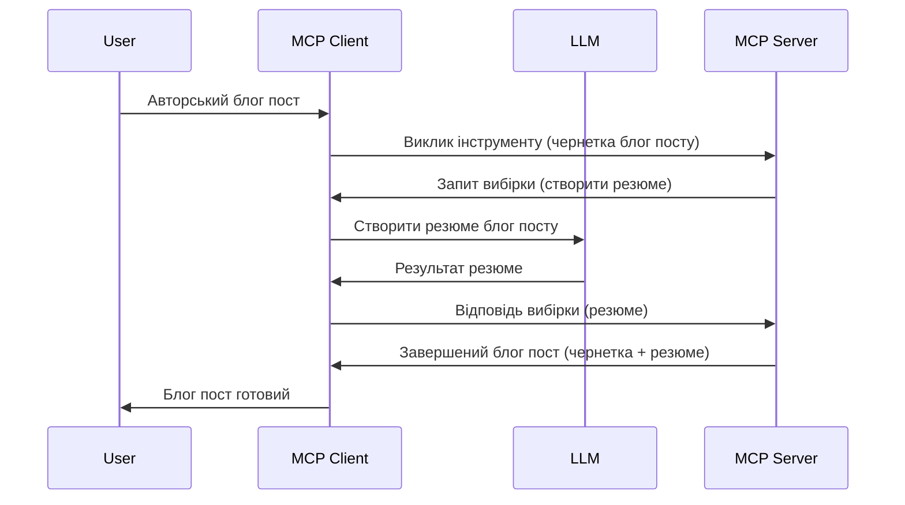

> [!WARNING]
> Вибірковість (Sampling) застаріла в MCP `2026-07-28`. Цей урок збережено для
> спадкових реалізацій. Нові сервери повинні інтегруватися безпосередньо з API
> постачальника LLM.

# Вибірковість – делегування функцій клієнту

> Вибірковість залишається в специфікації `2026-07-28` для сумісності та може бути
> вилучена в першій ревізії, випущеній 28 липня 2027 року або пізніше.
> Приклади в цьому уроці можуть використовувати SDK API, що реалізують `2025-11-25`.
> Дивіться [Що змінилося в MCP: Специфікація 2026-07-28](../../01-CoreConcepts/mcp-2026-07-28.md).

У спадкових реалізаціях вибірковість дозволяє серверу MCP запросити допомогу у LLM,
керованого клієнтом. У нових реалізаціях слід звертатися безпосередньо до обраного
постачальника LLM.

Давайте розглянемо деякі випадки використання та як побудувати рішення з вибірковістю.

## Огляд

У цьому уроці ми зосередимось на поясненні, коли і де використовувати вибірковість та як її налаштувати.

## Цілі навчання

У цій главі ми:

- Пояснимо, що таке вибірковість і коли її використовувати.
- Покажемо, як налаштувати вибірковість у MCP.
- Надамо приклади застосування вибірковості.

## Що таке вибірковість і навіщо її використовувати?

Вибірковість — це розширена функція, яка працює таким чином:



### Запит вибірковості

Отже, тепер у нас є загальна картина правдоподібного сценарію, давайте поговоримо про запит вибірковості, який сервер надсилає клієнту. Ось як такий запит може виглядати у форматі JSON-RPC:

```json
{
  "jsonrpc": "2.0",
  "id": 1,
  "method": "sampling/createMessage",
  "params": {
    "messages": [
      {
        "role": "user",
        "content": {
          "type": "text",
          "text": "Create a blog post summary of the following blog post: <BLOG POST>"
        }
      }
    ],
    "modelPreferences": {
      "hints": [
        {
          "name": "claude-3-sonnet"
        }
      ],
      "intelligencePriority": 0.8,
      "speedPriority": 0.5
    },
    "systemPrompt": "You are a helpful assistant.",
    "maxTokens": 100
  }
}
```

Є кілька моментів, на які варто звернути увагу:

- Запит, у полі content -> text, — це наш запит, інструкція для LLM узагальнити зміст блогу.

- **modelPreferences**. Цей розділ — це просто переваги, рекомендації щодо конфігурації з LLM. Користувач може вибирати, чи слід дотримуватися цих рекомендацій або змінити їх. У цьому випадку є рекомендації щодо моделі, швидкості та пріоритету інтелекту.
- **systemPrompt**, це звичайний системний запит, який надає вашому LLM особистість і містить інструкції.
- **maxTokens**, це ще одна властивість, що вказує, скільки токенів рекомендується використовувати для цього завдання.

### Відповідь на вибірковість

Ця відповідь — це те, що клієнт MCP в кінцевому підсумку надсилає назад серверу MCP, результат виклику LLM клієнтом, очікування відповіді і побудови цього повідомлення. Ось як це може виглядати у форматі JSON-RPC:

```json
{
  "jsonrpc": "2.0",
  "id": 1,
  "result": {
    "role": "assistant",
    "content": {
      "type": "text",
      "text": "Here's your abstract <ABSTRACT>"
    },
    "model": "gpt-5",
    "stopReason": "endTurn"
  }
}
```

Зверніть увагу, що відповідь є анотацією блогу, як ми й просили. Також зверніть увагу, що використана модель — не та, яку ми вказали, а "gpt-5" замість "claude-3-sonnet". Це ілюструє, що користувач може змінити думку щодо використання, а ваш запит вибірковості — це рекомендація.

Отже, тепер, коли ми зрозуміли основний потік і корисне завдання, для якого можна використовувати це – «створення блогу + анотація», давайте подивимося, що потрібно зробити, щоб це запрацювало.

### Типи повідомлень

Повідомлення вибірковості не обмежуються лише текстом, але також можна надсилати зображення та аудіо. Ось як JSON-RPC виглядає інакше:

**Текст**

```json
{
  "type": "text",
  "text": "The message content"
}
```

**Вміст зображення**


```json
{
  "type": "image",
  "data": "base64-encoded-image-data",
  "mimeType": "image/jpeg"
}
```

**Аудіоконтент**

```json
{
  "type": "audio",
  "data": "base64-encoded-audio-data",
  "mimeType": "audio/wav"
}
```

> ПРОРИДЖЕННЯ: Для поточного статусу та інструкцій щодо міграції дивіться
> [застарілу документацію з вибірковості](https://modelcontextprotocol.io/specification/2026-07-28/client/sampling).

## Як налаштувати вибірковість у клієнті

> Примітка: якщо ви створюєте лише сервер, тут робити багато не потрібно.

У клієнті потрібно визначити таку функцію:

```json
{
  "capabilities": {
    "sampling": {}
  }
}
```

Це буде враховано під час ініціалізації вашого клієнта з сервером.

## Приклад роботи вибірковості - створення допису в блог

Давайте разом напишемо сервер вибірковості, нам потрібно зробити таке:

1. Створити інструмент на сервері.
1. Цей інструмент повинен створити запит вибірковості.
1. Інструмент повинен чекати відповіді на запит вибірковості від клієнта.
1. Потім має бути створений результат інструменту.

Розглянемо код крок за кроком:

### -1- Створення інструменту

**python**

```python
@mcp.tool()
async def create_blog(title: str, content: str, ctx: Context[ServerSession, None]) -> str:
    """Create a blog post and generate a summary"""

```

### -2- Створення запиту вибірковості

Розширте ваш інструмент таким кодом:

**python**

```python
post = BlogPost(
        id=len(posts) + 1,
        title=title,
        content=content,
        abstract=""
    )

prompt = f"Create an abstract of the following blog post: title: {title} and draft: {content} "

result = await ctx.session.create_message(
        messages=[
            SamplingMessage(
                role="user",
                content=TextContent(type="text", text=prompt),
            )
        ],
        max_tokens=100,
)

```

### -3- Очікування відповіді та повернення відповіді

**python**

```python
post.abstract = result.content.text

posts.append(post)

# повернути повний продукт
return json.dumps({
    "id": post.title,
    "abstract": post.abstract
})
```

### -4- Повний код

**python**

```python
from starlette.applications import Starlette
from starlette.routing import Mount, Host

from mcp.server.fastmcp import Context, FastMCP

from mcp.server.session import ServerSession
from mcp.types import SamplingMessage, TextContent

import json


from uuid import uuid4
from typing import List
from pydantic import BaseModel


mcp = FastMCP("Blog post generator")

# app = FastAPI()

posts = []

class BlogPost(BaseModel):
    id: int
    title: str
    content: str
    abstract: str

posts: List[BlogPost] = []

@mcp.tool()
async def create_blog(title: str, content: str, ctx: Context[ServerSession, None]) -> str:
    """Create a blog post and generate a summary"""

    post = BlogPost(
        id=len(posts) + 1,
        title=title,
        content=content,
        abstract=""
    )

    prompt = f"Create an abstract of the following blog post: title: {title} and draft: {content} "

    result = await ctx.session.create_message(
        messages=[
            SamplingMessage(
                role="user",
                content=TextContent(type="text", text=prompt),
            )
        ],
        max_tokens=100,
    )

    post.abstract = result.content.text

    posts.append(post)

    # повернути повний допис блогу
    return json.dumps({
        "id": post.title,
        "abstract": post.abstract
    })

if __name__ == "__main__":
    print("Starting server...")
    # mcp.run()
    mcp.run(transport="streamable-http")

# запускати додаток за допомогою: python server.py
```

### -5- Тестування у Visual Studio Code

Для тестування у Visual Studio Code зробіть так:

1. Запустіть сервер у терміналі
1. Додайте його у *mcp.json* (і переконайтесь, що він запущений), наприклад так:

   ```json
   "servers": {
      "blog-server": {
        "type": "http",
        "url": "http://localhost:8000/mcp"
      }
   }
   ```

1. Введіть запит:

   ```text
   create a blog post named "Where Python comes from", the content is "Python is actually named after Monty Python Flying Circus"
   ```

1. Дозвольте виконання вибірковості. Під час першого тесту з’явиться додатковий діалог, який потрібно буде підтвердити, потім ви побачите звичайний діалог для запуску інструменту.

1. Перевірте результати. Результати будуть гарно відображені в GitHub Copilot Chat, а також можна переглянути сирий JSON-відповідь.

**Бонус**. Інструменти Visual Studio Code мають чудову підтримку вибірковості. Ви можете налаштувати доступ до вибірковості на вашому встановленому сервері, перейшовши до нього так:

1. Перейдіть до розділу розширень.
1. Виберіть значок шестерні для вашого встановленого сервера в розділі "MCP SERVERS - INSTALLED".
1 Виберіть "Configure Model Access", тут можна налаштувати, які моделі GitHub Copilot може використовувати під час вибірковості. Також тут можна побачити останні запити вибірковості, вибравши "Show Sampling requests".

## Завдання

У цьому завданні ви створите трохи іншу вибірковість — інтеграцію вибірковості, яка підтримує генерацію опису продукту. Ось ваш сценарій:

**Сценарій**: співробітник бекофісу в e-commerce потребує допомоги, адже генерувати описи продуктів забирає занадто багато часу. Отже, вам потрібно створити рішення, де можна викликати інструмент "create_product" з аргументами "title" та "keywords", який має створювати повний продукт, у тому числі поле "description", що має заповнюватися LLM клієнта.

ПОРАДА: використовуйте те, що вивчили раніше, щоб побудувати цей сервер та його інструмент, використовуючи запит вибірковості.

## Розв’язок

[Solution](./solution/README.md)

## Основні висновки


Вибірка — це потужна функція, яка дозволяє серверу делегувати завдання клієнту, коли йому потрібна допомога LLM.

## Що далі

- [Розділ 4 - Практична реалізація](../../04-PracticalImplementation/README.md)

---

<!-- CO-OP TRANSLATOR DISCLAIMER START -->
**Відмова від відповідальності**:
Цей документ було перекладено за допомогою сервісу штучного інтелекту для перекладу [Co-op Translator](https://github.com/Azure/co-op-translator). Хоча ми прагнемо до точності, будь ласка, майте на увазі, що автоматичні переклади можуть містити помилки або неточності. Оригінальний документ рідною мовою слід вважати авторитетним джерелом. Для критично важливої інформації рекомендується професійний людський переклад. Ми не несемо відповідальності за будь-які непорозуміння або неправильні тлумачення, що виникли внаслідок використання цього перекладу.
<!-- CO-OP TRANSLATOR DISCLAIMER END -->