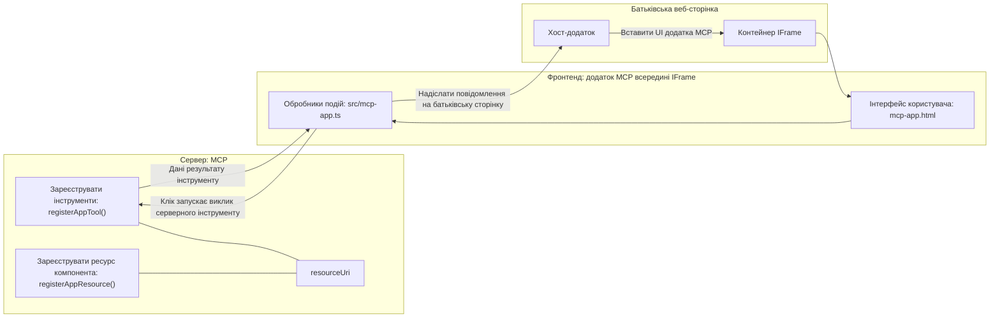
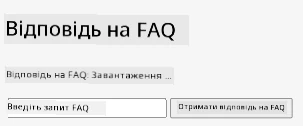
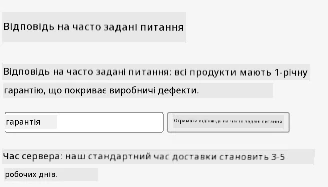
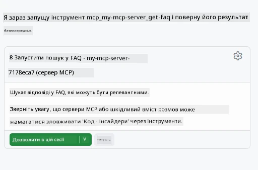
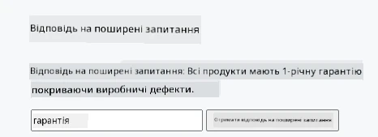

# MCP Apps

MCP Apps — це нова парадигма в MCP. Ідея полягає в тому, що ви не просто повертаєте дані у відповіді від виклику інструменту, а також надаєте інформацію про те, як з цією інформацією слід взаємодіяти. Це означає, що результати інструментів тепер можуть містити інформацію про користувацький інтерфейс. Навіщо це потрібно? Розгляньте, як ви зараз працюєте. Ви, ймовірно, отримуєте результати MCP Server, розміщуючи спереду якийсь фронтенд, тобто код, який потрібно писати і підтримувати. Іноді це те, що ви хочете, але іноді було б чудово просто підключити фрагмент інформації, який є автономним і містить все — від даних до користувацького інтерфейсу.

## Огляд

Цей урок містить практичні рекомендації щодо MCP Apps, як почати роботу з ними і як інтегрувати їх у ваші існуючі веб-додатки. MCP Apps — це дуже нове доповнення до стандарту MCP.

## Цілі навчання

До кінця цього уроку ви зможете:

- Пояснити, що таке MCP Apps.
- Коли слід використовувати MCP Apps.
- Створювати і інтегрувати власні MCP Apps.

## MCP Apps - як це працює

Ідея MCP Apps полягає в наданні у відповіді компонента, який фактично виводиться. Такий компонент може мати як візуальні елементи, так і інтерактивність, наприклад натискання кнопок, введення користувачем та інше. Розпочнемо з серверної частини та нашого MCP Server. Щоб створити компонент MCP App, потрібно створити інструмент і ресурс застосунку. Ці дві частини пов’язуються через resourceUri.

Ось приклад. Спробуємо візуалізувати, що включає процес і яка частина за що відповідає:

```text
server.ts -- responsible for registering tools and the component as a UI component
src/
  mcp-app.ts -- wiring up event handlers
mcp-app.html -- the user interface
```

Ця схема описує архітектуру створення компонента та його логіки.


Далі спробуємо описати обов’язки бекенду і фронтенду відповідно.

### Бекенд

Тут нам потрібно зробити дві речі:

- Зареєструвати інструменти, з якими хочемо взаємодіяти.
- Визначити компонент.

**Реєстрація інструменту**

```typescript
registerAppTool(
    server,
    "get-time",
    {
      title: "Get Time",
      description: "Returns the current server time.",
      inputSchema: {},
      _meta: { ui: { resourceUri } }, // Пов’язує цей інструмент з його ресурсом інтерфейсу користувача
    },
    async () => {
      const time = new Date().toISOString();
      return { content: [{ type: "text", text: time }] };
    },
  );

```

Попередній код описує поведінку, де розкривається інструмент з ім’ям `get-time`. Він не приймає вхідних параметрів, але повертає поточний час. Ми маємо можливість визначити `inputSchema` для інструментів, коли потрібно приймати введення користувача.

**Реєстрація компонента**

В тому ж файлі нам потрібно також зареєструвати компонент:

```typescript
const resourceUri = "ui://get-time/mcp-app.html";

// Зареєструвати ресурс, який повертає упакований HTML/JavaScript для інтерфейсу користувача.
registerAppResource(
  server,
  resourceUri,
  resourceUri,
  { mimeType: RESOURCE_MIME_TYPE },
  async () => {
    const html = await fs.readFile(path.join(DIST_DIR, "mcp-app.html"), "utf-8");

    return {
    contents: [
        { uri: resourceUri, mimeType: RESOURCE_MIME_TYPE, text: html },
    ],
    };
  },
);
```

Зверніть увагу, що ми вказуємо `resourceUri`, щоб з’єднати компонент зі своїми інструментами. Також важливий callback, де ми завантажуємо UI файл і повертаємо компонент.

### Фронтенд компонента

Як і бекенд, тут дві частини:

- Фронтенд, написаний чистим HTML.
- Код, що обробляє події і визначає, що робити, наприклад, викликати інструменти або відправляти повідомлення батьківському вікну.

**Інтерфейс користувача**

Давайте подивимось на користувацький інтерфейс.

```html
<!-- mcp-app.html -->
<!DOCTYPE html>
<html lang="en">
  <head>
    <meta charset="UTF-8" />
    <title>Get Time App</title>
  </head>
  <body>
    <p>
      <strong>Server Time:</strong> <code id="server-time">Loading...</code>
    </p>
    <button id="get-time-btn">Get Server Time</button>
    <script type="module" src="/src/mcp-app.ts"></script>
  </body>
</html>
```

**Прив’язка подій**

Остання частина — це прив’язка подій. Це означає, що ми визначаємо, які елементи в UI потребують обробників подій і що робити при їх виникненні:

```typescript
// mcp-app.ts

import { App } from "@modelcontextprotocol/ext-apps";

// Отримати посилання на елементи
const serverTimeEl = document.getElementById("server-time")!;
const getTimeBtn = document.getElementById("get-time-btn")!;

// Створити екземпляр застосунку
const app = new App({ name: "Get Time App", version: "1.0.0" });

// Обробити результати інструментів від сервера. Встановити перед `app.connect()`, щоб уникнути
// пропуску початкового результату інструменту.
app.ontoolresult = (result) => {
  const time = result.content?.find((c) => c.type === "text")?.text;
  serverTimeEl.textContent = time ?? "[ERROR]";
};

// Підключити обробник натискання кнопки
getTimeBtn.addEventListener("click", async () => {
  // `app.callServerTool()` дозволяє інтерфейсу запитувати нові дані з сервера
  const result = await app.callServerTool({ name: "get-time", arguments: {} });
  const time = result.content?.find((c) => c.type === "text")?.text;
  serverTimeEl.textContent = time ?? "[ERROR]";
});

// Підключитися до хоста
app.connect();
```

Як бачите, це звичайний код для прив’язки DOM елементів до подій. Варто відзначити виклик `callServerTool`, який фактично викликає інструмент на бекенді.

## Робота з введенням користувача

Поки що ми бачили компонент з кнопкою, яка при кліку викликає інструмент. Подивимось, чи можемо додати більше елементів інтерфейсу, наприклад поле вводу, і передати аргументи інструменту. Реалізуємо функціональність FAQ. Так це має працювати:

- Має бути кнопка і поле вводу, куди користувач вводить ключове слово для пошуку, наприклад "Shipping". Це має викликати інструмент на бекенді, який шукає у даних FAQ.
- Інструмент, який підтримує пошук у FAQ.

Спершу додамо потрібну підтримку на бекенді:

```typescript
const faq: { [key: string]: string } = {
    "shipping": "Our standard shipping time is 3-5 business days.",
    "return policy": "You can return any item within 30 days of purchase.",
    "warranty": "All products come with a 1-year warranty covering manufacturing defects.",
  }

registerAppTool(
    server,
    "get-faq",
    {
      title: "Search FAQ",
      description: "Searches the FAQ for relevant answers.",
      inputSchema: zod.object({
        query: zod.string().default("shipping"),
      }),
      _meta: { ui: { resourceUri: faqResourceUri } }, // Пов’язує цей інструмент із його ресурсом інтерфейсу користувача
    },
    async ({ query }) => {
      const answer: string = faq[query.toLowerCase()] || "Sorry, I don't have an answer for that.";
      return { content: [{ type: "text", text: answer }] };
    },
  );
```

Тут ми бачимо, як ми наповнюємо `inputSchema` і задаємо для нього схему `zod` таким чином:

```typescript
inputSchema: zod.object({
  query: zod.string().default("shipping"),
})
```

У наведеній схемі ми оголошуємо вхідний параметр з ім’ям `query`, який є необов’язковим і має значення за замовчуванням "shipping".

Добре, тепер перейдемо до *mcp-app.html*, щоб подивитися, який інтерфейс потрібно створити:

```html
<div class="faq">
    <h1>FAQ response</h1>
    <p>FAQ Response: <code id="faq-response">Loading...</code></p>
    <input type="text" id="faq-query" placeholder="Enter FAQ query" />
    <button id="get-faq-btn">Get FAQ Response</button>
  </div>
```

Чудово, тепер у нас є поле вводу і кнопка. Далі — *mcp-app.ts* для прив’язки подій:

```typescript
const getFaqBtn = document.getElementById("get-faq-btn")!;
const faqQueryInput = document.getElementById("faq-query") as HTMLInputElement;

getFaqBtn.addEventListener("click", async () => {
  const query = faqQueryInput.value;
  const result = await app.callServerTool({ name: "get-faq", arguments: { query } });
  const faq = result.content?.find((c) => c.type === "text")?.text;
  faqResponseEl.textContent = faq ?? "[ERROR]";
});
```

У наведеному коді ми:

- Створюємо посилання на цікаві елементи інтерфейсу.
- Обробляємо клік кнопки, розбираємо значення поля вводу і викликаємо `app.callServerTool()` з `name` та `arguments`, де в останньому передаємо `query` як значення.

Фактично, коли викликається `callServerTool`, відправляється повідомлення до батьківського вікна, яке в свою чергу викликає MCP Server.

### Спробуйте самі

При спробі ми повинні побачити таке:



а ось приклад пошуку з введеним значенням "warranty":



Щоб запустити цей код, перейдіть до [розділу коду](./code/README.md)

## Тестування у Visual Studio Code

Visual Studio Code має чудову підтримку MVP Apps і, ймовірно, є одним з найпростіших способів тестування ваших MCP Apps. Щоб використовувати Visual Studio Code, додайте сервер у *mcp.json* ось так:

```json
"my-mcp-server-7178eca7": {
    "url": "http://localhost:3001/mcp",
    "type": "http"
  }
```

Потім запустіть сервер — ви зможете взаємодіяти з вашим MVP App через чат-вікно, якщо у вас встановлений GitHub Copilot.

через введення запиту, наприклад "#get-faq":



і так само, як у браузері, воно відображається таким чином:



## Завдання

Створіть гру камінь-ножиці-папір. Вона має складатися з наступного:

Інтерфейс:

- випадаючий список з варіантами
- кнопка для підтвердження вибору
- мітка, що показує, хто що обрав і хто виграв

Сервер:

- має бути інструмент камінь-ножиці-папір, який приймає "choice" як вхід. Він також повинен формувати вибір комп’ютера і визначати переможця

## Розв’язок

[Розв’язок](./assignment/README.md)

## Підсумок

Ми дізналися про цю нову парадигму MCP Apps. Це новий підхід, що дозволяє MCP Servers мати власну думку не лише про дані, але й про те, як ці дані мають бути представлені.

Додатково ми дізналися, що MCP Apps розміщуються в IFrame і для спілкування з MCP Servers повинні відправляти повідомлення батьківському веб-додатку. Є кілька бібліотек для чистого JavaScript, React та інших, які спрощують цю комунікацію.

## Основні висновки

Ось що ви дізналися:

- MCP Apps — це новий стандарт, корисний, коли потрібно надати і дані, і функції користувацького інтерфейсу.
- Такі додатки запускаються в IFrame з міркувань безпеки.

## Що далі

- [Розділ 4](../../04-PracticalImplementation/README.md)

---

<!-- CO-OP TRANSLATOR DISCLAIMER START -->
**Відмова від відповідальності**:
Цей документ було перекладено за допомогою сервісу автоматичного перекладу [Co-op Translator](https://github.com/Azure/co-op-translator). Хоч ми і прагнемо до точності, просимо враховувати, що автоматичні переклади можуть містити помилки або неточності. Оригінальний документ рідною мовою слід вважати авторитетним джерелом. Для критичної інформації рекомендується звертатись до професійного людського перекладу. Ми не несемо відповідальності за будь-які непорозуміння чи неправильні тлумачення, що виникли внаслідок використання цього перекладу.
<!-- CO-OP TRANSLATOR DISCLAIMER END -->