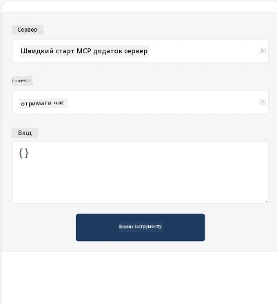
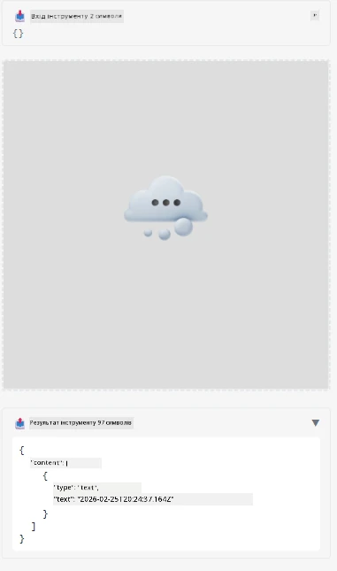

Ось приклад, що демонструє MCP App

## Встановлення

1. Перейдіть до папки *mcp-app*
1. Запустіть `npm install`, це має встановити залежності фронтенду та бекенду

Перевірте компіляцію бекенду, запустивши:

```sh
npx tsc --noEmit
```

Якщо все гаразд, виводу бути не повинно.

## Запуск бекенду

> Це вимагає трохи додаткової роботи, якщо ви на Windows, оскільки рішення MCP Apps використовує бібліотеку `concurrently`, для якої вам потрібно знайти заміну. Ось проблемний рядок у *package.json* на MCP App:

    ```json
    "start": "concurrently \"cross-env NODE_ENV=development INPUT=mcp-app.html vite build --watch\" \"tsx watch main.ts\""
    ```

Цей додаток має дві частини — бекенд та хост.

Запустіть бекенд, викликавши:

```sh
npm start
```

Це має запустити бекенд на `http://localhost:3001/mcp`.

> Зверніть увагу, якщо ви в Codespace, можливо, доведеться встановити публічну видимість порту. Перевірте, що можете звернутися до кінцевої точки через браузер за адресою https://<назва Codespace>.app.github.dev/mcp

## Варіант -1 Тестування додатку у Visual Studio Code

Щоб протестувати рішення у Visual Studio Code, виконайте наступне:

- Додайте запис сервера до `mcp.json` так:

    ```json
    {
        "servers": {
            "my-mcp-server-7178eca7": {
                "url": "http://localhost:3001/mcp",
                "type": "http"
            }
        },
        "inputs": []
    }
    ```

1. Натисніть кнопку "start" у *mcp.json*
1. Переконайтеся, що вікно чату відкрите, і введіть `get-faq`, ви повинні побачити результат як на прикладі:

    

## Варіант -2- Тестування додатку з хостом

Репозиторій <https://github.com/modelcontextprotocol/ext-apps> містить кілька різних хостів, які ви можете використати для тестування своїх MVP Apps.

Ми запропонуємо вам два варіанти:

### Локальна машина

- Перейдіть до *ext-apps* після клонування репозиторію.

- Встановіть залежності

   ```sh
   npm install
   ```

- В окремому терміналі перейдіть до *ext-apps/examples/basic-host*

    > Якщо ви в Codespace, перейдіть до serve.ts на рядку 27 і замініть http://localhost:3001/mcp на URL вашого Codespace для бекенду, наприклад https://psychic-xylophone-657rpjgvxpc5g64-3001.app.github.dev/mcp

- Запустіть хост:

    ```sh
    npm start
    ```

    Це має підключити хост до бекенду, і ви побачите запущений додаток, як на зображенні:

    

### Codespace

Щоб налаштувати середовище Codespace, потрібно трохи більше зусиль. Для запуску хоста через Codespace:

- Перейдіть до директорії *ext-apps* та відкрийте *examples/basic-host*.
- Запустіть `npm install` для встановлення залежностей
- Запустіть `npm start` для запуску хоста.

## Тестування додатку

Спробуйте додаток наступним чином:

- Виберіть кнопку "Call Tool", і ви побачите результат, як показано:

    

Чудово, все працює.

---

<!-- CO-OP TRANSLATOR DISCLAIMER START -->
**Відмова від відповідальності**:  
Цей документ було перекладено за допомогою сервісу автоматичного перекладу [Co-op Translator](https://github.com/Azure/co-op-translator). Хоча ми докладаємо зусиль для забезпечення точності, зверніть увагу, що автоматичний переклад може містити помилки або неточності. Оригінальний документ рідною мовою слід вважати авторитетним джерелом. Для важливої інформації рекомендується звертатися до професійного людського перекладу. Ми не несемо відповідальності за будь-які непорозуміння або неправильні тлумачення, що виникли внаслідок використання цього перекладу.
<!-- CO-OP TRANSLATOR DISCLAIMER END -->