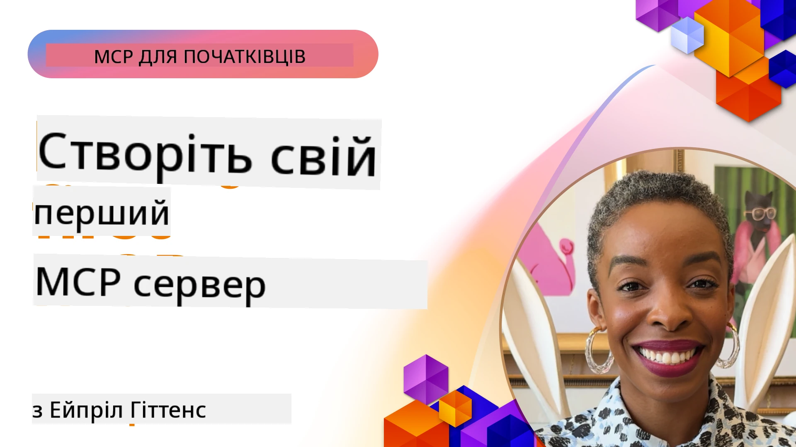

## Початок роботи  

_(Натисніть на зображення вище, щоб переглянути відео цього уроку)_

Цей розділ складається з кількох уроків:

- **1 Ваш перший сервер**, у цьому першому уроці ви навчитеся створювати свій перший сервер і перевіряти його за допомогою інспектора, цінний інструмент для тестування та налагодження вашого сервера, [до уроку](01-first-server/README.md)

- **2 Клієнт**, у цьому уроці ви дізнаєтесь, як написати клієнта, який може підключатися до вашого сервера, [до уроку](02-client/README.md)

- **3 Клієнт з LLM**, ще кращий спосіб написати клієнта — додати до нього LLM, щоб він міг «спілкуватися» із сервером щодо подальших дій, [до уроку](03-llm-client/README.md)

- **4 Використання режиму GitHub Copilot Agent сервера в Visual Studio Code**. Тут ми розглядаємо запуск нашого MCP сервера з середовища Visual Studio Code, [до уроку](04-vscode/README.md)

- **5 Сервер з транспортом stdio**. Транспорт stdio є рекомендованим стандартом для локальної комунікації між MCP сервером і клієнтом, забезпечуючи захищену взаємодію за допомогою ізольованих підпроцесів [до уроку](05-stdio-server/README.md)

- **6 HTTP потокова передача з MCP (Streamable HTTP)**. Дізнайтеся про сучасний транспорт HTTP потокової передачі (рекомендований підхід для віддалених MCP серверів згідно з [MCP Specification 2025-11-25](https://spec.modelcontextprotocol.io/specification/2025-11-25/basic/transports/#streamable-http)), повідомлення про прогрес, а також як реалізувати масштабовані, реального часу MCP сервери та клієнти за допомогою Streamable HTTP. [до уроку](06-http-streaming/README.md)

- **7 Використання AI Toolkit для VSCode** для споживання та тестування ваших MCP клієнтів і серверів [до уроку](07-aitk/README.md)

- **8 Тестування**. Тут ми зосередимося особливо на тому, як ми можемо по-різному тестувати наш сервер і клієнта, [до уроку](08-testing/README.md)

- **9 Розгортання**. Цей розділ розгляне різні способи розгортання ваших MCP рішень, [до уроку](09-deployment/README.md)

- **10 Розширене використання сервера**. У цьому розділі висвітлюється розширене використання сервера, [до уроку](./10-advanced/README.md)

- **11 Аутентифікація**. У цьому розділі описано, як додати просту аутентифікацію, від Basic Auth до використання JWT та RBAC. Рекомендується почати звідси, а потім ознайомитись з розширеними темами в розділі 5 та посилити безпеку відповідно до рекомендацій у розділі 2, [до уроку](./11-simple-auth/README.md)

- **12 MCP Хости**. Налаштування та використання популярних MCP хост клієнтів, включно з Claude Desktop, Cursor, Cline та Windsurf. Дізнайтеся про типи транспортів і усунення несправностей, [до уроку](./12-mcp-hosts/README.md)

- **13 MCP Інспектор**. Налагоджуйте та тестуйте ваші MCP сервери інтерактивно за допомогою інструменту MCP Inspector. Навчіться усувати проблеми інструментів, ресурсів та протокольних повідомлень, [до уроку](./13-mcp-inspector/README.md)

- **14 Вибірка**. Створюйте MCP сервери, які співпрацюють із MCP клієнтами у завданнях, пов’язаних з LLM. [до уроку](./14-sampling/README.md)

- **15 MCP Додатки**. Створюйте MCP сервери, що також відповідають інструкціями інтерфейсу користувача, [до уроку](./15-mcp-apps/README.md)

Model Context Protocol (MCP) — це відкритий протокол, що стандартизує, як додатки надають контекст великим мовним моделям (LLM). Подумайте про MCP як про порт USB-C для AI-додатків — він забезпечує стандартизований спосіб підключення AI моделей до різних джерел даних і інструментів.

## Навчальні цілі

Наприкінці цього уроку ви зможете:

- Налаштувати середовища розробки для MCP на C#, Java, Python, TypeScript та JavaScript
- Створювати та розгортати базові MCP сервери з користувацькими функціями (ресурси, підказки та інструменти)
- Створювати хост-застосунки, що підключаються до MCP серверів
- Тестувати та налагоджувати реалізації MCP
- Розуміти типові проблеми налаштування та їх вирішення
- Підключати свої реалізації MCP до популярних LLM сервісів

## Налаштування середовища MCP

Перш ніж почати працювати з MCP, важливо підготувати ваше середовище розробки та зрозуміти основний робочий процес. Цей розділ проведе вас через початкові кроки налаштування для забезпечення плавного старту з MCP.

### Вимоги

Перш ніж зануритись у розробку MCP, переконайтеся, що у вас є:

- **Середовище розробки**: для обраної мови (C#, Java, Python, TypeScript або JavaScript)
- **IDE/редактор**: Visual Studio, Visual Studio Code, IntelliJ, Eclipse, PyCharm або будь-який сучасний редактор коду
- **Менеджери пакетів**: NuGet, Maven/Gradle, pip або npm/yarn
- **API ключі**: для будь-яких AI сервісів, які ви плануєте використовувати у своїх хост-застосунках

### Офіційні SDK

У наступних розділах ви побачите рішення, побудовані з використанням Python, TypeScript, Java та .NET. Ось усі офіційно підтримувані SDK.

MCP надає офіційні SDK для кількох мов (відповідно до [MCP Specification 2025-11-25](https://spec.modelcontextprotocol.io/specification/2025-11-25/)):
- [C# SDK](https://github.com/modelcontextprotocol/csharp-sdk) – підтримується у співпраці з Microsoft
- [Java SDK](https://github.com/modelcontextprotocol/java-sdk) – підтримується у співпраці з Spring AI
- [TypeScript SDK](https://github.com/modelcontextprotocol/typescript-sdk) – офіційна реалізація на TypeScript
- [Python SDK](https://github.com/modelcontextprotocol/python-sdk) – офіційна реалізація на Python (FastMCP)
- [Kotlin SDK](https://github.com/modelcontextprotocol/kotlin-sdk) – офіційна реалізація на Kotlin
- [Swift SDK](https://github.com/modelcontextprotocol/swift-sdk) – підтримується у співпраці з Loopwork AI
- [Rust SDK](https://github.com/modelcontextprotocol/rust-sdk) – офіційна реалізація на Rust
- [Go SDK](https://github.com/modelcontextprotocol/go-sdk) – офіційна реалізація на Go

## Основні висновки

- Налаштування середовища для розробки MCP є простим завдяки SDK для конкретних мов
- Створення MCP серверів передбачає створення і реєстрацію інструментів із чіткими схемами
- MCP клієнти підключаються до серверів і моделей для розширення функціоналу
- Тестування та налагодження є важливими для надійних реалізацій MCP
- Варіанти розгортання включають локальну розробку і хмарні рішення

## Практика

У нас є набір прикладів, які доповнюють вправи, які ви побачите у всіх розділах цього розділу. Крім того, кожен розділ також має свої власні вправи та завдання

- [Java калькулятор](./samples/java/calculator/README.md)
- [.Net калькулятор](../../../03-GettingStarted/samples/csharp)
- [JavaScript калькулятор](./samples/javascript/README.md)
- [TypeScript калькулятор](./samples/typescript/README.md)
- [Python калькулятор](../../../03-GettingStarted/samples/python)

## Додаткові ресурси

- [Створення агентів за допомогою Model Context Protocol на Azure](https://learn.microsoft.com/azure/developer/ai/intro-agents-mcp)
- [Віддалений MCP із Azure Container Apps (Node.js/TypeScript/JavaScript)](https://learn.microsoft.com/samples/azure-samples/mcp-container-ts/mcp-container-ts/)
- [.NET OpenAI MCP агент](https://learn.microsoft.com/samples/azure-samples/openai-mcp-agent-dotnet/openai-mcp-agent-dotnet/)

## Що далі

Почніть з першого уроку: [Створення вашого першого MCP сервера](01-first-server/README.md)

Після завершення цього модуля переходьте до: [Модуль 4: Практична реалізація](../04-PracticalImplementation/README.md)

---

<!-- CO-OP TRANSLATOR DISCLAIMER START -->
**Відмова від відповідальності**:
Цей документ було перекладено за допомогою сервісу автоматичного перекладу [Co-op Translator](https://github.com/Azure/co-op-translator). Хоча ми прагнемо до точності, зверніть увагу, що автоматичні переклади можуть містити помилки або неточності. Оригінальний документ рідною мовою слід вважати авторитетним джерелом. Для критично важливої інформації рекомендується звертатися до професійного перекладу, виконаного людиною. Ми не несемо відповідальності за будь-які непорозуміння або неправильне тлумачення, що виникли внаслідок використання цього перекладу.
<!-- CO-OP TRANSLATOR DISCLAIMER END -->