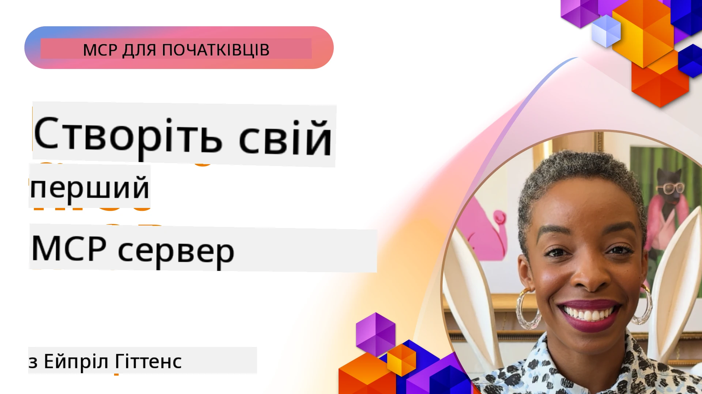

## Початок роботи  

_(Натисніть на зображення вище, щоб переглянути відео цього уроку)_

Цей розділ складається з кількох уроків:

- **1 Ваш перший сервер**, у цьому першому уроці ви навчитеся створювати свій перший сервер і перевіряти його за допомогою інструменту інспектора — цінного способу тестування і налагодження вашого сервера, [до уроку](01-first-server/README.md)

- **2 Клієнт**, у цьому уроці ви дізнаєтесь, як написати клієнта, що може підключатися до вашого сервера, [до уроку](02-client/README.md)

- **3 Клієнт з LLM**, ще кращий спосіб написання клієнта — це додати LLM, щоб він міг "домовлятися" з вашим сервером про подальші дії, [до уроку](03-llm-client/README.md)

- **4 Використання режиму агента GitHub Copilot сервера в Visual Studio Code**. Тут ми розглядаємо запуск MCP сервера безпосередньо з Visual Studio Code, [до уроку](04-vscode/README.md)

- **5 Сервер транспортного рівня stdio** stdio — рекомендований стандарт для локальної комунікації MCP серверів і клієнтів, що забезпечує безпечну комунікацію через підпроцеси з вбудованою ізоляцією процесів [до уроку](05-stdio-server/README.md)

- **6 HTTP трансляція з MCP (Streamable HTTP)**. Дізнайтеся про стандартний
	віддалений транспорт у [MCP Специфікації 2026-07-28](https://modelcontextprotocol.io/specification/2026-07-28/basic/transports/streamable-http),
	а також про застарілу реалізацію на основі сесій, яка збережена в уроці.
	[до уроку](06-http-streaming/README.md)

- **7 Використання AI Toolkit для VSCode** для споживання та тестування ваших MCP клієнтів і серверів [до уроку](07-aitk/README.md)

- **8 Тестування**. Тут ми зосередимося на різних способах тестування нашого сервера й клієнта, [до уроку](08-testing/README.md)

- **9 Розгортання**. Цей розділ розгляне різні способи розгортання ваших MCP рішень, [до уроку](09-deployment/README.md)

- **10 Розширене використання сервера**. Цей розділ охоплює просунуті способи експлуатації сервера, [до уроку](./10-advanced/README.md)

- **11 Аутентифікація**. У цьому розділі йдеться про додавання простої аутентифікації — від Basic Auth до використання JWT і RBAC. Рекомендується почати з цього розділу, а потім ознайомитися з Розширеними темами в Розділі 5 та додатково посилити безпеку за рекомендаціями Розділу 2, [до уроку](./11-simple-auth/README.md)

- **12 MCP хости**. Налаштування та використання популярних хост-клієнтів MCP, включаючи Claude Desktop, Cursor, Cline і Windsurf. Вивчайте типи транспортів і усунення несправностей, [до уроку](./12-mcp-hosts/README.md)

- **13 MCP Інспектор**. Інтерактивне налагодження та тестування MCP серверів за допомогою інструменту MCP Інспектор. Вивчайте інструменти усунення несправностей, ресурси та протокольні повідомлення, [до уроку](./13-mcp-inspector/README.md)

- **14 Вибірка**. Опануйте застарілий примітив вибірки для `2025-11-25` і
	як мігрувати нові дизайни до прямої інтеграції постачальника LLM. Вибірка
	вилучена з MCP `2026-07-28`. [до уроку](./14-sampling/README.md)

- **15 MCP додатки**. Створюйте MCP сервери, які також відповідають інструкціями для UI, [до уроку](./15-mcp-apps/README.md)

Протокол Model Context (MCP) — відкритий протокол, що стандартизує спосіб надання контексту LLM застосунками. Думайте про MCP як про порт USB-C для AI-додатків — він забезпечує стандартизований спосіб підключення моделей штучного інтелекту до різних джерел даних і інструментів.

## Цілі навчання

Наприкінці цього уроку ви зможете:

- Налаштувати середовища розробки для MCP на C#, Java, Python, TypeScript і JavaScript
- Створювати та розгортати базові MCP сервери з користувацькими функціями (ресурси, підказки та інструменти)
- Створювати хост-застосунки, що підключаються до MCP серверів
- Тестувати та налагоджувати реалізації MCP
- Розуміти типові проблеми налаштування та їхні рішення
- Підключати ваші MCP реалізації до популярних LLM сервісів

## Налаштування вашого MCP середовища

Перед початком роботи з MCP важливо підготувати середовище розробки та зрозуміти базовий робочий процес. Цей розділ проведе вас через початкові кроки налаштування для плавного старту з MCP.

### Передумови

Перед зануренням у розробку MCP переконайтеся, що у вас є:

- **Середовище розробки**: для обраної вами мови (C#, Java, Python, TypeScript або JavaScript)
- **IDE/Редактор**: Visual Studio, Visual Studio Code, IntelliJ, Eclipse, PyCharm або будь-який сучасний редактор коду
- **Менеджери пакетів**: NuGet, Maven/Gradle, pip або npm/yarn
- **API ключі**: для будь-яких AI сервісів, які ви плануєте використовувати у ваших хост-застосунках

### Офіційні SDK

У наступних розділах ви побачите рішення, побудовані на Python, TypeScript,
Java та .NET. Ось офіційні SDK.

Підтримка SDK для MCP `2026-07-28` впроваджується окремо для кожної мови.
Перед запуском прикладу перевірте версію пакета та примітки до релізу SDK
для підтримуваних ревізій протоколу. Дивіться
[офіційний список SDK](https://modelcontextprotocol.io/docs/sdk):
- [C# SDK](https://github.com/modelcontextprotocol/csharp-sdk) - Підтримується у співпраці з Microsoft
- [Java SDK](https://github.com/modelcontextprotocol/java-sdk) - Підтримується у співпраці з Spring AI
- [TypeScript SDK](https://github.com/modelcontextprotocol/typescript-sdk) - Офіційна реалізація на TypeScript
- [Python SDK](https://github.com/modelcontextprotocol/python-sdk) - Офіційна реалізація на Python (FastMCP)
- [Kotlin SDK](https://github.com/modelcontextprotocol/kotlin-sdk) - Офіційна реалізація на Kotlin
- [Swift SDK](https://github.com/modelcontextprotocol/swift-sdk) - Підтримується у співпраці з Loopwork AI
- [Rust SDK](https://github.com/modelcontextprotocol/rust-sdk) - Офіційна реалізація на Rust
- [Go SDK](https://github.com/modelcontextprotocol/go-sdk) - Офіційна реалізація на Go

## Основні висновки

- Налаштування середовища розробки MCP є простим завдяки мовно-специфічним SDK
- Створення MCP серверів включає створення й реєстрацію інструментів з чіткими схемами
- MCP клієнти підключаються до серверів і моделей, щоб використовувати розширені можливості
- Тестування і налагодження є обов’язковими для надійної реалізації MCP
- Варіанти розгортання включають локальну розробку та хмарні рішення

## Практика

У нас є набір прикладів, що доповнює вправи, які ви побачите у всіх розділах цього секції. Крім того, кожен розділ має власні вправи і завдання.

- [Калькулятор на Java](./samples/java/calculator/README.md)
- [Калькулятор на .NET](../../../03-GettingStarted/samples/csharp)
- [Калькулятор на JavaScript](./samples/javascript/README.md)
- [Калькулятор на TypeScript](./samples/typescript/README.md)
- [Калькулятор на Python](../../../03-GettingStarted/samples/python)

## Додаткові ресурси

- [Створення агентів за допомогою Model Context Protocol на Azure](https://learn.microsoft.com/azure/developer/ai/intro-agents-mcp)
- [Віддалений MCP з Azure Container Apps (Node.js/TypeScript/JavaScript)](https://learn.microsoft.com/samples/azure-samples/mcp-container-ts/mcp-container-ts/)
- [.NET OpenAI MCP агент](https://learn.microsoft.com/samples/azure-samples/openai-mcp-agent-dotnet/openai-mcp-agent-dotnet/)

## Що далі

Почніть з першого уроку: [Створення вашого першого MCP сервера](01-first-server/README.md)

Після завершення цього модуля продовжуйте до: [Модуль 4: Практична реалізація](../04-PracticalImplementation/README.md)

---

<!-- CO-OP TRANSLATOR DISCLAIMER START -->
**Відмова від відповідальності**:
Цей документ було перекладено за допомогою сервісу штучного інтелекту для перекладу [Co-op Translator](https://github.com/Azure/co-op-translator). Хоча ми прагнемо до точності, будь ласка, майте на увазі, що автоматичні переклади можуть містити помилки або неточності. Оригінальний документ рідною мовою слід вважати авторитетним джерелом. Для критично важливої інформації рекомендується професійний людський переклад. Ми не несемо відповідальності за будь-які непорозуміння або неправильні тлумачення, що виникли внаслідок використання цього перекладу.
<!-- CO-OP TRANSLATOR DISCLAIMER END -->