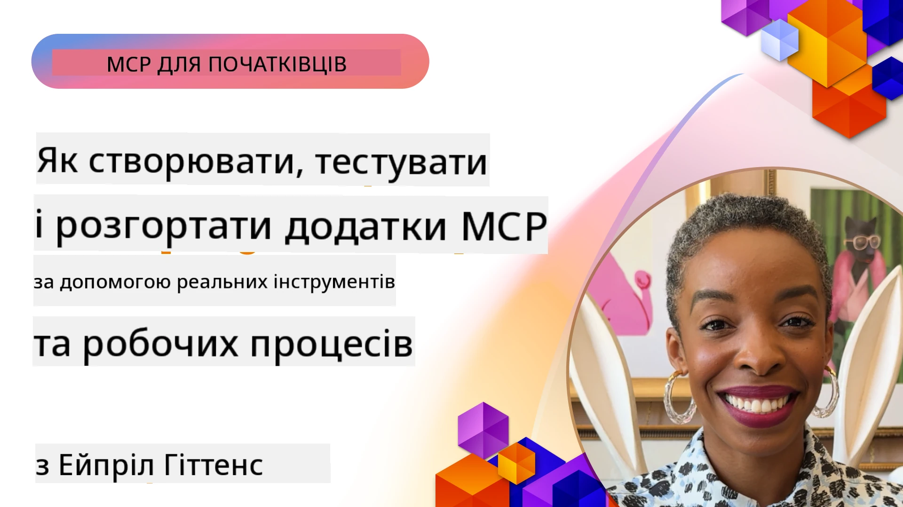
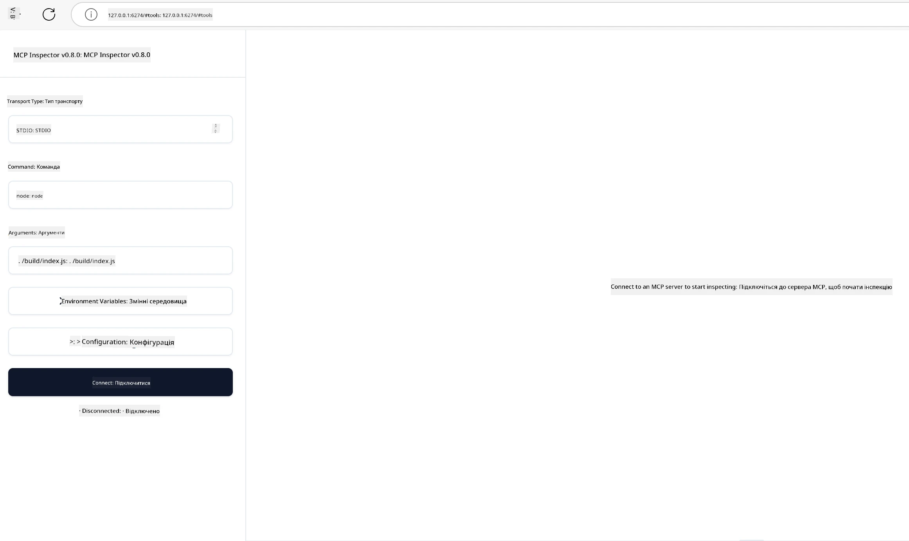

# Практична реалізація

[](https://youtu.be/vCN9-mKBDfQ)

_(Натисніть на зображення вище, щоб переглянути відео цього уроку)_

Практична реалізація — це те місце, де міць протоколу Model Context Protocol (MCP) стає відчутною. Хоча розуміння теорії та архітектури MCP важливе, справжня цінність з’являється, коли ви застосовуєте ці концепції для створення, тестування та розгортання рішень, які вирішують реальні проблеми. Цей розділ долає розрив між концептуальними знаннями та практичною розробкою, проводячи вас через процес оживлення додатків на основі MCP.

Незалежно від того, чи розробляєте ви інтелектуальних помічників, інтегруєте ШІ у бізнес-процеси або створюєте власні інструменти для обробки даних, MCP забезпечує гнучку основу. Його незалежний від мови дизайн та офіційні SDK для популярних мов програмування роблять його доступним для широкого кола розробників. Використовуючи ці SDK, ви можете швидко прототипувати, ітеруватися та масштабувати свої рішення на різних платформах і середовищах.

У наступних розділах ви знайдете практичні приклади, зразки коду та стратегії розгортання, що демонструють, як реалізувати MCP на C#, Java зі Spring, TypeScript, JavaScript і Python. Ви також навчитеся налагоджувати та тестувати сервери MCP, керувати API та розгортати рішення в хмарі за допомогою Azure. Ці практичні ресурси розроблені для прискорення вашого навчання та допомоги у впевненому створенні надійних, готових до експлуатації MCP-додатків.

## Огляд

Цей урок зосереджений на практичних аспектах реалізації MCP на різних мовах програмування. Ми розглянемо, як використовувати SDK MCP на C#, Java зі Spring, TypeScript, JavaScript і Python для створення надійних додатків, налагодження та тестування серверів MCP, а також створення повторно використовуваних ресурсів, запитів та інструментів.

## Цілі навчання

До кінця цього уроку ви зможете:

- Реалізовувати рішення MCP за допомогою офіційних SDK на різних мовах програмування
- Систематично налагоджувати та тестувати сервери MCP
- Створювати та використовувати функції сервера (Ресурси, Запити та Інструменти)
- Проєктувати ефективні робочі процеси MCP для складних завдань
- Оптимізувати реалізації MCP для продуктивності та надійності

## Офіційні SDK

Протокол Model Context Protocol пропонує офіційні SDK для кількох мов (узгоджені з [MCP Specification 2025-11-25](https://spec.modelcontextprotocol.io/specification/2025-11-25/)):

- [C# SDK](https://github.com/modelcontextprotocol/csharp-sdk)
- [Java зі Spring SDK](https://github.com/modelcontextprotocol/java-sdk) **Примітка:** вимагає залежності від [Project Reactor](https://projectreactor.io). (Дивіться [обговорення issue 246](https://github.com/orgs/modelcontextprotocol/discussions/246).)
- [TypeScript SDK](https://github.com/modelcontextprotocol/typescript-sdk)
- [Python SDK](https://github.com/modelcontextprotocol/python-sdk)
- [Kotlin SDK](https://github.com/modelcontextprotocol/kotlin-sdk)
- [Go SDK](https://github.com/modelcontextprotocol/go-sdk)

## Робота з MCP SDK

Цей розділ містить практичні приклади реалізації MCP на кількох мовах програмування. Ви можете знайти приклади коду у каталозі `samples`, організованому за мовами.

### Доступні приклади

Репозиторій містить [приклади реалізацій](../../../04-PracticalImplementation/samples) на наступних мовах:

- [C#](./samples/csharp/README.md)
- [Java зі Spring](./samples/java/containerapp/README.md)
- [TypeScript](./samples/typescript/README.md)
- [JavaScript](./samples/javascript/README.md)
- [Python](./samples/python/README.md)

Кожен приклад демонструє ключові концепції MCP і шаблони реалізації для конкретної мови та екосистеми.

### Практичні посібники

Додаткові посібники з практичної реалізації MCP:

- [Пагінація та великі набори результатів](./pagination/README.md) – Обробка пагінації на основі курсора для інструментів, ресурсів і великих наборів даних

## Основні функції сервера

Сервери MCP можуть реалізовувати будь-яку комбінацію цих функцій:

### Ресурси

Ресурси надають контекст і дані для користувача або AI-моделі:

- Репозиторії документів
- Бази знань
- Структуровані джерела даних
- Файлові системи

### Запити

Запити – це шаблонні повідомлення та робочі процеси для користувачів:

- Попередньо визначені шаблони розмов
- Керовані патерни взаємодії
- Спеціалізовані структури діалогів

### Інструменти

Інструменти – це функції, які AI-модель може виконувати:

- Утиліти обробки даних
- Інтеграції зовнішніх API
- Обчислювальні можливості
- Функціонал пошуку

## Приклади реалізацій: реалізація на C#

Офіційний репозиторій SDK для C# містить кілька прикладів реалізацій, що демонструють різні аспекти MCP:

- **Базовий клієнт MCP**: простий приклад створення MCP клієнта та виклику інструментів
- **Базовий сервер MCP**: мінімальна реалізація сервера з базовою реєстрацією інструментів
- **Розширений сервер MCP**: повнофункціональний сервер з реєстрацією інструментів, автентифікацією та обробкою помилок
- **Інтеграція з ASP.NET**: приклади інтеграції з ASP.NET Core
- **Шаблони реалізації інструментів**: різні патерни реалізації інструментів з різною складністю

SDK MCP для C# наразі в прев’ю і API можуть змінюватися. Ми будемо постійно оновлювати цей блог у міру розвитку SDK.

### Ключові особливості

- [C# MCP Nuget ModelContextProtocol](https://www.nuget.org/packages/ModelContextProtocol)
- Створення вашого [першого сервера MCP](https://devblogs.microsoft.com/dotnet/build-a-model-context-protocol-mcp-server-in-csharp/).

Для повних прикладів реалізації на C# відвідайте [офіційний репозиторій прикладів SDK для C#](https://github.com/modelcontextprotocol/csharp-sdk)

## Приклад реалізації: Java зі Spring

SDK для Java зі Spring пропонує надійні варіанти реалізації MCP з функціями рівня підприємства.

### Ключові особливості

- Інтеграція з Spring Framework
- Сильна типізація
- Підтримка реактивного програмування
- Комплексна обробка помилок

Для повного прикладу реалізації Java зі Spring дивіться [Java зі Spring приклад](samples/java/containerapp/README.md) у каталозі прикладів.

## Приклад реалізації: JavaScript

SDK JavaScript забезпечує легкий та гнучкий підхід до реалізації MCP.

### Ключові особливості

- Підтримка Node.js та браузера
- API на основі промісів
- Легка інтеграція з Express та іншими фреймворками
- Підтримка WebSocket для потокової передачі даних

Для повного прикладу реалізації JavaScript дивіться [JavaScript приклад](samples/javascript/README.md) у каталозі прикладів.

## Приклад реалізації: Python

SDK Python пропонує пітонисти́чний підхід до реалізації MCP з відмінною інтеграцією ML-фреймворків.

### Ключові особливості

- Підтримка async/await з asyncio
- Інтеграція з FastAPI
- Проста реєстрація інструментів
- Нативна інтеграція з популярними бібліотеками ML

Для повного прикладу реалізації Python дивіться [Python приклад](samples/python/README.md) у каталозі прикладів.

## Управління API

Azure API Management є відмінним рішенням для захисту серверів MCP. Ідея полягає в тому, щоб розмістити екземпляр Azure API Management перед вашим сервером MCP і дозволити йому обробляти такі функції, які вам можуть знадобитися, як-от:

- обмеження швидкості
- керування токенами
- моніторинг
- балансування навантаження
- безпека

### Приклад Azure

Ось приклад Azure, який робить саме це, тобто [створює MCP сервер і захищає його за допомогою Azure API Management](https://github.com/Azure-Samples/remote-mcp-apim-functions-python).

Дивіться, як відбувається потік авторизації на зображенні нижче:


На попередньому зображенні відбуваються такі дії:

- Аутентифікація/авторизація відбувається за допомогою Microsoft Entra.
- Azure API Management діє як шлюз і використовує політики для спрямування та керування трафіком.
- Azure Monitor записує всі запити для подальшого аналізу.

#### Потік авторизації

Розгляньмо потік авторизації більш докладно:


#### Специфікація авторизації MCP

Дізнайтеся більше про [специфікацію авторизації MCP](https://spec.modelcontextprotocol.io/specification/2025-11-25/basic/authorization/)

## Розгортання віддаленого MCP-сервера в Azure

Давайте перевіримо, чи можемо ми розгорнути згаданий раніше приклад:

1. Клонуйте репозиторій

    ```bash
    git clone https://github.com/Azure-Samples/remote-mcp-apim-functions-python.git
    cd remote-mcp-apim-functions-python
    ```

1. Зареєструйте провайдера ресурсів `Microsoft.App`.

   - Якщо ви використовуєте Azure CLI, виконайте `az provider register --namespace Microsoft.App --wait`.
   - Якщо ви використовуєте Azure PowerShell, виконайте `Register-AzResourceProvider -ProviderNamespace Microsoft.App`. Потім через деякий час перевірте, чи завершено реєстрацію, запустивши `(Get-AzResourceProvider -ProviderNamespace Microsoft.App).RegistrationState`.

1. Запустіть цю команду [azd](https://aka.ms/azd) для створення служби керування API, функціонального додатку (з кодом) та інших необхідних ресурсів Azure

    ```shell
    azd up
    ```

    Ця команда має розгорнути всі хмарні ресурси на Azure

### Тестування вашого сервера за допомогою MCP Inspector

1. У **новому вікні терміналу** встановіть і запустіть MCP Inspector

    ```shell
    npx @modelcontextprotocol/inspector
    ```

    Ви повинні побачити інтерфейс, подібний до:

    

1. CTRL-клікніть, щоб завантажити веб-додаток MCP Inspector за URL, що відображається додатком (наприклад, [http://127.0.0.1:6274/#resources](http://127.0.0.1:6274/#resources))
1. Встановіть тип транспорту на `SSE`
1. Встановіть URL вашої працюючої кінцевої точки API Management SSE, відображеної після `azd up`, і **Підключіться**:

    ```shell
    https://<apim-servicename-from-azd-output>.azure-api.net/mcp/sse
    ```

1. **Переглянути список інструментів**. Натисніть на інструмент і **Запустити інструмент**.  

Якщо всі кроки виконані правильно, ви повинні бути підключені до сервера MCP і змогли викликати інструмент.

## Сервери MCP для Azure

[Remote-mcp-functions](https://github.com/Azure-Samples/remote-mcp-functions-dotnet): Ця сукупність репозиторіїв є шаблоном швидкого старту для створення та розгортання користувацьких віддалених MCP (Model Context Protocol) серверів за допомогою Azure Functions на Python, C# .NET або Node/TypeScript.

Ці приклади надають повне рішення, яке дозволяє розробникам:

- Локальна розробка та запуск: розробляти і налагоджувати MCP сервер на локальній машині
- Розгортання в Azure: легко розгортати в хмарі однією командою azd up
- Підключення з клієнтів: підключатися до MCP сервера з різних клієнтів, включно з режимом агента Copilot у VS Code та інструментом MCP Inspector

### Ключові особливості

- Безпека за проектом: сервер MCP захищений за допомогою ключів і HTTPS
- Варіанти автентифікації: підтримує OAuth із вбудованою аутентифікацією та/або API Management
- Ізоляція мережі: підтримує ізоляцію мережі за допомогою Azure Virtual Networks (VNET)
- Безсерверна архітектура: використовує Azure Functions для масштабованого виконання подій
- Локальна розробка: повна підтримка локальної розробки і налагодження
- Просте розгортання: оптимізований процес розгортання в Azure

Репозиторій містить всі необхідні файли конфігурації, вихідний код та інфраструктурні визначення для швидкого початку роботи з готовою до виробництва реалізацією MCP сервера.

- [Azure Remote MCP Functions Python](https://github.com/Azure-Samples/remote-mcp-functions-python) - Приклад реалізації MCP за допомогою Azure Functions з Python

- [Azure Remote MCP Functions .NET](https://github.com/Azure-Samples/remote-mcp-functions-dotnet) - Приклад реалізації MCP за допомогою Azure Functions з C# .NET

- [Azure Remote MCP Functions Node/Typescript](https://github.com/Azure-Samples/remote-mcp-functions-typescript) - Приклад реалізації MCP за допомогою Azure Functions з Node/TypeScript.

## Основні висновки

- SDK MCP надають інструменти, специфічні для мов, для реалізації надійних MCP-рішень
- Процес налагодження та тестування є критичним для надійних MCP-додатків
- Повторно використовувані шаблони запитів забезпечують послідовність взаємодії AI
- Добре спроєктовані робочі процеси можуть координувати складні завдання з використанням кількох інструментів
- Реалізація MCP-рішень вимагає врахування безпеки, продуктивності та обробки помилок

## Вправа

Спроєктуйте практичний робочий процес MCP, який вирішує реальну проблему у вашій галузі:

1. Визначте 3-4 інструменти, що будуть корисними для розв’язання цієї проблеми
2. Створіть діаграму робочого процесу, що демонструє взаємодію цих інструментів
3. Реалізуйте базову версію одного з інструментів, використовуючи бажану мову програмування
4. Створіть шаблон запиту, який допоможе моделі ефективно використовувати ваш інструмент

## Додаткові ресурси

---

## Що далі

Далі: [Розширені теми](../05-AdvancedTopics/README.md)

---

<!-- CO-OP TRANSLATOR DISCLAIMER START -->
**Відмова від відповідальності**:  
Цей документ було перекладено за допомогою сервісу автоматичного перекладу [Co-op Translator](https://github.com/Azure/co-op-translator). Хоч ми й прагнемо до точності, будь ласка, майте на увазі, що автоматичні переклади можуть містити помилки або неточності. Оригінальний документ рідною мовою слід вважати авторитетним джерелом. Для критично важливої інформації рекомендується професійний переклад людиною. Ми не несемо відповідальності за будь-які непорозуміння чи неправильні тлумачення, що виникли внаслідок використання цього перекладу.
<!-- CO-OP TRANSLATOR DISCLAIMER END -->