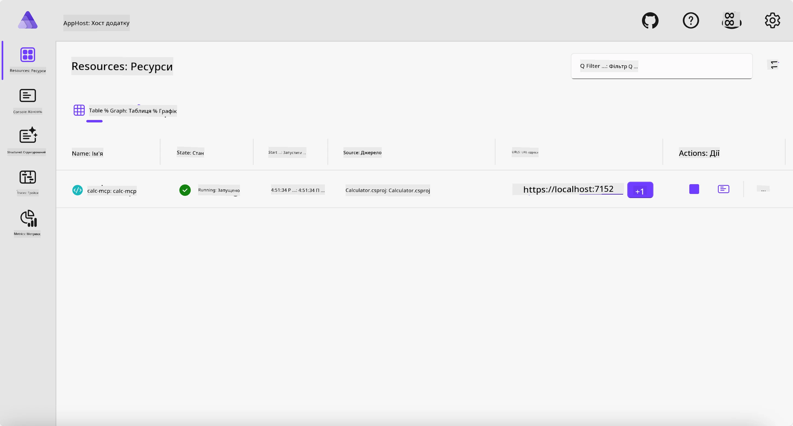
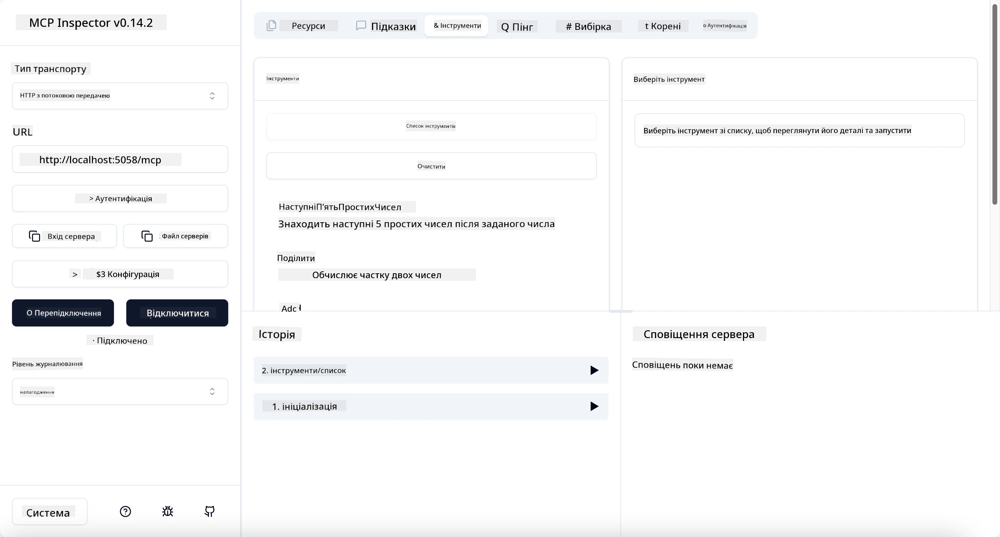

# Приклад

Попередній приклад показує, як використовувати локальний .NET проект з типом `stdio`. І як запускати сервер локально в контейнері. Це гарне рішення в багатьох ситуаціях. Проте корисно мати можливість запускати сервер віддалено, наприклад, у хмарному середовищі. Саме тут з’являється тип `http`.

Розглядаючи рішення у папці `04-PracticalImplementation`, воно може здатися значно складнішим за попереднє. Але насправді це не так. Якщо придивитися до проекту `src/Calculator`, ви побачите, що це здебільшого той же код, що і в попередньому прикладі. Єдина різниця полягає в тому, що ми використовуємо іншу бібліотеку `ModelContextProtocol.AspNetCore` для обробки HTTP-запитів. І ми змінюємо метод `IsPrime`, щоб зробити його приватним, просто щоб показати, що у вашому коді можна мати приватні методи. Решта коду така сама, як і раніше.

Інші проекти — від [Aspire](https://aspire.dev/get-started/what-is-aspire/). Наявність Aspire у рішенні покращить досвід розробника під час розробки і тестування та допоможе з обсервабельністю. Для запуску сервера це не обов’язково, але це добра практика мати його у вашому рішенні.

## Запуск сервера локально

1. У VS Code (з розширенням C# DevKit) перейдіть у каталог `04-PracticalImplementation/samples/csharp`.
1. Виконайте наступну команду для запуску сервера:

   ```bash
    dotnet watch run --project ./src/AppHost
   ```

1. Коли у веб-браузері відкриється панель Aspire, зверніть увагу на URL з `http`. Це має бути щось на кшталт `http://localhost:5058/`.

   

## Тестування Streamable HTTP за допомогою MCP Inspector

Якщо у вас встановлено Node.js версії 22.7.5 і вище, ви можете використовувати MCP Inspector для тестування вашого сервера.

Запустіть сервер і виконайте наступну команду у терміналі:

```bash
npx @modelcontextprotocol/inspector http://localhost:5058
```



- Виберіть `Streamable HTTP` як тип транспорту.
- У полі Url введіть URL сервера, який ви раніше зафіксували, і додайте `/mcp`. Це має бути `http` (не `https`), наприклад `http://localhost:5058/mcp`.
- натисніть кнопку Connect.

Приємна особливість Inspector полягає в тому, що він надає хорошу видимість того, що відбувається.

- Спробуйте переглянути доступні інструменти
- Спробуйте деякі з них, вони повинні працювати так само, як раніше.

## Тестування MCP Server з GitHub Copilot Chat у VS Code

Щоб використовувати транспорт Streamable HTTP з GitHub Copilot Chat, змініть конфігурацію сервера `calc-mcp`, створеного раніше, так, щоб вона виглядала ось так:

```jsonc
// .vscode/mcp.json
{
  "servers": {
    "calc-mcp": {
      "type": "http",
      "url": "http://localhost:5058/mcp"
    }
  }
}
```

Зробіть деякі тести:

- Запитайте «3 прості числа після 6780». Зверніть увагу, що Copilot використовуватиме нові інструменти `NextFivePrimeNumbers` і поверне лише перші 3 прості числа.
- Запитайте «7 простих чисел після 111», щоб побачити, що станеться.
- Запитайте «У Джона 24 льодяники, і він хоче розподілити їх усі між своїми 3 дітьми. Скільки льодяників отримає кожна дитина?», щоб побачити, що станеться.

## Розгортання сервера в Azure

Давайте розгорнемо сервер в Azure, щоб більше людей могло ним користуватися.

У терміналі перейдіть у папку `04-PracticalImplementation/samples/csharp` і виконайте таку команду:

```bash
azd up
```

Після завершення розгортання ви побачите повідомлення приблизно такого змісту:


Скопіюйте URL і використовуйте його в MCP Inspector та в GitHub Copilot Chat.

```jsonc
// .vscode/mcp.json
{
  "servers": {
    "calc-mcp": {
      "type": "http",
      "url": "https://calc-mcp.gentleriver-3977fbcf.australiaeast.azurecontainerapps.io/mcp"
    }
  }
}
```

## Що далі?

Ми випробували різні типи транспорту і інструменти тестування. Також розгорнули ваш MCP сервер в Azure. Але що, якщо наш сервер повинен мати доступ до приватних ресурсів? Наприклад, до бази даних або приватного API? У наступному розділі ми побачимо, як покращити безпеку нашого сервера.

---

<!-- CO-OP TRANSLATOR DISCLAIMER START -->
**Відмова від відповідальності**:
Цей документ було перекладено за допомогою сервісу штучного інтелекту для перекладу [Co-op Translator](https://github.com/Azure/co-op-translator). Хоча ми прагнемо до точності, будь ласка, майте на увазі, що автоматичні переклади можуть містити помилки або неточності. Оригінальний документ рідною мовою слід вважати авторитетним джерелом. Для критично важливої інформації рекомендується професійний людський переклад. Ми не несемо відповідальності за будь-які непорозуміння або неправильні тлумачення, що виникли внаслідок використання цього перекладу.
<!-- CO-OP TRANSLATOR DISCLAIMER END -->