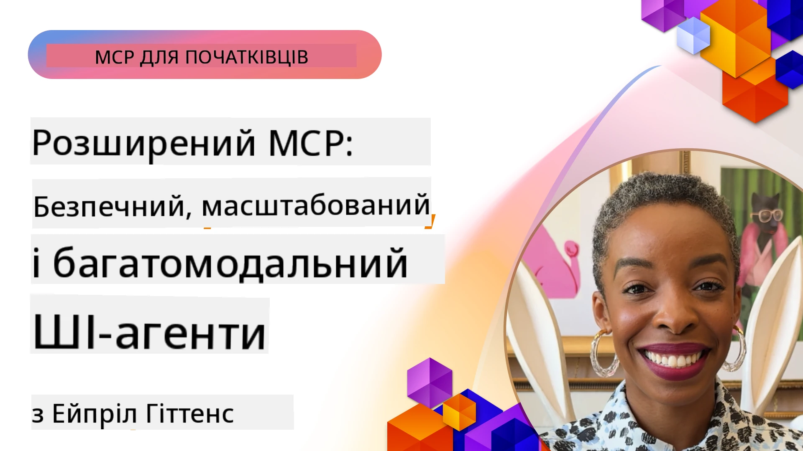

# Розширені теми в MCP

_(Натисніть на зображення вище, щоб переглянути відео цього уроку)_

У цій главі розглядається низка розширених тем у впровадженні Протоколу Контексту Моделі (MCP), включно з мультимодальною інтеграцією, масштабованістю, найкращими практиками безпеки та інтеграцією в підприємства. Ці теми є ключовими для створення надійних та готових до продуктивної експлуатації застосунків MCP, які можуть задовольняти вимоги сучасних систем штучного інтелекту.

## Огляд

Цей урок досліджує розширені концепції впровадження Протоколу Контексту Моделі, зосереджуючись на мультимодальній інтеграції, масштабованості, найкращих практиках безпеки та інтеграції в підприємства. Ці теми є необхідними для створення MCP-застосунків виробничого рівня, які можуть справлятися зі складними вимогами в корпоративному середовищі.

> **Примітка до поточної специфікації:** MCP `2026-07-28` позначає застарілими примітиви Roots та
> Sampling, розглянуті в уроках 5.4 та 5.6. Також вона переміщує
> експериментальну функцію Tasks, згадану в Protocol Features (5.16), до
> окремого розширення Tasks. Ці уроки збережено для застарілих
> реалізацій `2025-11-25` і включають керівництво з міграції. Дивіться
> [Що змінилося в MCP: Специфікація 2026-07-28](../01-CoreConcepts/mcp-2026-07-28.md).

## Навчальні цілі

По завершенню цього уроку ви зможете:

- Впроваджувати мультимодальні можливості у рамках MCP
- Проєктувати масштабовані архітектури MCP для сценаріїв з високим навантаженням
- Застосовувати найкращі практики безпеки відповідно до принципів безпеки MCP
- Інтегрувати MCP із корпоративними системами та фреймворками AI
- Оптимізувати продуктивність і надійність у виробничому середовищі

## Уроки та прикладні проєкти

| Посилання | Назва | Опис |
|------|-------|-------------|
| [5.1 Integration with Azure](./mcp-integration/README.md) | Інтеграція з Azure | Дізнайтеся, як інтегрувати ваш MCP сервер на Azure |
| [5.2 Multi modal sample](./mcp-multi-modality/README.md) | Приклади MCP з мультимодальністю | Приклади для аудіо, зображень і мультимодальної відповіді |
| [5.3 MCP OAuth2 sample](../../../05-AdvancedTopics/mcp-oauth2-demo) | Демонстрація MCP OAuth2 | Мінімальний додаток Spring Boot, що демонструє OAuth2 з MCP, як сервер авторизації та ресурсів. Демонструє безпечне видавання токенів, захищені кінцеві точки, розгортання на Azure Container Apps та інтеграцію з API Management. |
| [5.4 Root Contexts](./mcp-root-contexts/README.md) | Кореневі контексти | Вивчіть застарілий примітив Roots `2025-11-25` та поточні варіанти міграції (позначено застарілим у `2026-07-28`) |
| [5.5 Routing](./mcp-routing/README.md) | Маршрутизація | Вивчіть різні типи маршрутизації |
| [5.6 Sampling](./mcp-sampling/README.md) | Вибірка | Вивчіть застарілий примітив Sampling `2025-11-25` та поточні варіанти міграції (позначено застарілим у `2026-07-28`) |
| [5.7 Scaling](./mcp-scaling/README.md) | Масштабування | Дізнайтеся про масштабування |
| [5.8 Security](./mcp-security/README.md) | Безпека | Захистіть свій MCP сервер |
| [5.9 Web Search sample](./web-search-mcp/README.md) | Веб-пошук MCP | Python MCP сервер і клієнт, що інтегруються з SerpAPI для пошуку у реальному часі в інтернеті, новинах, продуктах та запитаннях і відповідях. Демонструє оркестровку мультіінструментів, інтеграцію з зовнішніми API та надійну обробку помилок. |
| [5.10 Realtime Streaming](./mcp-realtimestreaming/README.md) | Потокове передавання | Потокове передавання даних у реальному часі стало необхідним у сучасному світі, де бізнеси та застосунки потребують миттєвого доступу до інформації для своєчасних рішень. |
| [5.11 Realtime Web Search](./mcp-realtimesearch/README.md) | Веб-пошук | Як MCP трансформує веб-пошук у реальному часі, забезпечуючи стандартизований підхід до керування контекстом між AI-моделями, пошуковими системами та застосунками. |
| [5.12  Entra ID Authentication for Model Context Protocol Servers](./mcp-security-entra/README.md) | Аутентифікація Entra ID | Microsoft Entra ID пропонує надійне хмарне рішення для управління ідентифікацією та доступом, допомагаючи гарантувати, що лише авторизовані користувачі та застосунки можуть взаємодіяти з вашим MCP сервером. |
| [5.13 Microsoft Foundry Agent Integration](./mcp-foundry-agent-integration/README.md) | Інтеграція з Microsoft Foundry | Дізнайтеся, як інтегрувати сервери MCP з агентами Microsoft Foundry, що дає змогу потужної оркестровки інструментів та можливостей корпоративного штучного інтелекту з стандартизованими підключеннями до зовнішніх джерел даних. |
| [5.14 Context Engineering](./mcp-contextengineering/README.md) | Інжиніринг контексту | Майбутні можливості інженерії контексту для серверів MCP, включно з оптимізацією контексту, динамічним керуванням контекстом та стратегіями ефективного інжинірингу підказок в рамках MCP. |
| [5.15 MCP Custom Transport](./mcp-transport/README.md) | Користувацький транспорт | Дізнайтеся, як реалізувати користувацькі механізми транспорту для спеціалізованих сценаріїв комунікації MCP. |
| [5.16 Protocol Features Deep Dive](./mcp-protocol-features/README.md) | Особливості протоколу | Опановуйте розширені функції протоколу, включно з повідомленнями про прогрес, скасуванням запитів, шаблонами ресурсів та патернами обробки помилок. |
| [5.17 Adversarial Multi-Agent Reasoning](./mcp-adversarial-agents/README.md) | Конкуренція багатьох агентів | Використовуйте двох агентів з протилежними позиціями, які спільно використовують набір інструментів MCP, щоб виявляти галюцинації, виявляти крайні випадки та генерувати кращі калібровані виходи через структуровані дебати. |

> **Історична примітка `2025-11-25`:** ця ревізія впровадила експериментальні
> Tasks та розширила кілька функцій протоколу. У `2026-07-28` Tasks перемістили в
> офіційне розширення, а Roots стало застарілим. Не використовуйте
> статус функцій `2025-11-25` як поточне керівництво; дивіться
> [журнал змін 2026-07-28](https://modelcontextprotocol.io/specification/2026-07-28/changelog).

## Додаткові посилання

Для найактуальнішої інформації про розширені теми MCP звертайтеся до:
- [Документація MCP](https://modelcontextprotocol.io/)
- [Специфікація MCP (2026-07-28)](https://modelcontextprotocol.io/specification/2026-07-28/)
- [Репозиторій GitHub](https://github.com/modelcontextprotocol)
- [OWASP MCP Top 10](https://microsoft.github.io/mcp-azure-security-guide/mcp/) - Ризики безпеки та заходи пом'якшення
- [Майстерня MCP Security Summit (Sherpa)](https://azure-samples.github.io/sherpa/) - Практичне навчання з безпеки

## Ключові висновки

- Впровадження мультимодальності MCP розширює можливості штучного інтелекту за межі обробки тексту
- Масштабованість є необхідною для корпоративного розгортання та може бути реалізована через горизонтальне та вертикальне масштабування
- Комплексні заходи безпеки захищають дані та забезпечують належний контроль доступу
- Інтеграція в підприємства з платформами такими як Azure OpenAI та Microsoft AI Foundry розширює можливості MCP
- Розширені впровадження MCP виграють від оптимізованих архітектур та ретельного управління ресурсами

## Вправа

Розробіть корпоративне впровадження MCP для конкретного випадку використання:

1. Визначте мультимодальні вимоги для вашого випадку використання
2. Опишіть контрольно-безпечні заходи для захисту чутливих даних
3. Запроєктуйте масштабовану архітектуру, що може впоратися з різним навантаженням
4. Заплануйте інтеграційні точки з корпоративними системами AI
5. Документуйте потенційні вузькі місця продуктивності та стратегії їх пом'якшення

## Додаткові ресурси

- [Документація Azure OpenAI](https://learn.microsoft.com/en-us/azure/ai-services/openai/)
- [Документація Microsoft AI Foundry](https://learn.microsoft.com/en-us/ai-services/)

---

## Що далі

Вивчіть уроки цього модуля, починаючи з: [5.1 Інтеграція MCP](./mcp-integration/README.md)

Після завершення цього модуля переходьте до: [Модуль 6: Спільнотні внески](../06-CommunityContributions/README.md)

---

<!-- CO-OP TRANSLATOR DISCLAIMER START -->
**Відмова від відповідальності**:
Цей документ було перекладено за допомогою сервісу штучного інтелекту для перекладу [Co-op Translator](https://github.com/Azure/co-op-translator). Хоча ми прагнемо до точності, будь ласка, майте на увазі, що автоматичні переклади можуть містити помилки або неточності. Оригінальний документ рідною мовою слід вважати авторитетним джерелом. Для критично важливої інформації рекомендується професійний людський переклад. Ми не несемо відповідальності за будь-які непорозуміння або неправильні тлумачення, що виникли внаслідок використання цього перекладу.
<!-- CO-OP TRANSLATOR DISCLAIMER END -->