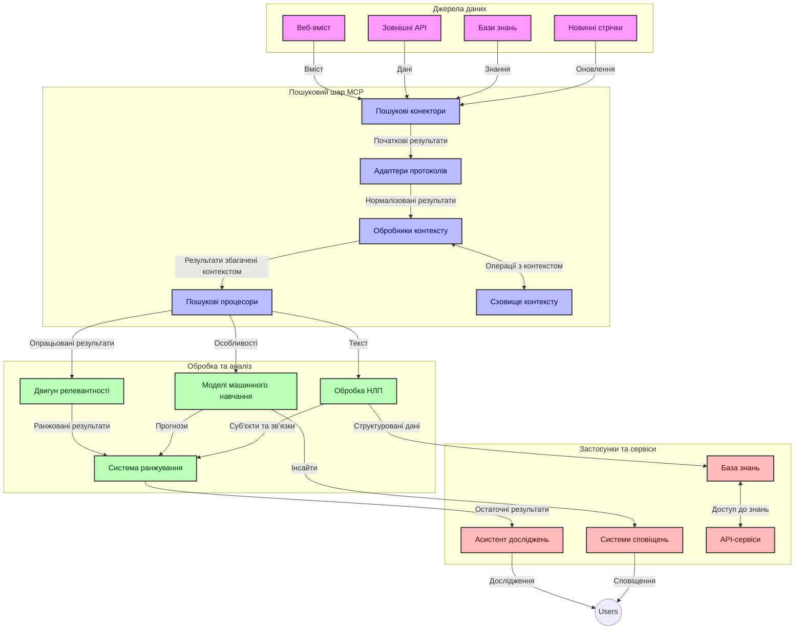
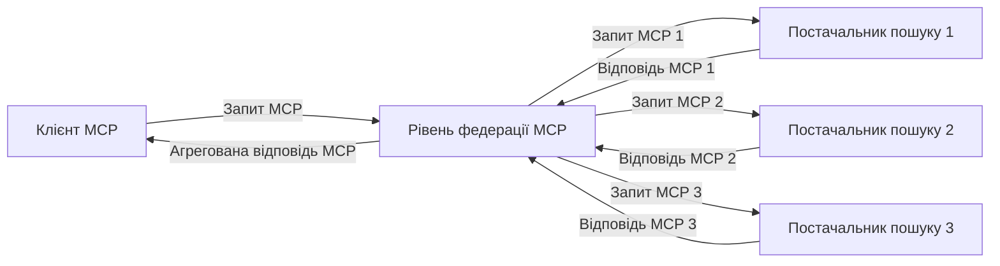
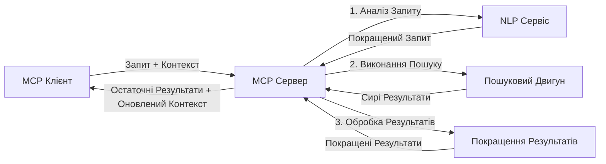

# Протокол Контексту Моделі для Пошуку в Інтернеті в Реальному Часі

## Огляд

Пошук в Інтернеті в реальному часі став надзвичайно важливим у сучасному інформаційному середовищі, де додатки потребують негайного доступу до актуальної інформації в Інтернеті для надання релевантних та своєчасних відповідей. Протокол Контексту Моделі (MCP) представляє значний крок уперед в оптимізації цих процесів пошуку в реальному часі, підвищуючи ефективність пошуку, зберігаючи цілісність контексту та покращуючи загальну продуктивність системи.

Цей модуль досліджує, як MCP трансформує пошук в Інтернеті в реальному часі, забезпечуючи стандартизований підхід до управління контекстом між моделями ШІ, пошуковими системами та додатками.

### Чого Ви Навчитесь

У цьому всебічному посібнику ви дізнаєтеся:

- Як MCP створює безшовний міст між моделями ШІ та можливостями пошуку в Інтернеті в реальному часі
- Архітектурні патерни для впровадження ефективних та масштабованих пошукових рішень за допомогою MCP
- Техніки збереження контексту пошуку через кілька запитів та взаємодій
- Практичні реалізації коду на Python та JavaScript для різних сценаріїв пошуку
- Методи збалансування релевантності, актуальності та продуктивності у системах пошуку на базі MCP

## Вступ до Пошуку в Інтернеті в Реальному Часі

Пошук в Інтернеті в реальному часі — це технологічний підхід, який дозволяє безперервно виконувати запити, обробляти та аналізувати інформацію з Інтернету у момент її публікації чи оновлення, дозволяючи системам надавати свіжу та релевантну інформацію з мінімальною затримкою. На відміну від традиційних пошукових систем, які працюють з індексованими даними, часто застарілими на кілька годин або днів, пошук у реальному часі оперує живими даними з Інтернету, надаючи інформацію, що відображає поточний стан онлайн-контенту.

### Основні Концепції Пошуку в Реальному Часі:

- **Безперервна Обробка Запитів**: Запити обробляються з урахуванням постійно оновлюваних джерел даних
- **Пріоритет Актуальності**: Системи спроєктовані так, щоб надавати перевагу свіжій інформації
- **Баланс між Релевантністю і Актуальністю**: Підтримка балансу між релевантністю та свіжістю інформації
- **Масштабована Архітектура**: Системи мають справлятися з варіабельним навантаженням і обсягами даних
- **Контекстне Розуміння**: Збереження контексту користувача між ітераціями пошуку є ключовим для змістовних результатів
- **Динамічне Формулювання Запитів**: Адаптивне змінення запитів на основі контексту та попередніх результатів
- **Інтеграція з Багатьма Джерелами**: Комбінування результатів від кількох пошукових провайдерів та веб-джерел
- **Семантичне Розуміння**: Обробка запитів і контенту на основі значення, а не лише ключових слів
- **Рейтинг у Реальному Часі**: Постійне коригування рейтингу результатів у міру надходження нової інформації

### Протокол Контексту Моделі і Пошук в Реальному Часі

Протокол Контексту Моделі (MCP) вирішує низку критичних проблем у середовищах пошуку в Інтернеті в реальному часі:

1. **Збереження Контексту Пошуку**: MCP стандартизує спосіб підтримки контексту між розподіленими компонентами пошуку, гарантуючи, що моделі ШІ та вузли обробки мають доступ до релевантної історії запитів і вподобань користувача.

2. **Ефективне Управління Запитами**: Завдяки структурованим механізмам передачі контексту MCP знижує накладні витрати на повторення контексту у кожній ітерації пошуку.

3. **Інтероперабельність**: MCP створює спільну мову для обміну контекстом між різними технологіями пошуку та моделями ШІ, дозволяючи більш гнучкі та розширювані архітектури.

4. **Оптимізований для Пошуку Контекст**: Реалізації MCP можуть пріоритезувати ті елементи контексту, які найбільш важливі для ефективного пошуку, оптимізуючи як продуктивність, так і точність.

5. **Адаптивна Обробка Пошуку**: Завдяки правильному керуванню контекстом через MCP, системи пошуку можуть динамічно коригувати обробку залежно від змінних потреб користувача та інформаційного ландшафту.

У сучасних додатках, від новинних агрегаторів до помічників для досліджень, інтеграція MCP із веб-пошуковими технологіями забезпечує більш інтелектуальний, контекстно-усвідомлений пошук, який може надавати все більш релевантні результати у міру продовження взаємодії з користувачем.

## Цілі Навчання

До кінця цього уроку ви зможете:

- Розуміти основи пошуку в Інтернеті в реальному часі та його виклики у сучасних додатках
- Пояснити, як Протокол Контексту Моделі (MCP) покращує можливості пошуку в Інтернеті в реальному часі
- Розробляти рішення на базі MCP за допомогою популярних фреймворків та API
- Проєктувати і впроваджувати масштабовані, високопродуктивні архітектури пошуку з MCP
- Застосовувати концепції MCP до різних сценаріїв, включаючи семантичний пошук, допомогу в дослідженнях та доповнений ШІ браузинг
- Оцінювати сучасні тенденції та майбутні інновації в технологіях пошуку на базі MCP
- Розробляти контекстно-усвідомлені системи пошуку, які навчаються на взаємодіях користувача
- Інтегрувати веб-пошук у ШІ-помічники за допомогою стандартизованих протоколів MCP
- Створювати багатоступеневі пошукові конвеєри, які поступово уточнюють результати на основі контексту
- Оптимізувати продуктивність пошуку при збереженні повного усвідомлення контексту

### Визначення та Значення

Пошук в Інтернеті в реальному часі передбачає безперервний запит, вилучення та доставку інформації з Інтернету з мінімальною затримкою. На відміну від традиційних пошукових систем, які періодично обходять і індексують Інтернет, пошук у реальному часі спрямований на надання інформації відразу після її появи, забезпечуючи негайний доступ до найактуальнішого контенту.

Ключові характеристики пошуку в Інтернеті в реальному часі включають:

- **Свіжість**: Пріоритет для останнього контенту та оновлень
- **Безперервна Обробка**: Постійний моніторинг нової інформації
- **Адаптація Запитів**: Уточнення пошукових запитів на основі контексту та зворотного зв’язку
- **Негайна Доставка**: Надання результатів пошуку з мінімальною затримкою
- **Збереження Контексту**: Побудова на основі попередніх запитів для покращення релевантності

### Виклики Традиційного Пошуку в Інтернеті

Традиційні підходи до веб-пошуку мають кілька обмежень у контексті застосування до сценаріїв реального часу:

1. **Фрагментація Контексту**: Труднощі у підтриманні контексту пошуку між кількома запитами
2. **Актуальність Інформації**: Виклики у доступі та пріоритезації найновішої інформації
3. **Складність Інтеграції**: Проблеми з інтероперабельністю між пошуковими системами та додатками
4. **Питання Затримки**: Балансування між повним пошуком та вимогами до часу відповіді
5. **Налаштування Релевантності**: Забезпечення точності і релевантності при пріоритезації свіжості

## Розуміння Протоколу Контексту Моделі (MCP) для Пошуку

### Що таке MCP у Контекстах Пошуку?

Протокол Контексту Моделі (MCP) — це стандартизований протокол комунікації, створений для забезпечення ефективної взаємодії між моделями ШІ та додатками. У контексті пошуку в Інтернеті в реальному часі MCP надає структуру для:

- Збереження контексту пошуку протягом послідовності запитів
- Стандартизації форматів запитів і результатів пошуку
- Оптимізації передачі параметрів пошуку та результатів
- Покращення комунікації між моделями та пошуковими системами

### Основні Компоненти та Архітектура

Архітектура MCP для пошуку в Інтернеті в реальному часі складається з кількох ключових компонентів:

1. **Обробники Контексту Запитів**: Управляють та підтримують контекст пошуку між кількома запитами
2. **Процесори Пошуку**: Обробляють вхідні пошукові запити з урахуванням контексту
3. **Адаптери Протоколів**: Конвертують між різними API пошуку, зберігаючи контекст
4. **Сховище Контексту**: Ефективно зберігає і отримує історію пошуку та вподобання
5. **Пошукові Коннектори**: Підключаються до різних пошукових систем та веб-API



### Як MCP Покращує Пошук в Реальному Часі

MCP вирішує традиційні проблеми веб-пошуку через:

- **Безперервність Контексту**: Підтримку зв’язків між запитами протягом усієї сесії пошуку
- **Оптимізовану Передачу**: Зменшення дублювання параметрів пошуку через розумне управління контекстом
- **Стандартизовані Інтерфейси**: Забезпечення узгоджених API для компонент пошуку
- **Зменшення Затримок**: Мінімізація накладних витрат обробки через ефективне керування контекстом
- **Покращена Релевантність**: Підвищення релевантності пошуку за рахунок збереження намірів користувача між кількома запитами

## Інтеграція та Впровадження

Системи пошуку в Інтернеті в реальному часі вимагають ретельного архітектурного проєктування та реалізації для збереження як продуктивності, так і цілісності контексту. Протокол Контексту Моделі пропонує стандартизований підхід до інтеграції моделей ШІ та технологій пошуку, що дозволяє створювати більш складні, контекстноусвідомлені пошукові конвеєри.

### Огляд Інтеграції MCP в Архітектури Пошуку

Впровадження MCP у середовищах пошуку в реальному часі враховує кілька ключових аспектів:

1. **Серіалізація Контексту Пошуку**: MCP надає ефективні механізми кодування контекстної інформації в запитах, гарантуючи, що важливий контекст слідує за запитом по всьому конвеєру обробки. Це включає стандартизовані формати серіалізації, оптимізовані для метаданих пошуку.

2. **Обробка Пошуку зі Збереженням Стану**: MCP дозволяє більш розумну обробку зі збереженням стану, підтримуючи послідовне представлення контексту між ітераціями пошуку. Це особливо цінно у багатоступеневих пошукових конвеєрах, де уточнення контексту покращує результати.

3. **Розширення та Уточнення Запитів**: Реалізації MCP у пошукових системах можуть полегшувати складне розширення і уточнення запитів на основі накопиченого контексту, дозволяючи отримувати все більш релевантні результати в процесі пошукової сесії.

4. **Кешування та Пріоритизація Результатів**: Завдяки стандартизації обробки контексту MCP допомагає керувати кешуванням і пріоритезацією результатів, дозволяючи компонентам адаптуватися відповідно до змін контексту пошуку.

5. **Федерація і Агрегація Пошуку**: MCP сприяє більш складній федерації пошуку між кількома бекендами, надаючи структуровані уявлення про контекст пошуку, що забезпечує змістовніше агрегування результатів із різних джерел.

Впровадження MCP у різні пошукові технології створює єдиний підхід до управління контекстом, знижуючи потребу у власноручному коді інтеграції і покращуючи здатність системи підтримувати змістовний контекст у міру розвитку пошукових запитів.

### MCP у Різних Реалізаціях Веб-Пошуку

Ці приклади відповідають поточній специфікації MCP, яка фокусується на протоколі JSON-RPC з різними транспортними механізмами. Код демонструє, як можна реалізувати власні інтеграції пошуку, зберігаючи повну сумісність з протоколом MCP.


<details>
<summary>Реалізація на Python із Загальним API Пошуку</summary>

```python
import asyncio
import json
import aiohttp
from typing import Dict, Any, Optional, List
from contextlib import asynccontextmanager
from collections.abc import AsyncIterator

# Імпортувати стандартні бібліотеки MCP
from mcp.client.session import ClientSession
from mcp.client.streamable_http import streamablehttp_client
from mcp.types import TextContent, CreateMessageRequestParams, CreateMessageResult
from mcp.server.fastmcp import FastMCP

# Створити сервер FastMCP для веб-пошуку
search_server = FastMCP("WebSearch")

# Клас для обробки операцій веб-пошуку
class WebSearchHandler:
    def __init__(self, api_endpoint: str, api_key: str):
        self.api_endpoint = api_endpoint
        self.api_key = api_key
        self.session = None
        
    async def initialize(self):
        """Initialize the HTTP session"""
        self.session = aiohttp.ClientSession(
            headers={"Authorization": f"Bearer {self.api_key}"}
        )
    
    async def close(self):
        """Close the HTTP session"""
        if self.session:
            await self.session.close()
            
    async def perform_search(self, query: str, max_results: int = 5, 
                           include_domains: List[str] = None, 
                           exclude_domains: List[str] = None,
                           time_period: str = "any") -> Dict[str, Any]:
        """Perform web search using the search API"""
        # Побудувати параметри пошуку
        search_params = {
            "q": query,
            "limit": max_results,
            "time": time_period
        }
        
        if include_domains:
            search_params["site"] = ",".join(include_domains)
            
        if exclude_domains:
            search_params["exclude_site"] = ",".join(exclude_domains)
        
        # Виконати запит пошуку
        try:
            async with self.session.get(
                self.api_endpoint,
                params=search_params
            ) as response:
                if response.status != 200:
                    error_text = await response.text()
                    raise Exception(f"Search API error: {response.status} - {error_text}")
                
                search_data = await response.json()
                
                # Перетворити специфічну відповідь API у стандартний формат
                results = []
                for item in search_data.get("results", []):
                    results.append({
                        "title": item.get("title", ""),
                        "url": item.get("url", ""),
                        "snippet": item.get("snippet", ""),
                        "date": item.get("published_date", ""),
                        "source": item.get("source", "")
                    })
                
                return {
                    "query": query,
                    "totalResults": len(results),
                    "results": results
                }
        except Exception as e:
            print(f"Search API request error: {e}")
            raise

# Ініціалізувати обробник пошуку
search_handler = WebSearchHandler(
    api_endpoint="https://api.search-service.example/search",
    api_key="your-api-key-here"
)

# Налаштувати тривалість життя для керування обробником пошуку
@asyncio.asynccontextmanager
async def app_lifespan(server: FastMCP):
    """Manage application lifecycle"""
    await search_handler.initialize()
    try:
        yield {"search_handler": search_handler}
    finally:
        await search_handler.close()

# Встановити тривалість життя сервера
search_server = FastMCP("WebSearch", lifespan=app_lifespan)

# Зареєструвати інструмент веб-пошуку
@search_server.tool()
async def web_search(query: str, max_results: int = 5, 
                   include_domains: List[str] = None,
                   exclude_domains: List[str] = None,
                   time_period: str = "any") -> Dict[str, Any]:
    """
    Search the web for information
    
    Args:
        query: The search query
        max_results: Maximum number of results to return (default: 5)
        include_domains: List of domains to include in search results
        exclude_domains: List of domains to exclude from search results
        time_period: Time period for results ("day", "week", "month", "any")
        
    Returns:
        Dictionary containing search results
    """
    ctx = search_server.get_context()
    search_handler = ctx.request_context.lifespan_context["search_handler"]
    
    results = await search_handler.perform_search(
        query=query,
        max_results=max_results,
        include_domains=include_domains,
        exclude_domains=exclude_domains,
        time_period=time_period
    )
    
    return results

# Приклад використання клієнта
async def client_example():
    # Підключитися до сервера пошуку за допомогою Streamable HTTP транспорт
    async with streamablehttp_client("http://localhost:8000/mcp") as (read, write, _):
        async with ClientSession(read, write) as session:
            # Ініціалізувати з’єднання
            await session.initialize()
            
            # Викликати інструмент web_search
            search_results = await session.call_tool(
                "web_search", 
                {
                    "query": "latest developments in AI and Model Context Protocol",
                    "max_results": 5,
                    "time_period": "day",
                    "include_domains": ["github.com", "microsoft.com"]
                }
            )
            
            print(f"Search results: {search_results}")

# Приклад запуску сервера
if __name__ == "__main__":
    # Запустити сервер з Streamable HTTP транспортом
    search_server.run(transport="streamable-http")
```
</details> 

<details>
<summary>Реалізація на JavaScript для Пошуку через Браузер</summary>


```javascript
// Реалізація сервера MCP для веб-пошуку
import { McpServer, ResourceTemplate } from '@modelcontextprotocol/sdk/server/mcp.js';
import { StreamableHTTPServerTransport } from '@modelcontextprotocol/sdk/server/streamableHttp.js';
import { z } from 'zod';

// Створити сервер MCP для веб-пошуку
const searchServer = new McpServer({
    name: "BrowserSearch",
    description: "A server that provides web search capabilities"
});

// Клас сервісу пошуку
class SearchService {
    constructor(searchApiUrl, apiKey) {
        this.searchApiUrl = searchApiUrl;
        this.apiKey = apiKey;
    }

    async performSearch(parameters) {
        const {
            query = '',
            maxResults = 5,
            includeDomains = [],
            excludeDomains = [],
            timePeriod = 'any'
        } = parameters;
        
        // Побудувати URL пошуку з параметрами
        const url = new URL(this.searchApiUrl);
        url.searchParams.append('q', query);
        url.searchParams.append('limit', maxResults);
        url.searchParams.append('time', timePeriod);
        
        if (includeDomains.length > 0) {
            url.searchParams.append('site', includeDomains.join(','));
        }
        
        if (excludeDomains.length > 0) {
            url.searchParams.append('exclude_site', excludeDomains.join(','));
        }
        
        try {
            const response = await fetch(url.toString(), {
                method: 'GET',
                headers: {
                    'Authorization': `Bearer ${this.apiKey}`,
                    'Content-Type': 'application/json'
                }
            });
            
            if (!response.ok) {
                const errorText = await response.text();
                throw new Error(`Search API error: ${response.status} - ${errorText}`);
            }
            
            const searchData = await response.json();
            
            // Перетворити специфічну відповідь API у стандартний формат
            const results = searchData.results?.map(item => ({
                title: item.title || '',
                url: item.url || '',
                snippet: item.snippet || '',
                date: item.published_date || '',
                source: item.source || ''
            })) || [];
            
            return {
                query,
                totalResults: results.length,
                results
            };
        } catch (error) {
            console.error('Search API request error:', error);
            throw error;
        }
    }
}

// Ініціалізувати сервіс пошуку
const searchService = new SearchService(
    'https://api.search-service.example/search',
    'your-api-key-here'
);

// Налаштувати постачальника контексту для сервера
searchServer.setContextProvider(() => {
    return {
        searchService
    };
});

// Зареєструвати інструмент веб-пошуку
searchServer.tool({
    name: 'web_search',
    description: 'Search the web for information',
    parameters: {
        type: 'object',
        properties: {
            query: {
                type: 'string',
                description: 'The search query'
            },
            maxResults: {
                type: 'integer',
                description: 'Maximum number of results to return',
                default: 5
            },
            includeDomains: {
                type: 'array',
                items: { type: 'string' },
                description: 'List of domains to include in search results'
            },
            excludeDomains: {
                type: 'array',
                items: { type: 'string' },
                description: 'List of domains to exclude from search results'
            },
            timePeriod: {
                type: 'string',
                description: 'Time period for results',
                enum: ['day', 'week', 'month', 'any'],
                default: 'any'
            }
        },
        required: ['query']
    },
    handler: async (params, context) => {
        const { searchService } = context;
        return await searchService.performSearch(params);
    }
});

// Приклад коду клієнта для підключення до сервера пошуку
import { Client } from '@modelcontextprotocol/sdk/client/index.js';
import { StreamableHTTPClientTransport } from '@modelcontextprotocol/sdk/client/streamableHttp.js';

async function connectToSearchServer() {
    // Підключитися до сервера пошуку
    const transport = new StreamableHTTPClientTransport(
        new URL('http://localhost:8000/mcp')
    );
    
    const client = new Client({
        name: 'search-client',
        version: '1.0.0'
    });
    
    await client.connect(transport);
    
    // Виконати інструмент пошуку
    const searchResults = await client.callTool({
        name: 'web_search',
        arguments: {
            query: 'Model Context Protocol implementation examples',
            maxResults: 10,
            timePeriod: 'week',
            includeDomains: ['github.com', 'docs.microsoft.com']
        }
    });
    
    console.log('Search results:', searchResults);
    
    // Очищення
    await client.disconnect();
}

// Запустити сервер
const transport = new StreamableHTTPServerTransport();
await searchServer.connect(transport);
console.log('Search server running at http://localhost:8000/mcp');

// В окремому процесі або після запуску сервера
// connectToSearchServer().catch(console.error);
```
</details> 


## Відмова від Відповідальності щодо Прикладів Коду

> **Важлива Примітка**: Наведені нижче приклади коду демонструють інтеграцію Протоколу Контексту Моделі (MCP) із функціями веб-пошуку. Хоча вони слідують патернам і структурам офіційних SDK MCP, їх було спрощено в освітніх цілях.
> 
> Ці приклади ілюструють:
> 
> 1. **Реалізація на Python**: Сервер FastMCP, що надає інструмент веб-пошуку та підключається до зовнішнього API пошуку. Цей приклад демонструє правильне управління часом життя, обробку контексту і реалізацію інструментів згідно з патернами [офіційного MCP Python SDK](https://github.com/modelcontextprotocol/python-sdk). Сервер використовує рекомендований Streamable HTTP транспорт, який замінив старіший SSE транспорт для виробничих розгортань.
> 
> 2. **Реалізація на JavaScript**: Реалізація на TypeScript/JavaScript за патерном FastMCP з [офіційного MCP TypeScript SDK](https://github.com/modelcontextprotocol/typescript-sdk) для створення серверу пошуку з коректними визначеннями інструментів і клієнтськими підключеннями. Вона слідує останнім рекомендованим патернам для управління сесіями та збереження контексту.
> 
> Для виробничого використання ці приклади потребують додаткової обробки помилок, аутентифікації та коду інтеграції конкретних API. Наведені кінцеві точки API пошуку (`https://api.search-service.example/search`) є заповнювачами і мають бути замінені на реальні кінцеві точки сервісів пошуку.
> 
> Для повних деталей впровадження та найактуальніших підходів,
> звертайтеся до [офіційної специфікації MCP](https://modelcontextprotocol.io/specification/2026-07-28/)
> та документації SDK.

## Основні Концепції

### Фреймворк Протоколу Контексту Моделі (MCP)

По суті, Протокол Контексту Моделі забезпечує стандартизований спосіб обміну контекстом між моделями ШІ, додатками і сервісами. У пошуку в Інтернеті в реальному часі цей фреймворк є важливим для створення послідовних пошукових діалогів з багатьма кроками. Ключові компоненти включають:

1. **Клієнт-Серверна Архітектура**: MCP визначає чітке розділення між клієнтами пошуку (ініціаторами запитів) та серверами пошуку (постачальниками послуг), що дозволяє гнучкі моделі розгортання.

2. **Комунікація через JSON-RPC**: Протокол використовує JSON-RPC для обміну повідомленнями, що робить його сумісним з веб-технологіями і простим у реалізації на різних платформах.

3. **Управління Контекстом**: MCP визначає структуровані методи для підтримки, оновлення та використання контексту пошуку між численними взаємодіями.

4. **Визначення Інструментів**: Можливості пошуку представлені як стандартизовані інструменти з чітко визначеними параметрами та результатами.

5. **Підтримка Стрімінгу**: Протокол підтримує потокову передачу результатів, що необхідно для пошуку в реальному часі, коли результати можуть надходити поступово.

### Патерни Інтеграції Веб-Пошуку

Під час інтеграції MCP з веб-пошуком можна виділити кілька патернів:

#### 1. Пряма Інтеграція Постачальника Пошуку


У цьому патерні сервер MCP напряму взаємодіє з одним або кількома API пошуку, транслюючи запити MCP у специфічні виклики API та форматуючи результати як відповіді MCP.

#### 2. Федеративний Пошук з Підтримкою Контексту



Цей патерн розподіляє пошукові запити між кількома сумісними з MCP постачальниками пошуку, кожен з яких може спеціалізуватися на різних типах контенту чи можливостях пошуку, підтримуючи єдиний контекст.

#### 3. Ланцюжок Пошуку з Посиленим Контекстом



У цьому патерні процес пошуку поділяється на кілька етапів, при цьому контекст уточнюється на кожному кроці, що призводить до поступового покращення результатів.

### Компоненти Контексту Пошуку

У веб-пошуку на основі MCP контекст зазвичай включає:

- **Історія Запитів**: Попередні пошукові запити в сесії
- **Вподобання Користувача**: Мова, регіон, налаштування безпечного пошуку
- **Історія Взаємодій**: Які результати були клацнуті, час, проведений на результатах
- **Параметри Пошуку**: Фільтри, порядок сортування та інші модифікатори пошуку
- **Доменні Знання**: Контекст, специфічний для теми пошуку
- **Темпоральний Контекст**: Залежність релевантності від часу
- **Вподобання Джерел**: Довірені або пріоритетні джерела інформації

## Сценарії Використання та Застосування

### Дослідження та Збір Інформації

MCP покращує робочі процеси досліджень через:

- Збереження контексту досліджень між сесіями пошуку
- Забезпечення складніших і контекстно-релевантних запитів
- Підтримку федеративного пошуку з багатьох джерел
- Сприяння вилученню знань із результатів пошуку

### Моніторинг Новин і Трендів у Реальному Часі

Пошук на базі MCP пропонує переваги для моніторингу новин:

- Виявлення нових історій майже в реальному часі
- Контекстне фільтрування релевантної інформації
- Відстеження тем і сутностей по багатьох джерелах
- Персоналізовані новинні сповіщення на основі контексту користувача

### Доповнений ШІ Браузинг та Дослідження

MCP створює нові можливості для доповненого ШІ браузингу:

- Контекстні пропозиції пошуку на основі поточної активності браузера
- Безшовна інтеграція веб-пошуку з помічниками на базі великих мовних моделей
- Уточнення пошуку з багатьма кроками з підтримкою контексту
- Покращена перевірка фактів та верифікація інформації

## Майбутні Тенденції та Інновації

### Еволюція MCP у Веб-Пошуку

Дивлячись у майбутнє, ми очікуємо, що MCP буде розвиватися з метою вирішення:


- **Мультимодальний пошук**: інтеграція пошуку за текстом, зображеннями, аудіо та відео з збереженням контексту
- **Децентралізований пошук**: підтримка розподілених та федеративних пошукових екосистем
- **Конфіденційність пошуку**: механізми збереження конфіденційності з урахуванням контексту
- **Розуміння запиту**: глибинний семантичний аналіз пошукових запитів природною мовою

### Потенційні технологічні досягнення

Новітні технології, які формуватимуть майбутнє пошуку MCP:

1. **Нейронні пошукові архітектури**: пошукові системи на основі вбудов (embedding), оптимізовані для MCP
2. **Персоналізований контекст пошуку**: навчання індивідуальних шаблонів пошуку користувачів з часом
3. **Інтеграція графів знань**: контекстний пошук, покращений галузевими графами знань
4. **Крос-модальний контекст**: збереження контексту через різні модальності пошуку

## Практичні вправи

### Вправа 1: Налаштування базового пошукового конвеєра MCP

У цій вправі ви навчитеся:
- Налаштовувати базове пошукове середовище MCP
- Впроваджувати обробники контексту для веб-пошуку
- Тестувати та перевіряти збереження контексту між ітераціями пошуку

### Вправа 2: Створення наукового асистента з пошуком MCP

Створіть повний додаток, який:
- Обробляє наукові запитання природною мовою
- Виконує контекстно-обізнаний веб-пошук
- Синтезує інформацію з кількох джерел
- Презентує організовані результати досліджень

### Вправа 3: Реалізація федерації пошуку з кількох джерел у MCP

Просунута вправа, що охоплює:
- Контекстно-обізнану відправку запитів на кілька пошукових систем
- Ранжування та агрегування результатів
- Контекстну дедуплікацію результатів пошуку
- Обробку метаданих, специфічних для джерел

## Додаткові ресурси

- [Model Context Protocol Specification](https://modelcontextprotocol.io/specification/2026-07-28/) - офіційна специфікація MCP та детальна документація протоколу
- [Model Context Protocol Documentation](https://modelcontextprotocol.io/) - детальні навчальні посібники та керівництва з реалізації
- [MCP Python SDK](https://github.com/modelcontextprotocol/python-sdk) - офіційна реалізація MCP протоколу на Python
- [MCP TypeScript SDK](https://github.com/modelcontextprotocol/typescript-sdk) - офіційна реалізація MCP протоколу на TypeScript
- [MCP Reference Servers](https://github.com/modelcontextprotocol/servers) - еталонні реалізації серверів MCP
- [Bing Web Search API Documentation](https://learn.microsoft.com/en-us/bing/search-apis/bing-web-search/overview) - API веб-пошуку Microsoft
- [Google Custom Search JSON API](https://developers.google.com/custom-search/v1/overview) - програмований пошуковий движок Google
- [SerpAPI Documentation](https://serpapi.com/search-api) - API для отримання сторінок результатів пошуку
- [Meilisearch Documentation](https://www.meilisearch.com/docs) - пошуковий движок з відкритим кодом
- [Elasticsearch Documentation](https://www.elastic.co/guide/index.html) - розподілений движок пошуку та аналітики
- [LangChain Documentation](https://python.langchain.com/docs/get_started/introduction) - створення додатків з LLM

## Результати навчання

Завершивши цей модуль, ви зможете:

- Розуміти основи веб-пошуку в режимі реального часу та його виклики
- Пояснювати, як Model Context Protocol (MCP) покращує можливості веб-пошуку в режимі реального часу
- Впроваджувати пошукові рішення на основі MCP за допомогою популярних фреймворків та API
- Проєктувати та запускати масштабовані, продуктивні пошукові архітектури з MCP
- Застосовувати концепції MCP у різноманітних випадках, включаючи семантичний пошук, допомогу у дослідженнях та браузинг з підтримкою ШІ
- Оцінювати нові тенденції та майбутні інновації у технологіях пошуку на основі MCP


### Питання довіри та безпеки

При впровадженні пошукових рішень MCP пам’ятайте про важливі принципи зі специфікації MCP:

1. **Згода та контроль користувача**: користувачі повинні явно давати згоду і усвідомлювати всі операції з доступу до даних. Це особливо важливо для веб-пошукових рішень, які можуть отримувати доступ до зовнішніх джерел даних.

2. **Конфіденційність даних**: забезпечуйте належну обробку пошукових запитів та результатів, особливо, якщо вони можуть містити конфіденційну інформацію. Впроваджуйте відповідні механізми контролю доступу для захисту даних користувачів.

3. **Безпека інструментів**: впроваджуйте належну авторизацію та валідацію для пошукових інструментів, оскільки вони можуть становити ризики безпеки через виконання довільного коду. Опис поведінки інструментів слід вважати ненадійним, якщо він отриманий не з довіреного сервера.

4. **Чітка документація**: надавайте зрозумілу документацію про можливості, обмеження та питання безпеки вашої реалізації MCP, дотримуючись рекомендацій зі специфікації MCP.

5. **Надійні потоки згоди**: створюйте надійні процеси згоди та авторизації, які чітко пояснюють, що робить кожен інструмент перед тим, як дозволити його використання, особливо для інструментів, що працюють із зовнішніми веб-ресурсами.

Для повної інформації про безпеку MCP і розгляду питань довіри звертайтесь до
[офіційної документації](https://modelcontextprotocol.io/specification/2026-07-28/basic/security_best_practices).

## Що далі

- [5.12 Аутентифікація Entra ID для серверів Model Context Protocol](../mcp-security-entra/README.md)

---

<!-- CO-OP TRANSLATOR DISCLAIMER START -->
**Відмова від відповідальності**:
Цей документ було перекладено за допомогою сервісу штучного інтелекту для перекладу [Co-op Translator](https://github.com/Azure/co-op-translator). Хоча ми прагнемо до точності, будь ласка, майте на увазі, що автоматичні переклади можуть містити помилки або неточності. Оригінальний документ рідною мовою слід вважати авторитетним джерелом. Для критично важливої інформації рекомендується професійний людський переклад. Ми не несемо відповідальності за будь-які непорозуміння або неправильні тлумачення, що виникли внаслідок використання цього перекладу.
<!-- CO-OP TRANSLATOR DISCLAIMER END -->