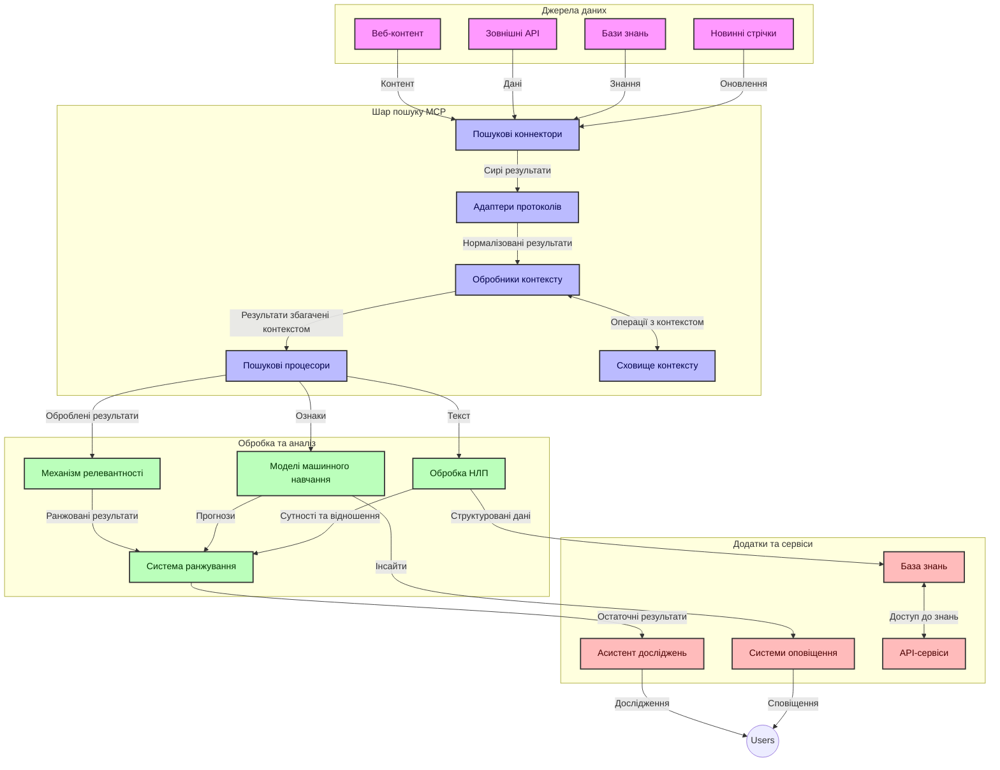
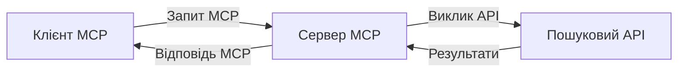
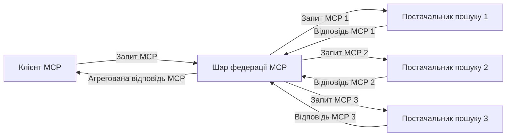
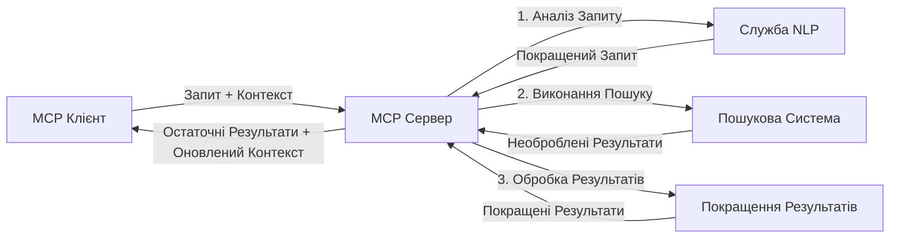

# Протокол контексту моделі для пошуку в Інтернеті в реальному часі

## Огляд

Пошук в Інтернеті в реальному часі став необхідним у сучасному інформаційному середовищі, де додатки потребують негайного доступу до актуальної інформації по всьому інтернету для забезпечення релевантних і своєчасних відповідей. Протокол контексту моделі (MCP) є значним кроком уперед у оптимізації цих процесів пошуку в реальному часі, підвищуючи ефективність пошуку, зберігаючи контекстуальну цілісність та покращуючи загальну продуктивність системи.

Цей модуль досліджує, як MCP трансформує пошук в Інтернеті в реальному часі, надаючи стандартизований підхід до управління контекстом між AI-моделями, пошуковими системами та додатками.

### Чому ви навчитесь

У цьому детальному керівництві ви дізнаєтесь:

- Як MCP створює безшовний міст між AI-моделями та можливостями пошуку в реальному часі
- Архітектурні патерни для впровадження ефективних та масштабованих рішень пошуку з MCP
- Техніки збереження контексту пошуку через кілька запитів та взаємодій
- Практичні реалізації коду на Python та JavaScript для різних сценаріїв пошуку
- Методи балансування релевантності, свіжості та продуктивності у пошукових системах на основі MCP

## Вступ до пошуку в Інтернеті в реальному часі

Пошук в Інтернеті в реальному часі — це технологічний підхід, який дозволяє безперервний запит, обробку та аналіз інформації з вебу під час її публікації або оновлення, забезпечуючи системи свіжою та релевантною інформацією з мінімальною затримкою. На відміну від традиційних пошукових систем, які працюють на основі проіндексованих даних, що можуть бути застарілими на години або дні, реальний час пошуку обробляє живі дані з вебу, надаючи інсайти та інформацію, що відображають поточний стан онлайн-контенту.

### Основні концепції пошуку в Інтернеті в реальному часі:

- **Безперервна обробка запитів**: Запити обробляються проти постійно оновлюваних джерел даних
- **Пріоритет свіжості**: Системи розроблені для надання переваги свіжій інформації
- **Балансування релевантності**: Підтримка балансу між релевантністю і свіжістю
- **Масштабована архітектура**: Система має справлятися із змінними навантаженнями запитів і обсягами даних
- **Контекстуальне розуміння**: Підтримка контексту користувача між ітераціями пошуку є ключем до змістовних результатів
- **Динамічне реформулювання запитів**: Адаптивне змінювання запитів на основі контексту та попередніх результатів
- **Інтеграція багатьох джерел**: Поєднання результатів від різних пошукових провайдерів та веб-ресурсів
- **Семантичне розуміння**: Обробка запитів і контенту на основі значення, а не просто ключових слів
- **Позиціонування в реальному часі**: Безперервне коригування рейтингу результатів із появою нової інформації

### Протокол контексту моделі та пошук у реальному часі

Протокол контексту моделі (MCP) вирішує кілька критичних викликів у середовищах пошуку в реальному часі:

1. **Збереження контексту пошуку**: MCP стандартизує спосіб збереження контексту між розподіленими компонентами пошуку, гарантуючи, що AI-моделі і вузли обробки мають доступ до релевантної історії запитів та уподобань користувача.

2. **Ефективне управління запитами**: Забезпечуючи структуровані механізми передачі контексту, MCP знижує накладні витрати пов’язані з повторенням контексту в кожній ітерації пошуку.

3. **Інтероперабельність**: MCP створює спільну мову для обміну контекстом між різними пошуковими технологіями та AI-моделями, дозволяючи більш гнучкі і розширювані архітектури.

4. **Оптимізований контекст для пошуку**: Реалізації MCP можуть пріоритетно обирати, які елементи контексту є найбільш релевантними для ефективного пошуку, оптимізуючи одночасно продуктивність і точність.

5. **Адаптивна обробка пошуку**: Завдяки належному управлінню контекстом через MCP, пошукові системи можуть динамічно регулювати обробку на основі змінних потреб користувача та інформаційного ландшафту.

У сучасних додатках, від агрегаторів новин до асистентів для досліджень, інтеграція MCP з технологіями веб-пошуку забезпечує більш інтелектуальний, контекстно-усвідомлений пошук, здатний надавати дедалі релевантніші результати з розвитком взаємодії користувача.

## Навчальні цілі

Наприкінці цього уроку ви зможете:

- Зрозуміти основи пошуку в Інтернеті в реальному часі та його виклики в сучасних додатках
- Пояснити, як Протокол контексту моделі (MCP) покращує можливості пошуку в реальному часі
- Реалізувати рішення пошуку на основі MCP, використовуючи популярні фреймворки та API
- Проєктувати та впроваджувати масштабовані, високопродуктивні архітектури пошуку з MCP
- Застосовувати концепції MCP до різних випадків використання, включаючи семантичний пошук, дослідницьку допомогу та пошук з доповненням AI
- Оцінювати нові тенденції та майбутні інновації у технологіях пошуку на базі MCP
- Розробляти системи пошуку з урахуванням контексту, які навчаються на взаємодії з користувачем
- Інтегрувати можливості веб-пошуку в AI-асистентів за допомогою стандартизованих протоколів MCP
- Створювати багатоступеневі пошукові конвеєри, які поступово уточнюють результати на основі контексту
- Оптимізувати продуктивність пошуку, зберігаючи всебічне усвідомлення контексту

### Визначення та значення

Пошук в Інтернеті в реальному часі включає безперервний запит, отримання та доставку інформації з вебу з мінімальною затримкою. На відміну від традиційних пошукових систем, які періодично сканують та індексують веб, реальний час пошуку прагне відображати інформацію одразу після її появи, забезпечуючи миттєвий доступ до найактуальнішого контенту.

Основні характеристики пошуку в Інтернеті в реальному часі включають:

- **Свіжість**: Пріоритет останньому контенту та оновленням
- **Безперервна обробка**: Постійний моніторинг нової інформації
- **Адаптація запитів**: Уточнення пошукових запитів на основі контексту та зворотнього зв’язку
- **Миттєва доставка**: Надача результатів пошуку з мінімальною затримкою
- **Збереження контексту**: Використання попередніх запитів для поліпшення релевантності

### Виклики традиційного веб-пошуку

Традиційні підходи до пошуку в Інтернеті стикаються з кількома обмеженнями в реальних сценаріях:

1. **Фрагментація контексту**: Складно підтримувати контекст пошуку через кілька запитів
2. **Свіжість інформації**: Важко отримувати та пріоритезувати найновішу інформацію
3. **Складність інтеграції**: Проблеми сумісності між пошуковими системами і додатками
4. **Питання затримки**: Балансування повного охоплення пошуку з вимогами швидкості відповіді
5. **Налаштування релевантності**: Забезпечення точності і релевантності при пріоритеті свіжості

## Розуміння Протоколу контексту моделі (MCP) для пошуку

### Що таке MCP у контекстах пошуку?

Протокол контексту моделі (MCP) — це стандартизований протокол комунікації, створений для полегшення ефективної взаємодії між AI-моделями та додатками. У контексті пошуку в Інтернеті в реальному часі MCP забезпечує каркас для:

- Збереження контексту пошуку протягом послідовностей запитів
- Стандартизації форматів запитів пошуку та результатів
- Оптимізації передачі параметрів пошуку та результатів
- Покращення зв’язку між моделлю та пошуковою системою

### Основні компоненти та архітектура

Архітектура MCP для пошуку в Інтернеті в реальному часі складається з кількох ключових компонентів:

1. **Обробники контексту запитів**: Управляють та підтримують контекст пошуку через кілька запитів
2. **Обробники пошуку**: Обробляють вхідні пошукові запити за допомогою контекстно-ознайомлених технік
3. **Протокольні адаптери**: Конвертують між різними API пошуку, зберігаючи контекст
4. **Сховище контексту**: Ефективно зберігає та отримує історію пошуку і налаштування
5. **Пошукові конектори**: Підключаються до різних пошукових систем і веб-API



### Як MCP покращує пошук в Інтернеті в реальному часі

MCP вирішує виклики традиційного веб-пошуку через:

- **Контекстуальна безперервність**: Підтримання зв’язків між запитами впродовж усієї сесії пошуку
- **Оптимізована передача**: Зменшення надлишковості параметрів пошуку завдяки розумному управлінню контекстом
- **Стандартизовані інтерфейси**: Забезпечення послідовних API для пошукових компонентів
- **Знижена затримка**: Мінімізація витрат на обробку завдяки ефективному керуванню контекстом
- **Покращена релевантність**: Підвищення релевантності пошуку шляхом збереження наміру користувача через кілька запитів

## Інтеграція та впровадження

Системи пошуку в Інтернеті в реальному часі вимагають ретельного архітектурного проєктування та впровадження, щоб зберегти і продуктивність, і цілісність контексту. Протокол контексту моделі пропонує стандартизований підхід до інтеграції AI-моделей і пошукових технологій, що дозволяє створювати більш складні, контекстно-усвідомлені пошукові конвеєри.

### Огляд інтеграції MCP у архітектури пошуку

Впровадження MCP у середовищах пошуку в Інтернеті в реальному часі вимагає врахування кількох ключових аспектів:

1. **Серіалізація контексту пошуку**: MCP надає ефективні механізми для кодування контекстної інформації в пошукових запитах, гарантуючи, що важливий контекст супроводжує запит через всю ланцюжок обробки. Це включає стандартизовані формати серіалізації, оптимізовані для метаданих пошуку.

2. **Станова обробка пошуку**: MCP дає змогу більш інтелектуальній обробці зі збереженням стану шляхом підтримки послідовного представлення контексту між ітераціями пошуку. Це особливо корисно у багатоступеневих пошукових конвеєрах, де покращення контексту покращує результати.

3. **Розширення та уточнення запитів**: Реалізації MCP у пошукових системах можуть полегшити складне розширення та уточнення запитів на основі накопиченого контексту, дозволяючи отримувати все більш релевантні результати протягом сесії пошуку.

4. **Кешування результатів та пріоритизація**: Стандартизуючи обробку контексту, MCP допомагає керувати кешуванням і пріоритизацією результатів, дозволяючи компонентам адаптуватися відповідно до еволюції пошукового контексту.

5. **Федерація пошуку та агрегація**: MCP сприяє більш складній федерації пошуку між кількома бекендами, надаючи структуровані представленння пошукового контексту, що дає змогу більш змістовно агрегувати результати з різних джерел.

Впровадження MCP у різних пошукових технологіях створює єдиний підхід до керування контекстом, зменшуючи потребу у власному інтеграційному коді та одночасно покращуючи можливість системи підтримувати змістовний контекст у міру еволюції пошукових запитів.

### MCP у різних реалізаціях веб-пошуку

Ці приклади відповідають поточній специфікації MCP, яка базується на протоколі JSON-RPC з різними транспортними механізмами. Код демонструє, як можна реалізувати власні інтеграції пошуку, зберігаючи повну сумісність з протоколом MCP.


<details>
<summary>Реалізація на Python з універсальним Search API</summary>

```python
import asyncio
import json
import aiohttp
from typing import Dict, Any, Optional, List
from contextlib import asynccontextmanager
from collections.abc import AsyncIterator

# Імпортувати стандартні бібліотеки MCP
from mcp.client.session import ClientSession
from mcp.client.streamable_http import streamablehttp_client
from mcp.types import TextContent, CreateMessageRequestParams, CreateMessageResult
from mcp.server.fastmcp import FastMCP

# Створити сервер FastMCP для веб-пошуку
search_server = FastMCP("WebSearch")

# Клас для обробки операцій веб-пошуку
class WebSearchHandler:
    def __init__(self, api_endpoint: str, api_key: str):
        self.api_endpoint = api_endpoint
        self.api_key = api_key
        self.session = None
        
    async def initialize(self):
        """Initialize the HTTP session"""
        self.session = aiohttp.ClientSession(
            headers={"Authorization": f"Bearer {self.api_key}"}
        )
    
    async def close(self):
        """Close the HTTP session"""
        if self.session:
            await self.session.close()
            
    async def perform_search(self, query: str, max_results: int = 5, 
                           include_domains: List[str] = None, 
                           exclude_domains: List[str] = None,
                           time_period: str = "any") -> Dict[str, Any]:
        """Perform web search using the search API"""
        # Побудова параметрів пошуку
        search_params = {
            "q": query,
            "limit": max_results,
            "time": time_period
        }
        
        if include_domains:
            search_params["site"] = ",".join(include_domains)
            
        if exclude_domains:
            search_params["exclude_site"] = ",".join(exclude_domains)
        
        # Виконати запит пошуку
        try:
            async with self.session.get(
                self.api_endpoint,
                params=search_params
            ) as response:
                if response.status != 200:
                    error_text = await response.text()
                    raise Exception(f"Search API error: {response.status} - {error_text}")
                
                search_data = await response.json()
                
                # Перетворити специфічну для API відповідь у стандартний формат
                results = []
                for item in search_data.get("results", []):
                    results.append({
                        "title": item.get("title", ""),
                        "url": item.get("url", ""),
                        "snippet": item.get("snippet", ""),
                        "date": item.get("published_date", ""),
                        "source": item.get("source", "")
                    })
                
                return {
                    "query": query,
                    "totalResults": len(results),
                    "results": results
                }
        except Exception as e:
            print(f"Search API request error: {e}")
            raise

# Ініціалізувати обробник пошуку
search_handler = WebSearchHandler(
    api_endpoint="https://api.search-service.example/search",
    api_key="your-api-key-here"
)

# Налаштувати lifespan для керування обробником пошуку
@asyncio.asynccontextmanager
async def app_lifespan(server: FastMCP):
    """Manage application lifecycle"""
    await search_handler.initialize()
    try:
        yield {"search_handler": search_handler}
    finally:
        await search_handler.close()

# Встановити lifespan для сервера
search_server = FastMCP("WebSearch", lifespan=app_lifespan)

# Зареєструвати інструмент веб-пошуку
@search_server.tool()
async def web_search(query: str, max_results: int = 5, 
                   include_domains: List[str] = None,
                   exclude_domains: List[str] = None,
                   time_period: str = "any") -> Dict[str, Any]:
    """
    Search the web for information
    
    Args:
        query: The search query
        max_results: Maximum number of results to return (default: 5)
        include_domains: List of domains to include in search results
        exclude_domains: List of domains to exclude from search results
        time_period: Time period for results ("day", "week", "month", "any")
        
    Returns:
        Dictionary containing search results
    """
    ctx = search_server.get_context()
    search_handler = ctx.request_context.lifespan_context["search_handler"]
    
    results = await search_handler.perform_search(
        query=query,
        max_results=max_results,
        include_domains=include_domains,
        exclude_domains=exclude_domains,
        time_period=time_period
    )
    
    return results

# Приклад використання клієнтом
async def client_example():
    # Підключитися до сервера пошуку з використанням Streamable HTTP транспорту
    async with streamablehttp_client("http://localhost:8000/mcp") as (read, write, _):
        async with ClientSession(read, write) as session:
            # Ініціалізувати з'єднання
            await session.initialize()
            
            # Викликати інструмент web_search
            search_results = await session.call_tool(
                "web_search", 
                {
                    "query": "latest developments in AI and Model Context Protocol",
                    "max_results": 5,
                    "time_period": "day",
                    "include_domains": ["github.com", "microsoft.com"]
                }
            )
            
            print(f"Search results: {search_results}")

# Приклад запуску сервера
if __name__ == "__main__":
    # Запустити сервер з Streamable HTTP транспортом
    search_server.run(transport="streamable-http")
```
</details> 

<details>
<summary>Реалізація на JavaScript з пошуком у браузері</summary>


```javascript
// Реалізація MCP сервера для веб-пошуку
import { McpServer, ResourceTemplate } from '@modelcontextprotocol/sdk/server/mcp.js';
import { StreamableHTTPServerTransport } from '@modelcontextprotocol/sdk/server/streamableHttp.js';
import { z } from 'zod';

// Створити MCP сервер для веб-пошуку
const searchServer = new McpServer({
    name: "BrowserSearch",
    description: "A server that provides web search capabilities"
});

// Клас сервісу пошуку
class SearchService {
    constructor(searchApiUrl, apiKey) {
        this.searchApiUrl = searchApiUrl;
        this.apiKey = apiKey;
    }

    async performSearch(parameters) {
        const {
            query = '',
            maxResults = 5,
            includeDomains = [],
            excludeDomains = [],
            timePeriod = 'any'
        } = parameters;
        
        // Побудувати URL пошуку з параметрами
        const url = new URL(this.searchApiUrl);
        url.searchParams.append('q', query);
        url.searchParams.append('limit', maxResults);
        url.searchParams.append('time', timePeriod);
        
        if (includeDomains.length > 0) {
            url.searchParams.append('site', includeDomains.join(','));
        }
        
        if (excludeDomains.length > 0) {
            url.searchParams.append('exclude_site', excludeDomains.join(','));
        }
        
        try {
            const response = await fetch(url.toString(), {
                method: 'GET',
                headers: {
                    'Authorization': `Bearer ${this.apiKey}`,
                    'Content-Type': 'application/json'
                }
            });
            
            if (!response.ok) {
                const errorText = await response.text();
                throw new Error(`Search API error: ${response.status} - ${errorText}`);
            }
            
            const searchData = await response.json();
            
            // Перетворити специфічну для API відповідь у стандартний формат
            const results = searchData.results?.map(item => ({
                title: item.title || '',
                url: item.url || '',
                snippet: item.snippet || '',
                date: item.published_date || '',
                source: item.source || ''
            })) || [];
            
            return {
                query,
                totalResults: results.length,
                results
            };
        } catch (error) {
            console.error('Search API request error:', error);
            throw error;
        }
    }
}

// Ініціалізувати сервіс пошуку
const searchService = new SearchService(
    'https://api.search-service.example/search',
    'your-api-key-here'
);

// Налаштувати провайдер контексту для сервера
searchServer.setContextProvider(() => {
    return {
        searchService
    };
});

// Зареєструвати інструмент веб-пошуку
searchServer.tool({
    name: 'web_search',
    description: 'Search the web for information',
    parameters: {
        type: 'object',
        properties: {
            query: {
                type: 'string',
                description: 'The search query'
            },
            maxResults: {
                type: 'integer',
                description: 'Maximum number of results to return',
                default: 5
            },
            includeDomains: {
                type: 'array',
                items: { type: 'string' },
                description: 'List of domains to include in search results'
            },
            excludeDomains: {
                type: 'array',
                items: { type: 'string' },
                description: 'List of domains to exclude from search results'
            },
            timePeriod: {
                type: 'string',
                description: 'Time period for results',
                enum: ['day', 'week', 'month', 'any'],
                default: 'any'
            }
        },
        required: ['query']
    },
    handler: async (params, context) => {
        const { searchService } = context;
        return await searchService.performSearch(params);
    }
});

// Приклад клієнтського коду для підключення до сервера пошуку
import { Client } from '@modelcontextprotocol/sdk/client/index.js';
import { StreamableHTTPClientTransport } from '@modelcontextprotocol/sdk/client/streamableHttp.js';

async function connectToSearchServer() {
    // Підключитися до сервера пошуку
    const transport = new StreamableHTTPClientTransport(
        new URL('http://localhost:8000/mcp')
    );
    
    const client = new Client({
        name: 'search-client',
        version: '1.0.0'
    });
    
    await client.connect(transport);
    
    // Виконати інструмент пошуку
    const searchResults = await client.callTool({
        name: 'web_search',
        arguments: {
            query: 'Model Context Protocol implementation examples',
            maxResults: 10,
            timePeriod: 'week',
            includeDomains: ['github.com', 'docs.microsoft.com']
        }
    });
    
    console.log('Search results:', searchResults);
    
    // Очистка
    await client.disconnect();
}

// Запустити сервер
const transport = new StreamableHTTPServerTransport();
await searchServer.connect(transport);
console.log('Search server running at http://localhost:8000/mcp');

// У окремому процесі або після запуску сервера
// connectToSearchServer().catch(console.error);
```
</details> 


## Застереження щодо прикладів коду

> **Важлива примітка**: Приклади коду нижче демонструють інтеграцію Протоколу контексту моделі (MCP) з функціоналом веб-пошуку. Хоча вони слідують патернам та структурам офіційних MCP SDK, вони були спрощені для навчальних цілей.
> 
> У цих прикладах показано:
> 
> 1. **Реалізація на Python**: Сервер FastMCP, який надає інструмент веб-пошуку та підключається до зовнішнього пошукового API. Цей приклад демонструє правильне управління тривалістю життя, обробку контексту та реалізацію інструменту, слідуючи патернам [офіційного MCP Python SDK](https://github.com/modelcontextprotocol/python-sdk). Сервер використовує рекомендований Streamable HTTP транспорт, що замінив старіший SSE транспорт для виробничих розгортань.
> 
> 2. **Реалізація на JavaScript**: Реалізація на TypeScript/JavaScript з використанням патерну FastMCP з [офіційного MCP TypeScript SDK](https://github.com/modelcontextprotocol/typescript-sdk) для створення пошукового сервера з правильним визначенням інструментів і підключенням клієнтів. Вона слідує найновішим рекомендованим патернам управління сесіями та збереження контексту.
> 
> Ці приклади потребують додаткової обробки помилок, аутентифікації та специфічного коду інтеграції API для продакшн-використання. Вказані кінцеві точки пошукового API (`https://api.search-service.example/search`) є заповнювачами і мають бути замінені на фактичні кінцеві точки пошукових сервісів.
> 
> Для повних деталей впровадження та найактуальніших підходів звертайтеся до [офіційної специфікації MCP](https://spec.modelcontextprotocol.io/) та документації SDK.

## Основні концепції

### Рамки Протоколу контексту моделі (MCP)

В основі MCP лежить стандартизований спосіб обміну контекстом між AI-моделями, додатками та сервісами. У пошуку в Інтернеті в реальному часі цей каркас необхідний для створення послідовних многохідових пошукових досвідів. Ключові компоненти включають:

1. **Клієнт-серверна архітектура**: MCP встановлює чітке розмежування між пошуковими клієнтами (запитувачами) і пошуковими серверами (постачальниками), що дозволяє гнучкі моделі розгортання.

2. **Комунікація JSON-RPC**: Протокол використовує JSON-RPC для обміну повідомленнями, що робить його сумісним з веб-технологіями і легким для впровадження на різних платформах.

3. **Управління контекстом**: MCP визначає структуровані методи підтримки, оновлення та використання контексту пошуку під час кількох взаємодій.

4. **Визначення інструментів**: Можливості пошуку представлені як стандартизовані інструменти з чітко визначеними параметрами і значеннями повернення.

5. **Підтримка стрімінгу**: Протокол підтримує передачу результатів у потоковому режимі, що є важливим для пошуку в реальному часі, де результати можуть надходити поступово.

### Патерни інтеграції веб-пошуку

Під час інтеграції MCP з веб-пошуком виникає кілька патернів:

#### 1. Пряма інтеграція з провайдером пошуку



У цьому патерні сервер MCP безпосередньо взаємодіє з одним або кількома пошуковими API, перетворюючи запити MCP у API-специфічні виклики і форматуючи результати як відповіді MCP.

#### 2. Федеративний пошук із збереженням контексту



Цей патерн розподіляє пошукові запити між кількома сумісними з MCP постачальниками пошуку, кожен з яких може спеціалізуватися на різних типах контенту або можливостях пошуку, одночасно підтримуючи єдиний контекст.

#### 3. Ланцюг пошуку з покращеним контекстом



У цьому патерні процес пошуку поділяється на кілька етапів, при цьому контекст збагачується на кожному кроці, що веде до поступового покращення релевантності результатів.

### Компоненти контексту пошуку

У веб-пошуку на основі MCP контекст зазвичай включає:

- **Історія запитів**: Попередні запити пошуку в сесії
- **Уподобання користувача**: Мова, регіон, налаштування безпечного пошуку
- **Історія взаємодії**: Які результати були обрані, час, проведений на результатах
- **Параметри пошуку**: Фільтри, порядок сортування та інші модифікатори пошуку
- **Доменно-залежні знання**: Контекст, пов’язаний із предметною областю пошуку
- **Часовий контекст**: Фактори релевантності, пов’язані з часом
- **Уподобання джерел**: Довіра або переваги інформаційних джерел

## Випадки використання та застосування

### Дослідження та збір інформації

MCP покращує робочі процеси досліджень через:

- Збереження контексту дослідження між сесіями пошуку
- Забезпечення більш складних і контекстно релевантних запитів
- Підтримку федеративного пошуку з кількох джерел
- Сприяння вилученню знань із результатів пошуку

### Моніторинг новин і трендів у реальному часі

Пошук на основі MCP має переваги для моніторингу новин:

- Виявлення нових новинних сюжетів майже в реальному часі
- Контекстне фільтрування релевантної інформації
- Відстеження тем та сутностей з кількох джерел
- Персоналізовані сповіщення про новини на основі контексту користувача

### AI-підсилений перегляд і дослідження

MCP створює нові можливості для AI-підсиленого перегляду:

- Контекстні пропозиції пошуку на основі поточної активності у браузері
- Безшовна інтеграція веб-пошуку з асистентами на базі великих мовних моделей
- Багатоходове уточнення пошуку з підтримкою контексту
- Покращена перевірка фактів та верифікація інформації

## Майбутні тенденції та інновації

### Еволюція MCP у веб-пошуку

Дивлячись у майбутнє, очікується, що MCP розвиватиметься для вирішення:


- **Мультимодальний пошук**: інтеграція пошуку тексту, зображень, аудіо та відео з збереженим контекстом
- **Децентралізований пошук**: підтримка розподілених і федеративних екосистем пошуку
- **Конфіденційність пошуку**: механізми пошуку з урахуванням контексту, що забезпечують збереження приватності
- **Розуміння запитів**: глибокий семантичний аналіз пошукових запитів природною мовою

### Можливі технологічні вдосконалення

Нові технології, які формуватимуть майбутнє пошуку MCP:

1. **Нейронні архітектури пошуку**: системи пошуку на основі векторних представлень, оптимізовані для MCP
2. **Персоналізований контекст пошуку**: навчання індивідуальних паттернів пошуку користувачів з часом
3. **Інтеграція графів знань**: контекстний пошук, покращений галузевими графами знань
4. **Кросмодальний контекст**: збереження контексту між різними модальностями пошуку

## Практичні вправи

### Вправа 1: Налаштування базового конвеєра пошуку MCP

У цій вправі ви навчитесь:
- Налаштовувати базове середовище пошуку MCP
- Реалізовувати обробники контексту для веб-пошуку
- Тестувати та валідувати збереження контексту між ітераціями пошуку

### Вправа 2: Створення дослідницького асистента з MCP пошуком

Створіть повноцінний додаток, який:
- Обробляє природньомовні дослідницькі запитання
- Виконує контекстно-залежні веб-запити
- Синтезує інформацію з кількох джерел
- Представляє організовані результати досліджень

### Вправа 3: Реалізація федерації пошуку по кількох джерелах з MCP

Розширена вправа, що охоплює:
- Контекстно-залежне направлення запитів до кількох пошукових систем
- Ранжування та агрегування результатів
- Контекстна дедуплікація результатів пошуку
- Обробка метаданих, специфічних для джерела

## Додаткові ресурси

- [Model Context Protocol Specification](https://spec.modelcontextprotocol.io/) - Офіційна специфікація MCP та детальна документація протоколу
- [Model Context Protocol Documentation](https://modelcontextprotocol.io/) - Детальні навчальні матеріали та гіди з реалізації
- [MCP Python SDK](https://github.com/modelcontextprotocol/python-sdk) - Офіційна реалізація MCP протоколу на Python
- [MCP TypeScript SDK](https://github.com/modelcontextprotocol/typescript-sdk) - Офіційна реалізація MCP протоколу на TypeScript
- [MCP Reference Servers](https://github.com/modelcontextprotocol/servers) - Референсні реалізації MCP серверів
- [Bing Web Search API Documentation](https://learn.microsoft.com/en-us/bing/search-apis/bing-web-search/overview) - API для веб-пошуку Microsoft
- [Google Custom Search JSON API](https://developers.google.com/custom-search/v1/overview) - Програмований пошуковий рушій Google
- [SerpAPI Documentation](https://serpapi.com/search-api) - API для сторінок результатів пошуку
- [Meilisearch Documentation](https://www.meilisearch.com/docs) - Відкритий пошуковий рушій
- [Elasticsearch Documentation](https://www.elastic.co/guide/index.html) - Розподілений рушій пошуку та аналітики
- [LangChain Documentation](https://python.langchain.com/docs/get_started/introduction) - Створення додатків із LLM

## Результати навчання

Завершивши цей модуль, ви зможете:

- Розуміти основи пошуку в реальному часі та його виклики
- Пояснювати, як Model Context Protocol (MCP) розширює можливості пошуку в реальному часі
- Реалізовувати рішення пошуку на основі MCP з використанням популярних фреймворків та API
- Проєктувати і розгортати масштабовані, високопродуктивні архітектури пошуку з MCP
- Застосовувати концепції MCP до різноманітних випадків використання, включно з семантичним пошуком, дослідницькою допомогою та AI-підсиленим переглядом
- Оцінювати новітні тренди та майбутні інновації в технологіях пошуку на базі MCP


### Питання довіри та безпеки

Під час впровадження рішень пошуку в мережі на основі MCP пам’ятайте про важливі принципи з специфікації MCP:

1. **Згода та контроль користувача**: користувачі повинні явно погоджуватися та розуміти весь доступ до даних і операції. Це особливо важливо для реалізацій веб-пошуку, які можуть звертатися до зовнішніх джерел даних.

2. **Конфіденційність даних**: забезпечуйте належне поводження з пошуковими запитами та результатами, особливо коли вони містять чутливу інформацію. Впроваджуйте відповідні механізми контролю доступу для захисту користувацьких даних.

3. **Безпека інструментів**: впроваджуйте належну авторизацію та валідацію для пошукових інструментів, оскільки вони можуть потенційно становити загрозу безпеці через виконання довільного коду. Описи поведінки інструментів слід вважати недовіреними, якщо вони отримані не з надійного сервера.

4. **Чітка документація**: надавайте зрозумілу документацію про можливості, обмеження та питання безпеки вашої реалізації пошуку на основі MCP згідно з рекомендаціями специфікації MCP.

5. **Надійні процеси згоди**: створюйте надійні процеси отримання згоди та авторизації, які чітко пояснюють функції кожного інструменту перед дозволом на його використання, особливо для інструментів, що взаємодіють із зовнішніми веб-ресурсами.

Для повної інформації щодо безпеки та довіри MCP зверніться до [офіційної документації](https://modelcontextprotocol.io/specification/2025-11-25/basic/security_best_practices).

## Що далі 

- [5.12 Entra ID Authentication for Model Context Protocol Servers](../mcp-security-entra/README.md)

---

<!-- CO-OP TRANSLATOR DISCLAIMER START -->
**Відмова від відповідальності**:
Цей документ було перекладено за допомогою сервісу штучного інтелекту для перекладу [Co-op Translator](https://github.com/Azure/co-op-translator). Хоча ми прагнемо до точності, будь ласка, майте на увазі, що автоматичні переклади можуть містити помилки або неточності. Оригінальний документ рідною мовою слід вважати авторитетним джерелом. Для критично важливої інформації рекомендується професійний людський переклад. Ми не несемо відповідальності за будь-які непорозуміння або неправильні тлумачення, що виникли внаслідок використання цього перекладу.
<!-- CO-OP TRANSLATOR DISCLAIMER END -->